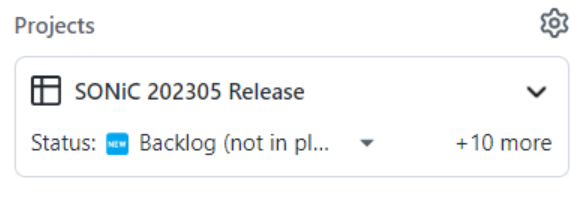
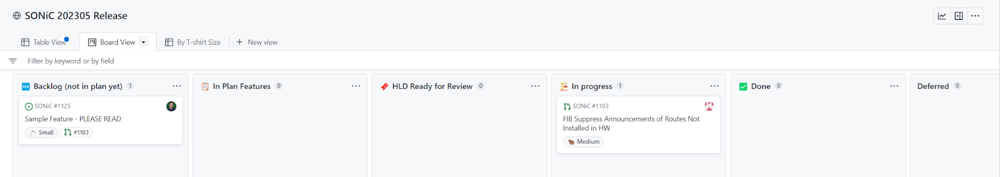
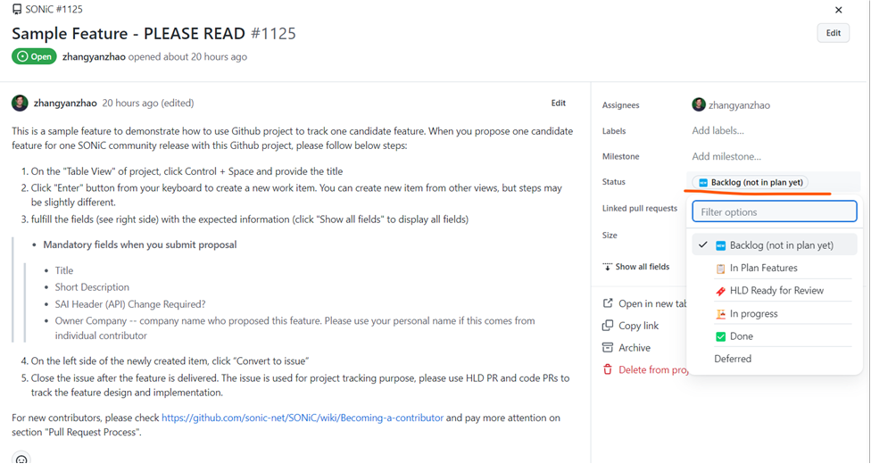

# Github Project User Guide for SONiC Project
Status: Drafting | Ready for Review | Reviewed  

This document provides guidance to use Github project to track SONiC community release. Example is [SONiC 202305 Release](https://github.com/orgs/sonic-net/projects/8)

### Background
Before using Github project, SONiC community used [Google Sheet](https://docs.google.com/spreadsheets/u/0/d/19OkV0WjPcHVK6Xm_uq8dao8FjifP-MicbqEKvmpL8AA/edit) to track the community feature status which required the community leads to update the status periodically and manually. This google sheet is only visible to very limited audience, which is not convenient for others who want to check the release status.
By adopting Github project, we expect to  
1) Reduce the manual effort to update status, add PRs etc by leveraging the seamless integration between Github project and Github PR & Issue etc.  
2) Consolidate the release tracking to Github.  

The Github project is public to anyone who wants to check SONiC release status, no matter if you joined the SONiC community or not, but only limited audiences can edit.

### How to Use?
For people who have NO edit permission to this project but want to contribute, please follow the “Call for participation” message, e.g Re: [Call for participation for SONiC 202305 release](https://lists.sonicfoundation.dev/g/sonic-dev/message/46) (sonicfoundation.dev).  
For people who can edit github project, if you want to propose a new feature from scratch, please refer to Sample Feature - PLEASE READ · [Issue #1125](https://github.com/sonic-net/SONiC/issues/1125) 
 
1) On the "Table View" of project, click Control + Space and provide the Title  
2) Click “Enter” button to create a new work item. You can create new item from other views, but steps may be slightly different.  
3) Fulfill the fields in the ticket (click "Show all fields" to display all fields)  
	* Mandatory fields when you submit proposal
	* Title
	* Short Description
	* SAI Header (API) Change Required?
	* Owner Company -- company name who proposed this feature. Please use your personal name if this comes from individual contributor
4) On the left side of the newly created item, click “Convert to issue”
5) Close the issue after the feature is delivered. The issue is used for project tracking purpose, please use HLD PR and code PRs to track the feature design and implementation.

If the HLD PR already exists, the PR can be added into the release plan by changing the “Projects” field of the PR. Please remember to update the fields info according to the Sample Feature above.

### How to change the status?
There are two ways to update the status of one proposed feature. 

##### Option 1: Drag & drop the feature to different slot on “Board View”

You can drag one feature to another slot to change the status.

##### Option 2: Change the “Status” field on the feature page

### Feature status change flow

1) A new feature proposal will by default go to “Backlog” slot. You can create new feature proposal for future releases in this slot.
2) Once you plan to contribute one specific feature to one specific release, say “SONiC 202305 Release”, you should move that feature to “In Plan Features” slot and leave a comment in the feature PR/Issue by saying “A feature target xxx release”. After this, team should start working on the HLD PR
3) Once the HLD is ready for review by community, the feature should be moved to “HLD Ready for Review” slot and specify an expected “HLD Review Date”. The weekly SONiC community meeting will be used for the HLD review. We will publish the community calendar with Google calendar later, before that, you can pick up a slot which is not booked yet on the project, or ask help from Yanzhao Zhang
4) After the HLD is reviewed in SONiC community, the feature should be moved to “In Progress” slot. Team should update the HLD based on the community feedbacks while working on the code PRs. Code PRs need be added to HLD PR by referring to Pull Request [#806](https://github.com/sonic-net/SONiC/pull/806) 
5) Later, after all code PRs and HLD PR are merged, the feature should be moved to “Done” slot.
6) If one feature need be deferred or withdrawn, the feature should be moved to “Deferred” slot (candidate for next release), or “Backlog” slot (candidate for future releases post next release).

