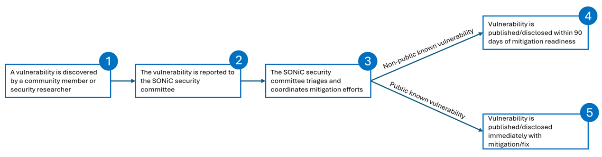

# **Security Vulnerability Management Process for SONiC Community**
This document outlines SONiC vulnerability reporting and management process. SONiC is a popular choice of cloud providers, enterprises, telecom providers, web service providers and others to build their digital infrastructure.  The security of SONiC is vital for the safety and reliability of our digital transformation. The strong and active cooperation among SONiC community members is key to securing SONiC. This process will be shared through https://github.com/sonic-net/SONiC/SECURITY.md file after TSC approval.  The diagram below illustrates the high-level workflow:

## 1.Report SONiC Vulnerability
As a SONiC community member, it is your responsibility to report the discovered vulnerabilities before public disclosure. If you want to report a vulnerability, please use the template suggested by SONiC security committee, encrypt your email and privately send it to security@lists.sonicfoundation.dev. Only SONiC security committee members can access the information in this security mailing list, and they also watch over this mailing list.  When someone reports a new vulnerability, SONiC security committee will assist with the vulnerability assessment, coordinate on the mitigation and fix. If you have a suggested fix or mitigation, please include it in your report. Exploit instruction is very useful and will be kept confidential unless it is already public (published to the CVE® database or other publicly accessible websites and mail lists). SONiC security committee may seek help from SONiC repo maintainers or other domain experts to look into the vulnerability and prepare a mitigation/fix. The collaboration and communication will be private.
We appreciate security researchers and SONiC users that report vulnerabilities to the SONiC Open Source Community. All reports will be investigated thoroughly by the SONiC security committee. 
## 2.Vulnerability Disclosure 
Once a mitigation/fix is reviewed and approved by SONiC security committee, the vulnerability disclosure process starts. 
Mitigation/fix for public known vulnerabilities will be released right away once approved by SONiC security committee. Fix/mitigation for non-public vulnerabilities should also come out as soon as possible, but we may postpone them if the reporter or an affected party request so. However, the delay should be no more than 90 days from when a mitigation/fix is ready. The SONiC security committee should create a template for disclosing vulnerability.
The vulnerability and fix will be published to sonic-security-announce@lists.sonicfoundation.dev  and sonic-dev@lists.sonicfoundation.dev mailing list and a dedicated wiki page hosted in [https://github.com/sonic-net/SONiC](https://github.com/sonic-net/SONiC) repo.
Our focus is on getting vulnerability mitigated as soon as possible. All other information submitted to the security list and any follow-up discussions of the report are treated confidentially even after the embargo has been lifted, in perpetuity.

## 3.SONiC Security Committee
The SONiC security committee is the group that can view the reported vulnerability information, assign investigators for the vulnerability, coordinate the mitigation/fix preparation and approve the final mitigation/fix. The security committee also defines the SONiC security strategy. 
Each TSC member can nominate a representative to initiate the security committee.  Subsequent requests to join the security committee require review and approval by existing members. If a company loses their TSC membership, its representative should also be removed from the security committee. The security committee has a chairman and nominated by the TSC chair. The chairman will coordinate the vulnerability triage, mitigation preparation and security strategy documentation. 
The security committee meets regularly to discuss the current security status of SONiC, review any pending vulnerabilities, and plan for future security improvements. The security committee reports to the TSC on a quarterly basis, the details of undisclosed vulnerability will not be reported. 
## 4.CVE Assignment
SONiC security committee does not issue CVEs. Reporters should figure out their own way to issue CVE, but the CVE  should not be made public before the SONiC security committee discloses the vulnerability. However, SONiC security committee will not postpone a patch update to wait for a CVE published.

