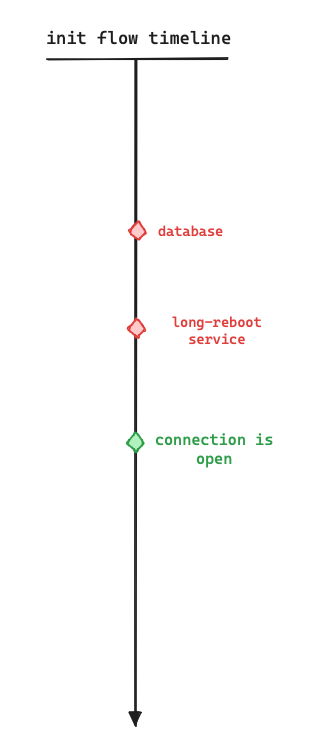

# HLD Name

## Table of contents

-   [Revision](#)

-   [Scope](#scope)

-   [Definitions/Abbreviations](#definitionsabbreviations)

-   [Overview](#overview-we-want-to-give-the-user-the-ability-to-restore-the-local-users-to-the-default-users-and-to-the-default-passwords-in-case-he-forgets-them-by-pushing-the-reset-button-the-switch-long-enough-not-less-than-15-seconds)

-   [Requirements](#requirements-in-this-feature-we-want-to-be-able-to)

-   [Architecture design](#architecture-design)

-   [High level design](#high-level-design)

-   [Configuration and management](#configuration-and-management)

-   [CLI/YANG model Enhancements](#cliyang-model-enhancements)

-   [Config DB Enhancements](#config-db-enhancements)

-   [Warmboot and Fastboot Design Impact](#warmboot-and-fastboot-design-impact)

-   [Memory Consumption](#memory-consumption)

-   [Restrictions/Limitations](#restrictionslimitations)

-   [Testing Requirements/Design](#testing-requirementsdesign)

    -   [Unit Test cases](#unit-test-cases)

    -   [System Test cases](#system-test-cases)

-   [Open/Action items - if any](#openaction-items---if-any)

### 

### 

### 

### 

### Revision

| **Rev** | **Date**   | **Author** | **Change Description** |
|---------|------------|------------|------------------------|
| 1.0     | 17/12/2023 | Azmy Ali   | Base revision          |

### 

### Scope

This section describes the scope of local users’ passwords reset to default on long reset button push in SONiC.

### Definitions/Abbreviations

| Term | Description |
|------|-------------|
|      |             |

### 

### Overview 

We want to give the user the ability to restore the local users to the default users and to the default passwords in case he forgets them by pushing the reset button the switch long enough, not less than 15 seconds.

### Requirements 

In this feature we want to be able to:

	1. Restore the default users’ passwords and expire them on long reset
	2. Delete non-default local users on long reset
	3. Enable / disable the feature

### 

### Architecture Design

In this feature, we want to add a new service to the init flow, that is responsible for resetting the local users’ configurations back to default, which includes deleting non-default local users and resetting default passwords for the default ones and expiring them. The new service is expected to run on the system init before any connection is open to the switch and this includes SSH and serial connection as well.

As show in the diagram, we want to add ‘long-reboot’ service that runs on the init before opening any connection to the system and after database service, that reads the feature state, either disabled or enabled, and in case feature is enabled and long reboot detected the service will reset the local users.

### High-Level Design

### 

This feature will be a built-in SONiC feature. The feature will modify the ‘sonic-host-services’ sub-module, in which will contain the implementation of the service and the unit service files. The feature will introduce a new table to the CONFIG_DB that contains the feature state, either enabled or disabled and will be called ‘LONG_RESET_BUTTON’.

The service is required to run as fast as possible, and it is expected to finish running in milliseconds (150-300 milliseconds) on long reboot, and not delay the init flow more than that.

### Configuration and management

### CLI/YANG model Enhancements

In this feature, we want to add a new CLI command for controlling the feature state.

CLI commands:

1.  config feature state local-users-passwords-reset (enabled \| disabled)

2.  show feature status local-users-passwords-reset

### Config DB Enhancements

In this feature we are going to add a new table to the CONFIG_DB that is responsible for controlling the feature state, either enabled or disabled. The new table will be called ‘LONG_RESET_BUTTON’ and if the feature is disabled the new service will not affect the current init flow.

### Warmboot and Fastboot Design Impact

The feature will not have any impact on fast reboot or warmboot.

### Memory Consumption

This sub-section covers the memory consumption analysis for the new feature: no memory consumption is expected when the feature is disabled via compilation and no growing memory consumption while feature is disabled by configuration.

### Restrictions/Limitations

No limitations and restrictions

### Testing Requirements/Design

#### Unit Test cases

In unit testing we want to see that the feature control commands change the state in the DB.

#### System Test cases

We want to test the following flows:

1.  long reboot and the feature enabled, do reset the local users and passwords, and expire them as well

2.  long reboot and the feature disabled do not change the current init flow

3.  short reboot/warm/fast reboot does not affect the current init flow

### Open/Action items - if any

N/A
