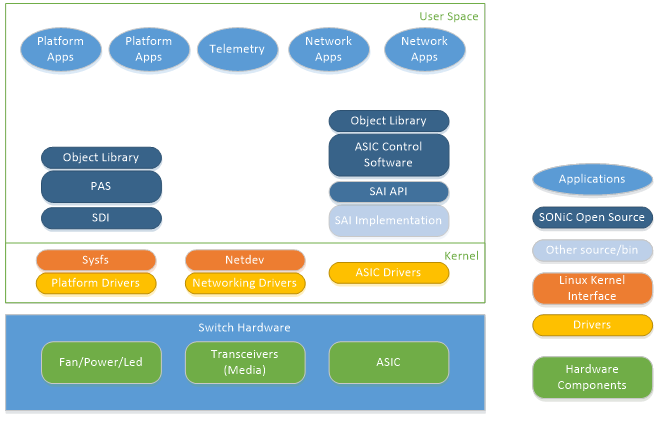
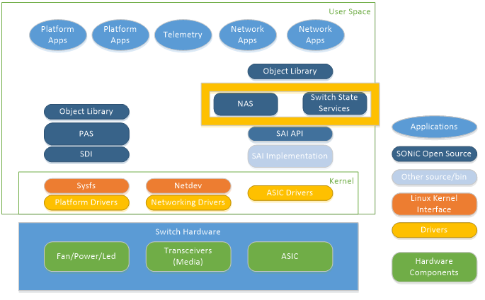
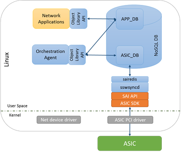
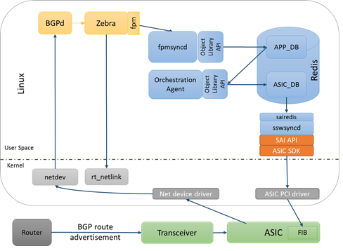
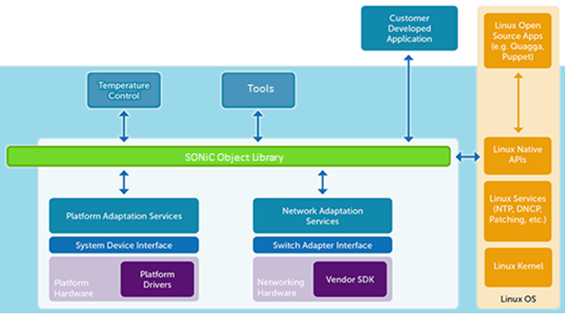

#Software for Open Networking in the Cloud (SONiC) Architecture

Abstract
========

Software for Open Networking in the Cloud (SONiC) is a collection of
software packages installed on Linux running on a network hardware
switch which make it a complete, functional router targeted at data
center networks.

High Level Architecture 
========================

The following picture presents the target SONiC Architecture.

-   Fans
-   Power supplies
-   Media/Transceivers

The right hand side of the picture focuses on the networking 
components including:

-   SAI
-   ASIC Control Software

Figure 1 – Target SONiC High Level Software Design

The current SONiC project implements Switch State Service (SWSS)
as it’s ASIC control software. 
<!---The left side of the picture focuses on supporting platform related
concepts including:NAS is a new ASIC control software that
is in the process of being integrated with SWSS into a single component.

Each one of these will be described in sections below but a high level
picture of both architectures is shown below.

Figure 2- NAS and SWSS merge
--->
Definitions
===========

Switch Hardware
---------------

Switch hardware refers to all the physical components inside the network
switch enclosure (chassis). This includes fans, power supplies, status
LEDs and network transceivers. In SONiC terminology, these are called
“system devices”.

Platform Adaptation Services (PAS)
----------------------------------

The platform abstraction layer is an interface to network switch
hardware peripherals such as transceivers, fans, power supplies and
leds. SONiC exposes these details via the platform abstraction services.

The PAS uses an abstract low-level platform-independent abstraction for
all types of system devices, called System Device Interface (SDI) API.
Therefore, only system device drivers (either user space or kernel
device drivers) which implement the SDI API are hardware-specific, while
the API itself is hardware-independent.

Switch Abstraction Interface (SAI)
----------------------------------

The switch abstraction interface is a standardized C API to the
switching ASIC. This API is normally implemented by an SDK specific to
the Switch ASIC. More information on SAI is available at the [SAI
GitHub](https://github.com/opencomputeproject/SAI) repository.

SAI Host Adapter
----------------

The SAI Host Adapter’s role is to provide a mechanism for storing and
synchronizing network switch data with the Switch ASIC. This includes
initialization, configuration and current status of the switch ASIC.

Network Applications
--------------------

Network applications, such as a BGP routing protocol, use the Object
Libraries API’s to get and set the state of the SONiC SAI Host Adapter.

SONiC Object Library
====================

The object library is updated as PAS <!---and NAS are ---> is integrated into the project. A high level description of the Object library follows.

The SONiC Object Library (Object Library) mediates interactions between
SONiC applications and external applications. The Object Library
defines two types of application roles: clients and
servers. Client applications execute create, set, get, and delete
operations on objects. Server applications execute operations requested
by clients.

In addition, the Object Library implements a publish/subscribe model. 
Server applications publish events; client applications subscribe to 
events and objects. Client applications can subscribe to events generated 
when objects are created, modified, or deleted.

The publish/subscribe approach and object-centric operations allow
for independent operation of client and server applications.  A key tenant 
of the SONiC  architecture is to allows processes to be stopped, started, 
restarted and replaced.

Platform Abstraction Service (PAS)
==================================

The PAS implements the object models associated with system devices such 
as fans, power supplies and leds.  

The PAS monitors the status of system devices and publishes status 
changes or faults as events. It also allows user applications to
retrieve current status information and set the control variables of
system devices.

For example, the PAS Object API allows user applications to:

-   Read current temperature values reported by temperature sensors.

-   Get and set fan speed values.

-   Set a LED state.

-   Read power levels reported by PSUs.

-   Get system inventory and EEPROM information.

-   Set transceiver module state (for example, Tx laser on/off) and get
    module information.

The PAS detects:

-   Common field replaceable units (FRUs), such as PSUs and fans, and
    insertion and removal events.

-   Over-temperature events for pre-defined temperature thresholds.

-   Transceiver insertion on physical ports.

### System Device Interface (SDI)

Below the PAS is the System Device Interface (SDI).  A system device 
refers to a hardware component, such as:

-   Fans/cooling devices

-   Power supplies

-   Temperature sensors

-   LEDs

-   EEPROM

-   Programmable devices

-   Transceivers

All hardware components except for NPUs are abstracted as system
devices.

The SDI API defines a low-level platform-independent abstraction for all
types of system devices. Only system device drivers that implement the
SDI API are hardware-specific; the API itself is hardware-independent.

The implementation of the SDI API can use any approach suitable for a
given platform or vendor:

-   'sysfs' access to Linux kernel device drivers 

-   user space devices drivers using UIO or other methods

-   new vendor specific kernel modules, accessible through sysfs,
    netlink or ioctl calls

-   combination of any of the above methods

In general, other approaches not mentioned above are also possible, as
long as the implementation supports the SDI API.

An application will use the PAS Object model through the Object Library.
The PAS service will use the SDI (System Device Interface) to access the
drivers which will (as an option) communicate with the Sysfs file system
which in turn communicates with the actual hardware device drivers.

Switch State Service (SwSS) – Switch control
============================================

Architecture Overview
---------------------

### Overview

The Switch State Service (SwSS) is a collection of software that
provides a database interface for communication with and state
representation of network applications and network switch hardware.

Figure 3 – Switch State Service High Level Design

Network applications read and write to APP\_DB. Example applications
include a netlink route syncer, quagga FPM route syncer, access control
list (ACL) control, QoS control, load balancer, telemetry control and so
on.

Orchestration agents read and write data between APP and ASIC
databases. Orchestration agents are responsible for any necessary
logic to verify and transform application data into SAI objects.

The syncd process reads and writes SAI objects between the ASIC\_DB and
the SAI SDK.

### Key value database

A key value database was chosen to provide a language independent
interface, a method for data persistence, replication and multi-process
communication. An API wrapper is implemented in swss/common which
implements transactions, convenience methods and allows the database
storage engine to be changed in the future if necessary. Redis was
chosen as the underlying database engine, but this could be changed in
the future.

### Network applications

Using the SwSS API, SONiC network applications are written to be
entirely independent of the lower layer communication details to the
hardware. Applications subscribe only to the data views they require and
avoid implementation details that are not specific for their
functionality. Examples of applications that intended to interface with
SwSS include: Layer 3 routing, Layer 2 bridging, Access control lists
(packet filtering), Quality of service, Telemetry streaming, tunneling,
link aggregation, load balancing and policy based routing to name a few.

### Orchestration Agent

This process contains logic for transforming and copying data between
the APP tables and the ASIC tables.

There must only be one producer for each ASIC table. Currently there is
just one orchestration agent, although others could be added over time.

Only a single Orchestration Agent may write to an ASIC\_DB table.

### syncd

The switch sync daemon syncd copies data between the ASIC\_DB tables and
a SAI compliant ASIC SDK. There must only be one syncd process per SAI
SDK instance.

Database Implementation
-----------------------

SwSS implements the concept of a table in redis by naming keys with
prefixes. A producer / consumer design is implemented to ensure
integrity of data.

APP\_ tables are designed for each use case. For example, ROUTE\_TABLE
and NEIGH\_TABLE.

ASIC\_ tables are created from the SAI header files. For example
ASIC\_sai\_unicast\_route\_entry\_t and ASIC\_sai\_neighbor\_entry\_t.

### Table Operations

\[TODO: link to github, .h files, API’s for common table operations\]

Producer

> SET – insert or update a key -&gt; fields and values.
>
> DEL – deletes a key

Consumer

> POP – get a table change notification, the key name and the
> key-&gt;fields and values and operation \[SET, DEL\].
>
> SELECT – check if a table notification exists.

### Transactions

SwSS implements transactions internally so producers and consumers can
to stay in sync with the database using a queue-like method.

For each ‘TABLE’, there are QUEUE keys used for internal implementation
of notifications. Here is an example of how it works.

The intfsyncd process performs a SET to the APP.INTF\_TABLE using the
swss producer API. The producer API SETs the key/value in the TABLE and
SETs an equivalent entry for each of the QUEUE keys.

The orchestration agent (OA) is a CONSUMER of the APP.INTF\_TABLE. OA
will receive a notification from the swss consumer API that there is a
data change on APP.INTF\_TABLE. The consumer API will POP the KEY, VALUE
and OP from the QUEUE keys. The data the intfsyncd wrote to the
APP.INTF\_TABLE remains untouched.

See the code for more details.

Tablename+”\_KEY\_QUEUE”

Tablename+”\_VALUE\_QUEUE”

Tablename+”\_OP\_QUEUE”

Switch Data Service Database Schema
-----------------------------------

### Overview

Two databases are defined, APP and ASIC. Applications outside of SwSS
are expected to store data by adding keys with well-defined names into
the APP database. The ASIC database stores data used by hardware sync
agents. Keys in the ASIC database are expected named strictly following
SAI attributes.

Keys must be prefixed with a string that looks like a table name. The
allowed keys are “\[a-z\]\[A-Z\]\[0-9\]\_” and end with “\_TABLE:”

In redis, databases are only defined my numbers:

Database 0 = APP\_DB

Database 1 = ASIC\_DB

Database 7 = TEST (used for unit testing)

### Schema

The SwSS schema is defined at:
https://github.com/Azure/sonic-swss/blob/master/doc/swss-schema.md

### Database 1 – ASIC\_DB

The ASIC database stores data used by hardware sync agents. Keys in the
ASIC database are named strictly following SAI attributes. See
<https://github.com/opencomputeproject/SAI>

Switch state service Layer 3 Implementation
-------------------------------------------

### L3 Route learning example

This section provides an example of how a BGP route is learned and
propagated to the ASIC. Quagga is used as an example, but other routing
applications could be used.

Figure 4 – Learn bgp route

<!---
Network Abstraction Services (NAS) Switch Control
=================================================

The Network Adaptation Service (NAS) manages the high level network
processor (NPU) abstraction and adaptation. The NAS abstracts
and aggregates the core functionality required for networking access at
Layer 1 (physical layer), Layer 2 (VLAN, link aggregation), Layer 3
(routing), ACL, QoS and network monitoring. The NAS enables adaptation
of the low level switch abstraction provided by the Switch Abstraction
Interface to:

-   Standard Linux networking APIs and Linux Interfaces

-   SONiC specific Object Library API functionality.

In addition, the NAS is responsible for providing packet I/O services,
using the Linux kernel IP stack.

Networking Features
-------------------

The SONiC NAS Host-adapter allows you to model and configure various
networking features in the network processing unit (NPU) using two
methods: Linux commands and SONiC Object Library APIs. See the
[NAS Application Programming guide](https://github.com/Azure/sonic-nas-manifest/) 
for a description of the SONiC Object Library framework.

The Network Adaptation Service (NAS) handles networking functionality.
The NAS daemon accepts commands from the object library and listens
to netlink events for Layer 2 and Layer 3 configurations, and programs
the NPU.

Supported NAS Features 
------------------------------

  --------------------------------------------------------------------------------------
  **Networking Feature**     **Configure with Linux Commands/**   **Configure with SONiC Library API**
                                                                  
                             **Linux Native APIs**                
  -------------------------- ------------------------------------ --------------------------------------
  **Interfaces**

  Physical                   Yes                                  Yes

  Link Aggregation           Yes (Bond)                           Yes

  VLAN                       Yes                                  Yes

  Fanout (4x10G)             No                                   Yes (script)

  **Layer 2 Bridging**

  LLDP                       Yes                                  Yes

  MAC Address Table          No                                   Yes

  STP                        Yes                                  Yes

  VLAN                       Yes                                  Yes

  **Layer 3 Routing**

  ECMP                       Yes                                  Yes

  IPv4                       Yes                                  Yes

  IPv6                       Yes                                  Yes

  Unicast Routing            Yes                                  Yes

  **QoS**                    No                                   Yes

  **ACL**                    No                                   Yes

  **Monitoring**

  Port Mirroring             No                                   Yes

  sFlow                      No                                   Yes

  Port and VLAN statistics   No                                   Yes
  ------------------------------------------------------------------------------------------------------

Layer 3 Features 
-----------------

The SONiC NAS Host-Adaptor supports unicast routing over Linux
interfaces using routes in the Linux kernel routing table. Applications
can also use the SONiC Object Library API to configure routes.

The SONiC NAS Host-Adaptor routing subsystem manages the forwarding
information base (FIB). The routing subsystem programs routes with
resolved next hops using ARP/Neighbor table entries received from the
Linux kernel.

Both IPv4 and IPv6 are supported. Adding routes can be done via the
Linux “ip” command or through the Object Library. See the [NAS Application Programming guide](https://github.com/Azure/sonic-nas-manifest/) for more details.

Object Model
------------

[Object model
definitions](https://github.com/Azure/sonic-object-model-schema) are
used to generate C header files included by client and server
applications. The SONiC C/C++ representation of objects and their
attributes is designed to ensure compatibility between multiple versions
of the object model.

SONiC provides both C/C++ and Python programming interfaces for the
Object Library.
--->
Porting New Hardware to SONiC
=============================

Porting new hardware to SONiC is very important to support and much
thought has gone into making it as simple as possible.

There are two main components required to port SONiC to a new hardware
platform.

-   Platform device drivers

-   SAI implementation for the target NPU

The SONiC PAS architecture through the SDI layer can be adapted to any
possible driver interface and has been designed to be as generic as
possible in order to support as many platforms as possible but we
recommend the use of the sysfs interface. In the future the SONiC project 
will provide a plug-in interface that will simplify integration of a 
sysfs to the SDI interface.

Devices that are currently supported by the SONiC Platform include

-   Fans/cooling devices

-   Power supplies

-   Temperature sensors

-   LEDs

-   EEPROM

-   Programmable devices (PLD)

-   Transceivers

Appendix
========

References
==========
