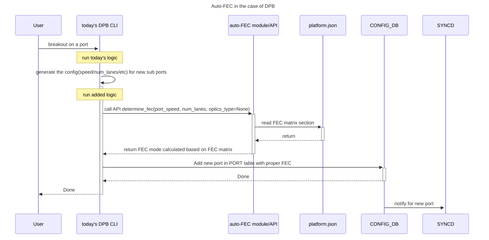
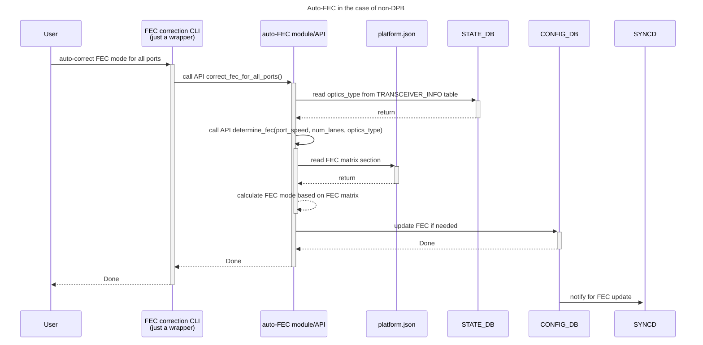

FEC matrix in platform.json:
```
{
"fec_matrix": [
    {
        "port_speed": 10,
        "num_lanes": 4,
        "fec": ["none", "kr"]
    },
    {
        "port_speed": 20,
        "num_lanes": 2,
        "fec": ["none"]
    },
    {
        "port_speed": 25,
        "num_lanes": 2,
        "fec": ["none", "rs(kp4/kr4)"]
    },
    {
        "port_speed": 25,
        "num_lanes": 4,
        "fec": ["none", "rs(kp4/kr4)"]
    },
    {
        "port_speed": 25,
        "num_lanes": 8,
        "fec": ["rs kp4"]
    },
    {
        "port_speed": 50,
        "num_lanes": 1,
        "fec": ["rs(kp4/kr4)"]
    },
    {
        "port_speed": 50,
        "num_lanes": 4,
        "fec": ["rs(kp4)"]
    },
    {
        "port_speed": 50,
        "num_lanes": 8,
        "fec": ["rs(kp4)"]
    },
    {
        "port_speed": 50,
        "num_lanes": 16,
        "fec": ["rs(kp4)"]
    },
    {
        "port_speed": 50,
        "num_lanes": 2,
        "fec": ["rs(kp4/kr4/kp4_fi)"]
    }
]
}
```