# Local ARS HLD #

## Table of Content 

- [Revision](#revision)
- [Definitions/Abbreviations](#definitionsabbreviations)
- [Scope](#scope)
- [Overview](#overview)
- [Requirements](#requirements)
- [Architecture Design](#architecture-design)
- [High Level Design](#high-level-design)
- [Sequence diagrams](#sequence-diagrams)
- [SAI API](#sai-api)
- [CLI/YANG model Enhancements](#yang-model-enhancements)
- [Config DB Enhancement](#config-db-enhancements)
- [Warmboot and Fastboot Design Impact](#warmboot-and-fastboot-design-impact)
- [Restrictions/Limitations](#restrictionslimitations)
- [Unit Test cases](#unit-test-cases)
- [System Test cases](#system-test-cases)

### Revision  

| Revision | Date        | Author           | Change Description |
| -------- | ----------- | ---------------- | ------------------ |
| 1.0      | Dec 01 2024 | Vladimir Kuk     | Initial proposal   |

### Definitions/Abbreviations 

| Definitions/Abbreviation | Description |
| ------------------------ | ----------- |
| ARS  | Adaptive Routing and Switching |
| NHG  | Nexthop Group |
| ECMP | Equal Cost MultiPath |
| LAG  | Link Aggregation Group |
| ACL  | Access List |
| SAI  | Switch Abstraction Layer |
| VRF  | Virtual routing and forwarding |

### Scope

This high-level design document describes the implementation for Local ARS in SONiC.

### Overview 

**Existing Forwarding Decision Model**

Today, the routing protocol or SDN controller decides the reachability of a given destination and finds all possible paths. These paths may be equal cost or unequal cost. The decision to choose of one the paths from all available paths is done in the switch pipeline based on a computed hash. This path selection is static in nature based on the packet fields. Hash based selection doesn't take into account the dynamic state of the local or end-to-end path.

Control plane protocols exist for traffic engineering paths, but involves control plane decisions that are very slow to react to changing traffic patterns in the network or state of interfaces.

Adaptive Routing System (ARS) allows dynamic selections of the best available path for data packets based on real-time network conditions. This approach helps to mitigate congestion, optimize resource utilization, and improve overall network performance.

No standard exists, but there is an industry consensus for general approach.

The following illustrates the common operation of ARS, in which two paths are considered - one shortest (minimal) and another (non-minimal), when forwarding traffic to the destination. When shortest path becomes congested, the alternative will be used.

__Figure 1: ARS in network__<br>
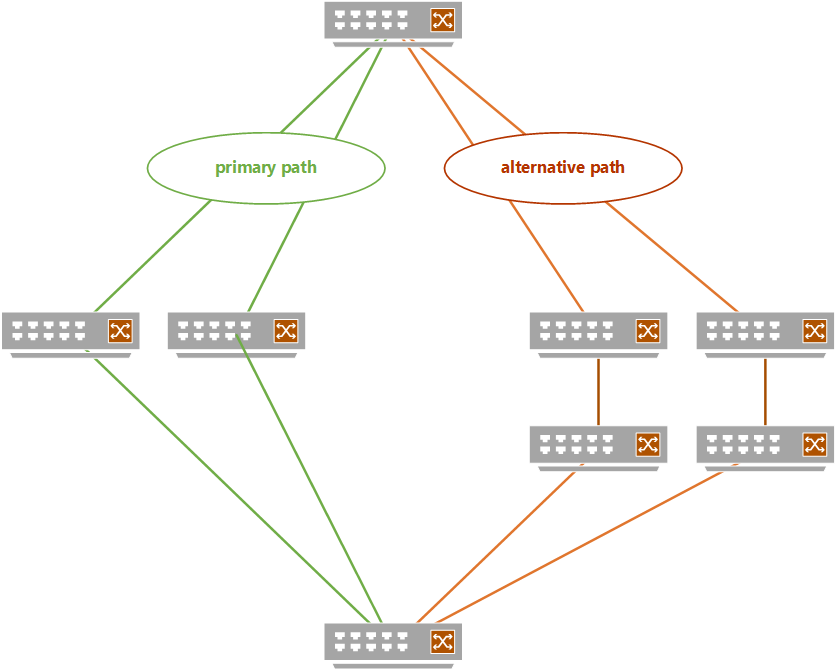

ARS can be divided into two parts:
- Local ARS - Scope of this HLD, focuses on dynamic path selection within a single device. It enables more granular control over routing decisions by considering the real-time utilization of local egress ports. This is achieved by monitoring local port utilization, identifying micro flows inside of incoming macro flow and assigning best available path.
- Global ARS - focuses on selecting non-congested path to end host by exchanging ports utilization data, between remote devices.

This design follows SAI conceptual model described in https://github.com/opencomputeproject/SAI/blob/master/doc/ARS/Adaptive-Routing-and-Switching.md.


The diagram illustrates a Conceptual Packet Flow, where macro flows are collections of multiple micro flows that share the same routing destination. Micro flows, identified by a 5-tuple (source IP, destination IP, protocol, source port, destination port), are hashed, and if several micro flows hash to the same bucket, they are grouped into a macro flow. These flows are further segmented into flow-lets based on idle time thresholds between packets. A Macro Flow Table maps these flows to next-hop destinations and tracks their status (e.g., "active" or "expired"). Using Adaptive Routing within an ECMP group, the system dynamically assigns traffic based on link quality metrics like latency and packet loss.

__Figure 2: ARS Packet Flow__

This diagram outlines a Logical Pipeline Flow for Adaptive Routing with ARS. Flow starts with L3 Route Lookup to identify the appropriate Next-Hop Group (NHG). If ARS is enabled, the system generates an ARS Macro Flow ID and assigns packets to specific next-hop destinations using a Macro Flow Table. Otherwise, traffic undergoes standard ECMP processing. In the background, ARS monitors port load metrics (past and future) and updates the Macro Flow Table using adaptive algorithms and quality thresholds to ensure optimal traffic distribution based on real-time link conditions.

__Figure 3: ARS SAI Pipeline Flow__


### Requirements

1. Support different ARS modes:
    - Flowlet-based port selection
    - Per packet port selection
2. Support enabling ARS over NHG or LAG
3. Support path quality configuration
4. Support ACL action to disable ARS 

### Architecture Design 

The following orchestration agents will be added or modified. The flow diagrams are captured in a later section.

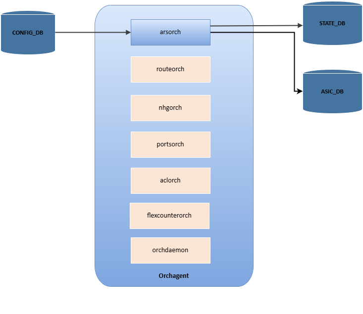
__Figure 5: Orchestration agents__

#### ArsOrch
arsorch - it is an orchestration agent that handles the configuration requests from CONFIG_DB. It is responsible for creating the SAI ARS profile and configuring SAI ARS object. 

#### Orchdaemon
orchdaemon - it is the main orchestration agent, which handles all Redis DB's updates, then calls appropriate orchagent, the new arsorch should be registered inside the orchdaemon.

#### RouteOrch
routeOrch monitors operations on Route related tables in APPL_DB and converts those operations in SAI commands to manage IPv4/IPv6 route and nexthops. New functionality for quering and configuring ARS-enabled NHG.

#### PortsOrch
portsorch handles all ports-related configurations. New functionality for enabling ARS on ports.

#### AclOrch
aclorch is used to deal with configurations of ACL table and ACL rules. New rule action for control ARS operation.

ARS is closely tied to vendor-specific hardware implementations, requiring thorough validation of all configurations using SAI capabilities.

### High-Level Design 

- A standard ARS configuration consists of creating an ARS profile and enabling ARS on the designated ports. This process also includes activating ARS for nexthop groups (Adaptive Routing) and LAGs (Adaptive Switching). At present, configurations are carried out manually via CONFIG_DB, with potential future enhancements to incorporate management through an external controller or routing protocol extensions.


- New orchagent: ArsOrch responsible for 
1. Creating/Updating ARS profile 
2. Enable interfaces for ARS
3. Enable ARS over nexthop group
4. Allow configuration of path metrics
5. Disabling ARS with ACL action

- ACL changes<br>
When a new ACL table is created, SAI needs to receive a list of supported actions which the rules belonging to this table are allowed to use.
To support the new ARS disable action, the custom table types table schema will be extended with a ARS action attribute - "ARS_ACTION" for the actions attribute field.

The diagrams below illustrate the typical sequences for ARS configuration, showcasing key workflows for both Adaptive Routing and Adaptive Switching.

#### Sequence diagrams

__Figure 6: Initilization flow__
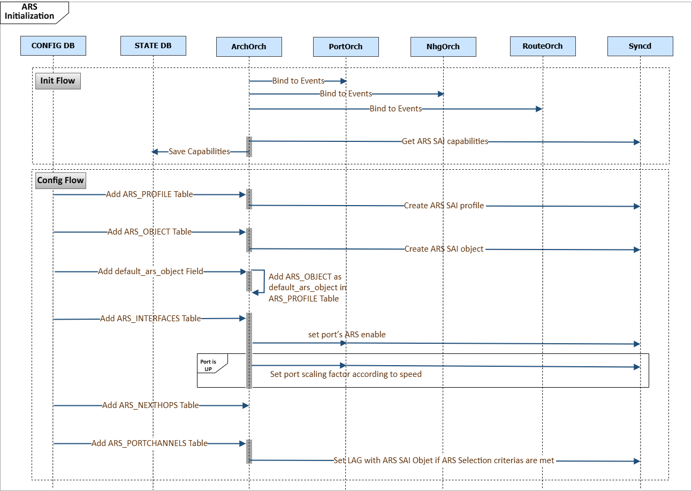

1. Bind to Events
The ArsOrch component binds to relevant events to start monitoring and processing ARS-related interfaces.

2. Get ARS SAI Capabilities
ArsOrch retrieves ARS capabilities from the SAI layer and saves them in STATE_DB.

3. Add ARS_PROFILE Table
The CONFIG_DB adds the ARS_PROFILE table, which defines the ARS configuration parameters.
ArsOrch uses this to create the ARS SAI profile.

4. Add ARS_INTERFACE Table
The CONFIG_DB adds the ARS_INTERFACE table, causing ArsOrch to enable ARS on the corresponding ports.

__Figure 7: Interface update flow__
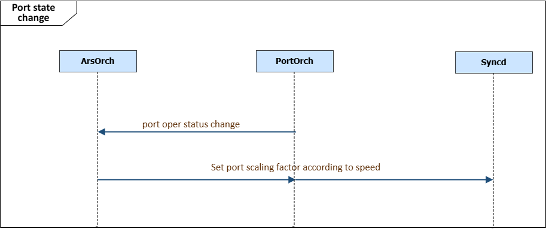

1. Link UP Notification
The PortsOrch component detects a link state change and notifies ArsOrch when a port transitions to the "UP" state.

2. Set Port Scaling Factor
Based on the port's speed, PortsOrch determines the appropriate scaling factor.
The scaling factor is then set in the SAI layer through the syncd component to adjust the port's behavior accordingly.

__Figure 8: ARS Nexthop group table creation flow__
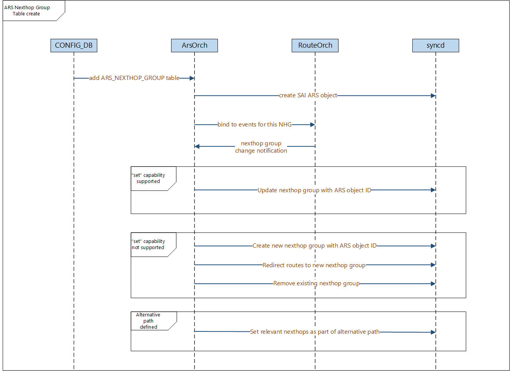

1. Add ARS_NEXTHOP_GROUP Table
    * The CONFIG_DB adds the ARS_NEXTHOP_GROUP table, triggering the process.
2. Create SAI ARS Object
    * The ArsOrch component receives the update and creates the SAI ARS object.
3. ArsOrch binds to events from RouteOrch related to the newly created NHG.
4. Nexthop group's SAI attributes handling:
    * If nexthop group's ARS object ID, "set" capability is supported:
        - The nexthop group is updated with the ARS object ID.
    * If "set" capability is not supported - implement via "create":
        - Remove existing nexthop group.
        - And create a new nexthop group with the ARS object ID.
    * If an alternative path is defined
        - Set the relevant nexthops as part of the alternative path.

__Figure 9: Nexthop group creation flow__
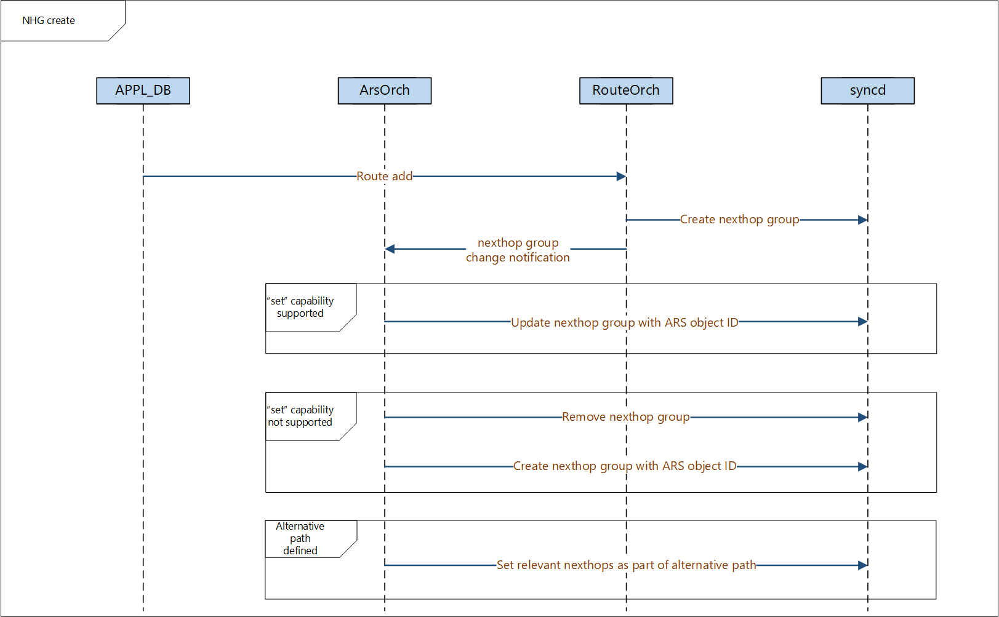

1. Nexthop group creation
    * RouteOrch receives route from APPL_DB, triggering the process.
    * Neexthop group is created
2. Notification
    * RouteOrch component will notify ArsOrch of NHG update.
4. Nexthop group's SAI attributes handling:
    * The nexthop group members are set as part of alternative path.

__Figure 10: Nexthop group update flow__
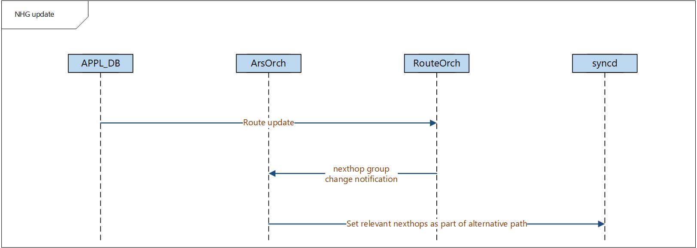

1. Nexthop group update
    * RouteOrch receives route update from APPL_DB, triggering the process.
    * Neexthop group is updated with new member
2. Notification
    * RouteOrch component will notify ArsOrch of NHG update.
4. Nexthop group's SAI attributes handling:
    * If nexthop group's ARS object ID, "set" capability is supported:
        - The nexthop group is updated with the ARS object ID.
    * If "set" capability is not supported - implement via "create":
        - Remove existing nexthop group.
        - And create a new nexthop group with the ARS object ID.
    * If an alternative path is defined
        - Set the relevant nexthops as part of the alternative path.

__Figure 10:ARS LAG table creation flow__
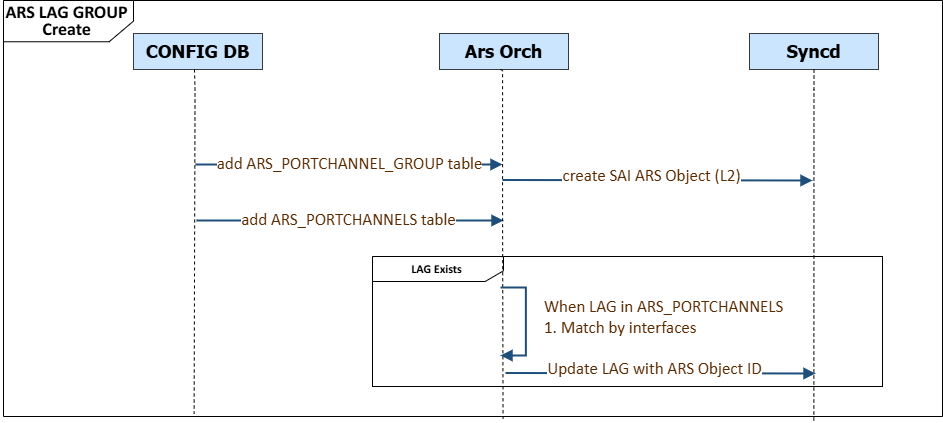

1. Add ARS_PORTCHANNEL Table
    * The CONFIG_DB adds the ARS_PORTCHANNEL table, triggering the process.
2. Create SAI ARS Object
    * The ArsOrch component receives the update and creates the SAI ARS object.
4. LAG's SAI attributes handling:
    * If LAG was created:
        - It is updated with the ARS object ID.

__Figure 11:LAG creation flow__
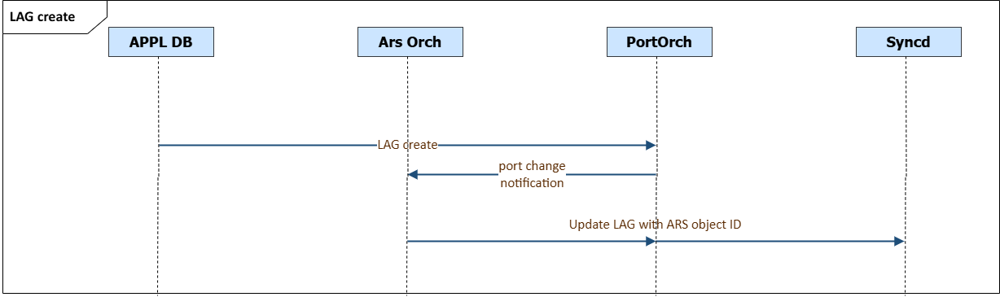

1. LAG creation
    * PortsOrch receices LAG from APPL_DB, triggering the process.
2. Notification
    * PortsOrch component will notify ArsOrch of LAG creation.
4. LAG's SAI attributes handling:
    * LAG is updated with the ARS object ID.

__Figure 12:LAG member addition flow__
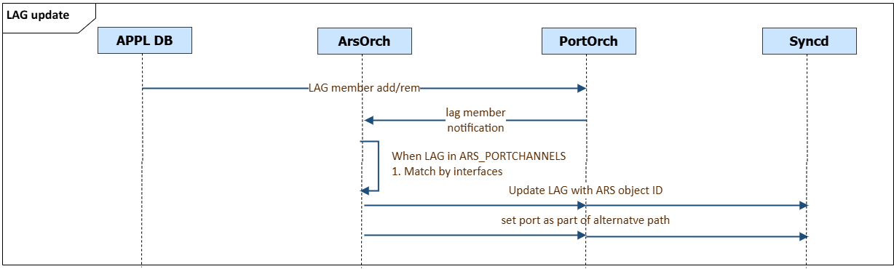

1. LAG change
    * PortsOrch receices LAG member from APPL_DB, triggering the process.
2. Notification
    * PortsOrch component will notify ArsOrch of LAG member change.
4. LAG's SAI attributes handling:
    * If an alternative path is defined
        - Set the relevant port as part of the alternative path.

__Figure 13:ACL configuration flow__
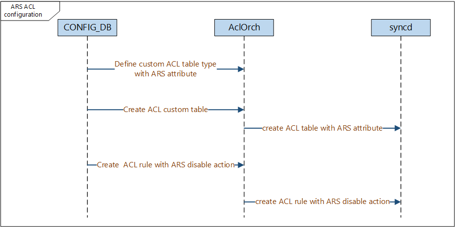

1. Users define custom ACL table type in ACL_TABLE_TYPE with ARS_ACTION type.
2. ACL table added, referencing the custom table type.
3. ACL rule added, referencing ARS disable action.

### SAI API 

There are no new SAI APIs or attributes required.

Following table lists SAI usage and supported attributes with division to phase implementation:

| SAI api | Supported SAI attribute 
| ------- | ----------------------- 
|create_ars_profile | SAI_ARS_PROFILE_ATTR_PORT_LOAD_PAST<br>SAI_ARS_PROFILE_ATTR_LOAD_PAST_MIN_VAL<br>SAI_ARS_PROFILE_ATTR_LOAD_PAST_MAX_VAL<br>SAI_ARS_PROFILE_ATTR_ENABLE_IPV4<br>SAI_ARS_PROFILE_ATTR_ENABLE_IPV6<br>SAI_ARS_PROFILE_ATTR_MAX_FLOWS<br>SAI_ARS_PROFILE_ATTR_ALGO<br>SAI_ARS_PROFILE_ATTR_PORT_LOAD_FUTURE<br>SAI_ARS_PROFILE_ATTR_PORT_LOAD_PAST_WEIGHT<br>SAI_ARS_PROFILE_ATTR_PORT_LOAD_FUTURE_WEIGHT<br>SAI_ARS_PROFILE_ATTR_QUANT_BANDS<br>SAI_ARS_PROFILE_ATTR_QUANT_BAND_0_MIN_THRESHOLD ... SAI_ARS_PROFILE_ATTR_QUANT_BAND_7_MIN_THRESHOLD<br>SAI_ARS_PROFILE_ATTR_QUANT_BAND_0_MAX_THRESHOLD ... SAI_ARS_PROFILE_ATTR_QUANT_BAND_7_MAX_THRESHOLD<br>SAI_ARS_PROFILE_ATTR_LOAD_FUTURE_MIN_VAL<br>SAI_ARS_PROFILE_ATTR_LOAD_FUTURE_MAX_VAL<br>SAI_ARS_PROFILE_ATTR_LOAD_CURRENT_MIN_VAL<br>SAI_ARS_PROFILE_ATTR_LOAD_CURRENT_MAX_VAL<br>SAI_ARS_PROFILE_ATTR_SAMPLING_INTERVAL
|create_ars | SAI_ARS_ATTR_MODE<br>SAI_ARS_MODE_FLOWLET_QUALITY<br>SAI_ARS_MODE_PER_PACKET_QUALITY<br>SAI_ARS_ATTR_IDLE_TIME<br>SAI_ARS_ATTR_MAX_FLOWS<br>SAI_ARS_ATTR_PRIMARY_PATH_QUALITY_THRESHOLD<br>SAI_ARS_ATTR_ALTERNATE_PATH_COST
|set_port_attribute|SAI_PORT_ATTR_ARS_ENABLE<br>SAI_PORT_ATTR_ARS_PORT_LOAD_SCALING_FACTOR<br>SAI_PORT_ATTR_ARS_ALTERNATE_PATH
|create_next_hop_group|SAI_NEXT_HOP_GROUP_ATTR_ARS_OBJECT_ID
|create_next_hop_group_member|SAI_NEXT_HOP_GROUP_MEMBER_ATTR_ARS_ALTERNATE_PATH
|create_acl_entry|SAI_ACL_ACTION_TYPE_DISABLE_ARS_FORWARDING
|set_lag_attribute|SAI_LAG_ATTR_ARS_OBJECT_ID

### Configuration and management 

#### YANG model Enhancements 

##### ARS_PROFILE

```
    container ARS_PROFILE {

        list ARS_PROFILE_LIST {

            key "profile_name";
            max-elements 1;

            leaf profile_name {
                description "ARS Profile Name";
                type string;
            }

            leaf algorithm {
                description "ARS quality algorithm";
                type enumeration {
                    enum ewma {
                        description "Exponentially Weighted Moving Average algorithm";
                    }
                }
            }

            leaf max_flows {
                type uint32;
                description  "Maximum number of flows that can be maintained per ARS profile.";
            }

            leaf sampling_interval {
                type uint32;
                description  "Sampling interval in microseconds for quality measure computation.";
            }

            leaf past_load_min_value {
                type uint16;
                description "Past load min value.";
            }

            leaf past_load_max_value {
                type uint16;
                description "Past load max value.";
            }

            leaf past_load_weight {
                type uint16;
                description "Past load weight.";
            }

            leaf future_load_min_value {
                type uint16;
                description "Future load min value.";
            }
            leaf future_load_max_value {
                type uint16;
                description "Future load max value.";
            }

            leaf future_load_weight {
                type uint16;
                description "Future load weight.";
            }

            leaf current_load_min_value {
                type uint16;
                description "Current load min value.";
            }

            leaf current_load_max_value {
                type uint16;
                description "Current load max value.";
            }

            leaf ipv4_enable {
                type boolean;
                description "Whether ARS is enabled over IPv4 packets";
            }

            leaf ipv6_enable {
                type boolean;
                description "Whether ARS is enabled over IPv6 packets";
            }
        }
        /* end of list ARS_PROFILE_LIST */
    }
    /* end of container ARS_PROFILE */
```

##### ARS_QUANTIZATION_BANDS

```
    container ARS_QUANTIZATION_BANDS {

        list ARS_QUANTIZATION_BANDS_LIST {
            key "profile_name band_index";
            max-elements 8;

            leaf profile_name {
                description "ARS profile Name";
                type leafref {
                    path "/sars:sonic-ars/sars:ARS_PROFILE/sars:ARS_PROFILE_LIST/sars:profile_name";
                }
            }

            leaf band_index {
                type uint8;
                description "Index of the qunatization band";
            }

            leaf min_value {
                type uint16;
                description "Minimum value in Mbps to use for the qunatization band creation";
            }

            leaf max_value {
                type uint16;
                description "Minimum value in Mbps to use for the qunatization band creation";
            }
        }
        /* end of list ARS_QUANTIZATION_BANDS_LIST */
    }
    /* end of container ARS_QUANTIZATION_BANDS */
```

##### ARS_INTERFACE

```
    container ARS_INTERFACE {

        list ARS_INTERFACE_LIST {
            description  "List of interfaces participating in ARS";
            key "if_name";

            leaf if_name {
                type leafref {
                    path "/port:sonic-port/port:PORT/port:PORT_LIST/port:name";
                }
                description "ARS-enabled interface name";
            }
        }
        /* end of list ARS_INTERFACE_LIST */
    }
    /* end of container ARS_INTERFACE */
```

##### ARS_NEXTHOP_GROUP

```
    container ARS_NEXTHOP_GROUP {

        description "ARS-enabled Nexthop Groups";

        list ARS_NEXTHOP_GROUP_LIST {

            key "ip_prefix vrf_name";

            leaf ip_prefix{
                type stypes:sonic-ip-prefix;
                description "Ip prefix which identifies nexthop group for which ARS behavior is desired";
            }

            leaf vrf_name {
                type union {
                    type string {
                        pattern "default";
                    }
                    type leafref {
                        path "/vrf:sonic-vrf/vrf:VRF/vrf:VRF_LIST/vrf:name";
                    }
                }
                description "VRF name";
            } 

            leaf profile_name {
                description "ARS profile Name";
                type leafref {
                    path "/sars:sonic-ars/sars:ARS_PROFILE/sars:ARS_PROFILE_LIST/sars:profile_name";
                }
            }

            leaf assign_mode {
                type enumeration {
                    enum per_flowlet_quality{
                        description "Per flow-let assignment based on flow quality";
                    }
                    enum per_packet {
                        description "Per packet flow assignment based on port load";
                    }
                }
            }

            leaf flowlet_idle_time {
                type uint16;
                description  "Idle duration in microseconds. This duration is to classifying a flow-let in a macro flow.";
            }

            leaf max_flows {
                type uint32;
                description  "Maximum number of flow states that can be maintained per ARS object.";
            }

            leaf primary_path_threshold {
                type uint32;
                description  "Primary path metric";
            }

            leaf alternative_path_cost {
                type uint32;
                description  "Alternative path cost";
            }

            leaf-list alternative_path_members {
                type inet:ip-address;
                description "NHG members participating in alternative path";
            }
        }
        /* end of list ARS_NEXTHOP_GROUP_LIST */
    }
    /* end of container ARS_NEXTHOP_GROUP */
```

##### ARS_PORTCHANNEL

```
    container ARS_PORTCHANNEL {

        description "ARS-enabled LAGs";

        list ARS_PORTCHANNEL_LIST {

            key "if_name";

            leaf if_name{
                type leafref {
                    path "/lag:sonic-portchannel/lag:PORTCHANNEL/lag:PORTCHANNEL_LIST/lag:name";
                }
                description "Interface name which identifies LAG for which ARS behavior is desired";
            }

            leaf profile_name {
                description "ARS profile Name";
                type leafref {
                    path "/sars:sonic-ars/sars:ARS_PROFILE/sars:ARS_PROFILE_LIST/sars:profile_name";
                }
            }

            leaf assign_mode {
                type enumeration {
                    enum per_flowlet_quality{
                        description "Per flow-let assignment based on flow quality";
                    }
                    enum per_packet {
                        description "Per packet flow assignment based on port load";
                    }
                }
            }

            leaf flowlet_idle_time {
                type uint16;
                description  "Idle duration in microseconds. This duration is to classifying a flow-let in a macro flow.";
            }

            leaf max_flows {
                type uint32;
                description  "Maximum number of flow states that can be maintained per ARS object.";
            }

            leaf primary_path_threshold {
                type uint32;
                description  "Primary path metric";
            }

            leaf alternative_path_cost {
                type uint32;
                description  "Alternative path cost";
            }

            leaf-list alternative_path_members {
                type leafref {
                    path "/port:sonic-port/port:PORT/port:PORT_LIST/port:name";
                }
                description "Members of the LAG participating in alternative path";
            }
        }
        /* end of list ARS_PORTCHANNEL_LIST */
    }
    /* end of container ARS_PORTCHANNEL */

```

##### ACL_RULE changes

```
    container sonic-acl {

        container ACL_RULE {

            description "ACL_RULE part of config_db.json";

            list ACL_RULE_LIST {

                key "ACL_TABLE_NAME RULE_NAME";

                leaf ACL_TABLE_NAME {
                    type leafref {
                        path "/acl:sonic-acl/acl:ACL_TABLE/acl:ACL_TABLE_LIST/acl:ACL_TABLE_NAME";
                    }
                }

                leaf RULE_NAME {
                    type string {
                        length 1..255;
                    }
                } 
...
                leaf DISABLE_ARS_FORWARDING {
                    description "Disable ARS forwarding on matching packets";
                    type boolean;
                    default false;
                }
            }
         }
    }
```

#### Config DB Enhancements  

```
; New container ARS_PROFILE_TABLE
; ARS global configuration

key                     = ARS_PROFILE|profile_name

;field                  = value

algorithm               = "ewma"        ;Path quality calculation algorithm
max_flows               = uint32        ;Maximum number of flows that can be maintained for ARS
sampling_interval       = uint32        ;Sampling interval in microseconds
past_load_min_value     = uint16        ;Minimum value of Past load range.
past_load_max_value     = uint16        ;Maximum value of Past load range.
past_load_weight        = uint16        ;Weight of the past load
future_load_min_value   = uint16        ;Minimum value of Future load range.
future_load_max_value   = uint16        ;Maximum value of Future load range.
future_load_weight      = uint16        ;Weight of the future load
current_load_min_value  = uint16        ;Minimum value of Current load range.
current_load_max_value  = uint16        ;Maximum value of Current load range.
ipv4_enable             = boolean       ;Whether ARS is enabled over IPv4 packets
ipv6_enable             = boolean       ;Whether ARS is enabled over IPv6 packets


Configuration exmaple:

"ARS_PROFILE": {
    "default": {
        "algorithm": "ewma",
        "max_flows" : 512,
        "sampling_interval": 10,
        "past_load_min_value" : 0,
        "past_load_max_value" : 100,
        "past_load_weight": 1,
        "future_load_min_value" : 0,
        "future_load_max_value" : 1000,
        "future_load_weight": 5.
        "ipv4_enable" : "true",
        "ipv6_enable" : "true"
    }
}
```

```
; New table ARS_QUANTIZATION_BANDS_TABLE
; ARS path quality quantization configuration

key                 = ARS_QUANTIZATION_BANDS|profile_name|band_index

;field              = value

min_value           = uint16            ;Minimum value for this quantization band
max_value           = uint16            ;Maximum value for this quantization band

Configuration exmaple:

"QUANTIZATION_BANDS": {
    "default|0": {
        "min_value" : 0,
        "max_value" : 100
    }
},
""QUANTIZATION_BANDS": {
    "default|1": {
        "min_value" : 100,
        "max_value" : 200
    }
}
```

```
; New table ARS_INTERFACE_TABLE
; ARS interfaces configuration

key                      = ARS_INTERFACE|if_name          ;ifname is the name of the ARS-enabled interface

Configuration exmaple:

"ARS_INTERFACE": {
    "flowlet-based | Ethernet0" : {},
    "flowlet-based | Ethernet8" : {}
}
```

```
; New table ARS_NEXTHOP_GROUP_TABLE
; Nexhop groups enabled for ARS

key                      = ARS_NEXTHOP_GROUP|ip_prefix|vrf_name     ;Route prefix identifing nexhop-group 

;field                   = value

profile_name             = string                                   ;ARS profile Name
assign_mode              = "per_flowlet_quality" / "per_packet"     ;member selection assignment mode
flowlet_idle_time        = uint16                                   ;idle time for decting flowlet in macro flow. Relevant only for assign_mode=pre_flowlet
max_flows                = uint16                                   ;Max number of flows supported for ARS
primary_path_threshold   = uint16                                   ;Quality threshold for primary path 
alternative_path_cost    = uint16                                   ;cost of switching to alternative path
alternative_path_members = inet-address                             ;Alternative path members address

Configuration exmaple:

"ARS_NEXTHOP_GROUP": {
    "192.168.0.100/32|default" : {
        "profile_name": "ars_profile",
        "assign_mode" : "per_flowlet_quality",
        "flowlet_idle_time" : 256,
        "max_flows" : 512,
        "primary_path_threshold" : 100,
        "alternative_path_cost": 250
        "alternative_path_members": {"1.1.1.1", "2.2.2.2"}
    }
}
```

```
; New table ARS_PORTCHANNEL_TABLE
; LAGs enabled for ARS

key                      = ARS_PORTCHANNEL|if_name                  ;Interface name identifing LAG 

;field                   = value

profile_name             = string                                   ;ARS profile Name
assign_mode              = "per_flowlet_quality" / "per_packet"     ;port selection assignment mode
flowlet_idle_time        = uint16                                   ;idle time for decting flowlet in macro flow. Relevant only for assign_mode=pre_flowlet
max_flows                = uint16                                   ;Max number of flows supported for ARS
primary_path_threshold   = uint16                                   ;Quality threshold for primary path 
alternative_path_cost    = uint16                                   ;cost of switching to alternative path
alternative_path_members = string                                   ;Members of the LAG participating in alternative path

Configuration exmaple:

"ARS_PORTCHANNEL": {
    "PortChannel1" : {
        "profile_name": "ars_profile",
        "assign_mode" : "per_flowlet_quality",
        "flowlet_idle_time" : 256,
        "max_flows" : 512,
        "primary_path_threshold" : 100,
        "alternative_path_cost": 250
        "alternative_path_members": {"Ethernet0", "Ethernet10"}
    }
}
```


```

; Existing table ACL_RULE_TABLE
; ACL action for disabling ARS


key                     = ACL_TABLE_TYPE|TYPE_NAME

;field                  = value

matches                 = match-list                    ; list of matches for this table.
                                                        ; matches are same as in ACL_RULE table.
actions                 = action-list                   ; list of actions for this table.
                                                        ; [ ... , "ARS_ACTION"]

Configuration example:

"ACL_TABLE_TYPE": {
    "CUSTOM_1_ARS": {
        "MATCHES": [
            "SRC_IP",
        ],
        "ACTIONS": [
            "ARS_ACTION"
        ],
    }
}
"ACL_TABLE|MY_ACL_1": {
    "policy_desc": "Disable ARS operation",
    "type": "CUSTOM_1_ARS",
    "ports": [
        "Ethernet2",
        "Ethernet4",
        "Ethernet7"
    ],
    "OP": "SET"
},
```

```
; Existing table ACL_RULE_TABLE
; ACL action for disabling ARS


key                     = ACL_RULE|ACL_TABLE_NAME|RULE_NAME

;field                  = value

DISABLE_ARS_FORWARDING  = boolean                       ;ARS operation disabled on matching packets

Configuration example:

"ACL_RULE": {
    "CUSTOM_1_ARS|NO_ARS" : {
        "SRC_IP": "10.2.130.0/24",
        "DISABLE_ARS_FORWARDING" : "true",
        "OP": "SET"
    }
}
```


### Counters

Following counters defined in SAI and will be supported via FlexCounters:

| Level            | Supported SAI counters  |
| ---------------- | ----------------------- |
| lag              | SAI_LAG_ATTR_ARS_PACKET_DROPS<br>SAI_LAG_ATTR_ARS_PORT_REASSIGNMENTS
| nexthop group    | SAI_NEXT_HOP_GROUP_ATTR_ARS_PACKET_DROPS<br>SAI_NEXT_HOP_GROUP_ATTR_ARS_NEXT_HOP_REASSIGNMENTS<br>SAI_NEXT_HOP_GROUP_ATTR_ARS_PORT_REASSIGNMENTS|


### Warmboot and Fastboot Design Impact
During warmboot or fastboot, both ARS and ACL rules configurations are restored from the CONFIG_DB.
Counter polling is delayed at system startup.


### Restrictions/Limitations
Implementation will be done in two phases. 
1. Phase 1 will support: 
    - Primary path only
    - Single quality parameter (past load)
2. Phase 2 will support:
    - Alternative path
    - Quantization bands
    - Other quality parameters (future, current)


#### Unit Test cases  

Tests separated into two group - mandatory and optional (only if supported by vendor sai) parts.

- Manadatory:

1. ARS Profile Creation
    * Verify that ARS profiles are created successfully with valid parameters.
    * Test error handling for invalid profile configurations.

2. Enabling ARS on Ports
    * Ensure ARS is enabled on specified ports.
    * Validate behavior when enabling ARS on unsupported or non-participating ports.

3. ARS for Nexthop Groups
    * Confirm that ARS correctly applies to nexthop groups for Adaptive Routing.
    * Check load balancing when overload single member
    * Test failover scenario on link down.
    * Check load balancing when adding/removing Nexthop Group member

4. ARS over LAGs
    * Validate ARS behavior over Link Aggregation Groups (LAGs) for Adaptive Switching.
    * Check load balancing when overload single port
    * Test failover scenario on link down.
    * Check load balancing when adding/removing port.

- Optional:
1. Path quality metrics
    * Verify future load affect on load-balancing
    * Verify current load affect on load-balancing
2. Quantization bands
    * Verify min/max values for band
    * Change band values - verify path change
3. Alternative path 
    * Verify switching to alternative path for NHG
    * Verify switching to alternative path for LAG

#### System Test cases
1. Warm/Fast reboot
    * Verify that ARS configurations are preserved across reboots.
    * verify that ACL configurations are preserved across reboots.
