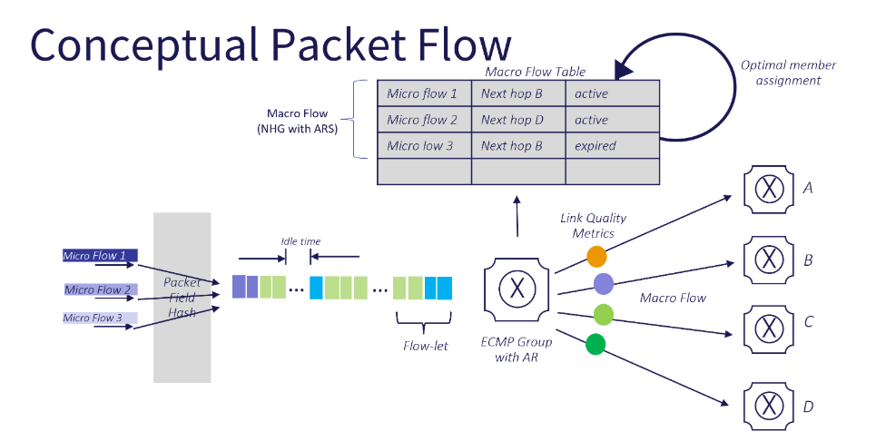
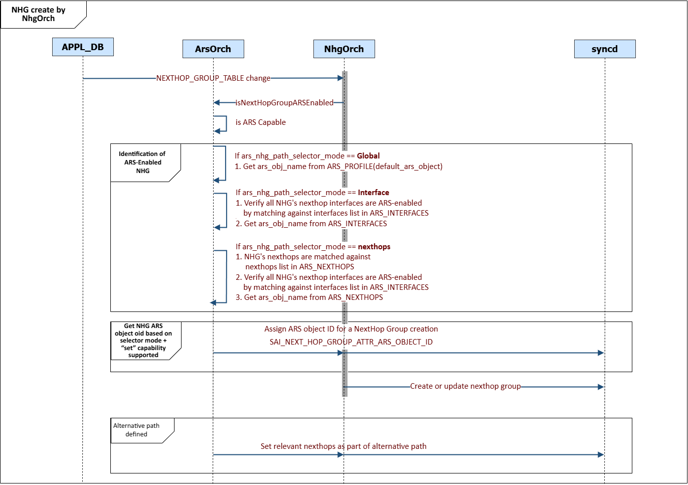

# Local ARS HLD #

## Table of Content 

- [Revision](#revision)
- [Definitions/Abbreviations](#definitionsabbreviations)
- [Scope](#scope)
- [Overview](#overview)
- [Use cases](#use-cases)
- [Requirements](#requirements)
- [Architecture Design](#architecture-design)
- [High Level Design](#high-level-design)
- [Sequence diagrams](#sequence-diagrams)
  - [Initialization Flow](#figure-4-initilization-flow)
  - [Interface Update Flow](#figure-5-interface-update-flow)
  - [Nexthop group table created by RouteOrch flow](#figure-6-nexthop-group-table-created-by-routeorch-flow)
  - [Nexthop group table created by NhgOrch flow](#figure-7-nexthop-group-table-created-by-nhgorch-flow)
  - [ARS LAG Table Creation Flow](#figure-8-ars-lag-table-creation-flow)
  - [LAG Table Creation Flow](#figure-9-lag-creation-flow)
  - [LAG Member Addition Flow](#figure-10-lag-member-addition-flow)
  - [ACL Configuration Flow](#figure-11-acl-configuration-flow)
- [SAI API](#sai-api)
- [CLI/YANG model Enhancements](#configuration-and-management)
- [Yang mode Enchancements](#yang-model-enhancements)
  - [ARS_PROFILE table](#ars_profile)
  - [ARS_OBJECT table](#ars_object)
  - [ARS_NEXTHOPS table](#ars_nexthops)
  - [ARS_INTERFACES table](#ars_interfaces)
  - [ARS_PORTCHANNELS table](#ars_portchannels)
  - [ACL_RULE table](#acl_rule)
- [Config DB Enhancement](#config-db-enhancements)
- [State Db Enhancement](#state-db-enhancements)
- [Counters](#counters)
- [Warmboot and Fastboot Design Impact](#warmboot-and-fastboot-design-impact)
- [Restrictions/Limitations](#restrictionslimitations)
- [Unit Test cases](#unit-test-cases)
- [System Test cases](#system-test-cases)

### Revision  

| Revision | Date        | Author                    | Change Description            |
| -------- | ----------- | ------------------------- | ----------------------------- |
| 1.0      | Dec 01 2024 | Vladimir Kuk              | Initial proposal              |
| 1.1      | Apr 21 2025 | Vladimir Kuk              | Review comments update        |
| 1.2      | May 12 2025 | Vladimir Kuk              | Addressing community comments |
| 1.3      | May 28 2025 | Ashok Kumar/Gnana Priya   | Addressing community comments |
| 1.4      | Oct 8 2025  | Ashok Kumar/Gnana Priya   | Addressing community comments |

### Definitions/Abbreviations 

| Definitions/Abbreviation | Description |
| ------------------------ | ----------- |
| ARS  | Adaptive Routing and Switching  |
| NHG  | Nexthop Group                   |
| ECMP | Equal Cost MultiPath            |
| LAG  | Link Aggregation Group          |
| ACL  | Access Control List             |
| SAI  | Switch Abstraction Interface    |
| VRF  | Virtual Routing and Forwarding  |

### Scope

This high-level design document describes the implementation for Local ARS in SONiC.

### Overview 

**Existing Forwarding Decision Model**

Today, routing protocols or SDN controllers establish destination reachability and compute all possible paths, whether equal-cost or unequal-cost. However, the selection of a specific path from the available ECMP paths is performed statically in the switch data plane, driven by a hash computed over packet header fields. This static hashing mechanism does not account for real-time path conditions of the local or end-to-end path, as a result, once a path is chosen, the packet flow remains locked to that path, leading to inefficient load balancing and potential network hotspots.
Control plane protocols exist for traffic engineering paths, but involves control plane decisions that are very slow to react to changing traffic patterns in the network or state of interfaces.

Adaptive Routing and Switching (ARS) allows dynamic selections of the best available path for data packets based on real-time network conditions. This approach helps to mitigate congestion, optimize resource utilization, and improve overall network performance.

No standard exists, but there is an industry consensus for general approach.

ARS can be divided into two parts:
- Local ARS - Scope of this HLD, focuses on dynamic path selection within a single device. It enables more granular control over routing decisions by considering the real-time utilization of local egress ports. This is achieved by monitoring local port utilization, identifying micro flows inside of incoming macro flow and assigning best available path.
- Global ARS - focuses on selecting non-congested path to end host by exchanging ports utilization data, between remote devices.

This design follows SAI conceptual model described in https://github.com/opencomputeproject/SAI/blob/master/doc/ARS/Adaptive-Routing-and-Switching.md.

The diagram illustrates a Conceptual Packet Flow, where macro flows are collections of multiple micro flows. Micro flows, identified by a 5-tuple (source IP, destination IP, protocol, source port, destination port), are hashed, and if several micro flows hash to the same bucket, they are grouped into a macro flow. These flows are further segmented into flow-lets based on idle time thresholds between packets. A Macro Flow Table maps these flows to next-hop destinations and tracks their status (e.g., "active" or "expired"). Using Adaptive Routing within an ECMP group, the system dynamically assigns traffic based on link quality metrics like latency and packet loss.

__Figure 1: ARS Packet Flow__

This diagram outlines a Logical Pipeline Flow for Adaptive Routing with ARS. Flow starts with L3 Route Lookup to identify the appropriate Next-Hop Group (NHG). If ARS is enabled, the system generates an ARS Macro Flow ID and assigns packets to specific next-hop destinations using a Macro Flow Table. Otherwise, traffic undergoes standard ECMP processing. In the background, ARS monitors port load metrics (past and future) and updates the Macro Flow Table using adaptive algorithms and quality thresholds to ensure optimal traffic distribution based on real-time link conditions.

__Figure 2: ARS SAI Pipeline Flow__


### Use cases
- L3 traffic egressing via NHG
    * NH pointing to port
    * NH pointing to lag
    * NH pointing to SVI (VLAN)
- L2 traffic egressing via LAG
- Tunnel interface as egress interface is not supported
- After NHG is enabled through ARS, modifications to VLAN members - including additions, deletions, or MAC address movement will no longer initiate ARS re-selection

### Requirements

## Phase 1
    - Support different ARS modes,
          - Flowlet-based port selection
          - Per-packet port selection
    - Support path quality configuration
    - Support ACL action to disable ARS 
    - Support enabling ARS for NHGs managed by RouteOrch, 
          - Determine NHG eligibility for ARS based on ARS profile ars_nhg_path_selector_mode.

## Phase 2
    - Support enabling ARS for NHGs managed by NhgOrch, 
          - Determine NHGs eligibility for ARS based on ARS profile ars_nhg_path_selector_mode.
    - Support enabling ARS over LAG
    - Support Alternative path for ECMP and LAG
    - Support for Statistics

### Architecture Design 

The following orchestration agents will be added or modified. The flow diagrams are captured in a later section.


###### Figure 3: Orchestration Agents

#### Orchdaemon
orchdaemon - it is the main orchestration agent, which handles all Redis DB's updates, then calls appropriate orchagent, the new arsorch should be registered inside the orchdaemon.

#### ArsOrch
arsorch - it is an ARS orchestration agent that handles the configuration requests from CONFIG_DB.
arsOrch is also responsible for the following
     - Creating the SAI ARS profile
     - Creating the SAI ARS object
     - Event Handling for NHG and LAG
     - Performs ARS selection based on the configured mode
     - Updating NHG/LAG with ARS object ID

#### RouteOrch
routeOrch monitors operations on Route related tables in APPL_DB and converts those operations in SAI commands to manage IPv4/IPv6 route, nexthops and nexthop group. New functionality for identifying and configuring ARS-enabled NHG.

#### NhgOrch
nhgOrch monitors operations on Nexthop Group related tables in APPL_DB and converts those operations in SAI commands to optimize performance when multiple routes using same NHG. New functionality for identifying and configuring ARS-enabled NHG.

#### PortsOrch
portsorch handles all ports-related configurations. New functionality for enabling ARS on ports.

#### AclOrch
aclorch is responsible for managing the configurations of ACL table and ACL rules. New ACL rule action for controlling ARS operation.

```
ARS is closely tied to vendor-specific hardware implementations, requiring thorough validation of all configurations
(apis and attributes) using SAI capabilities.
```

### High-Level Design 

ARS configuration consists of creating an ARS profile, ARS object and enabling ARS on the required ports, if necessary. This process also includes activating ARS for nexthop groups (Adaptive Routing) and LAGs (Adaptive Switching). At present, configurations are carried out statically via CONFIG_DB, with potential future enhancements to incorporate management through an external controller or routing protocol extensions.

- A New OrchAgent module, ArsOrch, is introduced to orchestrate ARS-related functionalities such as,
     - Support for ARS profile 
     - Support for ARS object
     - Enable/Disable interfaces for ARS
     - Support ARS nexthops config for ARS object selection
     - Support ARS over portchannel
     - Enable/Disable portchannels for ARS object selection
     - Allow configuration of path metrics

- ACL changes<br>
When a new ACL table is created, SAI needs to receive a list of supported actions that can be allowed to rules within that table.
To enable support for the new ARS disable action, the custom table type schema will be extended to include a new action attribute 
- "DISABLE_ARS_FORWARDING" as part of the actions attribute field.

**Table interactions**:

1. ARS_PROFILE defines the ARS global configuration parameters. ArsOrch uses this to create the ARS profile in SAI. 
   Currently, only a single profile is supported. If multiple profiles are required, the SAI implementation must also be enhanced to accommodate this functionality.
    
2. ARS_OBJECT table used to specify ARS object configuration parameters. ArsOrch uses this to create the ARS SAI object.

3. ARS_INTERFACES holds list of L2 egress interfaces which are ARS-enabled. NHG will be considered ARS-enabled when all of its associated nexthop interfaces are present in the configured ARS_INTERFACES when the match mode configured in ARS_PROFILE is interface-based.

4. ARS_NEXTHOPS holds list of nexthops which are used for identifying ARS-enabled NHG. This table is applicable only when ars_nhg_path_selector_mode in ARS_PROFILE is nexthop.
NHG will be considered ARS-enabled when all of its associated nexthops are present in the configured ARS_NEXTHOPS entries and additionally its interface should be L2 ARS-enabled interfaces.

5. ARS_PORTCHANNELS table hold list of lag interfaces enabled for ARS.

There are different options for NHG creation. Two modes of operation are supported:

1. NHG created by RouteOrch. APPL_DB adds entry to ROUTE_TABLE with explicit set of nexthops.

2. NHG created by NhgOrch. APPL_DB first adds an entry to the NEXTHOP_GROUP_TABLE and later adds an entry to the ROUTE_TABLE with a reference to the previously created NHG. This mode of operation will be supported only when the Nexthop group's SAI ARS object id attribute "set" capability is supported, to prevent NHG recreations when multiple routes point to the updated NHG.

**ARS selection for Nexthop group**

The ars_nhg_path_selector_mode field in ARS_PROFILE defines the scope at which ARS selection for NH groups is applied.
The system supports three distinct modes:

**1. Global**:
In global mode, ARS selection for NHG is managed at a system-wide level. Only ARS_PROFILE and ARS_OBJECT need to be configured.
After creating an ARS_OBJECT, the user is responsible for assigning it to the default_ars_object field in the ARS_PROFILE.

**2. Interface**:
In interface mode, ARS selection for NHG is applied based on interface. Users must create ARS_INTERFACES, in addition to ARS_PROFILE and ARS_OBJECT.  
Each ARS_INTERFACES is associated with the appropriate ARS_OBJECT, allowing different interfaces to use different ARS selection logic.

**3. Nexthop**:
In nexthop mode, ARS selection for NHG is applied based on the specific list of nexthops from ARS_NEXTHOPS.
Configuration requires the creation of ARS_PROFILE, ARS_OBJECT, ARS_INTERFACES and ARS_NEXTHOPS.  

This mode provides the most granular level of control, enabling ARS over a specific list of nexthops.

**ARS selection for LAG**
The ars_lag_path_selector_mode field in ARS_PROFILE defines how ARS selection is applied for ARS_PORTCHANNEL configurations.
This setting controls whether ARS selection for LAG is handled globally or per interface.
The system supports the following two modes:

**1. Global**:
In global mode, ARS selection for LAG is managed at a system-wide level. Only ARS_PROFILE, ARS_OBJECT and ARS_PORTCHANNELS need to be configured.  
After creating an ARS_OBJECT, the user must assign it to the default_ars_object field in the ARS_PROFILE.  

This mode simplifies the management configuration for ARS selection.

**2. Interface**:
In interface mode, ARS selection for LAG is applied on a per-interface basis. The user is responsible for creating ARS_INTERFACES, in addition to ARS_PROFILE, ARS_OBJECT and ARS_PORTCHANNEL.  
Each ARS_INTERFACE is associated with a ARS_OBJECT, allowing different interfaces to use different ARS selection logic.

**Important Consideration**:

Configuration Guidelines
- Interfaces participating in ARS should be properly configured in the ARS_INTERFACE table.
- For ARS functionality to operate consistently, all interfaces that belong to the same NHG or LAG must be associated with a same ARS object.

List of scenario that will not trigger ARS re-selection
 - Removal of interfaces from the ARS_INTERFACE table.
 - Modification of the ARS_OBJECT associated with ARS interfaces.
 - Once NHG is enabled through ARS, any changes to VLAN members—such as additions, deletions, or MAC address movements—will no longer trigger ARS re-selection.

The diagrams below illustrate the typical sequences for ARS configuration, showcasing key workflows for both Adaptive Routing and Adaptive Switching.
#### Sequence diagrams

##### __Figure 4: Initilization flow__


1. Bind to Events
    - Events from PortOrch
        * The ArsOrch component binds to following events to start monitoring and processing ARS-related interfaces:
            - Port operational status
            - Port change
            - Lag member change
    - Events from RouteOrch
        * The ArsOrch component binds to route updates to monitor nexthop group changes.
    - Events from NhgOrch
        * The ArsOrch component binds to nexthop group updates to monitor nexthop group changes.

2. Get ARS SAI Capabilities
    * ArsOrch retrieves ARS capabilities from the SAI layer and saves them in STATE_DB.

3. Add ARS_PROFILE Table
    * The CONFIG_DB adds the ARS_PROFILE table, which defines the ARS configuration parameters. ArsOrch uses this to create the ARS profile in SAI.

4. Add ARS_OBJECT Table
    * The CONFIG_DB adds the ARS_OBJECT table, which defines the ARS object specific configuration parameters. ArsOrch uses this to create the ARS SAI object (logically a ARS SAI object).

5. ARS_NEXTHOPS Table
    * The CONFIG_DB adds the ARS_NEXTHOPS table, which specifies which nexthops are used for identifying ARS object. If all of nexthops in added NHG, exist in ARS_NEXTHOPS and are pointing to ARS-enabled L2 interface, that NHG is eligible for ARS.

6. Add ARS_INTERFACES Table
    * The CONFIG_DB adds the ARS_INTERFACES table, causing ArsOrch to enable ARS on the corresponding ports and also used for identifying ARS object.
  
7. Add ARS_PORTCHANNELS Table
    * The CONFIG_DB adds the ARS_PORTCHANNELS table, which enables ARS capabilities for the LAG and to associate LAG to alternative_path.

##### __Figure 5: Interface update flow__


1. Link UP Notification
    * The PortsOrch component detects a link state change and notifies ArsOrch when a port transitions to the "UP" state.

2. Set Port Scaling Factor
    * If the scaling factor is set to zero, PortsOrch determines the appropriate scaling factor based on the port’s speed. Otherwise, it uses the scaling factor specified in the configuration. <br>The scaling factor is then set in the SAI layer through the syncd component to adjust the port's behavior accordingly.

##### __Figure 6: Nexthop group table created by RouteOrch flow__


1. Add ROUTE_TABLE Table
    * The APPL_DB adds the ROUTE_TABLE table, triggering the process.
2. Identification of ARS-enabled NHG
    * RouteOrch component will call ArsOrch function when a prefix has a nexthop list of size greater than 1.
    * ArsOrch will check for ARS capability.
    * For any change in the nexthop list of the prefix, ARS selection would be re-triggered.
    * ArsOrch reads the "ars-nhg_path_selector_mode" from ARS_PROFILE and determines ARS enablement for the prefix based on configured mode,
        - In global based mode, system-wide selection.
        - In interface-based mode, only the interfaces will be matched.
        - In nexthop-based mode, both the nexthops and the interfaces will be matched.
3. Nexthop group's SAI attributes handling:
    * If ARS is enabled, The nexthop group is updated with the ARS object ID.
    * If an alternative path is defined:
        - Identify the relevant nexthops by matching them against the entries in the ARS_NEXTHOPS table with the role set to "alternative_path."
        - Set these nexthops as part of the alternative path by updating the SAI attributes for the nexthop group or member accordingly.
4. RouteOrch will create NHG with ARS object id only when ArsOrch identify the prefix as ARS enabled.
    * If SAI returns SAI_STATUS_TABLE_FULL or SAI_STATUS_INSUFFICIENT_RESOURCES, RouteOrch will attempt
      reprogramming of NHG without ARS object, if ARS enabled.

##### __Figure 7: Nexthop group table created by NhgOrch flow__


1. Add NEXTHOP_GROUP_TABLE Table
    * The APPL_DB adds the NEXTHOP_GROUP_TABLE table, triggering the process.
2. Identification of ARS-enabled NHG
    * NhgOrch component will call ArsOrch function when NHG is added/modified.
    * ARS orch reads the "ars-nhg_path_selector_mode" from ARS_PROFILE and determines ARS enablement for NHG based on configured mode,
        - In global based mode, system-wide selection.
        - In interface-based mode, only the interfaces will be matched.
        - In nexthop-based mode, both the nexthops and the interfaces will be matched.
3. Nexthop group's SAI attributes handling:
    * If nexthop group's ARS object ID "set" capability is supported:
        - The nexthop group is updated with the ARS object ID.
    * If "set" capability is not supported - ignore NHG update.
    * If an alternative path is defined:
        - Identify the relevant nexthops by matching them against the entries in the ARS_NEXTHOPS table with the role set to "alternative_path."
        - Set these nexthops as part of the alternative path by updating the SAI attributes for the nexthop group or member accordingly.
4. Add ROUTE_TABLE Table
    * The APPL_DB adds the ROUTE_TABLE table, triggering the process.
5. Route creation
    * RouteOrch creates/updates route with NHG reference.

##### __Figure 8: ARS LAG table creation flow__


1. Add ARS_OBJECT Table
    * The CONFIG_DB adds the ARS_OBJECT table, triggering the process.
2. Identification of ARS-enabled LAG
    * ARS will determine whether ARS_PROFILE's ars_lag_path_selector_mode is global-based or interface-based.
        - In interface-based mode, only the interfaces will be matched.
2. Add ARS_PORTCHANNELS Table 
    * The CONFIG_DB adds to enables ARS capabilities for the LAG and to associate LAG to alternative_path.
      ARS_PORTCHANNELS is mandatory when ARS_PROFILE's ars_lag_path_selector_mode is interface-based.
3. Create SAI ARS Object
    * The ArsOrch component receives the update and creates the SAI ARS object.
4. LAG's SAI attributes handling:
    * ARS checks the state of the LAG members interface's ARS capability and proceeds only if ARS is enabled.
    * If LAG was created:
        - It is updated with the ARS object ID.

##### __Figure 9: LAG creation flow__


1. LAG creation
    * PortsOrch receives LAG from APPL_DB, triggering the process.
2. Identification of ARS-enabled LAG
    * PortsOrch component will call ArsOrch function when LAG member is changed.
    * ARS orch reads the "ars-lag_path_selector_mode" from ARS_PROFILE and determines ARS enablement for LAG based on configured mode,
        - In global based mode, system-wide selection.
        - In interface-based mode, only the interfaces in the LAG will be checked.
3. LAG's SAI attributes handling:
    * LAG is updated with the ARS object ID.

##### __Figure 10: LAG member addition flow__


1. LAG change
    * PortsOrch receives LAG member from APPL_DB, triggering the process.
2. Notification
    * PortsOrch component will notify ArsOrch of LAG member change.
3. Identification of ARS-enabled LAG
    * ARS will determine whether ARS_PROFILE's ars_lag_path_selector_mode is global-based or interface-based.
        - In interface-based mode, only the interfaces will be matched.
4. LAG's SAI attributes handling:
    * ARS checks the state of the LAG members interface's ARS capability and proceeds only if ARS is enabled.
    * If an alternative path is defined
        - Set the relevant port as part of the alternative path.

##### __Figure 11: ACL configuration flow__


1. Users define custom ACL table type in ACL_TABLE_TYPE with DISABLE_ARS_FORWARDING type.
2. ACL table added, referencing the custom table type.
3. ACL rule added, referencing ARS disable action.

### SAI API 

There are no new SAI APIs or attributes required.

Following table lists SAI usage and supported attributes with division to phase implementation:

* Phase 1

| SAI api | Supported SAI attribute 
| ------- | ----------------------- 
|create_ars_profile | SAI_ARS_PROFILE_ATTR_PORT_LOAD_PAST<br>SAI_ARS_PROFILE_ATTR_LOAD_PAST_MIN_VAL<br>SAI_ARS_PROFILE_ATTR_LOAD_PAST_MAX_VAL<br>SAI_ARS_PROFILE_ATTR_ENABLE_IPV4<br>SAI_ARS_PROFILE_ATTR_ENABLE_IPV6<br>SAI_ARS_PROFILE_ATTR_MAX_FLOWS<br>SAI_ARS_PROFILE_ATTR_ALGO<br>SAI_ARS_PROFILE_ATTR_PORT_LOAD_FUTURE<br>SAI_ARS_PROFILE_ATTR_PORT_LOAD_PAST_WEIGHT<br>SAI_ARS_PROFILE_ATTR_PORT_LOAD_FUTURE_WEIGHT<br>SAI_ARS_PROFILE_ATTR_SAMPLING_INTERVAL<br>SAI_ARS_PROFILE_ATTR_ECMP_ARS_MAX_GROUPS<br>SAI_ARS_PROFILE_ATTR_ECMP_ARS_MAX_MEMBERS_PER_GROUP
|create_ars | SAI_ARS_ATTR_MODE<br>SAI_ARS_MODE_FLOWLET_QUALITY<br>SAI_ARS_MODE_PER_PACKET_QUALITY<br>SAI_ARS_ATTR_IDLE_TIME<br>SAI_ARS_ATTR_MAX_FLOWS
|set_port_attribute|SAI_PORT_ATTR_ARS_ENABLE<br>SAI_PORT_ATTR_ARS_PORT_LOAD_SCALING_FACTOR
|create_next_hop_group|SAI_NEXT_HOP_GROUP_ATTR_ARS_OBJECT_ID
|create_acl_entry|SAI_ACL_ACTION_TYPE_DISABLE_ARS_FORWARDING

* Phase 2

| SAI api | Supported SAI attribute 
| ------- | ----------------------- 
|create_ars |SAI_ARS_ATTR_PRIMARY_PATH_QUALITY_THRESHOLD<br>SAI_ARS_ATTR_ALTERNATE_PATH_COST
|set_port_attribute|SAI_PORT_ATTR_ARS_ALTERNATE_PATH
|create_next_hop_group_member|SAI_NEXT_HOP_GROUP_MEMBER_ATTR_ARS_ALTERNATE_PATH
|set_lag_attribute|SAI_LAG_ATTR_ARS_OBJECT_ID

### Configuration and management 

#### YANG model Enhancements 

##### ARS_PROFILE

```
    container ARS_PROFILE {

        list ARS_PROFILE_LIST {

            key "profile_name";
            max-elements 1;

            leaf profile_name {
                description "ARS Profile Name";
                type string;
            }

            leaf algorithm {
                description "ARS quality algorithm";
                type enumeration {
                    enum ewma {
                        description "Exponentially Weighted Moving Average algorithm";
                    }
                }
                default "ewma";
            }

            leaf ars_nhg_path_selector_mode{
                 description "ARS selection mode for nexthop (global/interface/nexthop)";
                type enumeration {
                    enum global {
                        description "ARS object selection is global.";
                    }
                    enum interface {
                        description "Uses list of configured interfaces for ARS object selection.";
                    }
                    enum nexthop {
                        description "Uses list of configured nexthops for ARS object selection.";
                    }
                } 
                default "interface";
            }

            leaf ars_lag_path_selector_mode {
                description "ARS selection mode for LAG (global/interface)";
                type enumeration {
                    enum global {
                        description "ARS LAG selection is global.";
                    }
                    enum interface {
                        description "Uses list of configured interfaces for ARS LAG selection";
                    }
                }
                default "interface";
            }

            leaf default_ars_object {
                description "Default ARS object name for both nexthop group and LAG.";
                type leafref {
                    path "/sars:sonic-ars/sars:ARS_OBJECT/sars:ARS_OBJECT_LIST/sars:default_ars_object";
                }
            }

            leaf max_flows {
                type uint32;
                default 0;
                description  "Maximum number of flows that can be maintained per ARS profile.";
            }

            leaf sampling_interval {
                type uint32;
                default 16;
                description  "Sampling interval in microseconds for quality measure computation.";
            }

            leaf past_load_min_value {
                type uint16;
                default 0;
                description "Past load min value.";
            }

            leaf past_load_max_value {
                type uint16;
                default 0;
                description "Past load max value.";
            }

            leaf past_load_weight {
                type uint16;
                default 16;
                description "Past load weight.";
            }

            leaf future_load_min_value {
                type uint16;
                default 0;
                description "Future load min value.";
            }
            leaf future_load_max_value {
                type uint16;
                default 0;
                description "Future load max value.";
            }

            leaf future_load_weight {
                type uint16;
                default 16;
                description "Future load weight.";
            }

            leaf current_load_min_value {
                type uint16;
                default 0;
                description "Current load min value.";
            }

            leaf current_load_max_value {
                type uint16;
                default 0;
                description "Current load max value.";
            }

            leaf ipv4_enable {
                type boolean;
                default true;
                description "Whether ARS is enabled over IPv4 packets";
            }

            leaf ipv6_enable {
                type boolean;
                default true;
                description "Whether ARS is enabled over IPv6 packets";
            }
        }
        /* end of list ARS_PROFILE_LIST */
    }
    /* end of container ARS_PROFILE */
```

##### ARS_OBJECT

```
    container ARS_OBJECT {

        description "ARS-enabled Objects";

        list ARS_OBJECT_LIST {

            key "ars_obj_name";

            leaf ars_obj_name {
                type string;
                description "ARS object name";
            } 

            leaf assign_mode {
                type enumeration {
                    enum per_flowlet_quality{
                        description "Per flow-let assignment based on flow quality";
                    }
                    enum per_packet_quality {
                        description "Per packet flow assignment based on port load";
                    }
                }
                default "per_flowlet_quality";
            }

            leaf flowlet_idle_time {
                type uint16 {
                    range 2..2047;
                }
                default 256;
                description  "Idle duration in microseconds. This duration is to classifying a flow-let in a macro flow.";
            }

            leaf max_flows {
                type uint32;
                default 512;
                description  "Maximum number of flow states that can be maintained per ARS object.";
            }

            leaf primary_path_threshold {
                type uint32;
                default 16;
                description  "Primary path metric";
            }

            leaf alternative_path_cost {
                type uint32;
                default 0;
                description  "Alternative path cost";
            }
        }
        /* end of list ARS_OBJECT_LIST */
    }
    /* end of container ARS_OBJECT */
```

##### ARS_NEXTHOPS

```
    container ARS_NEXTHOPS{

        description "Nexthop IPs for identifying ARS-enabled NHG";

        list ARS_NEXTHOP_LIST {

            key "vrf_name nexthop_ip";

            leaf vrf_name {
                type union {
                    type string {
                        pattern "default";
                    }
                    type leafref {
                        path "/vrf:sonic-vrf/vrf:VRF/vrf:VRF_LIST/vrf:name";
                    }
                }
                description "VRF name";
            } 

            leaf nexthop_ip {
                type inet:ip-address;
                description "Nexthop-IP which is a member if nexthop group for which ARS behavior is desired";
            }

            leaf ars_obj_name {
                description "ARS object name, inherited from 'default_ars_object' unless explicitly configured";
                type leafref {
                    path "/sars:sonic-ars/sars:ARS_OBJECT/sars:ARS_OBJECT_LIST/sars:obj_name";
                }
            }
            leaf role {
                type enumeration {
                    enum primary_path{
                        description "Member is participating in primary path";
                    }
                    enum alternative_path {
                        description "Member is participating in alternative path";
                    }
                }
                default primary_path;
                description "NHG member's role";
            }
        }
        /* end of list ARS_NEXTHOP_LIST */
    }
    /* end of container ARS_NEXTHOPS*/
```
##### ARS_INTERFACES

```
    container ARS_INTERFACES {

        list ARS_INTERFACE_LIST {
            description  "List of configured interfaces participating in ARS and
                          used for ARS object selection when ARS_PROFILE's ars_nhg_path_selector_mode
                          as interface/nexthop and also, used for ARS object selection
                          when ARS_PROFILE's ars_lag_path_selector_mode as global/interface”
            key "if_name";

            leaf if_name {
                type leafref {
                    path "/port:sonic-port/port:PORT/port:PORT_LIST/port:name";
                }
                description "ARS-enabled interface name";
            }

            leaf scaling_factor {
                type uint32;
                default "0";
                description
                "This factor used to normalize load measurements across ports with different speeds.
                 A value of 0 indicates automatic scaling factor set based on port speed:
                 10G: 1
                 100G: 10
                 200G: 20
                 400G: 40
                 Non-zero values can be used to override the automatic scaling factor.";
            }
            leaf ars_obj_name {
                description "ARS object name, inherited from 'default_ars_object' unless explicitly configured";
                type leafref {
                    path "/sars:sonic-ars/sars:ARS_OBJECT/sars:ARS_OBJECT_LIST/sars:obj_name";
                }
            }

        }
        /* end of list ARS_INTERFACE_LIST */
    }
    /* end of container ARS_INTERFACES */
```

##### ARS_PORTCHANNELS

```
    container ARS_PORTCHANNELS {

        list ARS_PORTCHANNEL_LIST {
            description  "List of portchannel participating in ARS";
            key "if_name";

            leaf if_name {
                type leafref {
                    path "/lag:sonic-portchannel/lag:PORTCHANNEL/lag:PORTCHANNEL_LIST/lag:name";
                }
                description "ARS-enabled portchannel name";
            }

            leaf-list alternative_path_members {
                type leafref {
                    path "/port:sonic-port/port:PORT/port:PORT_LIST/port:name";
                }
                description "Members of the LAG participating in alternative path";
            }
        }
        /* end of list ARS_PORTCHANNEL_LIST */
    }
    /* end of container ARS_PORTCHANNELS */
```

##### ACL_RULE

```
    container sonic-acl {

        container ACL_RULE {

            description "ACL_RULE part of config_db.json";

            list ACL_RULE_LIST {

                key "ACL_TABLE_NAME RULE_NAME";

                leaf ACL_TABLE_NAME {
                    type leafref {
                        path "/acl:sonic-acl/acl:ACL_TABLE/acl:ACL_TABLE_LIST/acl:ACL_TABLE_NAME";
                    }
                }

                leaf RULE_NAME {
                    type string {
                        length 1..255;
                    }
                } 
...
                leaf DISABLE_ARS_FORWARDING {
                    description "Disable ARS forwarding on matching packets";
                    type boolean;
                    default false;
                }
            }
         }
    }
```

#### Config DB Enhancements  

```
; New table ARS_PROFILE
; ARS global configuration

key                              = ARS_PROFILE|profile_name

;field                           = value

algorithm                        = "ewma"        ;Path quality calculation algorithm
ars_nhg_path_selector_mode       = "global"/     ;ARS nexthop path selector mode, to select the NHG for ARS enabled NHG
                                   "interface"/  ; - 'global'    : ARS selection is enabled at system level
                                   "nexthop"     ; - 'interface' : ARS selection is based on interface list  
                                                 ; - 'nexthop'   : ARS selection is based on nexthop list
                                                 ;Default : "interface"
ars_lag_path_selector_mode       = "global"/     ;ARS LAG path selector mode, to select the LAG for ARS enabled NHG
                                   "interface"/  ; - 'global'    : ARS selection is enabled at system level
                                                 ; - 'interface' : ARS selection is based on interface list  
                                                 ; Default : "interface"
default_ars_object               = string        ;Default ARS object name (Mandatory for global selector mode)
max_flows                        = uint32        ;Maximum number of flows that can be maintained for ARS
sampling_interval                = uint32        ;Sampling interval in microseconds
past_load_min_value              = uint16        ;Minimum value of Past load range.
past_load_max_value              = uint16        ;Maximum value of Past load range.
past_load_weight                 = uint16        ;Weight of the past load
future_load_min_value            = uint16        ;Minimum value of Future load range.
future_load_max_value            = uint16        ;Maximum value of Future load range.
future_load_weight               = uint16        ;Weight of the future load
current_load_min_value           = uint16        ;Minimum value of Current load range.
current_load_max_value           = uint16        ;Maximum value of Current load range.
ipv4_enable                      = boolean       ;Whether ARS is enabled over IPv4 packets
ipv6_enable                      = boolean       ;Whether ARS is enabled over IPv6 packets


Configuration example:

"ARS_PROFILE": {
    "ars_profile_default": {
        "algorithm": "ewma",
        "ars_nhg_path_selector_mode": "interface",
        "ars_lag_path_selector_mode" : "interface",
        "default_ars_object" : "ars_obj_name",
        "max_flows" : "512",
        "sampling_interval": "10",
        "past_load_min_value" : "0",
        "past_load_max_value" : "100",
        "past_load_weight": "1",
        "future_load_min_value" : "0",
        "future_load_max_value" : "1000",
        "future_load_weight": "5",
        "ipv4_enable" : "true",
        "ipv6_enable" : "true"
    }
}
```

```
; New table ARS_OBJECT
; Ars object enabled for ARS

key                       = ARS_OBJECT|obj_name                       ;Name which identifies ARS-object 

;field                    = value

assign_mode               = "per_flowlet_quality" /                   ;member selection assignment mode
                            "per_packet_quality"     
flowlet_idle_time         = uint16                                    ;idle time for detecting a flowlet in a macro flow.. Relevant only for 
                                                                      ;assign_mode=per_flowlet_quality
max_flows                 = uint16                                    ;Max number of flows supported for ARS
primary_path_threshold    = uint16                                    ;Quality threshold for primary path 
alternative_path_cost     = uint16                                    ;cost of switching to alternative path

Configuration example:

"ARS_OBJECT": {
    "ars_obj_name" : {
        "assign_mode" : "per_flowlet_quality",
        "flowlet_idle_time" : "256",
        "max_flows" : "512",
        "primary_path_threshold" : "100",
        "alternative_path_cost": "250"
    }
}
```

```
; New table ARS_NEXTHOPS
; Nexthop IPs for identifying ARS-enabled NHG

key                      = ARS_NEXTHOPS|vrf_name|nexthop_ip           ;Nexthop IPs for identifying ARS-enabled NHG

;field                   = value

ars_obj_name             = string                                     ;ARS object name, inherited from 'default_ars_object' unless explicitly configured.
*role                    = "primary_path"/"alternative_path"          ;Whether this memeber is part of primary or alternative path

Configuration example:

"ARS_NEXTHOPS": {
    "default|1.1.1.10" : {
        "ars_obj_name": "ars_obj_name"
    },
    "default|2.2.2.20" : {
        "ars_obj_name": "ars_obj_name",
        "role": "alternative_path"
    },
    "default|3.3.3.30" : {
        "ars_obj_name": "ars_obj_name"
    }
}
```
```
; New table ARS_INTERFACES
; ARS interfaces configuration

key                      = ARS_INTERFACES|if_name          ;ifname is the name of the ARS-enabled interface

;field                   = value

scaling_factor           = uint32                          ;Port speed normalization
ars_obj_name             = string                          ;ARS object name, inherited from 'default_ars_object' unless explicitly configured.
Configuration example:

"ARS_INTERFACES": {
    "Ethernet0" : {
        "scaling_factor"        : "1"
        "ars_obj_name"          : "ars_obj_name"
    },
    "Ethernet8" : {}
}
```

```
; New table ARS_PORTCHANNELS
; ARS portchannel configuration

key                              = ARS_PORTCHANNELS|if_name        ;ifname is the name of the ARS-enabled portchannel

;field                           = value

alternative_path_members         = string                          ;Members of the LAG participating in alternative path
Configuration example:

"ARS_PORTCHANNELS": {
    "PortChannel1" : {
        "alternative_path_members": {"Ethernet0", "Ethernet10"}
    },
    "PortChannel1" : {}
}
```
```

; Existing table ACL_RULE
; ACL action for disabling ARS


key                     = ACL_TABLE_TYPE|TYPE_NAME

;field                  = value

matches                 = match-list                    ; list of matches for this table.
                                                        ; matches are same as in ACL_RULE table.
actions                 = action-list                   ; list of actions for this table.
                                                        ; [ ... , "DISABLE_ARS_FORWARDING"]

Configuration example:

"ACL_TABLE_TYPE": {
    "CUSTOM_1_ARS": {
        "MATCHES": [
            "SRC_IP",
        ],
        "ACTIONS": [
            "DISABLE_ARS_FORWARDING"
        ],
    }
}
"ACL": {
    "MY_ACL_1": {
        "policy_desc": "Disable ARS operation",
        "type": "CUSTOM_1_ARS",
        "ports": [
            "Ethernet2",
            "Ethernet4",
            "Ethernet7"
        ]
    }
},
```

```
; Existing table ACL_RULE
; ACL action for disabling ARS


key                     = ACL_RULE|ACL_TABLE_NAME|RULE_NAME

;field                  = value

DISABLE_ARS_FORWARDING  = boolean                       ;ARS operation disabled on matching packets

Configuration example:

"ACL_RULE": {
    "MY_ACL_1|NO_ARS" : {
        "SRC_IP": "10.2.130.0/24",
        "DISABLE_ARS_FORWARDING" : "true"
    }
}
```

#### State DB Enhancements  

Following new tables will be added to State DB for ARS capability storing.
ARS_CAPABILITY_TABLE|{{ARS-SAI-feature-name}}|{{SAI-attribute-name}}:
    "get": "true"/"false",
    "create": "true"/"false",
    "set": "true"/"false"

Entry examples:

```
"SAI_OBJECT_TYPE_ARS_PROFILE|SAI_ARS_PROFILE_ATTR_ALGO":
"get": "true"
"create": "true"
"set": "false"

"SAI_OBJECT_TYPE_LAG|SAI_LAG_ATTR_ARS_OBJECT_ID":
"get": "false"
"create": "false"
"set": "false"
```

### Counters

Following counters defined in SAI and will be supported via FlexCounters in phase 2:

| Level            | Supported SAI counters  |
| ---------------- | ----------------------- |
| lag              | SAI_LAG_ATTR_ARS_PACKET_DROPS<br>SAI_LAG_ATTR_ARS_PORT_REASSIGNMENTS
| nexthop group    | SAI_NEXT_HOP_GROUP_ATTR_ARS_PACKET_DROPS<br>SAI_NEXT_HOP_GROUP_ATTR_ARS_NEXT_HOP_REASSIGNMENTS<br>SAI_NEXT_HOP_GROUP_ATTR_ARS_PORT_REASSIGNMENTS|

Flex counter group will be created for each level.

### CLI changes

1. ARS LAG counter polling:
```
    counterpoll ars_lag <enable | disable >
```

2. ARS LAG counter polling interval
```
    counterpoll ars_lag inteval < interval-val-ms >
```

3. ARS LAG counters show
```
    show ars_lag_counters [name]
```

4. ARS NHG counter polling:
```
    counterpoll ars_nhg <enable | disable >
```

5. ARS NHG counter polling interval
```
    counterpoll ars_nhg inteval < interval-val-ms >
```

6. ARS NHG counters show
```
    show ars_nhg_counters [vrf <vrf-name>] [prefix <prefix>]
```

* Show examples
    * show ars_lag_counters PortChannel001
```
 Name             Drops    Port reassignments
---------------   -----    ------------------
 PortChannel1       10           100
```

    * show ars_nhg_counters default 192.168.0.0/24
```
 Vrf     Prefix                   Drops   Nexhop reassignments     Port reassignments
------   --------------------     -----   ---------------------    -------------------
 vrf0    192.168.0.0              10             50                      100
```

### Warmboot and Fastboot Design Impact

During warmboot or fastboot, both ARS and ACL rules configurations are restored from the CONFIG_DB.
Counter polling is delayed at system startup.

#### Implementation details

Implementation will be done in two phases. 
1. Phase 1 will support: 
    - Primary path only
    - Quality parameters
    - ARS NHG support 
    - Support RouteOrch managed NHGs
2. Phase 2 will support:
    - Support NhgOrch managed NHGs
    - ARS LAG support
    - Alternative path
    - Statistics

#### Unit Test cases  

Tests separated into two objects - mandatory and optional (only if supported by vendor sai) parts.

- Mandatory:

1. ARS Profile Creation
    * Verify that ARS profiles are created successfully with valid parameters.
    * Test error handling for invalid profile configurations.

2. ARS object Creation
    * Verify that ARS object are created successfully with valid parameters.
    * Test error handling for invalid configurations.

3. ARS Nexthops Creation 
    * Verify that ARS nexthops are created successfully with valid parameters.
    * Test error handling for invalid configurations.

4. Enabling/Disabling ARS on interface
    * Ensure ARS is enabled on specified interfaces.
    * Validate behavior when enabling ARS on unsupported interfaces.

5. ARS for Nexthop Groups (L3 traffic)
    * Confirm that ARS correctly applies to nexthop groups for Adaptive Routing.
    * Validate when ARS_PROFILE's ars_nhg_path_selector_mode is interface mode.
        * Validate per nexthop matching when port is enabled for ARS.
        * Validate per nexthop not-matching when port is disabled for ARS.
        * Validate NHG creation via routeorch.
           * Validate the ARS created for prefix to list of nexthop list.
        * Validate NHG creation via nhgorch (Phase 2).
            * Validate ARS enable on new/existing nexthop group.
            * Validate ARS enable on nexthop group member add/delete.
        * Check load balancing when overload single member.
        * Test failover scenario on link down.
        * Check load balancing when adding/removing Nexthop Group member.
        * Check load balancing when nexthop member is LAG.
        * Verify IPv4/IPv6 traffic.
        * Validate per flowlet/per packet distribution.
        * Validate when ARS_PROFILE's ars_nhg_path_selector_mode is Nexthop.
    * Validate when ARS_PROFILE's ars_nhg_path_selector_mode is global and nexthop mode.
        *  Repeat all validation steps listed above.
    * Validate when NHG is learnt via SVI and Portchannel.
        *  Repeat all validation steps listed above.
    
6. Validation of counter for Nexthop Groups 
    * Enable counter for nexthop group.
    * Validate configuration of polling interval.
    * Validate drops, reassignment for nexthop/port counters.

7. ARS Portchannel Creation (Phase 2).
    * Verify that ARS object are created successfully with valid parameters.
    * Test error handling for invalid configurations.

8. ARS over LAGs (L2 traffic, Phase 2)
    * Validate ARS behavior over Link Aggregation Groups (LAGs) for Adaptive Switching.
    * Validate when ARS_PROFILE's ars_lag_path_selector_mode is interface mode.
        * Validate ARS enabled on interfaces and add/remove members.
        * Check load balancing when overload single port.
        * Test failover scenario on link down.
        * Check load balancing when adding/removing port.
        * Validate per flowlet/per packet distribution.
    * Validate when ARS_PROFILE's ars_nhg_path_selector_mode is global mode.
        *  Repeat all validation steps listed above.

9. Validation of counter for LAGs (Phase 2).
    * Enable counter for LAGs.
    * Validate configuration of polling interval.
    * Validate drop and port reassignments counters.

- Optional:

1. Path quality metrics
    * Verify future load effect on load-balancing
    * Verify current load effect on load-balancing

2. Alternative path (Phase 2)
    * Verify switching to alternative path for NHG
    * Verify switching to alternative path for LAG

#### System Test cases

1. Warm/Fast reboot
    * Verify that ARS configurations are preserved across reboots.
    * verify that ACL configurations are preserved across reboots.
