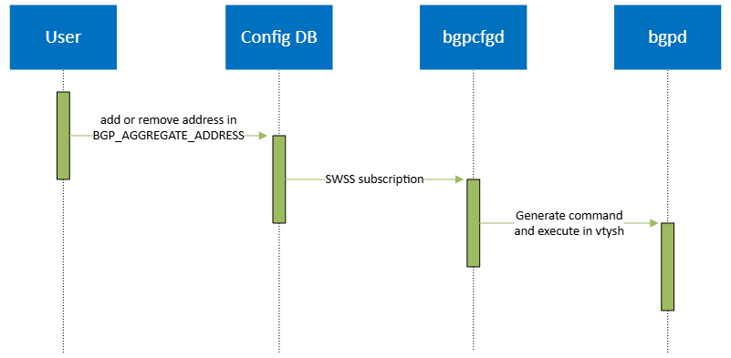

# BGP Aggregate Address In Config DB

- [Revision](#revision)
- [Definitions/Abbreviations](#definitionsabbreviations)
- [Scope](#scope)
- [Overview](#overview)
- [Requirements](#requirements)
- [High Level Design](#high-level-design)
    - [Config DB Extension](#config-db-extension)
        - [Yang Model](#yang-model)
        - [Config DB Sample](#config-db-sample)
    - [Bgp Container Behavior](#bgp-container-behavior)


### Revision

| Revision | Date        | Author           | Change Description |
| -------- | ----------- | ---------------- | ------------------ |
| 1.0      | Jul 7 2024 | Wenda Chu, Jing Kan | Initial proposal   |

### Definitions/Abbreviations

| Definitions/Abbreviation | Description |
| ------------------------ | ----------- |
| BGP | Border Gateway Protocol |
| FRR | A free and open source Internet routing protocol suite for Linux and Unix platforms |
| BBR | An feature to allow device learn routes that go through the same AS |


### Scope

This document describes how to leverage the SONiC config DB to add or remove BGP aggregate address.


### Overview
In BGP, we can aggregate details routes into one single aggregated route. it is a quite useful feature in some scenarios, for example reducing routes count.

To leverage the benefit of address aggregation, we trying design the aggregate address configuration mechanism in this doc.


### Requirements
User can add or remove aggregated address via editing config DB, and there are parameters to control the aggregation and route announcement behavior.

### High Level Design
First we introduce the config DB extension which define the feature scope and parameters we have.
Then we introduce how the bgp container will change its behavior accordingly.

#### Config DB Extension
We define a new YANG model to add a new key named `BGP_AGGREGATE_ADDRESS` in config DB.
The key will index to a list of aggregated addresses with their parameters.

The YANG model and config DB demo are showed in below:

##### Yang Model
```json
module sonic-bgp-aggregate-address {
    namespace "http://github.com/sonic-net/sonic-bgp-aggregate-address";

    prefix bgp-aggregate-address;

    yang-version 1.1;

    import ietf-inet-types {
        prefix inet;
    }

    organization
        "SONiC";

    contact
        "SONiC";

    description
        "SONIC BGP aggregate address configuration module.";

    revision 2024-07-07 {
        description
            "Initial revision.";
    }

    container sonic-bgp-aggregate-address {
        container BGP_AGGREGATE_ADDRESS {

            description "BGP_AGGREGATE_ADDRESS part of config_db.json";

            list BGP_AGGREGATE_ADDRESS_LIST {

                description "BGP_AGGREGATE_ADDRESS list part of config_db.json";

                key "aggregate-address";

                leaf aggregate-address {
                    type inet:ip-prefix;
                    description "Aggregate address to be advertised";
                }

                leaf bbr-required {
                    type boolean;
                    description "Set if BBR is required for generating aggregate address";
                }

                leaf summary-only {
                    type boolean;
                    description "Only advertise the summary of aggregate address";
                }

                leaf route-map {
                    type string;
                    description "Attribute-map to be applied to the aggregate address";
                }

                leaf as-set {
                     type boolean;
                     description "Set if include the AS set when advertising the aggregated address";
                }
            }
        }
    }
}
```

##### Config DB Sample
```json
{
    ...
    "BGP_AGGREGATE_ADDRESS": {
        "192.168.0.0/24": {
            "bbr-required": "true",
            "summary-only": "false"
        },
        "fc00::/63": {
            "bbr-required": "true",
            "summary-only": "true"
            "route-map": "AGG_V6",
            "as-set": "true"
        }
    }
    ...
}
```

#### Bgp Container Behavior
1. Bgpcfgd will subscribe the key `BGP_AGGREGATE_ADDRESS` in config DB
2. When there is any address added or removed, bgpcfgd will generate a command accordingly and execute it in vtysh.
3. If bgp container restarted, bgpd will lose all aggregated address, but bgpcfgd will get all existed addresses and process them one by one.


<p align=center>

</p>