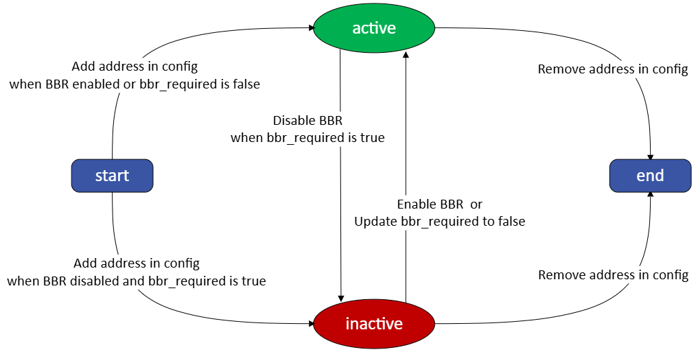
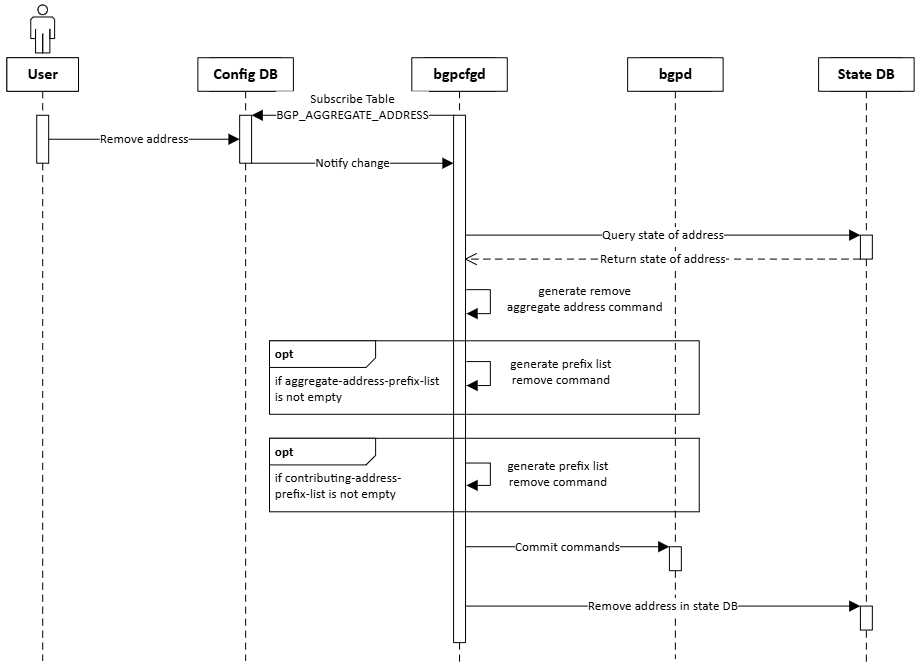

# BGP Route Aggregation With BBR Awareness

- [Revision](#revision)
- [Definitions/Abbreviations](#definitionsabbreviations)
- [Scope](#scope)
- [Overview](#overview)
- [Requirements](#requirements)
- [High Level Design](#high-level-design)
    - [Config DB Extension](#config-db-extension)
        - [Yang Model](#yang-model)
        - [Config DB Sample](#config-db-sample)
        - [Parameters](#parameters)
    - [State DB Extension](#state-db-extension)
        - [State DB Sample](#state-db-sample)
        - [State Transition Diagram](#state-transition-diagram)
    - [Bgp Container Behavior](#bgp-container-behavior)
        - [UML Sequence Diagrams](#uml-sequence-diagrams)
    - [CLI Design](#cli-design)
        - [Show CLI](#show-cli)
        - [Config CLI](#config-cli)


## Revision

| Revision | Date        | Author           | Change Description |
| -------- | ----------- | ---------------- | ------------------ |
| 1.0      | Jul 17 2024 | Wenda Chu, Jing Kan | Initial proposal   |

## Definitions/Abbreviations

| Definitions/Abbreviation | Description |
| ------------------------ | ----------- |
| BGP | Border Gateway Protocol |
| FRR | A free and open source Internet routing protocol suite for Linux and Unix platforms |
| BBR | Full name is Bounce Back Routing, a feature that can prevent packet drop caused by aggregated address.|


## Scope

This document describes how to leverage the SONiC config DB to add or remove BGP aggregate address and the SONiC state DB to track the state of it with BBR awareness


## Overview
In BGP, we can aggregate detailed routes into one single aggregated route. It has many advantages, for example reducing routes’ count.

However, firstly, SONiC can’t configurate aggregated addresses via config DB and doesn’t have CLI support for it.

Secondly, if we aggregated routes without BBR feature on device, we many got packet drop on this device due to detail routes missing.

To leverage the benefit of address aggregation and the BBR feature, we are trying to design the aggregate address configuration mechanism with BBR awareness in this doc.


## Requirements
With this design, users can add or remove aggregated address via editing config DB or config CLI with parameters to control the aggregation and route announcement behavior and can use the show command to check aggregated address on device.

With BBR awareness, aggregated address will be generated conditionally depend on BBR feature's state.

## High Level Design
First we introduce the config DB extension which define the feature scope and parameters we have.
Then we introduce how the bgp container will change its behavior accordingly.

### Config DB Extension
We define a new YANG model to add a new key named `BGP_AGGREGATE_ADDRESS` in config DB.
The key will index to a list of aggregated addresses with their parameters.

The YANG model and config DB demo are showed in below:

#### Yang Model
```
module sonic-bgp-aggregate-address {
    namespace "http://github.com/sonic-net/sonic-bgp-aggregate-address";

    prefix bgp-aggregate-address;

    yang-version 1.1;

    import ietf-inet-types {
        prefix inet;
    }

    organization
        "SONiC";

    contact
        "SONiC";

    description
        "SONIC BGP aggregate address configuration module.";

    revision 2024-07-17 {
        description
            "Initial revision.";
    }

    container sonic-bgp-aggregate-address {
        container BGP_AGGREGATE_ADDRESS {

            description "BGP_AGGREGATE_ADDRESS part of config_db.json";

            list BGP_AGGREGATE_ADDRESS_LIST {

                description "BGP_AGGREGATE_ADDRESS list part of config_db.json";

                key "aggregate-address";

                leaf aggregate-address {
                    type inet:ip-prefix;
                    description "Aggregate address to be advertised";
                }

                leaf bbr-required {
                    type boolean;
                    description "Set if BBR is required for generating aggregate address";
                }

                leaf summary-only {
                    type boolean;
                    description "Only advertise the summary of aggregate address";
                }

                leaf as-set {
                     type boolean;
                     description "Set if include the AS set when advertising the aggregated address";
                }
            }
        }
    }
}
```

#### Config DB Sample
```json
{
    ...
    "BGP_AGGREGATE_ADDRESS": {
        "192.168.0.0/24": {
            "bbr-required": "true",
            "summary-only": "false"
        },
        "fc00::/63": {
            "bbr-required": "true",
            "summary-only": "true"
            "as-set": "true"
        }
    }
    ...
}
```

#### Parameters
We have parameters to control the behavior of aggregate address in bgp container.

##### BBR Required
It's a boolean to indicate whether only generate aggregated address when BBR feature is enabled.

If it's true and the BBR feature is not enabled, aggregated address won't generated.

##### Summary Only
It's a boolean to indicate whether only advertise aggregate address only.

If it's true, then details routes will be suppressed and only aggregated address will be advertised.

##### AS Set
It's a boolean to indicate whether add a as set of details routes in as path when advertising aggregated address.

If it's true, then when advertising aggregated address there will be a as set of detail routes appended at as path.

### State DB Extension
For every aggregated address, we track its state in state DB, it has two states active and inactive. Active state means the address is configurated in the bgp container, while inactive state means isn't.

#### State DB sample:
```json
{
    ...
    "BGP_AGGREGATE_ADDRESS": {
        "192.168.0.0/24": {
            "state": "inactive"
        },
        "fc00::/63": {
            "state": "active"
        }
    }
    ...
}
```

#### State Transition Diagram

<p align=center>

</p>


### Bgp Container Behavior
The bgp container will subscribe the keys `BGP_AGGREGATE_ADDRESS` and `BGP_BBR` in config DB. The possible events and related process are:
1. Add address in config DB:
    - if BRR requirement is satisfied, generate aggregated address in the bgp container and add address in state DB with active state.
    - else, add address in state DB with inactive state.
2. Remove address in config DB:
    - Remove aggregated address in the bgp container and remove address in state DB.
3. Enable BBR feature in config DB:
    - In config DB, find out all addresses that has bbr-required equals true and generate aggregated addresses in the bgp container then update state DB with active state.
4. Disable BBR feature in config DB:
    - In config DB, find out all addresses that has bbr-required equals true and remove aggregated addresses in the bgp container then update state DB with inactive state.
5. The bgp container restarted:
    - First, the bgp container will clean the addresses in state DB and then the bgp container will process all existed config one by one according to 1~4.

#### UML Sequence Diagrams


*Fig.1 Add Address*



*Fig.2 Remove Address*


*Fig.3 BBR Feature State Change*

### CLI Design
  | CLI |               Description                        |
  |:----------------------|:-----------------------------------------------------------|
  | show ip bgp aggregate-address | Show aggregate address in ipv4 address family |
  | show ipv6 bgp aggregate-address | Show aggregate address in ipv6 address family |
  | config bgp aggregate-address add | Add aggregate address |
  | config bgp aggregate-address remove | Remove aggregate address |

#### Show CLI
**show ip bgp aggregate-address**

This command is used to show aggregate address in ipv4 address family
- Usage
  ```
  show ip bgp aggregate-address
  ```

- Example
  ```
  > show ip bgp aggregate-address
  +----------------+---------+-------------+-------------+---------------+
  |Prefix          |State    |Summary Only |BBR Required |As Set Enabled |
  |----------------+---------+-------------+-------------+---------------+
  |192.168.0.0/24  |Active   |False        |False        |True           |
  +----------------+---------+-------------+-------------+---------------+
  |10.0.0.0/24     |Inactive |True         |True         |False          |
  +----------------+---------+-------------+-------------+---------------+
  ```

**show ipv6 bgp aggregate-address**

This command is used to show aggregate address in ipv6 address family
- Usage
  ```
  show ipv6 bgp aggregate-address
  ```

- Example
  ```
  > show ipv6 bgp aggregate-address
  +----------------+---------+-------------+-------------+---------------+
  |Prefix          |State    |Summary Only |BBR Required |As Set Enabled |
  |----------------+---------+-------------+-------------+---------------+
  |fc00:1::/64     |Active   |False        |False        |True           |
  +----------------+---------+-------------+-------------+---------------+
  |fc00:3::/64     |Inactive |True         |True         |False          |
  +----------------+---------+-------------+-------------+---------------+
  ```

#### Config CLI
**config bgp aggregate-address add**

This command is used to add aggregate address
- Usage
  ```
  config bgp aggregate-address add <address> [--bbr-required] [--summary-only] [--as-set]
  ```

- Example
  ```
  config bgp aggregate-address add 192.168.0.0/24 --bbr-required
  config bgp aggregate-address add 192.168.0.0/24 --summary-only
  config bgp aggregate-address add 192.168.0.0/24 --summary-only --as-set
  config bgp aggregate-address add fc00:1::/64 --bbr-required
  ```

**config bgp aggregate-address remove**

This command is used to remove aggregate address
- Usage
  ```
  config bgp aggregate-address remove <address>
  ```

- Example
  ```
  config bgp aggregate-address remove 192.168.0.0/24
  config bgp aggregate-address remove fc00:1::/64
  ```

### Test Plan Design
First we will implement unit test in sonic-buildimage repo to test basic functionality.

Then we will implement test in sonic-mgmt repo to test if this feature works including scenarios like: 
1. Add aggregated address with bbr-required equals true and check whether the address will be generated when switch the state of BBR feature.
2. Add aggregated address with bbr-required equals false and check whether the address will be generated when switch the state of BBR feature.
3. Remove aggregated address in config db and check whether the address will be removed from state db and bgp container.
4. More tests details will be published in sonic-mgmt repo.
