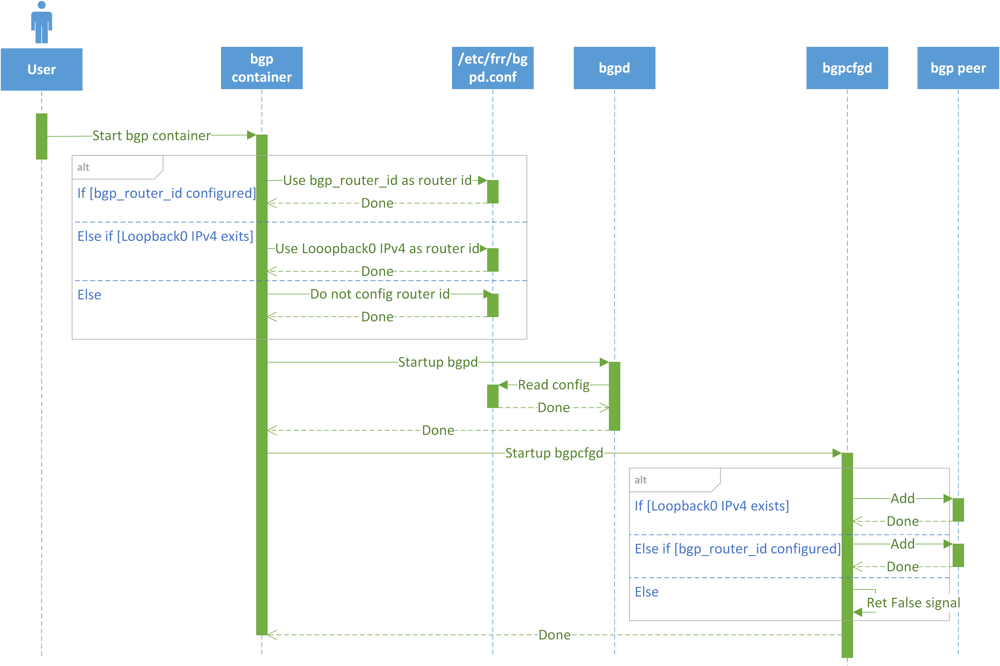

# BGP Router ID Customized

- [Revision](#revision)
- [Definitions/Abbreviations](#definitionsabbreviations)
- [Scope](#scope)
- [Overview](#overview)
- [Requirements](#requirements)
- [High Level Design](#high-level-design)
- [Config DB Enhancement](#config-db-enhancement)
    - [DEVICE_METADATA](#device_metadata)

### Revision

| Revision | Date        | Author           | Change Description |
| -------- | ----------- | ---------------- | ------------------ |
| 1.0      | Mar 27 2024 | Yaqiang Zhu, Jing Kan | Initial proposal   |

### Definitions/Abbreviations

| Definitions/Abbreviation | Description |
| ------------------------ | ----------- |
| FRR | A free and open source Internet routing protocol suite for Linux and Unix platforms |
| Router ID | 32-bit value that uniquely identifies a BGP device |
| Lo | Loopback |

### Scope

This document describes a mechanism that to use customized router id when Lo IPv4 address is not configured.

### Overview

Currently, there is BGP hard coding in SONiC depends on Lo IPv4 address:
1. Use Lo IPv4 address as router id. If router id not configured, FRR would choose an IP address on device to be router id, which cannot be guranteed that is unique in network.
2. Do not add BGP peer when there is not Lo IPv4 exists. It would cause BGP cannot establish.

Below is sequence diagram about BGP, only includes contents related to Lo.
<p align=center>

</p>

### Requirements

Add support to customize BGP router id.

### High Level Design

<p align=center>

</p>

1. Add field `bgp_router_id` into `CONFIG_DB["DEVICE_METADATA"]["localhost"]["bgp_router_id"]`
2. In [bgp.main.conf.j2](https://github.com/sonic-net/sonic-buildimage/blob/master/dockers/docker-fpm-frr/frr/bgpd/bgpd.main.conf.j2#L91) to always respect bgp_router_id in CONFIG_DB if configured
```jinja

    bgp router-id DEVICE_METADATA["localhost"]["bgp_router_id"]

    bgp router-id {{ get_ipv4_loopback_address(LOOPBACK_INTERFACE, "Loopback0") | ip }}

```

### Config DB Enhancement

#### DEVICE_METADATA

**Configuration schema in ABNF format:**

```abnf
; DEVICE_METADATA table
key             = DEVICE_METADATA|localhost ; Device metadata configuration table
; field         = value
bgp_router_id   = inet:ipv4-address         ; Customized BGP router id
```

**Sample of CONFIG DB snippet:**

```json
{
    "DEVICE_METADATA": {
        "localhost": {
            "bgp_router_id": "10.1.0.32"
        }
    }
}
```

**Snippet of `sonic-device_metatadata.yang`:**

```
module sonic-device_metadata {
    container sonic-device_metadata {
        container DEVICE_METADATA {
            container localhost {
                leaf bgp_router_id {
                    type inet:ipv4-address
                }
            }
            /* end of container localhost */
        }
        /* end of container DEVICE_METADATA */
    }
    /* end of top level container */
}
/* end of module sonic-device_metadata */
```
