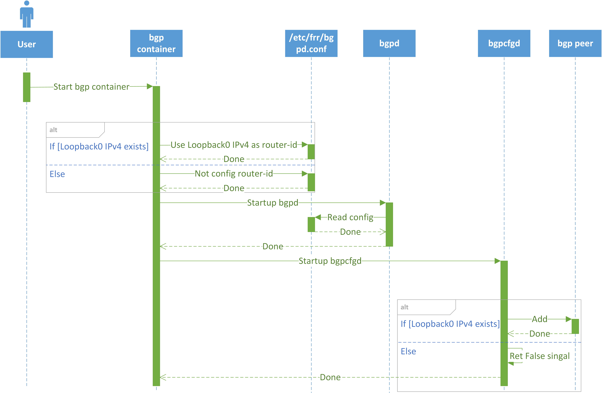
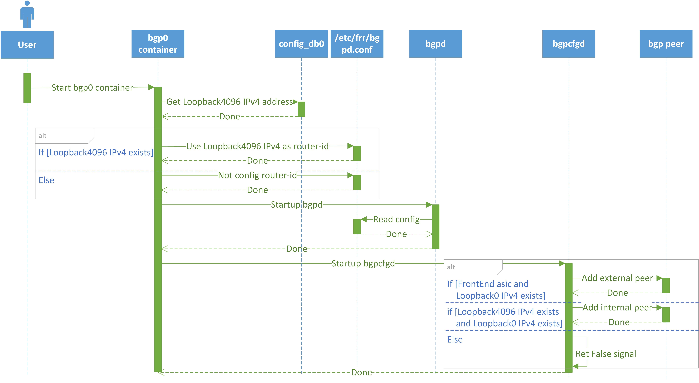
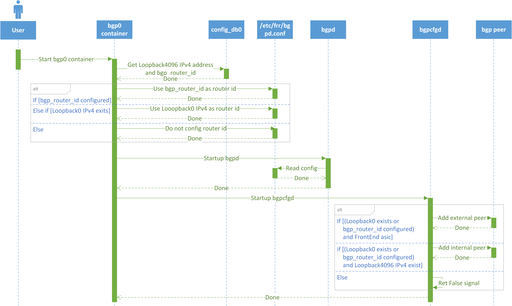

# BGP Router ID Explicitly Configured

- [Revision](#revision)
- [Definitions/Abbreviations](#definitionsabbreviations)
- [Scope](#scope)
- [Overview](#overview)
- [Requirements](#requirements)
- [High Level Design](#high-level-design)
- [Config DB Enhancement](#config-db-enhancement)
    - [DEVICE_METADATA](#device_metadata)

### Revision

| Revision | Date        | Author           | Change Description |
| -------- | ----------- | ---------------- | ------------------ |
| 1.0      | Mar 27 2024 | Yaqiang Zhu, Jing Kan | Initial proposal   |

### Definitions/Abbreviations

| Definitions/Abbreviation | Description |
| ------------------------ | ----------- |
| FRR | A free and open source Internet routing protocol suite for Linux and Unix platforms |
| BGP Router ID | 32-bit value that uniquely identifies a BGP device |
| AS | Autonomous System |
| iBGP | Internal Border Gateway Protocol, which is used inside the autonomous systems |
| eBGP | External Border Gateway Protocol, which is used between autonomous systems |

### Scope

This document describes a mechanism to allow user explicitly configure BGP router id.

### Overview

Currently, there are some BGP hard codings in SONiC:
1. BGP router id was defined as a 32-bit value that uniquely identifies a BGP device. In single-asic device, SONiC uses Loopback0 IPv4 address as BGP router id. In mult-asic and uses Loopback4096 IPv4 address as BGP router id (for both iBGP and eBGP). This coupling prevents users from using customized router id. If IPv4 address of Loopback0 / Loopback4096 don't exist, BGP router id wouldn't be configured, then FRR would choose the largest IP address in device to be BGP router id. If the router id choosen by FRR is not unique, it would be considered an error.
2. In single-asic device, SONiC wouldn't add BGP peer when there is not Loopback0 IPv4 exists. In multi-asic, SONiC wouldn't add eBGP peer when there is not Loopback0 IPv4 exists.

Below is current workflow about BGP and router id in single-asic, only includes contents related to Loopback0.

1. After bgp container started, configuration file `/etc/frr/bgpd.conf` for bgpd would be rendered. It will use Loopback0 IPv4 address as BGP router id, if it doesn't exist, the BGP router id wouldn't be specified.
2. bgpd start with configuration rendered before. If BGP router id is not specified, it would choose an IP address in device to be BGP router id.
3. After bgpcfgd started, it will add bgp peer depends on whether Loopback0 IPv4 exist. If Loopback0 IPv4 doesn't exist, stop to process neighbors adding and return with False signal.

<p align=center>

</p>

Below is current workflow about BGP and router id in multi-asic, only includes contents related to Loopback0 and Loopback4096. To be clarified that due to space limitations, the figure below only describes the behavior of one aisc in a multi-asic system. The behavior of other asics is similar to this one, except that they will start their own bgp\[x\] containers and read their respective config_db.

1. After bgp container of each asic started, configuration file `/etc/frr/bgpd.conf` for bgpd would be rendered. It will use Loopback4096 IPv4 address configured in correspond config_db as BGP router id, if it doesn't exist, the BGP router id wouldn't be specified.
2. bgpd start with configuration rendered before. If BGP router id is not specified, it would choose an IP address in device to be BGP router id.
3. After bgpcfgd started, it will add bgp peer depends on whether Loopback0 and Loopback4096 IPv4 exist:
   1. If Loopback0 IPv4 doesn't exist, stop to process BGP neighbors adding and return with False signal.
   2. Else
      1. If IPv4 address of Loopback4096 exists, add iBGP peer; else process iBGP neighbors adding and exit with False signal.
      2. If current asic is FrontEnd, add eBGP peer.

<p align=center>

</p>

### Requirements

Add support to allow user explicitly configure BGP router id.

### High Level Design

2 aspects enhancement:

1. Add a field `bgp_router_id` in `CONFIG_DB["DEVICE_METADATA"]["localhost"]` to support explicitly configure BGP router id. For multi-asic devices, this configuraion would be added to correspond config_db for each asic. If `CONFIG_DB["DEVICE_METADATA"]["localhost"]["bgp_router_id"]` configured, always use it as BGP router id. With this change, the new BGP router id configuration behavior will be like follow table. To be clarified that when bgp_router_id doesn't be configured, the behavior is totally same as previously.

|           | Loopback0/Loopback4096 IPv4 address exists | Loopback0/Loopback4096 IPv4 address doesn't exist |
|--------------|-------|------------|
| bgp_router_id configured | Honor bgp_router_id | Honor bgp_router_id |
| bgp_router_id doesn't be configured | Honor Loopback0/Loopback4096 IPv4 address | FRR default router ID value is selected as the largest IP address of the device. When router zebra is not enabled bgpd can’t get interface information so router-id is set to 0.0.0.0 |

2. In single-asic scenario, remove strong dependencies on Loopback0 IPv4 address when adding BGP peer in the situation that bgp_router_id is configured. With this change, the new BGP peer adding behavior will be like follow table. 2 points need To be clarified:
   1. When bgp_router_id doesn't be configured, the behavior is totally same as previously.
   2. We won't modify the logic of adding internal peer, it will still follow previous logic to treat Loopback4096 IPv4 address as required factor.

|          | Loopback0 IPv4 address exists | Loopback0 IPv4 address doesn't exist |
|--------------|-------|------------|
| bgp_router_id configured | Add BGP peer | Add BGP peer |
| bgp_router_id doesn't be configured | Add BGP peer | Do not add BGP peer |

#### Single-asic

Below is new workflow for single-asic, the main changes are in `1.` and `3.`.

1. After bgp container started, configuration file `/etc/frr/bgpd.conf` for bgpd is would be rendered.
   * If CONFIG_DB`["DEVICE_METADATA"]["localhost"]["bgp_router_id"]` exists, use it as BGP router id.
   * Else if Loopback0 IPv4 address exists, use it as BGP router id.
   * Else, BGP router id wouldn't be specified. To be clarified that this scenario is out of scope for current HLD, behavior in the scenario that router-id isn't specified is totally same as previous.
2. bgpd start with configuration rendered before. If router id is not specified, it would choose an IP address in device to be router id, which would cause BGP cannot work if the router id is not unique in network.
3. After bgpcfgd started, it will start BGP peer based on configuration.
   * If Loopback0 IPv4 address exists, continue to add BGP peer.
   * Else if CONFIG_DB`["DEVICE_METADATA"]["localhost"]["bgp_router_id"]` exists, continue to add BGP peer.
   * Else, stop to process neighbors adding and return with False signal.

<p align=center>

</p>

#### Multi-asic

Below is new workflow for multi-asic, the main changes are in `1.` and `3.`. To be clarified that due to space limitations, the figure below only describes the behavior of one aisc in a multi-asic system. The behavior of other asics is similar to this one, except that they will start their own bgp\[x\] containers and read their respective config_db.

1. After bgp0 container started, configuration file `/etc/frr/bgpd.conf` for bgpd is would be rendered.
   * If CONFIG_DB`["DEVICE_METADATA"]["localhost"]["bgp_router_id"]` exists, use it as BGP router id.
   * Else if Loopback4096 IPv4 address exists, use it as BGP router id.
   * Else, BGP router id wouldn't be specified. To be clarified that this scenario is out of scope for current HLD, behavior in the scenario that router-id isn't specified is totally same as previous.
2. bgpd start with configuration rendered before. If router id is not specified, it would choose an IP address in device to be router id, which would cause BGP cannot work if the router id is not unique in network.
3. After bgpcfgd started, it will start BGP peer based on configuration.
   * If current asic is FrontEnd
     * If Loopback0 IPv4 address exists or bgp_router_id configured
       * Add eBGP peer.
       * If Loopback4096 IPv4 address exists, add iBGP peer.
     * Else, stop to process neighbors adding and return with False signal.
   * Else if current asic is BackEnd
     * If Loopback0 IPv4 address exists or bgp_router_id configured
       * If Loopback4096 IPv4 address exists, add iBGP peer
       * Else, stop to process iBGP neighbors adding and return with False signal.
     * Else, stop to process neighbors adding and return with False signal.

<p align=center>

</p>

### Config DB Enhancement

#### DEVICE_METADATA

**Configuration schema in ABNF format:**

```abnf
; DEVICE_METADATA table
key             = DEVICE_METADATA|localhost ; Device metadata configuration table
; field         = value
bgp_router_id   = inet:ipv4-address         ; Customized BGP router id
```

**Sample of CONFIG DB snippet:**

```json
{
    "DEVICE_METADATA": {
        "localhost": {
            "bgp_router_id": "10.1.0.32"
        }
    }
}
```

**Snippet of `sonic-device_metatadata.yang`:**

```
module sonic-device_metadata {
    container sonic-device_metadata {
        container DEVICE_METADATA {
            container localhost {
                leaf bgp_router_id {
                    type inet:ipv4-address
                }
            }
            /* end of container localhost */
        }
        /* end of container DEVICE_METADATA */
    }
    /* end of top level container */
}
/* end of module sonic-device_metadata */
```
