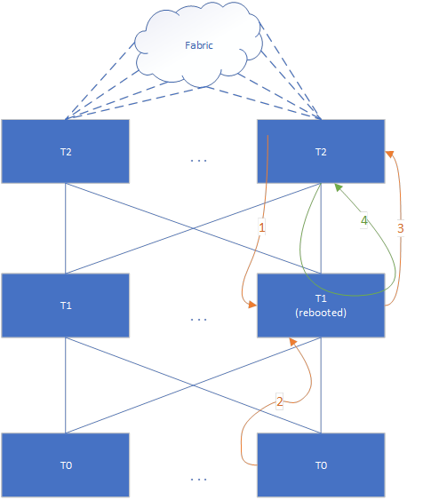
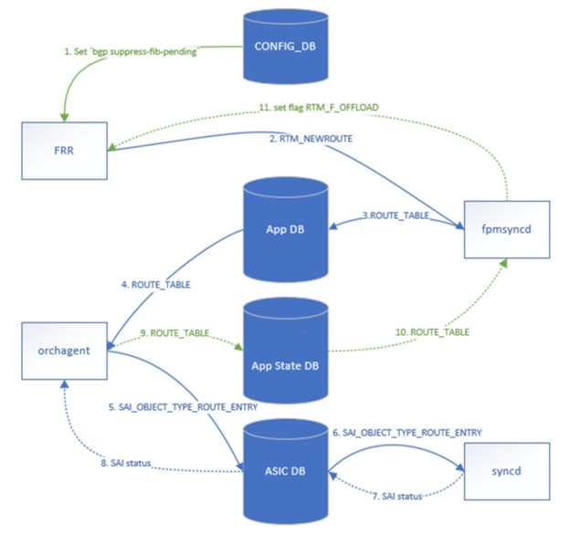
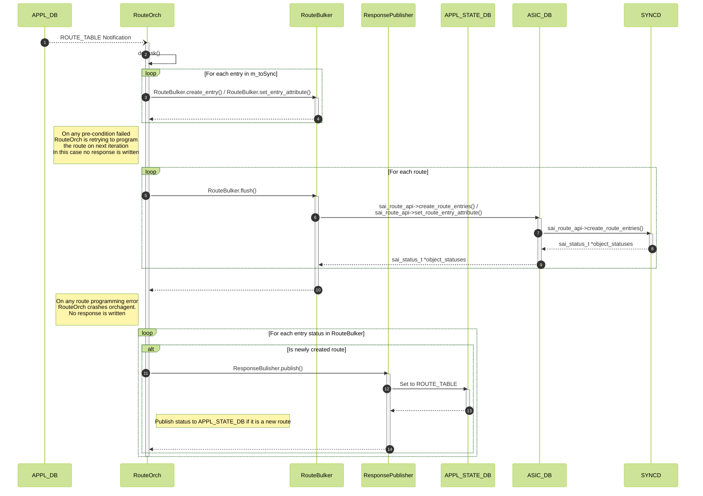
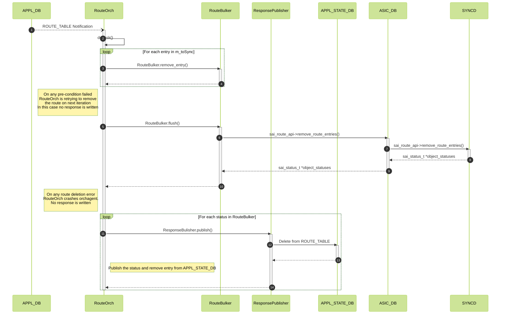
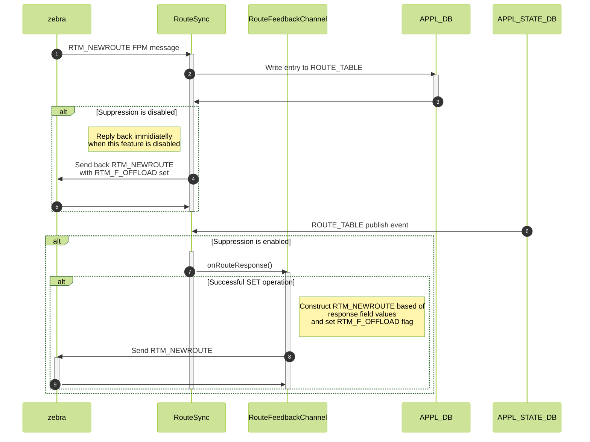
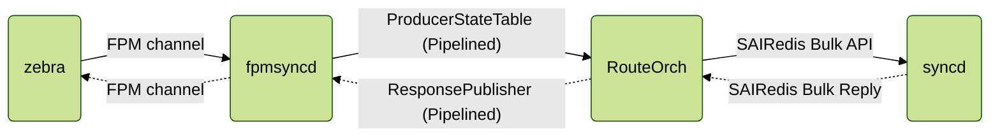
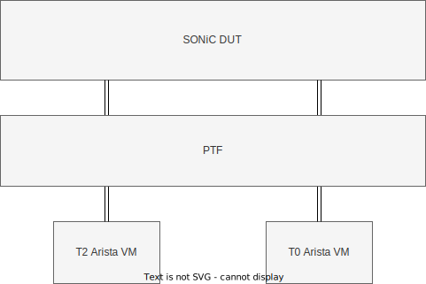

<!-- omit in toc -->
# BGP Suppress Announcements of Routes Not Installed in HW #

<!-- omit in toc -->
## Table of Content

- [1. Scope](#1-scope)
- [2. Definitions/Abbreviations](#2-definitionsabbreviations)
- [3. Overview](#3-overview)
- [4. Requirements](#4-requirements)
- [5. Architecture Design](#5-architecture-design)
- [6. Configuration and management](#6-configuration-and-management)
  - [6.1. Config DB Enhancements](#61-config-db-enhancements)
  - [6.2. Manifest (if the feature is an Application Extension)](#62-manifest-if-the-feature-is-an-application-extension)
  - [6.3. CLI/YANG model Enhancements](#63-cliyang-model-enhancements)
- [7. High-Level Design](#7-high-level-design)
  - [7.1. FPM plugin migration](#71-fpm-plugin-migration)
  - [7.2. BGP Docker container startup](#72-bgp-docker-container-startup)
  - [7.3. RouteOrch](#73-routeorch)
  - [7.4. FPMsyncd](#74-fpmsyncd)
  - [7.5. Response Channel Performance considerations](#75-response-channel-performance-considerations)
  - [7.6. Consistency monitoring script and mitigation action](#76-consistency-monitoring-script-and-mitigation-action)
- [8. SAI API](#8-sai-api)
- [9. Warmboot and Fastboot Design Impact](#9-warmboot-and-fastboot-design-impact)
  - [9.1. Warm Reboot](#91-warm-reboot)
  - [9.2. Fast Reboot](#92-fast-reboot)
- [10. Restrictions/Limitations](#10-restrictionslimitations)
- [11. Testing Requirements/Design](#11-testing-requirementsdesign)
  - [11.1. Unit Test cases](#111-unit-test-cases)
  - [11.2. VS Test cases](#112-vs-test-cases)
  - [11.3. System Test cases](#113-system-test-cases)
  - [11.4. Performance measurements](#114-performance-measurements)
- [12. Open/Action items - if any](#12-openaction-items---if-any)

<!-- omit in toc -->
### 1. Revision

| Revision | Date        | Author           | Change Description |
| -------- | ----------- | ---------------- | ------------------ |
| 1.0      | Sep 15 2022 | Stepan Blyshchak | Initial proposal   |

### 1. Scope

This document describes a feedback mechanism that allows BGP not to advertise routes that haven't been programmed yet.

### 2. Definitions/Abbreviations

| Definitions/Abbreviation | Description                             |
| ------------------------ | --------------------------------------- |
| ASIC                     | Application specific integrated circuit |
| HW                       | Hardware                                |
| SW                       | Software                                |
| BGP                      | Border Gateway Protocol                 |
| FRR                      | Free Range Routing                      |
| SWSS                     | Switch state service                    |
| SYNCD                    | ASIC synchronization service            |
| FPM                      | Forwarding Plane Manager                |
| SAI                      | Switch Abstraction Interface            |
| OID                      | Object Identifier                       |

### 3. Overview

As of today, SONiC BGP advertises learnt prefixes regardless of whether these prefixes were successfully programmed into ASIC. While route programming failure is followed by orchagent crash and all services restart, even for successfully created routes there is a short period of time when the peer will be black holing traffic. Also, in the following scenario, a credit loop occurs:

<!-- omit in toc -->
##### Figure 1. Use case scenario

<p align=center>

</p>

The problem with BGP programming occurs after the T1 switch is rebooted:
1. First, the T1 FRR learns a default route from at least 1 T2
2. The T0 advertises it’s prefixes to T1
3. FRR advertises the prefixes to T2 without waiting for them to be programmed in the ASIC
4. T2 starts forwarding traffic for prefixes not yet programmed, according to T1’s routing table, T1 sends it back to a default route – same T2

When the traffic is bounced back on lossless queue, buffers on both sides are overflown, credit loop happens, with PFC storm and watchdog triggered shutting down the port.
To avoid that, the route programming has to be synchronous down to the ASIC to avoid credit loops.

FRR supports this through a feature called *BGP suppress FIB pending*. [FRR documentation reference](https://github.com/FRRouting/frr/blob/master/doc/user/bgp.rst):

> The FRR implementation of BGP advertises prefixes learnt from a peer to other peers even if the routes do not get installed in the FIB. There can be scenarios where the hardware tables in some of the routers (along the path from the source to destination) is full which will result in all routes not getting installed in the FIB. If these routes are advertised to the downstream routers then traffic will start flowing and will be dropped at the intermediate router.
>
> The solution is to provide a configurable option to check for the FIB install status of the prefixes and advertise to peers if the prefixes are successfully installed in the FIB. The advertisement of the prefixes are suppressed if it is not installed in FIB.
>
> The following conditions apply will apply when checking for route installation status in FIB:
>
> - The advertisement or suppression of routes based on FIB install status applies only for newly learnt routes from peer (routes which are not in BGP local RIB).
> - If the route received from peer already exists in BGP local RIB and route attributes have changed (best path changed), the old path is deleted and new path is installed in FIB. The FIB install status will not have any effect. Therefore only when the route is received first time the checks apply.
> - The feature will not apply for routes learnt through other means like redistribution to bgp from other protocols. This is applicable only to peer learnt routes.
> - If a route is installed in FIB and then gets deleted from the dataplane, then routes will not be withdrawn from peers. This will be considered as dataplane issue.
> - The feature will slightly increase the time required to advertise the routes to peers since the route install status needs to be received from the FIB
> - If routes are received by the peer before the configuration is applied, then the bgp sessions need to be reset for the configuration to take effect.
> - If the route which is already installed in dataplane is removed for some reason, sending withdraw message to peers is not currently supported.

BGP will queue routes which aren't installed in the FIB. To make zebra install routes in FIB an RTM_NEWROUTE message with *RTM_F_OFFLOAD* flag set must be sent by SONiC to zebra through FPM socket.

**NOTE**: This feature is implemented as part of new *dplane_fpm_nl* zebra plugin in FRR 8.4 and a backport patch must be created for current FRR 8.2 SONiC is using. SONiC is still using old *fpm* plugin which isn't developed anymore and thus SONiC must migrate to the new implementation as part of this change.

### 4. Requirements

High level requirements:

- Provide an end to end ASIC hardware to BGP route programming feedback mechanism
- BGP must not advertise routes which aren't yet offloaded if this feature is enabled
- BGP route suppression is optional and disabled by default
- Route suppression can be turned on or off at runtime
- Offloaded routes consistency monitoring and automatic mitigation

Restrictions/Limitations:

- MPLS, VNET routes are out of scope of this document
- Directly connected and static routes are announced by BGP regardless of their offload status

### 5. Architecture Design

<!-- omit in toc -->
##### Figure 2. Architecture

The below diagram shows the high level architecture including sending an RTM_NEWROUTE response message with RTM_F_OFFLOAD flag set to zebra through FPM:

<p align=center>

</p>

- *2*-*8* - existing flows in SONiC
- *1*, *9*, *10* - new flows to be added

### 6. Configuration and management

#### 6.1. Config DB Enhancements

<!-- omit in toc -->
##### 6.1.1.DEVICE_METADATA

Configuration schema in ABNF format:

```abnf
; DEVICE_METADATA table
key                      = DEVICE_METADATA|localhost ; Device metadata configuration table
suppress-fib-pending     = "enabled"/"disabled"      ; Globally enable/disable routes announcement suppression feature,
                                                     ; by default this flag is disabled
```

Sample of CONFIG DB snippet given below:

```json
{
    "DEVICE_METADATA": {
        "localhost": {
            "suppress-fib-pending": "enabled"
        }
    }
}
```

This configuration is backward compatible. Upgrade from a SONiC version that does not support this feature does not change the user's expected behavior as this flag is set to be disabled by default.

This setting can be turned on or off at runtime. When this feature is turned off *fpmsyncd* sends an offload status reply immediately when a route is received from zebra. *fpmsyncd* listens to the changes
in *DEVICE_METADATA* and the new added field and when it gets enabled starts replying to zebra only after a reply from orchagent for all newly added prefixes. This design will make it possible to control
this feature at runtime. When user turns the feature off, newly received routes from zebra will get immediate answer back.

In case user detects an issue with a feature (i.e routes aren't marked as offloaded in zebra and thus BGP does not announce them), it can be turned off.

<!-- omit in toc -->
##### 6.1.2. Minigraph

*suppress-fib-pending* is enabled when generating CONFIG_DB out of minigraph for device role *LeafRouter*.

#### 6.2. Manifest (if the feature is an Application Extension)

This feature is implemented as part of existing BGP and SWSS containers, no manifest changes are required.

#### 6.3. CLI/YANG model Enhancements

<!-- omit in toc -->
##### 6.3.2.  DEVICE_METADATA

A new leaf is added to ```sonic-device_metadata/sonic-device_metadata/DEVICE_METADATA/localhost``` called ```suppress-fib-pending``` which can be set to ```"enable"``` or ```"disable"```.

Snippet of ```sonic-device_metatadata.yang```:

```yang
module sonic-device_metadata {
    import sonic-app-state-logging {
        prefix app-state-logging;
    }

    revision 2022-09-15 {
        description "Add BGP suppress FIB pending configuration knob";
    }

    container sonic-device_metadata {
        container DEVICE_METADATA {
            description "DEVICE_METADATA part of config_db.json";

            container localhost{
                leaf suppress-fib-pending {
                    description "Enable suppress pending FIB feature. BGP will wait for route
                                 FIB installation before announcing routes.";
                    type enumeration {
                        enum enabled;
                        enum disabled;
                    }
                    default disabled;

                    must "((current() = 'disabled') or (current() = 'enabled' and ../synchronous_mode = 'enable'))" {
                        error-message "ASIC synchronous mode must be enabled in order to enable routes suppression";
                    }
                }
            }
            /* end of container localhost */
        }
        /* end of container DEVICE_METADATA */
    }
    /* end of top level container */
}
/* end of module sonic-device_metadata
```

This knob can only be set to ```"enable"``` when syncrhonous SAI configuration mode is on. This constraint is guaranteed by the ```must``` expression for this leaf.

<!-- omit in toc -->
#### 6.4. CLI

A new CLI command is added to control this feature:

Command to enable feature:
```
admin@sonic:~$ sudo config suppress-fib-pending enabled
```

Command to disable feature:
```
admin@sonic:~$ sudo config suppress-fib-pending disabled
```

### 7. High-Level Design

#### 7.1. FPM plugin migration

FPM response channel is only supported with new ```dplane_fpm_nl``` zebra plugin and SONiC needs start using the new and supported plugin. Additional configuration is required in *zebra.conf.j2*:

```
! Fallback to nexthops information as part of RTM_NEWROUTE message
no fpm use-next-hop-groups

! Configure FPM server address
fpm address 127.0.0.1
```

Zebra shall be started with an ```-M dplane_fpm_nl``` to use the new plugin.

Some patches that change FPM behavior to the desired SONiC behavior need to be ported to the new plugin:

- New FPM plugin shall be patched the same way as old one to pass VRF if_index in ```rtmsg->rtm_table``` instead of table ID in FPM message. [SONiC FRR patch](https://github.com/sonic-net/sonic-buildimage/blob/master/src/sonic-frr/patch/0003-Use-vrf_id-for-vrf-not-tabled_id.patch).Since now SONiC will start communicating RTM_NEWROUTE messages back to zebra, similar change has to be made to accept VRF if_index instead of table ID.
- [[PATCH] ignore route from default table](https://github.com/yxieca/sonic-buildimage/blob/26c5bf81f0a8b2f5d6809048bb54a872403726c2/src/sonic-frr/patch/0009-ignore-route-from-default-table.patch)
- [0007-Add-support-of-bgp-l3vni-evpn.patch](https://github.com/sonic-net/sonic-buildimage/blob/a477dbb1751b741ac2762b4328da08b37eb400db/src/sonic-frr/patch/0007-Add-support-of-bgp-l3vni-evpn.patch)

An additional set of patches is required to be ported to FRR 8.2 to support this feature: [Add ability for dplane_fpm_nl to receive RTM_NEWROUTE netlink messages that signal route handling in the asic](https://github.com/stepanblyschak/frr/pull/1).

#### 7.2. BGP Docker container startup

BGP configuration template ```bgpd.main.j2``` requires update to configure FRR accordingly.

Configuration template snippet *bgpd.main.conf.j2*:

```jinja2
router bgp {{ DEVICE_METADATA['localhost']['bgp_asn'] }}
  bgp suppress-fib-pending
```

Zebra shall be started with an option ```--asic-offload=notify_on_offload```. This option will make zebra wait for ```RTM_F_OFFLOAD``` before notifying about installation status to bgpd. The template *supervisor.conf.j2* file is updated:

```jinja2
[program:zebra]
command=/usr/lib/frr/zebra -A 127.0.0.1 -s 90000000 -M dplane_fpm_nl --asic-offload=notify_on_offload
```

Before the route is offloaded ```show ip route``` shows routes as queued:

```
admin@sonic:~$ show ip route
Codes: K - kernel route, C - connected, S - static, R - RIP,
       O - OSPF, I - IS-IS, B - BGP, E - EIGRP, N - NHRP,
       T - Table, v - VNC, V - VNC-Direct, A - Babel, F - PBR,
       f - OpenFabric,
       > - selected route, * - FIB route, q - queued, r - rejected, b - backup
       t - trapped, o - offload failure

B>q 0.0.0.0/0 [20/0] via 10.0.0.1, PortChannel102, weight 1, 00:04:46
  q                  via 10.0.0.5, PortChannel105, weight 1, 00:04:46
  q                  via 10.0.0.9, PortChannel108, weight 1, 00:04:46
  q                  via 10.0.0.13, PortChannel1011, weight 1, 00:04:46
```

Once zebra is notified about successfull route offload status the *offload* flag is set:

```
admin@sonic:~$ vtysh -c "show ip route 100.1.0.25/32 json"
{
    "100.1.0.25/32": [
        {
            "prefix": "100.1.0.25/32",
            "prefixLen": 32,
            "protocol": "bgp",
            "vrfId": 0,
            "vrfName": "default",
            "selected": true,
            "destSelected": true,
            "distance": 20,
            "metric": 0,
            "installed": true,
            "offloaded": true,
            "table": 254,
            "internalStatus": 80,
            "internalFlags": 264,
            "internalNextHopNum": 1,
            "internalNextHopActiveNum": 1,
            "nexthopGroupId": 4890,
            "installedNexthopGroupId": 4890,
            "uptime": "00:22:20",
            "nexthops": [
                {
                    "flags": 3,
                    "fib": true,
                    "ip": "10.0.0.49",
                    "afi": "ipv4",
                    "interfaceIndex": 788,
                    "interfaceName": "PortChannel1013",
                    "active": true,
                    "weight": 1
                }
            ]
        }
    ]
}
```

#### 7.3. RouteOrch

<!-- omit in toc -->
#### ResponsePublisher in RouteOrch

*RouteOrch* need to use existing *ResponsePublisher* API to be able to publish responses into *APPL_STATE_DB*.

A snippet of *ResponsePublisher* API that is going to be used is given below.

```c++
void ResponsePublisher::publish(const std::string &table, const std::string &key,
                                const std::vector<swss::FieldValueTuple> &intent_attrs,
                                const ReturnCode &status,
                                bool replace = false) override;
```

*RouteOrch* will not publish all fields and values to *APPL_STATE_DB* to reduce memory usage and reduce load on redis database. Instead, the key is published as well as the *protocol* field as this one is required for fpmsyncd to construct RTM_NEWROUTE message.

Example usage in *RouteOrch*:

```c++
m_publisher.publish(APP_ROUTE_TABLE_NAME, kfvKey(kofvs), kfvFieldsValues(kofvs), ReturnCode(SAI_STATUS_SUCCESS), true);
```

Example data:
```
127.0.0.1:6379[14]> hgetall "ROUTE_TABLE:193.5.96.0/25"
1) "protocol"
2) "bgp"
```

In order to delete an entry from *APPL_STATE_DB* it is required to pass an empty *intent_attrs* vector which will imply this is a *DEL* operation.

<!-- omit in toc -->
#### RouteOrch Route Set Flow

```RouteOrch``` handles both local routes, pointing to local router interface, as well as next hop routes. On ```SET``` operation received in ```RouteOrch``` the ```RouteBulker``` is filled with create/set SAI operations depending on whether the route entry for the corresponding prefix was already created. In normal circumstances when next hop group is successfully created or found to be already existing the route entry is created or set with the corresponding next hop group SAI OID. The ```RouteOrch``` then calls ```RouteBulker::flush()``` that will form a bulk API call to SAIRedis. In ```RouteOrch::addRoutePost()``` the resulting object statuses are then collected and if some CREATE/SET operation failed orchagent calls ```abort()```, otherwise, on success, ```RouteOrch::addRoutePost()``` should publish the route programming status. Since there is no graceful handling of failed SAI operation the ```ResponsePublisher::publish()``` will be only called for a successfully programmed routes. In case a pre-condition for route programming is unmet, i.e unresolved neighbors in next hop group, the route entry programming is retried later and in such case there is no publishing of the result of the operation to ```APPL_STATE_DB``` until a pre-condition check is passed.

*Temporary route*:

A special handling exists in ```RouteOrch``` for a case when there can't be more next hop groups created. In this case ```RouteOrch``` creates, a so called, "temporary" route, using only 1 next hop from the group and using it's ```SAI_OBJECT_TYPE_NEXT_HOP``` OID as ```SAI_ROUTE_ENTRY_ATTR_NEXT_HOP_ID```. In this case, ```RouteOrch::addRoutePost()``` has to publish the route entry status regardless as this route is considered as successfully programmed. A *temporary* route is kept in the ```m_toSync``` queue to be later on reprogrammed when sufficient resources are available for full next hop group creation.

*Full mask prefix subnet routes*:

When orchagent receives a /32 IPv4 or /128 IPv6 prefix which is an IP of a local interface the route programming is skipped as we already have this route programmed with IP2ME action as part of interface configuration. In this case a successful route programming response status must be sent to notify *fpmsyncd* that this prefix is offloaded.

<!-- omit in toc -->
##### Figure 3. RouteOrch Route Set Flow




<!-- omit in toc -->
#### RouteOrch Route delete Flow

<!-- omit in toc -->
##### Figure 4. RouteOrch Route Delete Flow

Similar processing happens on ```DEL``` operation for a prefix from ```ROUTE_TABLE```. The removed prefixes are filled in ```RouteBulker``` which are then flushed forming a bulk remove API call to SAIRedis. ```RouteOrch::removeRoutePost()``` then collects the object statuses and if the status is not SAI_STATUS_SUCCESS orchagent ```abort()```s, otherwise it should publish the result via ```ResponsePublisher::publish()``` leaving ```intent_attrs``` vector empty which will remove the corresponding state key from ```APPL_STATE_DB```.



#### 7.4. FPMsyncd


> The dplane_fpm_nl has the ability to read route netlink messages
> from the underlying fpm implementation that can tell zebra
> whether or not the route has been Offloaded/Failed or Trapped.
> The end developer must send the data up the same socket that has
> been created to listen for FPM messages from Zebra.  The data sent
> must have a Frame Header with Version set to 1, Message Type set to 1
> and an appropriate message Length.  The message data must contain
> a RTM_NEWROUTE netlink message that sends the prefix and nexthops
> associated with the route.  Finally rtm_flags must contain
> RTM_F_OFFLOAD, RTM_F_TRAP and or RTM_F_OFFLOAD_FAILED to signify
> what has happened to the route in the ASIC.

A new class *RouteFeedbackChannel* in fpmsyncd is introduced to manage orchagent responses and send the corresponding FPM message to zebra.

Zebra requires to send RTM_NEWROUTE back with RTM_F_OFFLOAD flag set once route is programmed in HW. FpmSyncd create an RTM_NEWROUTE message based off VRF, prefix and nexthops that where actually installed which are part of publish notification.

The offload route status is relevant only for BGP received routes. In order to send back RTM_NEWROUTE it is required to encode "protocol" (rtmsg->rtm_protocol field) in APPL_DB which will be sent back as part of response:

```
127.0.0.1:6379> hgetall "ROUTE_TABLE:193.5.96.0/25"
1) "nexthop"
2) "10.0.0.1,10.0.0.5,10.0.0.9,10.0.0.13"
3) "ifname"
4) "PortChannel102,PortChannel105,PortChannel108,PortChannel1011"
5) "protocol"
6) "bgp"
```

The protocol number is then set in RTM_NEWROUTE when preparing message to be sent to zebra.

<!-- omit in toc -->
##### Figure 5. FPMsyncd flow



*FpmLink* class has to be extended with new API to send netlink message through FPM socket:

```c++
ssize_t FpmLink::send(nl_msg* msg)
```

Example pseudo-code snippet of RTM_NEWROUTE construction:

```c++
auto route = rtnl_route_alloc();

rtnl_route_set_dst(routeObject, dstAddr);
rtnl_route_set_protocol(routeObject, protocol);
rtnl_route_set_family(routeObject.get(), ipFamily);

// in SONiC FPM uses vrf if_index instead of table
rtnl_route_set_table(routeObject.get(), vrfIfIndex);

// Mark route as OFFLOAD
rtnl_route_set_flags(routeObject.get(), RTM_F_OFFLOAD);

nl_msg* msg;
rtnl_route_build_add_request(routeObject, NLM_F_CREATE, &msg);

fpm.send(msg);
```

#### 7.5. Response Channel Performance considerations

Route programming performance is one of crucial characteristics of a network switch. It is desired to program a lot of route entries as quick as possible. SONiC has optimized route programming pipeline levaraging Redis Pipeline in ```ProducerStateTable``` as well as SAIRedis bulk APIs. Redis pipelining is a technique for improving performance by issuing multiple commands at once without waiting for the response to each individual command. Such an optimization gives around ~4-5x times faster processing for ```Publisher/Subscriber``` pattern using a simple python script as a test.

The following table shows the results for publishing 1k messages with and without Redis Pipeline proving the need for pipeline support for ```ResponseChannel```:

<!-- omit in toc -->
##### 7.5.1. Table 1. Publishing 1k ROUTE_TABLE responses

| Scenario               | Time (sec) | Ratio |
| ---------------------- | ---------- | ----- |
| Without Redis Pipeline | 0.641      | 4.27  |
| With Redis Pipeline    | 0.150      | 1     |

Adding a feedback mechanism to the system introduces a delay as each of the component needs to wait for the reply from the lower layer counterpart in order to proceed. SONiC has already moved to synchronous SAI Redis pipeline a route programming performance degradation caused by it is leveled by the use of SAIRedis Bulk API.

By introducing a response channel it is required to leverage Redis Pipeline, so that the route configuration producer using Redis Pipeline with ```ProducerStateTable``` also receives route programming status responses produced by pipelined ```NotificationProducer``` which is part of ```ResponsePublisher```.

On the other side, ```fpmsyncd``` does not wait for each individual route status but rather performs an asynchronous processing.

The following schema represents communication methods between components:

<!-- omit in toc -->
##### Figure 6. zebra/orchagent feedback channel


A ```ResponsePublisher``` must have a constructor that accepts a ```RedisPipeline``` and a flag ```buffered``` to make it use the pipelining. The constructor is similar to one in use with ```ProducerStateTable```:

```c++
ResponsePublisher::ResponsePublisher(bool buffered = false);
```

And an API to set buffered mode:

```c++
void ResponsePublisher::setBuffered(bool buffered);
```

The ```OrchDaemon``` has to flush the ```RedisPipeline``` in ```OrchDaemon::flush``` when there are no pending tasks to perform.

#### 7.6. Consistency monitoring script and mitigation action

Routing is a crucial part of a network switch. This feature adds additional flows in existing route processing pipeline and so along the way there might be unexpected failures leading to routes being not marked as offloaded in zebra - missed notification, race conditions leading to in-consistency, etc. It is required to monitor the consistency of routes state periodically and mitigate problems.

At the moment *route_check.py* verifies routes between APPL_DB & ASIC_DB and makes sure they are in sync. In addition to that it is required to extend this script to check for consistency APPL_DB, APPL_STATE_DB and zebra by calling ```show ip route json``` and verify every route installed in ASIC_DB is marked as offloaded. The script will retry the check for 3 times every 15 sec and if zebra FIB is not in sync with ASIC_DB a mitigation action is performed. The mitigation action publishes required notifications to trigger fpmsyncd flows to send RTM_NEWROUTE message to zebra and log alerts in the syslog.

This way the problem is mitigated automatically and a network operator is notified via syslog alert about a problem.

### 8. SAI API

No new SAI API or changes to SAI design and behavior needed for this functionality.

### 9. Warmboot and Fastboot Design Impact

#### 9.1. Warm Reboot

With BGP Graceful Restart, peers are keeping advertised routes in the FIB while the switch restarts.
When fpmsyncd is about to set *reconciled* state it must send RTM_NEWROUTE for all prefixes that were restored previously from APPL_DB since they are already in the ASIC. Once all existing routes are pushed to zebra a comparison logic will finish the warm reboot process and fpmsyncd will continue in a normal operational mode.

#### 9.2. Fast Reboot

During fast reboot BGP session is closed by SONiC device without the notification. BGP session is preserved in graceful restart mode. BGP routes on the peer are still active, because nexthop interfaces are up. Once interfaces go down, received BGP routes on the peer are removed from the routing table. Nothing is sent to SONiC device since then. After interfaces go up and BGP sessions re-establish the peer's BGP re-learns advertised routes.

Due to additional response publishing in orchagent there might be a slight delay in fast reboot reconfiguration.

### 10. Restrictions/Limitations

- MPLS, VNET routes are out of scope of this document
- Directly connected and static routes are announced by BGP regardless of their offload status

### 11. Testing Requirements/Design

Regression test, VS test and unit testing are required for this functionality.

Fast/warm reboot regression test suite needs to be ran and verified no degradation introduced by the feature.

#### 11.1. Unit Test cases

- FPMSyncd: test case regular route
  1. Mock FPM interface
  2. Call RouteSync::onRouteResponse() with route 1.1.1.0/24 nexthop 2.2.2.2, 3.3.3.3
  4. Verify a correct FPM message is being sent to zebra through FPM interface mock
  5. Verify RTM_F_OFFLOAD set in route message sent  to zebra
- FPMSyncd: test case VRF route
  1. Mock FPM interface
  2. Call RouteSync::onRouteResponse() with route 1.1.1.0/24 in VRF nexthop 2.2.2.2, 3.3.3.3
  3. Verify a correct FPM message is being sent to zebra through FPM interface mock
  4. Verify RTM_F_OFFLOAD set in route message sent  to zebra
- FPMSyncd: send RTM_DELROUTE
  1. Mock FPM interface
  2. Call RouteSync::onRouteResponse() with delete response message containing route 1.1.1.0/24
  4. Verify no message is sent to zebra

- RouteOrch: program ASIC route
  1. Create FVS and call RouteOrch::doTask()
  2. Verify route is created in SAI
  3. Verify the content of APPL_STATE_DB
- RouteOrch: delete ASIC route
  1. Create delete entry and call RouteOrch::doTask()
  2. Verify route is delete in SAI
  3. Verify the content of APPL_STATE_DB

#### 11.2. VS Test cases

Code coverage is satisfied by UT and the E2E flow is not possible to test with current VS infrastructure, so no VS tests are planned.

#### 11.3. System Test cases

<!-- omit in toc -->
##### Figure 7. T1 test topology

<p align=center>

</p>

In order to test this feature end to end it is required to simulate a delay in ASIC route programming. The proposed test:

- **Functional Test**
  1. Enable ```suppress-fib-pending```
  2. Suspend orchagent process to simulate a delay with ```kill --SIGSTOP $(pidof orchagent)```
  3. Announces prefix *1.1.1.0/24* (*1::/64*) to DUT through *exabgp* from T0 Arista VM
  4. Make sure announced BGP route is queued in ```show ip route``` output
  5. Verify the route is not announced to Arista T2 peer by executing ```show ip bgp neighbor A.B.C.D received-routes``` on the peer
  6. Send traffic matching the prefix and verify packets are not forwarded to T0 Arista VM
  7. Restore orchagent process: ```kill --SIGCONT $(pidof orchagent)```
  8. Make sure route is programmed in ASIC_DB
  9. Make sure announced BGP route is FIB synced in ```show ip route``` output
  10. Verify the route is announced to Arista T1 peer by executing ```show ip bgp neighbor A.B.C.D received-routes``` on the peer
  11. Send traffic matching the prefix and verify packets are forwarded to T0 Arista VM
- **Performance Test**
  1. Announce 10K routes to DUT
  2. Send traffic towards these prefixes from AUX
  3. Measure time from announce start till all packets get received
  4. The test is parametrized for suppression state for comparison
  5. The test passes if the time is under the predefined threshold
- **Stress Test**
  1. Enable ```suppress-fib-pending```
  2. In a loop for 100 times:
     1. Announce 10 prefix to DUT through *exabgp* from T0 Arista VM
     2. Withdraw 10 prefix to DUT through *exabgp* from T0 Arista VM
  3. Once reached the required number of cycles the loop breaks after first step
  4. Consistency check is applied, there are no withdrawn routes and announced routes were successfully installed and correctly marked as offloaded in zebra (In case a race condition happens or a notification is missed for some reason this test will try to catch it)

#### 11.4. Performance measurements

TBD

### 12. Open/Action items - if any
