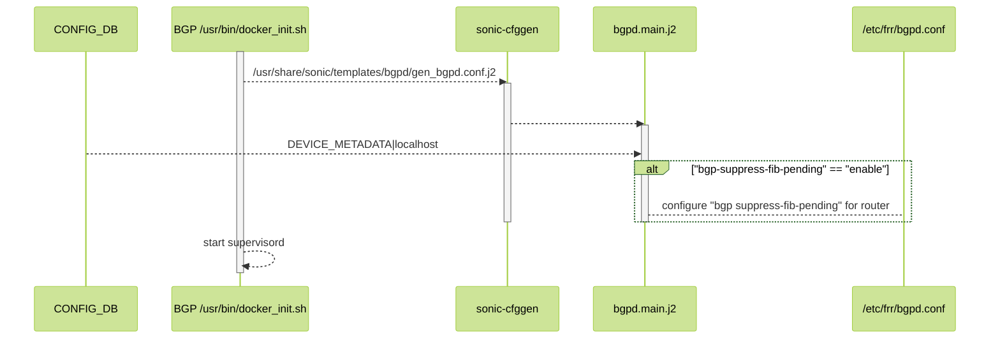
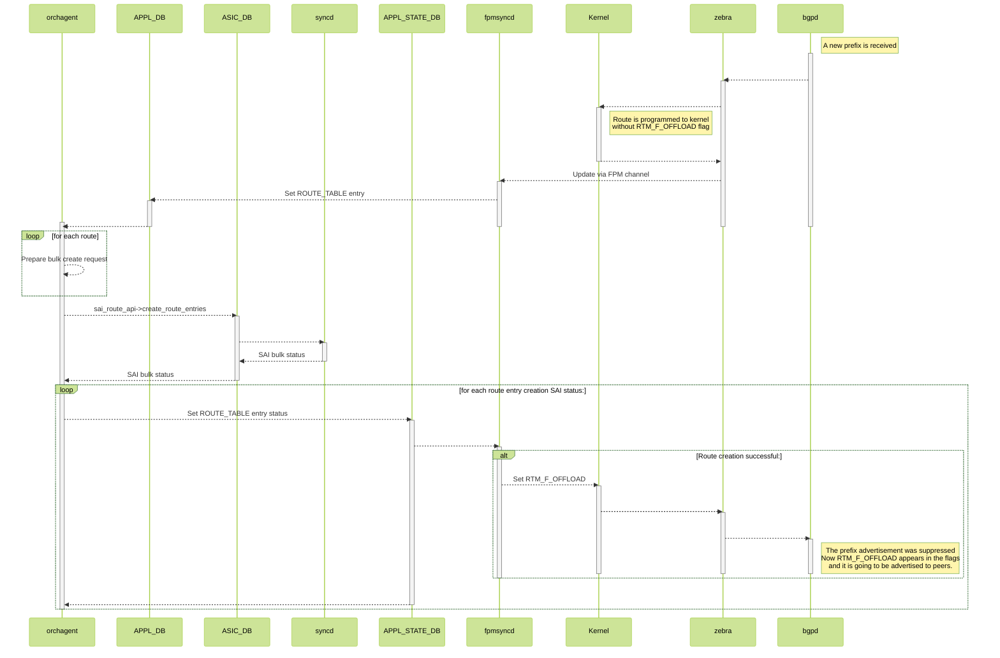
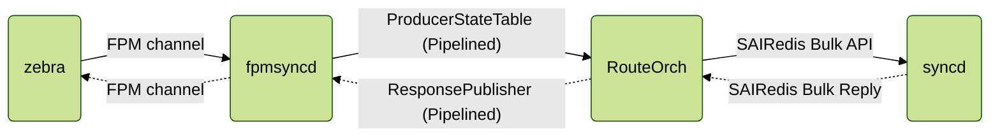

<!-- omit in toc -->
# BGP Supress FIB Pending #

<!-- omit in toc -->
## Table of Content

- [1. Scope](#1-scope)
- [2. Definitions/Abbreviations](#2-definitionsabbreviations)
- [3. Overview](#3-overview)
- [4. Requirements](#4-requirements)
- [5. Architecture Design](#5-architecture-design)
- [6. High-Level Design](#6-high-level-design)
- [7. RouteOrch](#7-routeorch)
  - [7.1. High-Level Flow Diagram](#71-high-level-flow-diagram)
  - [7.2. Temporary route](#72-temporary-route)
  - [7.3. Response Channel Performance considerations](#73-response-channel-performance-considerations)
- [8. SAI API](#8-sai-api)
- [9. Configuration and management](#9-configuration-and-management)
  - [9.1. Config DB Enhancements](#91-config-db-enhancements)
    - [9.1.1. APP_STATE_LOGGING](#911-app_state_logging)
    - [9.1.2. DEVICE_METADATA](#912-device_metadata)
  - [9.2. Manifest (if the feature is an Application Extension)](#92-manifest-if-the-feature-is-an-application-extension)
  - [9.3. CLI/YANG model Enhancements](#93-cliyang-model-enhancements)
    - [9.3.1. APP_STATE_LOGGING](#931-app_state_logging)
    - [9.3.2.  DEVICE_METADATA](#932--device_metadata)
- [10. Warmboot and Fastboot Design Impact](#10-warmboot-and-fastboot-design-impact)
- [11. Restrictions/Limitations](#11-restrictionslimitations)
- [12. Testing Requirements/Design](#12-testing-requirementsdesign)
  - [12.1. Unit Test cases](#121-unit-test-cases)
  - [12.2. System Test cases](#122-system-test-cases)
- [13. Open/Action items - if any](#13-openaction-items---if-any)

<!-- omit in toc -->
### 1. Revision

| Revision | Date        | Author           | Change Description |
| -------- | ----------- | ---------------- | ------------------ |
| 1.0      | Sep 15 2022 | Stepan Blyshchak | Initial proposal   |

### 1. Scope

This document describes a feedback mechanism that allows BGP not to adveritise routes that haven't been programmed yet or failed to be programmed to ASIC.

### 2. Definitions/Abbreviations

| Definitions/Abbreviation | Description                  |
| ------------------------ | ---------------------------- |
| BGP                      | Border Gateway Protocol      |
| FRR                      | Free Range Routing           |
| SWSS                     | Switch state service         |
| SYNCD                    | ASIC syncrhonization service |
| FPM                      | Forwarding Plane Manager     |
| SAI                      | Switch Abstraction Interface |

### 3. Overview

The FRR implementation of BGP advertises prefixes learnt from a peer to other peers even if the routes do not get installed in the FIB. There can be scenarios where the hardware tables in some of the routers (along the path from the source to destination) is full which will result in all routes not getting installed in the FIB. If these routes are advertised to the downstream routers then traffic will start flowing and will be dropped at the intermediate router.

The solution is to provide a configurable option to check for the FIB install status of the prefixes and advertise to peers if the prefixes are successfully installed in the FIB. The advertisement of the prefixes are suppressed if it is not installed in FIB.

The following conditions apply will apply when checking for route installation status in FIB:

- The advertisement or suppression of routes based on FIB install status applies only for newly learnt routes from peer (routes which are not in BGP local RIB).
- If the route received from peer already exists in BGP local RIB and route attributes have changed (best path changed), the old path is deleted and new path is installed in FIB. The FIB install status will not have any effect. Therefore only when the route is received first time the checks apply.
- The feature will not apply for routes learnt through other means like redistribution to bgp from other protocols. This is applicable only to peer learnt routes.
- If a route is installed in FIB and then gets deleted from the dataplane, then routes will not be withdrawn from peers. This will be considered as dataplane issue.
- The feature will slightly increase the time required to advertise the routes to peers since the route install status needs to be received from the FIB
- If routes are received by the peer before the configuration is applied, then the bgp sessions need to be reset for the configuration to take effect.
- If the route which is already installed in dataplane is removed for some reason, sending withdraw message to peers is not currently supported.

[FRR documentation reference](https://github.com/FRRouting/frr/blob/master/doc/user/bgp.rst)

Consider the following scenario:

<!-- omit in toc -->
##### Figure 1. Use case scenario

<p align=center>

</p>

The problem with BGP programming occurs after the T1 switch is rebooted:
1. First, the T1 FRR learns a default route from at least 1 T2
2. The T0 advertises it’s prefixes to T1
3. FRR advertises the prefixes to T2 without waiting for them to be programmed in the ASIC
4. T2 starts forwarding traffic for prefixes not yet programmed, according to T1’s routing table, T1 sends it back to a default route – same T2


When the traffic is bounced back on lossless queue, buffers on both sides are overflown, credit loop happens, with PFC storm and watchdog triggered shutting down the port.
To avoid that, the route programming has to be synchronous down to the ASIC to avoid credit loops.

### 4. Requirements

This section list out all the requirements for the HLD coverage and exemptions (not supported) if any for this design.

### 5. Architecture Design

Described functionality does not require changes to the current SONiC architecture. This design follows existing SONiC architecture approaches and uses existing SONiC infrastrcuture.

### 6. High-Level Design

In order to support this feature

This section covers the high level design of the feature/enhancement. This section covers the following points in detail.

    - Is it a built-in SONiC feature or a SONiC Application Extension?
    - What are the modules and sub-modules that are modified for this design?
    - What are the repositories that would be changed?
    - Module/sub-module interfaces and dependencies.
    - SWSS and Syncd changes in detail
    - DB and Schema changes (APP_DB, ASIC_DB, COUNTERS_DB, LOGLEVEL_DB, CONFIG_DB, STATE_DB)
    - Sequence diagram if required.
    - Linux dependencies and interface
    - Warm reboot requirements/dependencies
    - Fastboot requirements/dependencies
    - Scalability and performance requirements/impact
    - Memory requirements
    - Docker dependency
    - Build dependency if any
    - Management interfaces - SNMP, CLI, RestAPI, etc.,
    - Serviceability and Debug (logging, counters, trace etc) related design
    - Is this change specific to any platform? Are there dependencies for platforms to implement anything to make this feature work? If yes, explain in detail and inform community in advance.
    - SAI API requirements, CLI requirements, ConfigDB requirements. Design is covered in following sections.


### 7. RouteOrch

```c++
auto status = ReturnCode(saiStatus) << "Failed to create route " << ipPrefix.to_string().c_str() << " with next hop(s) " << nextHops.to_string().c_str();
SWSS_LOG_ERROR("%s", status.message().c_str());

m_publisher.publish(APP_ROUTE_TABLE_NAME, kfvKey(kofvs), kfvFieldsValues(kofvs), status);
```

#### 7.1. High-Level Flow Diagram

<!-- omit in toc -->
##### Figure 2. BGP Configuration Flow Diagram



<!-- omit in toc -->
##### Figure 3. BGP-SWSS Flow Diagram



#### 7.2. Temporary route

#### 7.3. Response Channel Performance considerations

Route programming performance is one of crucial characteristics of a network switch. It is desired to program a lot of route entries as quick as possible. SONiC has optimized route programming pipeline levaraging Redis Pipeline in ```ProducerStateTable``` as well as SAIRedis bulk APIs. Redis pipelining is a technique for improving performance by issuing multiple commands at once without waiting for the response to each individual command. Such an optimization gives around ~5x times faster processing for ```Publisher/Subscriber``` pattern using a simple python script as a test.

Adding a feedback mechanism to the system introduces a delay as each of the component needs to wait for the reply from the lower layer counterpart in order to proceed. SONiC has already moved to synchronous SAI Redis pipeline a route programming performance degradation caused by it is leveled by the use of SAIRedis Bulk API.

By introducing a response channel it is required to leverage Redis Pipeline, so that the route configuration producer using Redis Pipeline with ```ProducerStateTable``` also receives route programming status responses produced by pipelined ```NotificationProducer``` which is part of ```ResponsePublisher```.

On the other side, ```fpmsyncd``` does not wait for each individual route status but rather performs an asynchronous processing.



### 8. SAI API

No new SAI API or changes to SAI design and behaviour needed for this functionality.

### 9. Configuration and management

#### 9.1. Config DB Enhancements

##### 9.1.1. APP_STATE_LOGGING

Configuration schema in ABNF format:

```abnf
; APP_STATE_LOGGING table
key   = APP_STATE_LOGGING|ROUTE_TABLE ; Configuration for ROUTE_TABLE
state = "enabled"/"disabled"          ; Enable/disable response logging for ROUTE_TABLE
```

Sample of CONFIG DB snippet given below:

```json
{
    "APP_STATE_LOGGING": {
        "ROUTE_TABLE": {
            "state": "enabled"
        }
    }
}
```

##### 9.1.2. DEVICE_METADATA

Configuration schema in ABNF format:

```abnf
; DEVICE_METADATA table
key                      = DEVICE_METADATA|localhost ; Device metadata configuration table
bgp-suppress-fib-pending = "enabled"/"disabled"        ; Globally enable/disable BGP suppress-fib-pending feature, by default this flag is disabled
```

Sample of CONFIG DB snippet given below:

```json
{
    "DEVICE_METADATA": {
        "localhost": {
            "bgp-suppress-fib-pending": "enabled"
        }
    }
}
```

This configuration is backward compatible. Upgrade from a SONiC version that does not support this feature does not change the user's expected behaviour as this flag is set to be disabled by default.

#### 9.2. Manifest (if the feature is an Application Extension)

This feature is implemented as part of existing BGP and SWSS containers, no manifest changes are required.

#### 9.3. CLI/YANG model Enhancements

##### 9.3.1. APP_STATE_LOGGING

A new table ```APP_STATE_LOGGING``` and a corresponding YANG model is added:

```yang
module sonic-app-state-logging {
    yang-version 1.1;

    namespace "http://github.com/Azure/sonic-app-state-logging";
    prefix app-state-logging;

    description "APP_STATE_LOGGING YANG module for SONiC OS";

    revision 2022-09-15 {
        description "Initial revision";
    }

    container sonic-app-state-logging {
        container APP_STATE_LOGGING {
            description "Controls the enablement of a response channel per APPL_DB table";

            container ROUTE_TABLE {
                description "Configure response channel for ASIC route configuration";

                leaf state {
                    description "Enablement state of response channel for the given table";
                    type enumeration {
                        enum enabled;
                        enum disabled;
                    }
                    default disabled;
                }
            }
        }
    }
}
```

Note that response channel for ROUTE_TABLE can be enabled regardless of ```synchronous_mode``` as we might still get a response from ```RouteOrch``` validation logic as well as ```SAIRedis``` validation.

##### 9.3.2.  DEVICE_METADATA

A new leaf is added to ```sonic-device_metadata/sonic-device_metadata/DEVICE_METADATA/localhost``` called ```bgp-suppress-fib-pending``` which can be set to ```"enable"``` or ```"disable"```.

Snippet of ```sonic-device_metatadata.yang```:

```yang
module sonic-device_metadata {
    import sonic-app-state-logging {
        prefix app-state-logging;
    }

    revision 2022-09-15 {
        description "Add BGP suppress FIB pending configuration knob";
    }

    container sonic-device_metadata {
        container DEVICE_METADATA {
            description "DEVICE_METADATA part of config_db.json";

            container localhost{
                leaf bgp-suppress-fib-pending {
                    description "Enable BGP suppress FIB pending feature. BGP will wait for route
                                 FIB intallation before announcing routes. This configuration requires
                                 restarting BGP sessions.";
                    type enumeration {
                        enum enabled;
                        enum disabled;
                    }
                    default disabled;

                    must "((current() = 'disabled') or (current() = 'enabled' and ../synchronous_mode = 'enable' and /app-state-logging:sonic-app-state-logging/app-state-logging:APP_STATE_LOGGING/app-state-logging:ROUTE_TABLE/app-state-logging:state = 'enabled'))" {
                        error-message "ASIC synchronous mode and APP_STATE_LOGGIN for ROUTE_TABLE must to be enabled in order to enable BGP suppress FIB pending feature";
                    }
                }
            }
        }
    }
}
```

This knob can only be set to ```"enable"``` when syncrhonous SAI configuration mode is on. This constraint is guaranteed by the ```must``` expression for this leaf.

No python ```click```-based CLI command nor ```KLISH``` CLI is planned to be implemented for this functionality.

### 10. Warmboot and Fastboot Design Impact
Mention whether this feature/enhancement has got any requirements/dependencies/impact w.r.t. warmboot and fastboot. Ensure that existing warmboot/fastboot feature is not affected due to this design and explain the same.

### 11. Restrictions/Limitations

### 12. Testing Requirements/Design
Explain what kind of unit testing, system testing, regression testing, warmboot/fastboot testing, etc.,
Ensure that the existing warmboot/fastboot requirements are met. For example, if the current warmboot feature expects maximum of 1 second or zero second data disruption, the same should be met even after the new feature/enhancement is implemented. Explain the same here.
Example sub-sections for unit test cases and system test cases are given below.

#### 12.1. Unit Test cases

#### 12.2. System Test cases

### 13. Open/Action items - if any


NOTE: All the sections and sub-sections given above are mandatory in the design document. Users can add additional sections/sub-sections if required.
