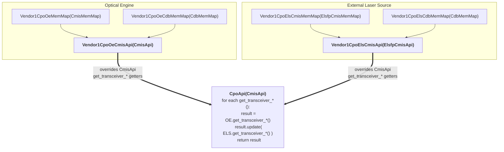

# SW-controlled CPO in Joint Mode

## Table of Contents

- [SW-controlled CPO in Joint Mode](#sw-controlled-cpo-in-joint-mode)
  - [Table of Contents](#table-of-contents)
  - [1. Revision](#1-revision)
  - [2. Overview](#2-overview)
  - [3. Definitions/Abbreviations](#3-definitionsabbreviations)
  - [4. Scope](#4-scope)
    - [Out of Scope (Current Revision):](#out-of-scope-current-revision)
    - [Added in Rev 0.2:](#added-in-rev-02)
  - [5. Requirements](#5-requirements)
  - [6. Architecture Design](#6-architecture-design)
  - [7. High-Level Design](#7-high-level-design)
    - [7.1 CMIS State Machine Thread for CPO Modules](#71-cmis-state-machine-thread-for-cpo-modules)
    - [7.2 DOM: CPO API Wiring](#72-dom-cpo-api-wiring)
    - [7.3 DOM: CPO EEPROM Layout and STATE\_DB Mapping](#73-dom-cpo-eeprom-layout-and-state_db-mapping)
      - [7.3.1 Memory Map Composition](#731-memory-map-composition)
      - [7.3.2 CDB Commands (canonical pattern)](#732-cdb-commands-canonical-pattern)
      - [7.3.3 STATE\_DB Integration via Aggregator Overrides](#733-state_db-integration-via-aggregator-overrides)
    - [Platform Implementation Alignment](#platform-implementation-alignment)
  - [8. SAI API](#8-sai-api)
  - [9. Configuration and management](#9-configuration-and-management)
    - [9.1. Manifest (if the feature is an Application Extension)](#91-manifest-if-the-feature-is-an-application-extension)
    - [9.2. CLI/YANG model Enhancements](#92-cliyang-model-enhancements)
    - [9.3. Config DB Enhancements](#93-config-db-enhancements)
  - [10. Warmboot and Fastboot Design Impact](#10-warmboot-and-fastboot-design-impact)
  - [11. Memory Consumption](#11-memory-consumption)
  - [12. Restrictions/Limitations](#12-restrictionslimitations)
  - [13. Testing Requirements/Design](#13-testing-requirementsdesign)
  - [14. Open/Action items - if any](#14-openaction-items---if-any)

---
<br>

## 1. Revision

| Rev | Date       | Author       | Change Description |
|-----|------------|--------------|--------------------|
| 0.1 | 2026-03-31 | Tomer Shalvi | Initial version.   |
| 0.2 | 2026-05-04 | Natanel Gerbi | DOM: CPO data plane -- vendor CPO subclasses (one OE component, one or more ELS components) using B0..B3 vendor mirror pages and CDB commands, exposed to STATE_DB via aggregator-method overrides. No daemon changes. |

<br>

## 2. Overview

**CPO (Co-Packaged Optics)** is a system architecture in which optical components are integrated directly with the switch ASIC, rather than implemented as external pluggable transceivers (e.g., QSFP-DD, OSFP). This integration reduces electrical trace length and improves overall system power efficiency.

At the hardware level, a CPO module is composed of:
* **Optical Engine (OE)** — responsible for electrical-to-optical and optical-to-electrical signal conversion.
* **External Laser Source (ELS)** — providing continuous laser light used by the Optical Engines for transmission.

CPO systems support two operational models:
* **Separate Mode**, where the host directly accesses and manages the underlying components (e.g., OEs and ELSs). See *port_mapping_for_cpo.md* section 2.
* **Joint Mode**, where the host interacts with a CPO module abstraction, without directly managing the underlying components.

To preserve compatibility with existing SONiC and SAI workflows, we introduce a **Virtual CPO Module (or vModule)** that mimics the behavior of a traditional optical module by providing a logical abstraction that exposes a single unified CMIS interface for both the integrated Optical Engine (OE) and External Laser Sources (ELS).

A vModule exposes **32 lanes**, compared to 8 lanes in standard pluggable modules. transceiver. More information regarding 32-lane modules support can be found in *cmis_banking_support.md* section 7.8.

<br>


## 3. Definitions/Abbreviations

| Term   | Definition |
|--------|------------|
| CPO    | Co-Packaged Optics |
| CMIS   | Common Management Interface Specification |
| vModule| Virtual Module |
| ELS    | External Laser Source |
| OE     | Optical Engine |
| SM     | State Machine |
| FW     | Firmware |
| SW     | Software |
| EEPROM | Electrically Erasable Programmable Read-Only Memory |
| DOM    | Digital Optical Monitoring |
| VDM    | Versatile Diagnostics Monitoring |
| CDB    | Command Data Block |
| ELSFP  | External Laser Source Forward Path |

<br>


## 4. Scope

This document defines the **SW-controlled CPO in Joint Mode**, where SONiC sees CPO modules and interacts with them through the CPO abstraction layer, leveraging the existing CMIS-based host management flows.

Note: the **Separate Mode**, where the host system directly interacts with and manages the underlying optical hardware components is defined in *port_mapping_for_cpo.md* section 2.

The main objective of this document is to demonstrate that supporting Joint Mode:
* Does **not require fundamental changes** to the SONiC architecture.
* Requires only **minor extensions in the generic CMIS host management logic**.
* Relies on **platform-level implementations as defined in existing community HLDs**, with platform-specific behavior described where applicable.

This document builds on existing community HLDs and extends them to support Joint Mode, without redefining them:
* [port_mapping_for_cpo](https://github.com/nexthop-ai/SONiC/blob/274228b44de9edbbf6f1585c9bb7392853cbbc08/doc/platform/port_mapping_for_cpo.md)
* [cmis_banking_support](https://github.com/bobby-nexthop/SONiC/blob/0b09f1cc3e91853fcbabb29efb76fa6ea4b9647d/doc/layer1/cmis_banking_support.md)

### Out of Scope (Current Revision):

This revision of the HLD focuses on the **link-up flow for SW-controlled CPO ports in Joint Mode**.  
The following aspects are **not covered in this revision**, are currently **under development**, and will be addressed in future updates:

* Error handling: A protection mechanism will be introduced to handle CPO-related faults (e.g., thermal events and laser power anomalies).  
* Firmware upgrade: Firmware upgrade support for CPO modules is out of scope for this revision and will be defined in a future update.  
* CLI enhancements: Additional CLI command for CPO vendor-specific error statuses.  

### Added in Rev 0.2:

* DOM: CPO telemetry statistics design, extending the existing DOM flow to include OE telemetry and ELS monitoring statistics via the CPO abstraction EEPROM. The design uses **vendor CPO subclasses of `CmisApi`** (one for the Optical Engine, one for the External Laser Source), composed under a thin wrapper. ELS exposes its CMIS-shaped surface through **vendor mirror pages B0..B3** (re-using the standard CMIS page classes at non-standard page numbers). The data is published to STATE_DB by overriding the existing `CmisApi` aggregator methods, so **no changes are required in `xcvrd`, the STATE_DB schema, or the polling loop**. See Section 7.3.

<br>


## 5. Requirements

**Functional Requirements:**
* Support CPO abstraction layer that exposes one or more CPO (virtual) modules, each module has OE and ELS, and is accessible via a single CMIS interface. 
* While working in CPO Joint Mode, the system shall work directly with the CPO abstraction.
* The system shall support correct instantiation of the transceiver object for CPO modules (module type id 0x80).
* The system shall allow CPO modules to be configured via the existing CMIS state machine.
* The system shall support CPO-specific CMIS memory map(s) for the ELS (External Laser Source) and the OE (Optical Engine).
* The system shall collect and publish CPO-specific OE and ELS telemetry (temperature, voltage, laser monitors, lane status) to STATE_DB via the existing DOM polling mechanism, without requiring changes to `xcvrd`, the STATE_DB schema, or the polling loop.

**Non-Functional Requirements:**
* The solution shall maximize the reuse of existing CMIS infrastructure to avoid changing generic code.
* The solution shall remain aligned with existing community HLDs without redefining them.

<br>


## 6. Architecture Design

## 7. High-Level Design

In Joint Mode, SONiC continues to operate using the existing CMIS host management architecture, using exactly the same xcvrd logic, without introducing changes to the overall control flow.

As a result, the following extensions are needed:

### 7.1 CMIS State Machine Thread for CPO Modules

The CMIS state machine thread is responsible for module configuration. It orchestrates the bring-up of a CMIS transceiver, transitioning it from the inserted state to a ready-for-traffic state.  
To support CPO modules, the existing `CmisManagerTask` thread in `xcvrd` will be extended to handle the `CPO` module type. No new dedicated CPO configuration thread will be introduced.
The only required change in this area is to add `CPO` to the list of CMIS module types handled by `CmisManagerTask`:

```python
CMIS_MODULE_TYPES = ['QSFP-DD', 'QSFP_DD', 'OSFP', 'OSFP-8X', 'QSFP+C', 'CPO']
```

With this change, CPO modules will be processed by the existing CMIS state machine flow.


### 7.2 DOM: CPO API Wiring

The module type ID dispatch table in `xcvr_api_factory` is extended with the CPO module type `0x80`, which routes to a new entry point `_create_cmis_cpo_api(bank_id)`. The `bank_id` (0-3) identifies which 8-lane bank the SFP object represents within the 32-lane CPO module and is taken straight from the platform per-bank SFP object.

**`create_xcvr_api`** -- adds one row to the existing ID table; `0x80` is the only new entry, and it is the only ID that needs the bank id.

*Dispatch CPO module type `0x80` to the joint-mode builder.*

```python
# In xcvr_api_factory (common code)
def create_xcvr_api(self, bank_id=0):
    id = self._get_id()
    id_mapping = {
        ...
        0x18: (self._create_cmis_api, ()),
        0x19: (self._create_cmis_api, ()),
        0x80: (self._create_cmis_cpo_api, (bank_id,)),
        ...
    }
    ...
```

**`_create_cmis_cpo_api`** -- pure orchestration: it just calls the OE builder, threads the ELS-upper-admin-page hint that comes back from it into the ELS builder, and wraps both APIs in a `CpoApi`. Vendor resolution lives inside each builder, so the orchestrator stays vendor-agnostic.

*`_create_cmis_cpo_api`: orchestrate the OE and ELS builders.*

```python
def _create_cmis_cpo_api(self, bank_id):
    oe_api, els_admin_upper_page = self._build_cpo_oe_api(bank_id)
    els_api = self._build_cpo_els_api(els_admin_upper_page, bank_id)
    return CpoApi(oe_api, els_api)
```


**`_build_cpo_oe_api` / `_build_cpo_els_api`** -- per-component, per-vendor dispatch tables. Each builder resolves *its own* vendor and dispatches:

* `_build_cpo_oe_api` reads the **OE vendor** from the standard CMIS page-0 vendor name (`self._get_vendor_name()`). It returns a `(oe_api, els_admin_upper_page)` tuple: the OE-component `CmisApi` plus the **ELSFP `CmisAdministrativeUpperPage` ID** that the OE vendor's vModule FW exposes (the page that carries the ELS vendor name, OUI, PN, etc.). The in-page byte offsets are inherited from the standard CMIS layout, so the orchestrator only needs the page ID.
* `_build_cpo_els_api` takes that `els_admin_upper_page` and calls the dedicated helper **`_get_vendor_els_name(els_admin_upper_page)`** to read the ELS vendor name from EEPROM (the in-page byte offset is taken from the `CmisAdministrativeUpperPage` class, so callers never repeat it). It then dispatches to the matching ELS branch and returns just the ELS-component `CmisApi`.

*Per-component, per-vendor dispatch in `_build_cpo_oe_api` / `_build_cpo_els_api`. The vendor `CdbMemMap` is injected via `_create_api(..., cdb_mem_map=...)`.*

```python
def _build_cpo_oe_api(self, bank_id):
    oe_vendor = self._get_vendor_name()
    # Vendor-1 OE: vendor OE codes + memmap + API; CDB memmap injects
    # cdb_handler for vendor-1 OE CDB commands. The vendor-1 vModule FW
    # exposes the ELS vendor name on VENDOR1_ELS_ADMIN_UPPER_PAGE.
    if oe_vendor == VENDOR1_OE_NAME:
        oe_api = self._create_api(Vendor1CpoOeCodes, Vendor1CpoOeMemMap,
                                  Vendor1CpoOeCmisApi, bank=bank_id,
                                  cdb_mem_map=Vendor1CpoOeCdbMemMap(Vendor1CpoOeCdbCodes))
        return oe_api, VENDOR1_ELS_ADMIN_UPPER_PAGE
    # Vendor-2 OE: same shape, vendor-2 ELS upper admin page.
    if oe_vendor == VENDOR2_OE_NAME:
        oe_api = self._create_api(Vendor2CpoOeCodes, Vendor2CpoOeMemMap,
                                  Vendor2CpoOeCmisApi, bank=bank_id,
                                  cdb_mem_map=Vendor2CpoOeCdbMemMap(Vendor2CpoOeCdbCodes))
        return oe_api, VENDOR2_ELS_ADMIN_UPPER_PAGE
    # Default OE: stock CmisApi + CmisMemMap, no cdb_mem_map -> cdb_handler
    # is None; no ELS upper admin page -> default ELS component will be used.
    oe_api = self._create_api(CmisCodes, CmisMemMap, CmisApi, bank=bank_id)
    return oe_api, None

def _build_cpo_els_api(self, els_admin_upper_page, bank_id):
    els_vendor = self._get_vendor_els_name(els_admin_upper_page)
    # Vendor-1 ELS: vendor ELS codes + memmap + API; CDB memmap injects
    # cdb_handler for vendor-1 ELS CDB commands.
    if els_vendor == VENDOR1_ELS_NAME:
        return self._create_api(Vendor1CpoElsCodes, Vendor1CpoElsCmisMemMap,
                                Vendor1CpoElsCmisApi, bank=bank_id,
                                cdb_mem_map=Vendor1CpoElsCdbMemMap(Vendor1CpoElsCdbCodes))
    # Vendor-2 ELS: same shape, vendor-2 modules.
    if els_vendor == VENDOR2_ELS_NAME:
        return self._create_api(Vendor2CpoElsCodes, Vendor2CpoElsCmisMemMap,
                                Vendor2CpoElsCmisApi, bank=bank_id,
                                cdb_mem_map=Vendor2CpoElsCdbMemMap(Vendor2CpoElsCdbCodes))
    # Default ELS: stock ElsfpCmisApi + ElsfpCmisMemMap, no cdb_mem_map.
    return self._create_api(CmisCodes, ElsfpCmisMemMap, ElsfpCmisApi, bank=bank_id)
```

Onboarding a new vendor is therefore: add `<Vendor>Cpo{Oe,Els}Codes` / `MemMap` / `CmisApi` modules under `sonic_xcvr/{codes,mem_maps,api}/<vendor>/`, plus optional `CdbCodes` / `CdbMemMap` modules under `sonic_xcvr/cdb/<vendor>/`, then add one `if`-arm in each relevant builder (`_build_cpo_oe_api` reports the OE-vendor's `els_admin_upper_page` ID alongside the OE API; `_build_cpo_els_api` returns just the ELS API). `_create_cmis_cpo_api`, `create_xcvr_api`, and `CpoApi` are untouched.

**`CpoApi`** -- the generic joint-mode wrapper that ties the OE and ELS components together. Defined in `sonic_xcvr/api/public/cpo.py` and inheriting from `CmisApi`, it composes the OE and ELS `CmisApi` components built above. Each vendor component sits on top of its own MemMap + CDB MemMap, overrides the standard `CmisApi.get_transceiver_*()` aggregators to contribute its CPO-specific fields, and feeds `CpoApi` -- which calls each component and merges their dicts:

*Joint-mode composition: `CpoApi` wraps the OE and ELS vendor components.*



**Platform SFP object** -- the platform side of the wiring. As described in *cmis_banking_support.md* §7.8.2 (and discussed further in §7.4 below), each per-bank SFP object represents one 8-lane bank of a CPO module. Joint-mode platforms just override `refresh_xcvr_api()` on their `Sfp(SfpBase)` subclass to feed `bank_id` into the factory:

*Platform SFP object: feed `bank_id` into the factory.*

```python
# Platform SFP object (sonic_platform/sfp.py)
class Sfp(SfpBase):
    def refresh_xcvr_api(self):
        """
        Updates the XcvrApi associated with this SFP.
        """
        self._xcvr_api = self._xcvr_api_factory.create_xcvr_api(self.bank_id)
```

**New files.** All of the joint-mode CPO code lands in `sonic-platform-common` under `sonic_xcvr/`. The `public/` subtree holds the shared infrastructure (the joint-mode wrapper plus the ELSFP base classes); each vendor that ships extensions adds parallel sub-trees under `codes/<vendor>/`, `mem_maps/<vendor>/`, `api/<vendor>/`, and `cdb/<vendor>/`.

*Proposed file structure under `sonic-platform-common/sonic_platform_base/sonic_xcvr/`.*

```text
sonic-platform-common/sonic_platform_base/sonic_xcvr/
├── api/
│   ├── public/
│   │   ├── cpo.py                       CpoApi joint-mode wrapper
│   │   └── elsfp_cmis.py                ElsfpCmisApi base
│   ├── vendor1/
│   │   ├── cpo_oe.py                    Vendor1CpoOeCmisApi
│   │   └── cpo_els.py                   Vendor1CpoElsCmisApi
│   └── vendor2/
│       ├── cpo_oe.py                    Vendor2CpoOeCmisApi
│       └── cpo_els.py                   Vendor2CpoElsCmisApi
├── codes/
│   ├── vendor1/
│   │   ├── cpo_oe.py                    Vendor1CpoOeCodes
│   │   └── cpo_els.py                   Vendor1CpoElsCodes
│   └── vendor2/
│       └── ...                          same shape per vendor
├── mem_maps/
│   ├── public/
│   │   └── elsfp_cmis.py                ElsfpCmisMemMap
│   ├── vendor1/
│   │   ├── cpo_oe.py                    Vendor1CpoOeMemMap
│   │   └── cpo_els.py                   Vendor1CpoElsCmisMemMap (B0..B3 vendor mirrors)
│   └── vendor2/
│       └── ...                          same shape per vendor
└── cdb/
    ├── public/
    │   └── cdb.py                       CDBCommand, CdbMemMap base classes
    ├── vendor1/
    │   ├── cpo_oe_codes.py              Vendor1CpoOeCdbCodes
    │   ├── cpo_oe_memmap.py             Vendor1CpoOeCdbMemMap  (vendor OE CDB cmd)
    │   ├── cpo_els_codes.py             Vendor1CpoElsCdbCodes
    │   └── cpo_els_memmap.py            Vendor1CpoElsCdbMemMap (vendor ELS CDB cmd)
    └── vendor2/
        └── ...                          same shape per vendor
```

### 7.3 DOM: CPO EEPROM Layout and STATE_DB Mapping

OE and ELS telemetry are exposed by vendor-specific subclasses of the standard `CmisApi`/`CmisMemMap`/`ElsfpCmisApi`/`ElsfpCmisMemMap` machinery. The OE and ELS components are composed at runtime by `CpoApi` (the generic joint-mode wrapper in `sonic_xcvr/api/public/cpo.py`), and each vendor component overrides the relevant `CmisApi` aggregator methods to contribute its CPO-specific fields. The wrapper then merges the OE and ELS dicts into the single dict that `xcvrd` writes to STATE_DB. As a result, **no changes are required in `xcvrd`, in the STATE_DB schema, or in the polling loop** -- all CPO telemetry rides the existing aggregator path.

#### 7.3.1 Memory Map Composition

The CMIS page-class abstraction re-used here -- composing a memmap from `CmisPage` subclasses, declaring fields with `getaddr()`, and getting page-aware addressing for free -- and the standard ELSFP pages (0x1A / 0x1B) it sits on top of, are described in the upstream HLD: [ELSFP Memory map and paging support -- sonic-net/SONiC#2207](https://github.com/sonic-net/SONiC/issues/2207).

This section only describes what joint-mode CPO layers on top of that: the **vendor mirror pages** for ELS.

The table below shows **example** of mapped layout:

| Vendor page | Re-uses class | Mirrors | Carries |
|---|---|---|---|
| `0xB0` -- ModuleStatus | `CmisAdministrativeLowerPage` | CMIS page 0 lower memory | ModuleState, ModuleFaultCause, module-level monitors (Temperature, Vcc, ...), module flags |
| `0xB1` -- Identity     | `CmisAdministrativeUpperPage` | CMIS page 0 upper (admin)  | Vendor name, OUI, PN, rev, serial, date code, ext-id (power class, max power), connector type |
| `0xB2` -- Advertising  | `CmisAdvertisingPage`         | CMIS page 1 (advertising)  | HW major / minor revision, advertising flags |
| `0xB3` -- Thresholds   | `CmisThresholdsPage`          | CMIS page 2 (thresholds)   | Temperature / Voltage / Tx_power / Tx_bias / Rx_power -- high/low alarm and high/low warning thresholds |

#### 7.3.2 CDB Commands (canonical pattern)

The CMIS Command/Diagnostic Block (CDB) is the standard request/reply mailbox carved out of the EEPROM: the consumer writes a command + payload into the CDB region, the module processes it, and writes back a structured reply that the consumer reads back. All CDB traffic flows through the generic `CdbCmdHandler` already provided by `CmisApi.cdb_handler`.

Vendor components expose CDB-driven getters by wiring each CDB command in two places. The **MemMap layer** declares the command (its opcode, request/reply lengths) and the layout of the reply as a `RegGroupField` of typed fields, plus an `encode()` that packs the LPL request payload. The **API layer** simply orchestrates `cdb_handler.send_cmd()` + `cdb_handler.read_reply()` and returns the decoded dict -- no CDB framing or wire-level reply layout leaks to call sites. The vendor `CdbMemMap` is plumbed into the API by the factory via `_create_api(..., cdb_mem_map=...)` (see the `_build_cpo_*_api` snippets in §7.2).
the pattern looks like:

*MemMap layer -- declare the CDB command and the layout of its reply.*

```python
# MemMap layer  (sonic_xcvr/cdb/<vendor>/cpo_oe_memmap.py)
# Declares the CDB command and the layout of its reply.

import struct

from ...fields import cdb_consts
from ...fields.xcvr_field import NumberRegField, RegGroupField
from ..public.cdb import CDBCommand, CdbMemMap


class CdbReadOeTelemetry(CDBCommand):
    """Read OE telemetry: LPL request, EPL reply."""

    def __init__(self,
                 cmd_id=OE_TELEMETRY_CDB_CMD,
                 reply_field=OE_TELEMETRY_REPLY_GROUP):
        super().__init__(
            cmd_id,
            epl=OE_TELEMETRY_EPL_LEN,
            lpl=OE_TELEMETRY_LPL_LEN,
            rpl_field=reply_field,
        )

    def encode(self, payload):
        """Pack the dict-payload into the LPL bytes."""
        bank_id      = payload.get("bank_id", 0) & 0xFF
        request_mask = payload.get("request_mask",
                                   OE_TELEMETRY_REQUEST_MASK_ALL) & 0xFFFFFFFF
        lpl_bytes = struct.pack("B", bank_id) + struct.pack(">I", request_mask)
        return super().encode(payload=lpl_bytes)


class Vendor1CpoOeCdbMemMap(CdbMemMap):
    def __init__(self, codes):
        super().__init__(codes)
        getaddr = self.getaddr

        reply_fields = [
            NumberRegField(OE_TLM_CAPABILITY,
                           getaddr(cdb_consts.EPL_PAGE, 128 + _OFF_CAPABILITY),
                           size=4, format=">I"),
            NumberRegField(OE_TLM_VALID,
                           getaddr(cdb_consts.EPL_PAGE, 128 + _OFF_VALID),
                           size=4, format=">I"),
            # ... per-lane fields (NumberRegField + RegBitsField for nibble-packed
            #     vectors, u16 / u8 vectors built by small helper fns) ...
        ]
        self.oe_telemetry_reply = RegGroupField(OE_TELEMETRY_REPLY_GROUP,
                                                *reply_fields)

        # Register the command on this memmap so cdb_handler can find it.
        self.read_oe_telemetry_cmd = CdbReadOeTelemetry()
```

*API layer -- thin orchestration of `send_cmd` + `read_reply`.*

```python
# API layer  (sonic_xcvr/api/<vendor>/cpo_oe.py)
# Orchestrates send_cmd + read_reply; returns the raw decoded reply dict.

from ...cdb.vendor1.cpo_oe_memmap import (
    OE_TELEMETRY_CDB_CMD,
    OE_TELEMETRY_REQUEST_MASK_ALL,
)

class Vendor1CpoOeCmisApi(CmisApi):

    def get_oe_telemetry(self, bank_id=0,
                         request_mask=OE_TELEMETRY_REQUEST_MASK_ALL):
        """Issue the CDB cmd and return the decoded reply dict."""
        if self.cdb_handler is None:
            return None  # CDB not wired (default OE component)

        payload = {"bank_id": bank_id, "request_mask": request_mask}
        try:
            ok = self.cdb_handler.send_cmd(OE_TELEMETRY_CDB_CMD, payload=payload)
        except Exception:
            return None
        if not ok:
            return None

        try:
            return self.cdb_handler.read_reply(OE_TELEMETRY_CDB_CMD)
        except Exception:
            return None
```

New vendors / new CDB commands plug in by adding a `CDBCommand` subclass + reply `RegGroupField` to their `CdbMemMap`, plus a thin API getter that calls `send_cmd` / `read_reply` against it. Consumers (the aggregator overrides in §7.3.3 and any other caller) just invoke that getter and receive the decoded dict.

#### 7.3.3 STATE_DB Integration via Aggregator Overrides

The standard `CmisApi` aggregators (`get_transceiver_info`, `get_transceiver_dom_real_value`, `get_transceiver_status_flags`, etc.) are wired in layers so that each class only contributes the fields it owns:

* **Generic CMIS layer (`CmisApi`)** -- provides the standard CMIS aggregator output (vendor / PN / serial / VDM / DOM / ...).
* **Generic ELSFP layer (`ElsfpCmisApi`)** -- overrides each aggregator to expose the generic ELSFP getters (`get_elsfp_lane_monitors`, `get_elsfp_lane_thresholds`, `get_elsfp_fault_warning_codes`, ...). All returned keys are `els_*`-prefixed.
* **Vendor OE component (e.g. `Vendor1CpoOeCmisApi`)** -- chains `super().<aggregator>()` to inherit the standard CMIS dict, then overlays its OE-specific extension (e.g. OE CDB telemetry).
* **Vendor ELS component (e.g. `Vendor1CpoElsCmisApi`)** -- chains `super().<aggregator>()` to inherit the generic ELSFP dict, then overlays its ELS-specific extension (vendor mirror pages, ELS CDB readouts). All extensions stay `els_*`-prefixed.
* **`CpoApi` wrapper** -- for each aggregator, takes the OE-component dict as the base and `dict.update()`s the ELS-component dict on top. Because every ELS-side key is `els_*`-prefixed, the merge is a disjoint union and the ELS component never overwrites OE/CMIS keys.

Every contributor (generic-layer aggregator, vendor-side getter) returns a dict. Vendor components chain `super()` and `update()`. 

**example OE:**
```python
class Vendor1CpoOeCmisApi(CmisApi):
    def get_transceiver_vdm_real_value(self):
        result = super().get_transceiver_vdm_real_value()
        result.update(self.get_oe_telemetry())   # vendor OE CDB
        return result
```

**example ELS:**
```python
class Vendor1CpoElsCmisApi(ElsfpCmisApi):
    def get_transceiver_status_flags(self):
        result = super().get_transceiver_status_flags()
        result.update(self.get_els_laser_monitoring())  # vendor ELS CDB
        return result
```

<br>

### Platform Implementation Alignment
From the platform implementation perspective, the design aligns completely with the approaches described in the community HLDs:

* As described in the *cmis_banking_support.md* (section 7.8.2), the platform will expose one SFP object per bank. This structure in Joint mode is illustrated below:

    

    * Lane-to-SFP object mapping is not handled in generic SONiC logic and is instead implemented in the platform layer.
    * Platform code also handles plug-in/plug-out events: The CPO abstraction in Joint mode allows SONiC to interact with the module as if it were a traditional pluggable device, including handling plug-in and plug-out events of the ELS. The chassis continues to listen for change events from the lower layers and notifies *xcvrd* accordingly. The key difference is that, instead of monitoring physical pluggable modules, the system now monitors CPO modules. This approach enables maximal reuse of the existing codebase and results in minimal changes required to support SW-controlled operation in Joint mode.
    * This structure explains why no changes are required in the CMIS state machine logic: The CMIS state machine operates at the **logical port level**, where the list of logical ports is derived from the *CONFIG_DB.PORT table*. This model remains unchanged in Joint Mode. With the SFP-per-bank approach:
        * Each SFP object continues to represent up to 8 lanes.
        * Multiple logical ports may share the same module index, as in existing pluggable module implementations.
        * As a result, from the CMIS state machine perspective, the system behavior remains unchanged, regardless of whether the underlying 8-lane unit is a traditional pluggable transceiver or an sfp object.

* As described in the *port_mapping_for_cpo.md* section 7.3.2, the SFP objects will follow the same structure, including references to the underlying OE and ELS components, together with the associated bank index (*cmis_banking_support.md* section 7.8.3). The instantiation of these SFP objects will be done in platform chassis (*port_mapping_for_cpo.md* section 7.3.3) and rely on platform configuration files (e.g., a JSON file similar to `optical_devices.json`, as proposed in *port_mapping_for_cpo.md* section 7.1).

<br>


## 8. SAI API

## 9. Configuration and management

### 9.1. Manifest (if the feature is an Application Extension)

### 9.2. CLI/YANG model Enhancements

In addition to the bank-aware EEPROM access commands introduced in *cmis_banking_support.md* (section 7.9), this design introduces an update to the following CLI command for monitoring CPO-specific error statuses:

**Syntax:**
`show interfaces transceiver error-status [<interface_name>] [-hw]`

This command extends the existing transceiver status reporting to include **CPO vendor-specific error conditions**, such as laser or fiber-related failures.

*Example output of `show interfaces transceiver error-status`.*

```text
show interfaces transceiver error-status [<interface_name>] [-hw]

Port         Error Status
-----------  ---------------
Ethernet0    OK
Ethernet4    OK
Ethernet8    Laser high power
Ethernet12   Fiber check failure
...
```

### 9.3. Config DB Enhancements

No Config DB changes are required (Except for the *associated_devices* field added to the *CONFIG_DB.PORT table*, mentioned in *port_mapping_for_cpo.md*, section 9.2).

<br>


## 10. Warmboot and Fastboot Design Impact

## 11. Memory Consumption

## 12. Restrictions/Limitations

## 13. Testing Requirements/Design

## 14. Open/Action items - if any
