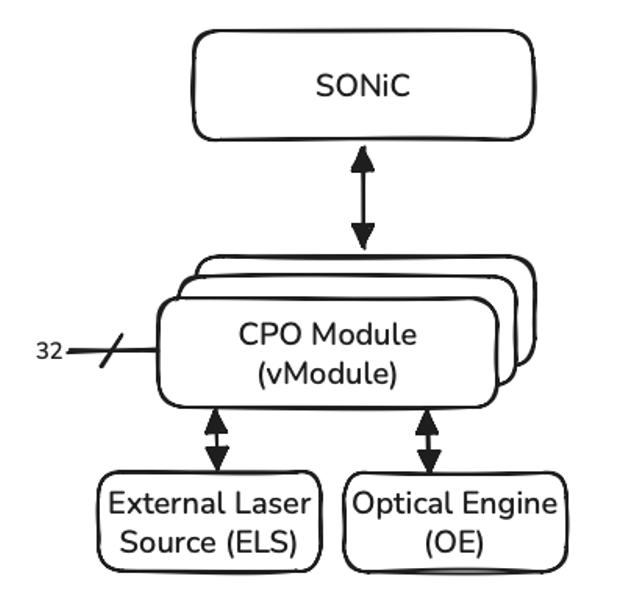
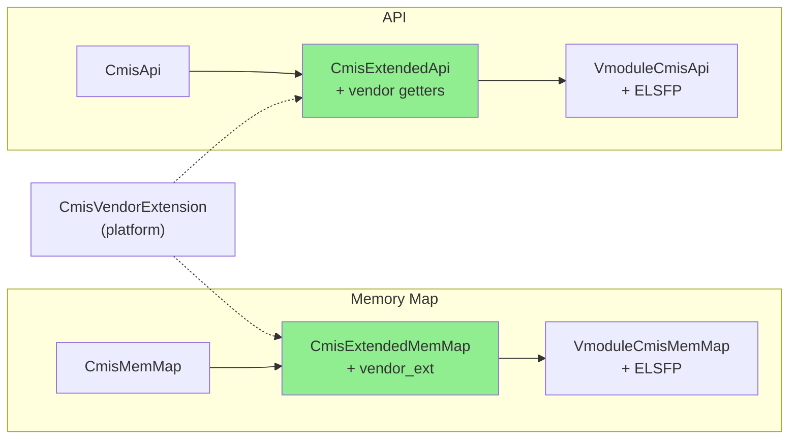
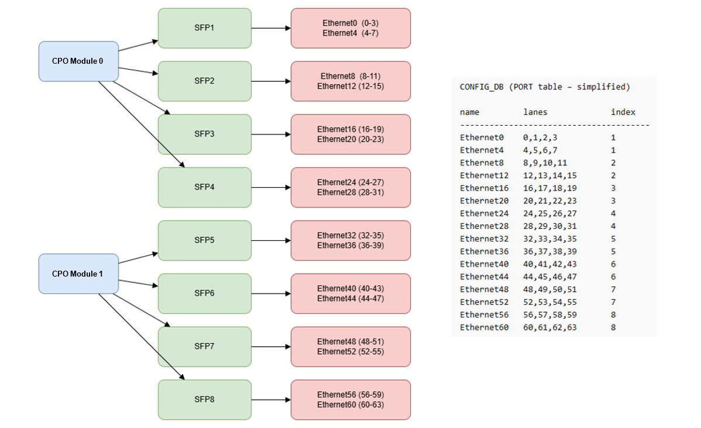

# SW-controlled CPO in Joint Mode

## Table of Contents

1. [Revision](#1-revision)
2. [Overview](#2-overview)
3. [Definitions/Abbreviations](#3-definitionsabbreviations)
4. [Scope](#4-scope)
5. [Requirements](#5-requirements)
6. [Architecture Design](#6-architecture-design)
7. [High-Level Design](#7-high-level-design)
   - 7.1 [CMIS State Machine Thread for CPO Modules](#71-cmis-state-machine-thread-for-cpo-modules)
   - 7.2 [Module Type ID ↔ Transceiver API Mapping](#72-module-type-id--transceiver-api-mapping)
   - 7.3 [DOM: CPO Telemetry Statistics](#73-dom-cpo-telemetry-statistics)
     - 7.3.1 [Class Hierarchy](#731-class-hierarchy)
     - 7.3.2 [Memory Map - VmoduleCmisMemMap](#732-memory-map---vmodulecmismemmap)
     - 7.3.3 [API - VmoduleCmisApi](#733-api---vmodulecmisapi)
8. [SAI API](#8-sai-api)
9. [Configuration and management](#9-configuration-and-management)
   - 9.1. [Manifest (if the feature is an Application Extension)](#91-manifest-if-the-feature-is-an-application-extension)
   - 9.2. [CLI/YANG model Enhancements](#92-cliyang-model-enhancements)
   - 9.3. [Config DB Enhancements](#93-config-db-enhancements)
10. [Warmboot and Fastboot Design Impact](#10-warmboot-and-fastboot-design-impact)
11. [Memory Consumption](#11-memory-consumption)
12. [Restrictions/Limitations](#12-restrictionslimitations)
13. [Testing Requirements/Design](#13-testing-requirementsdesign)
14. [Open/Action items](#14-openaction-items---if-any)

---
<br>

## 1. Revision

| Rev | Date       | Author       | Change Description |
|-----|------------|--------------|--------------------|
| 0.1 | 2026-03-31 | Tomer Shalvi | Initial version.   |
| 0.2 | 2026-04-12 | Natanel Gerbi | DOM: CPO telemetry statistics design. Vendor extension framework separated into [standalone HLD](https://github.com/sonic-net/SONiC/pull/2291) |

<br>

## 2. Overview

**CPO (Co-Packaged Optics)** is a system architecture in which optical components are integrated directly with the switch ASIC, rather than implemented as external pluggable transceivers (e.g., QSFP-DD, OSFP). This integration reduces electrical trace length and improves overall system power efficiency.

At the hardware level, a CPO module is composed of:
* **Optical Engine (OE)** — responsible for electrical-to-optical and optical-to-electrical signal conversion.
* **External Laser Source (ELS)** — providing continuous laser light used by the Optical Engines for transmission.

CPO systems support two operational models:
* **Separate Mode**, where the host directly accesses and manages the underlying components (e.g., OEs and ELSs). See *port_mapping_for_cpo.md* section 2.
* **Joint Mode**, where the host interacts with aCPO module abstraction, without directly managing the underlying components.

To preserve compatibility with existing SONiC and SAI workflows, we introduce a **Virtual CPO Module (or vModule)** that mimcs the behavior of a trandtional optical module by providing a logical abstraction that exposes a single unified CMIS interface for both the integrated Optical Engine (OE) and External Laser Sources (ELS).

A vModule exposes **32 lanes**, compared to 8 lanes in standard pluggable modules. transceiver. More information regarding 32-lane modules support can be found in *cmis_banking_support.md* section 7.8.

<br>




## 3. Definitions/Abbreviations

| Term   | Definition |
|--------|------------|
| CPO    | Co-Packaged Optics |
| CMIS   | Common Management Interface Specification |
| vModule| Virtual Module |
| ELS    | External Laser Source |
| OE     | Optical Engine |
| SM     | State Machine |
| FW     | Firmware |
| SW     | Software |
| EEPROM | Electrically Erasable Programmable Read-Only Memory |
| DOM    | Digital Optical Monitoring |
| VDM    | Versatile Diagnostics Monitoring |
| CDB    | Command Data Block |
| ELSFP  | External Laser Source Forward Path |

<br>


## 4. Scope

This document defines the **SW-controlled CPO in Joint Mode**, where SONiC sees CPO modules and interacts with them through the CPO abstraction layer, leveraging the existing CMIS-based host management flows.

Note: the **Separate Mode**, where the host system directly interacts with and manages the underlying optical hardware components is defined in *port_mapping_for_cpo.md* section 2.

The main objective of this document is to demonstrate that supporting Joint Mode:
* Does **not require fundamental changes** to the SONiC architecture.
* Requires only **minor extensions in the generic CMIS host management logic**.
* Relies on **platform-level implementations as defined in existing community HLDs**, with platform-specific behavior described where applicable.

This document builds on existing community HLDs and extends them to support Joint Mode, without redefining them:
* [port_mapping_for_cpo](https://github.com/nexthop-ai/SONiC/blob/274228b44de9edbbf6f1585c9bb7392853cbbc08/doc/platform/port_mapping_for_cpo.md)
* [cmis_banking_support](https://github.com/bobby-nexthop/SONiC/blob/0b09f1cc3e91853fcbabb29efb76fa6ea4b9647d/doc/layer1/cmis_banking_support.md)

This document also depends on:
* [Vendor-Specific DOM Extensions for CMIS Modules](https://github.com/sonic-net/SONiC/pull/2291) - Defines the generic `CmisExtendedMemMap`/`CmisExtendedApi` vendor extension framework that CPO telemetry builds on top of.

### Out of Scope (Current Revision):

This revision of the HLD focuses on the **link-up flow for SW-controlled CPO ports in Joint Mode**.  
The following aspects are **not covered in this revision**, are currently **under development**, and will be addressed in future updates:

* Error handling: A protection mechanism will be introduced to handle CPO-related faults (e.g., thermal events and laser power anomalies).  
* Firmware upgrade: Firmware upgrade support for CPO modules is out of scope for this revision and will be defined in a future update.  
* CLI enhancements: Additional CLI command for CPO vendor-specific error statuses.  

### Added in Rev 0.2:

* DOM: CPO telemetry statistics design, extending the existing DOM flow to include ELS monitoring statistics via the CPO abstraction EEPROM. See Section 7.3. The generic vendor extension framework (`CmisVendorExtension`, `CmisExtendedMemMap`, `CmisExtendedApi`) is defined in a separate HLD: [Vendor-Specific DOM Extensions for CMIS Modules](https://github.com/sonic-net/SONiC/pull/2291).

<br>


## 5. Requirements

**Functional Requirements:**
* Support CPO abstraction layer that exposes one or more CPO (virtual) modules, each module has OE and ELS, and is accessible via a single CMIS interface. 
* While working in CPO Joint Mode, the system shall work directly with the CPO abstraction.
* The system shall support correct instantiation of the transceiver object for CPO modules (module type id 0x80).
* The system shall allow CPO modules to be configured via the existing CMIS state machine.
* The system shall support a CPO-specific CMIS memory map (`VmoduleCmisMemMap`).
* The system shall support the vendor extension framework (see [Vendor-Specific DOM Extensions for CMIS Modules](https://github.com/sonic-net/SONiC/pull/2291)) to include Vendor Specific fields.
* The system shall support vendor-specific EEPROM layouts within the CPO memory map, using the vendor extension framework.
* The system shall collect and publish CPO-specific ELSFP telemetry (temperature, voltage, laser monitors) to STATE_DB via the existing DOM polling mechanism.

**Non-Functional Requirements:**
* The solution shall maximize the reuse of existing CMIS infrastructure to avoid changing generic code.
* The solution shall remain aligned with existing community HLDs without redefining them.

<br>


## 6. Architecture Design

## 7. High-Level Design

In Joint Mode, SONiC continues to operate using the existing CMIS host management architecture, using exactly the same xcvrd logic, without introducing changes to the overall control flow.

As a result, the following extensions are needed:

### 7.1 CMIS State Machine Thread for CPO Modules

The CMIS state machine thread is responsible for module configuration. It orchestrates the bring-up of a CMIS transceiver, transitioning it from the inserted state to a ready-for-traffic state.

A new thread, `CmisCpoManagerTask`, will be introduced in `xcvrd` to handle this flow specifically for CPO modules. This thread reuses the existing CMIS logic by inheriting from `CmisManagerTask`, with only minimal adjustments.

The intent is to keep CPO handling fully isolated from the existing logic for pluggable modules.

The `CmisCpoManagerTask` thread is instantiated only in Joint Mode. This is controlled via a new flag — *"is_joint_mode"* — added to `pmon_daemon_control.json` (located at `/usr/share/sonic/device/[PLATFORM]/pmon_daemon_control.json`). When *"is_joint_mode": true*, the `CmisCpoManagerTask` thread is initialized.

```python
def run(self):
    # Start the CMIS cpo manager
    cmis_cpo_manager = None
    if self.is_joint_mode:
        cmis_cpo_manager = CmisCpoManagerTask(...)
        cmis_cpo_manager.start()
        self.threads.append(cmis_cpo_manager)
```

The only functional difference is the set of supported module types. While `CmisManagerTask` handles multiple module types (e.g., QSFP-DD, OSFP, QSFP+), `CmisCpoManagerTask` is restricted to CPO modules only:

```python
CMIS_MODULE_TYPES = ['CPO']
```


### 7.2 Module Type ID ↔ Transceiver API Mapping

Extending the module type ID to transceiver API mapping to include the CPO module type 0x80 (xcvr_api_factory).

```python
def create_xcvr_api(self):
    id = self._get_id()

    id_mapping = {
        0x18: (self._create_cmis_api, ()),
        0x19: (self._create_cmis_api, ()),
        0x80: (self._create_cmis_cpo_api, ()),
        ...
    }
```

The factory introduces `_create_cmis_cpo_api`, which creates the CPO API with vendor extension and bank support. The factory exposes a generic `set_xcvr_params(**kwargs)` method that allows the platform to inject general purpose parameters (such as bank_id, vendor specific class, etc.) after construction, without modifying the SFP inheritance chain. The factory stores them in `_xcvr_params` and reads them when creating the API:

```python
# In xcvr_api_factory (common code)
def set_xcvr_params(self, **kwargs):
    self._xcvr_params.update(kwargs)

def _create_cmis_cpo_api(self):
    vendor_ext = self._xcvr_params.get('vendor_ext', None)
    bank_id = self._xcvr_params.get('bank_id', None)
    if bank_id is None:
        logger.warning("CPO module created without bank_id, defaulting to 0")
        bank_id = 0
    mem_map = VmoduleCmisMemMap(CmisCodes, vendor_ext=vendor_ext)
    eeprom = XcvrEeprom(self.reader, self.writer, mem_map)
    return VmoduleCmisApi(eeprom, bank_id=bank_id)
```

```python
# Platform SFP object (e.g., sfp.py)
class CpoPort(SFP):
    def __init__(self, sfp_index, bank_id=0, asic_id='asic0'):
        super().__init__(sfp_index, asic_id=asic_id)
        self._xcvr_api_factory.set_xcvr_params(
            vendor_ext=MyCpoVendorExtension(),
            bank_id=bank_id,
        )
```

The `bank_id` parameter (0-3) identifies which 8-lane bank this SFP object represents within the 32-lane CPO module. It is used by `VmoduleCmisApi` for CDB commands that require a lane bank selector.

This change also introduces a new memory map: **`VmoduleCmisMemMap`**, built on the vendor extension framework through a two-layer inheritance hierarchy:

1. **`CmisExtendedMemMap`** (inherits from `CmisMemMap`) - the general-purpose vendor extension layer defined in [Vendor-Specific DOM Extensions for CMIS Modules](https://github.com/sonic-net/SONiC/pull/2291). It accepts an optional `vendor_ext` object at init time and dynamically injects vendor-specific field definitions into the memory map. This layer is not CPO-specific.

2. **`VmoduleCmisMemMap`** (inherits from `CmisExtendedMemMap`) - adds the **ELSFP pages 0x1A/0x1B** (lane monitors, flags, thresholds, setpoints) as defined in the OIF-CMIS-ELSFP specification. This is the CPO vModule-specific layer.

The same two-layer pattern applies to the API side: `CmisExtendedApi` -> `VmoduleCmisApi` (see Section 7.3 for details).

Note: This simplifies things to the NOS in comparison to Separate mode, where two new memory maps are suggested - see section 6.2.5 in *CPO-support-in-SONiC.md*.

### 7.3 DOM: CPO Telemetry Statistics

CPO telemetry builds on the generic vendor extension framework defined in [Vendor-Specific DOM Extensions for CMIS Modules](https://github.com/sonic-net/SONiC/pull/2291). This section covers only the CPO-specific vModule layer that sits on top of that framework.

#### 7.3.1 Class Hierarchy



The green nodes (`CmisExtendedMemMap`, `CmisExtendedApi`) are defined in the [companion HLD](https://github.com/sonic-net/SONiC/pull/2291). CPO adds one layer on top:

- **`VmoduleCmisMemMap`** (inherits from `CmisExtendedMemMap`) - adds ELSFP pages 0x1A/0x1B (lane monitors, flags, thresholds, setpoints) as defined in the OIF-CMIS-ELSFP specification.
- **`VmoduleCmisApi`** (inherits from `CmisExtendedApi`) - extends aggregators with ELSFP inline getters. Accepts a `bank_id` (0-3) parameter per CpoPort, used by CDB commands to request the correct 8-lane bank.

#### 7.3.2 Memory Map - VmoduleCmisMemMap

```python
class VmoduleCmisMemMap(CmisExtendedMemMap):
    def __init__(self, codes, vendor_ext=None):
        super().__init__(codes, vendor_ext)

        # ELSFP 0x1A - thresholds, flags, lane state
        self.ELSFP_THRESH = RegGroupField(..., self.getaddr(0x1A, 128), ...)
        self.ELSFP_FLAGS  = RegGroupField(..., self.getaddr(0x1A, 192), ...)

        # ELSFP 0x1B - lane monitors, setpoints
        self.ELSFP_LANE_MONITORS = RegGroupField(..., self.getaddr(0x1B, 128), ...)
        self.ELSFP_SETPOINTS     = RegGroupField(..., self.getaddr(0x1B, 192), ...)
```

#### 7.3.3 API - VmoduleCmisApi

Each aggregator override calls `super()` (which already includes general CMIS + vendor data from `CmisExtendedApi`) and adds ELSFP inline getters (0x1A/0x1B).

```python
class VmoduleCmisApi(CmisExtendedApi):
    def __init__(self, xcvr_eeprom, bank_id=0):
        super().__init__(xcvr_eeprom)
        self.bank_id = bank_id

    def get_transceiver_dom_real_value(self):
        result = super().get_transceiver_dom_real_value()
        result.update(self._get_elsfp_lane_monitors())
        return result

    def _get_elsfp_lane_monitors(self):
        return self.xcvr_eeprom.read('ELSFP_LANE_MONITORS')

    # Same pattern for other aggregators with ELSFP-specific getters
```

<br>

### Platform Implementation Alignment
From the platform implementation perspective, the design aligns completely with the approaches described in the community HLDs:

* As described in the *cmis_banking_support.md* (section 7.8.2), the platform will expose one SFP object per bank. This structure in Joint mode is illustrated below:

    

    * Lane-to-SFP object mapping is not handled in generic SONiC logic and is instead implemented in the platform layer.
    * Platform code also handles plug-in/plug-out events: The CPO abstraction in Joint mode allows SONiC to interact with the module as if it were a traditional pluggable device, including handling plug-in and plug-out events of the ELS. The chassis continues to listen for change events from the lower layers and notifies *xcvrd* accordingly. The key difference is that, instead of monitoring physical pluggable modules, the system now monitors CPO modules. This approach enables maximal reuse of the existing codebase and results in minimal changes required to support SW-controlled operation in Joint mode.
    * This structure explains why no changes are required in the CMIS state machine logic: The CMIS state machine operates at the **logical port level**, where the list of logical ports is derived from the *CONFIG_DB.PORT table*. This model remains unchanged in Joint Mode. With the SFP-per-bank approach:
        * Each SFP object continues to represent up to 8 lanes.
        * Multiple logical ports may share the same module index, as in existing pluggable module implementations.
        * As a result, from the CMIS state machine perspective, the system behavior remains unchanged, regardless of whether the underlying 8-lane unit is a traditional pluggable transceiver or an sfp object.

* As described in the *port_mapping_for_cpo.md* section 7.3.2, the SFP objects will follow the same structure, including references to the underlying OE and ELS components, together with the associated bank index (*cmis_banking_support.md* section 7.8.3). The instantiation of these SFP objects will be done in platform chassis (*port_mapping_for_cpo.md* section 7.3.3) and rely on platform configuration files (e.g., a JSON file similar to `optical_devices.json`, as proposed in *port_mapping_for_cpo.md* section 7.1).

<br>


## 8. SAI API

## 9. Configuration and management

### 9.1. Manifest (if the feature is an Application Extension)

### 9.2. CLI/YANG model Enhancements

In addition to the bank-aware EEPROM access commands introduced in *cmis_banking_support.md* (section 7.9), this design introduces an update to the following CLI command for monitoring CPO-specific error statuses:

**Syntax:**
`show interfaces transceiver error-status [<interface_name>] [-hw]`

This command extends the existing transceiver status reporting to include **CPO vendor-specific error conditions**, such as laser or fiber-related failures.

```text
show interfaces transceiver error-status [<interface_name>] [-hw]

Port         Error Status
-----------  ---------------
Ethernet0    OK
Ethernet4    OK
Ethernet8    Laser high power
Ethernet12   Fiber check failure
...
```

### 9.3. Config DB Enhancements

No Config DB changes are required (Except for the *associated_devices* field added to the *CONFIG_DB.PORT table*, mentioned in *port_mapping_for_cpo.md*, section 9.2).

<br>


## 10. Warmboot and Fastboot Design Impact

## 11. Memory Consumption

## 12. Restrictions/Limitations

## 13. Testing Requirements/Design

## 14. Open/Action items - if any
