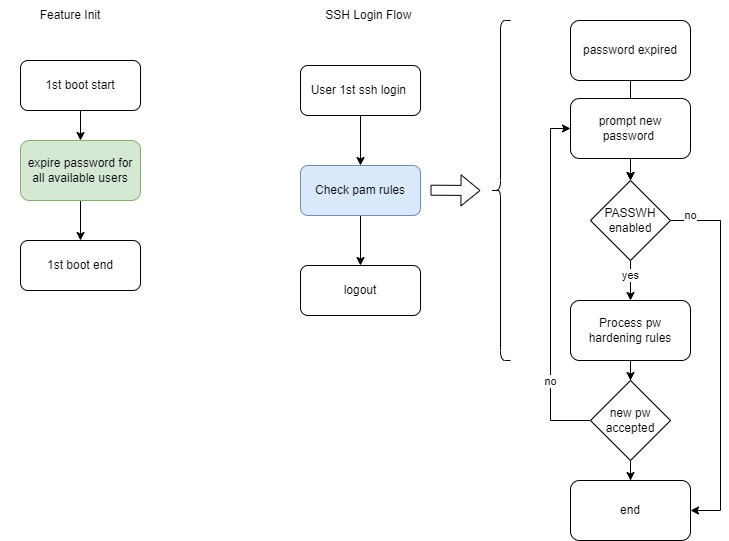
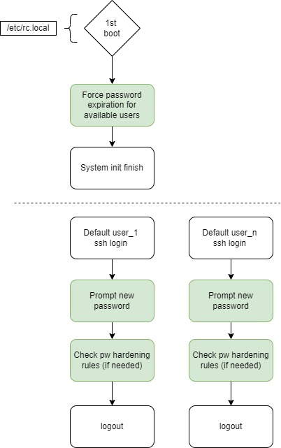

# Default Credential Management for California SB-327 Conformance #

##  1. Table of Content

<!-- vscode-markdown-toc -->
* 1. [Table of Content](#TableofContent)
	* 1.1. [Revision](#Revision)
	* 1.2. [Scope](#Scope)
	* 1.3. [Definitions/Abbreviations](#DefinitionsAbbreviations)
	* 1.4. [Overview](#Overview)
	* 1.5. [Requirements](#Requirements)
	* 1.6. [Architecture Design](#ArchitectureDesign)
	* 1.7. [High-Level Design](#High-LevelDesign)
		* 1.7.1. [Flow description](#Flowdescription)
		* 1.7.2. [California Law Constrains](#CaliforniaLawConstrains)
	* 1.8. [Init Flow](#InitFlow)
		* 1.8.1. [Compilation](#Compilation)
		* 1.8.2. [Dependencies](#Dependencies)
		* 1.8.3. [Feature default](#Featuredefault)
	* 1.9. [SAI API](#SAIAPI)
	* 1.10. [Configuration and management](#Configurationandmanagement)
	* 1.11. [Warmboot and Fastboot Design Impact](#WarmbootandFastbootDesignImpact)
	* 1.12. [Restrictions/Limitations](#RestrictionsLimitations)
	* 1.13. [Upgrade Flow](#UpgradeFlow)
	* 1.14. [Test Plan](#TestPlan)
		* 1.14.1. [Unit Test cases](#UnitTestcases)
		* 1.14.2. [System Test cases](#SystemTestcases)
		* 1.14.3. [Pasword Change Flow](#PasswordChangeFlow)
	* 1.15. [3rd Party Components](#rdPartyComponents)
		* 1.15.1. [PW Force Expiration](#WForceExpire)
		* 1.15.2. [Pam Unix](#PAMUNIX)

<!-- vscode-markdown-toc-config
	numbering=true
	autoSave=true
	/vscode-markdown-toc-config -->
<!-- /vscode-markdown-toc -->

###  1.1. Revision
|  Rev  |  Date   |      Author      | Change Description |
| :---: | :-----: | :--------------: | ------------------ |
|  0.1  | 08/2022 |   Andriy Dobush  | Phase 1 Design     |

###  1.2. Scope

The California Law hld doc described the requirements, architecture and configuration details of California Law feature in switches SONIC OS based.
Feature is designed to add [California SB-327](https://leginfo.legislature.ca.gov/faces/billTextClient.xhtml?bill_id=201720180SB327) conformance.

###  1.3. Definitions/Abbreviations

	PW - password
	PASSWH - Password Hardening
	PAM - Pluggable Authentication Modules
	California Law - Default Credential Management for California Law SB-327 Conformance

###  1.4. Overview

Most users won't change the password because of various reasons: forgot to change, don't realize default password should be changed and other. As a result
default passwords in connected devices is one of a primary attack method used by malicious actors. The main motivation and functionality of the feature is to
force user to change default password on first login.

###  1.5. Requirements

 - Force change of default password on first login
 - Support several default users
 - Force to change password after image update
 - Don't affect [Password hardening feature](https://github.com/sonic-net/SONiC/blob/master/doc/passw_hardening/hld_password_hardening.md)
 - Expire password only for user that can do login. (login shell is /bin/bash or /bin/sh)

###  1.6. Architecture Design

Arc design diagram\

(flow description in the chapter below)

###  1.7. High-Level Design

In this section we will present the design (as thorough as possible) for the California Law implementation.

Common approach to force user to change a password is making user password expired.

The feature will use native Linux tool and linux lib: chage and pam_unix_account.so

chage: support requirement of PW aging, change user password expire information

pam_unix_account module retrieves password aging information and verifies that the password and the user's account have not expired.

Note:
See linux [3rd Party Components](#rdPartyComponents) for more description.

##### Flow diagram:

####  1.7.1. Flow description
Feature is expected to be disabled by default.
Build flag CHANGE_DEFAULT_PASSWORD will be used to set feature state.

Feature uses only Linux native system tools. As a result doesn't require interaction with cli or db.

On a first boot, password will be forced to expire for every default user.

First boot is processed in file /etc/rc.local.
To get available users list grep from /etc/passwd will be used.

On next ssh login user is prompted to provide new password.
Note that after providing new password user is logged out and need to login with new password.

####  1.7.2. California Law Constrains
The only constrain for now is that user is logged out after providing new password

PW age from feature PW hardening is not affected.

###  1.8. Init Flow
####  1.8.1. Compilation
This feature will be disabled by default.
A build flag CHANGE_DEFAULT_PASSWORD will be used to enable or disable feature.
Build flag will be checked on runtime

Build example

    CHANGE_DEFAULT_PASSWORD=true make target/sonic.bin

####  1.8.2. Dependencies
N/A

####  1.8.3. Feature Default
Feature is disabled by default. If enabled will force all available users to change a password

###  1.9. SAI API
not changed.

###  1.10. Configuration and management
Not relevant

###  1.11. Warmboot and Fastboot Design Impact
The feature can be triggered after sonic upgrade and warm reboot and feature doesn't affect trafic.

###  1.12. Restrictions/Limitations
The California law feature is not supported on remote AAA.

LDAP/Radius/Tacacs is under customer responsibility.

###  1.13. Upgrade Flow
After install new image with sonic-install 1st boot flow is triggered and users will be forced to change their passwords

###  1.14. Test Plan
####  1.14.1. Unit Test cases
Unit tests do not cover login and 1st boot flow

####  1.14.2. System Test cases
Force 1st boot in next ways:
- Onie install
- Image update reboot/warm boot
Check affecting password hardening feature:
- Do 1st boot and test password change force with password hardening disabled
- Do 1st boot and test password change force with password hardening enabled
  Check password hardening age is not affected

 #### 1.14.3. Pasword Change Flow

 Example of password change during 1st login.

    ssh admin@sonic-switch
	The authenticity of host 'sonic-switch (111.111.111.111)' can't be established.
	RSA key fingerprint is SHA256:l7jfE2zxvJ2PQNJZNB3ErqA/LvTUFi1tTlhDZTViPDI.
	RSA key fingerprint is MD5:08:8c:5a:8a:7a:a7:65:13:5a:71:66:4c:30:2b:5c:ba.
	Are you sure you want to continue connecting (yes/no)? yes
	Warning: Permanently added 'sonic-switch,10.210.26.51' (RSA) to the list of known hosts.
	admin@sonic-switch's password:
	You are required to change your password immediately (administrator enforced).
	You are required to change your password immediately (administrator enforced).
	Linux sonic-switch 5.10.0-12-2-amd64 #1 SMP Debian 5.10.103-1 (2022-03-07) x86_64
	You are on
	____   ___  _   _ _  ____
	/ ___| / _ \| \ | (_)/ ___|
	\___ \| | | |  \| | | |
	___) | |_| | |\  | | |___
	|____/ \___/|_| \_|_|\____|

	-- Software for Open Networking in the Cloud --

	Unauthorized access and/or use are prohibited.
	All access and/or use are subject to monitoring.

	Help:    http://azure.github.io/SONiC/

	Last login: Sat Aug 13 13:31:19 2022 from 10.209.102.100
	WARNING: Your password has expired.
	You must change your password now and login again!
	Changing password for admin.
	Current password:
	New password:
	Retype new password:
	The password has not been changed.
	New password:
	Retype new password:
	passwd: password updated successfully
	Connection to sonic-switch closed.

###  1.15. 3rd Party Components
In this section, you can find options used for password expiring with chage and pwhistory

####  1.15.1. PW Force Expiration

Tool for password expiration:

    chage

The option which apply to the chage command is:

	-d, --lastday LAST_DAY

Example :

	chage -d 0 ${user}

####  1.15.2. Pam Unix
pam_unix:  standard Unix authentication PAM module

##### DESCRIPTION

This module performs validating status of a user's account based on password expiration and other elements
Module is used as is, without any additional, configuration or modification.
