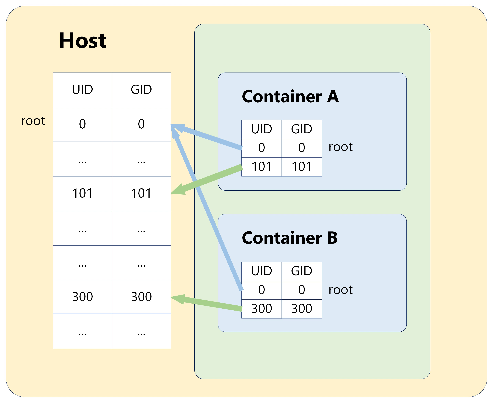
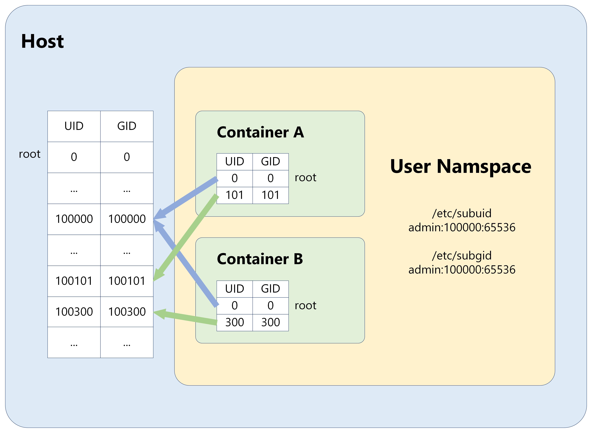
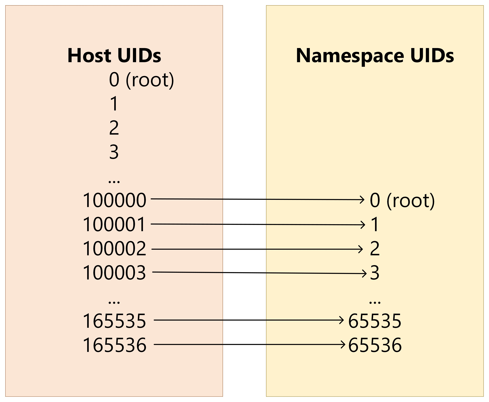

# SONiC User Namespace Remap #

## Table of Content
- [SONiC User Namespace Remap](#sonic-user-namespace-remap)
  - [Table of Content](#table-of-content)
  - [Revision](#revision)
          - [Table 1: Revision](#table-1-revision)
  - [Scope](#scope)
  - [Definitions/Abbreviations](#definitionsabbreviations)
          - [Table 2: Abbreviations](#table-2-abbreviations)
  - [1. Overview](#1-overview)
          - [Figure 1: Current implemetation](#figure-1-current-implemetation)
  - [2. Requirements](#2-requirements)
  - [3. Limitations](#3-limitations)
  - [4. Architecture Design](#4-architecture-design)
          - [Figure 2: Proposed Implementation](#figure-2-proposed-implementation)
  - [5. High-Level Design](#5-high-level-design)
    - [5.1 Privileged capabilities and host network](#51-privileged-capabilities-and-host-network)
    - [5.2 User selection](#52-user-selection)
    - [5.3 Enable namespace remapping](#53-enable-namespace-remapping)
          - [Figure 3: Mapping between host and container](#figure-3-mapping-between-host-and-container)
    - [5.4 Disable namespace remapping](#54-disable-namespace-remapping)
    - [5.5 Configure processes run as unprivileged users](#55-configure-processes-run-as-unprivileged-users)
    - [5.6 Adjust the permissions](#56-adjust-the-permissions)
    - [5.7 Results](#57-results)
  - [6. SAI API](#6-sai-api)
  - [7. Configuration and management](#7-configuration-and-management)
    - [7.1 Manifest (if the feature is an Application Extension)](#71-manifest-if-the-feature-is-an-application-extension)
    - [7.2 CLI/YANG model Enhancements](#72-cliyang-model-enhancements)
    - [7.3 Config DB Enhancements](#73-config-db-enhancements)
  - [8. Warmboot and Fastboot Design Impact](#8-warmboot-and-fastboot-design-impact)
  - [9. Memory Consumption](#9-memory-consumption)
  - [10. Testing Requirements/Design](#10-testing-requirementsdesign)
    - [10.1 Unit Test cases](#101-unit-test-cases)
    - [10.2 System Test cases](#102-system-test-cases)
  - [11. Open/Action items - if any](#11-openaction-items---if-any)
  - [Reference](#reference)

## Revision
###### Table 1: Revision
| Rev |     Date    |       Author       | Change Description                |
|:---:|:-----------:|:------------------:|-----------------------------------|
| 0.1 | 08/16/2023  | Mai Bui            | Initial version                   |

## Scope  
This section describes user namespace remap implementation in SONiC containers.

## Definitions/Abbreviations 
This section covers the abbreviation if any, used in this high-level design document and its definitions.

###### Table 2: Abbreviations
| Definitions/Abbreviation | Description                                |
|--------------------------|--------------------------------------------|
| OS                       | Operating System                           |
| API                      | Application Programmable Interface         |
| SAI                      | Swich Abstraction Interface                |
| UID                      | User ID                                    |
| GID                      | Group ID                                   |

## 1. Overview 
[Figure 1](#figure-1-current-implemetation) shows current implementation of SONiC containers are run with root user privileges by default. User IDs (UIDs) and Group IDs (GIDs) inside a Docker container directly correspond to those on the host system. Specifically, the root user (UID 0) inside the container has the same privileges as the root user on the host. 

If an intruder manages to break out of a container operating with root permissions, they obtain full root access to the host system, granting them unauthorized data access and system compromise. This lack of separation can lead to further security risks, as a process that breaks out of the container with root privileges can have full control over the host system.

###### Figure 1: Current implemetation


To mitigate these risks, this HLD implements the enablement of the user namespace remapping feature on SONiC containers. User namespace remapping allows mapping the root user in a container to a less-privileged user on the Docker host system, thereby enhancing security by limiting the potential damage of a container breakout.

## 2. Requirements
-  The subordinate UID and GID ranges must be tied to an existing user, who owns the namespaced directories under `/var/lib/docker/`.

-  Namespace remapping on the host is managed using the files `/etc/subuid` and `/etc/subgid`, which are usually handled automatically. Each file contains three fields: username or ID, starting UID or GID (treated as UID or GID 0 within the namespace), and the maximum number of UIDs or GIDs available
    ```
    admin:100000:65536
    ```
- Adjust the permissions on the Docker host where the unprivileged user needs write access as required.
- Enabling userns-remap masks existing Docker objects within `/var/lib/docker/`. It's preferable to enable this feature on a new Docker installation.
- Check the [limitations](#3-limitations).

## 3. Limitations  
In SONiC containers with user namespace remap enabled, the following standards must be adhered to:
•	Avoid sharing PID or NET namespaces with the host (i.e., refrain from using the `--pid=host` or `--network=host` flags). 
•	Ensure compatibility with external (volume or storage) drivers that may be unaware or incapable of using daemon user mappings. 
•	If using the `--privileged` mode flag on docker run, it must be paired with the `--userns=host` specification.

## 4. Architecture Design 
[Figure 2](#figure-2-proposed-implementation) illustrates proposed user namespace remapping implementation. Namespace remapping in Docker creates a mapping between UIDs inside the container and UIDs on the host system. This means that UIDs inside the container are mapped to unprivileged UIDs on the host.

###### Figure 2: Proposed Implementation


## 5. High-Level Design 
### 5.1 Privileged capabilities and host network
To ensure compatibility with the namespace remapping feature, containers must omit the `--privileged` flag and switch from host networking to bridge networking. These adjustments will be detailed in the SONiC Container Hardening HLD document.

### 5.2 User selection
Since the `admin` user already exists, this default user has been selected to enable userns-remap.
When this default user is created, these files `/etc/subuid` and `/etc/subgid` are automatically generated in the system.
```
admin@sonic:~$ cat /etc/subuid
admin:100000:65536
admin@sonic:~$ cat /etc/subgid
admin:100000:65536
```

### 5.3 Enable namespace remapping
Add following json to `/etc/docker/daemon.json` file:
```
{
  "userns-remap": "admin"
}
```
[Figure 3](#figure-3-mapping-between-host-and-container) is a mapping of less-privileged user on host to root user in a container. This entry `admin:100000:65536` means that UID 0 inside the container will map to UID 100000 on the host, UID 1 inside the container will map to UID 100001 on the host, and so on.

###### Figure 3: Mapping between host and container


### 5.4 Disable namespace remapping
When user namespaces are enabled on the daemon, all containers start with user namespaces enabled by default. In certain situations, such as with privileged containers or host network containers, it may be necessary to disable user namespaces for a specific container.

To disable user namespaces for a specific container, the `--userns=host` flag can be added to the `docker container create`, `docker container run`, or `docker container exec` command.

In this example, namespace remapping is enabled on the database container and disabled on other containers. In [files/build_templates/docker_image_ctl.j2](https://github.com/sonic-net/sonic-buildimage/blob/master/files/build_templates/docker_image_ctl.j2):
```
     docker create {{docker_image_run_opt}} \
+
+        --userns=host \
+
         --net=$NET \
         ...
```

### 5.5 Configure processes run as unprivileged users
The best way to prevent privilege-escalation attacks from within a container is to configure the container’s processes or applications to run as unprivileged users.

In the provided example, the Redis process within the database container is specifically configured to operate not as the root user but under the `redis` user inside the container. By configuring Redis to run as a non-root user, such as `redis`, the system limits the potential impact of these security risks, aligning more closely with best practices and helping to safeguard the environment against possible threats.

Add `user=redis` to [dockers/docker-database/supervisord.conf.j2](https://github.com/sonic-net/sonic-buildimage/blob/master/dockers/docker-database/supervisord.conf.j2):
```
[program:redis]
command=/bin/bash -c "{ [[ -s /var/lib/redis/dump.rdb ]] || rm -f /var/lib/redis/dump.rdb; } && mkdir -p /var/lib/redis && exec /usr/bin/redis-server /etc/redis/redis.conf --port 6379 --unixsocket /var/run/redis/redis.sock --pidfile /var/run/redis/redis.pid --dir /var/lib/redis"
priority=2
user=redis
autostart=false
autorestart=false
...
```

### 5.6 Adjust the permissions
If needed, adjust the permissions on the Docker host where the unprivileged user needs write access.

### 5.7 Results
So, with this namespace remapping configuration:
- UID 0 (root) inside the database container is mapped to UID 100000 (remaproot) on the host.
- UID 101 (redis) inside the database container is mapped to UID 100101 (remapredis) on the host.

This prevents processes running inside the container as root (UID 0) from having root privileges on the host. It is also applicable to files and directories.
```
admin@vlab-01:~$ ps -e -o pid,uid,gid,user,%cpu,%mem,vsz,rss,tty,stat,start,time,command | grep remap
    775 100000 100000 remapro+ 0.0  0.6 31204 26700 pts/0    Ss+  15:12:19 00:00:00 /usr/bin/python3 /usr/local/bin/supervisord
    908 100000 100000 remapro+ 0.1  0.6 124028 26224 pts/0   Sl   15:12:22 00:00:04 python3 /usr/bin/supervisor-proc-exit-listener --container-name database
    971 100000 100000 remapro+ 0.0  0.1 222184 6028 pts/0    Sl   15:12:23 00:00:00 /usr/sbin/rsyslogd -n -iNONE
   1033 100101 100101 remapre+ 1.8  1.7 124660 68404 pts/0   Sl   15:12:25 00:00:49 /usr/bin/redis-server *:6379
   1037 100000 100000 remapro+ 0.0  0.5 40712 22864 pts/0    S    15:12:25 00:00:00 python3 /usr/local/bin/containercfgd
```

```
admin@vlab-01:~$ docker exec -it database bash
root@vlab-01:/# ps -e -o pid,uid,gid,user,%cpu,%mem,vsz,rss,tty,stat,start,time,command
    PID   UID   GID USER     %CPU %MEM    VSZ   RSS TT       STAT  STARTED     TIME COMMAND
      1     0     0 root      0.0  0.6  31204 26700 pts/0    Ss+  15:12:19 00:00:01 /usr/bin/python3 /usr/local/bin/supervisord
     47     0     0 root      0.1  0.6 124028 26224 pts/0    Sl   15:12:22 00:00:05 python3 /usr/bin/supervisor-proc-exit-listener --container-name database
     56     0     0 root      0.0  0.1 222184  6028 pts/0    Sl   15:12:23 00:00:00 /usr/sbin/rsyslogd -n -iNONE
     66   101   101 redis     1.8  1.7 124660 68068 pts/0    Sl   15:12:25 00:00:50 /usr/bin/redis-server *:6379
     70     0     0 root      0.0  0.5  40712 22864 pts/0    S    15:12:25 00:00:00 python3 /usr/local/bin/containercfgd
```

```
admin@vlab-01:~$ ls -l /var/run/redis/
total 4
-rw-r--r-- 1 remapredis remapredis  3 Aug 11 15:12 redis.pid
srwxrw---- 1 remapredis remapredis  0 Aug 11 15:12 redis.sock
drwxr-xr-x 2 remaproot  remaproot  60 Aug 11 15:12 sonic-db
```

```
root@vlab-01:/# ls -l /var/run/redis/
total 4
-rw-r--r-- 1 redis redis  3 Aug  4 19:23 redis.pid
srwxrw---- 1 redis redis  0 Aug  4 19:23 redis.sock
drwxr-xr-x 2 root  root  60 Aug  4 19:23 sonic-db
```

## 6. SAI API 
N/A

## 7. Configuration and management 
N/A

### 7.1 Manifest (if the feature is an Application Extension)
N/A

### 7.2 CLI/YANG model Enhancements 
N/A

### 7.3 Config DB Enhancements  
N/A
		
## 8. Warmboot and Fastboot Design Impact  
N/A

## 9. Memory Consumption
N/A

## 10. Testing Requirements/Design  
<!--Explain what kind of unit testing, system testing, regression testing, warmboot/fastboot testing, etc.,
Ensure that the existing warmboot/fastboot requirements are met. For example, if the current warmboot feature expects maximum of 1 second or zero second data disruption, the same should be met even after the new feature/enhancement is implemented. Explain the same here.
Example sub-sections for unit test cases and system test cases are given below. -->

### 10.1 Unit Test cases  

### 10.2 System Test cases

## 11. Open/Action items - if any 

## Reference
[Isolate containers with a user namespace - Docker](https://docs.docker.com/engine/security/userns-remap/)
