# DHCPv4 Snooping

## Table of Content

- [1. Revision](#1-revision)
- [2. Scope](#2-scope)
- [3. Definitions/Abbreviations](#3-definitionsabbreviations)
- [4. Overview](#4-overview)
  - [4.1 DHCP snooping concept](#41-dhcp-snooping-concept)
  - [4.2 Binding table](#42-binding-table)
  - [4.3 IP Source Guard](#43-ip-source-guard)
- [5. Requirements](#5-requirements)
  - [5.1 Phase 1 Requirements](#51-phase-1-requirements)
  - [5.2 Future work](#52-future-work)
- [6. Architecture Design](#6-architecture-design)
- [7. High-Level Design](#7-high-level-design)
  - [7.1 Modules and repositories](#71-modules-and-repositories)
  - [7.2 Installation of L2 DHCP Copp Rules](#72-installation-of-l2-dhcp-copp-rules)
  - [7.3 DHCP Snooping Container](#73-dhcp-snooping-container)
    - [7.3.1 Configuration Manager Thread](#731-configuration-manager-thread)
    - [7.3.2 DHCPv4 snooping main thread](#732-dhcpv4-snooping-main-thread)
      - [7.3.2.1 APP_DB entries](#7321-app_db-entries)
      - [7.3.2.2 StateDB entries](#7322-statedb-entries)
    - [7.3.3 DHCPv4 snooping stats manager thread](#733-dhcpv4-snooping-stats-manager-thread)
    - [7.3.4 Feature enable flow](#734-feature-enable-flow)
    - [7.3.5 Feature disable flow](#735-feature-disable-flow)
    - [7.3.6 Snooping enable on a VLAN](#736-snooping-enable-on-a-vlan)
    - [7.3.7 Snooping disable on a VLAN](#737-snooping-disable-on-a-vlan)
    - [7.3.8 Trusted interface add flow](#738-trusted-interface-add-flow)
    - [7.3.9 Trusted interface remove flow](#739-trusted-interface-remove-flow)
  - [7.4 dhcpSnoopOrch](#74-dhcpsnooporch)
    - [7.4.1 Overview](#741-overview)
      - [`DHCPV4_SNOOPING_VLAN`](#dhcpv4_snooping_vlan)
      - [`DHCPV4_SNOOPING_UNTRUSTED_INTERFACE`](#dhcpv4_snooping_untrusted_interface)
      - [`DHCPV4_SNOOPING_BINDING`](#dhcpv4_snooping_binding)
    - [7.4.2 Configuring ACLs](#742-configuring-acls)
      - [`DHCP_SNOOPING_INTERFACE_TABLE_TYPE`](#dhcp_snooping_interface_table_type)
      - [`DHCP_SNOOPING_INTERFACE_TABLE` rules](#dhcp_snooping_interface_table-rules)
        - [1. Drop DHCP server messages on untrusted access ports](#1-drop-dhcp-server-messages-on-untrusted-access-ports)
        - [2. Allow DHCP client packets on the access port and VLAN](#2-allow-dhcp-client-packets-on-the-access-port-and-vlan)
        - [3. Deny all other IPv4 on the access port and VLAN](#3-deny-all-other-ipv4-on-the-access-port-and-vlan)
        - [4. Allow IPv4 traffic from a bound host on the correct interface and VLAN](#4-allow-ipv4-traffic-from-a-bound-host-on-the-correct-interface-and-vlan)
    - [7.4.3 Files](#743-files)
    - [7.4.4 Event sequences](#744-event-sequences)
      - [When an entry in `DHCPV4_SNOOPING_VLAN` is created](#when-an-entry-in-dhcpv4_snooping_vlan-is-created)
      - [When an entry in `DHCPV4_SNOOPING_VLAN` is deleted](#when-an-entry-in-dhcpv4_snooping_vlan-is-deleted)
      - [When an entry in `DHCPV4_SNOOPING_UNTRUSTED_INTERFACE` is created](#when-an-entry-in-dhcpv4_snooping_untrusted_interface-is-created)
      - [When an entry in `DHCPV4_SNOOPING_UNTRUSTED_INTERFACE` is deleted](#when-an-entry-in-dhcpv4_snooping_untrusted_interface-is-deleted)
      - [When an entry in `DHCPV4_SNOOPING_BINDING` is created](#when-an-entry-in-dhcpv4_snooping_binding-is-created)
      - [When an entry in `DHCPV4_SNOOPING_BINDING` is deleted](#when-an-entry-in-dhcpv4_snooping_binding-is-deleted)
  - [7.5 syncd](#75-syncd)
  - [7.6 DB and Schema changes](#76-db-and-schema-changes)
    - [7.6.1 CONFIG_DB Changes](#761-config_db-changes)
    - [7.6.2 APP_DB Changes](#762-app_db-changes)
    - [7.6.3 STATE_DB Changes](#763-state_db-changes)
    - [7.6.4 COUNTERS_DB Changes](#764-counters_db-changes)
  - [7.7 Linux dependencies and interfaces](#77-linux-dependencies-and-interfaces)
  - [7.8 Docker dependency](#78-docker-dependency)
  - [7.9 Build dependency](#79-build-dependency)
- [8. SAI API](#8-sai-api)
- [9. Configuration and management](#9-configuration-and-management)
  - [9.1. CLI](#91-cli)
    - [9.1.1. Enable/Disable DHCPv4 snooping feature](#911-enabledisable-dhcpv4-snooping-feature)
    - [9.1.2. Enable/Disable DHCPv4 snooping on a VLAN](#912-enabledisable-dhcpv4-snooping-on-a-vlan)
    - [9.1.3. Configure trusted interfaces for DHCPv4 snooping](#913-configure-trusted-interfaces-for-dhcpv4-snooping)
    - [9.1.4. Add/Delete static entries in the DHCPv4 snooping binding table](#914-adddelete-static-entries-in-the-dhcpv4-snooping-binding-table)
    - [9.1.5. Show DHCPv4 snooping operational state](#915-show-dhcpv4-snooping-operational-state)
    - [9.1.6. Show DHCPv4 snooping binding table](#916-show-dhcpv4-snooping-binding-table)
    - [9.1.7. Show/clear DHCPv4 snooping statistics](#917-showclear-dhcpv4-snooping-statistics)
  - [9.2. YANG Model](#92-yang-model)
- [10. Warmboot and Fastboot Design Impact](#10-warmboot-and-fastboot-design-impact)
- [11. Memory Consumption](#11-memory-consumption)
- [12. Restrictions/Limitations](#12-restrictionslimitations)
- [13. Testing Requirements/Design](#13-testing-requirementsdesign)
  - [13.1. Unit Test cases](#131-unit-test-cases)
  - [13.2. System Test cases](#132-system-test-cases)
- [14. Open/Action items - if any](#14-openaction-items---if-any)
- [15. References](#15-references)

### 1. Revision


| Rev | Date       | Author                              | Change Description |
| --- | ---------- | ----------------------------------- | ------------------ |
| 0.1 | 09/14/2026 | Ankur Dwivedi, Ramachandra Hegde    | Initial version    |

### 2. Scope

This section describes the high level design of DHCPv4 snooping feature in SONiC.

The feature provides the following capabilities:

- DHCP trust enforcement by defining trusted and untrusted interfaces within DHCP Snooping-enabled VLANs,
  establishing where legitimate DHCP server messages are permitted.
- Static & Dynamic client binding management - By learning, validating, and maintaining IP–MAC–VLAN–ingress-port
   associations from DHCP transactions, providing the binding database used for subsequent security enforcement.
- Line-rate blocking of rogue DHCP server messages on untrusted ports.
- **IP Source Guard (IPSG)** to validate ingress IPv4 traffic on untrusted ports against the DHCP snooping
  binding table.

### 3. Definitions/Abbreviations

#### Table 1: Abbreviations

| Abbreviation | Description |
|--------------|-------------|
| **Binding table**  | The set of `(VLAN, IP, MAC, port)` tuples that represent hosts authorized to use an IP address on the switch. |
| **BOUND**          | A confirmed binding created when a DHCP ACK matches a pending transaction, or when an operator configures a static binding. |
| **CoPP**           | Control Plane Policing. The SONiC mechanism that traps selected packet types from the ASIC to the CPU. |
| **DHCPv4**         | Dynamic Host Configuration Protocol for IPv4 |
| **dhcpSnoopOrch**  | The orchagent module that translates **APP_DB** snooping rows into ASIC ACL programming for rogue DHCP blocking and IPSG. |
| **dhcpv4snoopd**   | The userspace daemon in the `dhcp_snooping` container that owns configuration translation and binding learning. |
| **IPSG**           | IP Source Guard. A data-plane enforcement feature that permits IPv4 traffic only from addresses present in the binding table on the correct ingress port. |
| **PortChannel**    | Link Aggregation Group interface in SONiC |
| **Trusted port**   | A VLAN member that faces a legitimate DHCP server or uplink. DHCP server messages are accepted on trusted ports. |
| **Untrusted port** | A VLAN member that faces end hosts. DHCP server messages are denied at line rate on untrusted ports. |

### 4. Overview

#### 4.1 DHCP snooping concept

DHCP snooping is a switch security feature that mitigates rogue DHCP servers and source-address spoofing on access ports. The switch passively inspects DHCP transactions on VLANs where snooping is enabled and maintains a binding table that records which IP addresses are assigned to which hosts and on which ports.

Trusted ports connect to legitimate DHCP infrastructure or upstream switches. Untrusted ports connect to end hosts.

The switch does not allow DHCP server packets on untrusted ports. Any DHCP OFFER, ACK, or NAK received on an untrusted port is dropped at line rate. Only trusted ports may receive DHCP server traffic.

#### 4.2 Binding table

The binding table maps each leased IP address to a client MAC address and ingress port on a VLAN, as defined in [RFC 7513](https://www.rfc-editor.org/rfc/rfc7513). The switch learns bindings from DHCP traffic and removes them on lease expiry or DHCP RELEASE. A binding becomes active for enforcement only after the lease is confirmed by a matching DHCP ACK.

#### 4.3 IP Source Guard

IP Source Guard (IPSG) validates ingress IPv4 traffic on untrusted ports against the binding table. When enabled on a VLAN, the switch denies all IPv4 on untrusted members except packets whose source IP, source MAC, and ingress port match an active binding. Trusted ports are exempt.

### 5. Requirements

#### 5.1 Phase 1 Requirements

1. Support enabling/disabling DHCPv4 snooping feature. By default, the feature is disabled.
2. Support enabling/disabling DHCPv4 snooping on a per VLAN basis. By default, snooping is disabled on all VLANs.
3. Support configuring interfaces (ports or LAGs) as trusted. By default, all interfaces are untrusted.
4. Add infrastructure to drop DHCP server packets on untrusted DHCP ports.
5. Support addition, deletion and updation of dynamic entries in the DHCPv4 snooping binding table.
6. Support adding and deleting static entries from the DHCPv4 snooping binding table manually.
7. DHCPv4 snooping should work with dhcp relay enabled or disabled on the same vlan.
8. Implement IP Source Guard (IPSG) for IPv4 traffic.

#### 5.2 Future work

The following items are planned for subsequent phases:

1. Implement Dynamic ARP Inspection (DAI) for IPv4 traffic.
2. Implement DHCPv6 snooping and DHCPv6-Shield.
3. Verify that the Ethernet source MAC matches the DHCP client hardware address on untrusted ports.
4. Support configurable handling of relay agent options (Option 82) received on untrusted ports.
5. Support operator-configurable violation actions and the duration of MAC or port blocks.
6. Support control over whether a new binding may replace an existing binding for the same IP address.
7. Support capping the maximum lease duration learned from DHCP ACK messages.
8. Support an optional per-policy allow-list of trusted DHCP server addresses.
9. Apply per-port DHCP rate limits and maximum binding counts.
10. Extend the policy and CLI model to DHCPv6 snooping.

### 6. Architecture Design

The following diagram shows the architecture of the DHCPv4 snooping feature.

<div align="center">  </div>


| Redis DB       | Role in DHCP snooping                                                                                              |
| -------------- | ------------------------------------------------------------------------------------------------------------------ |
| **CONFIG_DB**  | The operator writes policy, VLAN enablement, trust, and static bindings through the CLI.                           |
| **APP_DB**     | **dhcpv4snoopd daemon** publishes programming intent consumed by **dhcpSnoopOrch** (ASIC). |
| **STATE_DB**   | **dhcpv4snoopd daemon** publishes operational bindings and VLAN state consumed by the `show` CLI and lease timers.          |
| **COUNTER_DB** | Two tables: `DHCPV4_SNOOPING_COUNTERS` written by **dhcpv4snoopd** stats manager (DHCP message counters); `DHCPV4_SNOOPING_DROP_COUNTERS` written by **syncd** via flex-counter polling (IPSG and rogue-server drops). |
| **ASIC_DB**    | **dhcpSnoopOrch** and **CoppOrch** publish SAI objects consumed by **syncd**.                                      |


### 7. High-Level Design

The feature is a **built-in SONiC capability** delivered in the standard image and not a SONiC Application Extension.

Control-plane work is split between

- **dhcpv4snoopd**, a userspace daemon that owns configuration translation and binding learning for ipv4 snooping.
- **dhcpSnoopOrch**, an orchagent module that programs the ASIC for rogue DHCP blocking and IP Source Guard.

#### 7.1 Modules and repositories


| Module                                      | Type       | Repository                    | Phase 1 change                                                                                                                                                   |
| ------------------------------------------- | ---------- | ----------------------------- | ---------------------------------------------------------------------------------------------------------------------------------------------------------------- |
| **dhcpv4snoopd**                              | Daemon     | **sonic-dhcp-snooping** (new) | New binary: main-thread packet manager plus worker threads for config manager and stats manager (writes `DHCPV4_SNOOPING_COUNTERS` in **COUNTERS_DB**) |
| **dhcpSnoopOrch**                           | Orch       | **sonic-swss**                | New orch — programs ASIC ACLs for rogue DHCP deny and IPSG; attaches flex counters so **syncd** populates `DHCPV4_SNOOPING_DROP_COUNTERS` in **COUNTERS_DB** |
| **VlanOrch**, **PortsOrch**                 | Orch       | **sonic-swss**                | Extended — **dhcpSnoopOrch** observes VLAN and port oper-state                                                                                                   |
| **FlexCounterOrch**                         | Orch       | **sonic-swss**                | Used — IPSG deny counter polling (no code change)                                                                                                                |
| **CoppOrch**                                | Orch       | **sonic-swss**                | Extended — install L2 DHCP CoPP trap (`SAI_HOSTIF_TRAP_TYPE_DHCP_L2`) gated by `FEATURE                                                                          |
| **syncd**                                   | Daemon     | **sonic-sairedis**            | No new module — applies SAI ACL objects created by **dhcpSnoopOrch**                                                                                             |
| **config** / **show** / **sonic-clear** CLI | CLI        | **sonic-utilities**           | New DHCP snooping commands                                                                                                                                       |
| **sonic-dhcp-snooping.yang**                | YANG / CVL | **sonic-yang-models**         | New YANG module and validation schema                                                                                                                            |
| **schema.h**                                | Library    | **sonic-swss-common**         | New **APP_DB** and **CounterDB** table name constants                                                                                                            |
| **docker-dhcp-snooping**                    | Packaging  | **sonic-buildimage**          | New container image, `FEATURE` entry, supervisord program                                                                                                        |
| Integration tests                           | QA         | **sonic-mgmt**                | Phase 1 test cases                                                                                                                                               |
#### 7.2 Installation of L2 DHCP Copp Rules

The DHCPv4 snooping feature requires copying DHCPv4 packets to the CPU for creating the binding
table entries. For this a L2 DHCP Copp rule with packet action as copy and priority as 3 is
installed when `dhcp_snooping` feature is enabled. The `SAI_HOSTIF_TRAP_TYPE_DHCP_L2` copp trap
type is used to install the dhcp L2 copp rule. This Copp rule is removed when the `dhcp_snooping`
feature is disabled. CLI command to enable/disable `dhcp_snooping` feature is given in Section 9.1.1.


<div align="center">  </div>


When dhcpv4 relay is also enabled on the switch, it adds a L3 DHCP copp rule (`SAI_HOSTIF_TRAP_TYPE_DHCP`)
with priority 4 to trap DHCP traffic with destination ip as L3 broadcast (255.255.255.255) or
unicast to local router IP address. However unicast dhcpv4 packets having destination ip as dhcp
server or client cannot be trapped by the L3 DHCP copp rule. So a L2 DHCP copp rule with packet action
as copy is required to copy these packets to CPU. In this scenario also enabling `dhcp_snooping`
feature will install the L2 DHCP copp rule as before. With the L2 DHCP Copp rules installed the unicast
messages from client to server will also go to relay. Code changes are done in relay to ignore these messages.

 
<div align="center">  </div>

| DHCPv4 Snooping | DHCP Relay | DHCP Copp rules | Packet action |
|-----------------|------------|-----------------|---------------|
| disabled        | enabled    | L3 Copp         | trap          |
| enabled         | enabled    | L3 Copp and L2 Copp | trap and copy |
| enabled         | disabled   | L2 Copp         | copy          |

#### 7.3 DHCP Snooping Container

DHCP snooping runs in a single container named `dhcp_snooping`, enabled/disabled through the
`FEATURE|dhcp_snooping` entry. The container hosts a **separate daemon process per IP protocol**,
managed by `supervisord`:

| Process | Binary | Package (deb) | Purpose |
|---------|--------|---------------|---------|
| `dhcpv4snoopd` | `/usr/sbin/dhcpv4snoopd` | `sonic-dhcpv4-snooping` | DHCPv4 snooping |

```
src/dhcpsnooping/
  dhcpv4snooping/     -> Debian package sonic-dhcpv4-snooping  -> /usr/sbin/dhcpv4snoopd
```

dhcpv6 snooping will be added in future inside src/dhcpsnooping directory as dhcpv6snooping/.

Enabling/disabling the `dhcp_snooping` feature starts/stops the whole container.

The `dhcp_snooping` container runs in the **host network namespace** (`network_mode: host`),
i.e. it shares the host's namespace instead of getting an isolated one. This is required because
the snooping daemons capture DHCP packets that are punted to the CPU on the front-panel port
netdevs (`EthernetX`) and must determine the exact ingress interface and VLAN of each packet.

The DHCPv4 snooping daemon has the following threads:

##### 7.3.1 Configuration Manager Thread

The config manager thread does the following tasks:

1. Subscribes to the following `CONFIG_DB` tables. The purpose of subscribing to each table is:

| Table | Purpose of subscription |
| ----- | ----------------------- |
| `DHCPV4_SNOOPING_VLAN` | Track the VLANs that are snooped. |
| `DHCPV4_SNOOPING_POLICY` | To get the snooping policy per vlans |
| `DHCPV4_SNOOPING_TRUSTED_INTERFACE` | Track which interfaces (ports/LAGs) are trusted. Trusted interfaces are exempt from enforcement. |
| `DHCPV4_SNOOPING_STATIC_BINDING` | To get the static bindings. Static entries are never aged out. |
| `VLAN_MEMBER` | Learn the port/LAG membership of each VLAN, so the daemon can compute the members (and untrusted members) of every snooping-enabled VLAN and scope enforcement to them. |
| `VLAN_INTERFACE` | To know about the interface to vlan mapping (used in dhcp relay scenario) |
| `PORTCHANNEL_MEMBER` | To know the member ports of a LAG |
| `FEATURE` | Detect enable/disable of the `dhcp_snooping` feature. |

2. Sends each `CONFIG_DB` changes as event to the inter process communication pipe. The main thread reads from the
   other end of the pipe.

##### 7.3.2 DHCPv4 snooping main thread

The main thread runs entirely inside the libevent's `event_base_dispatch()`. It reacts to the
following event sources:

1. ipc_pipe - Receives config changes from config manager thread over inter process communication pipe and updates internal snooping information.

2. raw_sock - Receives DHCP packets, parses the packets and updates pending cache and binding table. Increments the corresponding in memory counters.

3. pending entry timer - Evicts stale dhcp request entries from pending cache.

4. lease timer - Evicts expired entries from binding table in `STATE_DB`. Expiry time is derived
   from dhcpv4 lease.

5. SIGINT/SIGTERM - Exits the thread.

The following diagram shows the state transition about how the  entries are added and removed from
pending list and binding tables.

<div align="center">  </div>

The main thread writes entries to the following tables in APPL_DB.

###### 7.3.2.1 APP_DB entries


| Table                                       | Written by                                                | Consumer          |
| ------------------------------------------- | --------------------------------------------------------- | ----------------- |
| `DHCPV4_SNOOPING_VLAN`                | Main thread                                            | **dhcpSnoopOrch** |
| `DHCPV4_SNOOPING_UNTRUSTED_INTERFACE` | Main thread                                            | **dhcpSnoopOrch** |
| `DHCPV4_SNOOPING_BINDING`             | Main thread                                            | **dhcpSnoopOrch** |


###### 7.3.2.2 StateDB entries


| Table                               | Written by                                        | Consumer                 |
| ----------------------------------- | ------------------------------------------------- | ------------------------ |
| `DHCPV4_SNOOPING_VLAN`        | Main thread                                       | `show` CLI               |
| `DHCPV4_SNOOPING_VLAN_INTERFACE` | Main thread                                       | `show` CLI               |
| `DHCPV4_SNOOPING_BINDING`     | Main thread                                       | `show` CLI, Main threadlease timers |


##### 7.3.3 DHCPv4 snooping stats manager thread

The stats manager thread does the following tasks:

1. The stats manager thread wakes up every 10 seconds and reads the in-memory DHCP message counters
   (`dhcp_request_snooped`, `dhcp_ack_snooped`, `dhcp_nak_snooped`, `dhcp_release_snooped`,
   `dhcp_decline_snooped`) that are incremented by the main thread on each received DHCP packet.

2. It writes these DHCP message counters to the `DHCPV4_SNOOPING_COUNTERS` table in `COUNTERS_DB`.

> **Note:** The security drop counters (`rogue_server_drops`, `ipsg_drop`) are **not** written by
> the stats manager. They are maintained by **syncd** via flex-counter polling on the ASIC ACL rules
> installed by **dhcpSnoopOrch**, and are stored in the separate `DHCPV4_SNOOPING_DROP_COUNTERS`
> table in `COUNTERS_DB` (see §7.6.4).

##### 7.3.4 Feature enable flow

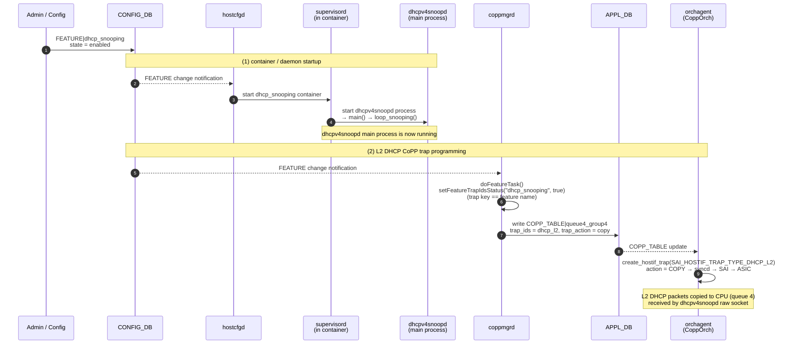

##### 7.3.5 Feature disable flow

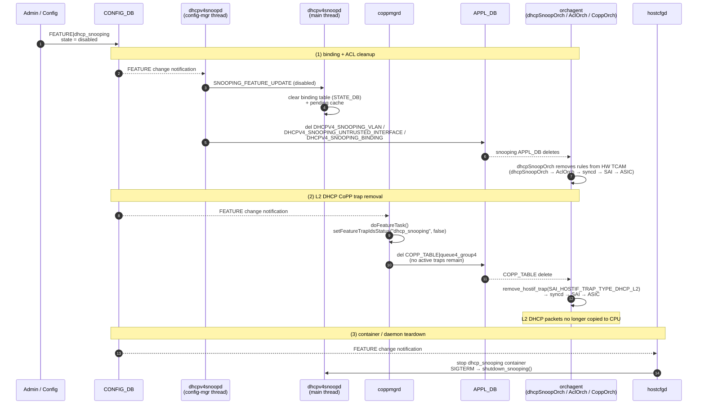

##### 7.3.6 Snooping enable on a VLAN

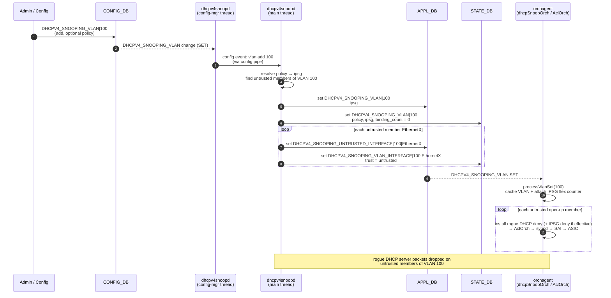

##### 7.3.7 Snooping disable on a VLAN

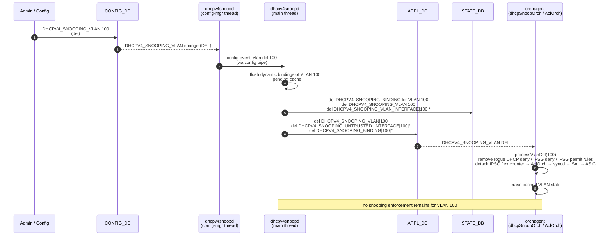

##### 7.3.8 Trusted interface add flow

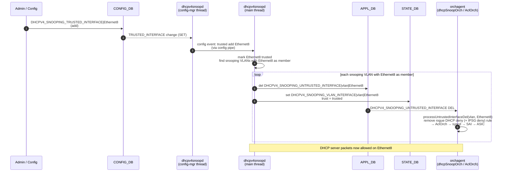

##### 7.3.9 Trusted interface remove flow

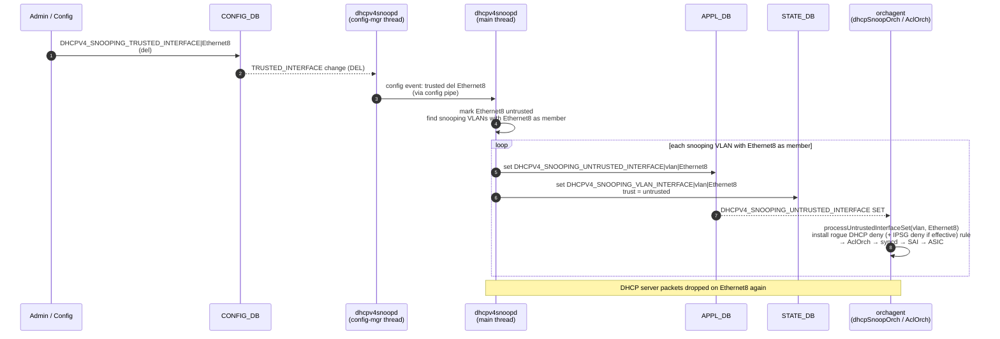

#### 7.4 dhcpSnoopOrch

##### 7.4.1 Overview

**dhcpSnoopOrch** is a new orch registered in `orchdaemon.cpp`. It subscribes to **APP_DB** only through three `TableConnector` entries:


| **APP_DB** table                            | Role                               |
| ------------------------------------------- | ---------------------------------- |
| `DHCPV4_SNOOPING_VLAN`                | VLAN-level `ipsg` status           |
| `DHCPV4_SNOOPING_UNTRUSTED_INTERFACE` | Untrusted VLAN member ports        |
| `DHCPV4_SNOOPING_BINDING`             | Bound hosts for IPSG permit rules  |


###### `DHCPV4_SNOOPING_VLAN`

- If `ipsg` is enabled on the VLAN and both the VLAN and the untrusted member interface are oper-up, install on that member a deny rule to drop all other IPv4 traffic, and install a permit rule at a priority higher than the deny rule to allow DHCP client packets only.

- If there are no untrusted interface members for a vlan, the ACL rules are not programmed in hardware.

###### `DHCPV4_SNOOPING_UNTRUSTED_INTERFACE`

Row presence marks a VLAN member as untrusted.

- Add a rule on this port to drop DHCP server packets (UDP source port 67).

###### `DHCPV4_SNOOPING_BINDING`

- When IP Source Guard is effective on the binding port, add a permit rule at a priority higher than the IPSG deny rule to allow IPv4 traffic from the bound host (`src_ip`, `src_mac`) on that port.

##### 7.4.2 Configuring ACLs

ACL programming is done through the **AclOrch** infrastructure. **dhcpSnoopOrch** registers an internal table type `DHCP_SNOOPING_INTERFACE_TABLE_TYPE` and calls **AclOrch** to create and remove table, rule, and counter objects. These rules are not published to **APP_DB** `ACL_TABLE` / `ACL_RULE` and do not appear in `show acl`.

**dhcpSnoopOrch** observes **VlanOrch** and **PortsOrch** for VLAN and interface oper-state. It defers ACL programming when a VLAN or port is oper-down and reinstalls rules on oper-up through `handleVlanUp`, `handleVlanDown`, and `handleInterfaceDown`.

**dhcpSnoopOrch** attaches flex counters to the IPSG-deny ACL rule and the rogue-server-drop ACL rule via **FlexCounterOrch**. **syncd** polls the hardware counters periodically and writes per-VLAN `rogue_server_drops` and `ipsg_drop` to the `DHCPV4_SNOOPING_DROP_COUNTERS` table in **COUNTERS_DB**.

###### `DHCP_SNOOPING_INTERFACE_TABLE_TYPE`

This table carries **per-member** rules on the VLAN bridge port of each interface.


| Property        | Value                                                           |
| --------------- | --------------------------------------------------------------- |
| Stage           | `INGRESS`                                                       |
| Bind point type | `SAI_ACL_BIND_POINT_TYPE_PORT`                                  |
| Bind object     | `bridge_port_oid` for the `(vlan, port)` member from `VlanOrch` |
| Owned by        | `DhcpSnoopOrch`                                                 |


**Supported match fields**


| Field         | Use                                           |
| ------------- | --------------------------------------------- |
| `in_port`     | Ingress bridge-port OID (same as bind object) |
| `outer_vlan`  | VLAN ID of the snooping VLAN                  |
| `ethertype`   | IPv4 (0x0800) or ARP (0x0806)                 |
| `ip_protocol` | UDP (rogue DHCP rule)                         |
| `l4_src_port` | 67 (rogue DHCP rule)                          |
| `src_ip`      | Binding IP (IPSG permit)                      |
| `src_mac`     | Binding MAC (IPSG permit)                     |


**Supported actions**


| Action                | Use                                     |
| --------------------- | --------------------------------------- |
| `PERMIT`              | IPSG permit for a bound host            |
| `DENY`                | Rogue DHCP block and IPSG baseline deny |
| `TRAP`                | ARP trap to CPU for kernel DAI          |
| Packet action counter | Attached to IPSG deny (`ipsg_drop`)     |


**Installation order** on an untrusted, oper-up member (`processVlanSet`,
`processVlanMemberSet`, `handleInterfaceUp`):

```text
1. Drop rogue DHCP server messages
2. Allow DHCP client traffic from untrusted ports
3. Deny all other IPv4 (IPSG baseline deny)
4. Allow IPv4 from bound host (IPSG permit) — added later on processBindingSet
```

**ACL evaluation priority** on the same bridge port (highest precedence first).
Rule 4 is installed last but must be evaluated before rule 2 for permitted hosts:

```text
1. Allow DHCP client traffic from untrusted ports
2. Drop rogue DHCP server messages
3. Allow IPv4 from bound host (IPSG permit)
4. Deny all other IPv4 (IPSG baseline deny)
```

###### `DHCP_SNOOPING_INTERFACE_TABLE` rules

###### 1. Drop DHCP server messages on untrusted access ports

|                      |                                                                                                                   |
| -------------------- | ----------------------------------------------------------------------------------------------------------------- |
| **Bind point**       | `bridge_port_oid` for `(vlan, port)`                                                                              |
| **Match**            | `in_port` = bridge-port OID **and** `outer_vlan` = VLAN ID **and** `ip_protocol` = UDP **and** `l4_src_port` = 67 |
| **Action**           | `DENY`                                                                                                            |
| **In-memory handle** | `InterfaceState::rogue_dhcp_deny_rule`                                                                            |


Drops Offer, ACK, and NAK from a rogue server at line rate on this VLAN and interface.

###### 2. Allow DHCP client packets on the access port and VLAN

|                      |                                                                                                                    |
| -------------------- | -------------------------------------------------------------------------------------------------------------------|
| **Bind point**       | `port_oid`/`lag_oid` for `port`                                                                                   |
| **Match**            | `in_port` = port/LAG OID **and** `outer_vlan` = VLAN ID **and** `ip_protocol` = UDP **and** `l4_dst_port` = 67    |
| **Action**           | `PERMIT`                                                                                                          |
| **In-memory handle** | `InterfaceState::dhcp_client_allow_rule`                                                                          |


`l4_dst_port` = 67 matches client-originated DHCP messages (DISCOVER, REQUEST,
DECLINE, RELEASE, INFORM), which are sent to the server port even before a
binding exists.

Without this rule, the IPSG baseline deny (rule 3 below) matches all IPv4 from
an untrusted member and drops DHCP client traffic along with everything else,
so DHCP negotiation can never complete while IPSG is enabled.

###### 3. Deny all other IPv4 on the access port and VLAN

|                      |                                                                                       |
| -------------------- | ------------------------------------------------------------------------------------- |
| **Bind point**       | `port_oid`/`lag_oid` for `port`                                                       |
| **Match**            | `in_port` = port/LAG OID **and** `outer_vlan` = VLAN ID **and** `ethertype` = IPv4    |
| **Action**           | `DENY` with packet action counter (`ipsg_drop`)                                       |
| **In-memory handle** | `InterfaceState::ipsg_deny_rule`                                                      |


`in_port` and `outer_vlan` scope the deny to this untrusted member on this VLAN.
Traffic is dropped unless a higher-priority permit rule matches.

###### 4. Allow IPv4 traffic from a bound host on the correct interface and VLAN

|                      |                                                                                                                                                     |
| -------------------- | --------------------------------------------------------------------------------------------------------------------------------------------------- |
| **Bind point**       | `bridge_port_oid` for `(vlan, binding.port)`                                                                                                        |
| **Match**            | `in_port` = bridge-port OID **and** `outer_vlan` = VLAN ID **and** `ethertype` = IPv4 **and** `src_ip` = binding IP **and** `src_mac` = binding MAC |
| **Action**           | `PERMIT`                                                                                                                                            |
| **In-memory handle** | `Binding::ipsg_permit_rule`                                                                                                                         |

`in_port` scopes the permit to the ingress interface where the DHCP REQUEST was
observed. `outer_vlan` scopes it to the snooping VLAN.


##### 7.4.3 Files


| Item                        | Path                                                 |
| --------------------------- | ---------------------------------------------------- |
| Header                      | `sonic-swss/orchagent/dhcpsnooporch.h`               |
| Implementation              | `sonic-swss/orchagent/dhcpsnooporch.cpp`             |
| Unit test                   | `sonic-swss/tests/mock_tests/dhcpsnooporch_ut.cpp`   |
| Build registration          | `sonic-swss/orchagent/Makefile.am`, `orchdaemon.cpp` |
| APP_DB table name constants | `sonic-swss-common/common/schema.h`                  |


##### 7.4.4 Event sequences

###### When an entry in `DHCPV4_SNOOPING_VLAN` is created

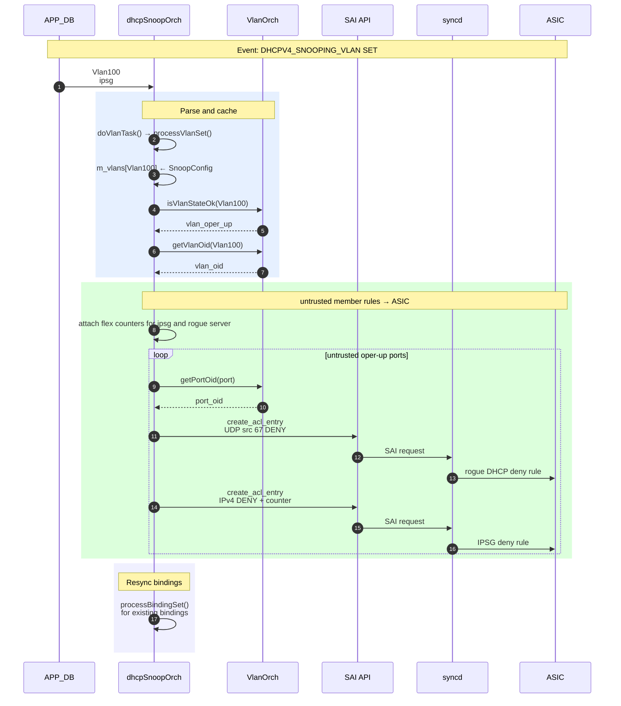


###### When an entry in `DHCPV4_SNOOPING_VLAN` is deleted

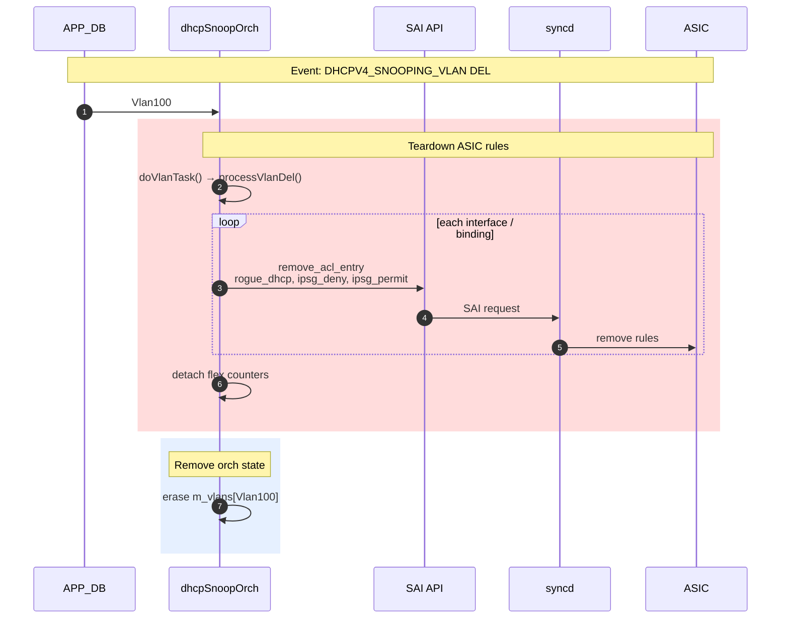


###### When an entry in `DHCPV4_SNOOPING_UNTRUSTED_INTERFACE` is created


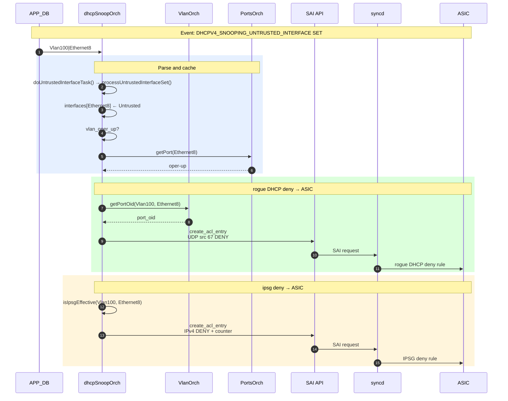


###### When an entry in `DHCPV4_SNOOPING_UNTRUSTED_INTERFACE` is deleted

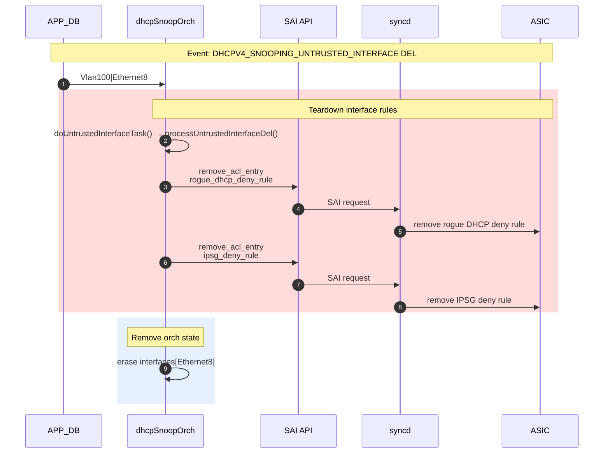


###### When an entry in `DHCPV4_SNOOPING_BINDING` is created


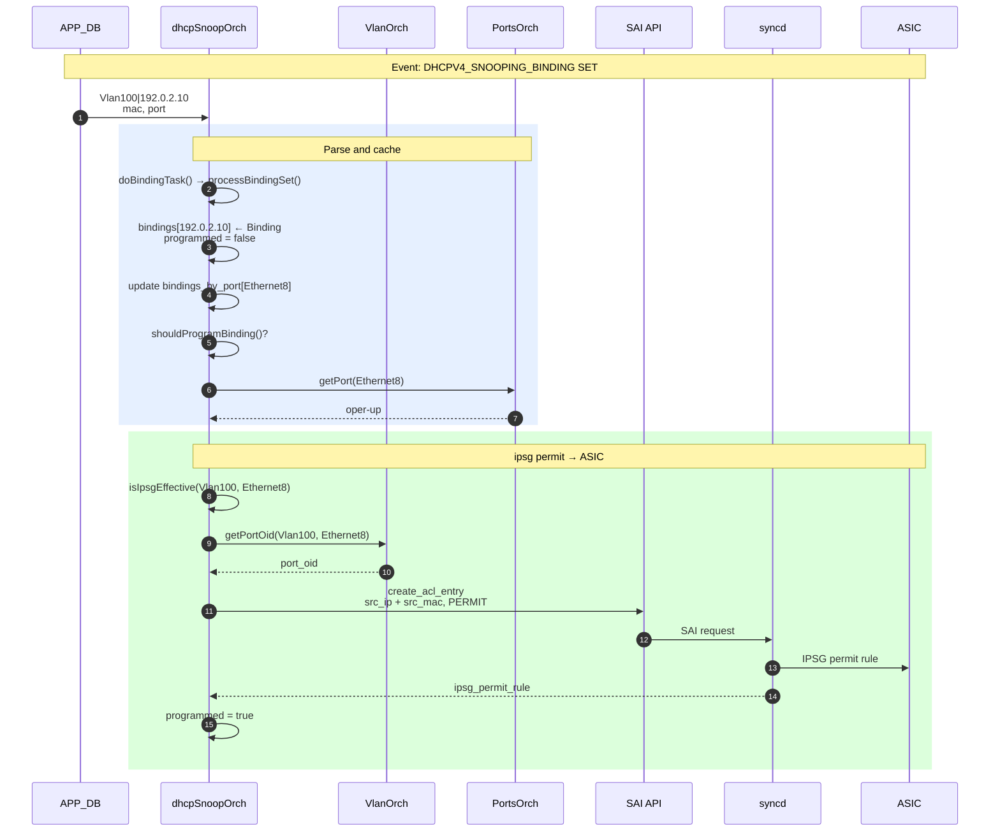


###### When an entry in `DHCPV4_SNOOPING_BINDING` is deleted

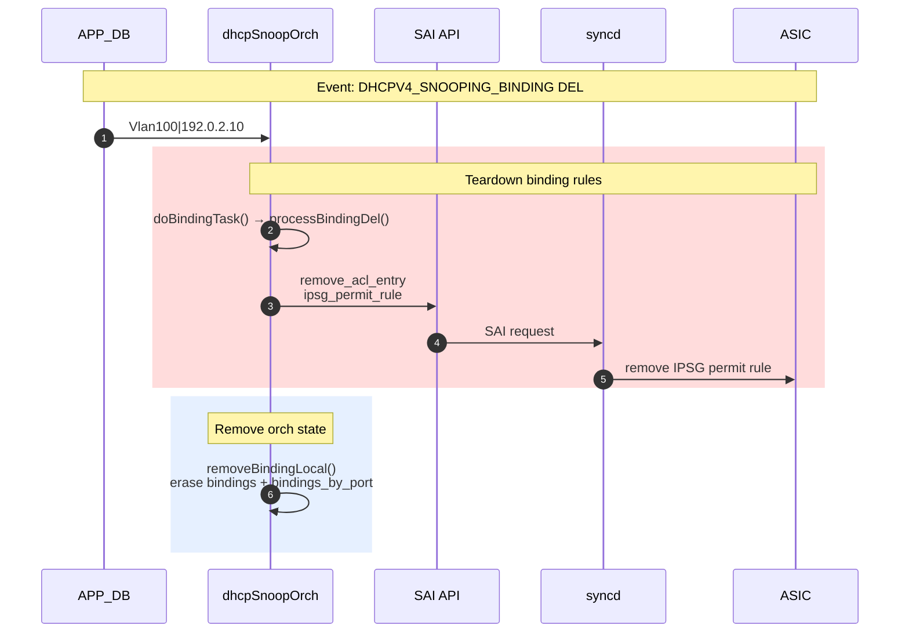


#### 7.5 syncd

No new syncd module is required. **syncd** applies the SAI ACL table, entry, and counter objects that **AclOrch** creates on behalf of **dhcpSnoopOrch**. No snooping-specific SAI adapter changes are required beyond platform support for the ACL match fields and actions used by **dhcpSnoopOrch** (see §7.4).


#### 7.6 DB and Schema changes

The following sections document all new and modified Redis tables. Schemas use ABNF notation (RFC 5234). The value rules below are shared by all schema blocks in §7.6.

```
; ── Shared value annotations (RFC 5234 ABNF) ────────────────────────────────
; These terminal rules are referenced in all schema blocks below.

vlan_id       = 1*4DIGIT
               ; VLAN identifier 1-4094, e.g. "100"

ip_address    = dec-octet "." dec-octet "." dec-octet "." dec-octet
               ; Dotted-decimal IPv4 address, e.g. "192.0.2.10"
dec-octet     = DIGIT                   ; 0-9
               / %x31-39 DIGIT          ; 10-99
               / "1" 2DIGIT             ; 100-199
               / "2" %x30-34 DIGIT      ; 200-249
               / "25" %x30-35           ; 250-255

mac           = 2HEXDIG 5*(":" 2HEXDIG)
               ; Colon-separated 48-bit MAC address, e.g. "aa:bb:cc:dd:ee:ff"

ifname        = 1*VCHAR
               ; SONiC interface name, e.g. "Ethernet4", "PortChannel1"

policy_name   = 1*64VCHAR
               ; Administrator-chosen policy name, e.g. "access-strict"

date-time     = 4DIGIT "-" 2DIGIT "-" 2DIGIT SP 2DIGIT ":" 2DIGIT ":" 2DIGIT
               ; Local datetime in "YYYY-MM-DD hh:mm:ss" format
               ; e.g. "2026-09-15 10:30:56"
               ; Empty string for static entries that never expire
```

##### 7.6.1 CONFIG_DB Changes

**FEATURE** *(existing table — new entry added)*

Producer: `featured` daemon (populated from `manifest.json` at package install time)

Consumer: `featured` daemon, CLI (`config feature state`)

Description: The existing `FEATURE` table is used to enable or disable the `dhcp_snooping` service. A new row is added for `dhcp_snooping` with the following fixed values (derived from the container `manifest.json`) and a default `state` of `disabled`.

Schema:

```
; Existing table — new entry added for dhcp_snooping

key = FEATURE|dhcp_snooping
; field                 = value
state                   = "enabled" / "disabled"    ; Controlled by: config feature state dhcp_snooping
                                                    ; Default: "disabled"
auto_restart            = "enabled"                 ; Restart container automatically on crash
has_global_scope        = "true"                    ; Single instance runs on the device (not per-ASIC)
has_per_asic_scope      = "false"                   ; Not an ASIC-scoped service
delayed                 = "false"                   ; Starts immediately after swss/syncd/teamd
high_mem_alert          = "disabled"                ; No high-memory alerting by default
set_owner               = "local"                   ; Managed locally, not by Kubernetes
check_up_status         = "false"
support_syslog_rate_limit = "true"                  ; Supports per-service syslog rate limiting
```

---

The following new tables are added in CONFIG_DB.

**DHCPV4_SNOOPING_POLICY**

Producer: config CLI

Consumer: DHCPv4 snooping daemon (config manager thread)

Description: Holds named DHCP-snooping security policies. The policy toggles the snooping-dependent security features — IP Source Guard (IPSG).

Schema:

```
; New table
; Holds named DHCP-snooping security policies (IP Source Guard)

key = DHCPV4_SNOOPING_POLICY|policy_name   ; policy_name = 1*64VCHAR
                                         ; administrator-chosen name, e.g. "access-strict"

; field            = value
ip_source_guard    = "true" / "false"    ; Enable IP Source Guard on VLANs using this
                                         ; policy. Default "false".
```

Example:
```
"DHCPV4_SNOOPING_POLICY": {
    "access-strict": {
        "ip_source_guard": "true",
    }
}
```

---

**DHCPV4_SNOOPING_VLAN**

Producer: config CLI (`config dhcp_snooping ipv4 vlan`)

Consumer: DHCPv4 snooping daemon (config manager thread)

Description: Stores the set of VLANs on which DHCPv4 snooping is enabled. Row presence means snooping is enabled on that VLAN; deleting the row disables snooping and flushes all dynamic bindings for that VLAN. The `policy` field references a `DHCPV4_SNOOPING_POLICY` row, applying that policy's IP Source Guard settings to the VLAN.

Schema:

```
; New table
; Holds the set of VLANs on which DHCPv4 snooping is enabled

key = DHCPV4_SNOOPING_VLAN|vlan_id     ; vlan_id = 1*4DIGIT; 1 to 4094
                                        ; Row presence = IPv4 snooping enabled on this VLAN;
                                        ; DEL = disabled
; field   = value
policy    = policy_name                ; Reference to a DHCPV4_SNOOPING_POLICY row.
                                       ; Applies that policy's IPSG settings to the VLAN.
                                       ; Optional; absent = plain snooping only (no IPSG).
```

Example:
```
"DHCPV4_SNOOPING_VLAN": {
    "10": {
        "policy": "access-strict"
    }
}
```

---

**DHCPV4_SNOOPING_TRUSTED_INTERFACE**

Producer: config CLI (`config dhcp_snooping ipv4 trusted-interface`)

Consumer: DHCPv4 snooping daemon (config manager thread)

Description: Stores the set of interfaces (Ethernet ports or PortChannels) configured as trusted toward a DHCP server or relay agent. Row presence means trusted; deleting the row reverts the interface to untrusted.

Schema:

```
; New table
; Holds the set of interfaces configured as DHCPv4 snooping trusted interfaces

key = DHCPV4_SNOOPING_TRUSTED_INTERFACE|ifname   ; Interface name, e.g. "Ethernet4" or "PortChannel1"
                                                  ; Row presence = trusted; DEL = untrusted

; No fields — key-only table
```

---

**DHCPV4_SNOOPING_STATIC_BINDING**

Producer: config CLI (`config dhcp_snooping ipv4 static-binding add`)

Consumer: DHCPv4 snooping daemon (config manager thread)

Description: Stores manually provisioned binding entries. Static entries are always present in the binding table regardless of observed DHCP traffic and are never aged out. They are mirrored directly into `DHCPV4_SNOOPING_BINDING` in STATE_DB with `binding_type = static` and an empty `expiry_time` (never expires; shown as "never").

Schema:

```
; New table
; Holds statically configured DHCPv4 snooping binding entries

key = DHCPV4_SNOOPING_STATIC_BINDING|vlan_id|ip_address
                                         ; Composite key: VLAN ID and client IPv4 address
                                         ; vlan_id    = 1*4DIGIT; 1 to 4094, e.g. "100"
                                         ; ip_address = client IPv4, e.g. 192.168.1.10
; field                 = value
mac_address             = mac            ; MAC address of the client, e.g. aa:bb:cc:dd:ee:ff
interface               = ifname         ; Interface through which the client is connected
```

---

##### 7.6.2 APP_DB Changes

The following new tables are added in `APP_ DB`. The DHCPv4 snooping daemon resolves the CONFIG_DB policy references and the live binding table into these `APP_DB` tables. `dhcpSnoopOrch ` consumes them to program the Rogue server drop, IP Source Guard (IPSG) enforcement state entries into hardware.

**DHCPV4_SNOOPING_VLAN**

Producer: DHCPv4 snooping daemon (main thread)

Consumer: dhcpSnoopOrch

Description: Per-VLAN resolved security state. For each snooping-enabled VLAN, the daemon reads the referenced `DHCPV4_SNOOPING_POLICY` and publishes the effective VLAN-wide IPSG enable flags. If a VLAN has no policy, ipsg flags resolve to `false`.

Schema:

```
; New table
; Per-VLAN resolved IPSG enable state

key = DHCPV4_SNOOPING_VLAN|vlan_id ; vlan_id = 1*4DIGIT; 1 to 4094, e.g. "100"
; field   = value
ipsg      = "true" / "false"                 ; VLAN-wide IP Source Guard enable,
                                             ; resolved from policy ip_source_guard
```

Example:
```
"DHCPV4_SNOOPING_VLAN|100": {
    "ipsg": "true",
}
```

---

**DHCPV4_SNOOPING_UNTRUSTED_INTERFACE**

Producer: DHCPv4 snooping daemon (main thread)

Consumer: dhcpSnoopOrch

Description: The set of `(VLAN, untrusted interface)` pairs on which Rogue server drop and IPSG enforcement applies. The daemon publishes one key-only entry for each untrusted member port of a snooping-enabled VLAN. `orchagent` uses these to scope enforcement to untrusted ports only; trusted interfaces are exempt.

Schema:

```
; New table
; Set of (VLAN, untrusted interface) pairs subject to IPSG enforcement

key = DHCPV4_SNOOPING_UNTRUSTED_INTERFACE|vlan_id|ifname
                                             ; vlan_id = 1*4DIGIT; 1 to 4094, e.g. "100"
                                             ; ifname  = member port, e.g. "Ethernet8"

; No fields — key-only table
```

Example:
```
"DHCPV4_SNOOPING_UNTRUSTED_INTERFACE|100|Ethernet8": {}
```

---

**DHCPV4_SNOOPING_BINDING**

Producer: DHCPv4 snooping daemon (main thread)

Consumer: dhcpSnoopOrch

Description: The hardware-facing binding table. Mirrors the live binding table into `APP_DB` keyed by `(vlan, ip)`. `orchagent` uses the key directly to program IPSG permit entries, which match on client IP within a VLAN.

Schema:

```
; New table
; Hardware-facing binding table, keyed by VLAN and client IP

key = DHCPV4_SNOOPING_BINDING|vlan_id|ip_address
                                             ; vlan_id    = 1*4DIGIT; 1 to 4094, e.g. "100"
                                             ; ip_address = client IPv4, e.g. "192.0.2.10"
; field      = value
mac        = mac                             ; Client MAC address, e.g. 00:11:22:33:44:55
interface  = ifname                          ; Ingress interface where the client REQUEST was
                                             ; observed (not the ACK/server-facing interface)
```

Example:
```
"DHCPV4_SNOOPING_BINDING|100|192.0.2.10": {
    "mac": "00:11:22:33:44:55",
    "interface": "Ethernet8"
}
```

---

##### 7.6.3 STATE_DB Changes

**DHCPV4_SNOOPING_BINDING**

Producer: DHCPv4 snooping daemon (main thread)

Consumer: CLI show commands

Description: The live binding table. Dynamic entries are created when a DHCP ACK is snooped and deleted when the lease expires, a DHCP RELEASE/DECLINE is received, or snooping is disabled on the VLAN. Static entries are created/deleted by the CLI in response to changes in CONFIG_DB `DHCPV4_SNOOPING_STATIC_BINDING`.

Schema:

```
; New table
; Holds the DHCPv4 snooping binding table (dynamic and static entries)

key = DHCPV4_SNOOPING_BINDING|vlan_id|ip_address
                                         ; Composite key: VLAN ID and client IPv4 address
; field                 = value
mac_address             = mac            ; MAC address of the client
lease_time              = 1*DIGIT        ; Lease duration in seconds (DHCP option 51); 0 for static
expiry_time             = date-time      ; Absolute expiry as a local datetime string in
                                         ; "YYYY-MM-DD hh:mm:ss" format, e.g. "2026-09-15 10:30:56"
                                         ; = (wall-clock at DHCP ACK) + lease_time for dynamic entries
                                         ; Empty for static entries, which never expire
                                         ; (shown as "never" in show binding-table)
binding_type            = "dynamic" / "static"
                                         ; dynamic = learned by snooping DHCP messages
                                         ; static  = added manually via CLI
interface               = ifname         ; Interface through which the client is connected
```

---

**DHCPV4_SNOOPING_VLAN**

Producer: DHCPv4 snooping daemon (main thread)

Consumer: CLI show commands

Description: Per-VLAN operational state for snooping-enabled VLANs.

Schema:

```
; New table
; Per-VLAN operational state (resolved policy, IPSG status, binding count)

key = DHCPV4_SNOOPING_VLAN|vlan_id     ; vlan_id = 1*4DIGIT; 1 to 4094, e.g. "100"
; field         = value
policy          = policy_name                ; Name of the applied DHCPV4_SNOOPING_POLICY
                                             ; (empty if no policy is referenced)
ipsg            = "true" / "false"           ; Effective IP Source Guard state,
                                             ; resolved from policy ip_source_guard
binding_count   = 1*DIGIT                    ; Number of active bindings on this VLAN
```

Example:
```
"DHCPV4_SNOOPING_VLAN|100": {
    "policy": "access-strict",
    "ipsg": "true",
    "binding_count": "42"
}
```

---

**DHCPV4_SNOOPING_VLAN_INTERFACE**

Producer: DHCPv4 snooping daemon (main thread)

Consumer: CLI show commands

Description: Per-`(VLAN, interface)` operational state. For each interface of a snooping-enabled VLAN, the daemon publishes the resolved trust state. Used by `show` commands to display which interfaces are trusted vs untrusted within a snooping VLAN.

Schema:

```
; New table
; Per-(VLAN, member port) resolved trust state

key = DHCPV4_SNOOPING_VLAN_INTERFACE|vlan_id|ifname
                                             ; vlan_id = 1*4DIGIT; 1 to 4094, e.g. "100"
                                             ; ifname  = member port, e.g. "Ethernet8"
; field   = value
trust     = "trusted" / "untrusted"          ; Resolved trust state of the port on this VLAN
```

Example:
```
"DHCPV4_SNOOPING_VLAN_INTERFACE|100|Ethernet8": {
    "trust": "untrusted"
}
```

##### 7.6.4 COUNTERS_DB Changes

---

**DHCPV4_SNOOPING_COUNTERS**

Producer: DHCPv4 snooping daemon (stats manager thread)

Consumer: CLI show commands (`show dhcp_snooping ipv4 statistics`)

Description: Per-VLAN DHCP message counters. Incremented by the daemon's main thread on every
received DHCP packet and flushed to COUNTERS_DB every 10 seconds by the stats manager thread.
Counters are cumulative since the last `clear dhcp_snooping ipv4 statistics`.

Schema:

```
; New table
; Per-VLAN DHCP message counters (populated by dhcpv4snoopd stats manager thread)

key = DHCPV4_SNOOPING_COUNTERS|vlan_id     ; vlan_id = 1*4DIGIT; 1 to 4094, e.g. "100"
; field                  = value
dhcp_request_snooped     = 1*DIGIT             ; DHCP REQUEST packets snooped
dhcp_ack_snooped         = 1*DIGIT             ; DHCP ACK packets snooped
dhcp_nak_snooped         = 1*DIGIT             ; DHCP NAK packets snooped
dhcp_release_snooped     = 1*DIGIT             ; DHCP RELEASE packets snooped
dhcp_decline_snooped     = 1*DIGIT             ; DHCP DECLINE packets snooped
```

Example:
```json
"DHCPV4_SNOOPING_COUNTERS|100": {
    "dhcp_request_snooped": "200",
    "dhcp_ack_snooped": "180",
    "dhcp_nak_snooped": "5",
    "dhcp_release_snooped": "15",
    "dhcp_decline_snooped": "2"
}
```

---

**DHCPV4_SNOOPING_DROP_COUNTERS**

Producer: syncd (flex-counter polling on ASIC ACL rules installed by **dhcpSnoopOrch**)

Consumer: CLI show commands (`show dhcp_snooping ipv4 statistics`)

Description: Per-VLAN ASIC security drop counters. **dhcpSnoopOrch** attaches flex counters to the
rogue-server-drop ACL rule and the IPSG-deny ACL rule when it programs them. **syncd** reads the
hardware counters periodically and writes the results here. These counters are reset by
`clear dhcp_snooping ipv4 statistics`.

Schema:

```
; New table
; Per-VLAN ASIC security drop counters (populated by syncd via flex counters)

key = DHCPV4_SNOOPING_DROP_COUNTERS|vlan_id ; vlan_id = 1*4DIGIT; 1 to 4094, e.g. "100"
; field              = value
rogue_server_drops   = 1*DIGIT             ; DHCP server messages (OFFER/ACK/NAK) dropped
                                           ; in the ASIC on untrusted ports
ipsg_drop            = 1*DIGIT             ; Packets dropped by IP Source Guard in the ASIC
```

Example:
```json
"DHCPV4_SNOOPING_DROP_COUNTERS|100": {
    "rogue_server_drops": "5",
    "ipsg_drop": "10"
}
```
#### 7.7 Linux dependencies and interfaces


| Dependency                     | Use                                                                                                                         |
| ------------------------------ | --------------------------------------------------------------------------------------------------------------------------- |
| **AF_PACKET** raw socket       | **dhcpv4snoopd daemon** packet manager receives DHCP frames from the CPU punt path                                                   |
| BPF filter `udp and port 67`   | Limits packet manager CPU load to DHCP server-port traffic                                                                  |
| **swss-common** / **libevent** | Redis pub/sub and event loop in **dhcpv4snoopd daemon** (same stack as `dhcp4relay`)                                                 |
| CoPP L2 DHCP trap (UDP 67/68)  | **CoppOrch** delivers L2 DHCP to CPU for binding learn (§7.3); **dhcpSnoopOrch** does not add a VLAN-scoped copy-to-CPU ACL |

#### 7.8 Docker dependency

See §7.3 for the `dhcp_snooping` container and **dhcpv4snoopd** daemon. The **swss** and **syncd** containers are unchanged except for the new **dhcpSnoopOrch** code inside `orchagent`.

#### 7.9 Build dependency


| Package / library           | Consumer                          |
| --------------------------- | --------------------------------- |
| `libswsscommon`             | **dhcpv4snoopd**, **dhcpSnoopOrch** |
| `libsai`                    | **dhcpSnoopOrch**                 |
| `libevent`                  | **dhcpv4snoopd** event loop         |
| `sonic-swss-common` headers | `schema.h` constants              |


**sonic-buildimage** rules add `sonic-dhcp-snooping` and `sonic-swss` package dependencies to the `dhcp-snooping` and `swss` docker images respectively.


### 8. SAI API

No new SAI API.

### 9. Configuration and management

#### 9.1. CLI

The following CLI commands are available for the DHCPv4 snooping feature.

##### 9.1.1. Enable/Disable DHCPv4 snooping feature

Uses the standard SONiC feature management command:

```
config feature state dhcp_snooping enabled
config feature state dhcp_snooping disabled
```

##### 9.1.2. Enable/Disable DHCPv4 snooping on a VLAN

```
config dhcp_snooping ipv4 vlan enable <vlan_id> --policy <policy_name>
config dhcp_snooping ipv4 vlan disable <vlan_id>
config dhcp_snooping ipv4 vlan set-policy <vlan_id> <policy_name>
```

Example:
```
config dhcp_snooping ipv4 vlan enable 10
DHCPv4 snooping enabled on Vlan 10.

config dhcp_snooping ipv4 vlan enable 20 --policy access-strict
DHCPv4 snooping enabled on Vlan 20 (policy: access-strict).

config dhcp_snooping ipv4 vlan set-policy 10 access-strict
Policy 'access-strict' applied to Vlan 10.

config dhcp_snooping ipv4 vlan disable 10
DHCPv4 snooping disabled on Vlan 10.
```

Notes:
- The VLAN must exist before enabling snooping on it.
- Disabling snooping on a VLAN flushes all dynamic binding entries learned on that VLAN. Static bindings are preserved.

##### 9.1.3. Configure trusted interfaces for DHCPv4 snooping

Supports both Ethernet ports and PortChannels (LAGs):

```
config dhcp_snooping ipv4 trusted-interface add <interface>
config dhcp_snooping ipv4 trusted-interface remove <interface>
```

Example:
```
config dhcp_snooping ipv4 trusted-interface add Ethernet48
Interface 'Ethernet48' marked as trusted for DHCPv4 snooping.

config dhcp_snooping ipv4 trusted-interface add PortChannel1
Interface 'PortChannel1' marked as trusted for DHCPv4 snooping.

config dhcp_snooping ipv4 trusted-interface remove Ethernet48
Interface 'Ethernet48' removed from trusted interfaces for DHCPv4 snooping.
```

Notes:
- By default all interfaces are untrusted.
- DHCP server messages (OFFER, ACK, NAK) arriving on untrusted interfaces on a snooped VLAN are dropped in hardware via ACL rules.
- When a PortChannel is marked trusted, any DHCP server packet arriving on any of its physical member ports is treated as trusted.

##### 9.1.4. Add/Delete static entries in the DHCPv4 snooping binding table

```
config dhcp_snooping ipv4 static-binding add <mac_address> <ip_address> <vlan_id> <interface>
config dhcp_snooping ipv4 static-binding remove <vlan_id> <ip_address>
```

Example:
```
config dhcp_snooping ipv4 static-binding add aa:bb:cc:dd:ee:ff 192.168.1.10 10 Ethernet4
Static binding added: MAC=aa:bb:cc:dd:ee:ff IP=192.168.1.10 Vlan=10 Interface=Ethernet4.

config dhcp_snooping ipv4 static-binding remove 10 192.168.1.10
Static binding removed: Vlan=10 IP=192.168.1.10.
```

Notes:
- DHCPv4 snooping must be enabled on the VLAN before adding a static binding.
- Static entries have infinite lease time and are never aged out.
- Static entries are not overwritten by dynamically snooped entries.

##### 9.1.5. Show DHCPv4 snooping operational state

```
show dhcp_snooping ipv4 vlan <vlan_id>
show dhcp_snooping ipv4 vlan_member [vlan <vlan_id>] [interface <interface>]
```

Example output:
```
show dhcp_snooping ipv4 vlan
VLAN  Policy         IPSG   Bindings
----  -------------  -----  --------
10    access-strict  true   42
20    -              false  8

show dhcp_snooping ipv4 vlan_member
VLAN  Interface     Trust
----  ------------  ---------
10    Ethernet8     untrusted
10    Ethernet48    trusted
20    PortChannel1  trusted
```

##### 9.1.6. Show DHCPv4 snooping binding table

```
show dhcp_snooping ipv4 binding-table
```

Example output:
```
show dhcp_snooping ipv4 binding-table
MAC Address        IP Address     VLAN  Interface    Lease(s)  Expiry Time
-----------------  -------------  ----  -----------  --------  -------------------
aa:bb:cc:dd:ee:01  192.168.1.10   10    Ethernet4    86400     2026-09-17 10:30:56
aa:bb:cc:dd:ee:02  192.168.1.11   10    Ethernet8    86400     2026-09-17 10:36:29
aa:bb:cc:dd:ee:03  192.168.2.5    20    PortChannel1 -         never

Total entries: 3
```

Filter the binding table by VLAN:
```
show dhcp_snooping ipv4 binding vlan 10
MAC Address        IP Address     VLAN  Interface    Lease(s)  Expiry Time
-----------------  -------------  ----  -----------  --------  -------------------
aa:bb:cc:dd:ee:01  192.168.1.10   10    Ethernet4    86400     2026-09-17 10:30:56
aa:bb:cc:dd:ee:02  192.168.1.11   10    Ethernet8    86400     2026-09-17 10:36:29

Total entries: 2
```

##### 9.1.7. Show/clear DHCPv4 snooping statistics

```
show dhcp_snooping ipv4 statistics [vlan <vlan_id>]
clear dhcp_snooping ipv4 statistics [vlan <vlan_id>]
```

Displays the per-VLAN DHCPv4 snooping statistics. The CLI reads from two COUNTERS_DB tables and presents a merged view:

- **`DHCPV4_SNOOPING_COUNTERS`** — DHCP message counters written by the **dhcpv4snoopd** stats manager thread (`Request-Snooped`, `Ack-Snooped`, `Nak-Snooped`, `Release-Snooped`, `Decline-Snooped`).
- **`DHCPV4_SNOOPING_DROP_COUNTERS`** — ASIC security drop counters written by **syncd** via flex-counter polling (`Rogue-Server-Drop`, `IPSG-Drop`).

Example output:
```
show dhcp_snooping ipv4 statistics
VLAN  Request-Snooped  Ack-Snooped  Nak-Snooped  Release-Snooped  Decline-Snooped  Rogue-Server-Drop  IPSG-Drop
----  ---------------  -----------  -----------  ---------------  ---------------  -----------------  ---------
10    200              180          5            15               2                5                  10
20    0                0            0            0                0                0                  0
```

Filter the statistics by VLAN:
```
show dhcp_snooping ipv4 statistics vlan 10
VLAN  Request-Snooped  Ack-Snooped  Nak-Snooped  Release-Snooped  Decline-Snooped  Rogue-Server-Drop  IPSG-Drop
----  ---------------  -----------  -----------  ---------------  ---------------  -----------------  ---------
10    200              180          5            15               2                5                  10
```

Clear the statistics (all VLANs or a single VLAN):
```
clear dhcp_snooping ipv4 statistics
DHCPv4 snooping statistics cleared for all VLANs.

clear dhcp_snooping ipv4 statistics vlan 10
DHCPv4 snooping statistics cleared for Vlan 10.
```

#### 9.2. YANG Model

The DHCPv4 snooping data model is defined in **one YANG module** covering the CONFIG_DB configuration tables.

| Module | DB | Config | Container | Key | Purpose |
|---|---|---|---|---|---|
| `sonic-dhcpv4-snooping` | CONFIG_DB | true | `DHCPV4_SNOOPING_POLICY` | `policy_name` | Named IP Source Guard security policies |
| `sonic-dhcpv4-snooping` | CONFIG_DB | true | `DHCPV4_SNOOPING_VLAN` | `vlan_id` | VLANs on which snooping is enabled (optional policy reference) |
| `sonic-dhcpv4-snooping` | CONFIG_DB | true | `DHCPV4_SNOOPING_TRUSTED_INTERFACE` | `ifname` | Trusted ports and LAGs |
| `sonic-dhcpv4-snooping` | CONFIG_DB | true | `DHCPV4_SNOOPING_STATIC_BINDING` | `vlan_id\|ip_address` | Statically configured binding entries |

```yang
module sonic-dhcpv4-snooping {

    yang-version 1.1;

    namespace "http://github.com/sonic-net/sonic-dhcpv4-snooping";

    prefix dhcpv4snooping;

    import ietf-inet-types  { prefix inet; }
    import ietf-yang-types  { prefix yang; }
    import sonic-port       { prefix port; }
    import sonic-portchannel { prefix lag; }

    organization "SONiC";
    contact      "SONiC";
    description  "DHCPv4 Snooping YANG Module for SONiC OS";

    revision 2026-09-15 {
        description "Regenerated from HLD §7.6 CONFIG_DB schema (IP Source Guard only)";
    }

    container sonic-dhcpv4-snooping {

        /* ── CONFIG_DB: DHCPV4_SNOOPING_POLICY ─────────────────────────────────
         * Key: policy_name
         * Named security policies toggling the snooping-dependent feature
         * (IP Source Guard). Referenced by DHCPV4_SNOOPING_VLAN.
         */
        container DHCPV4_SNOOPING_POLICY {
            description "Named DHCP snooping security policies (IP Source Guard)";

            list DHCPV4_SNOOPING_POLICY_LIST {
                key "policy_name";
                leaf policy_name {
                    description "Administrator-chosen policy name (e.g. access-strict)";
                    type string { length "1..64"; }
                }
                leaf ip_source_guard {
                    description "Enable IP Source Guard on VLANs using this policy";
                    type boolean;
                    default false;
                }
            }
        }

        /* ── CONFIG_DB: DHCPV4_SNOOPING_VLAN ─────────────────────────────────
         * Key: vlan_id
         * Row presence = snooping enabled on that VLAN; DEL = disabled.
         * Optional 'policy' leaf references a DHCPV4_SNOOPING_POLICY.
         */
        container DHCPV4_SNOOPING_VLAN {
            description "VLANs on which DHCPv4 snooping is enabled";

            list DHCPV4_SNOOPING_VLAN_LIST {
                key "vlan_id";
                leaf vlan_id {
                    description "VLAN ID (1-4094) on which DHCPv4 snooping is enabled";
                    type uint16 { range "1..4094"; }
                }
                leaf policy {
                    description "Optional reference to a DHCPV4_SNOOPING_POLICY applying its IP Source Guard settings to this VLAN";
                    type leafref {
                        path "/dhcpv4snooping:sonic-dhcpv4-snooping/dhcpv4snooping:DHCPV4_SNOOPING_POLICY/dhcpv4snooping:DHCPV4_SNOOPING_POLICY_LIST/dhcpv4snooping:policy_name";
                    }
                }
            }
        }

        /* ── CONFIG_DB: DHCPV4_SNOOPING_TRUSTED_INTERFACE ───────────────────
         * Key: ifname
         * Row presence = interface is trusted toward DHCP server/relay.
         * Accepts both Ethernet ports and PortChannels (LAGs).
         */
        container DHCPV4_SNOOPING_TRUSTED_INTERFACE {
            description "Ports/LAGs explicitly configured as trusted for DHCPv4 snooping";

            list DHCPV4_SNOOPING_TRUSTED_INTERFACE_LIST {
                key "ifname";
                leaf ifname {
                    description "Port or LAG name configured as trusted";
                    type union {
                        type leafref {
                            path "/port:sonic-port/port:PORT/port:PORT_LIST/port:name";
                        }
                        type leafref {
                            path "/lag:sonic-portchannel/lag:PORTCHANNEL/lag:PORTCHANNEL_LIST/lag:name";
                        }
                    }
                }
            }
        }

        /* ── CONFIG_DB: DHCPV4_SNOOPING_STATIC_BINDING ──────────────────────
         * Key: vlan_id|ip_address
         * Manually provisioned entries; never aged out; not overwritten by
         * dynamic snooping.
         */
        container DHCPV4_SNOOPING_STATIC_BINDING {
            description "Statically configured DHCPv4 snooping binding entries";

            list DHCPV4_SNOOPING_STATIC_BINDING_LIST {
                key "vlan_id ip_address";

                leaf vlan_id {
                    description "VLAN ID the client belongs to (1-4094)";
                    type uint16 { range "1..4094"; }
                }
                leaf ip_address {
                    description "IPv4 address to bind to this client";
                    type inet:ipv4-address;
                }
                leaf mac_address {
                    description "MAC address of the client (e.g. aa:bb:cc:dd:ee:ff)";
                    mandatory true;
                    type yang:mac-address;
                }
                leaf interface {
                    description "Interface through which the client is reachable";
                    mandatory true;
                    type union {
                        type leafref {
                            path "/port:sonic-port/port:PORT/port:PORT_LIST/port:name";
                        }
                        type leafref {
                            path "/lag:sonic-portchannel/lag:PORTCHANNEL/lag:PORTCHANNEL_LIST/lag:name";
                        }
                    }
                }
            }
        }

    } /* end of container sonic-dhcpv4-snooping (CONFIG_DB) */

} /* end of module sonic-dhcpv4-snooping */
```

### 10. Warmboot and Fastboot Design Impact

| Component         | Warm-reboot behaviour                                                                                                              |
| ----------------- | ---------------------------------------------------------------------------------------------------------------------------------- |
| **ConfigDB**      | Persists — no warm-reboot-specific change                                                                                          |
| **APP_DB**        | Persists — **dhcpSnoopOrch** replays **APP_DB** on orchagent restart and reprograms ASIC rules |
| **StateDB**       | Persists — binding rows and lease timers survive; **dhcpv4snoopd daemon** re-arms lease timers on restart                                   |
| **dhcpv4snoopd**    | Subscribes to **ConfigDB** on start; main thread republishes **APP_DB** / **StateDB** from **ConfigDB** if needed    |
| **dhcpSnoopOrch** | Rebuilds `m_vlans` from **APP_DB** replay; no separate warm-reboot state transfer is required                                      |
| **ASIC**          | Rules are reprogrammed from **APP_DB** replay after warm reboot                                                                    |

On warmboot restart, the main thread in dhcpv4snoopd populates the internal binding list and rearms the lease timers with updated lease time. It uses the expiry_time field to determine if an entry has expired or not. If it has expired it deletes them from the STATE_DB and APP_DB binding table, otherwise it updates the lease time of the entry with the remaining time.

No new warm-reboot orchestration hook is required beyond standard **APP_DB** persistence and consumer replay. Dynamic bindings learned before warm reboot remain in **StateDB** and **APP_DB** until lease expiry.

### 11. Memory Consumption

| Component             | Estimate                                                                                                                                     |
| --------------------- | -------------------------------------------------------------------------------------------------------------------------------------------- |
| **dhcpv4snoopd**        | Comparable to `dhcp4relay` (~tens of MB RSS); binding table stored in-process and mirrored to Redis                                          |
| **dhcpSnoopOrch**     | In-memory `m_vlans` map: one `SnoopConfig` per snooping VLAN, one `Binding` per **APP_DB** binding row, one `InterfaceState` per VLAN member |
| Redis                 | Proportional to number of VLANs, members, and bindings across **ConfigDB**, **APP_DB**, and **StateDB**                                      |


No additional memory reservation beyond standard container limits is required for Phase 1.

### 12. Restrictions/Limitations

- Enabling of the feature leads to copying of all the DHCP packets to CPU even on VLANs where snooping is not enabled
- Does not scale for deployments where DHCP is not running on well known ports
- Trust is global for the interface and not VLAN specific.

### 13. Testing Requirements/Design

#### 13.1. Unit Test cases

| #  | Test Case |
|----|-----------|
| 1  | Verify that L2 DHCP CoPP rules are installed correctly. |
| 2  | Verify the feature enable and disable. |
| 3  | Verify the enable and disable of snooping VLANs. |
| 4  | Verify the add and remove of trusted interfaces. |
| 5  | Verify the add and delete of static bindings into the binding table. |
| 6  | Verify the various dhcp snooping show commands. |
| 7  | Verify the counters commands. |
| 8  | Verify that on a DORA handshake the binding tables are populated properly. |
| 9  | On renew verify the binding table is updated properly. |
| 10 | When DHCP nack is received from server the entry should not be populated in binding table. |
| 11 | When DHCP release and DHCP decline is sent by client, the entry should be removed from binding table. |
| 12 | Verify the rogue server drop is working correctly on untrusted port. Verify the counters. |
| 13 | Verify that entries in binding table are aged out on reaching expiry time. |
| 14 | Verify the CONFIG_DB tables are populated correctly. |
| 15 | Verify the APP_DB and STATE_DB tables are populated correctly. |
| 16 | Verify the IP source guard functionality. Verify the counters. |

#### 13.2. System Test cases

| #  | Test Case |
|----|-----------|
| 1  | When dhcp relay and dhcp snooping is enabled on a vlan, both features should work as expected. |
| 2  | Verify that there is no break of functionality of dhcp relay because of snooping feature. |

### 14. Open/Action items - if any

None.

### 15. References

- [SONiC DHCPv4 Relay Agent HLD](https://github.com/sonic-net/SONiC/blob/master/doc/DHCPv4_relay/DHCPv4-relay-agent-High-Level-Design.md#6-detailed-design) — DHCP relay agent architecture in SONiC (`dhcp4relay`, CoPP, container design)
- [RFC 7513](https://www.rfc-editor.org/rfc/rfc7513) — Source Address Validation Improvement (SAVI) Using DHCP
- [RFC 2131](https://www.rfc-editor.org/rfc/rfc2131) — Dynamic Host Configuration Protocol
- [RFC 3046](https://www.rfc-editor.org/rfc/rfc3046) — DHCP Relay Agent Information Option
