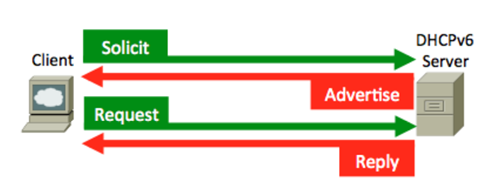
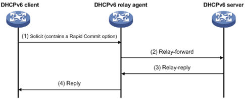
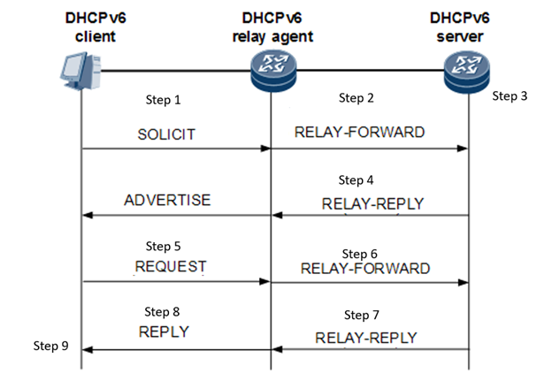
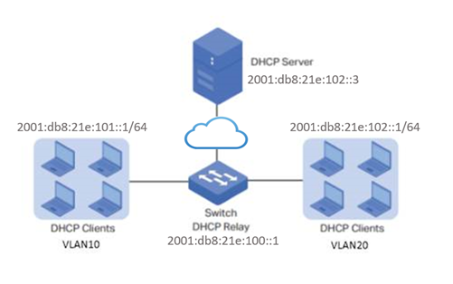

# DHCPv6 Relay Agent

# High Level Design Document

# Table of Contents
* [Scope](#scope)
* [Definition](#definition)
* [Overview](#overview)
* [DHCPv6](#dhcpv6)
    - [Why DHCPv6 relay agent](#why-dhcpv6-relay-agent)
    - [DHCPv6 Relay messages](#dhcpv6-relay-messages)
    - [DHCPv6 Packet Forwarding](#dhcpv6-packet-forwarding)
    - [Relay Agent Behavior](#relay-agent-behavior)
* [Requirements](#requirements)
* [Topology](#topology)
* [Design](#design)
  - [CLI and Usage](#cli-and-usage)
  - [DHCPRELAY counter](#dhcprelay-counter)
  - [CONFIG DB schema](#config-db-schema)
  - [YANG Model schema](#yang-model-schema)
  - [Option 79 for client link-layer address](#option-79-for-client-link-layer-address)
  - [Option 18 for Interface-ID](#option-18-for-interface-id)
  - [Config Update](#config-update)
  - [Option for Dual ToR](#option-for-dual-tor)
  - [Feature table](#feature-table)
  - [RADV modification](#radv-modification)
  - [CoPP manager](#copp-manager)
  - [Source IP](#source-ip)
* [Performance](#performance)
* [Scalability](#scalability)
* [Testing](#testing)

# Scope

This document describes high level design details of SONiC's DHCPv6 relay agent.

# Definition

DHCP: Dynamic Host Configuration Protocol

DUID: DHCP Unique Identifier (Each DHCPv6 client and server has a DUID. DHCPv6 servers use it to identify clients for the selection of configuration parameters with clients. DHCPv6 clients use it to identify a server in messages where a server needs to be identified.)

# Overview

SONiC currently supports DHCPv4 Relay via the use of open source ISC DHCP package. However, DHCPv6 specification does not define a way to communicate client link-layer address to the DHCP server where DHCP server is not connected to the same network link as DHCP client. DHCPv6 requires all clients prepare and send a DUID as the client identifier in all DHCPv6 message exchanges. However, these methods do not provide a simple way to extract a client's link-layer address. Providing option 79 in DHCPv6 Relay-Forward messages will help carry the client link-layer address explicitly. The server needs to know the client's MAC address to allow DHCP Reservation, which provides pre-set IP address to specific client based on its physical MAC address. The DHCPv6 relay agent is able to read the source MAC address of DHCPv6 messages that it received from client, and encapsulate these messages within a DHCPv6 Relay-Forward message, inserting the client MAC address as option 79 in the Relay-Forward header sent to the server.

With heterogenous DHCP client implementation across the network, DUIDs could not resolve IP resource tracking issue. The two types of DUIDs, DUID-LL and DUID-LLT used to facilitate resource tracking both have link layer addresses embedded. The current client link-layer address option in DHCPv6 specification limits the DHCPv6 Relay to first hop to provide the client link layer address, which are relay agents that are connected to the same link as the client, and that limits SONiC DHCPv6 deployment to ToR/MoR switches for early stages. One solution would be to provide SONiC's own DHCPv6 relay agent feature. ISC DHCP currently has no support for option 79. Configuration wise, using ISC DHCP configuration requires restarting container as configuration is provided through the commandline. The plan is to eventually move away from ISC DHCP configuration, which is fairly complex, and provide SONiC's own configuration. 

# DHCPv6

DHCP is a network protocol used to assign IP addresses and provide configuration for devices to communicate on a network.

- DHCP server: receives clients' requests and replies to them
- DHCP client: send configuration requests to the server
- DHCP relay agent: forwards DHCP packets between clients and servers that do not reside on a shared physical subnet

1. Solicit: DHCPv6 client sends a SOLICIT message to locate DHCPv6 servers to the All\_DHCP\_Relay\_Agents\_and\_Servers multicast address.
2. Advertise: DHCPv6 server sends an ADVERTISE message to indicate that it is available for DHCP service, in response to the SOLICIT message
3. Request, Renew, Rebind: DHCPv6 client sends a REQUEST message to request configuration parameters(IP address or delegated prefixes) from the DHCPv6 server
4. Reply: DHCPv6 server sends a REPLY message containing assigned addresses and configuration parameters in response to a CONFIRM message that confirms or denies that the addresses assigned to the client are appropriate to the link to which the client is connected. REPLY message acknowledges receipt of a RELEASE or DECLINE message.



# Why DHCPv6 relay agent

Generally, the DHCPv6 clients get IP by multicasting the DHCP packets in the LAN, and the server will respond to clients' request. In this case, it would be necessary to keep the DHCPv6 server and clients in the same LAN. DHCPv6 relay agent is used to transmit different subnets' DHCPv6 packets, so that all subnets can share DHCPv6 server, and DHCPv6 server is not required on every LAN.

A DHCPv6 client sends most messages using a reserved, link-scoped multicast destination address so that the client need not be configured with the address or addresses of DHCP servers.




In a Relay-forward message, the received message is relayed to the next relay agent or server; in a Relay-reply message, the message is to be copied and relayed to the relay agent or client whose address is in the peer-address field of the Relay-reply message.

# DHCPv6 Relay messages

**Relay-Forward Message**

hop-count: Number of relay agents that have relayed this message.

link-address: A global or site-local address that will be used by the server to identify the link on which the client is located.

peer-address: The address of the client or relay agent from which the message to be relayed was received.

options: include a &quot;Relay Message option&quot; and other options included by relay agent

**Relay-Reply Message**

hop-count: Copied from the Relay-forward message

link-address: Copied from the Relay-forward message

peer-address: Copied from the Relay-forward message

options: include a &quot;Relay Message option&quot;

# DHCPv6 Packet Forwarding

The DHCPv6 relay agent on the routing switch forwards DHCPv6 client packets to all DHCPv6 servers that are configured in the table administrated for each VLAN.

A DHCPv6 client locates a DHCPv6 server using a reserved, link-scoped multicast address.

The packets are forwarded to configurable IPv6 helpers addresses.

# Relay Agent Behavior

1. DHCPv6 client sends multicast SOLICIT message to ALL\_DHCP\_Relay\_Agents\_and\_Servers. Message received by relay agent.
  - Relay agent at default uses ALL\_DHCP\_Servers multicast address. It may be configured to use unicast addresses, or other addresses selected by the network administrator.
2. DHCPv6 relay agent constructs a Relay-forward message copies the source address from header of the IP datagram to the peer-address field of the Relay-forward message and received DHCP message into Relay Message option, and relays this Relay-forward message to the DHCPv6 server in RELAY\_FORWARD message
  - DHCPv6 relay agent also places a global or site-scope address with a prefix assigned to the link on which the client should be assigned an address in the link-address field. (will be used by server to determine the link from which the client should be assigned an address)
  - Hop-count in Relay-forward message is set to 0.
  - If Relay Agent were to relay a message from a relay agent, it checks if the hop-count in the message is greater than or equal to HOP\_COUNT\_LIMIT, and discard if so. Else, hop\_count is incremented by 1.
3. DHCPv6 server received the SOLICIT message, refers to the Relay Agent IP and select an IP address to allocate to the DHCPv6 client.
4. The DHCPv6 server constructs a RELAY-REPLY message that embeds the ADVERTISE messages, and sends it to the DHCPv6 relay agent.
5. DHCPv6 relay agent extracts ADVERTISE message from RELAY-REPLY message and forwards it to the client.
6. DHCPv6 client receives ADVERTISE message and relays a REQUEST message to the DHCPv6 relay agent.
7. DHCPv6 relay agent constructs REQUEST message into a RELAY-FORWARD message, and relays to DHCPv6 server.
8. DHCPv6 server receives the REQUEST message, and sends a REPLY message to the relay agent. Server creates a Relay-reply message that includes a Relay Message option containing the the REPLY message and sends it to the relay agent.
9. DHCPv6 relay agent extracts message and relays the message to the address contained in the peer-address field of the Relay-reply message.
10. DHCPv6 client receives the REPLY message that contains the desired IP address.




# Requirements

- Configured and running DHCPv6 client and server
- Connectivity between the relay agent and DHCPv6 server
- Configure one or more IP helper addresses for specified VLANs to forward DHCPv6 requests to DHCPv6 servers on other subnets.
- Client UDP port:546
- Server and Relay Agent UDP port: 547

# Topology



# Design

# CLI and Usage

-show dhcp6relay_counters

-sonic-clear dhcprelay_counters

-enable/Disable option 79

-enable/Disable use-loopback-address (for dual tor)

-show/config ip helpers

# DHCPRELAY counter

Keeps count of all relay Messages:
SOLICIT
ADVERTISE
REQUEST
CONFIRM
RENEW
REBIND
REPLY
RELEASE
DECLINE
RELAY-FORWARD
RELAY-REPLY

# CONFIG DB schema

<pre>
DHCP|intf-i|dhcpv6_servers: [&quot;dhcp-server-0&quot;, &quot;dhcp-server-1&quot;, ...., &quot;dhcp-server-n-1&quot;]

DHCP|intf-i|dhcpv6_option|rfc6939_support: &quot;true&quot;

DHCP|intf-i|dhcpv6_option|interface_id: &quot;true&quot;
</pre>

<pre>
{
        "DHCP_RELAY" :{
                "Vlan100" : {
                        "dhcpv6_servers" : ["fc02:2000::2"]
			"dhcpv6_option|rfc6939_support" : "true"
			"dhcpv6_option|interface_id" : "true"
                }
        }
}
</pre>

# YANG Model schema

sonic-dhcpv6-relay.yang
<pre>
module sonic-dhcpv6-relay {

	namespace "http://github.com/Azure/sonic-dhcpv6-relay";

	prefix sdhcpv6relay;

	yang-version 1.1;

	import ietf-inet-types {
		prefix inet;
	}

	organization "SONiC";

	contact "SONiC";

	description "DHCPv6 Relay yang Module for SONiC OS";

	revision 2021-10-30 {
		description "First Revision";
	}

	container sonic-dhcpv6-relay {

		container DHCP_RELAY {

			description "DHCP_RELAY part of config_db.json";

			list DHCP_RELAY_LIST {

				key "name";
        
				leaf name {
					type string;
				}

        leaf-list dhcpv6_servers {
                description "Configure the dhcpv6 servers";
                type inet:ipv6-address;
        }

        leaf dhcpv6_option|rfc6939_support {
                description "Set rfc6939 for the relay";
        		    type bool;
		    }

        leaf dhcpv6_option|interface_id {
                description "Set interface-id for the relay";
        		    type bool;
		    }
    }
  }
}
</pre>

# Option 79 for client link-layer address

Option 79 should be enabled by default and can be disabled through editing config_db.json and reapplying configuration or config database directly by the following commands:

Usage:
```
redis-cli -n 4 hset DHCP_RELAY|<vlan> dhcpv6_option|rfc6939_support <true/false>
config vlan dhcp_relay add <vlan_id> <dhcp_relay_destination_ip>
```
Restart dhcp_relay after updating ipv6 helper information.

Or edit directly in config_db.json and apply config_reload:
```
/etc/sonic/config_db.json:
{
        "DHCP_RELAY" :{
                "Vlan100" : {
                        "dhcpv6_servers" : ["fc02:2000::2"]
			"dhcpv6_option|rfc6939_support" : "true"
                }
        }
}

sudo config reload
```

# Option 18 for Interface-ID

Option 18 is disabled by default and can be enabled through editing config_db.json and reapplying configuration or config database directly by the following commands:

Usage:
```
config vlan dhcp_relay add <vlan_id> <dhcp_relay_destination_ip>
redis-cli -n 4 hset DHCP_RELAY|<vlan> dhcpv6_option|interface_id <true/false>
```
Or edit directly in config_db.json and apply config_reload:
/etc/sonic/config_db.json:
{
        "DHCP_RELAY" :{
                "Vlan100" : {
                        "dhcpv6_servers" : ["fc02:2000::2"],
			"dhcpv6_option|interface_id" : "true"
                }
        }
}

sudo config reload

Example:
```
admin@sonic:~$ redis-cli -n 4 hset DHCP_RELAY|Vlan1000 dhcpv6_option|interface_id true
```

# Config Update

We have shifted from VLAN table to DHCP_RELAY table to store ipv6 helper information.
Only DHCP_RELAY table needs to be updated for the versions containing PR https://github.com/sonic-net/sonic-buildimage/pull/10654, or version 20201231.75 and 20181130.98 and above

# Option for Dual ToR

Relayed DHCPv6 packet from ToR may have the response routed to the peer ToR that has the link as standby. Since the originating client is not active on this ToR, the peer ToR won't be able to relay the response. Peer ToR will not receive the packets as the originating client is not active on this ToR. Instead of using Vlan SVI IP address, relay agent source address needs to be set to listen on the loopback address. When DHCP server responses are received by relay agent on the peer ToR, DHCP relay agent would then forward the packet to the peer ToR using its loopback IP interface.

# Feature table

Adding to existing DHCP relay container. No new feature table added

# RADV modification

Router sends an Router Advertisement message that indicates to nodes on the network that they should use DHCPv6 as their method of dynamic address configuration. RA message contains A, M, O, L bits. The routers can use two flags in RA messages to tell the attached end hosts which method to use:

- Managed-Config-Flag(M-bit) tells the end-host to use DHCPv6 exclusively;
- Other-Config-Flag(O-bit) tells the end-host to use SLAAC to get IPv6 address and DHCPv6 to get other parameters such as DNS server address.
- Absence of both flags tells the end-host to use only SLAAC.

# CoPP manager

Control Plane Policing manager is currently configured to only trap DHCPv6 packets when DHCPv6 is enabled.

# Source IP

VLAN SVI IP

Configurable option to use loopback address for dual ToR

# Performance

SONiC DHCP relay agent is currently not relaying many DHCP requests. Frequency arrival rate of DHCP packets is not high so it is not going to affect performance.

# Scalability
Typical number of vlans used with dhcp6relay is around 2 vlans. Performance degration and high CPU utilization is seen on devices with more than 25 vlans configured, especially devices with weaker CPU's.
Tests have shown functionality and performance degradation when there are more than 20 vlans configured on weaker CPU's.

•	25 Vlans - Passed on SPC1.

•	100 and 50 Vlans - Failed on SPC1.

•	100 Vlans - Passed on SPC2 and SPC3 with high CPU utilization.


# Testing

Use counter to check if DHCP messages are forwarded successfully using DHCPv6 relay agent

Check validity of DHCP message content

Validate control plane behavior when DHCPv6 is enabled/disabled

Configuration validation
