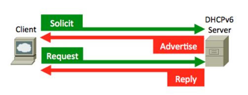
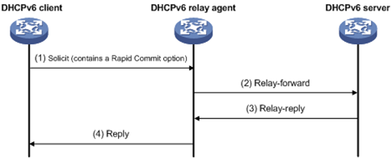
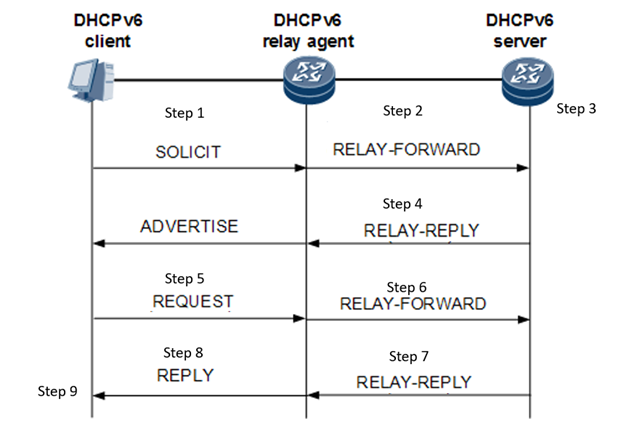
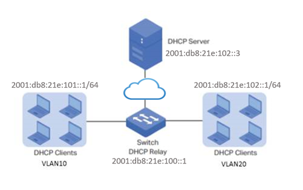

# DHCPv6 Relay Agent

# High Level Design Document

# Table of Contents
* [Scope](#scope)
* [Definition](#definition)
* [Overview](#overview)
* [DHCPv6](#dhcpv6)
    - [Why DHCPv6 relay agent](#why-dhcpv6-relay-agent)
    - [DHCPv6 Relay messages](#dhcpv6-relay-messages)
    - [DHCPv6 Packet Forwarding](#dhcpv6-packet-forwarding)
    - [Relay Agent Behavior](#relay-agent-behavior)
* [Requirements](#requirements)
* [Topology](#topology)
* [Design](#design)
  - [CLI and Usage](#cli-and-usage)
  - [DHCPRELAY counter](#dhcprelay-counter)
  - [CONFIG DB schema](#config-db-schema)
  - [YANG Model schema](#yang-model-schema)
  - [Option 79 for client link-layer address](#option-79-for-client-link-layer-address)
  - [Option for Dual ToR](#option-for-dual-tor)
  - [Feature table](#feature-table)
  - [RADV modification](#radv-modification)
  - [CoPP manager](#copp-manager)
  - [Source IP](#source-ip)
  - [Dynamic Configuration (no container restart)](#dynamic-configuration-no-container-restart)
  - [VRF Support](#vrf-support)
* [Performance](#performance)
* [Testing](#testing)

# Scope

This document describes high level design details of SONiC's DHCPv6 relay agent.

# Definition

DHCP: Dynamic Host Configuration Protocol

DUID: DHCP Unique Identifier (Each DHCPv6 client and server has a DUID. DHCPv6 servers use it to identify clients for the selection of configuration parameters with clients. DHCPv6 clients use it to identify a server in messages where a server needs to be identified.)

# Overview

SONiC currently supports DHCPv4 Relay via the use of open source ISC DHCP package. However, DHCPv6 specification does not define a way to communicate client link-layer address to the DHCP server where DHCP server is not connected to the same network link as DHCP client. DHCPv6 requires all clients prepare and send a DUID as the client identifier in all DHCPv6 message exchanges. However, these methods do not provide a simple way to extract a client's link-layer address. Providing option 79 in DHCPv6 Relay-Forward messages will help carry the client link-layer address explicitly. The server needs to know the client's MAC address to allow DHCP Reservation, which provides pre-set IP address to specific client based on its physical MAC address. The DHCPv6 relay agent is able to read the source MAC address of DHCPv6 messages that it received from client, and encapsulate these messages within a DHCPv6 Relay-Forward message, inserting the client MAC address as option 79 in the Relay-Forward header sent to the server.

With heterogenous DHCP client implementation across the network, DUIDs could not resolve IP resource tracking issue. The two types of DUIDs, DUID-LL and DUID-LLT used to facilitate resource tracking both have link layer addresses embedded. The current client link-layer address option in DHCPv6 specification limits the DHCPv6 Relay to first hop to provide the client link layer address, which are relay agents that are connected to the same link as the client, and that limits SONiC DHCPv6 deployment to ToR/MoR switches for early stages. One solution would be to provide SONiC's own DHCPv6 relay agent feature. ISC DHCP currently has no support for option 79. Configuration wise, using ISC DHCP configuration requires restarting container as configuration is provided through the commandline. The plan is to eventually move away from ISC DHCP configuration, which is fairly complex, and provide SONiC's own configuration. As part of providing SONiC's own configuration, the DHCPv6 relay agent applies relay configuration changes at runtime without restarting the `dhcp_relay` container; see [Dynamic Configuration (no container restart)](#dynamic-configuration-no-container-restart).

# DHCPv6

DHCP is a network protocol used to assign IP addresses and provide configuration for devices to communicate on a network.

- DHCP server: receives clients' requests and replies to them
- DHCP client: send configuration requests to the server
- DHCP relay agent: forwards DHCP packets between clients and servers that do not reside on a shared physical subnet

1. Solicit: DHCPv6 client sends a SOLICIT message to locate DHCPv6 servers to the All\_DHCP\_Relay\_Agents\_and\_Servers multicast address.
2. Advertise: DHCPv6 server sends an ADVERTISE message to indicate that it is available for DHCP service, in response to the SOLICIT message
3. Request, Renew, Rebind: DHCPv6 client sends a REQUEST message to request configuration parameters(IP address or delegated prefixes) from the DHCPv6 server
4. Reply: DHCPv6 server sends a REPLY message containing assigned addresses and configuration parameters in response to a CONFIRM message that confirms or denies that the addresses assigned to the client are appropriate to the link to which the client is connected. REPLY message acknowledges receipt of a RELEASE or DECLINE message.

# Why DHCPv6 relay agent

Generally, the DHCPv6 clients get IP by multicasting the DHCP packets in the LAN, and the server will respond to clients' request. In this case, it would be necessary to keep the DHCPv6 server and clients in the same LAN. DHCPv6 relay agent is used to transmit different subnets' DHCPv6 packets, so that all subnets can share DHCPv6 server, and DHCPv6 server is not required on every LAN.

A DHCPv6 client sends most messages using a reserved, link-scoped multicast destination address so that the client need not be configured with the address or addresses of DHCP servers.

In a Relay-forward message, the received message is relayed to the next relay agent or server; in a Relay-reply message, the message is to be copied and relayed to the relay agent or client whose address is in the peer-address field of the Relay-reply message.

# DHCPv6 Relay messages

**Relay-Forward Message**

hop-count: Number of relay agents that have relayed this message.

link-address: A global or site-local address that will be used by the server to identify the link on which the client is located.

peer-address: The address of the client or relay agent from which the message to be relayed was received.

options: include a &quot;Relay Message option&quot; and other options included by relay agent

**Relay-Reply Message**

hop-count: Copied from the Relay-forward message

link-address: Copied from the Relay-forward message

peer-address: Copied from the Relay-forward message

options: include a &quot;Relay Message option&quot;

# DHCPv6 Packet Forwarding

The DHCPv6 relay agent on the routing switch forwards DHCPv6 client packets to all DHCPv6 servers that are configured in the table administrated for each VLAN.

A DHCPv6 client locates a DHCPv6 server using a reserved, link-scoped multicast address.

The packets are forwarded to configurable IPv6 helpers addresses.

# Relay Agent Behavior

1. DHCPv6 client sends multicast SOLICIT message to ALL\_DHCP\_Relay\_Agents\_and\_Servers. Message received by relay agent.
  - Relay agent at default uses ALL\_DHCP\_Servers multicast address. It may be configured to use unicast addresses, or other addresses selected by the network administrator.
2. DHCPv6 relay agent constructs a Relay-forward message copies the source address from header of the IP datagram to the peer-address field of the Relay-forward message and received DHCP message into Relay Message option, and relays this Relay-forward message to the DHCPv6 server in RELAY\_FORWARD message
  - DHCPv6 relay agent also places a global or site-scope address with a prefix assigned to the link on which the client should be assigned an address in the link-address field. (will be used by server to determine the link from which the client should be assigned an address)
  - Hop-count in Relay-forward message is set to 0.
  - If Relay Agent were to relay a message from a relay agent, it checks if the hop-count in the message is greater than or equal to HOP\_COUNT\_LIMIT, and discard if so. Else, hop\_count is incremented by 1.
3. DHCPv6 server received the SOLICIT message, refers to the Relay Agent IP and select an IP address to allocate to the DHCPv6 client.
4. The DHCPv6 server constructs a RELAY-REPLY message that embeds the ADVERTISE messages, and sends it to the DHCPv6 relay agent.
5. DHCPv6 relay agent extracts ADVERTISE message from RELAY-REPLY message and forwards it to the client.
6. DHCPv6 client receives ADVERTISE message and relays a REQUEST message to the DHCPv6 relay agent.
7. DHCPv6 relay agent constructs REQUEST message into a RELAY-FORWARD message, and relays to DHCPv6 server.
8. DHCPv6 server receives the REQUEST message, and sends a REPLY message to the relay agent. Server creates a Relay-reply message that includes a Relay Message option containing the the REPLY message and sends it to the relay agent.
9. DHCPv6 relay agent extracts message and relays the message to the address contained in the peer-address field of the Relay-reply message.
10. DHCPv6 client receives the REPLY message that contains the desired IP address.

# Requirements

- Configured and running DHCPv6 client and server
- Connectivity between the relay agent and DHCPv6 server
- Configure one or more IP helper addresses for specified VLANs to forward DHCPv6 requests to DHCPv6 servers on other subnets.
- Client UDP port:546
- Server and Relay Agent UDP port: 547

# Topology

# Design

# CLI and Usage

-show dhcp6relay_counters

-sonic-clear dhcprelay_counters

-enable/Disable option 79

-enable/Disable use-loopback-address (for dual tor)

-show/config ip helpers

# DHCPRELAY counter

Keeps count of all relay Messages:
SOLICIT
ADVERTISE
REQUEST
CONFIRM
RENEW
REBIND
REPLY
RELEASE
DECLINE
RELAY-FORWARD
RELAY-REPLY

# CONFIG DB schema

<pre>
DHCP|intf-i|dhcpv6_servers: [&quot;dhcp-server-0&quot;, &quot;dhcp-server-1&quot;, ...., &quot;dhcp-server-n-1&quot;]

DHCP|intf-i|dhcpv6_option|rfc6939_support: &quot;true&quot;
</pre>

# YANG Model schema

sonic-dhcpv6-relay.yang
<pre>
module DHCP  
    container DHCP {  	
        list VLAN_LIST {
    		key name;
   		    leaf name {
    			type string;
  		    }
   		    leaf dhcpv6_servers {
     		    	type inet6:ip-address;
  		    }
		    leaf dhcpv6_option|rfc6939_support {
			    type bool;
		    }
        }
    }
}
</pre>

# Option 79 for client link-layer address

Option 79 should be enabled by default and can be disabled through command line.

# Option for Dual ToR

Relayed DHCPv6 packet from ToR may have the response routed to the peer ToR that has the link as standby. Since the originating client is not active on this ToR, the peer ToR won't be able to relay the response. Peer ToR will not receive the packets as the originating client is not active on this ToR. Instead of using Vlan SVI IP address, relay agent source address needs to be set to listen on the loopback address. When DHCP server responses are received by relay agent on the peer ToR, DHCP relay agent would then forward the packet to the peer ToR using its loopback IP interface.

# Feature table

Adding to existing DHCP relay container. No new feature table added

# RADV modification

Router sends an Router Advertisement message that indicates to nodes on the network that they should use DHCPv6 as their method of dynamic address configuration. RA message contains A, M, O, L bits. The routers can use two flags in RA messages to tell the attached end hosts which method to use:

- Managed-Config-Flag(M-bit) tells the end-host to use DHCPv6 exclusively;
- Other-Config-Flag(O-bit) tells the end-host to use SLAAC to get IPv6 address and DHCPv6 to get other parameters such as DNS server address.
- Absence of both flags tells the end-host to use only SLAAC.

# CoPP manager

Control Plane Policing manager is currently configured to only trap DHCPv6 packets when DHCPv6 is enabled.

# Source IP

VLAN SVI IP

Configurable option to use loopback address for dual ToR

# Dynamic Configuration (no container restart)

Historically the DHCPv6 relay agent read its configuration only once, at process start. The `dhcp6relay` process reads the `DHCP_RELAY` table during initialization, builds a per-VLAN `relay_config` map, and then enters the libevent packet-processing loop. Any subsequent change to relay configuration was not applied to the running process: the relay logged `relay config changed, need restart container to take effect`, and the operator had to restart the `dhcp_relay` container for the new configuration to take effect. Restarting the container is disruptive, as it tears down relay state for every VLAN and interrupts DHCPv6 service for all VLANs while the container restarts, even if only a single VLAN's configuration changed.

This section describes a Config Manager that allows the DHCPv6 relay agent to apply configuration changes at runtime, without restarting the container.

## Config Manager

A dedicated Config Manager thread subscribes to the relevant CONFIG_DB and STATE_DB tables and applies changes incrementally to the running relay. The following is a non-exhaustive list of the tables monitored by the Config Manager:

- **DHCP_RELAY table:** per-VLAN DHCPv6 relay configuration, i.e. the `dhcpv6_servers` list and the DHCPv6 relay options (`dhcpv6_option|rfc6939_support` for option 79 and `dhcpv6_option|interface_id` for the interface-id option).
- **VLAN_INTERFACE table:** presence of a global or site-scoped IPv6 address on the downstream VLAN interface. A relay instance for a VLAN is only meaningful once the VLAN interface has an IPv6 address configured, so the Config Manager uses this to decide when a VLAN's relay can be activated.
- **VLAN table:** VLAN creation and deletion, so relay instances are added or removed as VLANs are configured or unconfigured.
- **STATE_DB INTERFACE_TABLE:** interface readiness, i.e. the link-local address becoming available on a VLAN interface, so a VLAN's relay is reconciled as soon as its interface comes up instead of waiting for the periodic link-local readiness check.

On each notification, the Config Manager computes the new desired set of `relay_config` entries and synchronizes them with the relay main thread.

## Applying changes at runtime

The relay main thread owns all sockets and libevent events. When configuration changes, the relay applies the minimal set of actions required, rather than restarting:

- **Server list or option change for an existing VLAN:** the in-memory `relay_config` for that VLAN is updated. Subsequent client messages are relayed using the updated server list and options; no socket changes are required.
- **VLAN added (with an IPv6 address):** the relay configuration is created and the associated libevent socket events for that VLAN are armed.
- **VLAN removed, its IPv6 address removed, or its relay config deleted:** the relay configuration is torn down and the associated libevent socket events for that VLAN are freed, leaving the relay for other VLANs untouched.

To keep database notifications and the libevent loop within a single event-driven model, the Config Manager wakes the main loop when new configuration is available (for example, through a self-pipe registered as a libevent event). The main loop then re-reads the synchronized configuration and reconciles its sockets and events. This avoids a blocking poll of the databases from the packet path.

The existing periodic link-local readiness check (the 60-second timer that detects when a VLAN interface's link-local address becomes ready) continues to operate and is reused to activate relays for VLANs whose IPv6 readiness changes after configuration is applied.

## Backward compatibility

Runtime reconfiguration is transparent to operators and requires no change to the CONFIG_DB schema. The previous requirement to restart the `dhcp_relay` container for relay configuration changes is removed, and the `need restart container to take effect` log is no longer emitted for supported configuration changes.

# VRF Support

By default the DHCPv6 relay agent forwards relay-forward messages to the DHCPv6 servers using the default (global) routing table. When the relay VLAN or its DHCPv6 servers are reachable only in a non-default VRF, the relay must send and receive the server-facing traffic in that VRF. The relay agent binds its upstream (server-facing) socket to the appropriate VRF using `SO_BINDTODEVICE`, so that relay-forward messages are routed through the VRF's routing table and the corresponding relay-reply messages are received from it. The downstream (client-facing) socket is unaffected; only the server-facing path is VRF aware.

Two deployment models are supported.

## VLAN in a non-default VRF

When the downstream relay VLAN is itself placed in a non-default VRF (its `VLAN_INTERFACE` carries a `vrf_name`), the DHCPv6 servers are reachable in that same VRF. The relay binds the per-VLAN upstream (server-facing) socket to the VLAN's VRF with `SO_BINDTODEVICE`. The VLAN's `vrf_name` is read from the `VLAN_INTERFACE` table; when it is unset the socket remains in the default routing table exactly as before. On success the relay logs `Bound upstream socket for <vlan> to VRF <vrf>`.

## Servers in a different VRF (`server_vrf`)

When the DHCPv6 servers are reachable in a VRF different from the VLAN's own routing table, an explicit `server_vrf` can be configured on the VLAN's `DHCP_RELAY` row. Because several VLANs may share the same `server_vrf`, the relay opens one shared upstream socket per `server_vrf`, bound to `in6addr_any` on port 547 and `SO_BINDTODEVICE`'d to that VRF (logged as `Created shared upstream socket for server VRF <vrf>`). Relay-forward messages for any VLAN whose `server_vrf` matches are sent on that shared socket, and relay-reply messages received on it are demultiplexed back to the originating VLAN using the link-address that the relay placed in the relay-forward message — the same shared-socket / link-address demultiplexing already used for the dual-ToR loopback socket. A `server_vrf` equal to the VLAN's own VRF is treated as "no separate server VRF", and the per-VLAN socket is used.

## CONFIG DB schema

<pre>
DHCP_RELAY|Vlan&lt;id&gt;|dhcpv6_servers: ["dhcp-server-0", ...]
DHCP_RELAY|Vlan&lt;id&gt;|server_vrf: "&lt;vrf-name&gt;"    # optional; servers reachable in this VRF

VLAN_INTERFACE|Vlan&lt;id&gt;|vrf_name: "&lt;vrf-name&gt;"  # existing; places the VLAN (and its relay) in a VRF
</pre>

`server_vrf` is optional and accepts a VRF name (a user-defined `Vrf*` instance, `mgmt`, or `default` for the global table). When it is absent the relay forwards in the VLAN's own routing table.

## YANG model

A `server_vrf` leaf is added to the `DHCP_RELAY` list in `sonic-dhcpv6-relay.yang`:

<pre>
leaf server_vrf {
    type string {
        length "1..15";
    }
    description "VRF in which the DHCPv6 servers are reachable.";
}
</pre>

It is modeled as a string (length 1..15, the `SO_BINDTODEVICE` `IFNAMSIZ` limit) rather than a leafref so that the reserved names `default` (global table) and `mgmt` are accepted in addition to user-defined `Vrf*` instances.

## Runtime behavior

VRF binding is applied at runtime by the Config Manager described in [Dynamic Configuration (no container restart)](#dynamic-configuration-no-container-restart), without restarting the `dhcp_relay` container. Adding, changing, or removing a VLAN's `vrf_name` or a `DHCP_RELAY` `server_vrf` re-binds (or tears down and re-opens) the affected upstream socket in place; the relay process PID is unchanged.

## Backward compatibility

VRF support is opt-in. When neither a VLAN `vrf_name` nor a `server_vrf` is configured, the relay binds its upstream socket in the default routing table exactly as before, and the on-the-wire behavior is unchanged. No existing CONFIG_DB row needs to be modified to retain the previous behavior.

# Performance

SONiC DHCP relay agent is currently not relaying many DHCP requests. Frequency arrival rate of DHCP packets is not high so it is not going to affect performance.

# Testing

Use counter to check if DHCP messages are forwarded successfully using DHCPv6 relay agent

Check validity of DHCP message content

Validate control plane behavior when DHCPv6 is enabled/disabled

Configuration validation

Validate runtime reconfiguration without restarting the `dhcp_relay` container:

- Add, modify, and remove `dhcpv6_servers` for a VLAN and confirm DHCPv6 messages are relayed to the updated server set, without a container restart
- Toggle the option 79 (`rfc6939_support`) and interface-id options and confirm the relayed packets reflect the change
- Add and remove a VLAN (and its IPv6 address) and confirm relay instances are created and torn down while other VLANs continue relaying uninterrupted
- Confirm the `need restart container to take effect` log is no longer emitted for the above changes

Validate VRF support:

- Place a relay VLAN in a non-default VRF and confirm the relay binds its upstream socket to that VRF and relays DHCPv6 messages to servers reachable in it
- Configure a `server_vrf` and confirm the relay opens a shared upstream socket in that VRF and relays and receives messages for the servers reachable there
- Add, change, and remove a VLAN's VRF or `server_vrf` at runtime and confirm the upstream socket is re-bound without restarting the `dhcp_relay` container, and that DHCPv6 traffic is relayed over the correct VRF socket and received back at the client
