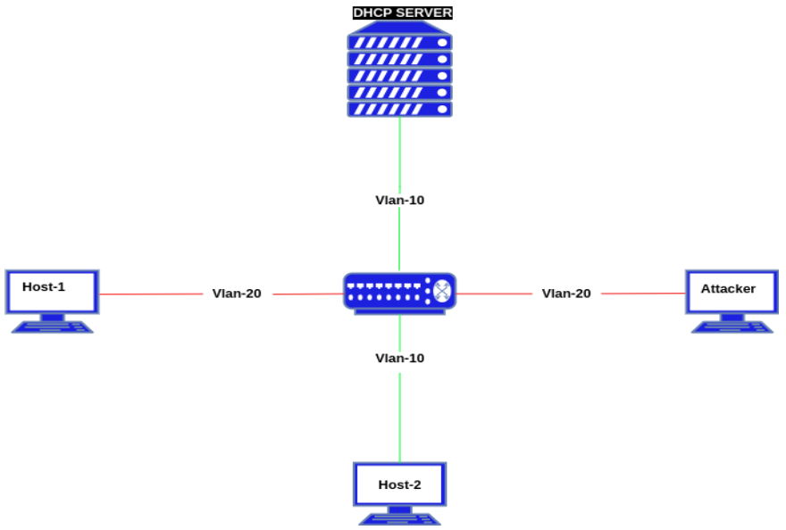
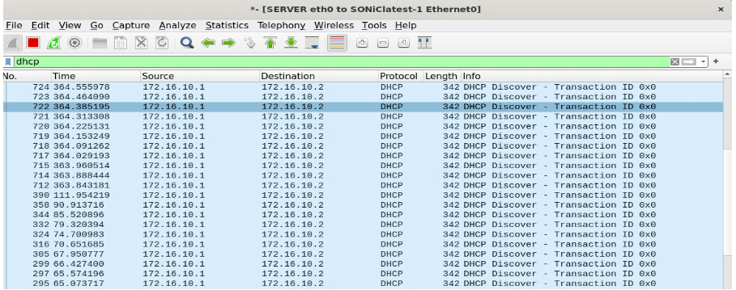
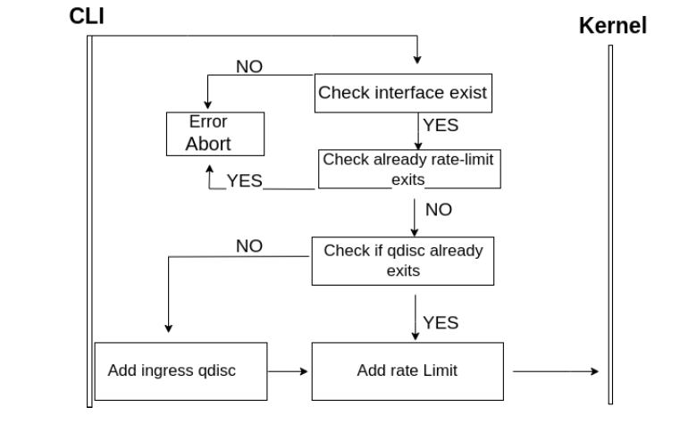
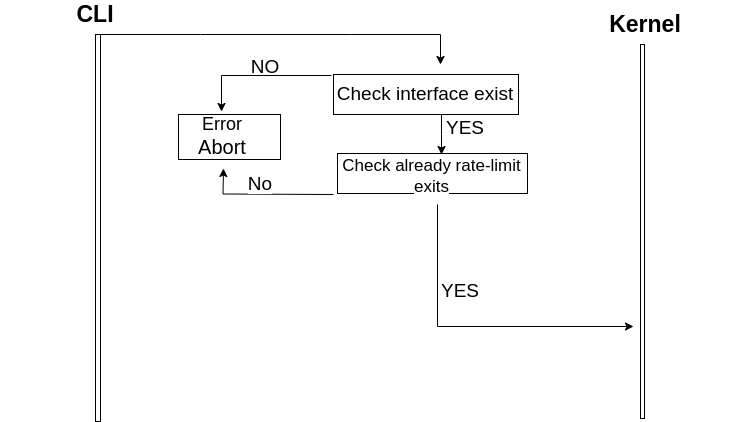

# DHCP DoS Mitigation in SONiC #

[© xFlow Research Inc](https://xflowresearch.com/) 

## Revision History

|Revision No. | Change Description | Author                        | Date           |
|--------------|--------------------|-------------------------------|----------------|
| 0.1          | Initial Version    | Muhammad Ali Hussnain, Asad Raza | 11 April 2024 |

## Table of Content 

- [Scope](#scope)
- [Definitions/Abbreviations](#definitionsabbreviations)
- [Overview](#overview)
- [Introduction](#introduction)
- [DHCP DoS Attack](#dhcp-dos-attack)
- [DHCP DoS Mitigation](#dhcp-dos-mitigation)
- [Proposed Mitigation](#proposed-mitigation)
- [Use Cases](#use-cases)
- [Sequence Diagram for add rate-limit](#sequence-diagram-to-add-rate-limit)
- [Sequence Diagram for del rate-limit](#sequence-diagram-to-del-rate-limit)
- [Requirements](#requirements)
- [High Level Design](#high-level-design)
- [Architecture Design](#architecture-design)
- [SAI API](#sai-api)
- [CLI/YANG model Enhancements](#cli/yang-model-enhancements)
  - [CLI  Configuration Commands](#cli-configuration-commands)
  - [YANG Model](#yang-model)
- [Testing Requirements](#testing-requirementsdesign)
    - [Unit Test Cases](#unit-test-cases)
- [Warm Boot and Fastboot Design Impact](#warmboot-and-fastboot-design-impact)
- [Future Work](#future-work)

### Scope  

This high-level design document describes the implementation for mitigation of DHCP DoS attacks in SONiC

### Definitions/Abbreviations 

| Sr No | Term          | Definition                                                                                     |
|-------|---------------|------------------------------------------------------------------------------------------------|
| 1     | DHCP-Relay    | Denial of Service Relay Agent uses IP routing to forward discover messages to a provisioned DHCP server. |
| 2     | DHCP          | Dynamic Host Configuration Protocol                                                           |
| 3     | DoS           | Denial of Service                                                                             |
| 4     | DORA          | DISCOVER, OFFER, REQUEST, ACKNOWLEDGEMENT                                                    |
| 5     | TC            | Traffic Control                                                                                |

### Overview 

DHCP DoS attack mitigation aims to safeguard the network infrastructure by implementing a rate-limiting mechanism to mitigate the impact of DHCP Denial of Service (DoS) attacks. This design focuses on preventing the exhaustion of DHCP server resources caused by an attacker flooding the network with DHCP DISCOVER messages.

### Introduction

There are two main types of DHCP attacks:
-   DHCP DoS (Denial of Service) - Focus of this HLD
-   DHCP Starvation

**DHCP DoS (Denial of Service)**

In a DHCP DoS (Denial of Service) attack, an attacker floods the DHCP server with an overwhelming number of DHCP DISCOVER packets. This flood of DISCOVER packets consumes all available resources on the DHCP server, making it unable to respond to legitimate DHCP requests from other devices. This proposal focuses on DHCP DoS mitigation.

**DHCP Starvation Attack**

In a DHCP starvation attack, the attacker floods the DHCP server with a large number of DHCP request messages and accepts the DHCP server’s offers, exhausting the pool of available IP addresses that the DHCP server can assign. As a result, legitimate devices are unable to obtain IP addresses from the DHCP server, causing network connectivity issues for those devices.  DHCP Starvation mitigation is out of scope of this HLD.  

### Use Cases for DHCP DOS 

A flood of DHCP discover packets affects the DHCP relay agent. DHCP relay agent forwards DHCP messages between clients and servers across different VLANs. With  large number of DHCP discover packets the relay agent becomes overwhelmed, leading to various issues:

#### Resource Exhaustion 
The DHCP relay agent has finite resources such as CPU, memory, and network bandwidth. A flood of DHCP discover packets consumes these resources, causing the relay agent to become overloaded and unable to process legitimate DHCP requests effectively.

#### Service Degradation
The flood of DHCP discover packets causes service degradation for other clients served by the DHCP relay agent. Legitimate DHCP requests experiences delays or timeouts as the relay agent struggles to handle the excessive volume of traffic.

#### Packet Loss
 The DHCP relay agent experiences packet loss due to the overwhelming volume of DHCP discover packets. This can result in dropped DHCP requests from legitimate clients, leading to connectivity issues and network downtime.

#### Impact on Network Performance
The flood of DHCP discover packets impacts the performance of the network infrastructure, including switches, routers, and other devices involved in forwarding DHCP traffic. Congestion caused by the flood can degrade overall network performance and affect the operation of other network services.

### Behavior of DHCP DoS Attack

The above figure shows 2 different VLANs configured with 4 hosts. Attacker and Host-1 are in Vlan-20 and DHCP-SERVER and Host-2 reside in Vlan-10.  

As shown in the diagram, the attacker launches an attack on the DHCP server/relay with a flood of DHCP DISCOVER packets. The attacker generates a large number of DHCP DISCOVER packets with spoofed MAC addresses and sends these packets to the DHCP relay. The DHCP relay forwards these packets to the DHCP server. The attack is shown in the following diagram (captured from wireshark during instance of attack).  

Due to the huge number of DHCP DISCOVER packets, the server is busy in dealing the DHCP DISCOVER packets and unable to respond to other clients on the same VLAN as the attacker, showing a successful DoS Attack. This demonstrates a DOS Attack which overwhelms the DHCP server.

It can be seen in the screenshot below that a legitimate client (PC1) is unable to be serviced by the DHCP server. After the continuous bombardment of DHCP DISCOVER packets, the DORA process fails to complete, indicating a potential Denial of Service (DoS) situation.

### DHCP DoS Mitigation

To prevent possible DHCP DoS attacks in SONiC, we suggest using rate-limiting with Linux Traffic Control (TC). 

In SONiC, Traffic Control is important for handling data moves through the network. By setting limits on how many DHCP requests can come through, we can protect against attacks. This helps keep the network running smoothly and securely.
Following are few use cases of Traffic Control :
-   It can filter packets on the basis of its properties (eg. IP protocols, source/destination ports and IP addresses, etc.) and drop them based on its behavior (ingress, egress, rate, etc.)
-   It can also change or modify the data if needed. Traffic control(TC) uses queuing disciplines (qdiscs) to help organize and manage the transmission of traffic through a network interface. A qdisc performs two main functions:
-       Enqueuing requests to place packets in a queue for later transmission.
-       Dequeuing requests to select a packet from the queue for immediate transmission.

To prevent a potential DHCP DoS attack on an interface, incoming traffic at the interface is rate-limited using traffic control(TC).

### Proposed Mitigation

DHCP traffic can be filtered and rate-limited by dropping all packets that exceed a user-specified rate, allowing legitimate users to be serviced by the DHCP server despite an ongoing attack. The design  provides a mechanism for DHCP rate-limiting on a specified interface.  Applying DHCP rate limit on a specific interface required two parameters:

-   ##### Interface
    The interface on which the DHCP rate limit is to be applied.

-   ##### rate (packets per second)
    An integer specifying a DHCP packet rate in packets per second. Since traffic control(TC) only supports rates in the form of bytes per second, this value is multiplied by 406 (number of bytes that make up a DHCP discover packet)

Upon running this command, an ingress queuing discipline is created on the specified interface via traffic control(TC). Next, a traffic control(TC) filter is added to filter DHCP discover packets on protocol 17 (UDP) and destination port 67 (port used by DHCP), and a dropping action is applied to an incoming traffic rate. Incoming DHCP discover packets that exceed the rate are dropped to stop the attack from overwhelming the DHCP server.

### Requirements

- Support for Linux traffic control (tc) for implementing the rate-limiting mechanism 
- Support for CLI commands for configuring DHCP rate-limiting

### Architecture Design
The overall SONiC architecture will remain the same and no new sub-modules will be introduced. Changes are made only in SONiC CLI where rate-limiting commands will be added that employ the Linux traffic control utility.

### Sequence Diagram to Add Rate-limit

### Sequence Diagram to Del rate-limit 

### SAI API 

- No SAI API change or addition is needed for this HLD. 

### CLI/YANG model Enhancements 

##### CLI  Configuration Commands

Proposed SONiC CLI commands (sonic-utilities)
-   config interface dhcp-mitigation-rate add [interface] [number of packets]
-   config interface dhcp-mitigation-rate delete [interface] [number of packets]
-   show interface dhcp-mitigation-rate

Background Linux TC commands
-   sudo tc qdisc add dev [Interface] handle ffff: ingress
-   sudo tc filter add dev [Interface] protocol ip parent ffff: prio 1 u32 match ip protocol 17 0xff match ip dport 67 0xffff police rate [Byte Rate] burst [Byte Rate] conform-exceed drop

##### YANG Model
No new YANG Model

### Testing Requirements/Design  

#### Unit Test cases

-   Verify CLI to add DHCP rate on interface
-   Verify CLI to delete DHCP rate on interface
-   Verify CLI to display DHCP rates on all interfaces
-   Verify CLI to check valid DHCP rate (rate must be greater than 0 packets per second)
-   Verify CLI to check validity of port/portchannel on add and delete commands
-   Verify CLI to restrict one DHCP rate per interface 
*(previous rate must be removed before adding a new rate on an interface)
-   Verify CLI to ensure rate limit exists on interface before deleting

### Warmboot and Fastboot Design Impact  
 The existing warm boot/fast boot feature is not affected.

### Future Work
The scope of this HLD is limited to mitigating DHCP DoS attacks by rate-limiting the DHCP control packets. In the future, support for “DHCP Snooping” will also be provided to mitigate DHCP starvation attacks.
