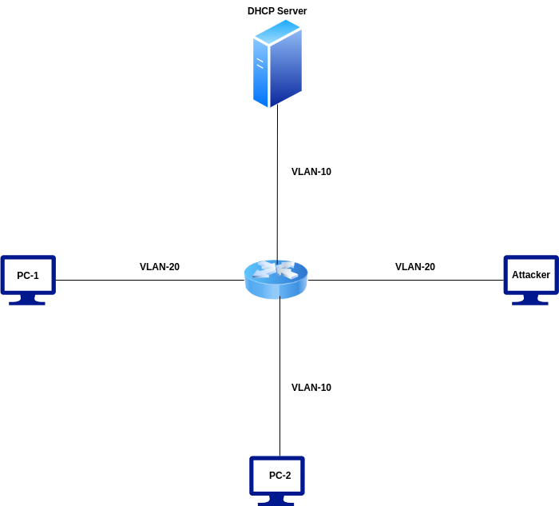
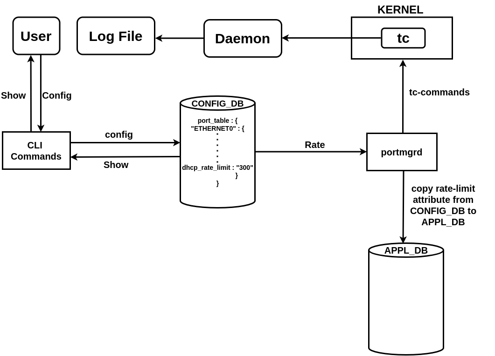
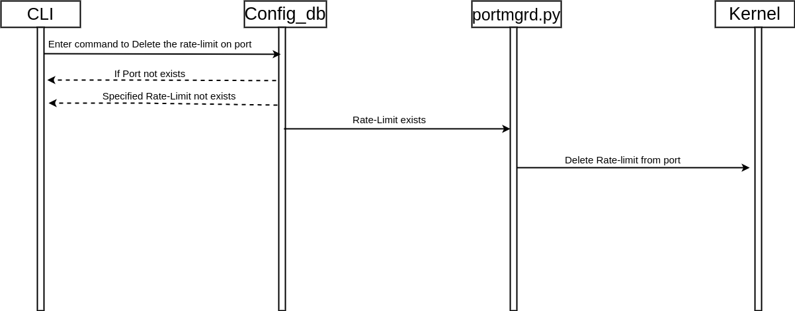

# DHCP DoS Mitigation in SONiC #

[© xFlow Research Inc](https://xflowresearch.com/) 

## Revision History

|Revision No. | Change Description | Author                        | Date           |
|--------------|--------------------|-------------------------------|----------------|
| 0.1          | Initial Version    | Muhammad Ali Hussnain, Asad Raza | 11 April 2024 |

## Table of Content 

- [Scope](#scope)
- [Definitions/Abbreviations](#definitionsabbreviations)
- [Introduction](#introduction)
  -  [DHCP DoS Attack](##dhcp-dos-attack)
  -  [DHCP Starvation Attack](##dhcp-starvation-attack)

- [Effects of DHCP DoS Attacks](#effects-of-dhcp-dos-attacks)
- [Behavior of DHCP DoS Attack](#behavior-of-dhcp-dos-attack)
- [DHCP DoS Mitigation](#dhcp-dos-mitigation)
- [Current Behavior](#current-behavior)
- [Proposed Behavior](#proposed-behavior)
- [Design Changes](#design-changes)
- [Requirements](#requirements)
- [Architecture Design](#architecture-design)
- [Sequence Diagram to Add Rate-limit](#sequence-diagram-to-add-rate-limit)
- [Sequence Diagram to Delete Rate-limit](#sequence-diagram-to-del-rate-limit)
- [SAI API](#sai-api)
- [CLI/YANG model Enhancements](#cli/yang-model-enhancements)
  - [CLI  Configuration Commands](#cli-configuration-commands)
  - [YANG Model](#yang-model)
- [Testing Requirements](#testing-requirementsdesign)
    - [Unit Test Cases](#unit-test-cases)
- [Warm Boot and Fastboot Design Impact](#warmboot-and-fastboot-design-impact)
- [Future Work](#future-work)

### Scope  

This high-level design document describes the implementation for mitigation of DHCP DoS attacks in SONiC

### Definitions/Abbreviations 

| Sr No | Term          | Definition                                                                                     |
|-------|---------------|------------------------------------------------------------------------------------------------|
| 1     | DHCP          | Dynamic Host Configuration Protocol                                                           |
| 2     | DoS           | Denial of Service                                                                             |
| 3     | DORA          | DISCOVER, OFFER, REQUEST, ACKNOWLEDGEMENT                                                    |
| 4     | TC            | Traffic Control                                                                                |

### Introduction
DHCP DoS attack mitigation aims to safeguard the network infrastructure by implementing a rate-limiting mechanism to mitigate the impact of DHCP Denial of Service (DoS) attacks.

There are two main types of DHCP attacks:
-   DHCP DoS (Denial of Service) - Focus of this HLD
-   DHCP Starvation

####    DHCP DoS (Denial of Service) Attack

In a DHCP DoS (Denial of Service) attack, an attacker floods the DHCP server with an overwhelming number of DHCP DISCOVER packets. This flood of DISCOVER packets consumes all available resources on the DHCP server, making it unable to respond to legitimate DHCP requests from other devices. This proposal focuses on DHCP DoS mitigation.

####    DHCP Starvation Attack

In a DHCP starvation attack, the attacker floods the DHCP server with a large number of DHCP request messages and accepts the DHCP server’s offers, exhausting the pool of available IP addresses that the DHCP server can assign. As a result, legitimate devices are unable to obtain IP addresses from the DHCP server, causing network connectivity issues for those devices.  DHCP Starvation mitigation is out of scope of this HLD.  

### Effects of DHCP DoS Attacks

A switch forwards DHCP messages between clients and servers. A flood of DHCP DISCOVER packets affects the DHCP server. With a large number of DHCP DISCOVER packets the server becomes overwhelmed, leading to the following issues:

-   #### Resource Exhaustion 
  The DHCP server has finite resources such as CPU, memory, and network bandwidth. A flood of DHCP discover packets consumes these resources, causing the server to become overloaded and unable to process legitimate DHCP requests on the attacker VLAN effectively.

-   #### Service Degradation
The flood of DHCP discover packets causes service degradation for other clients served by the DHCP server. Legitimate DHCP requests experience delays or timeouts as the server struggles to handle the excessive volume of traffic on the attacker VLAN.

-   #### Packet Loss
 The DHCP server experiences packet loss due to the overwhelming volume of DHCP DISCOVER packets. This can result in dropped DHCP requests from legitimate clients on the attacker VLAN, leading to connectivity issues and network downtime.

-   #### Impact on Network Performance
The flood of DHCP DISCOVER packets impacts the performance of the network infrastructure, including switches, routers, and other devices involved in forwarding DHCP traffic. Congestion caused by the flood can degrade overall network performance and affect the operation of other network services.

### Behavior of DHCP DoS Attack

<figure style="text-align:center;">
    
    <figcaption>Figure 1:  DHCP DoS attack topology diagram</figcaption>
</figure>

The above figure shows 2 different VLANs configured with 3 hosts and a DHCP server. Attacker and PC-1 are in Vlan-20 and DHCP-SERVER and PC-2 reside in Vlan-10.  

As shown in the diagram, the attacker launches an attack on the DHCP server with a flood of DHCP DISCOVER packets. The attacker generates a large number of DHCP DISCOVER packets with spoofed MAC addresses and sends these packets to the switch. The switch forwards these packets to the DHCP server. The attack is shown in the following diagram .  

<figure style="text-align:center;">
    
    <figcaption>Figure 2: Image captured from wireshark during instance of attack</figcaption>
</figure>

Due to the huge number of DHCP DISCOVER packets, the server is busy processing the DHCP DISCOVER packets and is unable to respond to other clients on the same VLAN as the attacker. This demonstrates a successful DoS attack which overwhelms the DHCP server.

It can be seen in the screenshot below that a legitimate client (PC-1) is unable to be serviced by the DHCP server. After the continuous bombardment of DHCP DISCOVER packets, the DORA process fails to complete, indicating a potential Denial of Service (DoS) situation.

<figure style="text-align:center;">
    
    <figcaption>Figure 3: Incomplete DORA process during DoS attack</figcaption>
</figure>

### Current Behavior
Currently in SONiC, a default system-wide DHCP rate limit of 300 packets per second is implemented through CoPP. Since this limit is system-wide, in the event of a DHCP DoS attack where the attacker sends packets at a rate greater than 300 packets per second, it will result in CoPP dropping most legal packets as there are a lot more illegal packets coming into the system.

### Proposed Behavior
To ensure the availability of a DHCP server for legal clients across a network, rate-limiting must be implemented at a port level so the effects of an attacker stay limited to the port it is connected to.
This can be achieved by removing the system-wide DHCP rate limit of 300 packets per second implemented through CoPP and replacing it with port-level rate limits implemented in the kernel via Linux Traffic Control (TC). This means CoPP won't restrict DHCP traffic anymore, allowing potentially harmful packets to reach the kernel where TC will be able to rate-limit ingress traffic according to rates defined for each port. This will effectively isolate the effects of a DHCP DoS attack to remain solely on the attacked port, successfully protecting clients connected to all other ports of the switch.

### Design Changes

To achieve this, a new entry “dhcp_rate_limit” will be added in the “PORT_TABLE” of config_db with a default value of 300 packets per second to ensure backward compatibility. CLI commands will be written to use this attribute in config_db. “Portmgrd” in the SwSS container will be modified to configure config_db rate-limits inside the kernel via TC commands.

Following are a few use cases of Traffic Control :
- Filter packets on the basis of their properties (eg. IP protocols, source/destination ports and IP addresses, etc.) and drop them based on their behavior (ingress, egress, rate, etc.)
- Change or modify the data if needed

Traffic control(TC) uses queuing disciplines (qdiscs) to help organize and manage the transmission of traffic through a network interface. A qdisc performs two main functions:
- Enqueuing requests to place packets in a queue for later transmission
- Dequeuing requests to select a packet from the queue for immediate transmission

When the user adds the "dhcp_rate_limit" entry in the “PORT_TABLE” of the config database, that limit is then enforced on the specified interface it corresponds to.
DHCP traffic can be filtered and rate-limited by dropping all packets that exceed a user-defined rate, allowing legitimate clients to be serviced by a DHCP server despite an ongoing attack. This design provides a mechanism for DHCP rate-limiting on a specified port. Applying DHCP rate limit on a specific port requires two parameters:

- port
  The port on which the DHCP rate limit is to be applied.
- rate
 (packets per second)An integer specifying a DHCP packet rate in packets per second. 

Since traffic control(TC) only supports rates in the form of bytes per second, this value is multiplied by 406 (number of bytes that make up a DHCP discover packet).
Upon running this command, an ingress queuing discipline is created on the specified port via traffic control(TC). Next, a traffic control(TC) filter is added to filter DHCP discover packets on protocol 17 (UDP) and destination port 67 (port used by DHCP) and a dropping action is applied to filtered incoming traffic. Incoming DHCP discover packets that exceed the rate are dropped to stop the attack from overwhelming the DHCP server.

A custom program (daemon) has been developed to monitor network traffic. This daemon continuously checks all network ports (tc qdisc) for signs of packet drops. If it detects increase in dropped packets on a specific port, it logs a message to a designated file. This log message serves as an alert for the user, notifying them about potential congestion and packet loss issues on the affected port.

### Requirements

- Support for Linux traffic control (tc) for implementing the rate-limiting mechanism 
- Support for CLI commands for configuring DHCP rate-limiting

### Architecture Design
The overall SONiC architecture will remain the same. Changes are made only in the SONiC Utilities container, SwSS container, and Config_DB.

<figure style="text-align:center;">
    
    <figcaption>Figure 4: Feature Design</figcaption>
</figure>

### Sequence Diagram to add rate-limit

<figure style="text-align:center;">
    
    <figcaption>Figure 5: Sequence diagram illustrating the process of deleting rate-limit for DHCP DoS mitigation</figcaption>
</figure>

### Sequence Diagram to Del rate-limit 

<figure style="text-align:center;">
    
    <figcaption>Figure 6: Sequence diagram illustrating the process of deleting rate-limit for DHCP DoS mitigation</figcaption>
</figure>

### Configuration &  Management

#### CONFIG_DB Enhancements

New attribute “dhcp_rate_limit” will be added to “PORT_TABLE” to support DHCP mitigation rate.

    "PORT":
      {
        "Ethernet0": {
            "admin_status": "up",
            "alias": "fortyGigE0/0",
            "index": "0",
            "lanes": "25,26,27,28",
            "mtu": "9100",
            "speed": "40000",
            "dhcp_rate_limit" : "300"
        }
      }

#### DB Migrator Enhancements

As there is a change in the schema for PORT in config DB. We have added a new "dhcp_rate_limit" field in db_migrator.py in order to support backward compatibility.

Existing Before Migration PORT TABLE Schema in Config_DB

    "PORT": 
    {
        "Ethernet0": {
            "admin_status": "up",
            "alias": "fortyGigE0/0",
            "index": "0",
            "lanes": "25,26,27,28",
            "mtu": "9100",
            "speed": "40000"
        }
    }

After Migration PORT TABLE Schema in Config_DB
 

    "PORT": 
    {
        "Ethernet0": {
            "admin_status": "up",
            "alias": "fortyGigE0/0",
            "index": "0",
            "lanes": "25,26,27,28",
            "mtu": "9100",
            "speed": "40000",
            "dhcp_rate_limit" : "300"
        }
    }

### SAI API 

No SAI API change or addition is needed for this HLD. 

### CLI/YANG model Enhancements 

##### CLI  Configuration Commands

Proposed SONiC CLI commands (sonic-utilities)
-   config interface dhcp-mitigation-rate add [port] [packet-rate]
-   config interface dhcp-mitigation-rate delete [port] [packet-rate]
-   show interface dhcp-mitigation-rate

Background Linux TC commands
-   sudo tc qdisc add dev [interface] handle ffff: ingress
-   sudo tc filter add dev [interface] protocol ip parent ffff: prio 1 u32 match ip protocol 17 0xff match ip dport 67 0xffff police rate [byte-rate] burst [byte-rate] conform-exceed drop
-  sudo  tc  -s  qdisc show dev [port] handle ffff:

##### YANG Model

New leaf “dhcp_rate_limit” will be added to support DHCP mitigation rate.

     leaf dhcp_rate_limit {
   	        description: "dhcp rate limit ;
   				  type uint32 {
   					   range 0..8000;
   				 }
   			 }

### Testing Requirements/Design  

#### Unit Test cases

-   Verify CLI to add DHCP rate on port
-   Verify CLI to delete DHCP rate on port
-   Verify CLI to display DHCP rates on all port
-   Verify CLI to check valid DHCP rate (rate must be greater than 0 packets per second)
-   Verify CLI to check validity of port/portchannel on add and delete commands
-   Verify CLI to restrict one DHCP rate per port 
*(previous rate must be removed before adding a new rate on an port)
-   Verify CLI to ensure rate limit exists on port before deleting

#### Functional Test cases

-   Verify DHCP rate has been said on interface
-   Simulate Excessive DHCP Traffic on interface
-   Verify DHCP packets has been dropped as per rate limit

### Warmboot and Fastboot Design Impact  
 The existing warm boot/fast boot feature is not affected.

### Future Work
The scope of this HLD is limited to mitigating DHCP DoS attacks by rate-limiting the DHCP control packets. In the future, support for “DHCP Snooping” will also be provided to mitigate DHCP starvation attacks.
