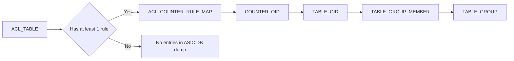
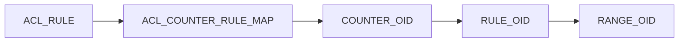

# Dump Utility for Easy Debugging #
#### Rev 1.0

# Table of Contents
  * [Revision](#revision)
  * [About this Manual](#about-this-manual)
  * [Definitions/Abbreviation](#definitionsabbreviations)
  * [Overview](#overview)
  * [1. Requirements](#1-requirements)
      * [1.1 Intended Usage](#11-intended-usage)
      * [1.2 Customization Options](#12-customization-options)
      * [1.3 Extensibility](#13-extensibility)
      * [1.4 Directory Structure](#14-directory-structure)
  * [2. Design](#2-design)
      * [2.0 The Executor Class](#20-the-executor-class)
      * [2.1 Adding new Modules](#21-adding-new-modules)
      * [2.2 Module Internals](#22-module-internals)
      * [2.3 Helper Methods Available](#23-helper-methods-available)
      * [2.4 Match Infrastructure](#24-Match-Infrastructure)
      * [2.5 MatchRequest Examples](#25-matchrequest-examples)
  * [3. Modules](#3-modules)
      * [3.1 ACL Table](#31-acl-table)
      * [3.2 ACL Rule](#32-acl-rule)
  * [4. Unit Tests](#4-unit-tests)
  * [5. TechSupport](#5-techsupport)

### Revision

| Rev |     Date    |       Author       | Change Description          |
|:---:|:-----------:|:-------------------------|:----------------------|
| 1.0 | 05/28/2021  | Vivek Reddy Karri        | Initial version       |

## About this Manual
This document describes the details of a dump cli utility which collects and dumps the redis state for a given feature/module.

## Definitions/Abbreviations
###### Table 1: Abbreviations
| Abbreviation | Description                                                  |
| ------------ | ------------------------------------------------------------ |
| APP DB       | Application Database                                         |
| ASIC DB      | ASIC Database                                                |
| CONF DB      | Configuration Database                                       |


In this document, the term '**redis state**' refers to the intermediate state of a given feature present across all the Redis DB's

## Overview
In SONiC, there usually exists a set of tables related/relevant to a particular module. All of these have to be looked at to confirm whether  any configuration update is properly applied and propagated.

The task of debugging quickly becomes tedious because currently, there is no utility which does print a unified view of the redis-state.
This is the problem which is addressed by this dump utility.

This utility provides the base infrastructure and guidelines to make is easy for the developers to extend and support the utility for different modules.

## **1 Requirements**

### 1.1 Intended Usage

Note: Currently, `state` is the only subcommand under `dump`.

```
dump state <feature/module> <arg | all>

Example usage for Port feature which accepts an argument port_name
dump state port <port_name>
dump state port Ethernet4
dump state port Ethernet4,Ethernet8,Ethernet12
dump state port all
```

#### 1.1 Intended Usage
1) The `dump state` subcommand will take a feature/module or any logical top-level name as the first argument.
2) A Second Argument should also be defined for a feature.
3) This argument could either be a table-key or a unique-field-value present in either Conf DB or Appl DB.
   * Eg: For PORT, the second argument will be an interface name i.e 'Ethernet128' which is a table-key. On the other hand, the secondary argument for COPP will be a trap_id such as  'arp_req', which is a field-value and not a key of any table.
4) The decision of what to pass as a secondary argument lies with the discretion of the one who is writing the module.
6) The Command should also take a list of comma seperated inputs for the secondary argument
7) The Command should also accept an "all" value and which means it should print the unified view for every entry related to that feature.

```
root@sonic# dump state --help
Usage: dump state [OPTIONS] MODULE IDENTIFIER

  Dump the current state of the identifier for the specified module from Redis DB or CONFIG_FILE

Options:
  -s, --show            Display Modules Available
  -d, --db TEXT         Only dump from these Databases or the CONFIG_FILE
  -t, --table           Print in tabular format  [default: False]
  -k, --key-map         Only fetch the keys matched, don't extract field-value dumps  [default: False]
  -v, --verbose         Prints any intermediate output to stdout useful for dev & troubleshooting  [default: False]
  -n, --namespace TEXT  Dump the redis-state for this namespace.  [default: DEFAULT_NAMESPACE]
  --help                Show this message and exit.
```

### 1.2 Customization Options

1) The unified view printed can be filtered per db using -d option
2) Output is displayed in JSON format by default. Use -t to print in tabular format.
3) All the available modules should be displayed using a -s option
4) If Field-Value Tuples are not required, use -k option to specify that
5) Use -v option to specify the intermediate output
6) Namsepace can be changed using -n option

```
root@sonic# dump state --show
Module    Identifier
--------  ------------
port      port_name
copp      trap_id


root@sonic# dump state port Ethernet0
{
    "Ethernet0": {
        "CONFIG_DB": {
            "keys": [
                {
                    "PORT|Ethernet0": {
                        "admin_status": "up",
                        "alias": "etp1",
                        "index": "1",
                        "lanes": "0,1,2,3,4,5,6,7",
                        "speed": "100000"
                    }
                }
            ],
            "tables_not_found": []
        },
        "APPL_DB": {
            "keys": [
                {
                    "PORT_TABLE:Ethernet0": {
                        "admin_status": "up",
                        "alias": "etp1",
                        "description": "",
                        "index": "1",
                        "lanes": "0,1,2,3,4,5,6,7",
                        "mtu": "9100",
                        "oper_status": "up",
                        "speed": "100000"
                    }
                }
            ],
            "tables_not_found": []
        },
        "ASIC_DB": {
            "keys": [
                {
                    "ASIC_STATE:SAI_OBJECT_TYPE_HOSTIF:oid:0xd00000000056d": {
                        "SAI_HOSTIF_ATTR_NAME": "Ethernet0",
                        "SAI_HOSTIF_ATTR_OBJ_ID": "oid:0x10000000004a4",
                        "SAI_HOSTIF_ATTR_OPER_STATUS": "true",
                        "SAI_HOSTIF_ATTR_TYPE": "SAI_HOSTIF_TYPE_NETDEV",
                        "SAI_HOSTIF_ATTR_VLAN_TAG": "SAI_HOSTIF_VLAN_TAG_STRIP"
                    }
                },
                {
                    "ASIC_STATE:SAI_OBJECT_TYPE_PORT:oid:0x10000000004a4": {
                        "NULL": "NULL",
                        "SAI_PORT_ATTR_ADMIN_STATE": "true",
                        "SAI_PORT_ATTR_MTU": "9122",
                        "SAI_PORT_ATTR_SPEED": "100000"
                    }
                }
            ],
            "tables_not_found": [],
            "vidtorid": {
                "oid:0xd00000000056d": "oid:0xd",
                "oid:0x10000000004a4": "oid:0x1690000000001"
            }
        },
        "STATE_DB": {
            "keys": [
                {
                    "PORT_TABLE|Ethernet0": {
                        "state": "ok"
                    }
                }
            ],
            "tables_not_found": []
        }
    }
}


# --key-map option
root@sonic# dump state port Ethernet0 --key-map
{
    "Ethernet0": {
        "CONFIG_DB": {
            "keys": [
                "PORT|Ethernet0"
            ],
            "tables_not_found": []
        },
        "APPL_DB": {
            "keys": [
                "PORT_TABLE:Ethernet0"
            ],
            "tables_not_found": []
        },
        "ASIC_DB": {
            "keys": [
                "ASIC_STATE:SAI_OBJECT_TYPE_HOSTIF:oid:0xd00000000056d",
                "ASIC_STATE:SAI_OBJECT_TYPE_PORT:oid:0x10000000004a4"
            ],
            "tables_not_found": [],
            "vidtorid": {
                "oid:0xd00000000056d": "oid:0xd",
                "oid:0x10000000004a4": "oid:0x1690000000001"
            }
        },
        "STATE_DB": {
            "keys": [
                "PORT_TABLE|Ethernet0"
            ],
            "tables_not_found": []
        }
    }
}

admin@sonic:~$ dump state copp sample_packet --key-map
{
    "sample_packet": {
        "CONFIG_DB": {
            "keys": [],
            "tables_not_found": []
        },
        "APPL_DB": {
            "keys": [],
            "tables_not_found": [
                "COPP_TABLE"
            ]
        },
        "ASIC_DB": {
            "keys": [],
            "tables_not_found": [
                "ASIC_STATE:SAI_OBJECT_TYPE_HOSTIF_TRAP",
                "ASIC_STATE:SAI_OBJECT_TYPE_HOSTIF_TRAP_GROUP"
            ]
        },
        "STATE_DB": {
            "keys": [
                "COPP_TRAP_TABLE|sflow"
            ],
            "tables_not_found": [
                "COPP_GROUP_TABLE"
            ]
        },
        "CONFIG_FILE": {
            "keys": [
                "COPP_TRAP|sflow",
                "COPP_GROUP|queue2_group1"
            ],
            "tables_not_found": []
        }
    }
}

# db filtering using --db option
admin@sonic:~$ dump state copp arp_req --key-map --db ASIC_DB
{
    "arp_req": {
        "ASIC_DB": {
            "keys": [
                "ASIC_STATE:SAI_OBJECT_TYPE_HOSTIF_TRAP:oid:0x22000000000c5b",
                "ASIC_STATE:SAI_OBJECT_TYPE_HOSTIF_TRAP_GROUP:oid:0x11000000000c59",
                "ASIC_STATE:SAI_OBJECT_TYPE_POLICER:oid:0x12000000000c5a",
                "ASIC_STATE:SAI_OBJECT_TYPE_QUEUE:oid:0x15000000000626"
            ],
            "tables_not_found": [],
            "vidtorid": {
                "oid:0x22000000000c5b": "oid:0x200000000022",
                "oid:0x11000000000c59": "oid:0x300000011",
                "oid:0x12000000000c5a": "oid:0x200000012",
                "oid:0x15000000000626": "oid:0x12e0000040015"
            }
        }
    }
}


root@sonic# dump state port Ethernet0 --key-map --db CONFIG_DB --db ASIC_DB
{
    "Ethernet0": {
        "CONFIG_DB": {
            "keys": [
                "PORT|Ethernet0"
            ],
            "tables_not_found": []
        },
        "ASIC_DB": {
            "keys": [
                "ASIC_STATE:SAI_OBJECT_TYPE_HOSTIF:oid:0xd00000000056d",
                "ASIC_STATE:SAI_OBJECT_TYPE_PORT:oid:0x10000000004a4"
            ],
            "tables_not_found": [],
            "vidtorid": {
                "oid:0xd00000000056d": "oid:0xd",
                "oid:0x10000000004a4": "oid:0x1690000000001"
            }
        }
    }
}


root@sonic# dump state port Ethernet0 --key-map --db STATE_DB
{
    "Ethernet0": {
        "STATE_DB": {
            "keys": [
                "PORT_TABLE|Ethernet0"
            ],
            "tables_not_found": []
        }
    }
}

# Table display using --table/-t
root@sonic# dump state port Ethernet0 --key-map --db ASIC_DB --table
+-------------+-----------+-----------------------------------------------------------+
| port_name   | DB_NAME   | DUMP                                                      |
+=============+===========+===========================================================+
| Ethernet0   | ASIC_DB   | +-------------------------------------------------------+ |
|             |           | |                    Keys Collected                     | |
|             |           | +-------------------------------------------------------+ |
|             |           | | ASIC_STATE:SAI_OBJECT_TYPE_HOSTIF:oid:0xd00000000056d | |
|             |           | |  ASIC_STATE:SAI_OBJECT_TYPE_PORT:oid:0x10000000004a4  | |
|             |           | +-------------------------------------------------------+ |
|             |           | +---------------------+---------------------+             |
|             |           | |         vid         |         rid         |             |
|             |           | +---------------------+---------------------+             |
|             |           | | oid:0xd00000000056d |       oid:0xd       |             |
|             |           | | oid:0x10000000004a4 | oid:0x1690000000001 |             |
|             |           | +---------------------+---------------------+             |
+-------------+-----------+-----------------------------------------------------------+

root@sonic# dump state port Ethernet0 --db APPL_DB --table
+-------------+-----------+---------------------------------------------------------------+
| port_name   | DB_NAME   | DUMP                                                          |
+=============+===========+===============================================================+
| Ethernet0   | APPL_DB   | +----------------------+------------------------------------+ |
|             |           | |         Keys         |         field-value pairs          | |
|             |           | +----------------------+------------------------------------+ |
|             |           | | PORT_TABLE:Ethernet0 | +--------------+-----------------+ | |
|             |           | |                      | | field        | value           | | |
|             |           | |                      | |--------------+-----------------| | |
|             |           | |                      | | admin_status | up              | | |
|             |           | |                      | | alias        | etp1            | | |
|             |           | |                      | | description  |                 | | |
|             |           | |                      | | index        | 1               | | |
|             |           | |                      | | lanes        | 0,1,2,3,4,5,6,7 | | |
|             |           | |                      | | mtu          | 9100            | | |
|             |           | |                      | | oper_status  | up              | | |
|             |           | |                      | | speed        | 100000          | | |
|             |           | |                      | +--------------+-----------------+ | |
|             |           | +----------------------+------------------------------------+ |
+-------------+-----------+---------------------------------------------------------------+

# Identifiers can take a list
root@sonic# dump state port Ethernet0,Ethernet8,Ethernet16 --key-map --db STATE_DB --table
+-------------+-----------+---------------------------+
| port_name   | DB_NAME   | DUMP                      |
+=============+===========+===========================+
| Ethernet0   | STATE_DB  | +----------------------+  |
|             |           | |    Keys Collected    |  |
|             |           | +----------------------+  |
|             |           | | PORT_TABLE|Ethernet0 |  |
|             |           | +----------------------+  |
+-------------+-----------+---------------------------+
| Ethernet8   | STATE_DB  | +----------------------+  |
|             |           | |    Keys Collected    |  |
|             |           | +----------------------+  |
|             |           | | PORT_TABLE|Ethernet8 |  |
|             |           | +----------------------+  |
+-------------+-----------+---------------------------+
| Ethernet16  | STATE_DB  | +-----------------------+ |
|             |           | |    Keys Collected     | |
|             |           | +-----------------------+ |
|             |           | | PORT_TABLE|Ethernet16 | |
|             |           | +-----------------------+ |
+-------------+-----------+---------------------------+

# 'all' use-case
root@sonic# dump state port all --key-map --db ASIC_DB
{
    "Ethernet52": {
        "ASIC_DB": {
            "keys": [
                "ASIC_STATE:SAI_OBJECT_TYPE_HOSTIF:oid:0xd0000000004b7",
                "ASIC_STATE:SAI_OBJECT_TYPE_PORT:oid:0x100000000048e"
            ],
            "tables_not_found": []
        },
        "vidtorid": {
            "oid:0xd0000000004b7": "oid:0xe0000000d",
            "oid:0x100000000048e": "oid:0x1040000000001"
        }
    },
    "Ethernet0": {
        "ASIC_DB": {
            "keys": [
                "ASIC_STATE:SAI_OBJECT_TYPE_HOSTIF:oid:0xd00000000056d",
                "ASIC_STATE:SAI_OBJECT_TYPE_PORT:oid:0x10000000004a4"
            ],
            "tables_not_found": [],
            "vidtorid": {
                "oid:0xd00000000056d": "oid:0xd",
                "oid:0x10000000004a4": "oid:0x1690000000001"
            }
        }
    },
    <Truncated>
}

# Specify the namespace from which the keys should be fetched from using --namespace
root@sonic# dump state port Ethernet0 --db APPL_DB --namespace asic0
{
    "Ethernet0": {
        "APPL_DB": {
            "keys": [
                {
                    "PORT_TABLE:Ethernet0": {
                        "lanes": "33,34,35,36",
                        "description": "ARISTA01T2:Ethernet3/1/1",
                        "pfc_asym": "off",
                        "mtu": "9100",
                        "alias": "Ethernet1/1",
                        "oper_status": "up",
                        "admin_status": "up",
                        "role": "Ext",
                        "speed": "40000",
                        "asic_port_name": "Eth0-ASIC0"
                    }
                }
            ],
            "tables_not_found": []
        }
    }
}

# Example usage for --verbose option
admin@r-lionfish-07:~$ dump state port Etheohffb --key-map --verbose
-----------------------
MatchRequest:
db:CONFIG_DB , table:PORT , key_regx:Etheohffb , just_keys:True Match Entire List: False
MatchRequest Checks Passed
MatchEngine:
No Entries found for Table|key_pattern provided
-----------------------
MatchRequest:
db:APPL_DB , table:PORT_TABLE , key_regx:Etheohffb , just_keys:True Match Entire List: False
MatchRequest Checks Passed
MatchEngine:
No Entries found for Table|key_pattern provided
-----------------------
MatchRequest:
db:ASIC_DB , table:ASIC_STATE:SAI_OBJECT_TYPE_HOSTIF , key_regx:* , field:SAI_HOSTIF_ATTR_NAME , value:Etheohffb , just_keys:True Return Fields: SAI_HOSTIF_ATTR_OBJ_ID Match Entire List: False
MatchRequest Checks Passed
Filtered Keys:[]
MatchEngine:
No Keys found after applying the filtering criteria
-----------------------
MatchRequest:
db:STATE_DB , table:PORT_TABLE , key_regx:Etheohffb , just_keys:True Match Entire List: False
MatchRequest Checks Passed
MatchEngine:
No Entries found for Table|key_pattern provided
{
    "Etheohffb": {
        "CONFIG_DB": {
            "keys": [],
            "tables_not_found": [
                "PORT"
            ]
        },
        "APPL_DB": {
            "keys": [],
            "tables_not_found": [
                "PORT_TABLE"
            ]
        },
        "ASIC_DB": {
            "keys": [],
            "tables_not_found": [
                "ASIC_STATE:SAI_OBJECT_TYPE_HOSTIF",
                "ASIC_STATE:SAI_OBJECT_TYPE_PORT"
            ]
        },
        "STATE_DB": {
            "keys": [],
            "tables_not_found": [
                "PORT_TABLE"
            ]
        }
    }
}

admin@single-asic-sonic-device:~$ dump state port Ethernet0 --namespace asic0
Namespace option is not valid for a single-ASIC device
```

### 1.3 Extensibility

Utility should be open to extension i.e. any new modules can be added easily without the need to change the common logic.
The common logic should be closed to modification unless there is a very specific use case which demands so.

### 1.4 Directory Structure

```
sonic-utilities/
       ├──── dump
             ├── __init__.py
             ├── .......
             ├── <Add any common logic here>
             ├── plugins/
                 ├── __init__.py
                 ├── executor.py
                 ├── copp.py
                 ├── port.py
                 ├── sflow.py
                 ├── ........
                 ├── <Add new modules here>
```

## **2 Design**

### 2.0 The Executor Class

This is the base class which all the module classes should inherit from.

```
class Executor(ABC):

    ARG_NAME = "id" # Arg Identifier
    CONFIG_FILE = "" # Path to config file, if any

    @abstractmethod
    def execute(self, params):
        pass

    @abstractmethod
    def get_all_args(self, namespace):
        pass
```

### 2.1 Adding new Modules

To add a new module, these guidelines have to be followed.

* Create a class which inherits from the Executor class. This should implement the execute() method.
* The class name (converted to lower case) will be reflected in the click command and the name of the file, should also be the same.
* Name of the argument is set to "arg". If this has to be changed,  override ARG_NAME class variable.
* This name specified in the "ARG_NAME" is reflected when the command `dump state --show` is run.
* The Module Class should implement `execute(arg)` and `get_all_args()` method
* If a CONFIG_FILE is used, update the class variable "CONFIG_FILE". More on this "CONFIG_FILE" in JSON Template 1

###### Requirements on the Module Class for execute(arg) method
* The execute method will receive a dictionary. The value passed from the user can be fetched by using ARG_NAME i.e.  `args[ARG_NAME]`
* The execute method should return a dictionary of the format JSON Template 1.
* Implementation of the execute method is upto the module implementer, all that is expected from the class here is to return the dictionary with the proper information populated.

###### JSON Template 1: Return dict by Executor
```
{
  "<DB_NAME>": {
        "keys": [],              # Relevant keys i.e. "Table<sep>key" info in the corresponding DB which are of interest
        "tables_not_found": []   # Populate this list with those table names, which are supposed to have the info which the module was looking for and yet it did not find one.
                                 # Again, the decision of which tables to look for and which of those are definitely supposed to have the information,
                                   is left to the discretion of the module implementer.
   }
}
Note: DB_NAME could be either of ["CONFIG_DB", "APPL_DB", "ASIC_DB", "STATE_DB", ....] or "CONFIG_FILE".
COPP is a example which will have a entry "CONFIG_FILE". This entry is required for COPP because, the default COPP entries are read from copp_cfg.json by coppmgr and are not present in the CONFIG_DB.
Any extra entries which are added by the user are present in the CONFIG_DB. Hence it is required to have an extra "CONFIG_FILE" option.
```

###### Example JSON Template 1 Object:
```
This is an example return object from the module class for the interface name "Ethernet104" for the module "port". i.e. dump state port Ethernet104
{
    "CONFIG_DB": {
        "keys": ["PORT|Ethernet104"],
        "tables_not_found" : []
    },
    "APPL_DB": {
        "keys": ["PORT_TABLE:Ethernet104"],
        "tables_not_found" : []
    },
    "ASIC_DB": {
        "keys": ["ASIC_STATE:SAI_OBJECT_TYPE_PORT:oid:0x10000000003bd", "ASIC_STATE:SAI_OBJECT_TYPE_HOSTIF:oid:0xd00000000076e"],
        "tables_not_found": []
    }
    "STATE_DB": {
        "keys": ["PORT_TABLE|Ethernet104"],
        "tables_not_found": []
    }
}
```

###### Requirements on the Module Class for handling 'all' keyword
* When the "all" argument is given by the user, get_all_args() method will be invoked and it's the responsibility of the module class to implement this.
* get_all_args() should return a tuple of list and the list contains all the arguments for which the redis-state has to be returned.
   * Eg: For copp, get_all_args() should return a list of trap_ids i.e. (['arp_req', 'bgpv6', 'sample_packet',..........])
   * Eg: For port, this method will return a list of Interface names i.e (['Ethernet4', 'Ethernet8', 'Ethernet16',........])
* An example implementation is given in the section 2.3
* Using this information, The execute method will then be invoked for every value provided in the list.

Note: VidToRid Mapping, field-value data, db filtering, printing/formatting of output to stdout, inclusion in the techsupport output are all handled in the common logic and the module need not bother about these details.

### 2.2 Module Internals

###### Module Example 1: PORT
```
class Port(Executor):

    ARGS = "port_name"

    def get_all_args(self, namespace):
        all_port_names = []
        .......  # Find and fill this list of all_port_names,
        return (all_ports) #Eg: (['Ethernet0', 'Ethernet4', 'Ethernet8', 'Ethernet12', ....])

    def execute(self, param):
        self.template = display_template(dbs=["CONFIG_DB", "APPL_DB", "ASIC_DB"])
        port = param[ARG_NAME]
	ns = param["namespace"]  # namespace info, if any provided by the user
        get_config_info(port, ns) # Populate the return template with the info taken from Config DB
        get_appl_info(port, ns) # Populate the return template with the info taken from Appl DB
        get_asic_info(port, ns) # Populate the return template with the info taken from Asic DB
        ......... # Add the details for any other db's of interest
        return self.template
```

### 2.3 Helper Methods Available

###### List of available helper methods useful when drafting new Executor Modules

```
1) display_template(dbs=['CONFIG_DB', 'APPL_DB', 'ASIC_DB', 'STATE_DB']): Returns a dictionary of format JSON Template 1
2) MatchEngine / MatchRequest: Provided to abstract the heavy lifting in fetching the required data from redis-db/config-files. More info in the next section.
3) verbose_print(str_): prints to the stdout based on verbosity provided by the user.
4) handle_error(err_str, excep=False): Prints the error output to stdout, if any experienced by the module, Set excep = True, to raise an exception
5) handle_multiple_keys_matched_error(err_str, key_to_go_with="", excep=False): When a filtering criteria specified by the module matches multiple keys, wherein it is expected to match ony one, this method can be used.
```

### 2.4 Match Infrastructure

Essentially consists of MatchEngine & MatchRequest.

Most of the heavy lifting in filling the return dictionary is in getting data out of redis and parse it based on user requirements.
To Abstract this functionality out, a MatchEngine class is created. A MatchRequest object has to be passed to the fetch() method of the MatchEngine class

###### JSON Template 2: MatchRequest object:

```
{
  "Table": "<STR>",             # Mandatory, A Valid Table Name
  "key_pattern": "<STR>",       # Optional, Defaults to "*". Eg: "*" will match all the keys.
				# table<table_sep>key_pattern is directly applied for filtering entries
  "field": "<STR>",             # Optional, Defaults to None
  "value": "<STR>",             # Optional, Value to match, Defaults to None
  "return_fields": [
    "<STR>"                     # An optional List of fields for which the corresponding values are returned
  ],
  "db": "<STR>",                # Optional, A Valid DB name, Defaults to "".
  "file": "*.json",             # Optional, A Valid Config JSON file, Eg: copp_cfg.json, Defaults to "".
                                # Only one of the db/file fields should have a non-empty string.
  "just_keys": "true|false"     # Mandatory, if true, Only Returns the keys matched. Does not return field-value pairs. Defaults to True
  "ns" : DEFAULT_NAMESPACE      # namespace argument, if nothing is provided, default namespace is used
  "match_entire_list" : False   # Some of the fields in redis can consist of multiple values eg: trap_ids = "bgp,bgpv6,ospf".
  			          When this arg is set to true, entire list is matched incluing the ",".
				  When False, the values are split based on "," and individual items are matched with
}
```

###### MatchEngine Usage Details

* Case 1: field and value in the RMRequest are None. Result: RMEngine returns all the keys which are regex matched by "Table|key_pattern".
* Case 2: field and value in the RMRequest are not None and a set of keys are matched by the "Table|key_pattern". Result: The RMEngine looks into each of these keys and returns those keys who has their field-value pairs equated to what is provided.
* Case 3: For a valid combination of db, Table, key_pattern, field and value, if all the field-value pairs are required, set just_keys to true.
* Case 4: For a valid combination of db, Table, key_pattern, field and value, if only a few specific fields are required, set just_keys to false and use return_fields option.

###### JSON Template 3: Return Dictionary by the MatchEngine:

```
{
  "error": "<STR>",             # Error String, if any. Empty Otherwise
  "keys": [],                   # Match found for the request
  "return_values": {}           # Return Values for the corresponding return_fields passed
}

When the error string is not empty, the other two fields will be empty. Most of the errors thrown by the MatchEngine are usually due to ill-formed MatchRequest.

Possible Error strings returned by the MatchEngine.
 Errors thrown because of ill-formed MatchRequest:
 1) "Argument should be of type MatchRequest"
 2) "Either one of db or file in the request should be non-empty"
 3) "Only one of db or file should be provided"
 4) "DB provided is not valid"
 5) "JSON File not found"
 6) "Not a properly formatted JSON file"
 7) "'key_pattern' cannot be empty"
 8) "No 'table' name provided"
 9) "Field is provided, but no value is provided to compare with"
 10) "When Just_keys is set to False, return_fields should be empty"
 11) "Return Fields should be of list type"

 Other Errors:
 12) "No Entries found for Table|key_pattern provided.
 13) "Connection Error"
 14) "No Keys found after applying the filtering criteria"

 Note: Run the "dump state <feature/module> arg" command with -v option to print these errors any other exceptions thrown to the stdout.
```


### 2.5 MatchRequest Examples:

```
1) Fetch the entry for ASIC_STATE:SAI_OBJECT_TYPE_QUEUE:oid:0x150000000002cf from ASIC_DB (Only Keys)

req = MatchRequest()
req.table = "ASIC_STATE:SAI_OBJECT_TYPE_QUEUE"
req.key_pattern = "oid:0x150000000002cf"
req.db = "ASIC_DB"
req.just_keys = True
req.return_fields = []

Return Dict:
{
  "error": "",
  "keys": ["ASIC_STATE:SAI_OBJECT_TYPE_QUEUE:oid:0x1500000000052f"],
  "return_values": {}
}

2) Fetch the entry for ASIC_STATE:SAI_OBJECT_TYPE_QUEUE:oid:0x150000000002cf from ASIC_DB (Keys + Field-Value Pairs)

req = MatchRequest()
req.table = "ASIC_STATE:SAI_OBJECT_TYPE_QUEUE"
req.key_pattern = "oid:0x150000000002cf"
req.db = "ASIC_DB"
req.just_keys = False
req.return_fields = []

Return Dict:
{
  "error": "",
  "keys": [{"ASIC_STATE:SAI_OBJECT_TYPE_QUEUE:oid:0x1500000000052f": {
                    "NULL": "NULL",
                    "SAI_QUEUE_ATTR_TYPE": "SAI_QUEUE_TYPE_UNICAST",
                    "SAI_QUEUE_ATTR_INDEX": "4"}],
  "return_values": {}
}


3) Fetch the entry for ASIC_STATE:SAI_OBJECT_TYPE_HOSTIF_TRAP table which has trap type SAI_HOSTIF_TRAP_TYPE_BGPV6 from ASIC_DB

req = MatchRequest()
req.table = "ASIC_STATE:SAI_OBJECT_TYPE_HOSTIF_TRAP"
req.key_pattern = "*"
req.field = "SAI_HOSTIF_TRAP_ATTR_TRAP_TYPE"
req.value = "SAI_HOSTIF_TRAP_TYPE_BGPV6"
req.db = "ASIC_DB"
req.return_fields = ["SAI_HOSTIF_TRAP_ATTR_TRAP_GROUP"]

Return Dict:
{
  "error": "",
  "keys": ["ASIC_STATE:SAI_OBJECT_TYPE_HOSTIF_TRAP:oid:0x22000000000592"],
  "return_values": {"ASIC_STATE:SAI_OBJECT_TYPE_HOSTIF_TRAP:oid:0x22000000000592" : {"SAI_HOSTIF_TRAP_ATTR_TRAP_GROUP" : "oid:0x11000000000591"}}
}

4) Fetch the entry for COPP_TRAP table which has trap_id sample_packet from the copp_cfg.json file

req = MatchRequest()
req.table = "COPP_TRAP"
req.key_pattern = "*"
req.field = "trap_ids"
req.value = "sample_packet"
req.file = "/etc/sonic/copp_cfg.json"
req.return_fields = ["trap_group"]

Return Dict:
{
  "error": "",
  "keys": ["COPP_TRAP|sflow"],
  "return_values": {"COPP_TRAP|sflow" : {"trap_group" : "queue2_group1"}}
}
```

## 3 **Modules**:

### 3.1 ACL Table

ACL Tables configuration resides in CONFIG DB in table *ACL_TABLE*. Tables in *ACL_TABLE* may reference another table *ACL_TABLE_TYPE* that holds the table type configuration or may use one of default table types (L3, L3V6, MIRROR, etc.). This information is dumped from CONFIG DB. Orchagent processes *ACL_TABLE* and *ACL_TABLE_TYPE* configuration and manages the following ASIC resources:
 - *SAI_OBJECT_TYPE_ACL_TABLE*
 - *SAI_OBJECT_TYPE_ACL_TABLE_GROUP*
 - *SAI_OBJECT_TYPE_ACL_TABLE_GROUP_MEMBER*.
 
 There is no direct mapping of CONFIG DB ACL tables to ASIC DB objects. However, for dump utility purposes, we can correlate *ACL_TABLE* and *SAI_OBJECT_TYPE_ACL_TABLE* if there is at least one ACL rule in the table. We may use the *ACL_COUNTER_RULE_MAP* in COUNTERS DB in order to find the *SAI_OBJECT_TYPE_ACL_COUNTER* and extract the table OID from it. It is done using the following schema:



```
admin@sonic:~$ dump state acl_table DATA_L3 -t
+------------------+-----------+-----------------------------------------------------------------------------------------------------------------------------------------------------------------------------------------------------------+
| acl_table_name   | DB_NAME   | DUMP                                                                                                                                                                                                      |
+==================+===========+===========================================================================================================================================================================================================+
| DATA_L3          | CONFIG_DB | +-------------------+-----------------------------+                                                                                                                                                       |
|                  |           | | Keys              | field-value pairs           |                                                                                                                                                       |
|                  |           | +===================+=============================+                                                                                                                                                       |
|                  |           | | ACL_TABLE|DATA_L3 | +-------------+-----------+ |                                                                                                                                                       |
|                  |           | |                   | | field       | value     | |                                                                                                                                                       |
|                  |           | |                   | |-------------+-----------| |                                                                                                                                                       |
|                  |           | |                   | | policy_desc | DATA_L3   | |                                                                                                                                                       |
|                  |           | |                   | | ports       | Ethernet0 | |                                                                                                                                                       |
|                  |           | |                   | |             | Ethernet4 | |                                                                                                                                                       |
|                  |           | |                   | | stage       | ingress   | |                                                                                                                                                       |
|                  |           | |                   | | type        | L3        | |                                                                                                                                                       |
|                  |           | |                   | +-------------+-----------+ |                                                                                                                                                       |
|                  |           | +-------------------+-----------------------------+                                                                                                                                                       |
+------------------+-----------+-----------------------------------------------------------------------------------------------------------------------------------------------------------------------------------------------------------+
| DATA_L3          | ASIC_DB   | +-----------------------------------------------------------------------+-------------------------------------------------------------------------------------------------------------------------------+ |
|                  |           | | Keys                                                                  | field-value pairs                                                                                                             | |
|                  |           | +=======================================================================+===============================================================================================================================+ |
|                  |           | | ASIC_STATE:SAI_OBJECT_TYPE_ACL_TABLE:oid:0x7000000000600              | +---------------------------------------------+-----------------------------------------------------------------------------+ | |
|                  |           | |                                                                       | | field                                       | value                                                                       | | |
|                  |           | |                                                                       | |---------------------------------------------+-----------------------------------------------------------------------------| | |
|                  |           | |                                                                       | | SAI_ACL_TABLE_ATTR_ACL_BIND_POINT_TYPE_LIST | 2:SAI_ACL_BIND_POINT_TYPE_PORT,SAI_ACL_BIND_POINT_TYPE_LAG                  | | |
|                  |           | |                                                                       | | SAI_ACL_TABLE_ATTR_ACL_STAGE                | SAI_ACL_STAGE_INGRESS                                                       | | |
|                  |           | |                                                                       | | SAI_ACL_TABLE_ATTR_FIELD_ACL_IP_TYPE        | true                                                                        | | |
|                  |           | |                                                                       | | SAI_ACL_TABLE_ATTR_FIELD_ACL_RANGE_TYPE     | 2:SAI_ACL_RANGE_TYPE_L4_SRC_PORT_RANGE,SAI_ACL_RANGE_TYPE_L4_DST_PORT_RANGE | | |
|                  |           | |                                                                       | | SAI_ACL_TABLE_ATTR_FIELD_DST_IP             | true                                                                        | | |
|                  |           | |                                                                       | | SAI_ACL_TABLE_ATTR_FIELD_ETHER_TYPE         | true                                                                        | | |
|                  |           | |                                                                       | | SAI_ACL_TABLE_ATTR_FIELD_ICMP_CODE          | true                                                                        | | |
|                  |           | |                                                                       | | SAI_ACL_TABLE_ATTR_FIELD_ICMP_TYPE          | true                                                                        | | |
|                  |           | |                                                                       | | SAI_ACL_TABLE_ATTR_FIELD_IP_PROTOCOL        | true                                                                        | | |
|                  |           | |                                                                       | | SAI_ACL_TABLE_ATTR_FIELD_L4_DST_PORT        | true                                                                        | | |
|                  |           | |                                                                       | | SAI_ACL_TABLE_ATTR_FIELD_L4_SRC_PORT        | true                                                                        | | |
|                  |           | |                                                                       | | SAI_ACL_TABLE_ATTR_FIELD_OUTER_VLAN_ID      | true                                                                        | | |
|                  |           | |                                                                       | | SAI_ACL_TABLE_ATTR_FIELD_SRC_IP             | true                                                                        | | |
|                  |           | |                                                                       | | SAI_ACL_TABLE_ATTR_FIELD_TCP_FLAGS          | true                                                                        | | |
|                  |           | |                                                                       | +---------------------------------------------+-----------------------------------------------------------------------------+ | |
|                  |           | +-----------------------------------------------------------------------+-------------------------------------------------------------------------------------------------------------------------------+ |
|                  |           | | ASIC_STATE:SAI_OBJECT_TYPE_ACL_TABLE_GROUP_MEMBER:oid:0xc000000000602 | +----------------------------------------------------+---------------------+                                                  | |
|                  |           | |                                                                       | | field                                              | value               |                                                  | |
|                  |           | |                                                                       | |----------------------------------------------------+---------------------|                                                  | |
|                  |           | |                                                                       | | SAI_ACL_TABLE_GROUP_MEMBER_ATTR_ACL_TABLE_GROUP_ID | oid:0xb0000000005f7 |                                                  | |
|                  |           | |                                                                       | | SAI_ACL_TABLE_GROUP_MEMBER_ATTR_ACL_TABLE_ID       | oid:0x7000000000600 |                                                  | |
|                  |           | |                                                                       | | SAI_ACL_TABLE_GROUP_MEMBER_ATTR_PRIORITY           | 100                 |                                                  | |
|                  |           | |                                                                       | +----------------------------------------------------+---------------------+                                                  | |
|                  |           | +-----------------------------------------------------------------------+-------------------------------------------------------------------------------------------------------------------------------+ |
|                  |           | | ASIC_STATE:SAI_OBJECT_TYPE_ACL_TABLE_GROUP_MEMBER:oid:0xc000000000601 | +----------------------------------------------------+---------------------+                                                  | |
|                  |           | |                                                                       | | field                                              | value               |                                                  | |
|                  |           | |                                                                       | |----------------------------------------------------+---------------------|                                                  | |
|                  |           | |                                                                       | | SAI_ACL_TABLE_GROUP_MEMBER_ATTR_ACL_TABLE_GROUP_ID | oid:0xb0000000005f5 |                                                  | |
|                  |           | |                                                                       | | SAI_ACL_TABLE_GROUP_MEMBER_ATTR_ACL_TABLE_ID       | oid:0x7000000000600 |                                                  | |
|                  |           | |                                                                       | | SAI_ACL_TABLE_GROUP_MEMBER_ATTR_PRIORITY           | 100                 |                                                  | |
|                  |           | |                                                                       | +----------------------------------------------------+---------------------+                                                  | |
|                  |           | +-----------------------------------------------------------------------+-------------------------------------------------------------------------------------------------------------------------------+ |
|                  |           | | ASIC_STATE:SAI_OBJECT_TYPE_ACL_TABLE_GROUP:oid:0xb0000000005f7        | +---------------------------------------------------+-----------------------------------+                                     | |
|                  |           | |                                                                       | | field                                             | value                             |                                     | |
|                  |           | |                                                                       | |---------------------------------------------------+-----------------------------------|                                     | |
|                  |           | |                                                                       | | SAI_ACL_TABLE_GROUP_ATTR_ACL_BIND_POINT_TYPE_LIST | 1:SAI_ACL_BIND_POINT_TYPE_PORT    |                                     | |
|                  |           | |                                                                       | | SAI_ACL_TABLE_GROUP_ATTR_ACL_STAGE                | SAI_ACL_STAGE_INGRESS             |                                     | |
|                  |           | |                                                                       | | SAI_ACL_TABLE_GROUP_ATTR_TYPE                     | SAI_ACL_TABLE_GROUP_TYPE_PARALLEL |                                     | |
|                  |           | |                                                                       | +---------------------------------------------------+-----------------------------------+                                     | |
|                  |           | +-----------------------------------------------------------------------+-------------------------------------------------------------------------------------------------------------------------------+ |
|                  |           | | ASIC_STATE:SAI_OBJECT_TYPE_ACL_TABLE_GROUP:oid:0xb0000000005f5        | +---------------------------------------------------+-----------------------------------+                                     | |
|                  |           | |                                                                       | | field                                             | value                             |                                     | |
|                  |           | |                                                                       | |---------------------------------------------------+-----------------------------------|                                     | |
|                  |           | |                                                                       | | SAI_ACL_TABLE_GROUP_ATTR_ACL_BIND_POINT_TYPE_LIST | 1:SAI_ACL_BIND_POINT_TYPE_PORT    |                                     | |
|                  |           | |                                                                       | | SAI_ACL_TABLE_GROUP_ATTR_ACL_STAGE                | SAI_ACL_STAGE_INGRESS             |                                     | |
|                  |           | |                                                                       | | SAI_ACL_TABLE_GROUP_ATTR_TYPE                     | SAI_ACL_TABLE_GROUP_TYPE_PARALLEL |                                     | |
|                  |           | |                                                                       | +---------------------------------------------------+-----------------------------------+                                     | |
|                  |           | +-----------------------------------------------------------------------+-------------------------------------------------------------------------------------------------------------------------------+ |
|                  |           | +---------------------+---------------------+                                                                                                                                                             |
|                  |           | | vid                 | rid                 |                                                                                                                                                             |
|                  |           | +=====================+=====================+                                                                                                                                                             |
|                  |           | | oid:0x7000000000600 | oid:0x100000007     |                                                                                                                                                             |
|                  |           | +---------------------+---------------------+                                                                                                                                                             |
|                  |           | | oid:0xc000000000602 | oid:0x100010000000c |                                                                                                                                                             |
|                  |           | +---------------------+---------------------+                                                                                                                                                             |
|                  |           | | oid:0xc000000000601 | oid:0x10000000c     |                                                                                                                                                             |
|                  |           | +---------------------+---------------------+                                                                                                                                                             |
|                  |           | | oid:0xb0000000005f7 | oid:0x10000000b     |                                                                                                                                                             |
|                  |           | +---------------------+---------------------+                                                                                                                                                             |
|                  |           | | oid:0xb0000000005f5 | oid:0xb             |                                                                                                                                                             |
|                  |           | +---------------------+---------------------+                                                                                                                                                             |
+------------------+-----------+-----------------------------------------------------------------------------------------------------------------------------------------------------------------------------------------------------------+
```

### 3.2 ACL Rule

ACL Rules configuration resides in CONFIG DB in table *ACL_RULE*. This information is dumped from CONFIG DB. Orchagent processes *ACL_RULE* configuration and manages the following ASIC resources:
 - *SAI_OBJECT_TYPE_ACL_ENTRY*
 - *SAI_OBJECT_TYPE_ACL_COUNTER*
 - *SAI_OBJECT_TYPE_ACL_RANGE*

The mapping from CONFIG DB to ASIC DB data is done using the following schema:



*NOTE*: Mirror rules might be not present in ASIC DB depending on the mirror session state.

Example:
```
admin@sonic:~$ dump state acl_rule 'DATA_L3|R1' -t
+-----------------+-----------+----------------------------------------------------------------------------------------------------------------------------------------------------------+
| acl_rule_name   | DB_NAME   | DUMP                                                                                                                                                     |
+=================+===========+==========================================================================================================================================================+
| DATA_L3|R1      | CONFIG_DB | +---------------------+---------------------------------+                                                                                                |
|                 |           | | Keys                | field-value pairs               |                                                                                                |
|                 |           | +=====================+=================================+                                                                                                |
|                 |           | | ACL_RULE|DATA_L3|R1 | +-------------------+---------+ |                                                                                                |
|                 |           | |                     | | field             | value   | |                                                                                                |
|                 |           | |                     | |-------------------+---------| |                                                                                                |
|                 |           | |                     | | L4_DST_PORT_RANGE | 90-95   | |                                                                                                |
|                 |           | |                     | | L4_SRC_PORT_RANGE | 80-100  | |                                                                                                |
|                 |           | |                     | | PACKET_ACTION     | FORWARD | |                                                                                                |
|                 |           | |                     | | PRIORITY          | 9995    | |                                                                                                |
|                 |           | |                     | +-------------------+---------+ |                                                                                                |
|                 |           | +---------------------+---------------------------------+                                                                                                |
+-----------------+-----------+----------------------------------------------------------------------------------------------------------------------------------------------------------+
| DATA_L3|R1      | ASIC_DB   | +------------------------------------------------------------+-----------------------------------------------------------------------------------------+ |
|                 |           | | Keys                                                       | field-value pairs                                                                       | |
|                 |           | +============================================================+=========================================================================================+ |
|                 |           | | ASIC_STATE:SAI_OBJECT_TYPE_ACL_COUNTER:oid:0x9000000000606 | +------------------------------------------+---------------------+                      | |
|                 |           | |                                                            | | field                                    | value               |                      | |
|                 |           | |                                                            | |------------------------------------------+---------------------|                      | |
|                 |           | |                                                            | | SAI_ACL_COUNTER_ATTR_ENABLE_BYTE_COUNT   | true                |                      | |
|                 |           | |                                                            | | SAI_ACL_COUNTER_ATTR_ENABLE_PACKET_COUNT | true                |                      | |
|                 |           | |                                                            | | SAI_ACL_COUNTER_ATTR_TABLE_ID            | oid:0x7000000000600 |                      | |
|                 |           | |                                                            | +------------------------------------------+---------------------+                      | |
|                 |           | +------------------------------------------------------------+-----------------------------------------------------------------------------------------+ |
|                 |           | | ASIC_STATE:SAI_OBJECT_TYPE_ACL_ENTRY:oid:0x8000000000609   | +-----------------------------------------+-------------------------------------------+ | |
|                 |           | |                                                            | | field                                   | value                                     | | |
|                 |           | |                                                            | |-----------------------------------------+-------------------------------------------| | |
|                 |           | |                                                            | | SAI_ACL_ENTRY_ATTR_ACTION_COUNTER       | oid:0x9000000000606                       | | |
|                 |           | |                                                            | | SAI_ACL_ENTRY_ATTR_ACTION_PACKET_ACTION | SAI_PACKET_ACTION_FORWARD                 | | |
|                 |           | |                                                            | | SAI_ACL_ENTRY_ATTR_ADMIN_STATE          | true                                      | | |
|                 |           | |                                                            | | SAI_ACL_ENTRY_ATTR_FIELD_ACL_RANGE_TYPE | 2:oid:0xa000000000607,oid:0xa000000000608 | | |
|                 |           | |                                                            | | SAI_ACL_ENTRY_ATTR_PRIORITY             | 9995                                      | | |
|                 |           | |                                                            | | SAI_ACL_ENTRY_ATTR_TABLE_ID             | oid:0x7000000000600                       | | |
|                 |           | |                                                            | +-----------------------------------------+-------------------------------------------+ | |
|                 |           | +------------------------------------------------------------+-----------------------------------------------------------------------------------------+ |
|                 |           | | ASIC_STATE:SAI_OBJECT_TYPE_ACL_RANGE:oid:0xa000000000607   | +--------------------------+--------------------------------------+                     | |
|                 |           | |                                                            | | field                    | value                                |                     | |
|                 |           | |                                                            | |--------------------------+--------------------------------------|                     | |
|                 |           | |                                                            | | SAI_ACL_RANGE_ATTR_LIMIT | 80,100                               |                     | |
|                 |           | |                                                            | | SAI_ACL_RANGE_ATTR_TYPE  | SAI_ACL_RANGE_TYPE_L4_SRC_PORT_RANGE |                     | |
|                 |           | |                                                            | +--------------------------+--------------------------------------+                     | |
|                 |           | +------------------------------------------------------------+-----------------------------------------------------------------------------------------+ |
|                 |           | | ASIC_STATE:SAI_OBJECT_TYPE_ACL_RANGE:oid:0xa000000000608   | +--------------------------+--------------------------------------+                     | |
|                 |           | |                                                            | | field                    | value                                |                     | |
|                 |           | |                                                            | |--------------------------+--------------------------------------|                     | |
|                 |           | |                                                            | | SAI_ACL_RANGE_ATTR_LIMIT | 90,95                                |                     | |
|                 |           | |                                                            | | SAI_ACL_RANGE_ATTR_TYPE  | SAI_ACL_RANGE_TYPE_L4_DST_PORT_RANGE |                     | |
|                 |           | |                                                            | +--------------------------+--------------------------------------+                     | |
|                 |           | +------------------------------------------------------------+-----------------------------------------------------------------------------------------+ |
|                 |           | +---------------------+--------------------+                                                                                                             |
|                 |           | | vid                 | rid                |                                                                                                             |
|                 |           | +=====================+====================+                                                                                                             |
|                 |           | | oid:0x9000000000606 | oid:0x600000070009 |                                                                                                             |
|                 |           | +---------------------+--------------------+                                                                                                             |
|                 |           | | oid:0x8000000000609 | oid:0x100010008    |                                                                                                             |
|                 |           | +---------------------+--------------------+                                                                                                             |
|                 |           | | oid:0xa000000000607 | oid:0xa            |                                                                                                             |
|                 |           | +---------------------+--------------------+                                                                                                             |
|                 |           | | oid:0xa000000000608 | oid:0x20000000a    |                                                                                                             |
|                 |           | +---------------------+--------------------+                                                                                                             |
+-----------------+-----------+----------------------------------------------------------------------------------------------------------------------------------------------------------+
```

## 4 **Unit Tests**:

| S.No | Test case synopsis                                                                                                                      |
|------|-----------------------------------------------------------------------------------------------------------------------------------------|
|  1   | Verify MatchEngine funtionality in cases of invalid Request Objects                                                                     |
|  2   | Verify MatchEngine Match functionality is as expected                                                                                   |
|  3   | Verify all the options in the CLI is working as expected                                                                                |
|  4   | Verify the namespace arg is working as expected                                                                                         |
|  5   | Verify dump cli options are working as expected                                                                                         |
|  6   | Unit tests should be added for every new module added                                                                                    |


## 5 **TechSupport**
Output for every <feature/module> which extends from Executor class will be added to the techsupport dump.
Every Json file will have the corresponding output: `dump state <corresponding_feature> all -k`. Output will be printed in JSON format for TechSupport Dumps.
Only the related keys information will be present in the unified_dump_folder as entire DB dumps are already present in the dump/folder.
When operating on a Multi-Asic platform, the file will have a suffix signifying the namespace i.e. eg: "port.asic0" etc

```
$BASE
   ├──── dump/
         ├── unified_view_dump/
             ├── copp
             ├── port
             ├── <random_feature>
             ├── .......
             ├── <One file for every feature should be present here>
   ├──── etc/
   ├──── log/
   ├──── ......
   ├──── ......
```
