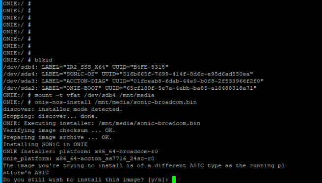
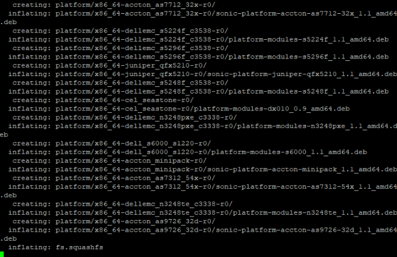
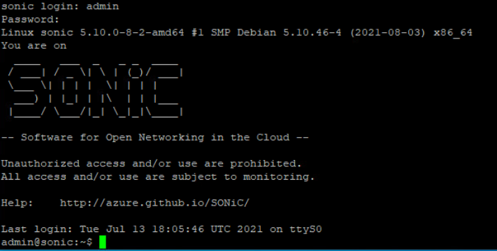
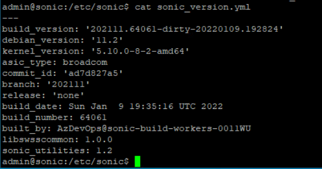
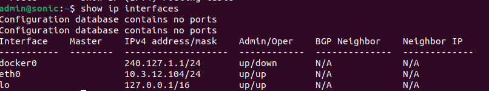
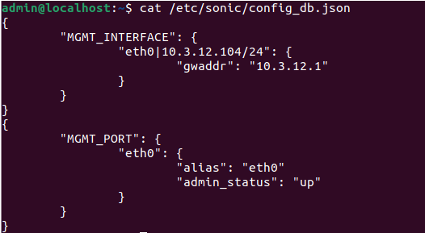
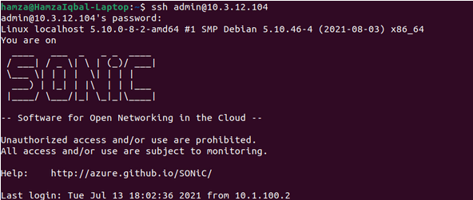
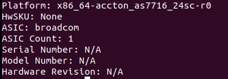

# SONiC OSPF Test Case HLD
>
>
>
## Revision History

[© xFlow Research Inc](https://xflowresearch.com/)  

|  Revision No| Description | Author  | Contributors |Date |  
| :-------------: |:-------------:| :-----:|:----------:|:-----:|
|1.0| Installation and Testing of SONiC on Edgecore AS7716-24SC| [Muhammad Hamza Iqbal](https://github.com/ham-xa)| [Hafiz Mati ur Rehman](https://github.com/Mati86)  & [Arsalan Ahmad](https://github.com/ahmadarsalan/)| 25 Feb 2022|
>
## Table of Contents

- Scope
- Overview
- Introduction
  - Installing SONiC on AS7716-24SC
  - Configuring SONiC
  - Configuring Management Interface
- SAI API
- Configuration and Management
- Warm Boot and Fastboot Design Impact
- Restrictions/Limitations
- Testing Requirements/Design
  - System test cases
>
## Scope

This document includes SONiC installation and testing on Edgecore AS7716-24SC aka Cassini.

## Overview

This document illustrates the installation and basic configurations of SONiC on Edgecore AS7716-24SC. No SONiC submodules will be added or modified.

## Introduction

When we look at the Supported devices of SONiC, we see a lot of familiar devices that have inbuilt Open Network Installation Environment installed in them. The Cassini is a 1.5 RU form factor with a system throughput of 3.2 Tbps based on Broadcom StrataXGS™ Tomahawk™Plus switch silicon. The Cassini design offers sixteen fixed 100 Gigabit Ethernet QSFP28 ports, plus eight line-card slots to incorporate a flexible mix of additional 200 GbE ports or DCO optical ports based on coherent Digital Signal Processor (DSP) and optical transceivers from leading optical technology partners.

Edgecode AS7716-24SC has the Open Network Install Environment (ONIE) software installer pre-loaded on the switch, but no switch software image. ONIE supports the installation of compatible Network Operating System (NOS) soſtware, including the open-source plus commercial NOS offerings.

## Installing SONiC on AS7716-24SC

1. Take a USB and format it with FAT32 file system
2. Copy the downloaded image on the USB
3. Attach the USB to the micro USB port at the front panel of the Cassini using an OTG converter
4. Connect the RJ-45 side of the console cable to the console port located underneath the 12th port at the panel.
5. Connect the other end of the console cable with the DB-9 port of the PC
6. Choose the serial option in putty and set the baud rate to 115200
7. You will be able to get access to the ONIE which is preinstalled on the Cassini for assisting the installation of the Network Operating System.
8. Enter the following command to stop the ONIE discovery process and to avoid unnecessary messages on the screen.
____ONIE:/ # onie-discovery-stop____
9. Enter the following command to create a USB mount location on the system
____ONIE:/ # mkdir /mnt/media____

10. Validate the specific file path for the USB drive on the switch with the ____blkid____command.
____ONIE:/ # blkid____

  
____*Figure 1: SONiC Installation*____

  
____*Figure 2: SONiC Installation*____

11. Enter the following command to mount the USB. The vfat option is used for FAT32 formatted drives.
____ONIE:/ # mount -t vfat /dev/sdb1 /mnt/media____

12. Don’t forget to change the device number in the above command
13. Install the software from the USB drive, where /mnt/media specifies the path where the USB partition is mounted.
____ONIE:/#onie-nos-install /mnt/media/sonic-broadcom.bin____
14. This will install the SONiC in your Cassini and reboot
15. You will now be able to login to the ONL default username is admin and password is YourPaSsWoRd
16. Congratulation you are all done with the installation of the SONiC on Cassini
>
  
____*Figure 3: SONiC Login*____

You can check the version of SONiC installed by printing the file sonic_version.yml.
>
  
____*Figure 4: SONiC version check*____

## Configuring SONiC

### Configuring Management Interface

To configure the management interface you can either use the command
____sudo config interface ip add eth0 10.3.12.104/24 10.3.12.1____

Another method to configure is changing the config_db.json file located in the /etc/sonic/. This file can be used to configure the other interfaces as well.
>
  
____*Figure 5: Checking Ip Addresses*____

This can be checked from the config_db.json file.
>
  
____*Figure 6: Config_DB*____

## SAI API

No SAI changes are required for this feature.

## Configuration and Management

No configuration and management changes are required for this feature.

## Warm Boot and Fastboot Design Impact

This feature does not have any dependencies or impacts on warm boot/fast boot.

## Restrictions/Limitations

This feature only applies to Edgecore AS7716-24SC.

## Testing Requirements/Design

### System test cases

This IP addressing can be verified by using the ssh or SCP.
>
____ssh admin@10.3.12.104____
>
  
____*Figure 7: SSH SONiC*____
>
____This test was performed on the actual hardware.____

### Platform Confirmation

After running the command one can easily see that SONiC does recognize the Edgecore AS7716-24SC.
>
  
____*Figure 8: Platform Confirmation*____
