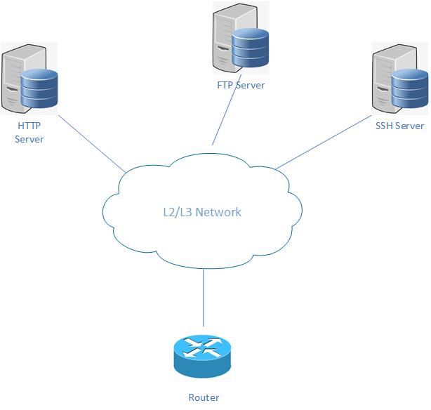
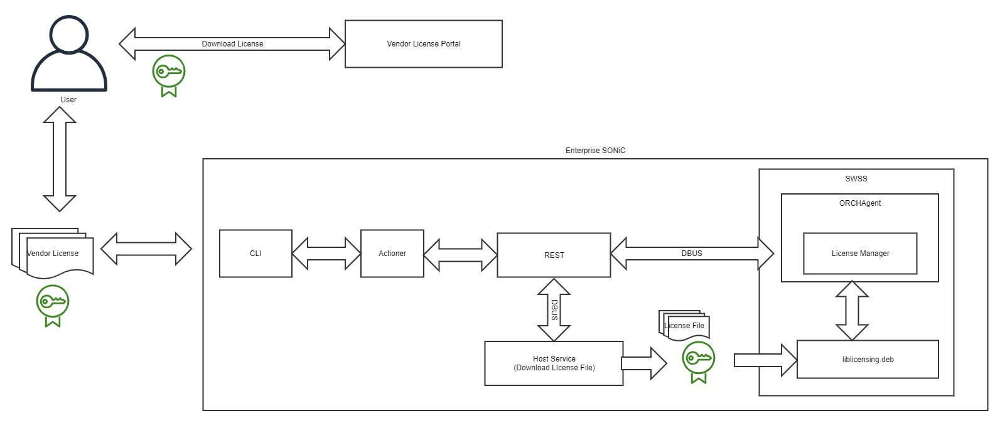
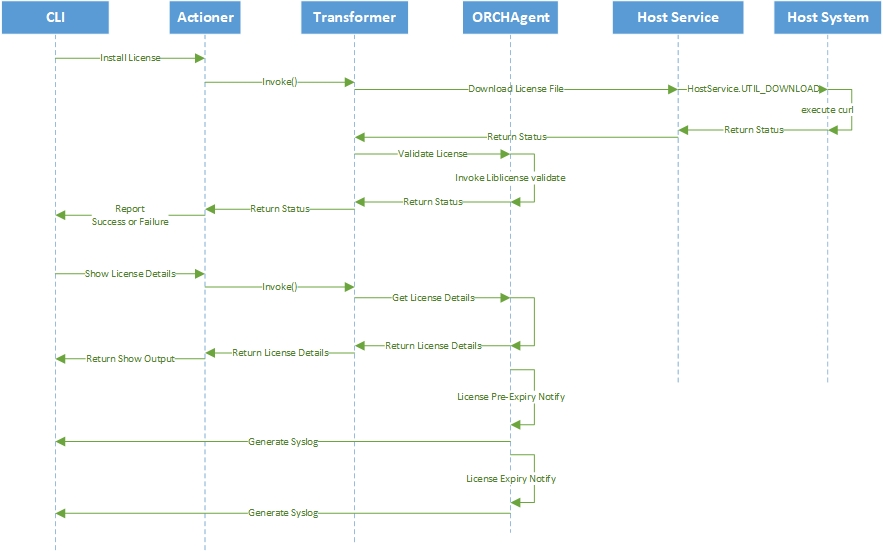

# License Management Framework


# High Level Design Document
# Table of Contents

<!-- TOC depthFrom:1 depthTo:6 withLinks:1 updateOnSave:1 orderedList:0 -->

- [License Management Framework](#license-management-framework)
- [High Level Design Document](#high-level-design-document)
- [Table of Contents](#table-of-contents)
- [List of Tables](#list-of-tables)
- [Revision](#revision)
- [About this Manual](#about-this-manual)
- [Definition/Abbreviation](#definition-abbreviation)
    + [Table 1: Abbreviations](#table-1--abbreviations)
- [1 Feature Overview](#1-feature-overview)
  * [1.1 Target Deployment Use Cases](#11-target-deployment-use-cases)
  * [1.2 Requirements](#12-requirements)
  * [1.3 Design Overview](#13-design-overview)
    + [1.3.1 Basic Approach](#131-basic-approach)
    + [1.3.2 Container](#132-container)
- [2 Functionality](#2-functionality)
- [3 Design](#3-design)
  * [3.1 Overview](#31-overview)
    + [3.1.1 User](#311-user)
    + [3.1.2 CLI/REST](#312-cli-rest)
    + [3.1.3 License Manager](#313-license-manager)
    + [3.1.4 liblicense](#314-liblicense)
    + [3.1.1 Service and Docker Management](#311-service-and-docker-management)
    + [3.1.2 Packet Handling](#312-packet-handling)
  * [3.2 DB Changes](#32-db-changes)
  * [3.4 User Interface](#34-user-interface)
    + [3.4.1 Data Models](#341-data-models)
    + [3.4.2 CLI](#342-cli)
      - [3.4.2.1 Show Commands](#3421-show-commands)
      - [3.4.2.2 Exec Commands](#3422-exec-commands)
    + [3.4.3 REST API Support](#343-rest-api-support)
    + [3.4.4 gNMI Support](#344-gnmi-support)
  * [3.5 Upgrade and Downgrade Considerations](#35-upgrade-and-downgrade-considerations)
- [4 Flow Diagrams](#4-flow-diagrams)
- [5 Serviceability and Debug](#5-serviceability-and-debug)
- [6 Platform](#6-platform)
- [7 Security and Threat Model](#7-security-and-threat-model)
- [8 Certificates, secrets, keys, and passwords](#8-certificates--secrets--keys--and-passwords)
- [9 Testing](#9-testing)
- [10 SONiC Packaging - BRCM Requirement](#10-sonic-packaging---brcm-requirement)
- [11 Design Alternatives](#11-design-alternatives)

<!-- /TOC -->

# List of Tables
[Table 1: Abbreviations](#table-1-Abbreviations)

# Revision
| Rev |     Date    |       Author       | Change Description                |
|:---:|:-----------:|:------------------:|-----------------------------------|
| 0.1 | 06/21/2022  |   Joyas Joseph          | Initial version                   |
| 0.2 | 07/27/2022  |   Reemus Vincent        | Draft version                     |

# About this Manual
This document provides comprehensive functional and design information about the License Management Framework feature implementation in SONiC.

# Definition/Abbreviation

### Table 1: Abbreviations
| **Term**                 | **Meaning**                         |
|--------------------------|-------------------------------------|
| OpenHW                   | Running Enterprise SONiC by Dell Technologies on platforms that are not Dell|
| DDL                      | Dell Digital Locker |
| OrchAgent                | Orchestrator Agent |
| SWSS                     | SWitch State Service |
| .deb                     | a software package used by the Debian Linux distribution |


# 1 Feature Overview

This document is to detail the process of how License Management will function on Enterprise SONiC.

Today, Enterprise SONiC does not implement licensing. It is based on an honor system, where the system runs with no expiration date and it does not check that it is running on a validated system. When we move to OpenHW, this will need to be verified and checked that Enterprise SONiC is running on the device that it is intended for.

This document will detail how the Licensing Framework will be implemented on Enterprise SONiC and OpenHW and detail the operations of how license management will work on Dell and Non-Dell platforms.

## 1.1 Target Deployment Use Cases

The License Management will validate the customer's license having Enterprise SONiC and OpenHW switches.
  1. Users download their entitled license from the Dell License Portal - DDL (Dell Digital Locker)
  2. Install their entitled licenses into the switches using any local or remote http/ssh/ftp servers

## 1.2 Requirements

1. Enterprise SONiC will support License Management to verify that the customers are entitled to Enterprise SONiC for the duration term.
2. Enterprise SONiC will leverage a subscription based licensing model.
3. Typical duration of the licenses are 1 year, 3 years and 5 years, however the implementation must be flexible to support other terms.
4. The framework should be flexible enough to have licensing enabled or disabled based on the vendor. 
	1. Licensing should be enabled for the Dell branded Enterprise SONiC images.
5. The license will be generated at the time of sale.
6. The license is tied to the hardware based on the Service Tag or Serial Number and the type of the image - Enterprise Standard, Cloud Standard, Enterprise Premium etc.
	1. License for one image type when installed on another image type will be treated as an invalid license. 
7. User should be able to install a license on the switch.
8. ~~User should be able to install a license when upgrading from an older version.~~
9. ~~Upgrade from an older version should fail when license file is not present.~~
10. Installing a license key will require users to accept the Dell EULA.  The acceptance of the EULA must be registered in a non-repudiation manner, and must survive across reboots and upgrades, not ONIE installations/uninstallations
11. When the license is about to expire (90 days)
	* 	An alert will appear when user logs in to the switch
	* 	An alert will be logged indicating the license is about to expire
12. After the license expires
	* 	An alert will appear when user logs in to the switch
	* 	An alert will be logged every 24 hours indicating the license has expired
13. The license should be stores such a way to avoid unintentional deletion.
14. The license should be preserved across reboots and SW upgrades.
15. ~~Devise a method to avoid customers who backdate the switch from making an expired license valid again.~~
16. User should not be able to disable the license feature.
17. User should not be able to modify the license to make it valid for another switch or image type.

## 1.3 Design Overview

SONiC License Management will add the functionality to verify, install and validate the Dell-issued software licenses for the Enterprise SONiC.

  * License Verification - Will use Digital Signature to verify whether the installed license is issued by Dell (Vendor)
  * Install License - Store the license persistently on the switch
  * License Validation - Periodically check the installed license for expiry
  * Users will also be alerted when the installed license nears expiry.
  * An alert message will be generated periodically when license expires.
  * The login Banner will be displayed indicating the license expiry when User login into the switch. The message will be appended to the existing login banner.

### 1.3.1 Basic Approach

With this functionality users will be able install Dell Enterprise SONiC license for the switch from their home directory or any of the remote file servers using FTP, SSH & HTTP.



### 1.3.2 Container

No new container is added. The details of the changes will be discussed in the Design section below.

# 2 Functionality

With the Software License Management, users will be able to:
  1. Install Dell Enterprise SONiC License in the switch
  2. View the details of installed Dell Enterprise SONiC License in the switch

# 3 Design

## 3.1 Overview

The Software License Management Framework will provide users to install the eSONiC License in the switch.



__Figure 1: Enterprise SONiC License Management__

### 3.1.1 User
  * Only Admin Role users will be able install the license in the switch.
  * User will login into the DDL and download the license files they are entitled to.
  * They can either copy the license directly into the switch or they can store the license in any file servers like FTP, HTTP & SSH.
  * User will be allowed to install the license file stored locally or remote using the license file URL.
  * Users can either use the CLI "license install <filename/URL>" or the equivalent REST API.
  * While using the CLI to install license, users will be prompted an EULA. And the license will be installed only when the user accepts the EULA.

### 3.1.2 CLI/REST
  * The CLI/REST API will validate the syntax and the URL of the license file before passing the same to the OrchAgent in running in the SWSS docker.
  * The CLI/REST API will use the DBUS interface to interact with the License Manager(Task/Thread) in OrchAgent in SWSS Docker
  * The license file will be downloaded and stored in the "/etc/licenses/<license filename>"

### 3.1.3 License Manager
  * The main functionality of the License Management Feature will be implemented in 2 Parts - licmgr & liblicense
  * The licmgr(License Manager) will run as thread in the existing OrchAgent.
  * The licmgr will invoke the liblicense API to validate the license file("/etc/sonic/licenses/<license filename>")
  * The license file directory will be mounted as a volume(/etc/sonic) in OrchAgent docker.
  * The licmgr will use DBUS interface to expose the API to be called from the CLI/REST API.
  * The licmgr will also verify the existing license(installed previously) after the bootup.
    * If there is no existing license - a periodic alert message will be generated for the users to install a valid SONiC License.
	* If the license file exists and is invalid/expired - a periodic alert message will be generated for the users to install a valid SONiC License.
	* If the license file exists and is valid - the licmgr will compute the expiry datetime.
	  * If the expiry datetime is less than 90 days - a periodic alert message will be generated for the users to renew the license
  * The licmgr will maintain an AppDB 

### 3.1.4 liblicense
   * The liblicense will be implemented as a shared library and will be packaged into a .deb package file
   * The Validation of the Dell License will be done the APIs implemented in liblicense
   * The liblicense library will package the Dell license validation functions
   * It will be available as a .deb package for the Enterprise SONiC Image
   * Also, a stub liblicense with API stub API implementation will also be available
   * BRCM's rebranding will replace the stub liblicensing with the Dell liblicensing .deb package

### 3.1.1 Service and Docker Management
  * Separate license manager is added as task(thread) inside the existing ORCHAgent

### 3.1.2 Packet Handling
NA

## 3.2 DB Changes

Following new table will be added to State DB. Unless otherwise stated, the attributes are mandatory. LIC_MGR_TABLE is used for some of the show commands associated with this feature:

```
LIC_MGR_TABLE | {
    "LicenseInfo": {
        "LicenseEnabled" : {{True|False}},
        "SoftwareType" : {{Software Type}},
        "LicenseStatus" : {{License Status}},
        "LicenseType" : {{License Type}},
        "StartDate" : {{License Start Date}},
        "LicenseTerm" : {{License Term}},
        "LicenseFile" : {{License Filepath}},
    }
}

```

## 3.4 User Interface

### 3.4.1 Data Models

License Management
```
module: openconfig-license-mgmt-private
  +--rw license-show
     +--rw config
        +--rw license-enabled?    boolean
        +--rw software-type?      string
        +--rw license-status?     string
        +--rw license-type?       string
        +--rw start-date?         oc-yang:date-and-time
        +--rw license-duration?   string
        +--rw license-location?   string

```

```
  rpcs:
    +---x license-install
       +---w input
       |  +---w filename?   license-file-uri-type
       +--ro output
          +--ro status?          int32
          +--ro status-detail?   string
```

### 3.4.2 CLI

#### 3.4.2.1 Show Commands

**Syntax:**
```

	sonic# show license status
	System Information
	---------------------------------------------------------
	Vendor Name          :   Dell EMC
	Product Name         :   Generic
	Platform Name        :   x86_64-dellemc_s5248f_c3538-r0
	Service Tag          :   J3XD9Z2
	License Details
	----------------
	Software License    :    ENTERPRISE-SONiC-PREMIUM
	Version             :    4.1
	License Status      :    Installed - 120 day(s) left
	License Type        :    SUBSCRIPTION
	License Start Date  :    2022-08-02T16:08:35Z
	License Duration    :    120 days
	License location    :    /etc/license/2W6RY03.lic
	---------------------------------------------------------
	sonic#
```

The "show license detail" command will display the sytem and the currently installed license details.

#### 3.4.2.2 Exec Commands

**Syntax:**
```
    sonic# license install <license-file>
	<<EULA>>
	Accept [Y/n]:
```

| **Alias Name** | **Format**                                                             | **Description**                                                              |
|----------------|------------------------------------------------------------------------|-------------------------------------------------------------------------------|
| home:          | home://<<filename>>   | License file path in the user's HOME directory |
| ftp:           | ftp://[username [:password]@]{hostname\|host-ip}/directory/[filename]   | License file path in FTP server. |
| http:          | http://[username [:password]@]{hostname\|host-ip}/directory/[filename]  | License file path in HTTP server. |
| scp:           | scp://[username [:password]@]{hostname\|host-ip}/directory/[filename]    | License file path in Secure Shell(SSH) server. |


Only Admin Role users will be able to install the license in the switch.

### 3.4.3 REST API Support

SONiC REST URI

/restconf/operations/openconfig-licmgmt:license-install
/restconf/operations/openconfig-licmgmt:license-show

### 3.4.4 gNMI Support

License Management will not support gNMI Subscription.

## 3.5 Upgrade and Downgrade Considerations

The installed license must be stored in the persistent/config partition which is not erased during upgrade or downgrade of the switch. 

# 4 Flow Diagrams

The following diagram illustrates the Callflow for the License Management Feature:



# 5 Serviceability and Debug
  * Debug functionality using log messages will be incorprated within the License Manager

# 6 Platform
  * All Dell SONiC Supported Platforms
  * Dell OpenHW Platforms

# 7 Security and Threat Model
  * License Management Framework will use Digital Signature to validate the Dell Licenses.


## 8 Certificates, secrets, keys, and passwords
  * SONiC License Management will use self-signed certificate (a digital certificate not signed by any publicly trusted Certificate Authority (CA)).

## 9 Testing

  * Install a valid license and check whether the license is getting installed.
  * Install a valid license with Start Date future to the Current Date and check whether the license is getting installed.
  * Install an expired license and check whether the license is getting rejected.
  * Install a valid license with short term (about to expire - 1 or 2 days) license and check whether the license is getting installed and gets expired in the due date.
  * Install a valid license with short term (about to expire - less than 90 days) license and check whether the license is getting installed and alert message for license about to expiry message is getting generated.
  * Install an invalid license(with different Service Tag/Product Serial No.) and check whether the license is getting rejected.
  * Call "show license details" command to check the current license details installed/expired in the switch.
  * Check whether the CLIs are masked when Non-Dell Image(with stub liblicense) is loaded in the switch.


## 10 SONiC Packaging - BRCM Requirement

This section will describe the details of the liblicensing deb packing procedure for the Enterprise SONiC:

  * "sonic-licensing" directory will be added to the eSONiC sonic-buildimage repo
    * It will contain a stub implementation of the license manager with the stub license validation APIs
  * Dell will be maintaining a separate "sonic-licensing" repo which will be used to build the "liblicensing" deb package
    * It will contain the actual implementation of the license manager with the Dell license validation APIs using Digital Signatures
    * It will be compiled separately and the deb package will be stored in the Dell Artifactory URL
  * When compiling eSONiC the stub implementation will be compiled and packaged with the image
  * During Broadcom Rebranding the stub liblicensing deb package should be replaced with the Dell implementation of the liblicensing deb package that is retrieved from the Dell Artifactory URL

## 11 Design Alternatives

  * An alternative approach to implement License Manager is have a seprate process (daemon) running independant of OrchAgent
     * This approach is not preferred as malicous users might turn off the Licensing Framework from working by killing the daemon

