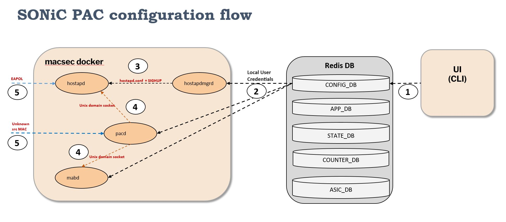

# Local Authentication Feature extension to PAC #1315

# Table of Contents
- **[List of Tables](#list-of-tables)**
- **[Revision](#revision)**
- **[About this Manual](#about-this-manual)**
- **[Definitions and Abbreviations](#definitions-and-abbreviations)**
- **[1 Feature Overview](#1-feature-overview)**
  - [1.1 Local Authentication](#11-Local-Authentication)
  - [1.2 Requirements](#12-requirements)
    - [1.2.1 Functional Requirements](#121-functional-requirements)
    - [1.2.2 Configuration and Management Requirements](#122-configuration-and-management-requirements)
    - [1.2.3 Scalability Requirements](#123-scalability-requirements)
  - [1.3 Design Overview](#13-design-overview)
    - [1.3.1 Configuration of user databases in hostapd](#131-Configuration-of-user-databases-in-hostapd)
    - [1.3.2 lauthmgrd](#132-lauthmgrd)
    - [1.3.3 SAI Support](#132-sai-support)
- **[2 Functionality](#2-functionality)**
  - [2.1 Target Deployment Use Cases](#21-target-deployment-use-cases)
  - [2.2 Functional Description](#22-functional-description)
    - [2.2.1 Local Authentication support for 802.1x Client](#221-Local-Authnetication-support-for-802.1x-Client)
    - [2.2.2 Local Authentication support for MAC Authentication Bypass](#222-Local-Authentication-support-for-MAC-Authentication-Bypass)
    - [2.2.2 Warmboot](#222-warmboot)
- **[3 Design](#3-design)**
  - [3.1 Overview](#31-overview)
    - [3.1.1 Configuration flow for lauthmgrd to update hostapd user database for local authentication](#311-Configuration-flow-for-lauthmgrd-to-update-hostapd-user-database-for-local-authentication)
    - [3.1.2 MAB Local Authentication Flow Diagram](#312-MAB-Local-Authentication-Flow-Diagram)
  - [3.2 DB Changes due to inclusion of local Authentication module](#32-DB-Changes-due-to-inclusion-of-local-authentication-module)
    - [3.2.1 Config DB](#321-config-db)
    - [3.2.2 App DB](#322-app-db)
    - [3.2.3 ASIC DB](#323-asic-db)
    - [3.2.4 Counter DB](#324-counter-db)
    - [3.2.5 State DB](#325-state-db)
  - [3.4 SyncD](#34-syncd)
  - [3.5 SAI](#35-sai)
  - [3.6 Manageability](#36-manageability)
    - [3.6.1 Yang Model](#361-yang-model)
    - [3.6.2 Configuration Commands](#362-configuration-commands)
    - [3.6.3 Show Commands](#363-show-commands)
- **[4 Scalability](#4-scalability)**
- **[5 Appendix: Sample configuration](#5-appendix-sample-configuration)**
- **[6 Future Enhancements](#6-future-enhancements)**

# List of Tables
[Table 1 Abbreviations](#table-1-abbreviations)

# Revision
| Rev  | Date       | Author                                   | Change Description |
| ---- | ---------- | ---------------------------------------- | ------------------ |
| 0.1  | 27/08/2023 | Kishor Kulkarni, Keerthi Kumar Thovi |
| Initial version    |


# About this Manual

This document describes the design details of the Local authentication feature as an extention to SONIC feature #1315 - Port Access Control in SONiC. 


# Definitions and Abbreviations

| **Term**      | **Meaning**                              |
| ------------- | ---------------------------------------- |
| Authenticator | An entity that enforces authentication on a port before allowing access to services available on that port |
| CoPP          | Control Plane Policing                   |
| 802.1x        | IEEE 802.1x standard                     |
| EAPoL         | Extensible Authentication Protocol over LAN |
| MAB           | MAC Authentication Bypass                |
| PAC           | Port Access Control                      |
| PAE           | Port Access Entity                       |
| RADIUS        | Remote Authentication Dial In User service |
| Supplicant    | A client that attempts to access services offered by the Authenticator |
| AAA           | Authentication, Authorization, Accounting |

# 1 Feature Overview

## 1.1 Local Authentication
As described in HLD #1315 Port Access Control (PAC) provides a means of preventing unauthorized access by users to the services offered by a Network. 

An entity "Authenticator: described in HLD #1315 interacts with Local Authentication Module to Authorise end users whenever authentication type is configured for "'local'".

.

## 1.2 Requirements

### 1.2.1 Functional Requirements

***Local Authentication***   
The following are the requirements for Local Authentication feature as part of Port Access Control feature:
1. Local authentication should be globally configurable
2. Local authentication can be configured per port
3. Local authentication module should return result of Authorisation i.e. 
  - Authorised or "Not Authorised"
  - A VLAN associated with the Authorised Client
  - Session timeout value

***802.1x***   

Local authentication shall be supported for Clients supporting 802.1.x protocol.

***MAB***   

Local authentication shall be supported for Clients that do not support 802.1x.

### 1.2.2 Configuration and Management Requirements
Local Authentication as an extension to PAC should support configuration using CLI and JSON based input.

List of configuration shall include the following:   

### 1.2.3 Scalability Requirements
16 authenticated clients per port with a maximum of 128 authenticated clients per switch should be supported.

## 1.3 Design Overview
### 1.3.1 Configuration of user databases in hostapd
The Local Authentication module allows user to add, remove & modify local authentication database of hostapd. This database contain username and password both in plain text and VLAN ID for authorisation.
### 1.3.2 lauthmgrd
This module allows end user to maintain local database of MAC addresses with VLAN ID and session timeout value. MAC addresses in this list provides the list of MAC addresses those are allowed for network Access.  This module provides VLAN ID associated with the specific MAC address.
### 1.3.3 SAI Support
No changes to SAI spec for supporting PAC.

# 2 Functionality

## 2.1 Target Deployment Use Cases

The following figure illustrates how clients like PCs and printers are locally authenticated and authorized for accessing the network.   

The following figure illustrates how clients like PCs and printers are authenticated and authorized for accessing the network.   


**Figure 1 : PAC target deployment use cases using Local authentication**   

## 2.2 Functional Description

PAC uses authentication methods 802.1x and MAB for client authentication. These methods in turn use Local Authentication for client credential verification and receives the authorization attributes like VLANs, for the authenticated clients. 

### 2.2.1 Local Authentication support for 802.1x Client

PAC leverages the IEEE 802.1X-2004 for 802.1x standard as available in the "hostapd" implementation in the "macsec" docker.  
In case the Authentication server like Radius is not reachable or user explicitly configures Local Authentication then client get Authenticated using Local authentication.

### 2.2.2 Local Authentication support for MAC Authentication Bypass

PAC makes use of MAC Authentication Bypass (MAB) feature to authenticate devices like cameras or printers which do not support 802.1x. MAB makes use of the device MAC address to authenticate the client. If user configures/enables Local Authentication then device mac addresses are verified against local database. If the client MAC address is present in the local database then Local Auth Module returns Authorisation success along with VLAN ID. Then the client is allowed network access in the specific VLAN. 

### 2.2.3 Warmboot

After a Warm Boot, the authenticated client sessions are torn down and they need to authenticate again.

# 3 Design

## 3.1 Overview


[Figure 2](#Local-Authentication-Flow) 
Above figure shows the high level design overview of local authentication for both use cases i.e. clients supporting 802.1x and clients not supporting 802.1.x (in this case authentication shall be based on client MAC address).

Local Authentication is composed of multiple sub-modules. 

1. lauthmgrd: This is the hostapd manager module. It listens to Local authentiation user specific configurations from CONFIG_DB and translates them to respective hostapd.conf file config entries and commands to hostapd. 

2. mablauthmgr: This is a thread which is a part of pacd and connects to CONFIG_DB. This module which is integrated in pacd as an extensible module. API of this module shall be invoked by pacd to authenticate/authorise clients using MAC database locally maintained by mablauthmgr. 

### 3.1.1 Configuration flow for lauthmgrd to update hostapd user database for local authentication
Below figure explains the flow for local authentication for clients supporting 802.1x.

[Figure 2](#Local-Authentication-Flow-For-802.1x-clients) 

1. Mgmt interfaces like CLI write the user provided configuration to CONFIG_DB. This configuration involves user credentials addition along with 
2. The lauthmgrd, mablauthmgr gets notified about their respective configurations.
3. lauthmgrd interacts with hostapd to update user database. hostapd uses user database to authenticate client if the local authentication is the configured authentication method.
4. mablauthmgr module provides API to the external word. These APIs takes MAC address of client as an input and returns Authorisation status i.e. pass/fail, Session-Timeout and VLAN ID associated with client. 
mablauthmgr connects to Redisdb to access local MAC table to check if Client MAC address is present in the database or not?


### 3.1.2 MAB Local Authentication Flow Diagram


1. Unknown source MAC packets are received by hardware on a front panel interface and trapped to CPU. The packets gets delivered to a pacd socket.
2. pacd sends a "Client Authenticate" message along with the received packet MAC to mabd.
3. mabd interacts with mablauthmgr module to authenticate the given client based on the MAC.
4. On successful authentication of a client, mabd sends an "Client Authenticated" message to pacd with all the authorization parameters like VLAN, Session-Timeout, etc.
5. All other tasks are completed in sequence as defined in HLD #1315.

## 3.2 DB Changes due to inclusion of local authentication module

### 3.2.1 Config DB

**PAC_PORT_CONFIG**   
```   
"PAC_PORT_CONFIG": {
  "Ethernet1": {
    "method_list": [
      "dot1x",
      "mab"
    ],
    "priority_list": [
      "dot1x",
      "mab"
    ],
    "port_pae_role": "authenticator",
    "port_control_mode": "auto",
    "host_control_mode": "multi_auth",
    "reauth_period": 60,
    "reauth_enable": "true",
    "max_users_per_port": 16,
  }
}


key                       =      PAC_PORT_CONFIG:port     ;Physical port
     
;field                    =      value
     
method_list               =      "dot1x"/"mab"                  ;List of methods to be used for authentication
     
priority_list             =      "dot1x"/"mab"                  ;Relative priority of methods to be used for authentication
     
port_pae_role             =      "none"/"authenticator"         ;"none": PAC is disabled on the port
                                                                "authenticator": PAC is enabled on the port

port_control_mode         =      "auto"/"force_authorized"/     ;"auto": authentication enforced on port
                                "force_unauthorized" ;          "force_authorized": authentication not enforced on port
                                                                "force_unauthorized": authentication not enforced on port but port is blocked for all traffic
     
host_control_mode         =      "multi-host"/                  ;"multi-host": One data client can be authenticated on the port. Rest of the
                                "multi-auth"/"single-auth"      clients tailgate once the first client is authenticated.
                                                                "multi-auth": Multiple data client and one voice client can be authenticated on the port.
                                                                "single-auth": One data client or one voice client can be authenticated on the port.
     
reauth_period             =      1*10DIGIT                      ;The initial value of the timer that defines the period after which the will
                                                                 reauthenticate the Supplicant. Range is 1 - 65535 seconds.

reauth_enable             =     "true"/"false"                  ;Indicates whether Reauthentication is enabled on the port.
     
max_users_per_port        =     1*2DIGIT                        ;Maximum number of clients that can be authenticated on the port. This is applicable
                                                                 only for "multi-auth" host mode. Range is 1 - 16 clients.

```

**HOSTAPD_GLOBAL_CONFIG**   
```
"HOSTAPD_GLOBAL_CONFIG": {
  "global": {
    "dot1x_system_auth_control": "enable"
  }
}


;field = value 
dot1x_system_auth_control "true"/"false" ; Indicates whether 802.1x is enabled in the system.
```

**MAB_PORT_CONFIG**   
```   
"PAC_PORT_CONFIG": {
  "Ethernet1": {
    "mab": "enable",
    "mab_auth_type": "eap-md5",
  }
}


key                       =      PAC_PORT_CONFIG:port     ;Physical port
     
;field                    =      value
     
mab                       =      "enable"/"disable"              ;Indicates whether MAB is enabled on the port.
     
mab_auth_type             =      "eap-md5"/"pap"/"chap'          ;MAB authentication type

```
**Local Authentication User Table**   
```  
container HOSTAPD_USER_CONFIG {
  description
    "Container for hostapd user config";
       list HOSTAPD_USER_CONFIG_LIST {
         key "username";
           leaf username {
              type string {
                length 1..32;
                  }
                }
              leaf password {
                 type string { 
                   length 1..255;
                   }
                 }
               leaf auth_type {
                 type auth_type_enumeration;
                   default "eap-md5";
                 }
               leaf vlan_id {
                 type uint16 {
                 range "1..4094";
                   }
                 }
               leaf session_timeout {
                 type uint32;
                 }
             }
          }
       }

```

### 3.2.2 App DB

None

### 3.2.3 ASIC DB

None

### 3.2.4 Counter DB

None


### 3.2.5 State DB

None

## 3.3 SyncD

No specific changes are needed in syncd for PAC.

## 3.4 SAI

None

## 3.5 Host interface traps

None


## 3.7 Manageability

### 3.7.1 Yang Model
File: sonic-hostapd.yang
module sonic-hostapd {
 namespace http://github.com/sonic-net/sonic-hostapd;
 prefix shostapd;
 yang-version 1.1;

 description
 "SONiC HOSTAPD";

 revision 2023-08-29 {
   description "Addition of HOSTAPD_USER_CONFIG to the yang module";
 }

 revision 2023-08-02 {
   description "Initial revision.";
 }
 
 typedef auth_type_enumeration {
   type enumeration {
   enum eap-md5 {
   description
   "Configure EAP-MD5 auth type for MAB.";
   }

   enum pap {
     description
     "Configure PAP auth type for MAB.";
   }

   enum chap {
     description
     "Configure CHAP auth type for MAB.";
   }
 }
 container sonic-hostapd {
   description "HOSTAPD top level container.";

 container HOSTAPD_GLOBAL_CONFIG {
   description
   "Container for hostapd global config.";

   list HOSTAPD_GLOBAL_CONFIG_LIST {
     key "global";
     leaf global {
       type enumeration {
       enum GLOBAL;
       }
       description
       "Configure dot1x/hostapd global configuration.";
     }
     leaf dot1x_system_auth_control {
       type boolean;
       description
       "Indicates whether dot1x/hostapd is enabled/disabled on the switch.";
     }
   }
 }

 container HOSTAPD_USER_CONFIG {
   description
     "Container for hostapd user config";
   list HOSTAPD_USER_CONFIG_LIST {
     key "username";
     leaf username {
       type string {
       length 1..32;
       }
     }
     leaf password {
       type string {
       length 1..255;
       }
     }
     leaf auth_type {
       type auth_type_enumeration;
       default "eap-md5";
     }
     leaf vlan_id {
       type uint16 {
       range "1..4094";
       }
     }
     leaf session_timeout {
       type uint32;
     }
   }
 } 
}
}

File: sonic-pac.yang
module sonic-pac {
  namespace http://github.com/sonic-net/sonic-pac;
  prefix spac;
  yang-version 1.1;

  import sonic-port {
    prefix prt;
  }

  import sonic-types {
    prefix stypes;
  }

  import ietf-yang-types {
    prefix yang;
  }
 
  description
    "SONiC PAC";

  revision 2023-08-31 {
    description "Updated revision.";
  }

  revision 2023-03-28 {
    description "Initial revision.";
  }

  typedef port_mode_enumeration {
    type enumeration {
    enum auto {
      description
        "Enable auto port control mode on a port.";
    }

    enum force-authorized {
      description
        "Enable force authorized port control mode on a port.";
    }

    enum force-unauthorized {
      description
        "Enable force unauthorized port control mode on a port.";
    }
  }
 }

 typedef host_mode_enumeration {
    type enumeration {
      enum single-host {
        description
          "One data client or one voice client can be authenticated on the port.";
      }

      enum multi-auth {
        description
          "Multiple data client and one voice client can be authenticated on the port.";
      }

      enum multi-host {
        description
          "One data client can be authenticated on the port. Rest of the
           clients tailgate once the first client is authenticated.";
      }
    }
 }

 typedef auth_order_enumeration {
   type enumeration {
     enum dot1x {
     description
       "Configure authmgr authentication order as dot1x";
     }

     enum mab {
       description
         "Configure authmgr authentication order as mab";
     }
   }
 }

 typedef user_auth_order_enumeration {
   type enumeration {
     enum remote {
       description "Configure authmgr authentication order as remote";
     }

     enum local {
       description "Configure authmgr authentication order as local";
     }
   }
 }

 typedef auth_priority_enumeration {
   type enumeration {
     enum dot1x {
       description
         "Configure authmgr authentication priority as dot1x";
     }

     enum mab {
       description
         "Configure authmgr authentication priority as mab";
     }
   }
 }

 typedef port_role_enumeration {
   type enumeration {
     enum authenticator {
       description
         "Allows config of dot1x port's pae role as authenticator.";
     }

     enum none {
       description
         "Allows config of dot1x port's pae role as none.";
     }
   }
 }

 typedef auth_type_enumeration {
   type enumeration {
     enum eap-md5 {
       description
         "Configure EAP-MD5 auth type for MAB.";
     }

     enum pap {
       description
         "Configure PAP auth type for MAB.";
     }

     enum chap {
       description
         "Configure CHAP auth type for MAB.";
     }
   }
 }

 typedef AccessType {
   type enumeration {
     enum allow;
     enum deny;
   }
 }

 container sonic-pac {
   description 
     "pac top level container.";

   container PAC_PORT_CONFIG {
     description
     "Container for port config table.";

     list PAC_PORT_CONFIG_TABLE_LIST {
       key "port";
       leaf port {
         type leafref {
           path "/prt:sonic-port/prt:PORT/prt:PORT_LIST/prt:name";
         }
         description
           "Name of the interface on which PAC configuration gets applied.";
       }

       leaf port_control_mode {
         type port_mode_enumeration;
           description
             "Determines whether or not to enforce authentication on an interface.";
        }

        leaf host_control_mode {
           type host_mode_enumeration;
           description
             "Allow for single or multiple hosts to communicate through
              a PAC controlled port.";
         }

        leaf reauth_enable {
          type boolean;
            description
              "Indicates whether Reauthentication is enabled on
               the port.";
        }

        leaf reauth_period {
          type uint32 {
            range 1..65535 {
              error-message "reauth period value must be in range of 1-65535.";
              error-app-tag reauth-period-invalid;
            }
          }
          units seconds;
          description
            "The value of the timer that defines the period
            after which the Authenticator will reauthenticate the Supplicant.";
        }

        leaf max_users_per_port {
          type uint8 {
            range 1..48 {
              error-message "max users per port value must be in range of 1-48.";
              error-app-tag max-users-per-port-invalid;
            }
          }
          description
            "Maximum number of clients that can be authenticated
             on the port. This is applicable only for multi-auth host mode.";
        }

        leaf-list method_list {
          type auth_order_enumeration;
          description
            "Enables configuration of authmgr authentication methods order.";
        }

        leaf-list priority_list {
          type auth_priority_enumeration;
          description
            "Enables configuration of authmgr authentication methods priority.";
        }

        leaf port_pae_role {
          type port_role_enumeration;
          description
            "Enables configuration of dot1x port's pae role.
            Note: Enabling PAC on the port will revert all switchport configurations on the
                  port, if port control mode is auto/force-unauthorized and port pae role is
                  authenticator.";
        }
    }
 }

 container MAB_PORT_CONFIG {

   list MAB_PORT_CONFIG_TABLE_LIST {
     key "port";
     leaf port {
     type leafref {
       path "/prt:sonic-port/prt:PORT/prt:PORT_LIST/prt:name";
     }
     description
       "Name of the interface on which mab gets applied.";
     }
     leaf mab {
       type boolean;
       description
         "Enable mab on the interface.";
     }
     leaf mab_auth_type {
       type auth_type_enumeration;
         description
           "MAB authentication type.";
     }
   }
 }

 container MAB_USER_CONFIG {
   list MAC_ADDRESS {
     key "mac";
       description "MAB client configuration";
     leaf mac {
       type yang:mac-address;
         description "MAC address of the MAB client";
     }
     leaf access-type {
       type AccessType;
         default "allow";
         description "Access type for the MAB client";
     }
     leaf vlan-id {
       type uint32 {
       range "1..4094";
       }
       description "VLAN ID associated with the authorized client";
     }
     leaf session-timeout {
       type uint32;
       description "Client session timeout in seconds";
     }
   }
 }

 container PAC_GLOBAL_CONFIG {
   description "PAC global configuration.";

 container global {
   description "Global PAC configuration.";
   leaf-list auth_order_list {
     type user_auth_order_enumeration;
     description "Order list of authentication mechanisms used by PAC.";
   }
 }
 }
 }
}
### 3.7.2 Configuration Commands

The following commands are used to configure Local Authentication.  


### 3.7.3 Show Commands

Need to be added

# 4 Scalability

No Impact


# 5 Appendix: Sample configuration

need to be added


# 6 Future Enhancements

None
