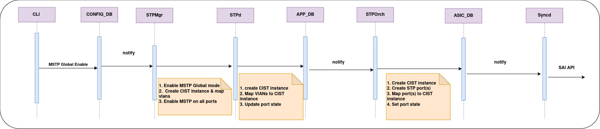
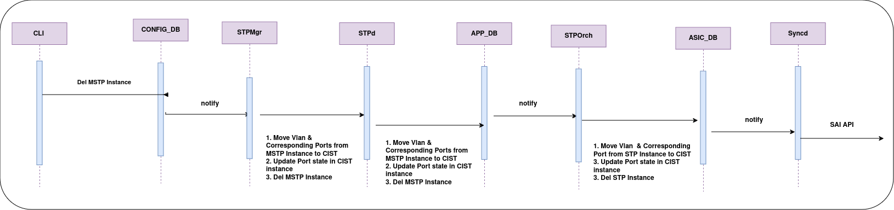

[© Broadcom](https://www.broadcom.com/) & [© xFlow Research Inc](https://xflowresearch.com/) 

# Multiple Spanning Tree Protocol


## Revision History

|Revision No.|Description|Author|Date|
| :- | :- | :- | :- |
|0.1|Modified Design| [Divya Kumaran Chandralekha](https://github.com/divyachandralekha) , [Rida Hanif](github.com/ridahanif96) , [Wajahat Razi](https://github.com/wajahatrazi) | July 02, 2024|

# Table of Contents

* [Scope](#scope)
* [Background](#background)
* [Abbreviations](#abbreviations)
* [Overview](#overview)
* [Introduction](#introduction)
* [Requirements](#requirements)
* [Architecture Design](#architecture-design)
  - [STP Container](#stp-container)
  - [SWSS Container](#swss-container)
  - [CoPP Configurations](#copp-configurations)
* [Database Changes](#database-changes)
  - [CONFIG DB](#config-db)
  - [APP DB](#app-db)
* [SAI](#sai)
* [Additional Features](#additional-features)
* [Sequence Diagrams](#sequence-diagrams)
  - [MSTP global enable](#mstp-global-enable)
  - [MSTP global disable](#mstp-global-disable)
  - [MSTP region name/version change](#mstp-region-nameversion-change)
  - [Instance creation](#instance-creation)
  - [Instance deletion](#instance-deletion)
  - [MSTP Instance creation](#mstp-Instance-Creation)
  - [MSTP Instance deletion](#mstp-Instance-Deletion)
  - [Add VLAN to Exisiting Instance](#add-vlan-existing)
  - [Delete VLAN to Exisiting Instance](#delete-vlan-existing)
  - [Add VLAN member](#add-vlan-member)
  - [Del VLAN member](#del-vlan-member)
* [Configuration Commands](#configuration-commands)
  - [Global Level](#global-level)
  - [Region Level](#region-level)
  - [Instance, Interface Level](#instance-interface-level)
  - [Show Commands](#show-commands)
  - [Clear Commands](#clear-commands)
  - [Debug Commands](#debug-commands)
  - [Disabled Commands](#disabled-commands)
* [YANG Model](#yang-model)
* [Rest API Support](#rest-api-support)
* [Warm Boot](#warm-boot)
* [Testing Requirements](#testing-requirements)
  - [Unit test cases](#unit-test-cases)
* [References](#references)

# Scope
This document describes the High Level Design of Multiple Spanning Tree Protocol.

# Abbreviations

|**Term**|**Meaning**|
| :- | :- |
|BPDU|Bridge Protocol Data Unit|
|CIST|Common Internal Spanning Tree|
|CST|Common Spanning Tree|
|IST|Internal Spanning Tree|
|MSTI|Multiple Spanning Tree Instance|
|MSTID|Multiple Spanning Tree Identifier|
|MSTP|Multiple Spanning Tree Protocol|
|STP|Spanning Tree Protocol|
|VLAN|Virtual Local Area Network|
|VID|VLAN identifier|

# Overview
Multiple Spanning Tree Protocol (MSTP) enhances the Spanning Tree Protocol (STP) by enabling the creation of multiple spanning tree instances within a network. It provides a mechanism to map VLANs to specific spanning tree instances which offers network segmentation and improved control over traffic flow.

# Introduction

Spanning Tree Protocol (STP) is a network protocol that operates at the Data Link layer (Layer 2) of the OSI model. Its primary purpose is to prevent loops in a Local Area Network (LAN). Network loops can cause broadcast storms and multiple frame copies, leading to network inefficiencies and failures. STP ensures a loop-free topology by creating a spanning tree that selectively blocks some network paths. 

Multiple Spanning Tree Protocol (MSTP), standardized in IEEE 802.1s, is an extension of STP. MSTP enhances STP by providing better loop prevention, path redundancy, and optimal bandwidth utilization. MSTP allows network engineers to create multiple spanning trees, each associated with a set of VLANs, and assign them to different switch ports. This configuration optimizes bandwidth usage, reduces convergence time, and simplifies network management. 

 

MSTP reduces convergence time compared to STP. When a network topology change occurs, only the affected MSTI needs to reconverge, minimizing the impact on the entire network. 


# Understanding MSTP: IST, CIST, MSTIs, MST Regions, Vlan to MSTI mapping 


1. Default Internal Spanning Tree (IST): An internal spanning tree (IST) is a spanning tree that runs in an MST region. It is also called MSTI 0, a special MSTI to which all VLANs are mapped by default. 

1. Common and Internal Spanning Tree (CIST): The common and internal spanning tree (CIST) is a single spanning tree that connects all devices in a switched network. It consists of the ISTs in all MST regions and the CST. 

1. Common Spanning Tree (CST): The common spanning tree (CST) is a single spanning tree that connects all MST regions in a switched network.

1. MST Instances (MSTIs): MSTP divides the network into multiple regions, each containing several MSTIs. Each MSTI operates independently, allowing for efficient use of network resources and optimized load balancing across different VLANs.
1.  MST Regions:  An MST region is a group of interconnected bridges that share the same MST configuration, including the MST configuration name, revision number, and VLAN-to-instance mappings
1. VLAN-to-MSTI Mapping: MSTP maps VLANs to specific MSTIs using a VLAN mapping table. This mapping ensures that traffic within a VLAN follows the corresponding MSTI, optimizing the network path and improving performance. 
1.  Optimized Bandwidth: By mapping VLANs to specific MSTIs, MSTP ensures that network paths are used efficiently, reducing link blocking and optimizing bandwidth usage
 
#### MSTP Operation 

MST BPDUs: MSTP uses Multiple Spanning Tree Bridge Protocol Data Units (MST BPDUs) to exchange information between switches. These BPDUs contain information about the MSTI and VLAN mappings, ensuring consistent spanning tree calculations across the network. 

MSTP calculates spanning trees on the basis of Multiple Spanning Tree Bridge Protocol Data Units (MST BPDUs).

<div align="center">

<p>MSTP BPDU Format</p>
</div><br>
<div align="center">

<p>MSTI Configuration Messages</p>
</div>

*Refer to [RFC IEEE 802.1s-2002](https://standards.ieee.org/ieee/802.1s/1042/) for MSTP BPDU details.* 


### Requirements 


#### Functional Requirements 

1. Support the creation of Multiple Spanning Tree Instances (MSTIs). 
1. Support the assignment of one or more VLANs to a specific MSTI within a region. 

1. Support the option to assign a region name and revision number to MSTP regions to achieve unique identification of VLAN to instance mapping across switches. 

1. Support path selection and forwarding behavior in MSTI to optimize network performance within each instance by configuring a distinct root bridge. 

1. Support the configuration of spanning tree parameters such as forward delay, hello timer, hop count. 

1. The Destination Mac Address will be 01:80:C2:00:00:00 for MSTP BPDUs. 

1. Support compatibility with networks employing different spanning tree protocols, such as STP, RSTP. 

1. Support edge port functionality 

1. Support BPDU guard functionality 

1. Support root guard functionality 

1. Support protocol operation on static breakout ports 

1. Support protocol operation on Port-channel interfaces 

 
#### Configuration & Management Requirements 


1. Support CLI configurations as mentioned in Configuration section 

1. Support show commands as mentioned in Configuration section 

1. Support debug commands as mentioned in Configuration section 

1. Support statistics commands as mentioned in Configuration section 

1. Support clear commands as mentioned in Configuration section 

1. Support disable commands as mentioned in Configuration section 

# Architecture Design
Following diagram explains the architectural design and linkages for MSTP. MSTP uses multiple existing SONiC containers, configuration details of each is mentioned below as well.


## STP Container
STP Container is responsible for actions taken for BPDU rx and BPDU tx. Following are the details for implementation:

### STPMgr
Subscribes to CONFIG_DB and STATE_DB tables, parsing configurations and passes to STPd.

### STPd
Responsible for all MST protocol related calculations. BPDUs are sent and received in STPd and states are updated accordingly.

### STPSync
STPSync is a component integrated within STPd responsible for managing and updating all operational STP data to APP DB. 

Stpd communicates with Linux Kernal for The BPDU reception/transmission, management of port or LAG changes via NetLink events, and synchronization of STP port states with the Linux Kernel.  

## SWSS Container

SWSS Container is responsible for passing on configurations to SAI as follows:

### STPOrch
Updates SAI via following APIs:

1. Creating/deleting instances 
2. Assigning VLAN to instance 
3. Creation of STP Port and assigning port state with respect to each instance 
4. Flushing FDB entries 

There are no changes in PortOrch.


# Database Changes
MSTP design introduces some new tables for configuration along with slight modification in existing STP tables. Following are details of each individual table:

## CONFIG DB

### Existing Table
Following existing table of CONFIG_DB will be modified for MSTP implementation:

#### STP_GLOBAL_TABLE
A new value of `mst` for `mode` column
```
mode 		  = "pvst" / "mst"      ; a new option for mstp
```
Other fields of this table are not applicable for "mstp" mode.

### New Tables
Following new tables will be added to CONFIG_DB:


#### STP_MST
```
;Stores STP Global configuration
key                       = STP_MST| GLOBAL               ; GLOBAL MSTP table key 
name                      = 1*32CHAR                      ; MSTP region name(DEF:mac address of switch)
revision                  = 5*DIGIT                       ; MSTP revision number (0 o 65535 ,DEF:0)
max_hop                   = 2*DIGIT                       ; maximum hops (1 to 40, DEF:20)   
max_age                   = 2*DIGIT                       ; maximum age time in secs (6 to 40sec, DEF:20sec)
hello_time                = 2*DIGIT                       ; hello time in secs (1 to 10sec, DEF:2sec)
forward_delay             = 2*DIGIT                       ; forward_delay in secs (4 to 30sec, DEF:15 sec)
```

#### STP_MST_INST
```
;Stores STP configurations per MSTI
key                 = STP_MST| "MST_INSTANCE":"Instance" id   ; MST with prefix "STP_MST"
bridge_priority     = 5*DIGIT                                 ; bridge priority (0 to 61440, DEF: 32768)
vlan_list           = "Vlans"                                 ; Lists of VLANs assigned to the MST instance
```

#### STP_MST_PORT 

```
;Stores STP interface details per MSTI
key                 = STP_MST_PORT| "MST_INSTANCE" id|ifname    ; MSTI+Intf with prefix "STP_MST_PORT"
path_cost           = 9*DIGIT                                   ; port path cost (1 to 20000000)
priority            = 3*DIGIT                                   ; port priority (0 to 240, DEF:128)

```

#### STP_PORT

```
;Stores STP interface details
key                 = STP_PORT|ifname              ; ifname with prefix STP_PORT
edge_port           = BIT                          ; enabled or disabled
link_type           = "type"                       ; type can be of auto, point-to-point or shared
enabled             = BIT                          ; enabled or disabled
bpdu_guard          = BIT                          ; enabled or disabled
bpdu_guard_do       = BIT                          ; enabled or disabled 
enabled             = BIT                          ; enabled or disabled
root_guard          = BIT                          ; enabled or disabled 
path_cost           = 9*DIGIT                      ; port path cost (1 to 20000000)
priority            = 3*DIGIT                      ; port priority (0 to 240, DEF:128)

```


## APP DB

### New Tables
Following new tables are introduced as part of MSTP Feature:


#### STP_MST_INST_TABLE
```
;Stores the STP per  MSTI operational details
key                       = _STP_MST_INST_TABLE:"MST" id  
vlan_list                 = vlan_id-or-range[,vlan_id-or-range]       ; list of VLAN IDs assigned to MST instance
bridge_address            = 16HEXDIG                                  ; bridge id
regional_root_address     = 16HEXDIG                                  ; regional root bridge id
root_address              = 16HEXDIG                                  ; root bridge id
root_path_cost            = 1*9DIGIT                                  ; root path cost
regional_root_cost        = 1*9DIGIT                                  ; regional root path cost
root_max_age              = 1*2DIGIT                                  ; Max age of root bridge (6 to 40 sec, DEF:20sec)
root_hello_time           = 1*2DIGIT                                  ; Hello time of root bridge (1 to 10 sec, DEF:2sec)
root_forward_delay        = 1*2DIGIT                                  ; forward delay of root bridge (4 to 30sec , DEF:15sec)
remining_hops             = 1*2DIGIT                                  ; Remaining Max-hops
root_port                 = ifName                                    ; Root port name
```

#### STP_MST_PORT_TABLE
```
;Stores STP MST instance interface details
key                 = _STP_MST_PORT_TABLE:"MST":id:ifname    ; MSTI+Intf with prefix "STP_MST_PORT
port_number         = 1*3DIGIT                               ; port number or bridge port 
path_cost           = 1*9DIGIT                               ; port path cost (1 to 200000000)
priority            = 3*DIGIT                                ; port priority (0 to 240, DEF:128)
port_state          = "state"                                ; DISABLED/DISCARDED/LISTENING/LEARNING/FORWARDING
role                = "role"                                 ; DESIGNATED/ROOT/ALTERNATIVE/MASTER 
desig_cost          = 1*9DIGIT                               ; designated cost
external_cost       = 1*9DIGIT                               ; designated cost
desig_root          = 16HEXDIG                               ; designated root
desig_reg_cost      = 16HEXDIG                               ; designated root
desig_bridge  	    = 16HEXDIG                               ; designated bridge
desig_port    	    = 1*9DIGIT                               ; designated port
fwd_transitions     = 1*5DIGIT                               ; number of forward transitions
bpdu_sent           = 1*10DIGIT                              ; bpdu transmitted
bpdu_received       = 1*10DIGIT                              ; bpdu received
```

#### STP_PORT_TABLE
```
;Stores STP interface detail
key                 = _STP_PORT_TABLE:ifname    ; ifname with prefix STP_INTF
edge_port           = BIT                       ; edge port  enabled or disabled
link_type           = "type"                    ; point-to-point or shared link type
mst_boundary        = BIT                       ; enabled or disabled
mst_boundary_proto  = BIT                       ; enabled or disabled
```

#### STP_INST_PORT_FLUSH_TABLE 

```
;Defines instance and port for which FDB Flush needs to be performed
key                 = _STP_INST_PORT_FLUSH_TABLE:instane:ifname         ; FDB Flush instance id and port
name           
state               = "true"                                            
```

### Existing Tables
Following already present APP_DB tables are also used for implementation of MSTP:

#### STP_PORT_STATE_TABLE 
The table holds the state of a port i.e forwarding, learning, blocking with respect to each instance.
#### STP_VLAN_INSTANCE_TABLE 
The table holds the VLAN to instance mapping.

# SAI

## Existing SAI Attributes
Following table shows the existing SAI Attributes that will be used:

|**Component**|**SAI Attribute**|
| :- | :- |
|STP Instance|SAI_STP_ATTR_VLAN_LIST
||SAI_STP_ATTR_BRIDGE_ID|
||SAI_STP_ATTR_PORT_LIST|
|STP Port|SAI_STP_PORT_ATTR_STP |
||SAI_STP_PORT_ATTR_BRIDGE_PORT|
||SAI_STP_PORT_ATTR_STATE|
|STP Port States|SAI_STP_PORT_STATE_LEARNING|
||SAI_STP_PORT_STATE_FORWARDING|
||SAI_STP_PORT_STATE_BLOCKING|
|VLAN STP Instance|SAI_VLAN_ATTR_STP_INSTANCE|
|Switch STP Attributes|SAI_SWITCH_ATTR_DEFAULT_STP_INST_ID|
||SAI_SWITCH_ATTR_MAX_STP_INSTANCE|

## New SAI Attributes
MSTP design will not require any new SAI Attributes for Control Packet trap. We will use the existing traps as DMAC and LLC fields are identical for STP and MSTP

# Additional Features

## BPDU Guard
BPDU guard feature will also be supported by MSTP. BPDU Guard feature disables the connected device ability to initiate or participate in STP on edge ports. When STP BPDUs are received on the port where BPDU guard is enabled the port will be shutdown. User can re-enable the port administratively after ensuring the BPDUs have stopped coming on the port.


## Root Guard
Root guard feature will also be supported by MSTP. 

The Root Guard feature provides a way to enforce the root bridge placement in the network and allows STP to interoperate with user network bridges while still maintaining the bridged network topology that the administrator requires. When BPDUs are received on a root guard enabled port, the STP state will be moved to "Root inconsistent" state to indicate this condition. Once the port stops receiving superior BPDUs, Root Guard will automatically set the port back to a FORWARDING state.

## Edge Port
Edge ports immediately transition to the forwarding state upon activation and do not participate in STP topology calculations. 


## Uplink Fast
MSTP standard does not support uplink fast so uplink fast functionality will be disable for MSTP.


#  Sequence Diagrams
## MSTP global enable




## MSTP global disable


## MSTP region name/version change


## Instance Creation 


## Instance Deletion 


## MSTP Instance Creation 


## MSTP Instance Deletion 


## Add VLAN to Exisiting Instance


## Del VLAN from  Exisiting Instance


## Add VLAN member


## Del VLAN member


# Configuration Commands
Following configuration commands will be provided for configuration of MSTP:
## Global Level
- **config spanning_tree {enable|disable} {mst}**
  - Enables or disables mstp at global level on all ports of the switch.
  - Only one mode of STP can be enabled at a time.
  - By default disabled.
    
- **config spanning_tree mst max_hops \<max-hops-value\>**
  - Specify the number of maximum hops before the BPDU is discarded inside a region.
  - max-hops-value: Default: 20, range: 1-255

- **config spanning_tree mst hello \<hello-value\>**
  - Specify configuring hello interval in sec for transmission of BPDUs. 
  - Default: 2, range 1-10 

- **config spanning_tree mst max_age \<max_age-value\>**
  - Specify configuring maximum time to listen for root bridge in seconds.
  - Default: 2, range 6-40


## Region Level
Below commands allow configuring on region basis:

- **config spanning_tree mst region-name \<region-name\>**
  - Edit the name of region
  - region-name: Case sensitive, characters should be less than or equal to 32, default: mac-address of bridge
- **config spanning-tree mst revision \<revision-number\>**
  - Revision number is used to track changes in the configuration and to synchronize the configuration across the switches in the same region.
  - revision-number: Default: 0, range: 0-65535

## Instance Level

Below commands allow configuration of an instance:

- **config spanning_tree mst instance \<instance-id\> priority \<priority-value\>** 
  - Configure priority of bridge for an instance.
  - instance-id: id of the instance for which bridge priority is to be defined. If the provided instance id is not created yet, an error message is displayed.
  - priority-value: Default: 32768, range: 0-61440 (should be multiple of 4096)
- **config spanning_tree mst instance \<instance-id\> vlan (add|del)  \<vlan-id\>**
  - VLAN to instance mapping.
  - instance-id: id of the instance to which VLAN is to be mapped. If the provided instance id is not created yet, an error message is displayed.
  - vlan-id: Range: 1-4094. If the provided VLAN is not created yet, an error message is displayed.
  - Instance is only active when there is at least one VLAN member port configured for one of the mapped VLANs.

## Instance, Interface Level
Following commands are used for spanning-tree configurations on per instance, per interface basis:

- **config spanning_tree mst instance  \<instance-id\> interface \<ifname\> priority \<priority-value\>**
  - Configure priority of an interface for an instance.
  - priority-value: Default: 128, range: 0-240
- **config spanning_tree mst instance \<instance-id\> interface \<ifname\> cost \<cost-value\>**
  - Configure path cost of an interface for an instance.
  - cost-value: Range: 1-200000000

## Interface Level
Following new commands will be added:

- **config spanning_tree interface \<ifname\> {enable|disable}**
  - Configure an interface for MSTP.


- **config spanning_tree interface \<ifname\> edgeport {enable|disable}**
  - This command allow enabling or disabling of edge port on an interface.

- **config spanning_tree interface \<ifname\> guard {root|bpdu} {enable|disable}**  
  - Configure an interface as a root or bpdu guard.  

- **config spanning_tree interface \<ifname\> priority \<port_priority-value\>**
  - Specify configuring the port level priority for root bridge in seconds.
  - Default: 128, range 0-240  

- **config spanning_tree interface \<ifname\> cost \<cost-value\>**
  - Specify configuring the port level priority for root bridge in seconds.
  - Default: 0, range 1-200000000

- **config spanning_tree interface \<ifname\> link-type {P2P|Shared-Lan|Auto}**
  - Specify configuring the interface at different link types.
 
## Show Commands

- show spanning_tree mst

    The output of this command will be as follows for `mstp`:
```
Spanning-tree Mode: MSTP
#######  MST0        Vlans mapped : 1, 4-8, 202-4094
Bridge               Address 8000.80a2.3526.0c5e
Root                 Address 8000.80a2.3526.0c5e
                     Port     Root                  Path cost 0 
Regional Root        Address  8000.80a2.3526.0c5e
                     Internal cost 0                Rem hops 20 
Operational          Hello Time  2, Forward Delay 15, Max Age 20, Txholdcount 6
Configured           Hello Time  2, Forward Delay 15, Max Age 20, Max Hops 20

Interface           Role        State           Cost       Prio.Nbr    Type
---------------    --------     ----------      -------    ---------   -----------
Ethernet20         DESIGNATED   FORWARDING     2000        128.25       P2P
Ethernet46         DESIGNATED   FORWARDING     800         128.86       P2P
PortChannel1001    DESIGNATED   FORWARDING     1000        128.45       P2P


#######  MST1       Vlans mapped : 2, 300, 400
Bridge               Address 8000.80a2.3526.0c5e
Root                 Address 8000.80a2.3526.0c5e
                     Port    Root            Path cost 0    Rem Hops 20

Interface           Role        State           Cost       Prio.Nbr     Type
---------------    --------     ----------      -------    ---------    -----------
Ethernet46         DESIGNATED   FORWARDING      800         128.86       P2P
PortChannel1001    DESIGNATED   FORWARDING      1000        128.45       P2P
```

- show spanning_tree  mst detail 

```

#######  MST0        Vlans mapped : 1, 4-8, 202-4094
Bridge               Address 8000.80a2.3526.0c5e
 Root                 Address 8000.80a2.3526.0c5e
                     Port    Root            Path cost 0    Rem Hops 20

Ethernet20 is DESIGNATED FORWARDING
Port info              port id 86 priority 128          cost 800
Designated             Address 8000.80a2.3526.0c5e      cost 0
Designated bridge      Address 8000.80a2.3526.0c5e      port id 25
Timers:  forward transitions 0
Bpdu send 80, received 0

Ethernet46 is DESIGNATED FORWARDING
Port info              port id 25 priority 128          cost 1000
Designated             Address 8000.80a2.3526.0c5e      cost 0
Designated bridge      Address 8000.80a2.3526.0c5e      port id 86
Timers:  forward transitions 0
Bpdu send 80, received 0

PortChannel1001 is DESIGNATED FORWARDING
Port info              port id 25 priority 128          cost 2000
Designated             Address 8000.80a2.3526.0c5e      cost 0
Designated bridge      Address 8000.80a2.3526.0c5e      port id 45
Timers:  forward transitions 0
Bpdu send 80, received 0

#######  MST1        Vlans mapped : 2, 300, 400
Bridge               Address 8000.80a2.3526.0c5e
 Root                 Address 8000.80a2.3526.0c5e
                     Port    Root            Path cost 0    Rem Hops 20

Ethernet46 is DESIGNATED FORWARDING
Port info              port id 85 priority 128          cost 2000
Designated             Address 8000.80a2.3526.0c5e      cost 0
Designated bridge      Address 8000.80a2.3526.0c5e      port id 86
Timers:  forward transitions 0
Bpdu send 80, received 0


PortChannel1001 is DESIGNATED FORWARDING
Port info              port id 25 priority 128          cost 2000
Designated             Address 8000.80a2.3526.0c5e      cost 0
Designated bridge      Address 8000.80a2.3526.0c5e      port id 45
Timers:  forward transitions 0
Bpdu send 80, received 0

```


- show spanning_tree  mst instance <instance-id>

```
show spanning_tree mst instance 0
#######  MST0        Vlans mapped : 1, 4-8, 202-4094
Bridge               Address 8000.80a2.3526.0c5e
Root                 Address 8000.80a2.3526.0c5e
                     Port     Root            Path cost 0 
Regional Root        Address  8000.80a2.3526.0c5e
                     Internal cost 0         Rem hops 20 
Operational          Hello Time  2, Forward Delay 15, Max Age 20, Txholdcount 6
Configured           Hello Time  2, Forward Delay 15, Max Age 20, Max Hops 20

Interface           Role        State           Cost       Prio.Nbr    Type
---------------    --------     ----------      -------    ---------   -----------
Ethernet20         DESIGNATED   FORWARDING     2000        128.25       P2P
Ethernet46         DESIGNATED   FORWARDING     800         128.86       P2P
PortChannel1001    DESIGNATED   FORWARDING     1000        128.45       P2P
```

- show spanning_tree  mst interface 

```
show spanning_tree mst interface  Ethernet46
Link Type: P2P        Bpdu filter: False
Boundary : internal   Bpdu guard:  False

Instance           Role        State           Cost       Prio.Nbr     Vlans 
---------------    --------     ----------      -------    ---------    -----------
0                  DESIGNATED   FORWARDING      800         128.86       1, 4-8, 202-4094
1                  DESIGNATED   FORWARDING      1000        128.45       2, 300, 400
```


- show spanning_tree mst bpdu_guard

```
PortNum               Shutdown Configured             Port Shut due to BPDU Guard
---------             --------------------           -----------------------------
Ethernet45             Yes                            Yes             
PortChannel1001        No                             NA
```

- show spanning_tree  mst instance \<instance-id\> interface \<ifname\>

```
Port        Prio Path Edge State      Role  Designated  Designated          Designated
Num         rity Cost Port                  Cost        Root                Bridge
Ethernet13  128  4    N    FORWARDING Root  0           32768002438eefbc3   32768002438eefbc3
```

### Statistics Commands
- show spanning_tree mst statistics instance \<instance-id\>
```
MSTP instance 0 - VLANs 10, 20, 30
--------------------------------------------------------------------
PortNum           BPDU Tx     BPDU Rx     TCN Tx     TCN Rx             
Ethernet13        10	      4           3          4
PortChannel15     20	      6           4          1
```


## Clear Commands
- sonic-clear spanning_tree mst statistics 
- sonic-clear spanning_tree mst statistics instance \<instance-id\>


## Debug Commands
Following debug commands will be supported for enabling additional logging which can be viewed in /var/log/stpd.log, orchagent related logs can be viewed in /var/log/syslog.

- debug spanning_tree mst instance \<instance-id\>
- debug spanning_tree mst bpdu [tx|rx]
- debug spanning_tree mst event
- debug spanning_tree mst verbose
- debug spanning_tree mst interface \<ifname\>


Following debug commands will be supported for displaying internal data structures

- debug spanning_tree mst dump instance \<instance-id\>

## Disabled Commands
Following commands are used to configure parameters at VLAN level and these commands are disabled if spanning-tree mode is `mstp`:


- config spanning_tree mst vlan (enable|disable) \<vlan\>
- config spanning_tree mst vlan forward_delay \<vlan\> \<fwd-delay-value\>
- config spanning_tree mst vlan hello \<vlan\> \<hello-value\>
- config spanning_tree mst vlan max_age \<vlan\> \<max-age-value\>
- config spanning_tree mst vlan priority \<vlan\> \<priority-value\>
- config spanning_tree mst vlan interface cost \<vlan\> \<ifname\> \<value\>
- config spanning_tree mst vlan interface priority \<vlan\> \<ifname\> \<value\>

# YANG Model

YANG Model will be extended as follows for MSTP:
```yang
module sonic-stp {

    yang-version 1.1;

    namespace "http://github.com/sonic-net/sonic-stp";
    prefix "stp";

    import sonic-port {
        prefix port;
        revision-date 2019-07-01;
    }

    import sonic-portchannel {
        prefix lag;
        revision-date 2021-06-13;
    }

    import sonic-vlan {
        prefix vlan;
        revision-date 2021-04-22;
    }

    import sonic-device_metadata { 
        prefix device_metadata;
        revision-date 2021-02-27;
    }

    description "STP yang Module for SONiC OS";

    revision 2023-04-18 {
        description "First Revision";
    }

    grouping interfaceAttr {
        leaf path_cost {
            type uint64 {
                range "1..200000000" {
                    error-message "Invalid Port Path Cost value.";
                }
            }
            default 200;
            description
                "The port's contribution, when it is the Root Port,
                to the Root Path Cost for the Bridge";
        }

        leaf priority {
            type uint8 {
                range "0..240" {
                    error-message "Invalid Port Priority value.";
                }
            }
            default 128;
            description
                "The manageable component of the Port Identifier,
                also known as the Port Priority";
        }
    }

    container sonic-stp {

        container STP_GLOBAL {
            description "Global STP table";

            leaf mode {
                type enumeration {
                    enum "pvst";
                    enum "mstp";
                }
                description "STP mode";
                default disable:
            }

            leaf forward_delay {
		must "../../../STP/STP_LIST[keyleaf='GLOBAL']/mode!='mst'" {
			error-message "Configuration not allowed in MST mode";
			error-app-tag stp-invalid;
		}
                type uint8 {
                    range "4..30" {
                        error-message "forward_delay value out of range";
                    }
                }
                default 15;
                description "Forward delay in sec";
            }

            leaf hello_time {
		must "../../../STP/STP_LIST[keyleaf='GLOBAL']/mode!='mst'" {
			error-message "Configuration not allowed in MST mode";
			error-app-tag stp-invalid;
		}
                type uint8 {
                    range "1..10" {
                        error-message "hello_time value out of range";
                    }
                }
                default 2;
                description "Hello time in sec";
            }

            leaf max_age {
		must "../../../STP/STP_LIST[keyleaf='GLOBAL']/mode!='mst'" {
			error-message "Configuration not allowed in MST mode";
			error-app-tag stp-invalid;
		}
                type uint8 {
                    range "6..40" {
                        error-message "max_age value out of range";
                    }
                }
                default 20;
                description "Max age";
            }

            leaf rootguard_timeout {
		must "../../../STP/STP_LIST[keyleaf='GLOBAL']/mode!='mst'" {
			error-message "Configuration not allowed in MST mode";
			error-app-tag stp-invalid;
		}
                type uint16 {
                    range "5..600" {
                        error-message "rootguard_timeout value out of range";
                    }
                }
                default 30;
                description "Root guard timeout in sec";
            }

            leaf priority {
		must "../../../STP/STP_LIST[keyleaf='GLOBAL']/mode!='mst'" {
			error-message "Configuration not allowed in MST mode";
			error-app-tag stp-invalid;
		}
                must ". mod 4096 = 0" {
                    error-message "bridge priority must be a multiple of 4096";
                }      

                type uint16 {
                    range "0..61440" {
                        error-message "priority value out of range";
                    }
                }
                default 32768;
                description "Bridge priority";
            }
        }

	container STP_MST {
	     	max-elements 1;
		key "keyleaf";
                sonic-ext:dependent-on "STP_LIST";

                leaf keyleaf {
                    type enumeration {
                        enum GLOBAL;
                    }
                    description
                        "Key node identifier. It's value is always GLOBAL";
                }

                leaf name {
                    must "../../../STP/STP_LIST[keyleaf='GLOBAL']/mode='mst'" {
                        error-message "Configuration allowed in MST mode";
                        error-app-tag stp-invalid;
                    }
                    type string {
			length "1..32";
		    }
                    description
                        "MST Region name";
                }

                leaf revision {
                    must "../../../STP/STP_LIST[keyleaf='GLOBAL']/mode='mst'" {
                        error-message "Configuration allowed in MST mode";
                        error-app-tag stp-invalid;
                    }
                    type uint16 {
                    range "0..65535" {
                        error-message "revision value out of range";
                    }
                }
                    description
                        "MST Revision number";
                }

                leaf max_hops {
                    must "../../../STP/STP_LIST[keyleaf='GLOBAL']/mode='mst'" {
                        error-message "Configuration allowed in MST mode";
                        error-app-tag stp-invalid;
                    }
                    type uint8 {
                    	range "1..255" {
                        	error-message "max-hops value out of range";
                    	}
		    }
                    default 20;
                    description
                        "MST Max hops";
                }

                leaf hello_time {
                    must "../../../STP/STP_LIST[keyleaf='GLOBAL']/mode='mst'" {
                        error-message "Configuration allowed in MST mode";
                        error-app-tag stp-invalid;
                    }
                    type uint8 {
                    	range "1..10" {
                        	error-message "hello_time value out of range";
                    	}
		    }
		    default 2;
                    description
                        "MST hello time";
                }

                leaf max_age {
                    must "../../../STP/STP_LIST[keyleaf='GLOBAL']/mode='mst'" {
                        error-message "Configuration allowed in MST mode";
                        error-app-tag stp-invalid;
                    }
                     type uint8 {
                    	range "6..40" {
                        	error-message "max_age value out of range";
                    	}
	            }
                    default 20;
                    description
                        "MST max age";
                }

                leaf forward_delay {
                    must "../../../STP/STP_LIST[keyleaf='GLOBAL']/mode='mst'" {
                        error-message "Configuration allowed in MST mode";
                        error-app-tag stp-invalid;
                    }
	            type uint8 {
                    	range "4..30" {
                        	error-message "forward_delay value out of range";
			}
                    }
                    default 15;
                    description
                        "MST forward delay";
                }
	 }
	 container STP_MST_INST {
            list STP_MST_INST_LIST {
                key "instance";

                leaf instance {
                    type uint16;
                    description
                        "Instance identifier";
                }

                leaf-list vlan {
                    type string;
                    description
                        "Vlan list";
                }

                leaf bridge_priority {
                    type uint16 {
                        range "0..61440" {
                            error-message "Invalid Bridge Priority value.";
                        }
                    }
                    default 32768;
                    description
                        "The manageable component of the Bridge Identifier";
                }
            }
        }

        container STP_MST_PORT {
            list STP_MST_PORT_LIST {
                key "inst_id ifname";

                leaf inst_id {
                    type leafref {
                        path "../../../STP_MST_INST/STP_MST_INST_LIST/instance";
                    }
                    description
                        "Reference to MST Instance";
                }

                leaf ifname {
                    type leafref {
                        path "../../../STP_PORT/STP_PORT_LIST/ifname";
                    }
                    description
                        "Reference to Ethernet interface or PortChannel";
                }
                uses interfaceAttr;
            }
        }

	list _STP_MST_INST_TABLE_LIST {
            sonic-ext:db-name "APPL_DB";
            key "inst_id";

            leaf inst_id {
                type leafref {
                     path "../../../STP_MST_INST/STP_MST_INST_LIST/instance";
                }
                description
                     "Reference to MST Instance";
            }

            leaf-list vlan {
                type string;
                description
                     "Vlan list";
            }

            leaf bridge_priority {
                type uint16;
                description
                      "The manageable component of the Bridge Identifier";
            }

            leaf root_priority {
                 type string;
                 description
                        "The manageable component of the Port Identifier";
            }

            leaf root_address {
                type string;
                description
                        "";
            }

            leaf root_cost {
                type string;
                description
                        "";
            }

            leaf root_port {
                type string;
                description
                        "";
            }

            leaf bridge_address {
                type string;
                description
                        "";
            }
        }
    }
}
```

# Rest API Support
Rest API is out of scope for this HLD.

# Warm Boot
Warm boot will not be supported. The IEEE 802.1s standard of MSTP does not define any potential way to support it as this might cause loops in the network. 

User is expected to do a cold reboot when MSTP is running. If a user tries to perform a warm boot while MSTP is enabled, an error message will be displayed. User will first need to disable MSTP so the topology converges and reevaluates the paths.

# Testing Requirements
## Unit test cases
### CLI test cases

1. Verify CLI to enable MSTP globally. 
1. Verify CLI to disable MSTP globally. 
1. Verify CLI to set MSTP region name. 
1. Verify CLI to set MSTP region revision. 
1. Verify CLI to set MSTP port priority 
1. Verify CLI to set MSTP hello-time 
1. Verify CLI to set MSTP cost-value 
1. Verify CLI to set MSTP max-hops 
1. Verify CLI to set MSTP root guard 
1. Verify CLI to set MSTP bpdu guard 
1. Verify CLI to set edgeport 
1. Verify CLI to create an instance. 
1. Verify CLI to delete an instance 
1. Verify CLI to clear MSTP region name. 
1. Verify CLI to clear MSTP region revision. 
1. Verify CLI to clear MSTP port priority 
1. Verify CLI to clear MSTP hello-time 
1. Verify CLI to clear MSTP cost-value 
1. Verify CLI to clear MSTP max-hops 
1. Verify CLI to clear MSTP root guard 
1. Verify CLI to clear MSTP bpdu guard 
1. Verify CLI to clear bridge priority in an instance. 
1. Verify CLI to map VLAN to an instance 
1. Verify CLI to delete VLAN from an instance. 
1. Verify CLI to set interface priority on a per instance basis. 
1. Verify CLI to set interface cost on a per instance basis. 
1. Verify CLI to display all information related to the region. 
1. Verify CLI to display information related to a specific instance. 
1. Verify CLI to display information about a specific interface in a specific instance. 
1. Verify CLI to display statistics. 
1. Verify CLI to display statistics on a per instance basis. 
1. Verify CLI to clear statistics. 
1. Verify CLI to clear statistics on a per instance basis. 
1. Verify CLI to clear statistics on a per interface per instance basis. 
1. Verify the commands that are disabled for MSTP mode 


### Functional Test Cases 

1. Verify CONFIG DB is populated with configured MSTP parameters. 
1. Verify MSTP instances running on multiple VLANs. 
1. Verify multiple VLANs can be mapped to a single instance. 
1. Verify VLAN to STP instance mapping is populated correctly in APP DB, ASIC DB, Hardware 
1. Verify instance STP ports are created for its VLAN members. 
1. Verify correct format of MSTP BPDU. 
1. Verify MSTP traps are created. 
1. Verify correct operation of CIST and MSTIs. 
1. Verify two bridges are in the same region only if they have the same region name, revision and instance to VLAN mapping. 
1. Verify the loop free topology inside and between regions. 
1. Verify the operational values of forward delay, max age, hello timer and max hops are of the CIST root. 
1. Verify FDB flush as a result of topology change. 
1. Verify instance is active only when there is at least one VLAN member of any of the VLANs that are mapped to it. 
1. Verify altering bridge priority can alter the selection of CIST root, regional root and MSTI root. 

1. Verify altering port priority can alter the selection of designated port. 
1. Verify max-hops by changing value. 

1. Verify hello-timer by changing timer values 

1. Verify max-age by changing intervals 

1. Verify altering bridge priority will alter Root Bridge selection 

1. Verify altering port priority will alter Root port selection 

1. Verify altering port priority will alter Designated port selection 

1. Verify altering port cost results in path with lowest root path cost is seleced as root port 

1. Verify port states on same physical interface 

1. Verify MSTP interoperability with STP, RSTP. 

1. Verify MSTP operational data is synced to APP DB and ASIC DB correctly. 

1. Verify MSTP over LAG. 

1. Verify MSTP over static breakout ports.

1. Verify BPDU Guard Activation on Ports.
   
1.  Verify BPDU Guard Port State Transition
   
1.  Verify BPDU Guard Recovery Mechanism
   
1. Verify BPDU Guard and MSTP Interaction
   
1. Verify MSTP Topology Changes Detection
   
1. Verify MSTP and VLAN Integration

1. Verify MSTP Path Cost Calculation
   
1. Verify MSTP Failover

### Logging and Debugging Test Cases 

1. Verify debugging logs for a region. 

1. Verify debugging logs for an instance. 

1. Verify debugging of internal data structure of region. 

1. Verify debugging of internal data structure of an instance. 

1. Verify debugging of internal data structure of a specific interface in an instance.  

### SAI 

1. Verify creation of STP instance. 

1. Verify adding VLAN to an instance. 

1. Verify deleting VLAN from an instance. 

1. Verify adding a port to an instance. 

1. Verify deleting port from an instance. 

1. Verify port state for different instances. 

### L3 

1. Verify normal flow of L3 traffic with the MSTP topology. 
