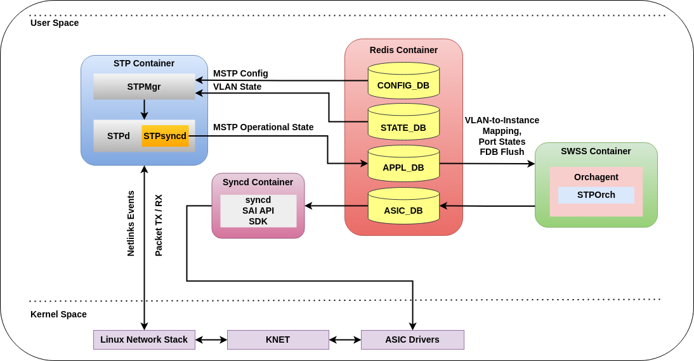
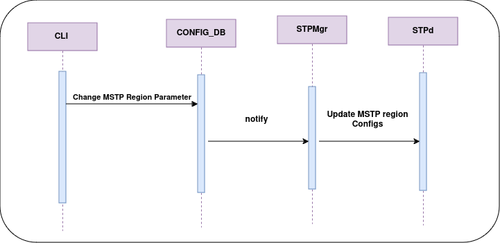
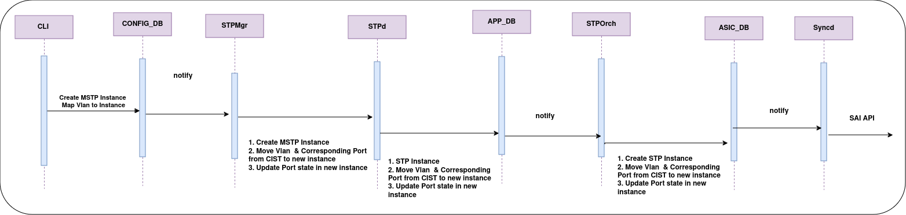
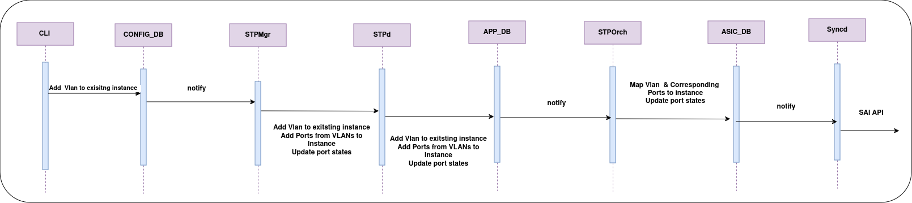
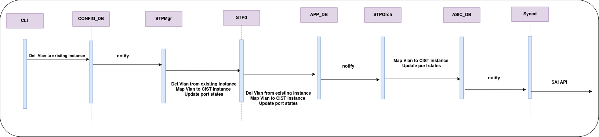

[© Broadcom](https://www.broadcom.com/) & [© xFlow Research Inc](https://xflowresearch.com/)

# Multiple Spanning Tree Protocol


## Revision History

|Revision No.|Description|Author|Date|
| :- | :- | :- | :- |
|0.1|Modified Design| [Divya Kumaran Chandralekha](https://github.com/divyachandralekha) , [Rida Hanif](github.com/ridahanif96) , [Wajahat Razi](https://github.com/wajahatrazi) | July 02, 2024|
|0.2|Improvised documentation| [Vinay Kumar Kayyur](https://github.com/vinaykumar-kayyur)  | Jan 02, 2025|

# Table of Contents

* [Scope](#scope)
* [Background](#background)
* [Abbreviations](#abbreviations)
* [Overview](#overview)
* [Introduction](#introduction)
* [Requirements](#requirements)
* [Architecture Design](#architecture-design)
  - [STP Container](#stp-container)
  - [SWSS Container](#swss-container)
* [Database Changes](#database-changes)
  - [CONFIG DB](#config-db)
  - [APP DB](#app-db)
* [SAI](#sai)
* [Additional Features](#additional-features)
* [Sequence Diagrams](#sequence-diagrams)
  - [MSTP global enable](#mstp-global-enable)
  - [MSTP global disable](#mstp-global-disable)
  - [MSTP region name/version change](#mstp-region-nameversion-change)
  - [Instance creation](#instance-creation)
  - [Instance deletion](#instance-deletion)
  - [MSTP Instance creation](#mstp-Instance-Creation)
  - [MSTP Instance deletion](#mstp-Instance-Deletion)
  - [Add VLAN to Exisiting Instance](#add-vlan-existing)
  - [Delete VLAN to Exisiting Instance](#delete-vlan-existing)
  - [Add VLAN member](#add-vlan-member)
  - [Del VLAN member](#del-vlan-member)
* [Configuration Commands](#configuration-commands)
  - [Global Level](#global-level)
  - [Region Level](#region-level)
  - [Instance, Interface Level](#instance-interface-level)
  - [Show Commands](#show-commands)
  - [Clear Commands](#clear-commands)
  - [Debug Commands](#debug-commands)
  - [Disabled Commands](#disabled-commands)
* [YANG Model](#yang-model)
* [Rest API Support](#rest-api-support)
* [Warm Boot](#warm-boot)
* [Testing Requirements](#testing-requirements)
  - [Unit test cases](#unit-test-cases)
* [References](#references)

# Scope
This document describes the High Level Design of Multiple Spanning Tree Protocol.

# Abbreviations

|**Term**|**Meaning**|
| :- | :- |
|BPDU|Bridge Protocol Data Unit|
|CIST|Common Internal Spanning Tree|
|CST|Common Spanning Tree|
|IST|Internal Spanning Tree|
|MSTI|Multiple Spanning Tree Instance|
|MSTID|Multiple Spanning Tree Identifier|
|MSTP|Multiple Spanning Tree Protocol|
|STP|Spanning Tree Protocol|
|VLAN|Virtual Local Area Network|
|VID|VLAN identifier|

# Overview
Multiple Spanning Tree Protocol (MSTP) enhances the Spanning Tree Protocol (STP) by enabling the creation of multiple spanning tree instances within a network. It provides a mechanism to map VLANs to specific spanning tree instances which offers network segmentation and improved control over traffic flow.

# Introduction

Spanning Tree Protocol (STP) is a network protocol that operates at the Data Link layer (Layer 2) of the OSI model. Its primary purpose is to prevent loops in a Local Area Network (LAN). Network loops can cause broadcast storms and multiple frame copies, leading to network inefficiencies and failures. STP ensures a loop-free topology by creating a spanning tree that selectively blocks some network paths.

Multiple Spanning Tree Protocol (MSTP), standardized in IEEE 802.1s, is an extension of STP. MSTP enhances STP by providing better loop prevention, path redundancy, and optimal bandwidth utilization. MSTP allows network engineers to create multiple spanning trees, each associated with a set of VLANs, and assign them to different switch ports. This configuration optimizes bandwidth usage, reduces convergence time, and simplifies network management as explained below.

# Merits of MSTP

1. **Faster Convergence**: MSTP shortens convergence time relative to STP. When there's a change in network topology, only the impacted MSTI needs to reconverge, reducing the overall effect on the network.

2. **Traffic Load Sharing and Link Level Redundancy**: By effectively utilizing VLAN-to-MSTI mapping, MSTP can facilitate traffic load sharing across multiple links and provide redundancy at the link level. This helps in balancing the traffic load and enhances overall network resilience.

3. **Optimized Bandwidth**: MSTP ensures that network paths are used efficiently, reducing link blocking and optimizing bandwidth usage. This results in improved performance for data transmission across the network.

4. **Scalability**: MSTP enables the mapping of multiple VLANs to a single MST instance, thereby reducing the number of spanning trees that need to be managed. Additionally, the entire set of available VLANs can be shared and managed within the supported MST instances. In contrast, PVST limits the number of VLANs that can be managed to the number of STP instances supported by the hardware.

5. **Resource Efficiency**: By consolidating VLANs into a limited number of MST instances, MSTP decreases the CPU load needed to determine the optimal paths for each instance. It also restricts information exchange and processing to a single BPDU, unlike PVST, thereby reducing the memory usage on network devices.

6. **Simplified Management**: With fewer MST instances to manage, MSTP can simplify network management and configuration.

7. **Ease of integration**: MSTP is compatible with older versions such as STP and RSTP, making it easier to integrate into the existing networks.

# Understanding MSTP terminologies
Before diving into the specific terms related to Multiple Spanning Tree Protocol (MSTP), it's important to first define the concept of an MST region. The following definitions outline the key components of MSTP, starting with the MST region.

1. **MST Regions**: An MST region is a group of interconnected bridges that share the same MST configuration, including the MST configuration name, revision number, and VLAN-to-instance mappings.

2. **Default Internal Spanning Tree (IST)**: An internal spanning tree (IST) is a spanning tree that runs in an MST region. It is also called MSTI 0, a special MSTI to which all VLANs are mapped by Default.

3. **Common Spanning Tree (CST)**: The common spanning tree (CST) is a single spanning tree that connects all MST regions in a switched network.

4. **Common and Internal Spanning Tree (CIST)**: The common and internal spanning tree (CIST) is a single spanning tree that connects all devices in a switched network. It consists of the ISTs in all MST regions and the CST.

5. **MST Instances (MSTIs)**: MSTP divides the network into multiple regions, each containing several MSTIs. Each MSTI operates independently, allowing for efficient use of network resources and optimized load balancing across different VLANs.

6. **VLAN-to-MSTI Mapping**: MSTP maps VLANs to specific MSTIs using a VLAN mapping table. This mapping ensures that traffic within a VLAN follows the network topology derived by the corresponding MSTI, optimizing the network path and improving the performance.

# MSTP Operation

1. **MST BPDUs**: MSTP uses Multiple Spanning Tree Bridge Protocol Data Units (MST BPDUs) to exchange information between switches. These BPDUs contain information about the MSTI and VLAN mappings, ensuring consistent spanning tree calculations across the network. MSTP calculates spanning trees based on MST BPDUs.

2. **MSTP BPDU Characteristics**: MSTP BPDUs, which use the IEEE Reserved Multicast MAC address, are untagged, unlike PVST BPDUs. Furthermore, MSTP BPDUs are compatible with older STP, RSTP, and PVST+/RPVST+ BPDUs.

3. **Config Digest**: A hash of the VLAN-to-MSTI mapping, known as the 'config digest,' is included in the BPDUs. Along with the region name and revision number, this determines whether the sending switch is in the same MST region as the receiving switch or in a different one.

<div align="center">

<p>MSTP BPDU Format</p>
</div><br>
<div align="center">

<p>MSTI Configuration Messages</p>
</div>

*Refer to [RFC IEEE 802.1s-2002](https://standards.ieee.org/ieee/802.1s/1042/) for MSTP BPDU details.*


### Requirements


### Functional Requirements

1. Support the creation of Multiple Spanning Tree Instances (MSTIs).

2. Support the assignment of one or more VLANs to a specific MSTI within a region.

3. Support the option to assign a region name and revision number to MSTP regions to uniquely identify VLAN-to-MSTI mapping across switches.

4. Support path selection and forwarding behavior in MSTI to optimize network performance within each instance by configuring a distinct root bridge.

5. Support the configuration of spanning tree parameters such as forward delay, hello timer and hop count.

6. The destination MAC address for MSTP BPDUs will be 01:80:C2:00:00:00.

7. Support backward compatibility with networks running legacy spanning tree protocols, such as STP and RSTP.

8. Support the Edge Port functionality.

9. Support the BPDU Guard functionality.

10. Support the Root Guard functionality.

11. Support protocol operation on static breakout ports.

12. Support protocol operation on port-channel interfaces.

Note: The current implementation does not support aggregated path cost calculation for port-channel links.


#### Configuration & Management Requirements 

1. Support CLI configurations as mentioned in the Configuration section.

2. Support show commands as mentioned in the Configuration section.

3. Support debug commands as mentioned in the Configuration section.

4. Support statistics commands as mentioned in the Configuration section.

5. Support clear commands as mentioned in the Configuration section.


# Architecture Design
The following diagram illustrates the architectural design and linkages for MSTP. MSTP utilizes multiple existing SONiC containers, with configuration details for each provided below.




## STP Container
Responsible for actions taken for BPDU receive and transmit. It would host STPMgr and STPd process. The following details pertain to the implementation:

### STPMgr
Subscribes to the CONFIG_DB and STATE_DB tables, parses the configurations, and forwards them to STPd.

### STPd
Responsible for all MST protocol related calculations, STPd handles the sending and receiving of BPDUs and updates the port states accordingly.

### STPSync
This component, embedded within STPd, handles the management and updating of all operational STP data in the APP DB.

STPd communicates with the Linux Kernel to handle BPDU transmission and reception, oversees changes in port or LAG interfaces via NetLink events, and aligns STP port states with the Linux Kernel.

## SWSS Container
Responsible for transmitting configurations to SAI as follows:

### STPOrch
Updates SAI via following APIs:

1. Creating/deleting the MST instances.
2. Assigning VLANs to an MST instance.
3. Creating STP ports and assigning port states for each MST instance.
4. Flushing the FDB entries.


# Database Changes
The current design introduces new configuration tables and makes minor adjustments to existing STP tables. Below are the details of each table:

## CONFIG DB

### Existing Table
The following existing table in CONFIG_DB will be modified for MSTP implementation:

#### STP_GLOBAL_TABLE
A new value of `mst` for `mode` column
```
mode           = "pvst" / "mst"      ; a new option for mstp
```
Other fields of this table are not applicable for "mstp" mode.

### New Tables
The following new tables will be added to CONFIG_DB:


#### STP_MST_TABLE
```
;Stores STP Global configuration
key                       = STP_MST| GLOBAL               ; GLOBAL MSTP table key
name                      = 1*32CHAR                      ; MSTP region name (DEF:system mac address)
revision                  = 5*DIGIT                       ; MSTP revision number (0 to 65535, DEF:0)
max_hop                   = 2*DIGIT                       ; maximum hops (1 to 40, DEF:20)
max_age                   = 2*DIGIT                       ; maximum age time in secs (6 to 40sec, DEF:20sec)
hello_time                = 2*DIGIT                       ; hello time in secs (1 to 10sec, DEF:2sec)
forward_delay             = 2*DIGIT                       ; forward_delay in secs (4 to 30sec, DEF:15 sec)
```

#### STP_MST_INST_TABLE
```
;Stores STP configurations per MSTI
key                 = STP_MST| "MST_INSTANCE":"Instance" id   ; MST with prefix "STP_MST"
bridge_priority     = 5*DIGIT                                 ; bridge priority (0 to 61440, DEF:32768)
vlan_list           = "Vlans"                                 ; Lists of VLANs assigned to the MST instance
```

#### STP_MST_PORT_TABLE

```
;Stores STP interface details per MSTI
key                 = STP_MST_PORT| "MST_INSTANCE" id|ifname    ; MSTI+Intf with prefix "STP_MST_PORT"
path_cost           = 9*DIGIT                                   ; port path cost (1 to 20000000)
priority            = 3*DIGIT                                   ; port priority (0 to 240, DEF:128)

```

#### STP_PORT_TABLE

```
;Stores STP interface details
key                 = STP_PORT|ifname              ; ifname with prefix "STP_PORT"
edge_port           = BIT                          ; 'enabled' or 'disabled'
link_type           = "type"                       ; 'auto', 'point-to-point' or 'shared'
enabled             = BIT                          ; 'enabled' or 'disabled'
bpdu_guard          = BIT                          ; 'enabled' or 'disabled'
bpdu_guard_do       = BIT                          ; 'enabled' or 'disabled'
root_guard          = BIT                          ; 'enabled' or 'disabled'
path_cost           = 9*DIGIT                      ; port path cost (1 to 20000000)
priority            = 3*DIGIT                      ; port priority (0 to 240, DEF:128)

```

## APP DB

### New Tables
The following new tables are introduced as part of the MSTP feature:

#### STP_MST_INST_TABLE

```
;Stores the STP per MSTI operational details
key                       = STP_MST_INST_TABLE:"MST" id
vlan_list                 = vlan_id-or-range[,vlan_id-or-range]       ; list of VLAN IDs assigned to MST instance
bridge_address            = 16HEXDIG                                  ; bridge id
regional_root_address     = 16HEXDIG                                  ; regional root bridge id
root_address              = 16HEXDIG                                  ; root bridge id
root_path_cost            = 1*9DIGIT                                  ; root path cost
regional_root_cost        = 1*9DIGIT                                  ; regional root path cost
root_max_age              = 1*2DIGIT                                  ; Max age of root bridge (6 to 40 sec, DEF:20sec)
root_hello_time           = 1*2DIGIT                                  ; Hello time of root bridge (1 to 10 sec, DEF:2sec)
root_forward_delay        = 1*2DIGIT                                  ; forward delay of root bridge (4 to 30sec , DEF:15sec)
remaining_hops            = 1*2DIGIT                                  ; Remaining Max-hops
root_port                 = ifName                                    ; Root port name
```

#### STP_MST_PORT_TABLE
```
;Stores STP MST instance interface details
key                 = STP_MST_PORT_TABLE:"MST":id:ifname     ; MSTI+Intf with prefix "STP_MST_PORT"
port_number         = 1*3DIGIT                               ; port number or bridge port
path_cost           = 1*9DIGIT                               ; port path cost (1 to 200000000)
priority            = 3*DIGIT                                ; port priority (0 to 240, DEF:128)
port_state          = "state"                                ; DISABLED/DISCARDING/LISTENING/LEARNING/FORWARDING
role                = "role"                                 ; DESIGNATED/ROOT/ALTERNATE/MASTER
desig_cost          = 1*9DIGIT                               ; designated cost
external_cost       = 1*9DIGIT                               ; designated cost
desig_root          = 16HEXDIG                               ; designated root
desig_reg_cost      = 16HEXDIG                               ; designated root
desig_bridge          = 16HEXDIG                             ; designated bridge
desig_port            = 1*9DIGIT                             ; designated port
fwd_transitions     = 1*5DIGIT                               ; number of forward transitions
bpdu_sent           = 1*10DIGIT                              ; BPDUs transmitted
bpdu_received       = 1*10DIGIT                              ; BPDUs received
```

#### STP_PORT_TABLE
```
;Stores STP interface detail
key                 = STP_PORT_TABLE:ifname     ; ifname with prefix "STP_INTF"
edge_port           = BIT                       ; 'enabled' or 'disabled'
link_type           = "type"                    ; 'auto', 'point-to-point' or 'shared'
mst_boundary        = BIT                       ; 'enabled' or 'disabled'
mst_boundary_proto  = BIT                       ; 'enabled' or 'disabled'
```

#### STP_INST_PORT_FLUSH_TABLE
```
;Defines instance and port for which FDB Flush needs to be performed
key                 = STP_INST_PORT_FLUSH_TABLE:instane:ifname         ; FDB Flush instance id and port name
state               = "true"
```

### Existing Tables
The following existing APP_DB tables are also used for the implementation of MSTP:

#### STP_PORT_STATE_TABLE
This table holds the state of a port i.e FORWARDING, LEARNING or BLOCKING with respect to each MST instance.

#### STP_VLAN_INSTANCE_TABLE
This table contains the VLAN-to-MSTI mapping.

# SAI

## Existing SAI Attributes
The table below displays the existing SAI Attributes that would be re-used:

|**Component**|**SAI Attribute**|
| :- | :- |
|STP Instance|SAI_STP_ATTR_VLAN_LIST
||SAI_STP_ATTR_BRIDGE_ID|
||SAI_STP_ATTR_PORT_LIST|
|STP Port|SAI_STP_PORT_ATTR_STP |
||SAI_STP_PORT_ATTR_BRIDGE_PORT|
||SAI_STP_PORT_ATTR_STATE|
|STP Port States|SAI_STP_PORT_STATE_LEARNING|
||SAI_STP_PORT_STATE_FORWARDING|
||SAI_STP_PORT_STATE_BLOCKING|
|VLAN STP Instance|SAI_VLAN_ATTR_STP_INSTANCE|
|Switch STP Attributes|SAI_SWITCH_ATTR_Default_STP_INST_ID|
||SAI_SWITCH_ATTR_MAX_STP_INSTANCE|

## New SAI Attributes
The current MSTP design does not necessitate any new SAI attributes for trapping control packets. The existing protocol traps will be reused because the DMAC and LLC fields are identical for both STP and MSTP.

# Additional Features

## BPDU Guard
The BPDU Guard feature will also be supported by MSTP. This feature disables the ability of connected devices to initiate or participate in STP on Edge Ports. When STP BPDUs are received on a port where BPDU Guard is enabled, the port will be shut down. The user can re-enable the port administratively after ensuring that BPDUs are no longer being received on the port.

This feature allows the user to prevent traffic disruption caused by topology re-convergence when a newly connected downstream STP-enabled switch unknowingly transmits BPDUs to the existing STP topology. This can be achieved by shutting down the connected interface that receives these BPDUs, if this feature is enabled. Thus, it helps create boundaries for the existing STP topology, which can be expanded to include newly connected switches only through administrative intervention.

## Root Guard
The Root Guard feature will also be supported by MSTP. This feature enforces the placement of the root bridge in the network and allows STP to interoperate with user network bridges while maintaining the desired network topology. When BPDUs are received on a port with Root Guard feature enabled, the STP port state will change to 'Root inconsistent' to indicate this condition. Once the port ceases receiving superior BPDUs, Root Guard will automatically set the port back to the FORWARDING state.

This feature allows the user to avoid traffic disruption caused by topology re-convergence when a spurious switch with a lower bridge priority connected somewhere downstream, attempts to takeover as the new root bridge. Thus, this feature enhances the reliability, manageability, and security of the L2 network.

## Edge Port
Edge ports immediately transition to the FORWARDING state upon activation and do not participate in STP topology calculations.

## Uplink Fast
The MSTP standard does not support UplinkFast, so this functionality will be disabled for MSTP.

#  Sequence Diagrams

## MSTP global enable


## MSTP global disable


## MSTP region name/version change


## MSTIs Instance Creation


## MSTIs Instance Deletion


## Add VLAN to Existing Instance


## Del VLAN from  Exisiting Instance


# Configuration Commands
The following configuration commands will be provided for configuring MSTP:
## Global Level

- **config spanning_tree {enable|disable} {mst}**
  - Enables or disables MSTP globally on all ports of the switch.
  - Only one STP mode can be enabled at a time.
  - Disabled by default.
    
- **config spanning_tree max_hops \<max-hops-value\>**
  - Specify the maximum number of hops before the BPDU is discarded within a region.
  - max-hops-value: Default: 20, range: 1-255

- **config spanning_tree hello \<hello-time-value\>**
  - Specify the hello interval in seconds for the transmission of BPDUs.
  - Default: 2, range: 1-10

- **config spanning_tree max_age \<max_age-value\>**
  - Specify the maximum time to listen for the root bridge in seconds.
  - Default: 2, range: 6-40

## Region Level
The following commands allow MSTP configuration on a per-region basis:

- **config spanning_tree mst region-name \<region-name\>**
  - Configure the name of the MSTP region -
  region-name: Case sensitive, no. of characters should be less than or equal to 32, Default: system mac-address of the bridge

- **config spanning-tree mst revision \<revision-number\>**
  - The revision number is used to track configuration changes and synchronize the configuration across switches within the same region.
  - revision-number: Default: 0, range: 0-65535

## Instance Level

Below commands allow configuration of an instance:

- **config spanning_tree mst instance \<instance-id\> priority \<priority-value\>**
  - Configure the bridge priority for an MST instance.
  - instance-id: The identifier of the MST instance for which the bridge priority is to be defined. If the provided instance ID has not been created yet, an error message will be displayed.
  - priority-value: Default: 32768, range: 0-61440 (in the integral multiples of 4096)

- **config spanning_tree mst instance \<instance-id\> vlan (add|del)  \<vlan-id\>**
  - VLAN to MSTI mapping.
  - instance-id: The identifier of the MST instance to which the VLAN is to be mapped. If the provided instance ID has not been created yet, an error message will be displayed.
  - vlan-id: Range: 1-4094. If the provided VLAN has not been created yet, an error message will be displayed.
  - An MST instance is only active when there is at least one VLAN member port configured for one of the mapped VLANs.

## Instance, Interface Level
The following commands are used for configuring MSTP on a per-instance, per-interface basis:

- **config spanning_tree mst instance \<instance-id\> interface \<ifname\> priority \<priority-value\>**
  - Set the priority level of an interface for a specific MST instance.
  - priority-value: Default: 128, range: 0-240
  - Total MST instances supported: 64

- **config spanning_tree mst instance \<instance-id\> interface \<ifname\> cost \<cost-value\>**
  - Set the path cost for an interface for a specific MST instance.
  - cost-value: Range: 1-200000000

## Interface Level
The existing interface-level STP commands as below will re-used for configuring MSTP.

- **config spanning_tree interface {enable|disable} \<ifname\>**
  - Configure an interface for MSTP.

- **config spanning_tree interface edgeport {enable|disable} \<ifname\>**
  - This command enables or disables the Edge Port feature on the speficied interface.

- **config spanning_tree interface bpdu_guard {enable|disable} \<ifname\>**
  - This command enables or disables the BPDU Guard feature on the speficied interface.

- **config spanning_tree interface root_guard {enable|disable} \<ifname\>**
    - This command enables or disables the Root Guard feature on the speficied interface.

- **config spanning_tree interface priority \<ifname\> \<port_priority-value\>**
  - Set the specified port level priority for the specified interface in seconds.
  - Default: 128, range 0-240

- **config spanning_tree interface cost  \<ifname\> \<cost-value\>**
  - Set the specified port path cost for the specified interface in seconds.
  - Default: 0, range 1-200000000

- **config spanning_tree interface link-type {P2P|Shared-Lan|Auto} \<ifname\>**
  - Set the specified link type (P2P/Shared-Lan/Auto) for the specified interface.
  - Default : Auto

  **Note : These functionalities need to be explicitly enabled.**
 
## Show Commands

- show spanning_tree

    The output of this command would be as follows for 'mstp':
```
admin@sonic: show spanning_tree

Spanning-tree Mode: MSTP
#######  MST0 (CIST)       Vlans mapped : 1, 4-8, 202-4094
Bridge               Address 8000.80a2.3526.0c5e
Root                 Address 8000.80a2.3526.0c5e
                     Port     Root                  Path cost 0
Regional Root        Address  8000.80a2.3526.0c5e
                     Internal cost 0                Rem hops 20
Operational          Hello Time  2, Forward Delay 15, Max Age 20, Txholdcount 6
Configured           Hello Time  2, Forward Delay 15, Max Age 20, Max Hops 20

Interface           Role        State           Cost       Prio.Nbr    Type
---------------    --------     ----------      -------    ---------   -----------
Ethernet20         DESIGNATED   FORWARDING      2000       128.25      P2P
Ethernet46         DESIGNATED   FORWARDING      800        128.86      P2P
PortChannel1001    DESIGNATED   FORWARDING      1000       128.45      P2P


#######  MST1   (CIST)     Vlans mapped : 2, 300, 400
Bridge               Address 8000.80a2.3526.0c5e
Root                 Address 8000.80a2.3526.0c5e
                     Port    Root            Path cost 0    Rem Hops 20

Interface           Role        State           Cost       Prio.Nbr     Type
---------------    --------     ----------      -------    ---------    -----------
Ethernet46         DESIGNATED   FORWARDING      800        128.86       P2P
PortChannel1001    DESIGNATED   FORWARDING      1000       128.45       P2P
```

- show spanning_tree mst detail

```
admin@sonic: show spanning_tree mst detail

#######  MST0 (CIST)     Vlans mapped : 1, 4-8, 202-4094
Bridge                Address 8000.80a2.3526.0c5e
 Root                 Address 8000.80a2.3526.0c5e
                      Port    Root            Path cost 0    Rem Hops 20

Ethernet20 is DESIGNATED FORWARDING
Port info              port id 86 priority 128          cost 800
Designated             Address 8000.80a2.3526.0c5e      cost 0
Designated bridge      Address 8000.80a2.3526.0c5e      port id 25
Timers:  forward transitions 0
Bpdu send 80, received 0

Ethernet46 is DESIGNATED FORWARDING
Port info              port id 25 priority 128          cost 1000
Designated             Address 8000.80a2.3526.0c5e      cost 0
Designated bridge      Address 8000.80a2.3526.0c5e      port id 86
Timers:  forward transitions 0
Bpdu send 40, received 0

PortChannel1001 is DESIGNATED FORWARDING
Port info              port id 25 priority 128          cost 2000
Designated             Address 8000.80a2.3526.0c5e      cost 0
Designated bridge      Address 8000.80a2.3526.0c5e      port id 45
Timers:  forward transitions 0
Bpdu send 30, received 0

#######  MST1 (CIST)   Vlans mapped : 2, 300, 400
Bridge                Address 8000.80a2.3526.0c5e
 Root                 Address 8000.80a2.3526.0c5e
                      Port    Root            Path cost 0    Rem Hops 20

Ethernet46 is DESIGNATED FORWARDING
Port info              port id 85 priority 128          cost 2000
Designated             Address 8000.80a2.3526.0c5e      cost 0
Designated bridge      Address 8000.80a2.3526.0c5e      port id 86
Timers:  forward transitions 0
Bpdu send 80, received 0

PortChannel1001 is DESIGNATED FORWARDING
Port info              port id 25 priority 128          cost 2000
Designated             Address 8000.80a2.3526.0c5e      cost 0
Designated bridge      Address 8000.80a2.3526.0c5e      port id 45
Timers:  forward transitions 0
Bpdu send 80, received 0
```

- show spanning_tree mst instance <instance-id>

```
admin@sonic: show spanning_tree mst instance 0

#######  MST0 (CIST)  Vlans mapped : 1, 4-8, 202-4094
Bridge                Address 8000.80a2.3526.0c5e
Root                  Address 8000.80a2.3526.0c5e
                      Port      Root                    Path cost 0
Regional Root         Address   8000.80a2.3526.0c5e
                      Internal cost 0         Rem hops 20
Operational           Hello Time  2, Forward Delay 15, Max Age 20, Txholdcount 6
Configured            Hello Time  2, Forward Delay 15, Max Age 20, Max Hops 20

Interface           Role        State           Cost       Prio.Nbr    Type
---------------    --------     ----------      -------    ---------   -----------
Ethernet20         DESIGNATED   FORWARDING      2000       128.25      P2P
Ethernet46         DESIGNATED   FORWARDING      800        128.86      P2P
PortChannel1001    DESIGNATED   FORWARDING      1000       128.45      P2P
```

- show spanning_tree mst interface

```
admin@sonic: show spanning_tree mst interface Ethernet46

Link Type: P2P        Bpdu filter: False
Boundary : internal   Bpdu guard:  False

Instance           Role         State           Cost       Prio.Nbr     Vlans
---------------    --------     ----------      -------    ---------    -----------
0                  DESIGNATED   FORWARDING      800        128.86       1, 4-8, 202-4094
1                  DESIGNATED   FORWARDING      1000       128.45       2, 300, 400
```

- show spanning_tree bpdu_guard

```
admin@sonic: show spanning_tree bpdu_guard

PortNum               Shutdown Configured             Port Shut due to BPDU Guard
---------             --------------------           -----------------------------
Ethernet46            Yes                            Yes
PortChannel1001       No                             NA
```

- show spanning_tree root_guard

```
admin@sonic: show spanning_tree root_guard

PortNum               VLAN/MST                      Current State
---------             ---------------------         ---------------------------------------------
Ethernet46            1, 4-8, 202-4094              Inconsistent state
PortChannel1001                                     Consistent state
```

- show spanning_tree mst instance \<instance-id\> interface \<ifname\>

```
admin@sonic: show spanning_tree mst instance 0 interface Ethernet46

Port        Prio   Path    Edge     State         Role     Designated    Designated          Designated
Num         rity   Cost    Port                            Cost          Root                Bridge
Ethernet46  128    800     N        FORWARDING    Root     0             32768002438eefbc3   32768002438eefbc3
```

### Statistics Commands
- show spanning_tree mst statistics instance \<instance-id\>

```

admin@sonic: show spanning_tree mst statistics instance 0

MSTP instance 0 (CIST) -  VLANs 1, 4-8, 202-4094
--------------------------------------------------------------------
PortNum           BPDU Tx     BPDU Rx     TCN Tx     TCN Rx
Ethernet20        80          4           3          4
Ethernet46        40          6           3          4
PortChannel15     30          6           4          1
```

## Clear Commands
- sonic-clear spanning_tree statistics

- sonic-clear spanning_tree mst statistics instance \<instance-id\>

## Debug Commands
The following debug commands will be supported to enable additional logging, which can be viewed in /var/log/stpd.log. Logs related to orchagent can be viewed in /var/log/syslog.

- debug spanning_tree mst instance \<instance-id\>

- debug spanning_tree bpdu [tx|rx]

- debug spanning_tree event

- debug spanning_tree verbose

- debug spanning_tree interface \<ifname\>

The following debug commands will be supported for displaying internal data structures:

- debug spanning_tree dump global

- debug spanning_tree dump mst instance \<instance-id\>

# Yang Model

 The Yang model for STP will be extended as follows for MSTP:

```
module sonic-stp {

    yang-version 1.1;

    namespace "http://github.com/sonic-net/sonic-stp";
    prefix "stp";

    import sonic-port {
        prefix port;
        revision-date 2019-07-01;
    }

    import sonic-portchannel {
        prefix lag;
        revision-date 2021-06-13;
    }

    import sonic-vlan {
        prefix vlan;
        revision-date 2021-04-22;
    }

    import sonic-device_metadata {
        prefix device_metadata;
        revision-date 2021-02-27;
    }

    description "STP yang Module for SONiC OS";

    revision 2023-04-18 {
        description "First Revision";
    }

    grouping interfaceAttr {
        leaf path_cost {
            type uint64 {
                range "1..200000000" {
                    error-message "Invalid Port Path Cost value.";
                }
            }
            Default 200;
            description
                "The port's contribution, when it is the Root Port,
                to the Root Path Cost for the Bridge";
        }

        leaf priority {
            type uint8 {
                range "0..240" {
                    error-message "Invalid Port Priority value.";
                }
            }
            Default 128;
            description
                "The manageable component of the Port Identifier,
                also known as the Port Priority";
        }

        leaf link_type {
            type enumeration {
                enum "P2P" {
                    description "Point-to-Point link type.";
                }
                enum "Shared-Lan" {
                    description "Shared LAN link type.";
                }
                enum "Auto" {
                    description "Automatically determine link type.";
                }
            }
            Default "Auto";
            description
                "The type of link for the interface. Options include
                P2P, Shared-Lan, or Auto.";
        }
    }

    container sonic-stp {
        container STP_GLOBAL {
            description "Global STP table";

            leaf mode {
                type enumeration {
                    enum "pvst";
                    enum "mstp";
                }
                description "STP mode";
            }

            leaf forward_delay {
                must "../../../STP/STP_LIST[keyleaf='GLOBAL']/mode!='mst'" {
                    error-message "Configuration not allowed in MST mode";
                    error-app-tag stp-invalid;
                }
                type uint8 {
                    range "4..30" {
                        error-message "forward_delay value out of range";
                    }
                }
                Default 15;
                description "Forward delay in sec";
            }

            leaf hello_time {
                must "../../../STP/STP_LIST[keyleaf='GLOBAL']/mode!='mst'" {
                    error-message "Configuration not allowed in MST mode";
                    error-app-tag stp-invalid;
                }
                type uint8 {
                    range "1..10" {
                        error-message "hello_time value out of range";
                    }
                }
                Default 2;
                description "Hello time in sec";
            }

            leaf max_age {
                must "../../../STP/STP_LIST[keyleaf='GLOBAL']/mode!='mst'" {
                    error-message "Configuration not allowed in MST mode";
                    error-app-tag stp-invalid;
                }
                type uint8 {
                    range "6..40" {
                        error-message "max_age value out of range";
                    }
                }
                Default 20;
                description "Max age";
            }

            leaf rootguard_timeout {
                must "../../../STP/STP_LIST[keyleaf='GLOBAL']/mode!='mst'" {
                    error-message "Configuration not allowed in MST mode";
                    error-app-tag stp-invalid;
                }
                type uint16 {
                    range "5..600" {
                        error-message "rootguard_timeout value out of range";
                    }
                }
                Default 30;
                description "Root Guard timeout in sec";
            }

            leaf priority {
                must "../../../STP/STP_LIST[keyleaf='GLOBAL']/mode!='mst'" {
                    error-message "Configuration not allowed in MST mode";
                    error-app-tag stp-invalid;
                }
                must ". mod 4096 = 0" {
                    error-message "bridge priority must be a multiple of 4096";
                }
                type uint16 {
                    range "0..61440" {
                        error-message "priority value out of range";
                    }
                }
                Default 32768;
                description "Bridge priority";
            }
        }

    container STP_MST {
            max-elements 1;
            key "keyleaf";
            sonic-ext:dependent-on "STP_LIST";

            leaf keyleaf {
                type enumeration {
                    enum GLOBAL;
                }
                description
                    "Key node identifier. It's value is always GLOBAL";
            }

            leaf name {
                must "../../../STP/STP_LIST[keyleaf='GLOBAL']/mode='mst'" {
                    error-message "Configuration allowed in MST mode";
                    error-app-tag stp-invalid;
                }
                type string {
                    length "1..32";
                }
                description
                    "MST Region name";
            }

            leaf revision {
                must "../../../STP/STP_LIST[keyleaf='GLOBAL']/mode='mst'" {
                    error-message "Configuration allowed in MST mode";
                    error-app-tag stp-invalid;
                }
                type uint16 {
                    range "0..65535" {
                        error-message "revision value out of range";
                    }
                }
                description
                    "MST Revision number";
            }

            leaf max_hops {
                must "../../../STP/STP_LIST[keyleaf='GLOBAL']/mode='mst'" {
                    error-message "Configuration allowed in MST mode";
                    error-app-tag stp-invalid;
                }
                type uint8 {
                    range "1..255" {
                        error-message "max-hops value out of range";
                    }
                }
                Default 20;
                description
                    "MST Max hops";
            }

            leaf hello_time {
                must "../../../STP/STP_LIST[keyleaf='GLOBAL']/mode='mst'" {
                    error-message "Configuration allowed in MST mode";
                    error-app-tag stp-invalid;
                }
                type uint8 {
                    range "1..10" {
                        error-message "hello_time value out of range";
                    }
                }
                Default 2;
                description
                    "MST hello time";
            }

            leaf max_age {
                must "../../../STP/STP_LIST[keyleaf='GLOBAL']/mode='mst'" {
                    error-message "Configuration allowed in MST mode";
                    error-app-tag stp-invalid;
                }
                type uint8 {
                    range "6..40" {
                        error-message "max_age value out of range";
                    }
                }
                Default 20;
                description
                    "MST max age";
            }

            leaf forward_delay {
                must "../../../STP/STP_LIST[keyleaf='GLOBAL']/mode='mst'" {
                    error-message "Configuration allowed in MST mode";
                    error-app-tag stp-invalid;
                }
                type uint8 {
                    range "4..30" {
                        error-message "forward_delay value out of range";
                    }
                }
                Default 15;
                description
                    "MST forward delay";
            }
    }

    container STP_MST_INST {
            list STP_MST_INST_LIST {
                key "instance";

                leaf instance {
                    type uint16;
                    description
                        "Instance identifier";
                }

                leaf-list vlan {
                    type string;
                    description
                        "Vlan list";
                }

                leaf bridge_priority {
                    type uint16 {
                        range "0..61440" {
                            error-message "Invalid Bridge Priority value.";
                        }
                    }
                    Default 32768;
                    description
                        "The manageable component of the Bridge Identifier";
                }
            }
    }

    container STP_MST_PORT {
        list STP_MST_PORT_LIST {
            key "inst_id ifname";

            leaf inst_id {
                type leafref {
                    path "../../../STP_MST_INST/STP_MST_INST_LIST/instance";
                }
                description
                    "Reference to MST Instance";
            }

            leaf ifname {
                type leafref {
                    path "../../../STP_PORT/STP_PORT_LIST/ifname";
                }
                description
                    "Reference to Ethernet interface or PortChannel in the STP database";
            }
            uses interfaceAttr;
        }
    }

    list STP_MST_INST_TABLE_LIST {
            sonic-ext:db-name "APPL_DB";
            key "inst_id";

            leaf inst_id {
                type leafref {
                     path "../../../STP_MST_INST/STP_MST_INST_LIST/instance";
                }
                description
                     "Reference to MST Instance";
            }

            leaf-list vlan {
                type string;
                description
                     "Vlan list";
            }

            leaf bridge_priority {
                type uint16;
                description
                      "The manageable component of the Bridge Identifier";
            }

            leaf root_priority {
                 type string;
                 description
                        "The manageable component of the Port Identifier";
            }

            leaf root_address {
                type string;
                description
                        "";
            }

            leaf root_cost {
                type string;
                description
                        "";
            }

            leaf root_port {
                type string;
                description
                        "";
            }

            leaf bridge_address {
                type string;
                description
                        "";
            }
        }
    }
}
```

# Rest API Support

Support for Rest APIs is out of scope for this HLD.

# Warm Boot
Warm boot support will not be provided because the IEEE 802.1s standard for MSTP does not include a method to support it, as it could potentially cause network loops.

Hence when MSTP is enabled, the user is expected to perform a cold reboot. Otherwise, if the user attempts a warm boot, an error message will be displayed.

The user must first disable MSTP to allow the topology to converge and re-evaluate the paths.

# Testing Requirements

## Unit Test Cases

### CLI Test Cases

1. Verify CLI to enable MSTP globally.

2. Verify CLI to disable MSTP globally.

3. Verify CLI to configure MSTP region name.

4. Verify CLI to configure MSTP revision number.

5. Verify CLI to configure MSTP port priority.

6. Verify CLI to configure MSTP Bridge hello-time.

7. Verify CLI to configure MSTP port path-cost.

8. Verify CLI to configure MSTP Bridge max-hops.

9. Verify CLI to configure MSTP Root Guard.

10. Verify CLI to configure MSTP BPDU Guard.

11. Verify CLI to configure Edge Port.

12. Verify CLI to create an MST instance.

13. Verify CLI to delete an MST instance.

14. Verify CLI to unconfigure MSTP region name.

15. Verify CLI to unconfigure MSTP region revision.

16. Verify CLI to unconfigure MSTP port priority.
 
17. Verify CLI to unconfigure MSTP Bridge hello-time.

18. Verify CLI to unconfigure MSTP port path cost.

19. Verify CLI to unconfigure MSTP Bridge max-hops.

20. Verify CLI to unconfigure MSTP Root Guard.

21. Verify CLI to unconfigure MSTP BPDU Guard.

22. Verify CLI to unconfigure bridge priority in an MST instance.

23. Verify CLI to map VLAN to an MST instance.

24. Verify CLI to delete VLAN from an MST instance.

25. Verify CLI to configure port priority for an MST instance.

26. Verify CLI to configure port path cost for an MST instance.

27. Verify CLI to display all information related to the region.

28. Verify CLI to display information related to a specific instance.

29. Verify CLI to display information about a specific interface in a specific instance.

30. Verify CLI to display statistics.

31. Verify CLI to display statistics for an MST instance.

32. Verify CLI to reset statistics for all the MST instances.

33. Verify CLI to reset statistics for an MST instance.

34. Verify CLI to reset statistics for an interface within an MST instance.

35. Verify the commands that are disabled for MSTP mode.

### Functional Test Cases

1. Verify that the CONFIG DB is populated with configured MSTP parameters.

2. Verify the MSTP instances that are enabled on multiple VLANs.

3. Verify that multiple VLANs can be mapped to a single instance.

4. Verify that VLAN to MSTI mapping is populated correctly in APP DB, ASIC DB, and Hardware.

5. Verify that MST instance ports are created for its VLAN members.

6. Verify that MSTP BPDUs are sent and received with the correct format.

7. Verify that MSTP traps are created.

8. Verify the correct operation of CIST and MSTIs.

9. Verify that any two bridges are converged to be in the same region, only if they have the same region name, revision, and MSTI to VLAN mapping.

10. Verify that a loop-free topology is established within an MST region and between different MST regions.

11. Verify that the operational values of forward delay, max age, hello timer, and max hops are those of the CIST root.

12. Verify that an FDB flush is performed as a result of a topology change.

13. Verify that an MST instance is active only when it has at least one VLAN member active from the VLANs mapped to it.

14. Verify that changing the Bridge priority value, can cause re-election of the CIST root, regional root, and MSTI root.

15. Verify that changing the port priority can cause re-election of the designated port.

16. Verify the effect of max-hops by changing its value.

17. Verify the BPDU Tx/Rx rate by changing the hello-time values.

18. Verify the effect of max-age by changing its intervals.

19. Verify that changing the bridge priority value, can cause root bridge re-election.

20. Verify that changing the port priority value, can cause root port re-election.

21. Verify that changing the port priority value, can cause designated port re-election.

22. Verify that changing the port path-cost, results in the path with the lowest root path cost being selected as the root port.

23. Verify the port states on the same physical interface.

24. Verify the interoperability of MSTP with STP and RSTP.

25. Verify that the MSTP operational data is correctly synced to the APP DB and the ASIC DB.

26. Verify the MSTP functionality with LAG interfaces.

27. Verify the MSTP functionality with static breakout ports.

28. Verify the activation of BPDU Guard functionality on the ports.

29. Verify the port state transition with BPDU Guard functionality.

30. Verify the recovery mechanism with BPDU Guard functionality.

31. Verify the MSTP interaction with BPDU Guard functionality.

32. Verify the MSTP topology change detection.

33. Verify the VLAN integration with MSTP.

34. Verify the MSTP port path cost calculation.

35. Verify the MSTP failover scenario.

### Logging and Debugging Test Cases

1. Generate and verify the debug logs for a MST region.

2. Generate and verify the debug logs for an MST instance.

3. Verify the debugging of the internal data structures of a MST region.

4. Verify the debugging of the internal data structures of an MST instance.

5. Verify the debugging of the internal data structures of a specific interface in an MST instance.

### SAI

1. Verify the creation of an MST instance.

2. Verify the mapping of a VLAN to an MST instance.

3. Verify the unmapping of a VLAN from an MST instance.

4. Verify adding a port to an MST instance.

5. Verify deleting a port from an MST instance.

6. Verify the protocol port states for different MST instances.

### L3

1. Verify the normal flow of L3 traffic within the MSTP topology.
