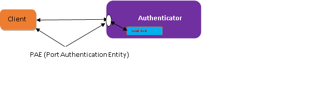

# PNAC in SONiC
# High Level Design Document
### Rev 1.0

# Table of Contents
* [Revision](#revision)
* [About this Document](#About-this-Document)
* [Scope](#scope)
* [Definitions/Abbreviations](#DefinitionsAbbreviations)
* [1 Requirements Overview](#1-Requirements-Overview)
   * [1.1 Functional Requirements](#11-Functional-Requirements)
   * [1.2 Memory CPU Consumptions Requirements](#12-Memory-CPU-Consumptions-Requirements)
   * [1.3 Configuration and Management Requirement](#13-Configuration-and-Management-Requirements)
* [2 Functionality](#2-Functionality)
   * [2.1 Target Deployment Use Cases](#21-Target-Deployment-Use-Cases)
* [3 Design](#3-Design)
    * [3.1 Options to Block or allows port traffic based on Authentication status of the port](#31-Options-to-Block-or-allows-port-traffic-based-on-Authentication-status-of-the-port)
      * [3.1.1 Options-1 Allowing or Blocking user traffic by using RSTP STP states](#311-Options-1-Allowing-or-Blocking-user-traffic-by-using-RSTP-STP-states)
      * [3.1.2 Option-2 Allowing or Blocking user traffic by configuring L2-ACL filters](#312-Option-2-Allowing-or-Blocking-user-traffic-by-configuring-L2-ACL-filters)
      * [3.1.3 Option-3 Allowing or Blocking user traffic by configuring ***learn_mode***](#313-Option-3-Allowing-or-Blocking-user-traffic-by-configuring-***learn-mode***)
    * [3.2 PNAC software architecture](#32-PNAC-software-architecture)
      * [3.2.1 Hostapd initialisation steps](#321-Hostapd-initialisation-steps)
      * [3.2.2 Actions performed by hostapd_wrapper](#322-Actions-performed-by-hostapd-wrapper)
      * [3.2.3 Actions Triggered Based on CLI configuration changes](#323-Actions-Triggered-Based-on-CLI-configuration-changes)
      * [3.2.4 Actions performed after receiving state change notification from hostapd](#324-Actions-perfromed-after-receiving-state-change-notification-from-hostapd)
      * [3.2.5 Actions performed when interface operational status changes to DOWN](#325-Actions-performed-when-interface-oprational-status-changes-to-DOWN)
      * [3.2.6 Actions performed when interface operational state changes to ***UP***](#326-Actions-performed-when-interface-oprational-state-changes-to-UP)
      * [3.2.7 Sequence of Events flowchart](#327-Sequence-of-Events-flowchart)
   * [3.3 DB Changes](33-DB-Changes)
     * [3.3.1 ConfigDB Schema Changes](#331-ConfigDB-Schema-Changes)
     * [3.3.2 App DB Changes](#332-App-DB-Changes)
  * [3.4 CLI Commands](#34-CLI-Commands)
* [4 Serviceability and Debug](#4-Serviceability-and-Debug)
* [5 Warm Reboot](#5-Warm-Reboot)
* [6 Scalability](#6-Scalability)
* [7 Unit Test](#7-Unit_test)
* [8 To be done in future release](#8-To-be-done-in-future-release)
# Revision
| Rev |     Date    |       Author       | Change Description                  |
|:---:|:-----------:|:-------------------|:-----------------------------------|
| 0.1 |  10/03/2023 | Kishor Kulkarni, <br> Keerthi Kumar Thovi| Initial version                     |

# About this Document
This document describes the design details of the Port Based Network Access Control (PNAC) feature.
PNAC enables switches to control port access only for Authenticated users while denying access for unauthenticated users. The core to this feature is IEEE protocol 802.1x protocol. Port-based network access control allows a network administrator to restrict the use of LAN service access port only for authenticated and authorised users those are trying to get access into the network. 
***Note***: The standard supports port-based authentication and MAC based authentication. This version of the software supports port based authentication and will be extended for MAC based authentication in future.
# Scope
This document describes the high level design details about Port Based Authentication.
# Definitions/Abbreviations
###### Table 1: Abbreviations 
#
| Abbreviation             | Full form                              |
|---------------------------|----------------------------------|
| AAA                  | Authentication, Authorization, and Accounting |
| EAPoL               | Authentication Protocol (EAP) over LAN |
| MAC                 | Media Access Control   |
| NAC                             | Network Access Control     |
| PAE                              | Port Authentication Entity |
| PNAC                      | Port Based Network Access Control |
| VLAN                     | Virtual Local Area Network |

# 1 Requirements Overview
Port-based network access control allows a network administrator to restrict the use of IEEE 802 LAN service access points (ports) to secure communication between authenticated and authorised devices. The current design is restricted to local switch based authentication and authorisation method. 
## 1.1 Functional Requirements
The functional requirements for PNAC are:
1. The software allows a user to enable/disable the NAC functionality globally in the system.
User can configure NAC per port only if NAC is globally enabled.
2. The software allows a user to enable the PNAC functionality on any specific physical port in the system.
3. The software allows a user to disable the PNAC functionality on any specific physical port in the system.
4. The Software should perform periodic authentication of the supplicant.
5. The software includes a CLI for a user to configure and monitor the feature.
## 1.2 Memory, CPU Consumptions Requirements
1. The software memory usage must be proportional to the number of physical ports.
2. The software limits for the RAM overhead and CPU overhead due to usage of a separate container shall be within allowed limits of SONiC container.

## 1.3 Configuration and Management Requirements
Configuration of the PNAC feature can be done via:
- JSON config input
- CLI
# 2 Functionality
The feature enables a switch to authenticate other devices that require access to the network through the switch. Such end devices could be cameras, IP-phones, servers, user workstations, WiFi access points, etc. The administrator is expected to have the following choices / controls.
- Enable / disable authentication globally
- Enable / disable authentication on each port
*** Note *** Following requirements are considered for upcoming releases.
- Choose authentication to be port based or MAC address based
- Allow MAC bypass (segregate unauthenticated devices to a separate VLAN) when MAC based authentication is used. Not in the current scope
- Set up a white list of allowed devices or black list of blocked devices using MAC addresses
- Setup authentication from each switch with a database of authentication credentials on the switch
- Setup authentication centrally in the network using RADIUS protocol
- Setup authentication centrally in the network using Tacacs+ protocol
- Rate limit EAPOL packets to overcome/stop DDOS attack.
## 2.1 Target Deployment Use Cases
First use case is Port based Network Access Control as described below.

Above diagram authenticator block/unblocks all traffic in ingress direction based on authentication status of the port. Traffic is allowed only for Authenticated users.
# 3 Design
## 3.1 Options to Block/allows port traffic based on Authentication status of the port
As part of the design there are various design options were considered to effectively allow/disallow user traffic based on authentication status of the port connected to the end user device. Following paragraph list all these option with pros and cons and provide which option is best suited for the design.
### 3.1.1 Allowing or Blocking user traffic by using RSTP/STP states 
In this design option, if the NAC-enabled bridge-port is not authenticated then Port state is configured in “Blocked State” by invoking SAI API. After bridge-port get authenticated then the port state is changed to “Forwarding State”.

***Pros:***
PNAC implementation reuses existing SAI APIs for setting port state for controlling authorization status on a port.
***Cons:***
Currently SONiC distribution does not support STP/RSTP protocol.
Port state should be set taking into account both NAC status on a port and RSTP/MSTP status. 
In future, when RSTP/STP code gets implemented the port state need to be controlled using combination of NAC and RSTP/STP protocol. This is complicates the solution.
### 3.1.2 Option-2: Allowing or Blocking user traffic by configuring L2-ACL filters 
In this design option, software shall use two ACL filters,

L2-ACL filter to allow EAPOL traffic
L2-ACL filter to block the data traffic

When a bridge port is in unauthorized state following filters shall be configured (index indicates priority of the filter).

L2-ACL filter to allow EAPOL traffic
L2-ACL filter to block the data traffic

When a bridge port is in authorised state filters then following filter is configured.

L2-ACL filter to allow EAPOL traffic


***Pros:***
Allowing and blocking traffic is achieved by L2-ACL filter using existing SAI APIs. Hence, no change in SAI API is required to achieve the functionality.  
***Cons:***
Total number of L2-ACL filters resources are limited for most of forwarding ASIC.
Hence consuming 4 filters per interface will consume large number entries L2-ACL filter table, if NAC is enabled for interfaces. This will reduce useful number entries in L2-ACL filter table.
### 3.1.3 Option-3: Allowing or Blocking user traffic by configuring “learn_mode”
In this design option, based on port Authorisation method, “learn_mode” for a port is set one of the following modes,

“SAI_BRIDGE_PORT_FDB_LEARNING_MODE_DROP”
 “SAI_BRIDGE_PORT_FDB_LEARNING_MODE_HW”

When port is in unauthorized state after enabling NAC feature then port learn mode is configured as “SAI_BRIDGE_PORT_FDB_LEARNING_MODE_DROP”.

When port is in authorized state after enabling NAC feature then port learn mode is configured as  “SAI_BRIDGE_PORT_FDB_LEARNING_MODE_HW”


***Pros:***
No change in SAI APIs is required to implement this design option.
In both learn_modes EAPOL traffic is punted to CPU i.e. no specific configuration is required for punting EAPOL traffic.
No consumption L2-Filter entries.

***Cons:***
None

After evaluating each of the options and their Pro/Cons, Option-3 is the priority-1 option and hence chosen as the option for PNAC design.

## 3.2 PNAC software architecture
Following figure explains how various components are based on microservices architecture. SONiC natively uses docker containers to partition various SW components based on grouping of functionalities. 


A new Docker container is introduced that implements control plane of 802.1x standard with Authenticator functionality only. Within the "hostapd" container a new layer “hostapd_wrapper” is added. "hostapd_wrapper" enables communication between "hostapd" and other SONiC components.
### 3.2.1 Hostapd initialisation steps 
As part of hostapd initialization two steps are performed as explained below:
Add all physical interfaces on a given HW board to “hostapd port list”. Using hostapd API interface disable “Authentication” for all interfaces. 
### 3.2.2 Actions performed by hostapd_wrapper
hostapd_wrapper performs following tasks,
1. It continually monitors changes in config_db -> port_ table. If there is change in “***Nac AdminState***” to “UP” it enables the NAC state of the interface maintained by hostapd. Similarly, if there is change in “***Nac AdminState***” to “DOWN” it disables the NAC state of the interface maintained by hostapd
2. It monitors event from hostapd related to interface Authorisation. Based on event type action is triggered as explained in the section [3.2.4](#324-Actions-perfromed-after-receiving-state-change-notification-from-hostapd).  
### 3.2.3 Actions Triggered Based on CLI configuration changes
This design makes use of COPP module to trap EAPOL packets to the host interface. COPP module provides two critical function as described below,
To trap EAPOL packets to the host interface.
To rate limit incoming EAPOL packets to avoid DOS attack  or protect a host CPU from high incoming control packets.
Below is the snippet of COPP configuration,
```
"COPP_GROUP": {
           "default":{            
                    "queue": "0",                    
                    "meter_type":"packets",                    
                    "mode":"sr_tcm",                    
                    "cir":"600",                    
                    "cbs":"600",                    
                    "red_action":"drop"                    
            },            
           "queue4_group1": {            
                    "trap_action":"trap",                    
                    "trap_priority":"4",                    
                    "queue": "4"                    
            },            
          "queue4_group2": {            
                    "trap_action":"copy",                    
                    "trap_priority":"4",                    
                    "queue": "4",                    
                    "meter_type":"packets",                    
                    "mode":"sr_tcm",                    
                    "cir":"600",                    
                    "cbs":"600",                    
                    "red_action":"drop"                    
            },            
            "queue4_group3": {            
                    "trap_action":"trap",                    
                    "trap_priority":"4",                    
                    "queue": "4"                    
            },            
            "queue1_group1": {            
                    "trap_action":"trap",                    
                    "trap_priority":"1",                    
                    "queue": "1",                    
                    "meter_type":"packets",                    
                    "mode":"sr_tcm",                    
                    "cir":"6000",                    
                    "cbs":"6000",                    
                    "red_action":"drop"                    
            },
            "queue1_group2": {            
                    "trap_action":"trap",                    
                    "trap_priority":"1",                    
                    "queue": "1",                    
                    "meter_type":"packets",                    
                    "mode":"sr_tcm",                    
                    "cir":"600",                    
                    "cbs":"600",                    
                    "red_action":"drop"                    
            },
            "queue2_group1": {            
                    "cbs": "1000",                    
                    "cir": "1000",                    
                    "genetlink_mcgrp_name": "packets",                    
                    "genetlink_name": "psample",                    
                    "meter_type": "packets",                    
                    "mode": "sr_tcm",                    
                    "queue": "2",                    
                    "red_action": "drop",                    
                    "trap_action": "trap",                    
                    "trap_priority": "1"                     
             }             
    },    
    "COPP_TRAP": {    
            "nac": {            
                    "trap_ids": "eapol",                    
                    "trap_group": "queue4_group3"                    
            }            
    }    
}
```
After configurating “***NAC Adminstate***” to “***up***” for a given interface, update in config_db triggers 1following actions
Update learn_mode for the specific interface in config_db to “***SAI_BRIDGE_PORT_FDB_LEARNING_MODE_DROP***”
Flush FDB for the bridge that’s part of the interface
Enable NAC for the interface maintained by hostapd. This point onwards hostapd starts listening to EAPOL packets received on this interface.

After configurating “***NAC Adminstate***” to “down” for a given interface, update in config_db triggers following actions,
Action to disable NAC for the interface maintained by hostapd. This point onwards hostapd stops listening to EAPOL packets received on this interface.
Update learn_mode for the specific interface in config_db to “***SAI_BRIDGE_PORT_FDB_LEARNING_MODE_HW***”
### 3.2.4 Actions performed after receiving state change notification from hostapd
Hostapd_wrapper gets notification from hostapd whenever interface authorisation state changes from “Authorised” to “Unauthorised” and from “Unauthorised” to “Authorised”

After receiving interface state change notification from Unauthorised to Authorised hostapd_wrapper performs following two operations,
- Update column “***nac_status***” in NAC_SESSION table which is part of config_DB to "***authorised***"
- Update learn_mode for the specific interface in config_db to “***SAI_BRIDGE_PORT_FDB_LEARNING_MODE_HW***”  
This action will trigger Orchagent invoking SAI to update the learn_mode.
After receiving interface state change notification from Authorised to Unauthorised hostapd_wrapper performs following two operations,
- Update “***nac_status***” in NAC_SESSION table which is part of config_DB to "***unauthorised***".
- Update learn_mode for the specific interface in config_db to “***SAI_BRIDGE_PORT_FDB_LEARNING_MODE_DROP***”
This action will trigger Orchagent invoking SAI to update the learn_mode.
Invoke ***SAI_API*** to Flush DB for the database
### 3.2.5 Actions performed when interface operational status changes to DOWN
Hostapd_wrapper monitors operational status of the interface. When it transitions from “***up***” to “***down***” following actions are triggered by hostapd_wrapper.
Update learn_mode for the specific interface in config_db to “***SAI_BRIDGE_PORT_FDB_LEARNING_MODE_DROP***”
Flush FDB for the bridge
Update column “***nac_status***” in NAC_SESSION table which is part of config_DB to "***unauthorised***"
Shudown the interface and bringup the interface.
### 3.2.6 Actions performed when interface operational state changes to ***UP***
Hostapd_wrapper monitors operational status of the interface. When it transitions from “***down***” to “***up***” no specific actions shall be performed.
### 3.2.7 Sequence of Events flowchart
Following Flow chart describes actions in respective sequence after events like port UP/DOWN takes place.


## 3.3 DB Changes
As part of PNAC feature introduction following are changes in respective DB.
### 3.3.1 ConfigDB Schema Changes
This section describes incremental changes to ConfigDB implemented =for PNAC feature.
Feature configuration:
```
"FEATURE": {
           "nac": {
                "auto_restart": "enabled",            
                "has_global_scope": "True",            
                "has_per_asic_scope": "False",            
                "has_timer": "False",            
                "high_mem_alert": "disabled",            
                "set_owner": "local",            
                "state": "enabled"            
           },
```        
***NAC Global configuration***
```
"NAC":{
        "global": {        
            "admin_state": "up",            
            "auth_type": "local",            
            "nac_type": "port"            
        }        
    },
```
***NAC_Session Table*** 
```
"NAC_SESSION": {
        "Ethernet0": {        
            "admin_state": "down",            
            "nac_status": "unauthorized"            
        },        
        "Ethernet4": {        
            "admin_state": "up",            
            "nac_status": "unauthorized"
```
### 3.3.2 App DB changes
1. ***nac_status*** field is added to the NAC_SESSION table.
2. ***admin_state*** filed is added to the NAC_SESSION table.
3. At Global level a flag is maintained to enable or disable PNAC feature
## 3.4 CLI Commands
#
| S.No. |  CLI Command                                     | Description                                                                  |
|--------|----------------------------------------------|---------------------------------------------------------------|
|   1         | $config nac <enable\|disable>       | This CLI option allows a user to enable\|disable the NAC functionality globally in the system.     |    
| 2   | $config nac interface <enable\|disable> <interface_name\|all> | This CLI option allows a user to configure the NAC feature control at interface level.|
|3          | $show nac | This CLI option displays the NAC global information configured at Switch |
|4         | $show nac interface <interface_name\|all> | This CLI option displays the NAC information configured at all ports of the switch |
| 5       | $config nac type <port\|mac> | This CLI Option shall configure the type of NAC to be configured/used across the SONiC switch. ***Note*** This CLI shall be applicable only if NAC feature is enabled, globally. |

# 4 Serviceability and Debug
Existing debug framework is extended for PNAC feature by adding more debug logs for appropriate conditions.
# 5 Warm Reboot
Warm reboot is not impacting functionality of the feature.
# 6 Scalability
| S.No. |                                           Requirement Description                                                                  |
|--------|--------------------------------------------------------------------------------------------------------------|
| 1 |  The software supports systems with upto 384 ports (chassis or stacked system with 8 units of 48 port modules) |
| 2 | The software supports authentication of upto 384 ports.

# 7 Unit Test
| S.No. |  Test Case Description                       | Expected Output                                                        |
|--------|----------------------------------------------|---------------------------------------------------------------|
| 1        | 1. Login to SONiC NOS Command terminal 2. Enable NAC feature globally using command ***$config nac enable*** | NAC feature should be enabled in SONiC. Other NAC config settings should be allowed/permitted |
| 2       | 1. Login to SONiC NOS Command terminal 2. Disable NAC feature globally using command ***$config nac disable*** | NAC feature should be disabled in SONiC. Other NAC config setting should not be permitted/allowed |
|  3     | 1. Login to SONiC NOS Command terminal 2. Enable NAC feature globally using command ***$config nac interface enable*** | NAC feature is enabled to interface. NAC feature should be enabled in SONiC. Other NAC config settings should be allowed/permitted |
| 4 | 1. Login to SONiC NOS Command terminal 2. Disable NAC feature globally using command ***$config nac interface disable*** | NAC feature is disabled to interface. NAC feature should be enabled in SONiC. Other NAC config settings should be allowed/permitted |
| 5 | 1. Login to SONiC NOS Command terminal 2. NAC feature allows user to change nac type command ***$config nac type <port/mac>*** | NAC feature is enabled in SONiC. Then it allows user to change port type. |
| 6 | 1. Login to SONiC NOS Command terminal 2. NAC CLI for a user to configure and monitor the feature. 'show nac interface <interface name \| all>. |
| 7 | 1. Login to SONiC NOS Command terminal. 2. NAC feature has the existing cli to save the config to save configuration, identical to the manner in which other features in SONiC implement the same through the command. ***$config save <export-file-name.json>*** | NAC feature is used to save the configuration, using the CLI. |
| 8 | 1. Login to SONiC NOS Command terminal. 2. NAC feature has the existing cli to save the config to save configuration, identical to the manner in which other features in SONiC implement the same through the command. ***$config reload <export-file-name.json>*** | NAC feature is used to save the configuration, using the CLI. |
| 9 | 1. Login to SONiC NOS Command terminal . 2.To show the NAC feature globally using command ***$show nac*** 3. To show the NAC feature globally using command ***$show nac interface*** | NAC feature is configured and it shows the nac information. |
| 10 | 1. Login to SONiC NOS Command terminal. 2. NAC feature implemented NOS supports execution in a separate container to allow easy integration with a customer's pre-setup SONiC installation without having to change the installation / version. | Separate NAC container information should be displayed when "docker ps" command is given. |
| 11 | 1. Login to the SONiC NOS Command terminal. 2. NAC feature implemented NOS RAM overhead due to using a separate container is < 32 Kbytes: '$ ' | NAC functionality limit RAM :< 32 Kbytes |
| 12 | 1. LOGIN to the SONiC NOS Command terminal. 2. NAC feature implemented NOS CPU overhead due to using a separate container is < 0.1 %: '$ ' | NAC functionality limit CPU :< 0.1% |
| 13 | 1. Disable NAC feature globally from CLI 2. Initiate PING from PC1 to PC2 in the test topology. | PING should be successful |
| 14 | 1. Enable NAC feature globally from CLI, but port specific NAC configuration is disabled 2. Initiate PING from PC1 to PC2 in the test topology | PING should be successful |
| 15 |  1. Enable NAC feature globally from CLI 2. Enable NAC on particular interface (say Ethernet16). 3. Initiate PING from PC1 to PC2 in the test topology | PING should fail |
| 16 | 1. Enable NAC feature globally from CLI. 2. Enable NAC on particular interface (say Ethernet16). 3. Initiate Supplicant with VALID username & password towards NAC enabled port (i.e. Ethernet16). 4. Initiate PING from PC1 to PC2 in the test topology (via Ethernet16) | PING should be successful |
| 17 | 1. Enable NAC feature globally from CLI. 2. Enable NAC on particular interface (say Ethernet16). 3. Initiate Supplicant with INVALID username & password towards NAC enabled port (i.e. Ethernet16). 4. Initiate PING from PC1 to PC2 in the test topology (via Ethernet16). | PING should fail |
| 18 | 1. Enable NAC feature globally from CLI. 2. Enable NAC on all ports. 3. Initiate PING from PC1 to PC2(or vice versa) in the test topology (say via Etherne16). 4. While PING is ongoing, initiate Supplicant with VALID username & password. Let authorization succeed. 5. Monitor the PING traffic | Until port gets authenticated PING traffic should fail. Once authenticated, PING should be successful. |
| 19 | 1. Enable NAC feature globally from CLI. 2. Disable NAC on all ports. 3. Initiate PING from PC1 to PC2(or vice versa) in the test topology (say via Etherne16). 4. While PING is ongoing, initiate Supplicant with INVALID username & password. 5. Monitor the PING traffic. | PING should be successful |
| 20 | 1. Enable NAC feature globally from CLI. 2. Disable NAC on all ports. 3. Initiate PING from PC1 to PC2(or vice versa) in the test topology (say via Etherne16). 4. Enable PNAC on a port (say Ethernet16) where PING is initiated earlier. 5. Initiate Supplicant with VALID username & password. 6. Monitor the PING traffic | PING should be successful initially (as NAC is disabled). Once, PNAC is enabled on port, PING should fail. Once, Port gets authenticated, PING should succeed. |
| 21 | 1. Enable NAC feature globally from CLI. 2. Enable NAC on all ports. 3. Initiate PING from PC1 to PC2(or vice versa) in the test topology (say via Etherne16). 4. Switch NAC type from port to mac. 5. Monitor the PING traffic | PING should fail initially, Once NAC type is switched to MAC, then PING should be successful. |
| 22 | 1. Enable NAC feature globally from CLI. 2. Initiate Supplicant with VALID credentials and allow successful PNAC authentication. 3. Initiate PING from PC1 to PC2(or vice versa) in the test topology. 4. While PING traffic ongoing, modify the supplicant credentials. 5. Re-initiate Supplicant transaction with INVALID credentials. 6. Monitor the PING traffic. | PING should be successful when PNAC is authorized and should fail, when PANC authorization fails. |
| 23 | Pre-Condition: NAC feature is disabled globally. 1. Initiate PING from PC1 to PC2(or vice versa) - PING should work normally. 2. Enable NAC feature globally. 3. Enable NAC feature on a particular interface(Ethernet16). | Previous PING traffic should be stopped |
| 24 | Pre-Condition: Let the supplicant be authorized on a particular port of DUT (say Ethernet16). 1. Shutdown Ethernet48 on the Tester, so that Ethernet16 should be Operationally DOWN and Admin State is UP. 2. Start the Ethernet48 on the Tester board | Whenever the port is Operationally DOWN, the corresponding NAC authorization state should be unauthorized. |
# 8 To be done in future release
|   Id  |                        Requirement Description                                                                        |
|------|----------------------------------------------------------------------------------------------------|
| 1  | The software allows a user to choose, at runtime, between port based authentication and MAC based authentication. |
| 2 | The software allows a user to assign the VLAN for an authenticated device based on pre-defined configuration |
| 3 | The software allows a user to place unauthenticated devices in a separate VLAN instead of denying network access (known as MAC bypass) |
| 4 | The software interfaces with a RADIUS client to get the authentication done from a RADIUS server instead of from a local database |
| 5 | The software interfaces with a Tacacs+ client to get the authentication done from a Tacacs+ server instead of from a local database |
| 6 | The software allows a user to specify a list of blacklisted MAC addresses to deny access |
| 7 | The software allows a user to specify a list of whitelist MAC addresses which will be allowed to access the network without being specifically authenticated.|
| 8 | The software supports usage of EAP-TLS for secure exchange of credentials across the networks |
| 9 | The software includes a CLI for a user to monitor the feature. |
|10 | The software supports SNMP supports for configuration managment. |
| 11 | The software supports Restconf for configuration managment |
|12 |  The software supports usage of EAP-TLS for secure exchange of credentials across the networks.|
|13 | The software supports usage of PEAP-MSCHAPv2 for secure exchange of credentials across the networks.|
|14 | The software supports usage of EAP-TTLS / PAP for secure exchange of credentials across the networks.|
| 15 | 1. Create a NAC profile. 2. Supply required arguments at CLI. 3. Assign this profile to a particular NAC-enabled port. The profile should be applied to that particular port |
