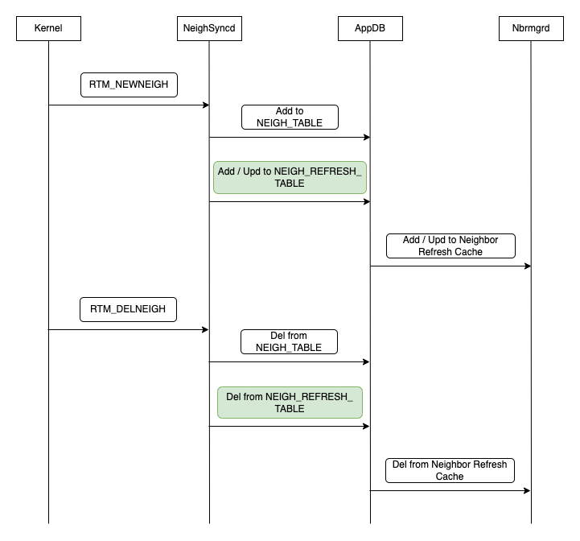

# Neighbor Refresh HLD

# High Level Design Document
#### Rev 0.1

# Table of Contents
  * [Revision](#revision)
  * [Definition/Abbreviation](#definitionabbreviation)
  * [About This Manual](#about-this-manual)
  * [1 Requirement Overview](#1-requirement-overview)
     * [1.1 Functional Requirements](#11-functional-requirements)
     * [1.2 Configuration and Management Requirements](#12-configuration-and-management-requirements)
     * [1.3 Scalability Requirements](#13-scalability-requirements)
     * [1.4 Warm Boot Requirements](#14-warm-boot-requirements)
     * [1.5 Limitiations](#15-limitations)
  * [2 Functionality](#2-functionality)
     * [2.1 Functional Description](#21-functional-description)
  * [3 Design](#3-design)
     * [3.1 Overview](#31-overview)
     * [3.2 DB Changes](#32-db-changes)
     * [3.3 Switch State Service Design](#33-switch-state-service-design)
     * [3.4 SyncD](#34-syncd)
     * [3.5 SAI](#35-sai)
     * [3.6 CLI](#36-cli)
  * [4 Flow Diagrams](#4-flow-diagrams)
  * [5 Warm Boot Support](#5-warm-boot-support)
  * [6 Unit Test](#6-unit-test)


# Revision
| Rev  |    Date     |   Author     | Change Description |
| :--: | :---------: | :---------:  | ------------------ |
| 0.1  | 25-Jul-2022 | Laveen       | Initial version    |
|      |             |              |                    |

# Definition/Abbreviation
### Table 1: Abbreviations
| **Term** | **Meaning**                                       |
| -------- | ------------------------------------------------- |
| ARP      | Address Resolution Protocol                       |
| ND       | Neighbor Discovery                                |
| IP       | Internet Protocol                                 |
| L3       | Layer 3                                           |
| RIF      | Routing Interface                                 |
| VRF      | Virtual Routing and Forwarding                    |
| SVI      | Switch Virtual Interface                          |

# About This Manual
This document describes the high level description of neighbor refresh in SONiC.

# 1 Requirement Overview

Refresh ARP/ND before their respective timer or MAC ageout.

SONiC depends upon the Linux kernel to manage the ARP/ND tables. SONiC then listens to ARP/ND events from the kernel and synchronizes the hardware as required. Some of the limitations with this are as follows,

- The kernel does not "see" the routed (in HW) through-traffic, and so cannot update its "hit bits" accordingly. Therefore the kernel may age out an entry that is still in use.
- The kernel does not "see" the HW MAC aging process, and so does not know that a MAC address associated with an ARP/ND entry has been aged out, and so does not refresh it. This can result in traffic black holes for a "quiet" neighbor (i.e. one that does not transmit much) / unidirectional traffic streams.

ARP Update helper process is used by SONIC to periodically refresh the kernel ARP table by sending ARP/ND packets to all neighbor table entries. This provokes responses from the associated hosts, and this keeps both the HW MAC table and kernel ARP tables current. However the current ARP Refresh process is implemented as a bash script and is not effective at scale. So, the proposal here is to design and implement a new ARP/Neighbor Refresh process.

Earlier code PR https://github.com/Azure/sonic-swss/pull/1548 handled the neighbor refresh in neighsyncd. As per the review comments creating new HLD and Code PR for handling neighbor refresh in Nbrmgrd.

## 1.1 Functional Requirements

  - Refresh ARP/ND before the ARP/ND kernel ageout
  - Refresh ARP/ND before the MAC ageout on Vlan interfaces
  - On MAC delete (clear mac / control protocol) trigger refresh for corresponding ARP/ND

## 1.2 Configuration and Management Requirements

No New CLIs are added as part of this proposal.

## 1.3 Scalability Requirements

  - Support ARP/ND refresh for upto 4K Vlan Interfaces and 32K neighbor entries

## 1.4 Warm Boot Requirements

  - During Warmboot, MAC aging will be disabled and will be enabled back after the system is restared. Hence traffic blackholing due to MAC ageout will not happen. When the system boots up, ARP/ND refresh cache table will be populated again and then the neighbor entries will be refreshed as normal.

## 1.5 Limitiations


# 2 Functionality

## 2.1 Functional Description

Req-1:

In SONiC, once IP address is configured on an interface, subnet route and IP2ME route entries are programmed. To forward traffic to any directly connected hosts on this subnet, packet will be first trapped to CPU based on the subnet route. Linux kernel on receiving the packet will trigger the neighbor (ARP/ND) resolution. Linux kernel handles the state machine for the neighbors resolved. Once the neighbor is resolved, NEIGH_TABLE entry will be created by neighsyncd in APP_DB, Orchagent will process the neighbor table entry and programs the SAI both the neighbor and the nexthop. Once the neighbor entry is programmed in HW/ASIC all further traffic to that destination will be forwarded by the ASIC and there is no notification/liveliness of the entry is known to Linux kernel. Based on the configured aging time, Linux kernel may change the state and could potentially remove the entry (depends on different kernel parameters). In order to keep the kernel neighbor state alive it is essential to refresh the neighbors by either send IP packets / ARP/NS packets to the destination host. Once the destination host responds kernel's state machine will get updated and all its neighbor timers are reset.

Req-2:

In case of Vlan interfaces, for an neighbor entry, in addition to the neighbor and nexthop entry programmed in ASIC, FDB entry corresponding to the resolved MAC to outgoing interface will be programmed. Without the FDB entry packets may not be forwarded in HW. Since the FDB resources are limited its quite normal to ageout an unsed FDB entry in HW. If the FDB entry ages out before the neighbor ageout then packets will be dropped in ASIC. So the neighbor refresh should ideally happen before the MAC/FDB ageout.

Req-3:

MAC table entry in SONiC can be administratively cleared or could be removed due to control protocol handling (mclag mac delete on orphan ports during mclag peer reboot). Once the MAC is removed by external triggers then traffic could be dropped up untill the next neighbor refresh which could be in minutes. In order to avoid such traffic drop, if a MAC is removed, neighbor entry should be refreshed as early as possible to avoid blackholing of traffic .

For the current SONiC release - 202211, Support for req-1 and only for ARP refresh over Physical Interface will be added.

In the subsequent releases following will be added.

1) Support for req-1 IPv6 / ND refresh only on L3 Physical Interface 
2) Support for req-1 Other L3 Interface types (L3 PortChannel / Vlan / SubInterfaces )
3) Support for req-2 ARP/ND refresh before FDB Aging in HW
4) Support for req-3 ARP/ND refresh due to FDB delete/flush


# 3 Design
## 3.1 Overview

In order to refresh the neighbors, application needs to be aware of all the neighbors in use. Neighsyncd gets the kernel event for every neighbor added in kernel neighbor table, however managing the neighbor refresh in neighbsyncd would mean some of the processing time will be spent on neighbor refresh activies instead of updating NEIGH_TABLE in APP_DB. Hence it is proposed to handle neighbor refresh in another process, since nbrmgrd already handles static neighbor programming and neighbor resolve table (to trigger neighbor resolution in kernel for unresolved neighbor) and to keep all neighbor resolution/refresh to one component, nbrmgrd is selected as the process to handle neighbor refresh processing.

A new NEIGH_REFRESH_TABLE will be added as part of this feature and neighbsyncd in addition to NEIGH_TABLE, will add neighbor entries to NEIGH_REFRESH_TABLE along with additional info like the kernel state and flags.

Nbrmgrd will subscribe to NEIGH_REFRESH_TABLE and create a local cache depending upon the kernel state and flags.

Nbrmgrd will also have a peridic neighbor timer to handle both the Neighbor refresh and the FDB refresh. If a neighbor's refresh timer expires then ARP request or Neighbor solicitation message will be sent using a RAW socket. Nbrmgrd will not wait for the response because waiting for a response will delay sending of subsequent refresh packets and in scale scenario will impact refresh process. Once the packet is transmitted out successfully the response from the destination host will be processed by kernel and kernel will update its internal timers.

## 3.2 DB Changes

### 3.2.1 CONFIG DB
Not applicable

### 3.2.2 APP DB
**NEIGH_REFRESH_TABLE**

```
Producer: neighsyncd 

Consumer: nbrmgrd

Description: Create a neighbor refresh table entry for every neighbor that is added to NEIGH_TABLE 
```

Schema:

```
; New table
; Has the ARP/ND entries that needs to be refreshed periodically

key           = NEIGH_REFRESH_TABLE:ifname:IPprefix

; field       = value
neigh         = 12HEXDIG           ; mac address of the neighbor
family        = "IPv4" / "IPv6"    ; address family
state         = 1*10DIGIT          ; Neighbor state in Kernel
flags         = 1*10DIGIT          ; Neighbor flag info in Kernel

Example:
127.0.0.1:63792> hgetall "NEIGH_REFRESH_TABLE:Ethernet25:20.20.20.1"
 1) "neigh"
 2) "80:a2:35:26:0c:61"
 3) "family"
 4) "IPv4"
 5) "state"
 6) "2"
 7) "flags"
 8) "0"
127.0.0.1:63792>
```

### 3.2.3 STATE DB
Not applicable

### 3.2.4 ASIC DB
Not applicable

### 3.2.5 COUNTER DB
Not applicable

### 3.2.6 Configuration save and restart
Not applicable

## 3.3 Switch State Service Design

### 3.3.1 Orchestration Agent

No Change in Orchangent / NeighOrch.

### 3.3.2 NeighSyncd

Neighsyncd is responsible for syncing the kernel neighbor table to the hardware via the APP_DB and OrchAgents. Neighsyncd listens on netlink events (RTM_NEWNEIGH, RTM_DELNEIGH) and creates/deletes NEIGH_TABLE entries in APP_DB.

Existing functionality of neighsyncd is retained as it is. In addition to managing NEIGH_TABLE entries in APP_DB, neighsyncd will also add the details of the neighbor into NEIGH_REFRESH_TABLE.


### 3.3.2 Nbrmgrd

Nbrmgrd in addition to its existing responsibilities will now have to take care of the following Neighbor Refresh resonsibilities.

- listens to NEIGH_REFRESH_TABLE and manage a local cache of neighbor entries
- subscribe to redis-db interface CONFIG_DB tables to gather the data required to send the ARP refresh packets
- subscribe to STATE_DB FDB table to manage the mac address table local cache
- periodically refresh ARP/ND by sending ARP request pkt / NS pkt


#### 3.3.2.1 Local Cache

Neighbor Refresh Cache:

- Add neighbor entries to cache when the entry is added to NEIGH_REFRESH_TABLE
    - All Dynamically learned neighbor entries [ARP, ND (Global, LinkLocal)]
    - All Static neighbor entries (MAC can be dynamic)
- Following Entries will not be added to the neighbor cache
    - Neighbors learned from “eth0” interface
    - Neighbors learned from BGP/EVPN MAC/IP type-2 route 
- Remove entries from cache when the entry is deleted from NEIGH_REFRESH_TABLE

```
v4/v6 Neighbors Cache [map]
    
    Key     : IP Address + InterfaceName [Phy/PortChannel/Vlan/Sag]

    Value
            : MAC Address
            : IP address family
            : State  (Reachable/Stale/Failed)
            : Kernel Flags (For NTF_EXT_LEARNED)
            : Timestamp (Entry creation/last refresh)
```

Interface Cache:

- Interface IP address will be used in building the ARP (Sender IP address) and NS (Soure IP) packets
- Subscribe to redis-db tables
    - IP address 
      - CONFIG_DB: INTERFACE, VLAN_INTERFACE, SAG_INTERFACE, PORTCHANNEL_INTERFACE

```
Interface Cache [Map]

    Key     : Interface name
    Value   : List of IP address configured
```


FDB Cache:

- FDB Cache is to handle quick refresh/retry of neighbors whose mac address is removed admistratively or due to control protocol clear 
- It has the list of neighbors(v4/v6) using the same mac on a VLAN interface. When the mac address is deleted, all the neighbors associated with the mac will be added to a fdb refresh queue.
- Entries in FDB refresh queue will be refreshed faster than the usual neighbor refresh interval and will be removed from the queue after 10 retries.

```
FDB Cache [Map]

    Key     : Interface + MAC
    Value   : List of neighbors using this mac
```

#### 3.3.2.2 Sending ARP/ND Refresh Packets

- For Resolved ARP/ND, Dst MAC will be same as in its NeighCache
- For Unresolved ARP, Dst MAC will be Broadcast MAC
- For Unresolved ND, ICMPv6 Echo Request pkt will be sent from application, Kernel will send NS
- ARP/NS packets will be sent using raw socket 
  - Separate sockets for ARP and ICMPv6 NS/Echo Request
- Kernel processing
  - VLAN tagging & FDB lookup happens based on outgoing interface
  - On Vlan Interfaces based on the FDB lookup packet will be either flooded or sent to a specific port
- Soure MAC 
  - For SAG interfaces, SAG MAC will be used and it will retrived from CONFIG_DB: SAG_GLOBAL
  - For all other interfaces, Source MAC will be retrived from kernel.
- Ifname to Index (required for socket send)

#### 3.3.2.3 Refresh Timer

- Traverse the neighbor Cache entries periodically (every 30 secs)
  - Check refresh timeout has elapsed for every neighbors
  - If elapsed then send ARP/NS packet

Refresh timeout Calculation:

To avoid sending all ARP/NS packets simultaneously, each neighbor entry will be configured with different refresh timeout value. This refresh timeout value will be based on MAC/ARP/NS aging time.

Refresh timeout will be set whenever the neighbor entry is added/updated in cache, it will also be recomputed after sending the ARP/NS refresh packet.

```
ARP Reference Timeout  = Min [MAC age, ARP age]

ND Reference Timeout   = Min [MAC age, ND age]

Refresh Timeout = 30% to 70% of [ARP/ND Reference Timeout] 
```

```
For example:

    1) MAC Age is less than ARP age

    ARP ageout = 60 mins 
    MAC ageout = 30 mins
    Reference Timeout = 30 mins.
    Refresh timeout will be between 30% to 70% of reference timeout (9 to 21) mins.

    2) ARP Age is less than MAC age

    ARP ageout = 60 mins 
    MAC ageout = 90 mins
    Reference Timeout = 60 mins
    Refresh timeout will be between 30% to 70% of reference timeout (18 to 42) mins.
```

## 3.4 SyncD
No Change in SyncD

## 3.5 SAI
No Change in SAI

## 3.6 CLI

No new CLIs are added as part of this change.

# 4 Flow Diagrams

Neighbor Refresh Cache Flow 



# 5 Warm Boot Support

Neighbor refresh entries will be added to NEIGH_REFRESH_TABLE during warmrestart state. Therefore the neighbor refresh cache will be created and refresh timeout will become effective after the neighbors are restored.

# 6 Unit Test

1. Verify ARP/ND entry is refreshed periodically before the ARP/ND entry agesout in kernel (or neighbor entries state changes from REACHABLE to STALE)
2. Verify ARP/ND entry learned on VLAN interfaces is refreshed before their corresponding MAC ageout in HW
3. Verify ARP/ND entry is refreshed within few seconds if their corresponding MAC in FDB table is deleted.
