# SONiC OSPF Test Case HLD
>
>
>
## Revision History

[© xFlow Research Inc](https://xflowresearch.com/)  

|  Revision No| Description | Author  | Contributors |Date |  
| :-------------: |:-------------:| :-----:|:----------:|:-----:|
|1.0| OSPF Test Cases Version 1.0| [Hafiz Mati ur Rehman](https://github.com/Mati86)| [Muhammad Hamza Iqbal](https://github.com/ham-xa)  & [Arsalan Ahmad](https://github.com/ahmadarsalan/)| 6 Jan 2022|
>
>
## Table of Contents

- Overview
- Scope
- Introduction
- Testbed
- Experimental Setup Configuration
- Test Cases
  - Test Case # 1: Testing OSPF Router-ID and Neighbour Relationship over LAN
  - Test Case # 2: Testing Route Sharing Within an OSPF  Area
  - Test Case # 3: Testing Inter-Area Route Distribution
  - Test Case # 4: Testing Convergence Optimization
  - Test Case # 5: Testing Virtual Links
>
## Overview
In this HLD we will perform OSPF functional level testing in a SONiC based testing environment. In each test case we have given sample topology, reference commands and expected output. 

## Scope
This high-level design document describes the functional level testing of OSPF  using the bgp container module in SONiC.

## Introduction

SONiC provides a BGP container for providing L3 routing protocol features in SONiC using Zebra. In this HLD we will describe different test cases for functional level testing of one of the most widely used open standard interior gateway routing protocols OSPF.  Open Shortest Path First (OSPF) uses the link-state algorithm known as Dijkstra for building a routing table. OSPF neighbors share different types of link state advertisements (LSAs) for building a link-state database (LSDB). OSPF uses the notion of area for restricting the LSA to a well-defined region. Network information in an area is shared after summarization with other areas via the backbone area known as area 0. This area-based design feature helps in the reduction of topology databases and hence reduces processing time, memory consumption, and computational cost.

____Link State Advertisements (LSAs)____

There are 11 different types of LSAs in OSPF. We will define the five most commonly used  LSAs.

____Type1 is a Router LSA____

All OSPF speaker types generate LSAs of this type. They are only advertised in the area, including the router's own topology information and routing information.

____Type2 is a Network LSA____

Type 2 LSAs that occur only on the MA network are generated by the DR and include all network information that is connected to the DR. They are only advertised in the area.

____Type3 is a Network Summary LSA____

It is generated by the ABR and advertises routing entries outside the router in the area. When there are multiple ABRs, the cost is used to determine the route summary. This cost is a simple sum of external route cost and internal cost generated by the router in the area. metric-Type 1), instead of running the SPF algorithm, it can be said that OSPF is a link-state protocol in the area, and a distance-vector protocol is between areas. Inter-regional route transfer

____Type4 is the ASBR summary____

It is generated by the ABR to broadcast the location of the ASBR. The show IP OSPF database shows that the Type4 LSA is always a hostmask 255.255.255.255, and Type4 is the only LSA with no Area attribute in the database.

____Type5 is an external summary____

It is generated by an ASBR and is the routing information of non-OSPF devices. Generally, in a large network, there are a large number of such LSAs in the router's database, which imposes a heavier load on the router. Therefore, we can use stub areas to limit the spread of such LSAs. However, consider the following scenario. If a router running OSPF needs to connect to a non-OSPF network, net1, and advertises the route entries in the non-OSPF network to OSPF, and does not want to store a large number of external networks advertised by other routers in the database. Routing, then we can not use STUB, because this will block all the External routes, OSPF network will lose the routing information of net1.
>
>
____OSPF Areas____

There are five types of OSPF areas: Backbone area (area 0), Standard area, Stub area, Totally stubby area, and No so stubby area (NSSA). Let's introduce one by one.

____Backbone area____ is actually area 0. According to the OSPF design principle, area 0 plays the role of the central node in the OSPF network. The link information of other areas is transmitted through area 0. This also means that all other areas must be connected to area 0. This area supports 1, 2, 3, 4, and 5 LSAs.

____Standard area____ means that in this area, OSPF packets can be normally transmitted. This area supports 1, 2, 3, 4, and 5 LSAs.

____Stub area____ means that the area does not accept any external routes of the non-OSPF network, if it wants to reach those external routes, only Need to send it through the default route. This area supports 1, 2, and 3 LSAs.

____Totally stubby area____ means that the area does not accept external routes and does not accept the link information of other areas outside of their own area. If it wants to reach the target network outside the area, it will send out the message through the default route just like the stub area. It should be noted here that since the default route is sent using Type 3 LSAs, the total stub area does not allow ordinary Type 3 LSA packets, but it supports this type of LSA with default routes. This area supports Type 1, Type 2 LSAs, and Type 3 LSAs with default routes.

____Not so stubby area____ this NSSA is actually derived from the stub area, it means that in the case of a stub area, it also has to send external routes to other areas. This area supports 1, 2, 3, and 7 LSAs. Note here that there is another mode in the Totally stubby area zone, which is the NSSA of the completely stub area mode. In fact, this mode allows the introduction of external routes in a completely stub area environment. This area mode supports Class 1, Type 2 LSAs, and Class 3 LSAs with default routes.

____OSPF Router Rolls____

*____Autonomous System Border Router (ASBR)____*
OSPF defines an ASBR as a router that redistributes routes into OSPF from some other routing sources. When redistributing the routes, the ASBR creates a Type 5 External LSA for each redistributed subnet, listing the subnet number as the LSID and listing the mask as one of the fields in the LSA. The LSA also lists the ASBR’s RID as the advertising router and a cost metric for the route. For the purposes of route summarization, you can think of a Type 5 LSA as working much like a Type 3 LSA, except for routes learned externally.

*____Area Border Router (ABR)____*
A router that has interfaces connected to at least two different OSPF areas, including the backbone area. ABRs hold topology data for each area, calculate routes for each area, and advertise those routes between areas.

*____Backbone Router (BR)____*
Any router that has at least one interface connected to the backbone area.

*____Internal Routers (IR)____*
A router that has interfaces connected to only one area, making the router completely internal to that one area.
Designated Routers (DR)
On multiaccess data links like LANs, an OSPF router is elected by the routers on that data link to perform special functions. These functions include generating LSAs representing the subnet and playing a key role in the database exchange process.

*____Backup Designated Router (BDR)____*
A router on a multiaccess data link that monitors the DR and becomes prepared to take over for the DR, should the DR fail.
>
## Testbed

SONiC P4 switch-based testbed will be used for testing OSPF functionality using different test cases. A guideline for building a baseline testbed with two hosts and two switches is given on the SONiC home page. You can visit this [link](https://github.com/Azure/SONiC/wiki/Sonic-Roadmap-Planning) for more information.
>
## Experimental Setup Configuration

Using the baseline testbed from the SONiC home page we will be building a more complex testing environment using different topologies and different testing scenarios. The details of the topologies and testing scenarios are given in the following section.
In the subsequent section, existing tools are used to create sample testing scenarios, related reference commands and expected outputs. It may be noted for implementation of this HLD, P4 based SONiC testbed and equivalent zebra commands will be used.
>
## Test Cases

### Test Case # 1: Testing OSPF Router-ID and Neighbour Relationship over LAN

OSPF uses the notion of Router-ID for identifying different routers in OSPF areas. OSPF assigns Router-IDs to each router in the OSPF areas and it has a well-defined criteria for Router-ID assignment as given below:

1. Use the router ID defined in the router-id x.x.x.x OSPF router subcommand
2. Use the highest IP address of any up loopback interface
3. Use the highest IP address of any up non-loopback interface

____Note____: that for the second and third choices, the interface does not need to have OSPF enabled.
>
OSPF has a neighbor discovery process whereby each router shares enough information so that each neighboring router knows whether they can share topology information. OSPF uses 224.0.0.5 multicast IP for neighbor discovery. OSPF maintains a neighbor table, routers use this table to share topology information. There are two types of neighbor relationships in OSPF: Neighbours and Fully Adjacent Neighbours. Neighbors relation is established between routers on the same segment and such routers exchange hello messages only. OSPF Finite State Machine (FSM) undergoes eight different states before declaring Fully Adjacent Neighbors. Fully Adjacent Neighbors have synchronized LSDB and such routers share routing information with each other. The eight states of OSPF neighbors are given below:

1. Downstate
2. Attempt
3. Init state
4. Two ways state
5. Exstart state
6. Exchange state
7. Loading state
8. Full state
>
In this test case, we will use the topology in figure 1 to verify the neighbor relationship between different routers and their Router-IDs.
>
>
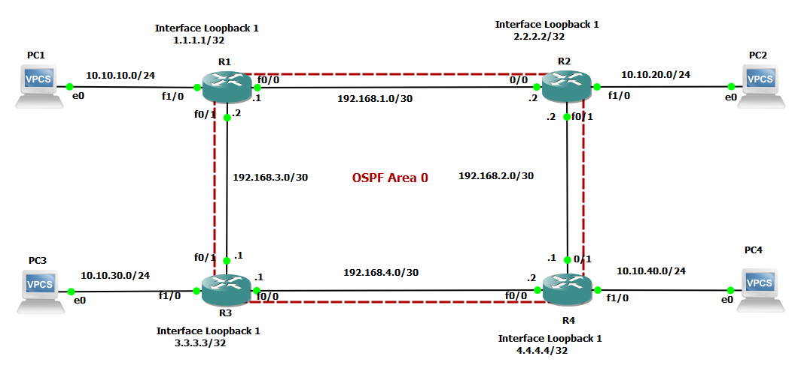
*____Figure 1. Test 1 Topology____*
>
____Commands and Expected Output:____

On R1, R2, R3, and R4:
Run the show IP OSPF command and observe the output. Expected Router-IDs according to OSPF standard Router-ID selection criterion given above should be like:

R1→ Router-ID = 1.1.1.1

R2→ Router-ID = 2.2.2.2

R3→ Router-ID = 3.3.3.3

R4→ Router-ID = 4.4.4.4
>

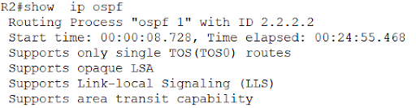

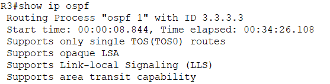

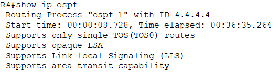
>
On R1:
Run the debug IP OSPF events command and observe the output. The OSPF neighbors go through eight different states starting from DOWN to FULL. Turn off the link between R2 & R1 and then Turn on the link so that the following OSPF messages can be seen:

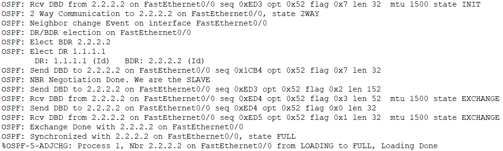

Run the show IP OSPF neighbor command and observe the output on Router R1.

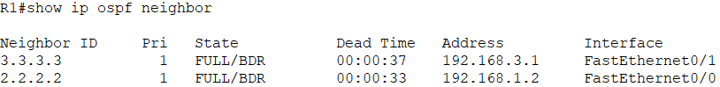

### Test Case # 2: Testing Route Sharing Within an OSPF  Area

In this test case, we will test the route sharing within an OSPF area. OSPF neighbors share routing information using Type 1 and Type 2 LSAs. In this test case, we will use the topology in figure 2 to verify the route sharing within an OSPF area. For intra-area routes, OSPF uses pure link-state logic, with full topology information about an area, piecing together the topology map from the Type 1 and Type 2 LSAs. This logic relies on all routers inside the area having an identical copy of the link-state database (LSDB) for that area. With the full topology, the shortest path first (SPF) algorithm can be run, finding all possible routes to each subnet.

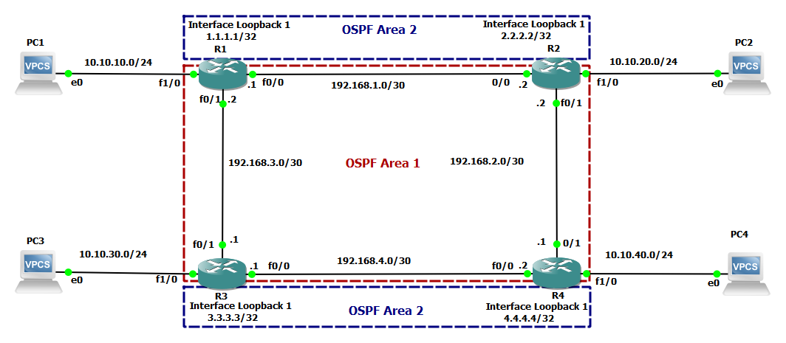
*____Figure 2. Test 2 Topology____*
>
Commands and Expected Output:

On any one of R1, R2, R3, and R4:
Run the show IP route command and observe the output. We will discuss the output of this command on R1. The routes starting with O are OSPF routes.
Note that the following routes (Loopback Interfaces) are not shown in the above routing table:

2.2.2.2 / 32

3.3.3.3 / 32

4.4.4.4 / 32

As we have configured loopback interfaces in OSPF area 2 and all other interfaces in all routers in OSPF area 1. The routes from different areas are shared only through backbone area 0. Therefore, due to the absence of area 0 routing information from different areas is not shared by the OSPF. Hence, loopback networks are not shared as evident from the routing table of R1. We will discuss inter-area routing in Test Case 3.

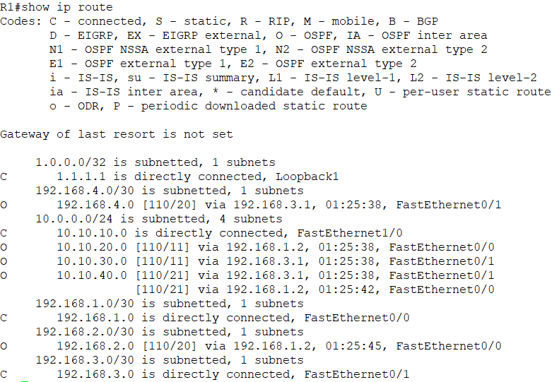

### Test Case # 3: Testing Inter-Area Route Distribution

OSPF uses distance vector logic for inter-area route calculation. The intra-area SPF calculation includes the calculation of the metric of the best route to reach each ABR in the area. To choose the best interarea route, a router uses distance vector logic of taking its known metric to reach the ABR and adds the metric for that subnet as advertised by the ABR. This means that no additional SPF calculation is required to find all inter-area routes for a given prefix/length, making this logic more like distance vector logic. In this test case, we will use the topology as shown in figure 3.

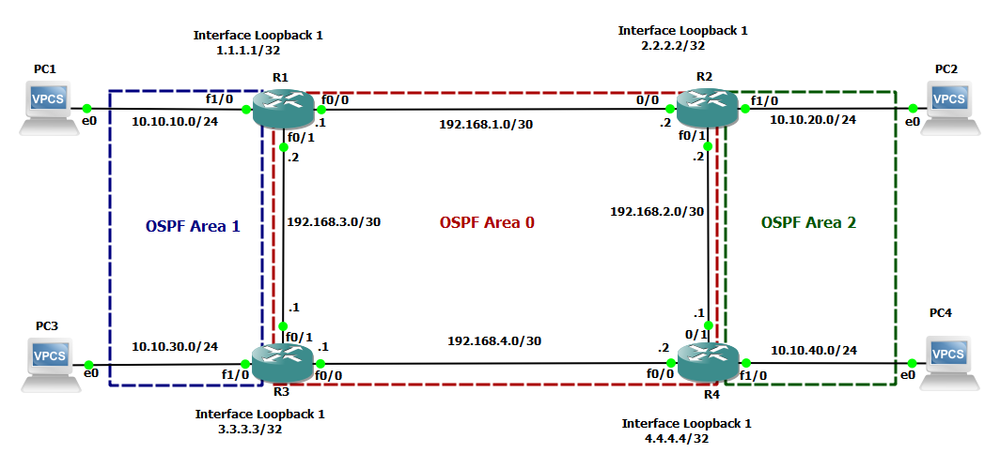
*____Figure 3. Test 3 Topology____*

____Commands and Expected Output:____

On any one of R1, R2, R3, and R4:
Run the show IP route command and observe the output. We will discuss the output of this command on R1. The routes starting with O belong to the connected area of router R1. The following routes belong to area 0 (backbone area) :

192.168.2.0 / 30          →         learned via Fa0/1 by R1

192.168.4.0 / 30          →        learned via Fa0/0 by R1

The routes starting with O  IA are OSPF inter-area routes. These routes belong to the areas which are not directly connected with the router R1 but are accessible through area 0. Following are the routes belonging to area 2 connected via area 0 on R1:

10.10.20.0 / 24        →         Area 2 route learned via Fa0/0 by R1

10.10.30.0 / 24     →         Area 1 route learned via Fa0/1 by R1

10.10.40.0 / 24    →         Area 2 route learned via Fa0/1 by R1

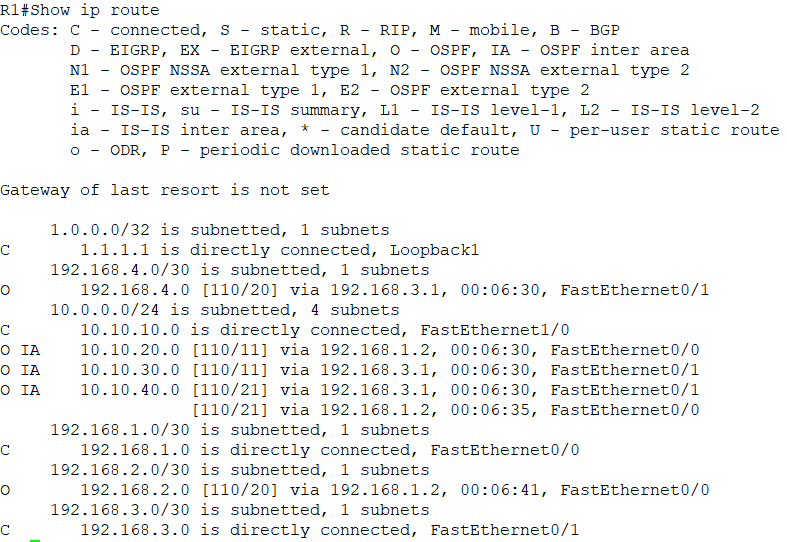

Run show IP OSPF neighbor command on R1 and observe the output

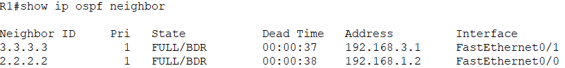

Both R2 and R3 are BDR means these routers will not advertise the respective networks i.e. R2 will not advertise 192.168.1.0/30 and R3 will not advertise 192.168.3.0/30. R1 being the DR will advertise both of the subnets.

Run show IP OSPF neighbor command on R2 and R3 to observe that R1 is designated router (DR) for both of the above-mentioned subnets:

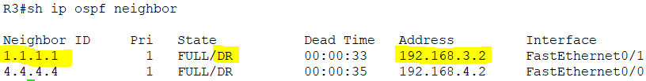

Run show IP OSPF database command on R4 to observe that both of the above-mentioned subnets are advertised by R1:

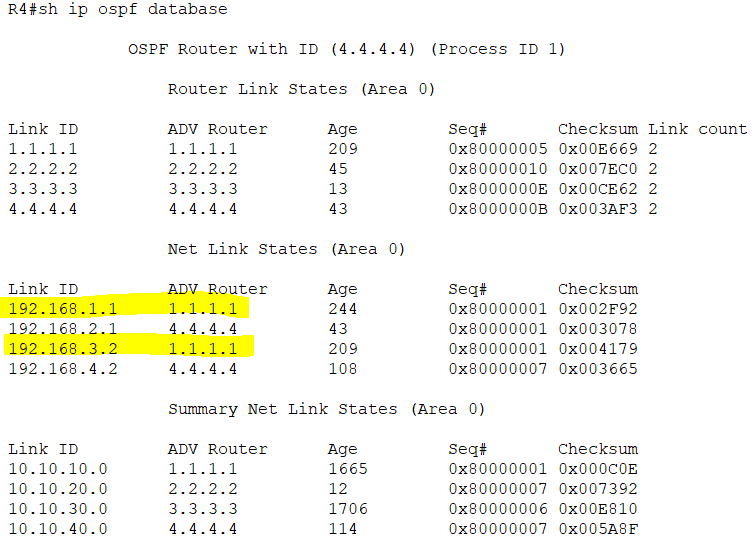

It is also important to note that subnets from 10.10.x.x / 24 are advertised by their respective routers as these routers are DR for these subnets.
>

### Test Case # 4: Testing Convergence Optimization

OSPF uses two timers to monitor the reachability of neighbors. With OSPF, the Hello interval defines how often the router sends a Hello on the interface. The Dead interval defines how long a router should wait, without hearing any Hello messages from a neighbor, before deciding that the neighbor failed. For example, with a default LAN interface Hello timer of 10 seconds, and a Dead interval of 40 seconds, the local router sends Hello messages every 10 seconds. The neighbor resets its downward-counting Hold timer to 40 upon receiving a Hello from that neighbor. Under normal operation on a LAN, with defaults, the Dead timer for a neighbor would vary from 40 down to 30, and then be reset to 40 upon receipt of the next Hello. However, if Hello messages were not received for 40 seconds, the neighborship would fail, driving convergence.

In this test we will consider the topology shown in figure 4, we will configure OSPF to set a lower Hello and Dead timer for faster convergence. Note that if the interface fails, OSPF will immediately realize that all neighbors reached through that interface have also failed and will not wait on the Dead timer to count down to 0.

In OSPF several types of information are sent within hello messages. A detailed list of fields is given below, not all of them are included in each Hello message depending on the network:

- OSPF router ID
- Stub area flag
- Hello interval
- Dead interval
- Subnet mask

List of neighbors reachable on the interface

- Area ID
- Router priority
- Designated router (DR) IP address
- Backup DR (BDR) IP address
- Authentication digest

Following fields must match between the neighboring router for completing the neighbor relationship:

- Interfaces’ primary IP addresses must be in the same subnet.
- Must not be passive on the connected interface.
- Must be in the same area.
- Hello interval/timer, plus Dead timer, must match.
- Router IDs must be unique.
- IP MTU must match.
- Must pass neighbor authentication (if configured).

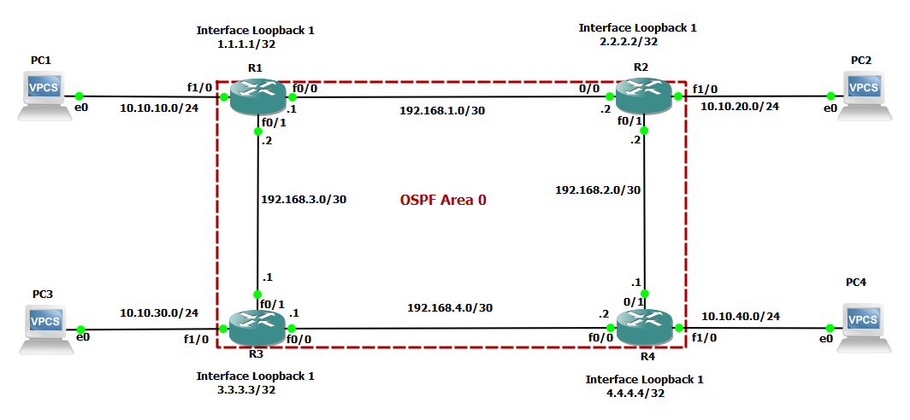
*____Figure 4. Test 4 Topology____*
>
____Commands and Expected Output:____

On R1:

Run the *show IP OSPF interface fa 0/0 route* command and observe the output. It shows the default OSPF hello and dead timer:

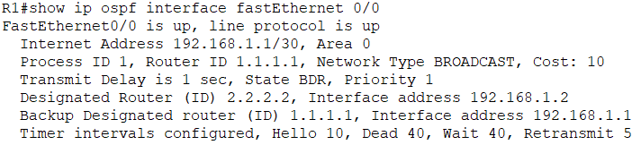

We will shut down fa 0/0 on R2 and observe the detection time of neighbor relationship failure on R1. Run the show IP OSPF neighbor command on R1 and observe the output. It is evident from the following snippet that dead time expired after 40 seconds and then R1 considered R2 neighbor down and removed it from its neighbor table.

>
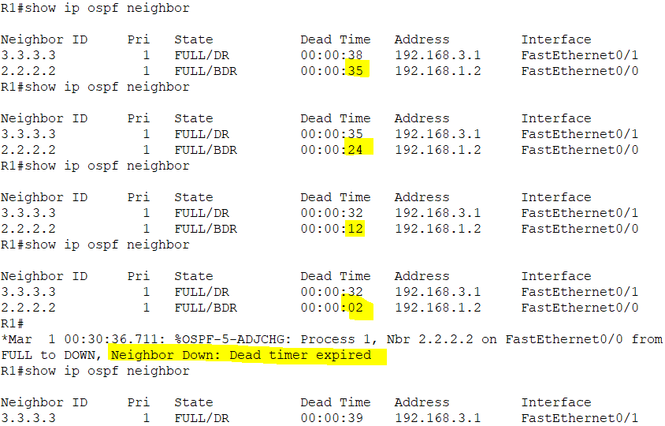

Now let's change the hello interval and dead timer values for fast convergence. Under fa 0/0 configuration mode on R1 and R2, *run ip ospf hello-interval* 2. This command will set the hello interval to 2 seconds and dead timer to 4xhello-interval i.e. 8 seconds.

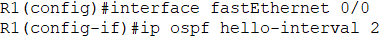
>
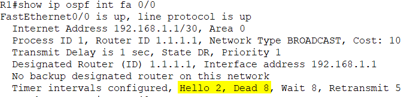

It can also be observed that as soon as we change the hello interval value on R1 the neighbor relationship will expire due to a mismatch of the hello interval field in the hello messages.

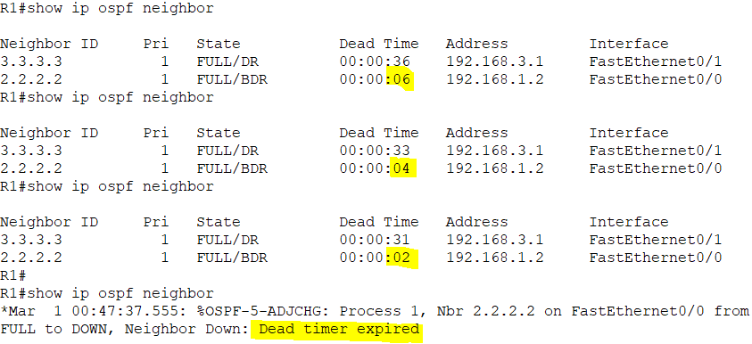
>
Now change the value of the hello interval on R2 as well to restore the neighbor relationship between R1 and R2.
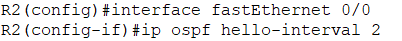
>

Now check on R1 if the neighbor relationship is restores using *show ip ospf neighbor* command:

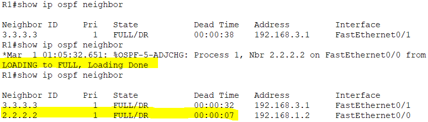

Note that the neighbor relationship is restored and the dead timer value is counting from 8 down to 0.  Using IP OSPF hello-interval command we can set hello-interval down to 1 second and dead timer to 4 seconds. We can set dead timer to 1 and hello interval to a fraction of a second using IP OSPF dead-interval minimal hello-multiplier multiplier command as shown below:
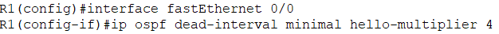
>
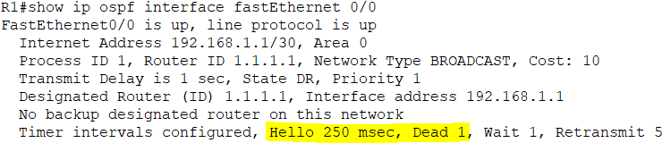
>

### Test Case # 5: Testing Virtual Links

OSPF area design requires the use of a backbone area, area 0, with each area connecting to area 0 through an ABR. However, in some cases, two backbone areas exist. In other cases, a non-backbone area might not have a convenient point of connection to the backbone area. The problems in each case have different symptoms, but the problems all stem from the area design requirements: Each area should be contiguous, and each non-backbone area should connect to the backbone area through an ABR. When the network does not meet these requirements, engineers could simply redesign the areas. However, OSPF provides an alternative tool called an OSPF virtual link.

An OSPF virtual link allows two ABRs that connect to the same non-backbone area to form a neighbor relationship through that non-backbone area, even when separated by many other routers and subnets. This virtual link acts as a virtual point-to-point connection between the two routers, with that link inside area 0. The routers form a neighbor relationship, inside area 0, and flood LSAs over that link.

In this test case, we will consider the topology as shown in figure 5. There are three areas: area 0, area 1, and area 2. Area 2 is not directly connected to area 0, thus routes from area 2 will not be available in area 1 and area 0.

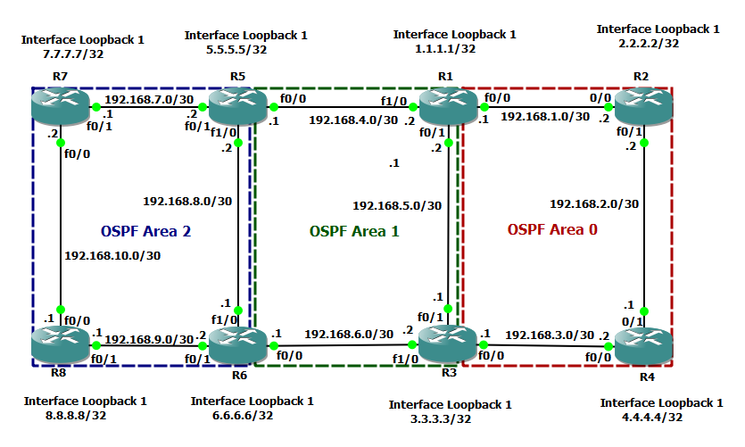
*____Figure 5. Test 5 Topology____*

____Commands and Expected Output:____

On R1:

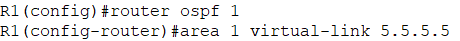
>
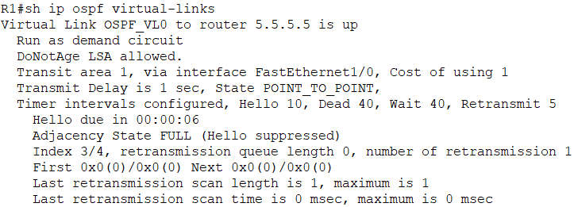
>
On R7:
Verify if routes from Area 0 have arrived in Area 2.

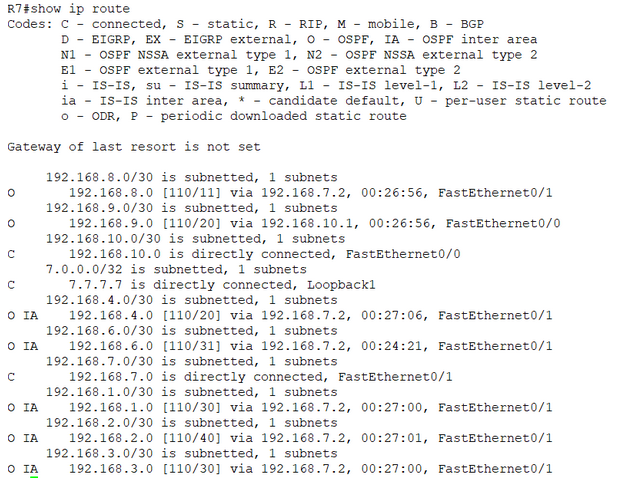

Following routes belongs to Area 0:

192.168.1.0/30

192.168.2.0/30

192.168.3.0/30

