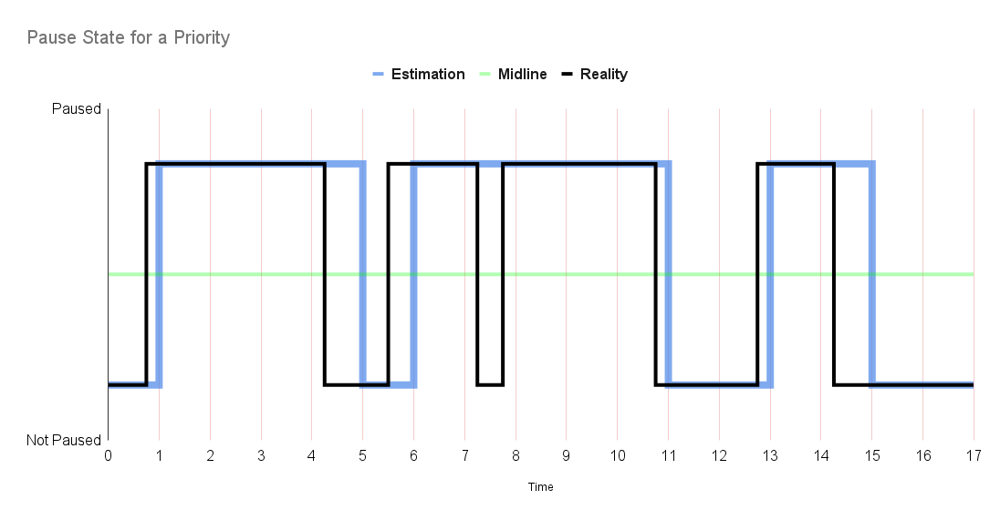
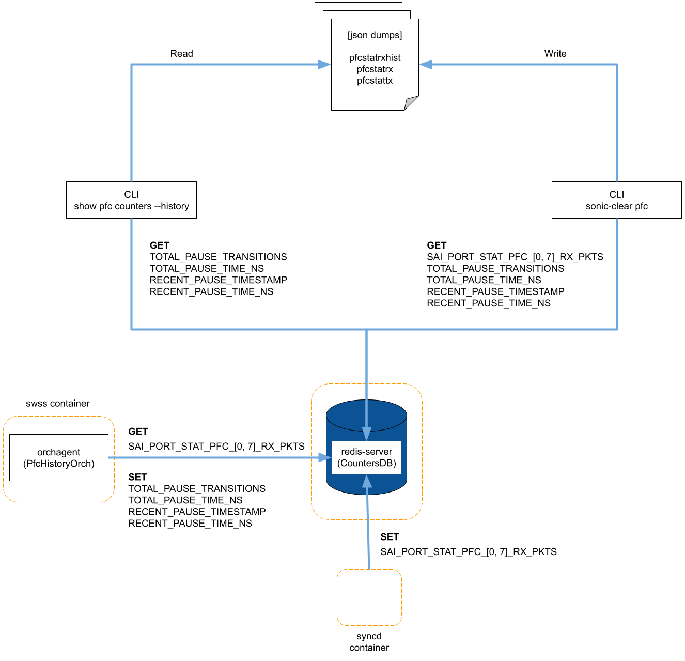
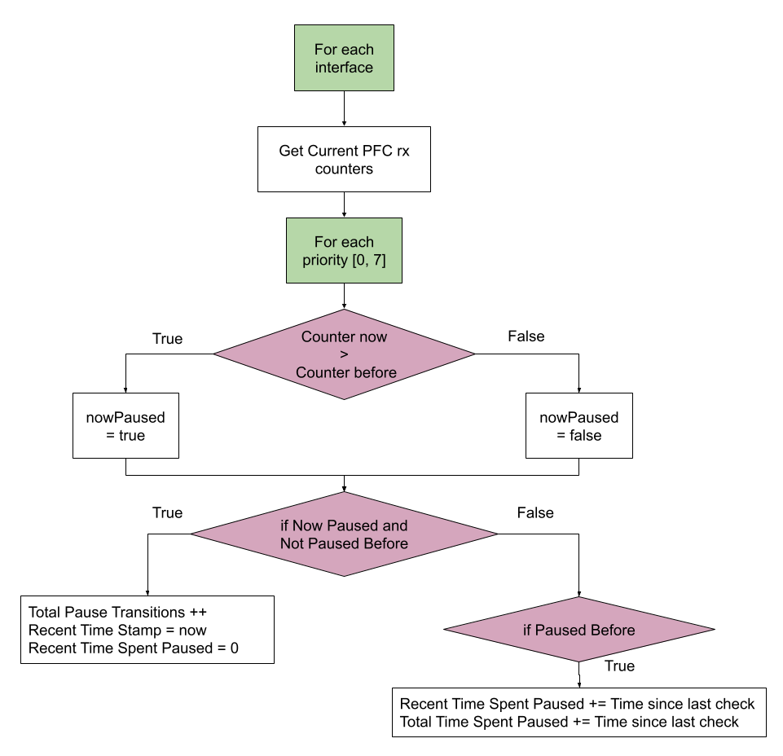

# PFC Historical Statistics

## Scope

This document describes the design of the PFC historical statistics feature and the usage of the added PFC counters history CLI to display the extrapolated historical data.

## Definitions/Abbreviations

| Term | Meaning |
| :---- | :---- |
| PFC | Priority Flow Control |
| SAI | Switch Abstraction Interface |
| RX | Receive |

## Overview

Approximate PFC historical statistics will be extrapolated by polling the existing PFC RX counters stored in COUNTERS\_DB. We will use these counters to infer whether each priority group is currently paused or not at time of polling.

These existing counters are incremented when pause frames are received at the granularity of priorities 0-7 for each interface on the switch. 

A new orch agent named "PfcHistoryOrch" will poll COUNTERS\_DB every 1 second to investigate if PFC activity has occurred on any interface.   
It will use the existing RX counters to calculate values for 4 new fields storing historical data in COUNTERS\_DB. Each field will exist for each priority (4 fields \* 8 priorities \= 32 new fields per interface).

`TOTAL_PAUSE_TRANSITIONS`: Running total number of transitions from unpaused to paused  
`TOTAL_PAUSE_TIME_MS`: Total time spent paused, in milliseconds  
`RECENT_PAUSE_TIMESTAMP`: Timestamp of the most recent transition from unpaused to paused, in milliseconds since Linux epoch  
`RECENT_PAUSE_TIME_MS`: Time spent paused after the most recent transition from unpaused to paused, in milliseconds

Note that these will only track the history of **received** pause frames and not those transmitted.

  

A simplified example of how this software estimation works for one priority queue can be seen above. The dark pulse shows a hypothetical scenario displaying the periods of time a priority is paused or unpaused. The blue pulse shows what PfcHistoryOrch would estimate the wave to look like. The x-axis shows the time steps when PfcHistoryOrch polls COUNTERS\_DB.

The pulse transitions from Not Paused to Paused when a Pause Frame is received for this priority. The pulse remains paused for the period of time specified by that frame. Receiving the frame causes the RX counter to increment in hardware and this is exposed in COUNTERS\_DB. A stream of frames must be sent for extended pause periods. Our assumption is that if the counter increments between polls then this queue is currently paused.

Between times 0 and 1 the queue transitions to being Paused. At time step 1 when PfcHistoryOrch polls COUNTERS\_DB it will see that PFC activity has occurred and will assume the queue is now paused. between times 1 and 2, 2 and 3, 3 and 4 a continuous flow of pause frames is being received so PfcHistoryOrch will correctly estimate that this queue is paused. 

In this scenario the pause stream terminates before timestep 4 and the queue becomes unpaused between steps 4 and 5\. PfcHistoryOrch will then see that no packets have arrived between 4 and 5\.

This example also displays the common situation that will arise due to the coarse granularity of 1 second polling. Between timesteps 7 and 8 the queue unpauses but the PfcHistoryOrch will not know because frames were sent in that time period.

### Usage

This data will be accessible from the show CLI using `show pfc counters --history`.  
Additionally history will be cleared alongside the pfc counters when using the `sonic-clear pfc` command, meaning total time and total transitions will be set to 0 (through a diff with the saved cache, no writes to the database occur from the CLI). The recent time and timestamp will not be cached and therefore are not affected by sonic-clear.

## Architecture Design

  

### 

### sonic-swss

Introduction of a new orch agent, PfcHistoryOrch, which is executed every 1 second to investigate PFC activity since it last ran.  
  

The statistic calculations work like so:

* Every 1 second, PfcHistoryOrch polls CountersDB for each interface. It checks the RX counter for each priority to see if there has been PFC activity (i.e. check if the counter has increased since the last poll).   
* If there was activity for this priority, then we assume that this priority queue has been paused for the duration since the last check.   
* Otherwise, we assume that the queue was not paused during that duration. The orch stores whether each queue is currently paused for each interface and uses this to determine if a new transition has occurred since the last check and also to create the timestamp for the startpoint of the most recent PFC activity.

### sonic-utilities

Addition of a \--history option to the show pfc counters CLI. The 4 new fields for each of the 8 priorities will be printed for each interface.   
`show pfc counters --history` will display the historical stats since the last clear  
`sonic-clear pfc` will now also cache the current total time and total number of transitions in the same way it did with the existing counters, meaning \--history will show the historical data since the last clear.

`show pfc counters` calls the `pfcstat.py` script under the hood. This is where all the major changes were actually made.   
The history option was built to work in conjunction with the existing options for pfcstat like so:

```
usage: pfcstat [-h] [-c] [-d] [-s SHOW] [-n NAMESPACE] [-v]
               [--history]

Display the pfc counters

options:
  -h, --help            show this help message and exit
  -c, --clear           Clear previous stats and save new ones
  -d, --delete          Delete saved stats
  -s SHOW, --show SHOW  Display all interfaces or only external interfaces
  -n NAMESPACE, --namespace NAMESPACE
                        Display interfaces for specific namespace
  -v, --version         show program's version number and exit
  --history             Display historical PFC statistics

Examples:
  pfcstat
  pfcstat -c
  pfcstat -d
  pfcstat -n asic1
  pfcstat -s all -n asic0
  pfcstat --history
  pfcstat -n asic1 --history
  pfcstat -s all -n asic0 --history
```

The default values for SHOW and NAMESPACE are to show all interfaces across all namespaces. Examples can be seen in the unit test cases below.

## High Level Design

* This is a built in SONiC feature  
* Sub-modules modified: `sonic-swss` and `sonic-utilities`  
* SWSS Changes:  
  * Added a new orch agent executed by an ExecutableTimer every 1 second  
  * This agent was added as a makefile target and to OrchDaemon's orch list  
* DB and Schema changes:   
  * `COUNTERS_DB`: Added the following 32 key-value string fields to each hash for each interface in the counters table (`COUNTERS:oid:<oid>`):  
    `SAI_PORT_STAT_PFC_[0, 7]_TOTAL_PAUSE_TRANSITIONS`  
    `SAI_PORT_STAT_PFC_[0, 7]_TOTAL_PAUSE_TIME_MS`  
    `SAI_PORT_STAT_PFC_[0, 7]_RECENT_PAUSE_TIMESTAMP`  
    `SAI_PORT_STAT_PFC_[0, 7]_RECENT_PAUSE_TIME_MS`

## SAI API

No changes made. 

However, some hardware has the capability to track this PFC historical data. In the future, SAI changes to expose this data can be made in place of the software estimation and the CLI will continue to be functional.

## Configuration and management

The PfcHistoryOrch can be enabled or disabled through Config DB. It is disabled by default 

### CLI/YANG model Enhancements

An additional config cli command was added to enable or disable the feature:  
`config pfc-stat-history enabled`  
`config pfc-stat-history disabled`  
This entails a new YANG model addition for CONFIG\_DB

The current status can be seen with the following:  
`show pfc counters history-status`

```c
Pfc Historical Statistics
---------------------------  --------
Status:                      disabled
```

### Config DB Enhancements

Addition of PFC\_STAT\_HISTORY|CONFIG to CONFIG\_DB. The PfcHistoryOrch watches this table.

```javascript
{
    "PFC_STAT_HISTORY": {
        "CONFIG": {
            "status": "disabled"
        }
    }
}
```

## CPU & Memory Consumption

### Methodology

Cursory analysis was performed on a T0 DUT.  
Specs:  
2 core 4 thread 2.20 GHz CPU  
8GB RAM

Top command was run, default refresh rate of 3 seconds for approximately 90 minutes, or 1800 refreshes.  
Simultaneously continuous pause frames were sent to the DUT across multiple interfaces on multiple priorities to ensure database writing would test the feature under load.

### Results

|  | 202411 With PfcHistoryOrch | 202411 Without PfcHistoryOrch |
| :---: | :---: | :---: |
| **Average %CPU** | 5.0 | 0.1 |
| **Average %MEM** | 0.2 | 0.2 |

There was an increase in CPU usage, hence the additional requirement of being able to enable and disable the feature was added.

## Testing

### Unit Test cases

Test cases involve running the following sequences of commands and matching the output against the expected output based on the mock counters\_db.json files.

* Single ASIC test cases:  
  * show pfc counters \--history  
  * sonic-clear pfc  
    show pfc counters \--history  
  * pfcstat \-c  
    pfcstat \-s all \--history  
* Multi ASIC test cases:  
  * show pfc counters \--history  
  * sonic-clear pfc  
    show pfc counters \--history  
  * pfcstat \-s frontend \--history  
  * pfcstat \-n asic0 \--history  
  * pfcstat \-n asic0 \-s all \--history  
  * pfcstat \-c  
    pfcstat \-s all \--history