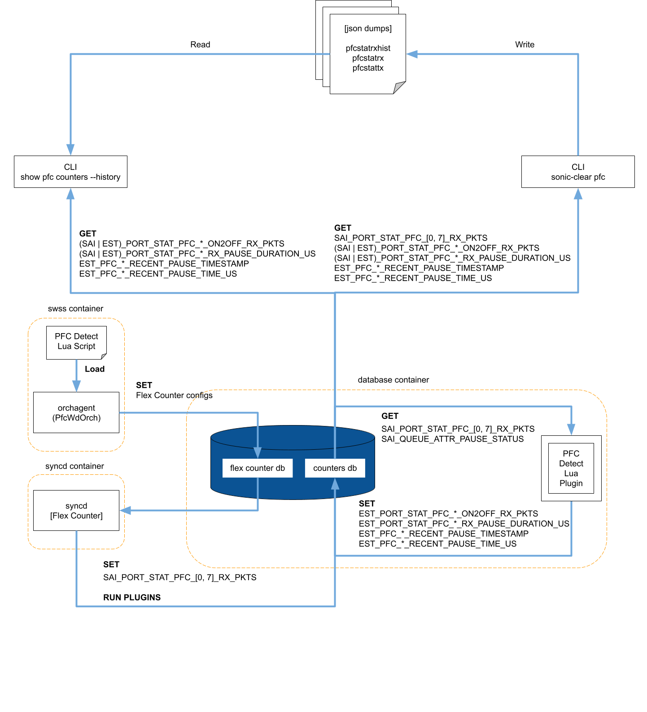
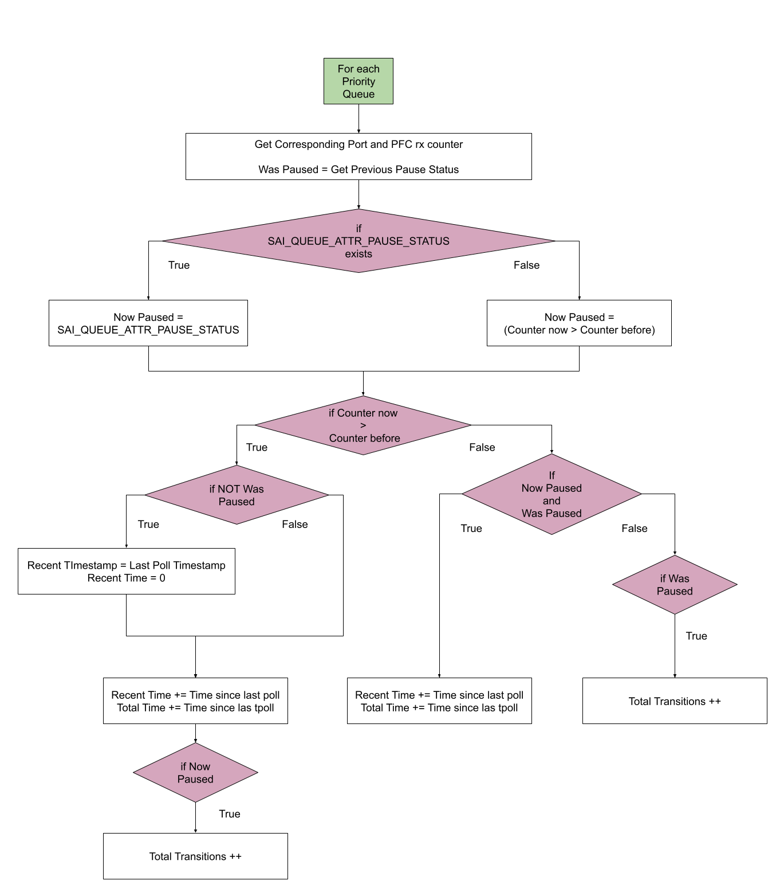

# PFC Historical Statistics

## Scope

This document describes the design of the PFC historical statistics feature being added to the PFC Watchdog and the usage of the added PFC counters history CLI to display the extrapolated historical data.

## Definitions/Abbreviations

| Term | Meaning |
| :---- | :---- |
| PFC | Priority Flow Control |
| PFCWD | PFC Watchdog |
| SAI | Switch Abstraction Interface |
| RX | Receive |

## Overview

The PFCWD will gain the optional functionality to investigate and record historical PFC activity on ports that it is enabled on. 

The current implementation is for **Broadcom platforms only** but the descriptions provided in this document are intended to provide the details necessary to port this feature to other platforms.

When pfc stat history is enabled, approximate PFC historical statistics will be extrapolated by polling the existing SAI supported PFC stats stored in COUNTERS\_DB. These existing statistics are incremented and adjusted when pause frames are received at the granularity of priorities 0-7 for each configured interface on the switch.

On a per-platform-support basis, it will make use of

* Existing Port Stat RX counters (`SAI_PORT_STAT_PFC_*_RX_PKTS`)  
* Existing Queue Attribute Pause Status (`SAI_QUEUE_ATTR_PAUSE_STATUS`)

In order to estimate the four following fields per port, per priority:

* `EST_PORT_STAT_PFC_*_ON2OFF_RX_PKTS`: Running total number of transitions from paused to unpaused  
  * No need to estimate if `SAI_PORT_STAT_PFC_*_ON2OFF_RX_PKTS` already exists as the CLI will read the SAI statistic instead  
* `EST_PORT_STAT_PFC_*_RX_PAUSE_DURATION_US`: Total time spent paused, in microseconds  
  * No need to estimate if `SAI_PORT_STAT_PFC_*_RX_PAUSE_DURATION_US` already exists as the CLI will read the SAI statistic instead  
* `EST_PORT_STAT_PFC_*_RECENT_PAUSE_TIMESTAMP`: Timestamp of the most recent transition from unpaused to paused, in floating point seconds since Linux epoch  
* `EST_PORT_STAT_PFC_*_RECENT_PAUSE_TIME_US`: Time spent paused after the most recent transition from unpaused to paused, in microseconds

Not all platforms support all of these SAI stats and attributes, so the script must take what it has access to into account. In the case of Broadcom platforms Pause Status and On2Off transitions are both provided by the SAI.

NOTE: These will only track the history of **received** pause frames and not those transmitted.

At each poll 3 pieces of information are used to make the estimation:

* Was Paused: Was the queue paused at the previous poll  
* PFC Activity: Did the queue receive Pause Frames since the last poll  
* Now Paused: Is the queue currently paused at this poll

#### Estimations Based on Pause Activity

| Was Paused | PFC Activity | Now Paused | Estimations | Notes | EX (See Pause State for a Priority figures below) |
| :---- | :---- | :---- | :---- | :---- | :---- |
| T | T | T | Pause Duration \+= Time since last poll<br> Recent Time \+= Time since last poll |  | Timestep 8 |
| T | T | F | Pause Duration \+= Time since last poll<br> Recent Time \+= Time since last poll<br> On2Off Transitions \++ |  | Timestep 3 |
| T | F | T | Pause Duration \+= Time since last poll<br> Recent Time \+= Time since last poll | Using RX counters only can't pick this up<br> Unlikely to happen, polling interval would have to be 10s of MS | Timestep 11 |
| T | F | F | On2Off Transitions \++ |  | Timestep  6 |
| F | T | T | Total Time \+= Time since last poll<br> Recent Time \+= Time since last poll<br> Recent Timestamp \= Time at last poll |  | Timestep  2 |
| F | T | F | Total Time \+= Time since last poll<br> Recent Time \+= Time since last poll<br> Recent Timestamp \= Time at last poll<br> On2Off Transitions \++ | Using RX counters only can't pick this up<br> Platforms with pause status benefit because it will have a more accurate depiction of recent activity and number of transitions | Timestep 4 |
| F | F | T |  | Impossible situation, Now paused can not become true without PFC Activity prior |  |
| F | F | F |  |  | Timestep 13 |

In the universal situation, we use only the RX counters to estimate history. Consider a simplified example of how this software estimation works for one priority queue can be seen above like so:

* `Was Paused 	= Now Paused from the last poll`  
* `PFC Activity 	= Counters Now > Counters Last`  
* `Now Paused 	= PFC Activity`

  

The dark pulse shows a hypothetical scenario displaying the periods of time a priority is paused or unpaused. The blue pulse shows what we would estimate the wave to look like. The x-axis shows the time steps when the Flex Counter (run by syncd) polls COUNTERS\_DB. The red points provide an example of times at which a Pause Frame is received, pausing this queue.

The pulse transitions from ‘Not Paused’ to ‘Paused’ when a Pause Frame is received for this priority. The pulse remains paused for the period of time specified by that frame. Receiving the frame causes the RX counter to increment. A stream of frames must be sent for extended pause periods. 

When using only the RX counters, our assumption is that if we received pause frames between polls then the priority queue is paused now and has been paused for the duration since the last poll.

Compare this to the same example but the Pause Status Queue Stat is exposed by the SAI. This reduces the assumption to be only that if we received pause frames between polls then the priority queue has been paused for the duration since the last poll.

* `Was Paused 	= Now Paused from the last poll`  
* `PFC Activity 	= Counters Now > Counters Last`  
* `Now Paused 	= SAI_QUEUE_ATTR_PAUSE_STATUS`

  

Access to the current pause state provides benefits for the following situations:

1) PFC activity **was** received between polls but the queue **is not** currently paused  
   1) EX) See poll at timestep 3 and poll at timstep 4  
   2) In this scenario using only the RX counters would not pick up that a new Recent Pause period had started and that at least 1 transition had occurred since the last poll  
2) PFC activity **was not** received between polls but the queue **is** currently paused  
   1) EX) See poll at timestep 11  
   2) In this scenario using only the RX counters would not pick up that the queue had been paused for the entire duration of the polling period and would estimate that a transition had occurred

### Usage

This data will be accessible from the show CLI using `show pfc counters --history`.  
Additionally history will be cleared alongside the pfc counters when using the `sonic-clear pfc` command, meaning total time and total transitions will be set to 0 (through a diff with the saved cache, no writes to the database occur from the CLI). The recent time and timestamp will not be cached and therefore are not affected by sonic-clear.

## Architecture Design

  

### sonic-swss

The PfcWdOrch's detect script will be updated to also estimate historical data when the feature is enabled. Enabling is done through the CLI at a per-port level

### sonic-sairedis

No changes, but syncd's flex counter mechanism runs the lua plugin. The detect lua script loops over all queues monitored by the PFCWD. The history functionality works like so:  
  

* Every polling interval, the PFCWD Flex Counter will update the counters in COUNTERS\_DB   
* The lua script is passed the list of priority queue OIDs to check. The RX counter for each priority is read from the Port Stats in COUNTERS\_DB to see if there has been PFC activity (i.e. check if the counter has increased since the last poll).   
* If the Queue Pause Status is provided by the SAI then it will be used to determine the current state of the queue, otherwise the current pause state will be estimated based on whether paused frames were received since the last poll  
* The statistics are then updated based on truth table "Estimations Based on Pause Activity"  
* NOTE: for simplicity sake the checks for sai supported "Total Transitions" and "Total Time" were omitted, but these fields are updated only if the SAI does not already expose them (in the case of broadcom support there is no need to track total transitions)

### sonic-utilities

Addition of a \--history option to the show pfc counters CLI. The 4 new fields for each of the 8 priorities will be printed for each interface.   
`show pfc counters --history` will display the historical stats since the last clear  
`sonic-clear pfc` will now also cache the current total time and total number of transitions in the same way it did with the existing counters, meaning \--history will show the historical data since the last clear.

```
       Port    Priority    RX Pause Transitions    Total RX Pause Time US    Recent RX Pause Time US    Recent RX Pause Timestamp

  Ethernet0        PFC0                     N/A                       N/A                        N/A                          N/A
  Ethernet0        PFC1                     N/A                       N/A                        N/A                          N/A
  Ethernet0        PFC2                     N/A                       N/A                        N/A                          N/A
  Ethernet0        PFC3                       6                 1,430,570                    527,739  03/25/2025, 17:22:37.982800
  Ethernet0        PFC4                       6                 1,328,012                    425,181  03/25/2025, 17:22:37.982800
  Ethernet0        PFC5                     N/A                       N/A                        N/A                          N/A
  Ethernet0        PFC6                     N/A                       N/A                        N/A                          N/A
  Ethernet0        PFC7                     N/A                       N/A                        N/A                          N/A

  Ethernet4        PFC0                     N/A                       N/A                        N/A                          N/A
  Ethernet4        PFC1                     N/A                       N/A                        N/A                          N/A
  Ethernet4        PFC2                     N/A                       N/A                        N/A                          N/A
  Ethernet4        PFC3                       0                       N/A                        N/A                          N/A
  Ethernet4        PFC4                       0                       N/A                        N/A                          N/A
  Ethernet4        PFC5                     N/A                       N/A                        N/A                          N/A
  Ethernet4        PFC6                     N/A                       N/A                        N/A                          N/A
  Ethernet4        PFC7                     N/A                       N/A                        N/A                          N/A
```

`show pfc counters` calls the `pfcstat.py` script under the hood. This is where the major logic changes are made.   
The history option was built to work in conjunction with the existing options for pfcstat like so:

```
usage: pfcstat [-h] [-c] [-d] [-s SHOW] [-n NAMESPACE] [-v]
               [--history]

Display the pfc counters

options:
  -h, --help            show this help message and exit
  -c, --clear           Clear previous stats and save new ones
  -d, --delete          Delete saved stats
  -s SHOW, --show SHOW  Display all interfaces or only external interfaces
  -n NAMESPACE, --namespace NAMESPACE
                        Display interfaces for specific namespace
  -v, --version         show program's version number and exit
  --history             Display historical PFC statistics

Examples:
  pfcstat
  pfcstat -c
  pfcstat -d
  pfcstat -n asic1
  pfcstat -s all -n asic0
  pfcstat --history
  pfcstat -n asic1 --history
  pfcstat -s all -n asic0 --history
```

The default values for SHOW and NAMESPACE are to show all interfaces across all namespaces. Examples can be seen in the unit test cases in the Testing section below.

## High Level Design

* This is a built in SONiC feature  
* Sub-modules modified: `sonic-swss` and `sonic-utilities`  
* SWSS Changes:  
  * pfc\_detect\_broadcom.lua (loaded by PfcWdOrch and run on redis-db) updated to estimate PFC statistical history  
  * The PfcWdOrch watches for the per-port configuration where the pfc\_stat\_history setting will take a value of "enable|disable"

### DB and Schema changes: 

#### `COUNTERS_DB`: 

The `TIMESTAMP` table is updated with a `PFCWD_POLL_TIMESTAMP_last` entry with the timestamp of the last poll in Microseconds since Epoch.

Estimated Statistics and attributes are written to the COUNTERS table (`COUNTERS:oid:<oid>`)

* Entries are populated by the lua script and displayed by the `show pfc counters --history` cli.

```
COUNTERS: {
  // Port
  oid:0x1000000000041: {
    EST_PORT_STAT_PFC_*_ON2OFF_RX_PKTS: 0,
    EST_PORT_STAT_PFC_*_RX_PAUSE_DURATION_US: 0,
    EST_PORT_STAT_PFC_*_RECENT_PAUSE_TIME_US: 0,
    EST_PORT_STAT_PFC_*_RECENT_PAUSE_TIMESTAMP: 0,

    SAI_PORT_STAT_PFC_*_RX_PKTS_last: 0,
  },
  // Queue
  oid:0x0000000000030 : {
    (SAI|EST)_QUEUE_ATTR_PAUSE_STATUS_last: true
  }
    ...
}
```

`SAI_PORT_STAT_PFC_*_RX_PKTS_last` and `(SAI|EST)_QUEUE_ATTR_PAUSE_STATUS_last` are meta data fields used to compute the other four estimations as needed. The PFCWD already provided these SAI metadata fields as part of storm detection.

The PFCWD clears out all `_last` fields from `COUNTERS_DB` on reboot. This ensures that data from an out-dated poll will not affect the statistics.

#### `CONFIG_DB`: 

The `PFC_WD` table's Port entries will now contain a `pfc_stat_history` field.

```
PFC_WD: {
  GLOBAL: {
    POLL_INTERVAL: 400,
    BIG_RED_SWITCH: disable
  },
  Ethernet8: {
    "action": "drop",
    "detection_time": "100",
    "restoration_time": "400",
    "pfc_stat_history": "enable"
  },
  Ethernet16: {
    "action": "drop",
    "detection_time": "100",
    "restoration_time": "400",
    "pfc_stat_history": "disable"
  }
}
```

## SAI API

No changes made. 

## Configuration and Management

`$ config pfcwd pfc_stat_history <enable/disable> [ports]`

`$ config pfcwd start <ports> --pfc-stat-history`  
	This flag indicates to also enable history tracking on the ports being started

NOTE: history could be enabled or disabled on any port, but until the watchdog is started on those ports history will not be estimated.

```
$ config pfcwd pfc_stat_history enable Ethernet0
$ show pfcwd config
     PORT    ACTION    DETECTION TIME    RESTORATION TIME    HISTORY
---------  --------  ----------------  ------------------  ---------
Ethernet0       N/A               N/A            infinite     enable

$ config pfcwd start Ethernet0 400
$ show pfcwd config
     PORT    ACTION    DETECTION TIME    RESTORATION TIME    HISTORY
---------  --------  ----------------  ------------------  ---------
Ethernet0      drop               400                 800     enable
```

## CPU & Memory Consumption

No analysis performed.

## Testing 

### Unit Test cases

Test cases involve running the following sequences of commands and matching the output against the expected output based on the mock counters\_db.json and config\_db.json files.

pfcstat tests:

* Single ASIC test cases:  
  * show pfc counters \--history  
  * sonic-clear pfc  
    show pfc counters \--history  
  * pfcstat \-c  
    pfcstat \-s all \--history  
* Multi ASIC test cases:  
  * show pfc counters \--history  
  * sonic-clear pfc  
    show pfc counters \--history  
  * pfcstat \-s frontend \--history  
  * pfcstat \-n asic0 \--history  
  * pfcstat \-n asic0 \-s all \--history  
  * pfcstat \-c  
    pfcstat \-s all \--history

pfcwd tests:

* Single ASIC test cases:  
  * pfc\_stat\_history command valid:   
    * pfcwd pfc\_stat\_history enable \<ports\>  
  * start command with history flag valid:   
    * pfcwd start \<ports\> \<detection-time\> \--pfc-stat-history  
  * pfc\_stat\_history command on non-pfc-enabled port invalid:   
    * pfcwd pfc\_stat\_history enable \<ports\>  
  * pfc\_stat\_history command on non-existing ports invalid:   
    * pfcwd pfc\_stat\_history enable \<ports\>  
  * start command with history flag on non-pfc-enabled port invalid:   
    * pfcwd start \<ports\> \<detection-time\> \--pfc-stat-history  
  * start command with history flag on non-existing ports invalid:   
    * pfcwd start \<ports\>\<detection-time\> \--pfc-stat-history  
* Multi ASIC test cases:  
  * pfc\_stat\_history command without root invalid  
    * pfcwd pfc\_stat\_history enable \<ports\>  
  * pfc\_stat\_history command valid:   
    * pfcwd pfc\_stat\_history enable Ethernet0, Ethernet-BP4  
  * start command with history flag valid:   
    * pfcwd start \<ports\> \<detection-time\> \--pfc-stat-history  
  * pfc\_stat\_history command on non-pfc-enabled port invalid:   
    * pfcwd pfc\_stat\_history enable \<ports\>  
  * pfc\_stat\_history command on non-existing ports invalid:   
    * pfcwd pfc\_stat\_history enable \<ports\>  
  * start command with history flag on non-pfc-enabled port invalid:   
    * pfcwd start \<ports\> \<detection-time\> \--pfc-stat-history  
  * start command with history flag on non-existing ports invalid:   
    * pfcwd start \<ports\>\<detection-time\> \--pfc-stat-history