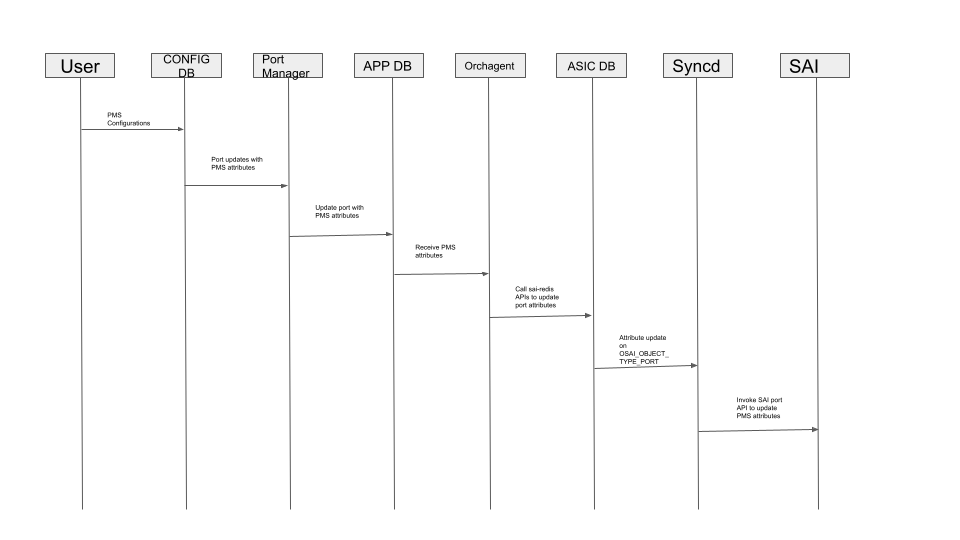
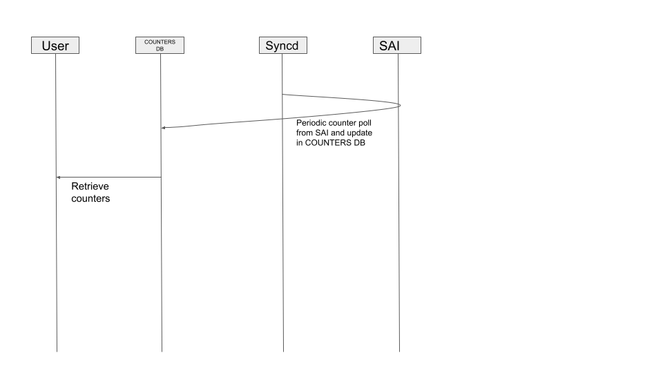

# Feature Name

Port Mac Security

# High Level Design Document

#### Rev 0.1

# Table of Contents

  * [List of Tables](#list-of-tables)
  * [Revision](#revision)
  * [About This Manual](#about-this-manual)
  * [Scope](#scope)
  * [Definition/Abbreviation](#definitionabbreviation)
    * [Table 1: Abbreviations](#table-1-abbreviations)
  * [Requirements Overview](#requirement-overview)
    * [Functional Requirements](#functional-requirements)
    * [Configuration and Management Requirements](#configuration-and-management-requirements)
    * [Scalability Requirements](#scalability-requirements)
    * [Warm Boot Requirements](#warm-boot-requirements)
  * [Functionality](#-functionality)
    * [Functional Description](#functional-description)
  * [Design](#design)
    * [Overview](#overview)
      * [PMS Configurations](#pms-configurations)
      * [PMS Show Command](#pms-show-command)
    * [DB Changes](#db-changes)
      * [CONFIG DB](#config-db)
      * [APP DB](#app-db)
      * [COUNTERS DB](#counters-db)
    * [SAI](#sai)
      * [New Enum for violation action](#new-enum-for-violation-action)
      * [New attributes in sai_port_attr_t](#new-attributes-in-sai_port_attr_t)
    * [YANG model](#yang-model)
      * [Configurations](#configurations)
      * [Show](#show)
  * [Flow Diagrams](#flow-diagrams)
  * [Serviceability and Debug](#serviceability-and-debug)
  * [Warm Boot Support](#warm-boot-support)
  * [Scalability](#scalability)
  * [Industry standard CLI](#industry-standard-cli)
  * [Unit Test](#unit-test)

# List of Tables

[Table 1: Abbreviations](#table-1-abbreviations)

# Revision

| Rev  |    Date    |      Author      | Change Description |
| :--: | :--------: | :--------------: | ------------------ |
| 0.1  | 09/22/2021 | Anil Pandey      | Initial version    |

# About this Manual

This document provides general information about the Port Mac Security feature enhancement in SONiC.

# Scope

This document describes the high level design of Port Mac Security feature. 

# Definition/Abbreviation

## Table 1: Abbreviations

| **Term** | **Meaning**                  |
| -------- | ---------------------------- |
| PMS      | Port Mac Security            |
| SAI      | Switch Abstraction Interface |
| FDB      | Forwarding database          |

# 1 Requirements Overview

## 1.1 Functional Requirements

- Configuration to enable port security on a port. 
- Configuration to set the maximum number of allowed MAC addresses on a port. 
- Configuration to specify the action to be taken when more than the allowed number of mac addresses is attempted to be learnt on the port. 
- Violation actions to be supported are as follows;
	- Protect: The violating packets are dropped.
    - Restrict: The violating packets are dropped, and a violation counter is incremented for each violation.
    - Shutdown: The port is administratively shut down.

## 1.2 Configuration and Management Requirements

This feature will support REST based configurations.

## 1.3 Scalability Requirements

None

## 1.4 Warm Boot Requirements

Warm boot should be supported.

# 2 Functionality

## 2.1 Functional Description

- Violation action to be taken when more than the allowable number MAC is learned on the port. Default action is to drop all unknown MAC traffic on the port in HW after crossing the user specified threshold (Protect).
  The action will be reversed when the number of MAC entries reduces below the user specified threshold either due to mac aging or due to fdb flush.  
  A warning syslog will be generated to notify users at the time of the maximum allowed MAC threshold is crossed.
  The first violating mac may still get flooded temporarily until the action is taken and HW is programmed.

- MAC aging is based on system level MAC aging time configuration, there is no per port MAC age time support. 

# 3 Design

## 3.1 Overview

### 3.1.1 PMS configurations
  PMS attributes will be set on port table in config db and then will be propagated to APP_DB by Port Manager.
  Portsorch will set the corresponding attribute in ASIC DB, which in turn will be passed to SAI by syncd by using port attribute set API.

### 3.1.2 PMS show command
  PMS show command will retrieve all the relevant counters from the counters db. This information in counters db will be populated by syncd.
  Syncd will pull the relevant counters periodically from SAI.

## 3.5 DB Changes

This section describes the changes made to different DBs for supporting this feature.

### 3.5.1 CONFIG DB

Following CONFIG DB schemas are defined for supporting this feature.

### PORT_TABLE

    ;Stores PMS configuration per interface
    key                 = PORT|"ifname"  
    pms_enable          = "yes"/"no"       ; PMS enable on the port
    pms_maximum         = 4*DIGIT          ; Maximum number of allowed MAC addresses (1 to 4097, DEF:1)
    pms_violation       = "action"         ; Action to be taken once violation is hit

### 3.5.2 APP DB

Following APP DB schemas are defined for supporting this feature.

### PORT_TABLE

    ;Stores PMS configuration per interface
    key                 = PORT|"ifname"  
    pms_enable          = "yes"/"no"       ; PMS enable on the port
    pms_maximum         = 4*DIGIT          ; Maximum number of allowed MAC addresses (1 to 4097, DEF:1)
    pms_violation       = "action"         ; Action to be taken once violation is hit

### 3.5.2 COUNTERS DB

Following COUNTERS DB schemas are defined for supporting this feature.

### PMS_PORT_TABLE

    ;Stores PMS counters per interface
    key             = PMS_PORT|"ifname"  
    fdb_count       = 7*DIGIT          ; Number of MAC addresses learnt on this port
    violation_count = 7*DIGIT          ; Number of PMS violations on this port
    
## 3.6 SAI

  New attributes will be added to sai_port_attr_t to support PMS:
  
### 3.6.1 New Enum for violation action

	typedef enum _sai_port_port_security_violation_action
	{
		/** Drop packets that violate the port security configuration and
  		 * count the number of violations.
		 */
		SAI_PORT_PORT_SECURITY_VIOLATION_ACTION_RESTRICT,
		/** Drop packets that violate the port security configuration. */
		SAI_PORT_PORT_SECURITY_VIOLATION_ACTION_PROTECT,
		/** Shutdown the port when port security configuration is violated. */
		SAI_PORT_PORT_SECURITY_VIOLATION_ACTION_SHUTDOWN,
	} sai_port_port_security_violation_action;

### 3.6.2 New attributes in sai_port_attr_t

	/**
	* @brief Port Security Enable Configuration
	*
	* Enable Port Security on a port to control the number of mac
	* addresses that can be learnt on the port.
	*
	* @type bool
	* @flags CREATE_AND_SET
	* @default false
	*/
	SAI_PORT_ATTR_PORT_SECURITY_ENABLE,

	/**
	* @brief Port Security Maximum number of MAC configuration
	*
	* Set the maximum number of mac addresses that can be learnt
	* on the port when port security is enabled on the port.
	*
	* @type sai_uint16_t
	* @flags CREATE_AND_SET
	* @default 1
	*/
	SAI_PORT_ATTR_PORT_SECURITY_MAX_MAC,
	
	/**
	* @brief Port Security Violation action
	*
	* Set the violation action to be taken when the maximum number
	* of mac addresses that can be learnt on the port is exceeded
	* when port security is enabled on the port.
	*
	* @type sai_port_port_security_violation_action
	* @flags CREATE_AND_SET
	* @default SAI_PORT_PORT_SECURITY_VIOLATION_ACTION_PROTECT
	*/
	SAI_PORT_ATTR_PORT_SECURITY_VIOLATION_ACTION,

	/**
	* @brief Port Security Violation count
	*
	* Total number of packets that violated the maximum number
	* of mac addresses configuration on the port.
	*
	* @type sai_uint32_t
	* @flags READ_ONLY
	* @default 0
	*/
	SAI_PORT_ATTR_PORT_SECURITY_VIOLATION_COUNT,

## 3.7 YANG model

### 3.7.1 Configurations
For configurations, new leaf will be added to the PORT_TABLE container.

    leaf admin_enable {
        type boolean;
        description
            "Enable/Disable PMS";
    }

    leaf maximum {
        type uint16 {
            range "1..4097" {
                error-message "Invalid value.";
            }
        }
        default 1;
        description
            "Set the maximum number of allowed MAC addresses on a port";
    }

    leaf violation {
        type string;
        description
            "PMS violation action ("Protect"/"Restrict"/"Shutdown")";
    }

### 3.7.2 Show
For Show, a new container PMS_PORT_TABLE will be added.

	
    container _PMS_PORT_TABLE {
        config false;

        list _PMS_PORT_TABLE_LIST {
            sonic-ext:db-name "COUNTERS_DB";
            key "ifname";

            leaf ifname {
                type leafref {
                    path "/prt:sonic-port/prt:PORT/prt:PORT_LIST/prt:ifname";
                }
                description
                    "Reference of port on which PMS is configured.";
            }
            leaf curr_address {
                type uint16;
                description
                    "total no of MAC address learnt on this port";
            }

            leaf violation_count {
                type uint32;
                description
                    "No of times violation has been hit on this port";
            }

        }
    }

# 4 Flow Diagrams

# 5 Serviceability and Debug

# 6 Warm Boot Support

Warm boot will be supported in both SONiC and SAI.

# 7 Scalability

No limit, all physical interfaces in the system can be enabled with PMS.

# 8 Unit Test
	Verify that PMS configurations are correctly set in the ASIC DB.
	Verify that when PMS configuration is violated, appropriate action is taken and a warning syslog message is logged.
	verify PMS show command.
