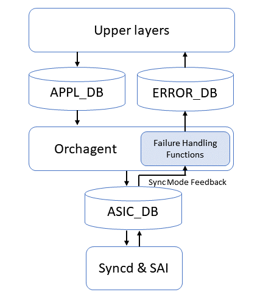

# HLD for handling SAI failures

## 1. Scope

This document describes the high-level design for orchagent in handling SAI failures

## 2. Failure Handling Framework

### 2.1 Requirements for failure handling functions in orchagent

1. Allow different handling for Create/Set/Remove/Get operations.
1. Allow each Orch to have its specific handling logic.
1. Adapt handling logic based on SAI API type and SAI status.
1. Escalate the failure to upper layers when the failure cannot be handled in orchagent.

### 2.2 An overview of the failure handling framework

An illustrative figure of the failure handling framework is shown below.
The orchagent generates SAI calls according to the information in APPL_DB given by upper layers.
In the case of SAI failures, the orchagent gets the failure status via the feedback mechanism in synchronous mode.
Based on the failure information, the failure handling functions in the orchagent make the first attempt to address the failure.
An ERROR_DB is also introduced to support escalation to upper layers.
In the scenario where the orchagent is unable to resolve the problem, the failure handling functions would escalate the failure to the upper layers by pushing the failure into the ERROR_DB.



### 2.3 Failure handling functions in Orchagent

#### 2.3.1 Failure handling functions

To support a failure handling logic in general while also allow each orch to have its specific logic, we include the following virtual functions in Orch

1. `virtual task_process_status handleSaiCreateStatus(sai_api_t api, sai_status_t status, void *context = nullptr)`
2. `virtual task_process_status handleSaiSetStatus(sai_api_t api, sai_status_t status, void *context = nullptr)`
3. `virtual task_process_status handleSaiRemoveStatus(sai_api_t api, sai_status_t status, void *context = nullptr)`
4. `virtual task_process_status handleSaiGetStatus(sai_api_t api, sai_status_t status, void *context = nullptr)`

The four functions handle SAI failures in create, set, remove, and get operations, respectively.
With the type of SAI API and SAI status as an input, the function could handle the failure according to the two pieces of information.

In the scenario where a specific logic is required in one of the Orchs, this design allows the Orch to inherit the function and include the specific login in the inherited function.

The function also allows an optional input `context`, which allows passing context (e.g., object entry, attribute, etc.) into the function so that it could escalate the information to the ERROR_DB and upper layers.

#### 2.3.2 Possible execution results

1. Return `task_success` --  No crash, no retry, handled successfully.

The failure handling function should return `task_success` when the failure is properly handled without the need for another attempt (e.g., the SAI status is `SAI_STATUS_ITEM_NOT_FOUND` in remove operation).

2. Return `task_failed` -- No crash, no retry, although the failure is not handled successfully, orchagent will keep running without exit.

The failure handling function should return `task_failed` when the failure is unable to be handled in orchagent and another attempt is not likely to resolve the failure. In such a scenario, the function should prevent orchagent from retrying and escalate the failure to upper layers. Example scenarios where the functions should return this status include invalid user input (e.g., a wrong ACL, conflicting IP addresses), hardware permanent error, non-critical internal logic error, etc.

3. Return `task_need_retry` --  No crash, retry

The failure handling function should return `task_need_retry` when the failed SAI call may be resolved in a subsequent attempt.

4. exit(EXIT_FAILURE) -- Crash and trigger SwSS auto-restart

Some of the failures can be resolved by restarting SwSS.
In the scenario where such failures happen, the failure handling function in the orchagent should exit with `EXIT_FAILURE` and trigger SwSS auto restart.

### 2.4 DB changes

An ERROR_DB will be introduced to escalate the failures from orchagent to upper layers such as fpmsyncd.

The schema of ERROR_DB is designed as follows:

```

ERROR_{{DB_TYPE}}_{{TABLE_TYPE}}_TABLE|entry
    "failed_orch": {{failed orch type}}
    "failed_SAI": {{failed SAI type}}
    "opcode": {{failed SAI operation type}}
    "status": {{sai_status}}
    "attributes": "attr_type0,attr_type1,..." (Optional)
    "attr_values": "attr_value0,attr_value1,..." (Optional)
    "counter": {{count}}

```

The table and key in ERROR_DB correspond to the DB, table, and key where SAI failures happen (e.g., SAI failure happens when conducting operations for APPL_DB entry `ROUTE_TABLE:0.0.0.0/0`, the corresponding key in ERROR_DB should be `ERROR_APPL_ROUTE_TABLE:0.0.0.0/0`).

The field `failed_orch` indicates the type of orch where the SAI failure happens.

The field `failed_SAI` indicates the type of SAI in which the SAI failure happens.

The field `opcode` indicates the method that failed.
Possible values include `CREATE/SET/DELETE`.

The field `status` stores the status of the SAI operation (e.g., SAI_STATUS_NOT_SUPPORTED, SAI_STATUS_FAILURE).

The ERROR_DB entry also includes a list of attributes (comma separated) and the corresponding values (comma separated) that the failed operation tries to set.

The field `counter` stores the number of failures for the same entry. It could be used as a reference for handling the failure.

The upstream processes are expected to consume the ERROR_DB entries and remove the handled failures from the ERROR_DB.
Assuming the upstream processes have the proper consumption of ERROR_DB entries and failure handling logic (these are not currently available for upstreams processes and need to be added), the ERROR_DB should not keep accumulating failures in ERROR_DB and consuming memory.

## 3. Failure handling logic in orchagent

### 3.1 Failure status that could be handled in orchagent

| SAI status | Create | Set | Remove | Get
|-----|-----|-----|-----|-----|
| ITEM ALREADY EXISTS           | Set the corresponding attribute instead. | Should not happen. No retry. | Should not happen. No retry. |Should not happen. No retry. |
| ITEM NOT FOUND                | Should not happen. No retry. | Create the item and set attribute. | Return success. No retry. | No retry. |
| OBJECT IN USE                 | Should not happen. No retry. | Should not happen. Retry after a while. | Retry after a while. | Should not happen. No retry. |Should not happen. No retry. |
| NOT_SUPPORTED | Should not happen. Crash orchagent. | Should not happen. Crash orchagent. | Should not happen. Crash orchagent. | Should not happen. Crash orchagent. |

TODO: Add handling logic for other SAI statuses.

### 3.2 SAI API specific handling logic

TODO: Add SAI API specific handling logic

### 3.3 Orch specific handling logic

TODO: Add Orch specific handling logic

## 4. Warm boot support

A warm reboot should not be issued in the scenario with unhandled SAI failures.
A check or ERROR_DB should be added to pre-warm-reboot check functions to prevent doing warm reboots with unhandled SAI failures.
