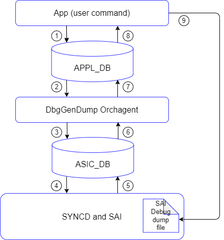

# Generate SAI Debug Dump

## Table of Contents

- [Generate SAI Debug Dump](#Generate-SAI-Debug-Dump)
  - [Table of Contents](#table-of-contents)
    - [Revision](#revision)
    - [Scope](#scope)
    - [Terminology](#terminology)
    - [Overview](#overview)
    - [Requirements](#requirements)
    - [Architecture Design](#architecture-design)
    - [Implementation](#implementation)
	  - [generate_sai_dump bash script](#generate_sai_dump-bash-script)
	  - [show techsupport](#show-techsupport)
	  - [DbgGenDump orchestration](#DbgGenDump-orchestration)
	  - [SAI global API sai_dbg_generate_dump](#SAI-global-API-sai-dbg_generate_dump)
	  - [syncd extended operation](#syncd-extended-operation)
    - [YANG model changes](#yang-model-changes)
    - [CLI](#cli)
    - [Warmboot and Fastboot Design Impact](#Warmboot-and-Fastboot-Design-Impac)
    - [Testing Requirements/Design](#Testing-Requirements/Design)
    - [Unit Test cases](#Unit-Test-cases)
    - [System Test cases](#System-Test-cases)

### Revision

| Rev |   Date   |          Author           | Change Description |
| :-: | :------: | :-----------------------: | ------------------ |
| 0.1 | 10/15/24 | Aviram Dali (**Marvell**) | Initial Draft      |
### Scope

The scope of this document is to design the handling of generating a SAI debug dump file by  user command , specifically for `show techsupport` command.

### Terminology

| Term  | Definition                              |
| ----- | --------------------------------------- |
| ASIC  | Application Specific Integrated Circuit |
| SYNCD | ASIC Synchronization Service            |
| SAI   | Switch Abstraction Interface            |
| API   | Application Programmable Interface      |
| SWSS  | Switch State Service                    |
### Overview
SAI dump file usually includes SDK info and configuration , SAI stats, capture of SAI lower layer states like registers vales etc...

Currently, the SAI dump file is generated only during SAI failures by executing a dedicated executable named "saisdkdump" (which linkage with the SAI lib and during initialization it creates a new switch in redundant mode) 

This new feature allows users to generate a SAI debug dump file using `show tech-support` command, not necessarily during failure.

### Requirements

+ Add infrastructure to generate a SAI debug dump file upon user request
+ generate a SAI debug dump file from 'show techsupport' command.
+ Generate a SAI debug dump file within the context of Syncd.
+ Maintain the existing mechanism for generating the SAI debug dump file on failure.

### Assumptions

The SAI global API `sai_dbg_generate_dump` operates as a blocking function.

### Architecture Design

Adding a new infrastructure without changes in existing Sonic Architecture

1. A user command, such as `show techsupport` triggers the `generate_sai_dump`, and creates a new table with the dump file name to create in the APPL DB.
2. A new orchestration agent, `DbgGenDumpOrch`, is triggered to handle the request.
3. `DbgGenDumpOrch` writes the file name to the ASIC DB and sets a new operation `REDIS_ASIC_STATE_COMMAND_DBG_GEN_DUMP` for syncd.
4. Syncd calls the global SAI API `dbgGenerateDump` to generate the debug dump file, which is saved in syncd's file system.
5. Syncd sends a reply back to `DbgGenDumpOrch`.
6. `DbgGenDumpOrch` analyzes the response.
7. `DbgGenDumpOrch` updates the result in the APPL DB.
8. The user command retrieves the result.
9. The debug dump file is pulled on success.

The below diagram explains the generate debug dump file flow




### Implementation

#### generate_sai_dump bash script
Introduced a new script `/usr/local/bin/gen_sai_dbg_dump.sh`

```
###############################################################################
# generate_sai_dump
#
# Description:
#  This function
#  it ensures that the `syncd` container is running before initiating the dump.
#  triggers the generation of a SAI debug dump file through Redis APPL DB.
#  it waits for the file by Polling (with timeout) the APPL DB for the result.
#  it removes the table from the DB when done.
#
# Arguments:
#  $1 - Filename for the SAI debug dump file.
#  $2 - Optional timeout for file readiness (default: 60 seconds).
#
# Returns:
#  0 - On success
#  1 - On failure
###############################################################################
generate_sai_dump() {

}
```

 The script also can be invoked from the CLI to generate the dump file directly under the given name (without calling `show techsupport` command):
```
/usr/local/bin/gen_sai_dbg_dump.sh -f /tmp/my_dump_file.log
```

#### show techsupport
Introduced a new generic API, `generate_sai_dbg_dump_file`, in `generate_dump.sh` (invoked by the `show techsupport` command) to create a debug dump file:

```

# generate_sai_dbg_dump_file
#
# Description:
# This function triggers the generation of a SAI debug dump file and saves the 
# dumped file in the show techsupport output directory. 
#
# Globals:
#  None
#
# Arguments:
#  $1 - (required) The file name (without path) the SAI debug dump will be saved 
#       under this name in the show techsupport output directory.
#
# Returns:
#  0 - On success
#  1 - On failure
###############################################################################
generate_sai_dbg_dump_file(){
...
}
```

usage:

```
generate_sai_dbg_dump_file "sai_sdk_dump_$(date +"%m_%d_%Y_%I_%M_%p")"
```

#### DbgGenDump orchestration
- A new orchestration agent, `DbgGenDumpOrch`, has been introduced, which is triggered by updates in the APPL DB.

- It updates syncd by writing to the ASIC DB and waits for a response. Once received, it writes the result back to the APPL DB, allowing the calling application to retrieve the file.

#### DB Enhancements

Introduced a new Tables in APPL DB :

```
key    = DBG_GEN_DUMP_TABLE:DUMP    ; Unique identifier for gen dump file. 
;field = value
file_name   = STRING                ; full path file to save the dump file.
```

Example:
```
redis-cli -n 0 HGETALL "DBG_GEN_DUMP_TABLE:DUMP" 
1) "file" 
2) "/var/log/sai_dump_file.log" 
```

wait for the dump generation result example:
```
key    = DBG_GEN_DUMP_STATUS_TABLE:DUMP ; Unique identifier for gen dump file result
;field = value
status = SAI_STATUS                    ; result status of file dump generation
```

Example:
```
redis-cli -n 0 HGETALL "DBG_GEN_DUMP_STATUS_TABLE:DUMP" 
1) "status" 
2) "0"
```

Introduced a new Tables in ASIC DB:

```
key    = DBG_GEN_DUMP:DUMP       ; Unique identifier for gen dump file result
;field = value
file_name   = STRING             ; full path file to save the dump file.
```

Example:

```
redis-cli -n 1 HGETALL "DBG_GEN_DUMP:DUMP"
1) "DBG_GENERATE_DUMP" 
2) "/var/log/sai_dump_file.log"
```

#### SONIC support global API sai_dbg_generate_dump
`sai_dbg_generate_dump` is already supported in SAI. Similar to other global API that supported in Sonic, add support to the global API `sai_dbg_generate_dump` to the `SaiInterface` class and ensuring that all derived classes provide the corresponding implementation

```
    class SaiInterface{
		    ...
            virtual sai_status_t dbgGenerateDump(
                    _In_ const char *dump_file_name) = 0;
		    ...           
    }
```
 
####  syncd extended operation

Similar to other global API that supported in Sonic, add new operation to the syncd to support SAI debug generate dump

```
sai_status_t Syncd::processSingleEvent(
        _In_ const swss::KeyOpFieldsValuesTuple &kco)
{
    ...
    
    if (op == REDIS_ASIC_STATE_COMMAND_DBG_GEN_DUMP)
        return processDbgGenerateDump(kco);
```


```
sai_status_t Syncd::processDbgGenerateDump(
        _In_ const swss::KeyOpFieldsValuesTuple &kco)
{
    ...
    //call SAI dbgGenerateDump API
    sai_status_t status = m_vendorSai->dbgGenerateDump(file_path);
    ...
	//update ASIC DB with the result
    m_selectableChannel->set(sai_serialize_status(status), {} , REDIS_ASIC_STATE_COMMAND_DBG_GEN_DUMPRESPONSE);
    
    return status;
}
```

#### SAI API
There are currently no new SAI APIs required for this feature.

#### YANG model changes
No Changes.

#### CLI
No changes.

### Warmboot and Fastboot Design Impact
There is no impact on warmboot or fastboot

### Testing Requirements/Design

#### Unit Test cases
execute dump file and make sure it exists 
/usr/local/bin/gen_sai_dbg_dump.sh -f /tmp/my_dump_file.log 

#### System Test cases
Verify if the dump in `show techsupport` contains the SAI dump file.

