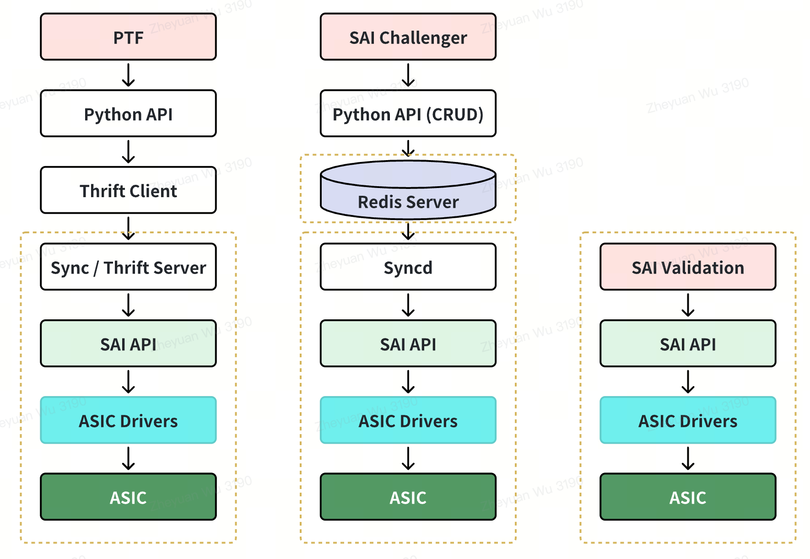

# SAI Validation and PySAI HLD

### 1. Revision  

| Revision | Date        | Author           | Change Description |
| -------- | ----------- | ---------------- | ------------------ |
| 1.1      | Aug 4, 2025 | Yiming Yang, Zheyuan wu, Sean Kao | Initial proposal   |

### 2. Scope  
This document presents a new test framework designed for SAI performance verification and testing on a single Device Under Test (DUT), named SAI Validation, along with its supporting infrastructure, PySAI.

### 3. Definitions / Abbreviations 

| Definitions/Abbreviation | Description |
| ------------------------ | ----------- |
| SAI | Switch Abstraction Interface |
| RPC| Remote Procedure calls |
| SONiC | Software for Open Networking in the Cloud |
| DUT | Device Under Test |
| L2 | Layer 2 |
| L3 | Layer 3 |

### 4. Overview 
The Switch Abstration Interface (SAI) defines a standardized API that decouples network operating systems from underlying switch ASICs. In practice, different vendors often implement customized versions of SAI, leading to inconsistencies and the need to validate SAI and ASIC behavior. 

To meet this demand, there is a desire for a unified, lightweight test platform to verify SAI functionality against ASIC behavior. There are existing tools to achieve this purpose, such as PTF and SAI Challenger. What we propose here is an even more lightweight tool that requires only a single switch, without additional RPC or RedisDB layers between the test code and the SAI APIs. Figure 1 highlights the difference between the proposed SAI validation and existing solutions — PTF and SAI Challenger.

<em>Figure 1. Comparison of PTF, SAI Challenger and SAI Validation</em>

### 5. Requirement / Goals

1. The testbed should be self-contained, using only a single switch without dependence on external devices like a fanout switch or server.
2. Call SAI APIs in the same way as syncd, to reflect the real-world performance of SAI API invocations in SONiC.
3. Provide interactive mode for step-by-step debugging and incremental developing.
4. Support sairedis.rec recording and replay for the test process, with automatic filtering and isolation of entries based on relevance.
5. Support handling of SAI API notifications and callbacks.

### 6. High-Level Design
This section describes the HLD of SAI Validation and PySAI. 
Figure 2 illustrates the High-Level Design (HLD) of SAI Validation, which consists of three main components: platform, cases, and utils. 
- Platform : Handles hardware-specific logic, initializes ASIC platforms, and creates switch instances.
- Cases : Provides the test suite.
- Utils : Supplies the common infrastructure for all test cases, handling topology and station setup plus lifecycle management.
- PySAI: Accepts Python SAI API and sends C SAI API calls to the ASIC
- Interaction: Provides interactive shell for debugging

<em>Figure 2. SAI Validation HLD</em>

#### 6.1 SAI Validation Design Features

##### 6.1.1 Single DUT Test Environment
SAI Validation runs on a single DUT without requiring additional devices or any external dependencies. It operates independently of SONiC and external services, using only one SAI Validation docker image on the host CPU. 
With modular Mixin classes and loopback mode, SAI Validation can simulate complex network topologies (including L2 forwarding and L3 routing) while automating resource management, all within a single test environment.
##### 6.1.2 Performance Test Capability
Compared to PTF, which uses an extra thrift layer, SAI Validation invokes SAI APIs directly, which reflects the actual entry update speed from SAI to Syncd. This enables more accurate measurements in performance tests, such as those that measure route and FDB table update speeds.
##### 6.1.3 Interactive Mode
The IPython mode in SAI Validation allows users to step through code line by line, stop on runtime exceptions, and enter vendor's SDK shell to inspect hardware tables (L2/L3 routes, ACLs, etc.), confirming that each SAI call produces the expected ASIC changes.
##### 6.1.4 Record and Replay Functionality
SAI Validation supports recording all SAI operations into sairedis.rec files during test runs. These files can be replayed directly without syncd. An extraction feature allows removal of unrelated operations to isolate issues and improve debugging efficiency.
##### 6.1.5 Support for Notification Callback Test
SAI Validation allows testing of notification functions such as sai_fdb_event_notification_fn, which are used by the SAI implementation to report asynchronous events to the application, such as PFC watchdog.

#### 6.2 PySAI
PySAI provides a concise set of Python APIs, which helps SAI Validaiton avoid invoking complicated SAI API in C

<em>Figure 4. SAI Code VS PySAI Code</em>

##### 6.2.1 PySAI Code-gen
1. Parsing: parse.py uses libclang to extract enums, structs, and function signatures from SAI headers. These are mapped to Pydantic models as intermediate representation.
2. Documentation: yaml_doc.py serializes the parsed models into YAML files, which contain structured SAI API definition, with index.yml serving as an entry point for lookups and tool integration.
3. Code Generation: Jinja2 template transforms the YAML data into Python class definitions and accessors that reflect the original SAI constructs. 

<em>Figure 4. PySAI Codegen Workflow</em>

### 7. Open/Action items

As we continue to evolve and improve the SAI Validation framework, we invite the community to participate actively in our journey towards more robust, comprehensive, and reliable software. We believe that community contributions are vital to our project’s success and resilience.

Why Your Contributions Matter: Our goal is to ensure that the SAI Validation framework remains at the forefront of technology, capable of handling a diverse range of scenarios and configurations. By making contributions, you help enhance the accuracy and efficiency of the framework, aiding in the detection and resolution of issues before they impact users.

What We’re Looking For: We welcome contributions that:

- Expand the coverage of existing features and APIs.
- Introduce scenarios with new and diverse configurations.
- Address edge cases that may not currently be covered.
- Help verify bug fixes and new features to prevent regressions.
