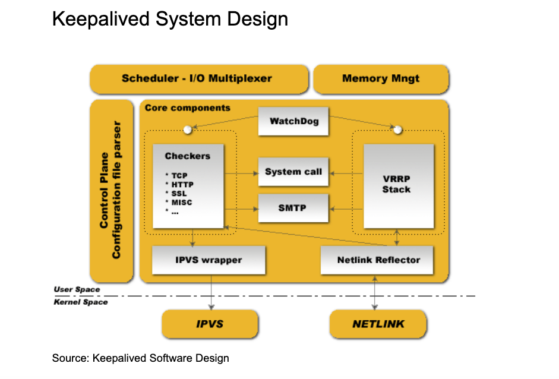
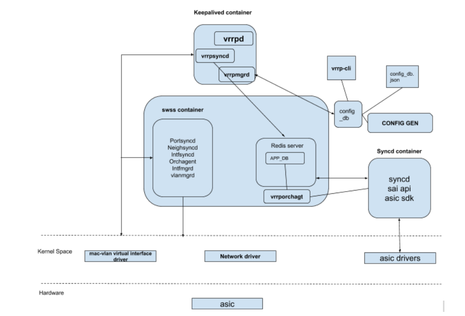
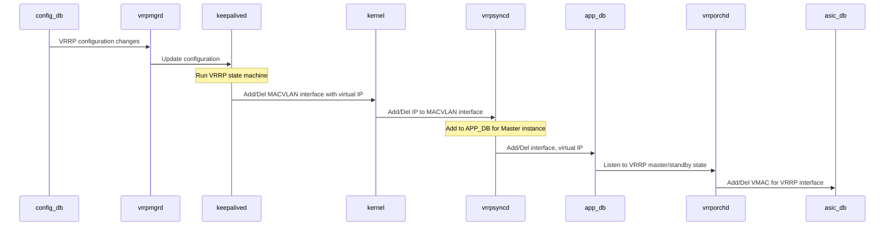

# Virtual Router Redundency Protocol (VRRP) HLD

#### Rev 0.1


[TOC]


# List of Tables

[Table 1: Abbreviations](#table-1-abbreviations)

# Revision
| Rev  |    Date    |       Author        | Change Description                                           |
|:--:|:--------:|:-----------------:|:------------------------------------------------------------:|
| 0.1  | 09/28/2019 |   Dilip Kumar (Broadcom)   | Initial version                                              |
|      |            |             |                    |

# Definition/Abbreviation

### Table 1: Abbreviations

| **Term**      | **Meaning**                                                  |
| ------------- | ------------------------------------------------------------ |
| ARP           | Address Resolution Protocol                                  |
| CLI           | Command Line Interface                                       |
| IP            | Internet Protocol                                            |
| LAG           | Link Aggregation Group                                       |
| LAN           | Local Area Network                                           |
| MAC           | Media Access Control addresses                               |
| VIP           | Virtual IP address                                           |
| VLAN          | Virtual Local Area Network                                   |
| VMAC          | Virtual MAC address                                          |
| VRF           | Virtual Routing and Forwarding                               |
| VRID          | Virtual Router Identifier                                    |
| VRRP          | Virtual Router Redundency Protocol                           |
| VRRP Instance | An instance of VRRP state machine on an interface. Multiple VRRP state machines can be configured on an interface. |
| VRRP Owner    | VRRP owner (of a VRRP instance) is the router whose virtual IP address is the same as the real interface IP address |

# About this Manual

This document provides general overview of VRRP feature implementation based on RFC 3768 in SONiC. 


# 1 Introduction and Scope

This document describes the Functionality and High level design of the VRRP feature.

The Virtual Router Redundancy Protocol (VRRP) functionality is designed to eliminate the single point of
failure inherent in the static default routed environment. VRRP specifies an election protocol that
dynamically assigns responsibility of gateway router to a VRRP instance on one of the routers on a LAN. The VRRP instance controlling the IP address(es) associated with a virtual router is called the Master, and routes the traffic. The election process provides dynamic fail-over in the forwarding responsibility should the Master become unavailable. Any of the virtual router's IP addresses on a LAN can then be used as the default first hop router by end-hosts. The advantage gained from using VRRP is a higher availability default path without requiring configuration of dynamic routing or router discovery protocols on every end-host.


# 2 Feature Requirements

## 2.1 Functional Requirements

Following requirements are addressed by the design presented in this document:

1. Support VRRP v2 (IPv4) 

2. Support multiple VRRP instances (groups) per interface

3. Support VRRP on VLAN, PortChannel and Ethernet interfaces

4. Support Uplink interface tracking

5. Support pre-emption of a Master when a high priority VRRP node comes up

6. Support configurable priority for VRRP instance

7. Support configuration and management of various VRRP parameters

    

Following requirements are beyond scope of this release. 

1. VRRPv3 (IPv6) support
2. REST, SNMP and gNMI access support to VRRP objects
3. VRRP support on non-default VRF


## 2.2 Configuration and Management Requirements

This feature will support configuration and display CLIs to control and monitor VRRP parameters

1. Support configuration of VRRP instances per interface
2. Support configuration of VIP, priority, hello interval and pre-emption for VRRP instance
3. Support configuration of uplink interface track
4. Allow users to configure track interface weight to provide flexible policy of Master to Backup switchover
5. Support display of various VRRP parameters as well as states using CLIs.

   

## 2.3 Scalability Requirements

1. Max number of VRRP instances: 128
2. Max number of VRRP enabled interfaces: 128
3. Max number of VRRP instances per interface: 16
4. Max number of tracked interfaces per VRRP Instance: 8
5. Max IP addresses per VRRP instance: 4


## 2.4 Warm Boot Requirements

VRRP module is warm reboot compliant but the sessions state will not be maintained during warm-reboot. That is, VRRP docker will be restarted as part of warm-reboot. Master instances on restarting router will go Down, and Backup instance on the restart neighbor routers will transition to Master. The behavior of VRRP will be like Cold reboot.


# 3 Feature Description

## 3.1 Target Deployment use cases

The following are some of the deployment use cases for VRRP

- The Leaf nodes of the Clos network to provide first hop redundancy to connected devices

  

## 3.2 Functional Description

VRRP specifies an election protocol to provide the virtual router function described earlier. All protocol
messaging is performed using IP multicast datagrams, thus the protocol can operate over a variety of
multiaccess LAN technologies supporting IP multicast. Each VRRP virtual router has a single well-known
MAC address allocated to it. This document currently only details the mapping to networks using the IEEE
802 48-bit MAC address. The virtual router MAC address is used as the source in all periodic VRRP
messages sent by the Master router to enable bridge learning in an extended LAN.
A virtual router is defined by its virtual router identifier (VRID) and a set of IP addresses. A VRRP router
may associate a virtual router with its real addresses on an interface, and may also be configured with
additional virtual router mappings and priority for virtual routers it is willing to backup. The mapping
between VRID and addresses must be coordinated among all VRRP routers on a LAN. However, there is
no restriction against reusing a VRID with a different address mapping on different LANs. The scope of
each virtual router is restricted to a single LAN.
To minimize network traffic, only the Master for each virtual router sends periodic VRRP Advertisement
messages. A Backup router will not attempt to pre-empt the Master unless it has higher priority. This
eliminates service disruption unless a more preferred path becomes available. It's also possible to
administratively prohibit all pre-emption attempts. The only exception is that a VRRP router will always
become Master of any virtual router associated with addresses it owns. If the Master becomes unavailable
then the highest priority Backup will transition to Master after a short delay, providing a controlled
transition of the virtual router responsibility with minimal service interruption.
The VRRP protocol design provides rapid transition from Backup to Master to minimize service
interruption, and incorporates optimizations that reduce protocol complexity while guaranteeing
controlled Master transition for typical operational scenarios. The optimizations result in an election
protocol with minimal runtime state requirements, minimal active protocol states, and a single message
type and sender. The typical operational scenarios are defined to be two redundant routers and/or distinct
path preferences among each router. A side effect when these assumptions are violated (i.e., more than two redundant paths all with equal preference) is that duplicate packets may be forwarded for a brief period during Master election. However, the typical scenario assumptions are likely to cover the vast majority of deployments, loss of the Master router is infrequent, and the expected duration in Master election convergence is quite small ( &lt;&lt; 1 second ). Thus the VRRP optimizations represent significant
simplifications in the protocol design while incurring an insignificant probability of brief network
degradation.
Though VRRP standard protocol present in RFC 3768 is complete in itself, there are few
limitations/drawbacks of the protocol:

1. The point of failure which VRRP safeguards against is the interface on which VRRP instance is
  present and the router as a whole. Even if all of the connectivity of master to the external network
  fails, VRRP will still not trigger the failover to the backup gateway. Uplink interface tracking feature has been introduced to overcome this limitation

2. Only master router sends the advertisements, and backups just listen to them. Since backups do
  not send any periodic message, it is difficult to ascertain that the backups are still active, and the
  healthiness of the backup routers can not be known until the failover happens.

3. VRRP owner - if a VRRP instance's virtual IP address is same as the real interface IP address. VRRP owner has special privileges (priority is 255) and can pre-empt any other router acting as master. This usually causes unwanted temporary network disruption after the non-owner master had stabilized
  after the failover from owner.

4. A non-owner master can not accept packets destined to the virtual IP address. Only the owner can
  accept and respond to such packets.

5. Two virtual routers with same VRIDs but on different IP subnets can not co-exist on the same
  VLAN because of the virtual MAC address clash.

  VRRP implementation in SONIC completely addresses limitation #1 by introducing uplink interface tracking feature.

### 3.2.1    Pre-emption

A VRRP Master node can be pre-empted by another VRRP node that has higher priority. Pre-emption is enabled by default. CLI is available for user to disable pre-emption on per VRRP instance. Mastership switchover causes unnecessary temporary network disruption.

### 3.2.2 Virtual Router Owner

VRRP instance whose virtual IP address (VIP) is same as real interface address is called the owner of virtual router and has the highest priority (255). VRRP owner is supported in SONIC's VRRP implementation. VRRP owner node will pre-empt the active master even when pre-emption is disabled for that particular VRRP instance.

### 3.2.3 Virtual MAC Address

Following virtual MAC address is used by the protocol (as per RFC 5798)

IPv4 case: **00-00-5e-00-01-{vrid}**

where, vrid is user configured 1-byte virtual router identifier. VRID has interface scope; that is, VRID has to be unique among the VRRP instances on an interface. However, same VRID can be used for two  or more virtual router instances across different interfaces.

### 3.2.4    VRRP Advertisement Frame

VRRP control packets have IP protocol type as 112 (reserved for VRRP), and are sent to VRRP multicast address 224.0.0.18. Source MAC in VRRP control packets is virtual MAC address and source IP is interface IP.                                                               

### 3.2.5    ARP Request Handling 

Only master responds to the ARP requests for virtual IP address. In ARP replies sent by master, the source MAC in Ethernet header and ARP payload is virtual MAC address.

### 3.2.6   Uplink Interface Tracking

Interfaces other than the VRRP instance interface can be tracked for up/down events. When interface-tracking is enabled in the VRRP instance configuration, the tracked interface's operational status will be monitored. When a interface operational down event is detected on a tracked-interface, the track-priority/weight is subtracted from the current router’s priority value. Similarly, when interface operational up event is detected on the tracked-interface, the track-priority/weight is added to the router’s current priority value.

The dynamic change of router priority can trigger mastership switchover if the pre-emption is enabled. **However, if the router is an owner, the mastership switchover will not happen**.

Maximum number of interfaces that can be tracked for a virtual router instance is 8.

# 4 Feature Design

## 4.1 Design Overview

### 4.1.1 Basic Approach

Keepalived (https://www.keepalived.org/) open source code is chosen for VRRP control plane code.




### 4.1.2 Container

A new container "vrrp" has been added in SONiC to host VRRP protocol operation. VRRP source code is not maintained in SONIC repos. Instead, VRRP code is downloaded from keeplaived project repository at the compile time, patches are applied to it (for any fixes for SONIC) and then compiled/linked with SONIC binary.

### 4.1.3 SAI Overview

VRRP virtual router interface can be created by setting the attribute  “SAI_ROUTER_INTERFACE_ATTR_IS_VIRTUAL” with **create_router_interface** API.

     * @brief RIF creation is a virtual RIF.
     *
     * Create a Virtual RIF object, which only programs the ingress router MAC.
     * This simplifies the management of VRRP master router's configuration in
     * SAI adapter, as defined by RFC 5798 (or similar proprietary protocols).
     * Using a Virtual RIF allows SAI to optimize resources, so neighbor entries
     * cannot be learned on a Virtual RIF. On a virtual RIF following attributes
     * are invalid: ADMIN state, MTU size, packet action and multicast enable.
     * Alternatively VRRP can also be configured using native RIF objects without
     * using VIRTUAL attribute, with the expectation that SAI adapter will consume
     * resources that will not be used.
     *
     * @type bool
     * @flags CREATE_ONLY
     * @default false
     */
    
    SAI_ROUTER_INTERFACE_ATTR_IS_VIRTUAL,
## 4.2 DB Changes

At a high level below are some of the interactions between relevant components and the DB involved for VRRP support in SONiC architecture.



__Figure 1: VRRP Architecture__

### 4.2.1 CONFIG_DB changes

**VRRP_TABLE**

Producer:  config manager 

Consumer: VrrpMgr

Description: New table that stores VRRP configuration for per interface + VRID. 

Schema:

```
;New table
;holds the VRRP configuration per interface and VRID

key = VRRP_TABLE:interface_name:vrid
                          ; Interface name string like Vlan1 or PortChannel002 or Ethernet4
                          ; vrid is an integer
; field = value
vrid     = 1*3DIGIT       ; VRRP Instance Identifier
vip      = ip_address     ; Virtual IP address. This is a list of IP addresses
priority = vrrp_priority  ; Priority of VRRP instance
adv_interval = 1*3DIGITS  ; Advertisement interval for VRRP. Default = 1sec
state    = vrrp_state     ; String denoting the state of VRRP instance
version  = vrrp_version   ; VRRP version. Value will always be 2 for this release
pre_empt = "true"/"false" ; VRRP pre-emption is enabled? Default is True
track_interface = track_interface ; List of interfaces tracked by a VRRP instance
  <Interface_Name>|weight|<weight>; This is repeated for the configured tracking interfaces 
```

Example:- 

**admin@sonic:~$ redis-cli -n 4 keys VRRP\***
 1) "VRRP|Vlan8|8"
 2) "VRRP|Vlan1|1"
 3) "VRRP|Vlan10|10"
 4) "VRRP|Vlan2|2"
 5) "VRRP|Vlan4|4"
 6) "VRRP|Vlan5|5"
 7) "VRRP|Vlan3|3"
 8) "VRRP|Vlan7|7"
 9) "VRRP|Vlan6|6"
10) "VRRP|Vlan9|9"

**admin@sonic:~$ redis-cli -n 4 HGETALL "VRRP|Vlan1|1"**
 1) "vrid"
 2) "1"
 3) "vip"
 4) "4.1.1.100,"
 5) "priority"
 6) "80"
 7) "adv_interval"
 8) "1"
 9) "state"
10) ""
11) "version"
12) "2"
13) "pre_empt"
14) "True"
15) "track_interface"
16) "Ethernet7|weight|10,PortChannel001|weight|10,"


**Example:- Entery with multiple virtual IPs**

admin@sonic:~$ redis-cli -n 4 HGETALL "VRRP|Vlan1|1"
 1) "vrid"
 2) "1"
 3) "vip"
 4) "4.1.1.100,4.1.1.200,4.1.1.50,4.1.1.150,"
 5) "priority"
 6) "80"
 7) "adv_interval"
 8) "1"
 9) "state"
10) ""
11) "version"
12) "2"
13) "pre_empt"
14) "True"
15) "track_interface"
16) "Ethernet7|weight|10,PortChannel001|weight|10,"

### 4.2.2 APP_DB Changes

**VRRP_TABLE**

Producer:  VrrpSyncd 

Consumer: VrrpOrch

Description: This is a new table that contains VRRP state information. This entry will be added to APP_DB for each VIP for every Master VRRP instance. 

Schema:

```
; New table
; holds the VRRP state and VMAC information

key = VRRP_TABLE:interface_name:vip:type
    interface_name        ; interface name as a string. Vlan, Ethernet or PortChannel
    vip                   ; virtual IP address in a.b.c.d/32 format
    type                  ; IP address type string. only IPv4 supported currently
    
; field = value
vmac = virtual_mac_address ; Virtual MAC address associated with VRRP instance
```

Example:- 

**Key**: VRRP_TABLE:Vlan1000:[40.10.8.101/32:ipv4]

**Value**: "vmac":"00:00:5e:00:01:08"

## 4.3 Modules Design and Flows

Below diagram depicts interactions of submodules for VRRP support.



### vrrpmgrd

- Listens to VRRP create, delete and parameter change in config_db. 
- Upon change,
  - Updates keepalived.conf file with new configuration
  - Sends a signal to keepalived to read and apply new configuration from keepalived.conf file.

### keepalived

- Reads the configuration from keepalived.conf file.
- Listens to kernel link and IP events.
- Runs VRRP protocol state machine, 
  - For VRRP instances state transition to Master programs a MACVLAN interface with VIP as interface IP in kernel
  - For VRRP instances state transition to non-Master deletes MACVLAN interface, if programed, from kernel.

### vrrpsyncd

Listens to MACVLAN interface programming in kernel. Status of MACVLAN interface determines Master/Backup state of VRRP instances. VRRP_Table in APP_DB will be programmed with interface name and VIP for Master instances.

- For every IP add to MACVLAN interface, adds interface name and Virtual IP in APP_DB in VRRP_Table
- For every IP delete from MACVLAN interface, deletes interface name and Virtual IP in APP_DB from VRRP_Table

### vrrporchd

- Listens to VRRP_Table in APP_DB and adds virtual MAC entries in ASIC_DB for Master instances


## Kernel parameter tuning for VRRP

Here is the list of parameters that have been adjusted to make VRRP work in SONIC environment. These parameters are automatically changed by VRRP module when user enables/creates a VRRP instance on an interface.

**echo 2 > /proc/sys/net/ipv4/conf/<interfacename>/arp_announce**
Setting higher value increases the chance of getting a reply from host. This ensures kernel selects best address for source while generating arp packet instead of incoming packet source IP.

**echo 2 > /proc/sys/net/ipv4/conf/<interfacename>/rp_filter**

Source validation in Loose mode as defined in RFC3704 Loose Reverse Path. This should be set to a non zero value for accept_local to work.

**echo 1 > /proc/net/ipv4/conf/<interfacename>/accept_local**

Accept packet though source IP in IP Header matches owned IP on this interface. This is necessary when owner is newly added to topology in <interfacename>. When owner is added, in a topology which has VRRP master running, owner sends packet with source IP as Virtual IP. On Master, these packets should not be discarded due to source IP matching with Virtual IP (owned by master) which is configured by setting accept_local.


## 5 CLI

SONIC Click based configuration and monitoring CLIs have been introduced in SONIC for VRRP


### 5.1 Configuration Commands

```
configure interface vrrp add <interface_name> <vrid>
This command adds/enables a VRRP instance on an interface.
- interface_name - name of interface (Ethernet or Vlan or PortChannel) over which VRRP is to be enabled.
- vrid - VRRP instance identifier.
 
configure interface vrrp remove <interface_name> <vrid>
This command removes a VRRP instance from an interface.

configure interface vrrp vip add <interface_name> <vrid> <virtual_ip_address>
This command adds a virtual IP address for a VRRP instance on an interface. User is allowed to create multiuple VIPs for a VRRP instance. VIP must fall in the interface's subnet.
- interface_name - name of interface (Ethernet or Vlan or PortChannel) over which VIP is being added
- vrid - VRRP instance identifier.
- virtual_ip_address - VIP address in dotted decimal IPv4 address

configure interface vrrp vip remove <interface_name> <vrid> <virtual_ip_address>
This command deletes a already configured VIP from a VRRP instance

configure interface vrrp priority <interface_name> <vrid> <priority>
This command configures priority for a VRRP instance
- priority - a number between 1 and 254 with 1 being the lowest and 254 being the highest priority. Default is 100. Priority 255 is reserved for owner VRRP router.

configure interface vrrp adv_interval <interface_name> <vrid> <interval>
This command configures VRRP periodic advertisement interval for a VRRP instance
- interval - a number between 1 and 255. Unit is in seconds. Default is 1sec. 

configure interface vrrp pre_empt enable <interface_name> <vrid>
This command enables pre-emption of a Master when a higher priority VRRP router arrives
- enable - Enable pre-emption. Default is enabled. 

configure interface vrrp pre_empt disable <interface_name> <vrid>
This command disables pre-emeption of a Master when a higher priority VRRP router arrives
- disable - Disable pre-emption. Default is enabled. 

configure interface vrrp track_interface add <interface_name> <vrid> <track_interface> <weight>
This command adds a track interface to a VRRP Instance. A maximum of 8 track interfaces can be added to a VRRP instance. 
- track_interface - Interface to track. Interface can be Ethernet, Vlan or PortChannel
- weight - weight or importance assigned to the track_interface. When track interface goes down, the priority of VRRP instance will be reduced by weight

configure interface vrrp track_interface remove <interface_name> <vrid> <track_interface> 
This command removes an already configured track interface from a VRRP Instance. 
```

### 5.2 Show Commands

```
show vrrp
 - lists all the VRRP instances including their current state
 Sample output:-
admin@sonic:~$ show vrrp
Interface_Name  VRID   State             VIP  Cfg_Prio  Curr_Prio
         Vlan1     1  Backup       4.1.1.100       100        120
         Vlan2     2  Master       4.1.2.100       100        100
         Vlan3     3  Backup       4.1.3.100       100        100
         Vlan4     4  Backup       4.1.4.100       100        100
         Vlan5     5  Master       4.1.5.100       100        100


show vrrp <interface_name> <vrid>
 - This command displays data about a VRRP instance in detail
 Sample output:-
admin@sonic:~$ show vrrp Vlan1 1
Vlan1, VRID 1
Version is 2
State is Backup
Virtual IP address:
  4.1.1.100
Virtual MAC address is 0000.5e00.0101
Track interface:
  Intfname       State  Priority
  Ethernet7      Up     10
  PortChannel001 Up     10
Configured Priority is 100, Current Priority is 120
Advertisement interval is 1 sec
Preemption is enabled
```


## 6 Serviceability and Debug

The existing logging mechanisms shall be used. Proposed debug framework shall be used for internal state dump.

## 7 Warm Reboot Support

Currently, warm-reboot is not supported for VRRP. That is, warm-reboot will simply restart the VRRP docker without VRRP storing any data for warm restart. 

## 8 Unit Test cases

| Test Cases                   | UT Action and observation                                    | Remarks                                                    |
| ---------------------------- | ------------------------------------------------------------ | ---------------------------------------------------------- |
| Configuration                |                                                              |                                                            |
|                              | Validate IPv4 VRRP config on Physical Interface              |                                                            |
|                              | Validate IPv4 VRRP config on Ve Interface                    |                                                            |
|                              | Ensure that VMAC is generated based on VRID                  |                                                            |
|                              | Ensure VMAC is programmed in FDB and VIP in LPM              |                                                            |
|                              | Validate VRRP on more than one interface                     |                                                            |
|                              | Validate VRRP with more than one VIP per instance            |                                                            |
|                              | Validate multiple VRRP instance per interface                |                                                            |
| Failover                     |                                                              |                                                            |
|                              | Validate IPv4 VRRP master failover with priority change      |                                                            |
|                              | Validate VRRP master failover by disabling a vrrp group      | Add 'disable' feature if needed and feasible               |
|                              | Validate VRRP master failover by removing all virtual-ip     |                                                            |
|                              | Validate VRRP master failover by removing interface IPv4 address |                                                            |
|                              | Validate VRRP master failover by deleting master VRRP session |                                                            |
|                              | Validate VRRP master failover by bringing down interface     |                                                            |
|                              | Validate VRRP master failover by deleting interface          |                                                            |
| VRRP parameter changes       |                                                              |                                                            |
|                              | Validate gratutious ARP                                      |                                                            |
|                              | Validate adv interval                                        |                                                            |
| ARP/ND resolve to VIP        |                                                              |                                                            |
|                              | validate ARP resolution from host to VRRP session VIP        | Hosts should get arp response with VMAC as source MAC      |
|                              | Perform Master failover and check that ARP resolution to VIP will happen with VMAC |                                                            |
| Ping to VIP                  |                                                              |                                                            |
|                              | Validate ping to IVRRP from host, backup & non vrrp router works |                                                            |
| L3 Forwarding with VIP as GW |                                                              |                                                            |
|                              | Validate that IPv4 traffic forwarding with VIP as gateway works from source to destination host |                                                            |
|                              | Perform VRRP master failover and check if traffic forwarding continues with new master |                                                            |
| VRRP Owner                   |                                                              |                                                            |
|                              | Configure VRRP for IPv4 session with VIP same as interface IP and ensure this session becomes master and priority of session becomes max=255 |                                                            |
|                              | Ensure ping to VIP works in owner case                       |                                                            |
|                              | Ensure arp/nd resolution with VIP as gateway in owner case   | ARP/ND should get resolved with VMAC and not interface MAC |
|                              | Ensure ping and traffic forwarding continues after owner failover and comes back |                                                            |
|                              | Traffic forwarding works with VIP as gateway                 |                                                            |
| Interface tracking           |                                                              |                                                            |
|                              | Run below tests with Ping and traffic running                |                                                            |
|                              | Enable interface tracking in a VRRP group with priority, bring down the port and ensure VRRP session priority comes down and session transition from Master to Backup State |                                                            |
|                              | Enable the tracked interface and check if session priority gets restored and session becomes master |                                                            |
|                              | Repeat this test on Port-channel interface                   |                                                            |
|                              | Repeat this test by deleting and re-adding port-channel interface |                                                            |
