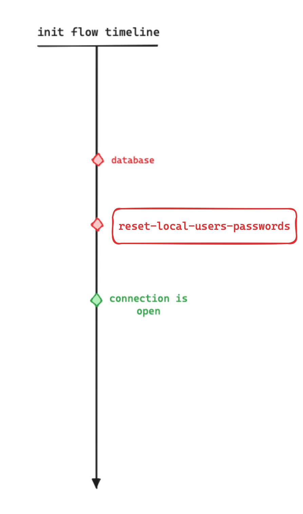
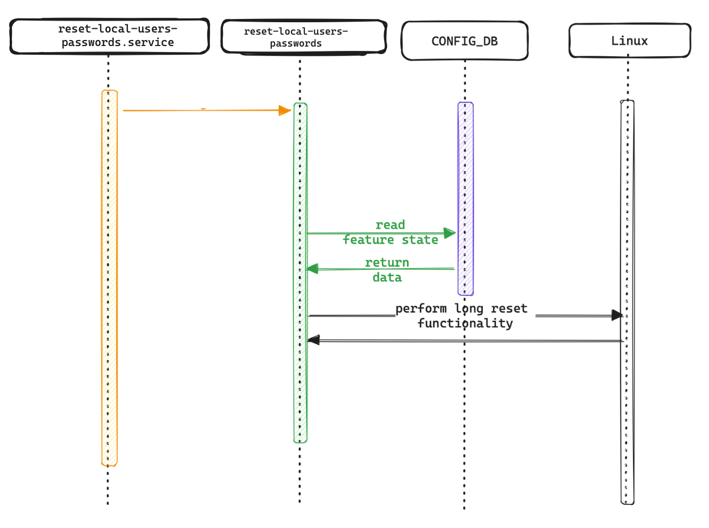

# Reset local users passwords during init - HLD

## Table of contents

-   [Revision](#)
-   [Scope](#scope)
-   [Definitions/Abbreviations](#definitionsabbreviations)
-   [Requirements](#requirements-in-this-feature-we-want-to-be-able-to)
-   [Architecture design](#architecture-design)
-   [High level design](#high-level-design)
-   [Performance](#performance)
-   [Flows](#flows)
-   [Configuration and management](#configuration-and-management)
    - [CLI](#cli)
    - [YANG Model](#yang-model)
-   [Warmboot and Fastboot Design Impact](#warmboot-and-fastboot-design-impact)
-   [Restrictions/Limitations](#restrictionslimitations)
-   [Testing Requirements/Design](#testing-requirementsdesign)
    - [Unit Test cases](#unit-test-cases)
    - [System Test cases](#system-test-cases)

#
  

# Revision

| **Rev**   | **Date**     |           **Author**            | **Change Description**  |
|:---------:|:------------:|:-------------------------------:|:------------------------|
| 1.0       | 04/01/2024   | Azmy Ali (Nvidia SONiC Team)    | Initial public version  |
| 2.0       | 23/01/2024   | Azmy Ali (Nvidia SONiC Team)    | Revised version         |
| 2.1       | 07/02/2024   | Azmy Ali (Nvidia SONiC Team)    | Revised version         |

### 

# Scope

This document describes the design details for resetting local users' passwords during **init** on a SONiC switch. Within this document, we shall outline the default trigger that initiates the reset of passwords for local users, allowing each vendor to incorporate their unique implementation.

# Definitions/Abbreviations

| **Term**                    | **Description**                                                                      |
|-----------------------------|--------------------------------------------------------------------------------------|
| SONiC | Software for Open Networking in the Cloud |
|   Long reset button press   |   Pressing the physical reset button on the switch not less than 15 seconds          |
|   short reset button press  |   Pressing the physical reset button on the switch less than 15 seconds              |
| CLI   | Сommand-line Interface                    |
| YANG  | Yet Another Next Generation               |

### 

# Requirements Overview

The feature implementation shall support the following:

    1. The OS will restore the local users' configurations, by deleting non-default users and restoring default passwords for default users and expiring these passwords due to security concerns during **init**.
    2. The default behavior to trigger this functionality is done by long reset button press, but each vendor can add his desired implementation to when to trigger this feature.
    3. Feature should be enabled or disabled by setting compilation flag to true or false.
    4. Feature can be disabled and enabled using CLI command.
    5. The feature is disabled by default.
    6. The service introduced as part of this feature will run if the platform has capability of long reset support.
    7. The feature will not affect warm and fast reboot 


### 

# Architecture Design

In this feature, we want to add new systemd service ```reset-local-users-passwords.service``` to the init flow. This new service is expected to run on the system during boot and before any connection is open to the switch which includes SSH and serial connection as well and perform restoring local users' configurations, by deleting non-default users and restoring default passwords for default users and expiring these passwords due to security conecerns.



The service is dependent on the ```database.service``` for reading the configured feature state, so it needs to run after it during boot. As well as it needs to run before any connection is open and this includes all the following services: `sshd.service`, `getty.target`, `systemd-logind.service` and `serial-getty@ttyS0.service`.

### 

# High-Level Design

This feature will be a built-in SONiC feature. There will be three main files to consider in this feature:

1. ```src/sonic-platform-common/sonic_platform_base/reset_local_users_passwords_base.py``` - The default behavior implementation will reside in this file, including when to trigger the feature and how to reset the local users' configurations.
2. ```platform/<vendor-path>/sonic_platform/reset_local_users_passwords.py``` - The vendor specifc implementation of the feature, each vendor can decide what is the trigger cause to start the functionality and how it is implemented.
3. ```src/sonic-host-services/scripts/reset-local-users-passwords``` - The python file that will be called on service start during init that imports the vendor's specific implementation.

The default behavior will delete non-default users and restore the original passwords of the default users and expire them based on the content of the file of ```/etc/sonic/default_users.json``` on long reboot press.


The ```reset_local_users_passwords_base.py``` will contain the following class:

    ```
    class LocalUsersConfigurationResetBase(object):
        """
        Base class for resetting local users' configuration on the switch
        """
        def should_trigger(self):
            '''
            define the condition to trigger
            '''
            # the condition to trigger start() method, the default implementation will be by checking if a long reboot press was detected.

        def start(self):
            '''
            define the functionality
            '''
            # the implementation of deleting non-default users and restoring original passwords for default users and expiring them
    ```


Each vendor should inherent this class and add the implementation that he desires in this class.

In the ```src/sonic-host-services/scripts/reset-local-users-passwords``` script, that it is being called on ```reset-local-users-passwords.service``` start, will do import of the inherented class and calls the ```start()``` method of the class as we can see in the following code snippet:


    ```
    def get_platform_local_users_passwords_reset():
        try:
            from sonic_platform.reset_local_users_passwords import LocalUsersConfigurationResetPlatform
            local_users_password_reset_class = LocalUsersConfigurationResetPlatform()
        except ImportError:
            syslog.syslog(syslog.LOG_WARNING, "LocalUsersPasswordsReset: sonic_platform package not installed. Unable to find platform local users passwords reset implementation")
            raise Exception('Local users passwords reset implementation is not defined')

        return local_users_password_reset_class

    ```


The ```LocalUsersConfigurationResetPlatform``` class residing in ```platform/<vendor-path>/sonic_platform/reset_local_users_passwords.py``` that each vendor implements should look like this:


    ```
    class LongRebootPressPlatform(LongRebootPressBase):

        def should_trigger(self):
            '''
            Vendor's specific condition to trigger
            '''
            # can inherent the base class implementation
    
        def start(self):
            '''
            Vendor specific implementation.
            '''
            # can inherent the base class implementation
    ```


The new serivce will call the python script ```src/sonic-host-services/scripts/reset-local-users-passwords``` which in return it will read the feature state from the ```LOCAL_USERS_PASSWORDS_RESET``` table in ```CONFIG_DB``` database. If feature is enabled and a long reset button press detected, the service will perfom the implementation in the ```start()``` in the vendor's specifc implementation as we can see in the following code snippet of ```src/sonic-host-services/scripts/reset-local-users-passwords```:


```
class LocalUsersConfigurationReset:
    def __init__(self):
        # Wait if the Warm/Fast boot is in progress

    def get_feature_state(self):
        '''
        check if the feature is enabled by reading the redis tables
        '''

    def start(self):
        '''
        if the feature is enabled then reset the password's using the platform
        specific implementation
        '''


def main():
    LocalUsersConfigurationReset().start()
```

The feature is added to the init flow as long as we set the new ```ENABLE_LOCAL_USERS_PASSWORDS_RESET``` global variable and the exsiting ```CHANGE_DEFAULT_PASSWORD``` global variable in ```rules/config``` to ```y```.

```
# ENABLE_LOCAL_USERS_PASSWORDS_RESET - enable local users' passwords reset during init on switch
ENABLE_LOCAL_USERS_PASSWORDS_RESET ?= y
```

###

# Performance

The ```reset-local-users-passwords.service``` is required to run as fast as possible, and it is expected to finish running in milliseconds **(150-300 milliseconds)** on long reset detected, and not delay the init flow more than that.

# Flows

###### Local users' password reset during init flow


The defualt behavior is on long reset button press, the system will delete non default users and restore original passwords for default users and expire them, all done using linux commands

# Configuration and management

## CLI

<!-- omit in toc -->
## Command structure

**User interface**:
```
config
\-- local-users-passwords-reset
    |-- state <enabled|disabled>

show
\-- local-users-passwords-reset
```

### Config command group
**The following command set local-users-passwords-reset  feature state:**
```bash
config local-users-passwords-reset state <enabled|disabled>
```

### Show command
**The following command display long-reset-button-press  configuration:**
```bash
root@sonic:/home/admin# show local-users-passwords-reset
state
-------
enabled
```

## YANG model
New YANG model `local-users-passwords-reset.yang` will be added to provide support for configuring llocal-users-passwords-reset state.

**Skeleton code:**
```
 module sonic-local-users-passwords-reset {

    yang-version 1.1;

    namespace "http://github.com/sonic-net/local-users-passwords-reset";

    description "LONG_RESET_BUTTON YANG Module for SONiC-based OS";

    revision 2024-01-04 {
        description "First Revision";
    }

    container sonic-local-users-passwords-reset {

        container LOCAL_USERS_PASSWORDS_RESET {

            description "LOCAL_USERS_PASSWORDS_RESET part of config_db.json";

            container STATE {
                leaf state {
                    type string {
                        pattern "enabled|disabled";
                    }
                    description "Local users' password reset during init feature state";
                    default disabled;
                }

            } /* end of container STATE */
        }
        /* end of container LOCAL_USERS_PASSWORDS_RESET */
    }
    /* end of top level container */
}
/* end of module sonic-local-users-passwords-reset */
```


# Warmboot and Fastboot Design Impact

The feature will not have any impact on fast reboot or warmboot.

# Restrictions/Limitations

No limitations and restrictions

# Testing Requirements/Design

## Unit Test cases

In unit testing we want to see that the feature control commands change the state in the DB.

## System Test cases

We want to test the following flows:

    1.  On long reset button press and the feature state is enabled, non-default users are supposed to be deleted and default users are restored to original passwords and expired.
    2.  On long reset button press and the feature state is disabled, no change the current init flow.
    3.  short reboot/warm/fast reboot does not affect the current init flow.
