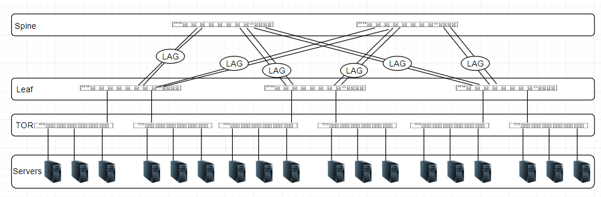

# Feature Name 
### Static Port Channel in SONiC

# High Level Design Document
#### Rev 0.1

# Table of Contents
  * [List of Tables](#list-of-tables)
  * [Revision](#revision)
  * [About This Manual](#about-this-manual)
  * [Scope](#scope)
  * [Definition/Abbreviation](#definition_abbreviation)
  * [1 Feature Overview](#1-feature-overview)
    * [1.1 Requirements](#11-requirements)
      * [1.1.1 Functional Requirements](#111-functional-requirements)
      * [1.1.2 Configuration and Management Requirements](#112-configuration-and-management-requirements)
      * [1.1.3 Scalability Requirements](#113-scalability-requirements)
      * [1.1.4 Warm Boot Requirements](#114-warm-boot-requirements)
    * [1.2 Design Overview](#12-design-overview)
      * [1.2.1 Basic Approach](#121-basic-approach)
      * [1.2.2 Container](#122-container)
      * [1.2.3 SAI Overview](#123-sai-overview)
  * [2 Functionality](#2-functionality)
    * [2.1 Target Deployment Use Cases](#21-target-deployment-use-cases)
      * [2.1.1 Enterprise](#211-enterprise)
      * [2.1.2 Data Center](#212-data-center)
    * [2.2 Functional Description](#22-functional-description)
  * [3 Design](#3-design)
    * [3.1 Overview](#31-overview)
      * [3.1.1 Teamd configuration](#311-teamd-configuration)
      * [3.1.2 Team Manager](#312-team-manager)
    * [3.2 DB Changes](#32-db-changes)
      * [3.2.1 CONFIG DB](#321-config-db)
      * [3.2.2 APP DB](#322-app-db)
      * [3.2.3 STATE DB](#323-state-db)
      * [3.2.4 ASIC DB](#324-asic-db)
      * [3.2.5 COUNTER DB](#325-counter-db)
    * [3.3 Switch State Service Design](#33-switch-state-service-design)
      * [3.3.1 Orchestration Agent](#331-orchestration-agent)
      * [3.3.2 Other Process](#331-other-process)
    * [3.4 SyncD](#34-syncd)
    * [3.5 SAI](#35-sai)
    * [3.6 CLI](#36-cli)
      * [3.6.1 Data Models](#361-data-models)
      * [3.6.2 Configuration Commands](#362-configuration-commands)
      * [3.6.3 Show Commands](#363-show-commands)      
      * [3.6.4 Debug Commands](#364-debug-commands)      
      * [3.6.5 Rest API Support](#365-rest-api-support)      
  * [4 Flow Diagrams](#4-flow-diagrams)
    * [4.1 Port Channel Creation](#41-port-channel-creation)
    * [4.2 Port Channel Member Addition](#42_port-channel-member-addition)
  * [5 Error Handling](#5-error-handling)
  * [6 Serviceability and Debug](#6-serviceability-and-debug)
  * [7 Warm Boot Support](#7-warm-boot-support)
  * [8 Scalability](#8-scalability)
  * [9 Unit Test](#9-unit-test)
  * [10 References](#references)
    * [Openconfig support for Port Channel](#openconfig-support-for-port-channel)

# List of Tables
[Table 1: Abbreviations](#table-1-abbreviations)

# Revision
| Rev |     Date    |       Author       | Change Description                |
|:---:|:-----------:|:------------------:|-----------------------------------|
| 0.1 | 10/31/2019  | Amitabha Sen       | Initial version                   |

# About this Manual
This document provides details on achieving Static Port Channel functionality in SONiC. 

# Scope
This document describes the high level design of Static Port Channel functionality.

# Definition/Abbreviation
### Table 1: Abbreviations
| **Term**                 | **Meaning**                         |
|--------------------------|-------------------------------------|
| LAG                      | Link Aggregation Group              |
| LACP                     | Link Aggregation Control Protocol   |

# 1 Feature Overview
## 1.1 Requirements
### 1.1.1 Functional Requirements
1. Support Port Channel in Static mode. Static Port Channel member ports are always available for traffic transmission and reception if the ports links are up. Port types and features are supported in the same way as SONiC LAGs today. MLAG should seamlessly work in Static Mode.

### 1.1.2 Configuration and Management Requirements
1. Provide configuration to set a Port Channel mode as Static with the KLISH and click CLI.
2. Enhance show commands to display the Port Channel mode as Static when configured so with the KLISH and click CLI.

### 1.1.3 Scalability Requirements
1. The maximum number of Port Channels configurable (Static and Dynamic put together) per system is 256.
2. The maximum number of member ports configurable per Port Channel are 32.

### 1.1.4 Warm Boot Requirements
The traffic loss during a warm reboot should be within the prescribed limits of warm boot.

## 1.2 Design Overview
### 1.2.1 Basic Approach
A Static Port Channel has its member ports always available for traffic as long the links are up. All ports are mandated to have the same speed to become members of a Port Channel. Teamd uses loadbalance runner for a Static Port Channel.

### 1.2.2 Container
An instance of Teamd process is created when a Port Channel (Static or Dynamic) is created. Teamd process runs as part of the Teamd docker. 

### 1.2.3 SAI Overview
There are no changes to SAI headers/implementation to support this feature. 

# 2 Functionality
## 2.1 Target Deployment Use Cases
Static Port Channels can be deployed in both Enterprise and Data center networks. Example usage scenarios for Static Port Channels are:

  - To attach legacy equipment that does not support LACP.
  - To handle warm boot cases where the control plane outage can exceed 3 * long timeout.

### 2.1.1 Enterprise


### 2.1.2 Data Center


## 2.2 Functional Description
A Port Channel bundles individual ports into a group to provide increased bandwidth, load balancing and redundancy. A Port Channel can be either Static or Dynamic. A Dynamic Port Channel runs Link Aggregation Signaling protocols like LACP to mark the links active for traffic. A Static Port Channel has its member ports always available for traffic. Incoming LACPDUs are silently ignored.

Static Port Channel uses the loadbalance runner which hashes CPU sourced or CPU forwarded traffic among the member ports. Traffic forwarded in hardware on the Port Channel uses the silicon specific traffic hashing algorithm. 

# 3 Design

## 3.1 Overview
Upon creating a static Port Channel, the "Teamd" daemon corresponding to that Port Channel is instantiated in static mode.

### 3.1.1 Teamd configuration
A user should be able to create the Port Channel in static or dynamic mode. For static mode, the CONFIG_DB is updated with a flag.
Note: Port Channels are dynamic by default in SONiC. 

### 3.1.2 Team Manager
Team Manager listens to Port Channel update events from the PORTCHANNEL and PORTCHANNEL_MEMBER table in CONFIG_DB. For the Static Port Channel add event it starts Teamd  with loadbalance as the runner; whereas for the dynamic Port Channel Teammgr starts Teamd with lacp as the runner. 

## 3.2 DB Changes
### 3.2.1 CONFIG DB
To support the static mode for a Port Channel, the PORTCHANNEL table is modified to add a new key-value pair where the value is a "true" or a "false".
```
"PORTCHANNEL|PortChannel2": {
        "type": "hash",
        "value": {
            "static": "true"
        }
    }

127.0.0.1:6379[4]> hgetall "PORTCHANNEL|PortChannel2"
1) "static"
2) "true"

```
### 3.2.2 APP DB
No new tables are needed.

### 3.2.3 STATE DB
No new tables are needed.

### 3.2.4 ASIC DB
No new tables are needed.

### 3.2.5 COUNTER DB
No new tables are needed.

## 3.3 Switch State Service Design
### 3.3.1 Orchestration Agent
No changes are needed.

### 3.3.2 Other Process
No changes are needed.

## 3.4 SyncD
No changes are needed.

## 3.5 SAI
No changes are needed.

## 3.6 CLI

### 3.6.1 Data Models
Please refer [Openconfig support for Port Channel](#openconfig-support-for-port-channel) for details on the Data Model.

### 3.6.2 Configuration Commands

Please refer [Openconfig support for Port Channel](#openconfig-support-for-port-channel) for details on KLISH CLI.

```
click CLI
1. config portchannel add PortChannel<number> --static=true
   Create a Static Port Channel.

```

### 3.6.3 Show Commands

Please refer [Openconfig support for Port Channel](#openconfig-support-for-port-channel) for details on KLISH CLI.

```
click CLI
1. show interfaces portchannel
This command is modified to show the Port Channel Protocol as None for a Static Port Channel.

root@sonic:/home/admin# show interfaces portchannel 
Flags: A - active, I - inactive, Up - up, Dw - Down, N/A - not available, S - selected, D - deselected
  No.  Team Dev      Protocol     Ports
-----  ------------  -----------  -------------------------
    1  PortChannel1  LACP(A)(Dw)  Ethernet0(D)
    2  PortChannel2  NONE(A)(Up)  Ethernet2(S) Ethernet1(S)

```
### 3.6.4 Debug Commands
No new debug commands are added.

### 3.6.5 Rest API Support
Please refer [Openconfig support for Port Channel](#openconfig-support-for-port-channel) for details on Rest API support.

# 4 Flow Diagrams
The below flow diagrams illustrate the interactions of TeamD with rest of the components in SONiC.

## 4.1 Port Channel Creation


## 4.2. Port Channel Member Addition


# 5 Error Handling
No new error handling support is added.

# 6 Serviceability and Debug
No new Serviceability or Debug support are added.

# 7 Warm Boot Support
Teamd supports warm boot. There is minimal traffic loss on the Port Channel during a system warm boot as the data plane is disrupted for less than 1 second.

# 8 Scalability
Teamd will support the necessary scalability requirements.

# 9 Unit Test
1. Create a Static Port Channel.
  - Verify that there is an entry in the PORTCHANNEL table in CONFIG_DB for the Port Channel and it is marked Static.
  - Verify that there is an entry in the kernel for the Port Channel and its state is Down.
  - Verify that there is an entry in the LAG\_TABLE in APPL_DB for the Port Channel and the operational status is Down.
  - Verify that there is an entry in the PORTCHANNEL in STATE_DB for the Port Channel.
  - Verify that there is an entry in the ASIC_DB for the Port Channel.
  - Verify that there is an entry in the hardware for the Port Channel with no member ports.
  - Dump Teamd instance config and Verify that the Port Channel is present and the runner is "loadbalance".
  - Dump Teamd instance state and verify that the Port Channel is present.

2. Add a member to the Static Port Channel.
  - Verify that there is an entry in the PORTCHANNEL\_MEMBER table in CONFIG_DB for the Port Channel with its member port.
  - Verify that there is an entry in the kernel for the Port Channel and its state is Up.
  - Verify that there is an entry in the LAG\_TABLE in APPL_DB for the Port Channel and the operational status is Up.
  - Verify that there is an entry in the LAG\_MEMBER\_TABLE in APPL_DB for the Port Channel and its member.
  - Verify that there is an entry in the PORTCHANNEL in STATE_DB for the Port Channel.
  - Verify that there is an entry in the ASIC_DB for the Port Channel with its member port.
  - Verify that there is an entry in the hardware for the Port Channel with its member port.
  - Dump Teamd instance config and Verify that the Port Channel is present with its member port.
  - Dump Teamd instance state and verify that the Port Channel is present with its member port.

3. Delete the member from the Static Port Channel and verify that the system is restored to the state as after test case 1.

4. Delete the Static Port Channel and verify that the Redis database, kernel, hardware and Teamd instance have deleted all information about the Port Channel. 
 

# References

## Openconfig support for Port Channel
https://github.com/project-arlo/SONiC/pull/11/files#diff-db29451602b3f687564afebd0df1e6f4
