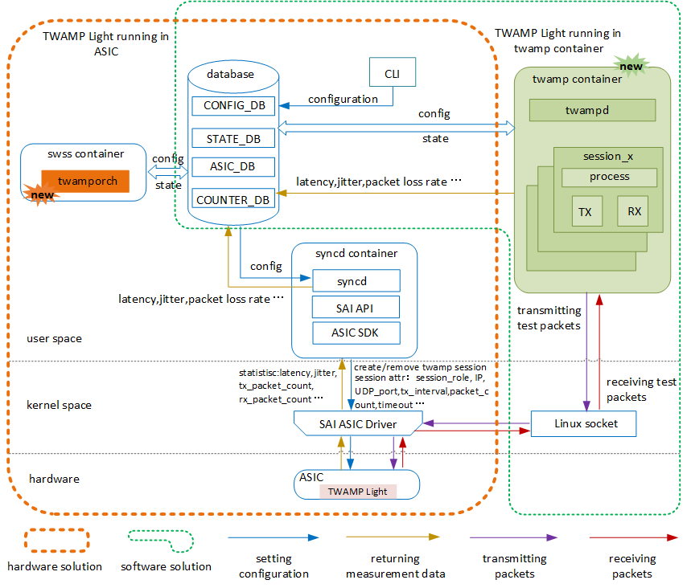
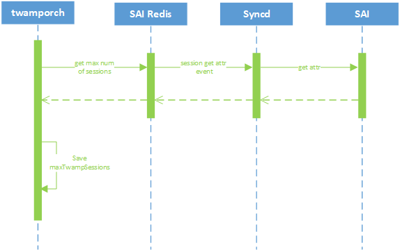
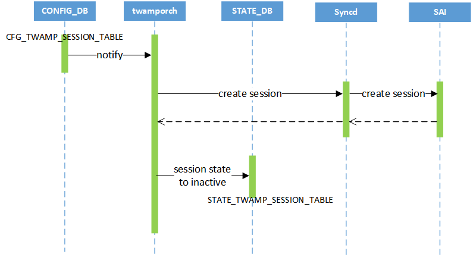
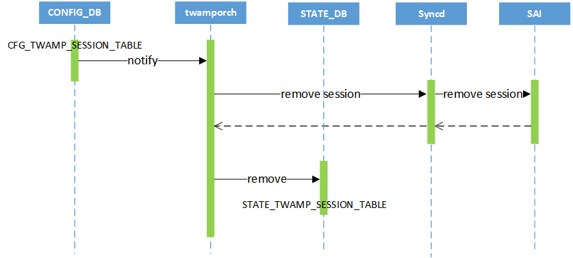
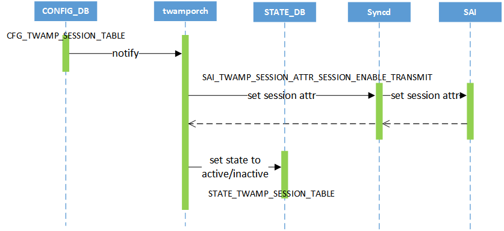
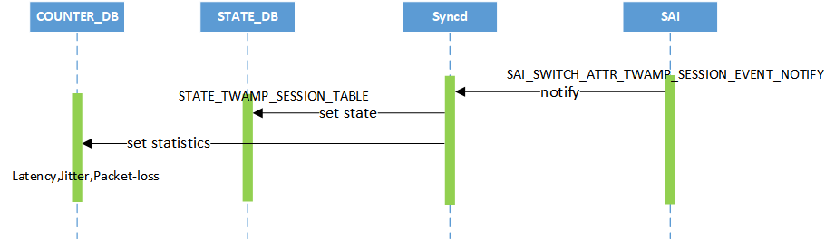
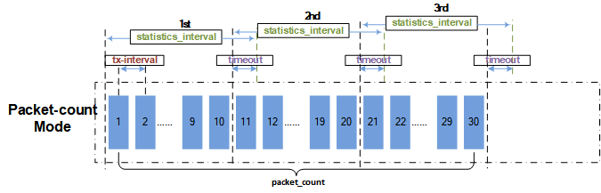
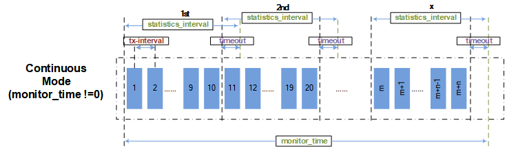
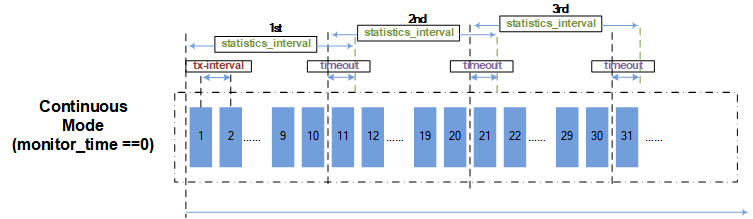

# TWAMP Light HLD #

## Table of Contents

  - [Definitions/Abbreviation](#definitionsabbreviation)

  - [Revision](#Revision)
  - [Scope](#Scope)
  - [Definition/Abbreviation](#Definition_Abbreviation)
  - [1. Overview](#1-Overview)
  - [2. Requirements](#2-Requirements)
    - [2.1 Functional requirements](#2_1-Functional_requirements)
    - [2.2 Configuration and Management Requirements](#2_2-Configuration_and_Management_Requirements)
    - [2.3 Scalability and Default Values](#2_3-Scalability_and_Default_Values)
      - [2.3.1 Scalability](#2_3_1-Scalability)
      - [2.3.2 Default Values](#2_3_2-Default_Values)
    - [2.4 Warm Restart requirements](#2_4-Warm_Restart_requirements)
  - [3. Architecture Design](#3-Architecture_Design)
  - [4. High-Level Design](#4-High_Level_Design)
      - [4.1 DB Changes](#4_1-DB_Changes)
        - [4.1.1 CONFIG DB](#4_2_1-CONFIG_DB)
        - [4.1.2 STATE DB](#4_2_2-STATE_DB)
        - [4.1.3 COUNTER DB](#4_2_3-COUNTER_DB)
      - [4.2 Flow Diagrams](#4_2-Flow_Diagrams)
        - [4.2.1 Query ASIC capability](#4_2_1-Query_ASIC_capability)
        - [4.2.2 Create session](#4_2_2-Create_session)
        - [4.2.3 Remove session](#4_2_3-Remove_session)
        - [4.2.4 Restart/Stop session](#4_2_4-Restart_Stop_session)
        - [4.2.5 Notify Session-Sender event](#4_2_5-Notify_Session_Sender_event)
  - [5. SAI API](#5-SAI_API)
  - [6. Configuration and management](#6-Configuration_and_management)
      - [6.1 Manifest](#6_1-Manifest)
      - [6.2 CLI](#6_2-CLI)
        - [6.2.1 Configuration commands](#6_2_1-Configuration_commands)
          - [6.2.1.1 Session-Sender with packet-count mode](#6_2_1_1-Session_Sender_with_packet_count_mode)
          - [6.2.1.2 Session-Sender with continuous mode](#6_2_1_2-Session_Sender_with_continuous_mode)
          - [6.2.1.3 Start TWAMP Light Session-Sender](#6_2_1_3-Start_TWAMP_Light_Session_Sender)
          - [6.2.1.4 Stop TWAMP Light Session-Sender](#6_2_1_4-Stop_TWAMP_Light_Session_Sender)
          - [6.2.1.5 Session-Reflector](#6_2_1_5-Session_Reflector)
          - [6.2.1.6 Remove_TWAMP_Light_session](#6_2_1_6-Remove_TWAMP_Light_session)
        - [6.2.2 Show commands](#6_2_1-Show_commands)
          - [6.2.2.1 Show TWAMP Light session status](#6_2_2_1-Show_TWAMP_Light_session_status)
          - [6.2.2.2 Show TWAMP Ligth latency and jitter](#6_2_2_2-Show_TWAMP_Ligth_latency_and_jitter)
          - [6.2.2.3 Show TWAMP Ligth packet loss](#6_2_2_3-Show_TWAMP_Light_packet_loss)
      - [6.3 YANG](#6_2-YANG)
   - [7. Warmboot and Fastboot Design Impact](#7-Warmboot_and_Fastboot_Design_Impact)
   - [8. Restrictions_Limitations](#8-Restrictions_Limitations)
   - [9. Testing Requirements/Design](#9-Testing_Requirements_Design)
      - [9.1 Unit Test cases](#9_1-Unit_Test_cases)
        - [9.2.1 CLI](#9_2_1-CLI)
        - [9.2.2 Functionality](#9_2_2-Functionality)
        - [9.2.3 Scaling](#9_2_3-Scaling)
        - [9.2.4 SAI](#9_2_4-SAI)
   - [References](#-References)

## Revision

| Rev  |    Date    |                Author                 | Change Description |
| :--: | :--------: | :-----------------------------------: | ------------------ |
| 0.1  | 06/12/2023 | Xiaodong Hu, Shuhua You, Xianghong Gu | Initial version    |

## Scope

This document describes the requirements, architecture, and configuration details of the TWAMP Light feature in SONiC.

## Definition/Abbreviation

| **Definitions/Abbreviation** | Description                               |
| ---------------------------- | ----------------------------------------- |
| TWAMP                        | Two-way Active Measurement Protocol       |
| TWAMP Light                  | A light version of TWAMP                  |
| AR                           | Augmented Reality                         |
| IPPM                         | IP Performance Measurement                |
| OAM                          | Operation, Administration and Maintenance |
| SAI                          | Switch Abstraction Interface              |
| RPM                          | Real-Time Performance Monitor             |
| RTT                          | Round-Trip Time                           |
| VRF                          | Virtual Routing and Forwarding            |

## 1 Overview

With the rapid development of network application technologies, latency and packet loss-sensitive such as audio, video and AR services impose higher requirements on network performance. In this requirement scenario, service providers need a mechanism that provides real-time information about the quality and latency of network paths for helping them to monitor and maintain the quality of their networks.

Some vendors use proprietary features such as RPM to measure IP network performance, so it is not universally supported by devices. In this interoperability environment, service providers need an effective, simple, and universal OAM performance measurement mechanism for performance measurement of the network.

There are some standard measurement tools such as Ping and Traceroute. Ping is a tool used to test connectivity and measure RTT, and Traceroute is a tool used to identify the path that packets take between two hosts, but TWAMP Light serves different purposes from them. TWAMP Light measures the quality and latency of the network path in both directions, providing a more accurate view of the network performance.

TWAMP Light defined by the IP Performance Measurement (IPPM) working group,  is a standard performance measurement protocol applied to IP networks as described in RFC5357. It provides a unified measurement model and unified test packet format for interoperability among devices of different vendors. TWAMP Light uses the client-server model. It generates and maintains the performance measurement data only on the client.  As an IP link detection technology, It can monitor network quality, including latency, jitter, and packet loss. So it is easy to deploy and use.


TWAMP Light does not require a control connection to set up and manage the measurement sessions. Instead, it uses a simple message exchange process between two endpoints to initiate and terminate the measurements. In hence, the roles of Control-Client, Server and Session-Sender are implemented in one host referred to as the controller, and the role of Session-Reflector is implemented in another host referred to as the responder as described in RFC5357.  TWAMP Light is a Two-way measurement witch is common in IP networks, primarily because synchronization between local and remote clocks is unnecessary for round-trip delay, and measurement support at the remote end may be limited to a simple echo function.

To calculate the latency, jitter, and packet loss rate of network, the following steps are typically followed:

- Session-Sender as the active endpoint of the TWAMP Light sends a Test-request packet with a tx timestamp marked as t0.
- Session-Reflector receives the Test-request packet and captures a rx timestamp as t1.
- Prior to the transmission of the Test-response packet, Session-Reflector captures a tx timestamp as t2.
- Session-Reflector encodes t1 and t2 into the Test-response packet, then sends it out.
- Session-Sender receives the Test-response packet and captures a rx timestamp as t3.

The algorithm is:

- Latency = (t3-t0) – (t2-t1)
- Jitter = | Latency1 – Latency0 |
- Packet loss rate = (txPkt – rxPkt) / txPkt

## 2 Requirements

### 2.1 Functional requirements

At a high level the following should be supported:

Phase #1

- RFC5357  TWAMP Light should be followed
- Should be able to perform the role of TWAMP Light Session-Sender:

  - Support on-demand measurement based on specific number of packets
  - Support proactive measurement
  - Support to start and stop sending TWAMP-Test packets
- Should be able to perform the role of TWAMP Light Control-Client:

  - Maintain the performance measurement data including latency, jitter and packet loss
- Should be able to perform the role of TWAMP Light Session-Reflector:

  - Support to reflect TWAMP-Test packets to sender
- Should be able to configure TWAMP-Test packets fileds: Source IP, L4 Source Port, Destination IP, L4 Destination Port, DSCP, TTL, timestamp format, padding

Later phases:

 - Support the authenticated and encrypted modes
 - Support overlay network measurement
 - Support an approach of measurement based on pure software

### 2.2 Configuration and Management Requirements

- Support CLI configuration commands
- Support show commands

### 2.3 Scalability and Default Values

#### 2.3.1 Scalability

The maximum number of sessions is due to hardware capability in hardware mode.

The maximum number of sessions is not limited in software mode.

#### 2.3.2 Default Values

Below table shows the default values for TWAMP Test-packets.

| Attribute                              | Value |
| -------------------------------------- | ----- |
| TWAMP_SESSION_DEFAULT_DSCP             | 0     |
| TWAMP_SESSION_DEFAULT_TTL              | 255   |
| TWAMP_SESSION_DEFAULT_TIMESTAMP_FORMAT | NTP   |

### 2.4 Warm Restart requirements

At this time warm restart capability is no factored into the design. This shall be revisited as a later phase enhancement.

## 3 Architecture Design

It is delighted to introduce two approaches of measurement which implement TWAMP Light. One is based on ASIC and the other is based on pure software. In orchagent initialization phase, it can query the TWAMP Light capability from ASIC to choose one approach to deploy TWAMP Light.



Architecture considers both software and hardware solutions, with the main difference is the generation, transmission, and calculation of test packets based on hardware or software. In case of the chip supports TWAMP Light feature, the hardware solution provides more precise measurement results. If not, the software solution can be chosen for TWAMP Light.

* TWAMP Light architecture using the hardware solution. A process twamporch is newly added in the hardware solution. Twamporch subscribes to TWAMP_LIGHT_TABLE and creates a session that includes properties such as IP, UDP PORT and offloads to ASIC. The ASIC generates the test packets, independently calculates the measurement data, and reports it to the up layer system.

* TWAMP Light architecture using the software solution. A TWAMP container is newly added. The container includes twampd which subscribes to TWAMP_LIGHT_TABLE and creates a session that includes properties such as IP, UDP PORT. Twampd runs two threads, one generates TWAMP-test packets and sends them out by Linux socket, the other receives TWAMP-test packets from Linux socket. For Session-Sender, twampd is required to calculate the latency, jitter and packet loss rate based on the measurement data such as timestamp, transmitting and receiving packets count and so on. For Session-Reflector, twampd reflects the TWAMP-test packet with timestamp.

## 4 High-Level Design

### 4.1 DB Changes

#### 4.1.1 CONFIG DB

```
;Stores TWAMP Light sender or reflector session configuration
;Status: work in progress
key                     = TWAMP_SESSION|session_name ; session_name is
                                                     ; unique session identifier

; field                 = value
mode                    = "LIGHT"          ; TWAMP Light mode
role                    = SENDER/REFLECTOR ; TWAMP Light role is sender or reflector
vrf                     = <vrf_name>       ; vrf name
src_ip                  = <ip_addr>        ; sender ip address
dst_ip                  = <ip_addr>        ; reflector ip address
udp_src_port            = <uint16_t>       ; sender udp port
udp_dst_port            = <uint16_t>       ; reflector udp port
packet_count            = <uint32_t>       ; TEST-Request packet count
monitor_time            = <uint32_t>       ; continuous in mins (0 indicates forever)
tx_interval             = <uint32_t>       ; transmit TEST-Request in msecs ([10,100,1000], DEF:100)
timeout                 = <uint32_t>       ; timeout in secs (1 to 10, DEF:5)
statistics_interval     = <uint32_t>       ; calculate in millisecond (DEF:0)
test_session_enable     = ENABLE/DISABLE   ; session is enabled or disabled
dscp                    = <uint8_t>        ; TEST-Request packet DSCP (0 to 63, DEF:0)
ttl                     = <uint8_t>        ; TEST-Request packet TTL (DEF:255)
packet_padding_size     = <uint16_t>       ; TEST-Request packet padding length (32 to 1454, DEF:108)
```

#### 4.1.2 STATE DB

```
;Stores TWAMP Light state table
;Status: work in progress
key                     = TWAMP_SESSION_TABLE|session_name ; mirror_session_name is
                                                           ; unique session
                                                           ; identifier

; field                 = value
status                  = ACTIVE/INACTIVE  ; session test status
```

#### 4.1.3 COUNTER DB

The following new counters are applicable per session.

```
COUNTERS_TWAMP_SESSION_NAME_MAP
    session_name         :    <session_name_oid>

COUNTERS:oid:session_name_oid:index
    SAI_TWAMP_SESSION_STAT_RX_PACKETS      :    <packets_counter_value>
    SAI_TWAMP_SESSION_STAT_RX_BYTE         :    <bytes_counter_value>
    SAI_TWAMP_SESSION_STAT_TX_PACKETS      :    <packets_counter_value>
    SAI_TWAMP_SESSION_STAT_TX_BYTE         :    <bytes_counter_value>
    SAI_TWAMP_SESSION_STAT_DROP_PACKETS    :    <packets_counter_value>
    SAI_TWAMP_SESSION_STAT_MAX_LATENCY     :    <performance_value>
    SAI_TWAMP_SESSION_STAT_MIN_LATENCY     :    <performance_value>
    SAI_TWAMP_SESSION_STAT_AVG_LATENCY     :    <performance_value>
    SAI_TWAMP_SESSION_STAT_MAX_JITTER      :    <performance_value>
    SAI_TWAMP_SESSION_STAT_MIN_JITTER      :    <performance_value>
    SAI_TWAMP_SESSION_STAT_AVG_JITTER      :    <performance_value>
    SAI_TWAMP_SESSION_STAT_FIRST_TS        :    <timestamp_value>
    SAI_TWAMP_SESSION_STAT_LAST_TS         :    <timestamp_value>
    SAI_TWAMP_SESSION_STAT_DURATION_TS     :    <timestamp_value>
```

### 4.2 Flow Diagrams

Below diagram shows the flow for hardware solution.

#### 4.2.1 Query ASIC capability

Below diagram shows the flow for switchporch queries ASIC capability.



#### 4.2.2 Create session

Below diagram shows the flow of creating Session-Sender or Session-Reflector.



#### 4.2.3 Remove session

Below diagram shows the flow of removing Session-Sender or Session-Reflector.



#### 4.2.4 Start/Stop session

Below diagram shows the flow of starting or stopping Session-Sender.



#### 4.2.5 Notify Session-Sender event

Below diagram shows the flow of notifying the session running state and measurement data.



## 5 SAI API

Following SAI API changes are proposed to program the modes to get the ASIC capability:

**File: saitswitch.h**

    /**
     * @brief Attribute Id in sai_set_switch_attribute() and
     * sai_get_switch_attribute() calls.
     */
    typedef enum _sai_switch_attr_t
    {
    .
    .
        /**
         * @brief Set TWAMP session event notification callback function passed to the adapter.
         *
         * Use sai_twamp_session_event_notification_fn as notification function.
         *
         * @type sai_pointer_t sai_twamp_session_event_notification_fn
         * @flags CREATE_AND_SET
         * @default NULL
         */
        SAI_SWITCH_ATTR_TWAMP_SESSION_EVENT_NOTIFY,

        /**
         * @brief Max number of Two-Way Active Measurement Protocol session supports
         *
         * @type sai_uint32_t
         * @flags READ_ONLY
         */
        SAI_SWITCH_ATTR_MAX_TWAMP_SESSION,
    .
    .
    } sai_switch_attr_t;
Max number of TWAMP Light sessions(SAI_SWITCH_ATTR_MAX_TWAMP_SESSION) are defined in below SAI spec -

https://github.com/opencomputeproject/SAI/pull/1786

**File: saitwamp.h**

    /**
     * @brief SAI attributes for Two-Way Active Measurement Protocol session
     */
    typedef enum _sai_twamp_session_attr_t
    {
    .
    .
        /**
         * @brief Two-Way Active Measurement Protocol session role of sender or receiver.
         *
         * @type sai_twamp_session_role_t
         * @flags MANDATORY_ON_CREATE | CREATE_ONLY
         */
        SAI_TWAMP_SESSION_ATTR_SESSION_ROLE,

        /**
         * @brief UDP Source port
         *
         * @type sai_uint32_t
         * @flags MANDATORY_ON_CREATE | CREATE_ONLY
         */
        SAI_TWAMP_SESSION_ATTR_UDP_SRC_PORT,

        /**
         * @brief UDP Destination port
         *
         * @type sai_uint32_t
         * @flags MANDATORY_ON_CREATE | CREATE_ONLY
         */
        SAI_TWAMP_SESSION_ATTR_UDP_DST_PORT,

        /**
         * @brief Local source IP address
         *
         * @type sai_ip_address_t
         * @flags MANDATORY_ON_CREATE | CREATE_ONLY
         */
        SAI_TWAMP_SESSION_ATTR_SRC_IP,

        /**
         * @brief Remote Destination IP address
         *
         * @type sai_ip_address_t
         * @flags MANDATORY_ON_CREATE | CREATE_ONLY
         */
        SAI_TWAMP_SESSION_ATTR_DST_IP,

        /**
         * @brief DSCP of Traffic Class
         *
         * @type sai_uint8_t
         * @flags CREATE_ONLY
         * @default 0
         */
        SAI_TWAMP_SESSION_ATTR_DSCP,

        /**
         * @brief IP header TTL
         *
         * @type sai_uint8_t
         * @flags CREATE_ONLY
         * @default 255
         * @validonly SAI_TWAMP_SESSION_ATTR_SESSION_ROLE == SAI_TWAMP_SESSION_ROLE_SENDER
         */
        SAI_TWAMP_SESSION_ATTR_TTL,

        /**
         * @brief Virtual Private Network virtual router
         *
         * @type sai_object_id_t
         * @flags CREATE_ONLY
         * @objects SAI_OBJECT_TYPE_VIRTUAL_ROUTER
         * @allownull true
         * @default SAI_NULL_OBJECT_ID
         * @validonly SAI_TWAMP_SESSION_ATTR_HW_LOOKUP_VALID == true
         */
        SAI_TWAMP_SESSION_ATTR_VPN_VIRTUAL_ROUTER,

        /**
         * @brief Encapsulation type
         *
         * @type sai_twamp_encapsulation_type_t
         * @flags CREATE_ONLY
         */
        SAI_TWAMP_SESSION_ATTR_TWAMP_ENCAPSULATION_TYPE,

    	/**
         * @brief To enable Two-Way Active Measurement Protocol session transmit packet
         *
         * @type bool
         * @flags CREATE_AND_SET
         * @default false
         * @validonly SAI_TWAMP_SESSION_ATTR_SESSION_ROLE == SAI_TWAMP_SESSION_ROLE_SENDER
         */
        SAI_TWAMP_SESSION_ATTR_SESSION_ENABLE_TRANSMIT,

    	/**
         * @brief Hardware lookup valid
         *
         * @type bool
         * @flags CREATE_ONLY
         * @default true
         */
        SAI_TWAMP_SESSION_ATTR_HW_LOOKUP_VALID,

        /**
         * @brief Two-Way Active Measurement Protocol test packet tx interval
         *
         * @type sai_uint32_t
         * @flags CREATE_ONLY
         * @condition SAI_TWAMP_SESSION_ATTR_SESSION_ROLE == SAI_TWAMP_SESSION_ROLE_SENDER
         */
        SAI_TWAMP_SESSION_ATTR_TX_INTERVAL,

        /**
         * @brief Two-Way Active Measurement Protocol packet tx mode: CONTINUOUS, PACKET_COUNT
         *
         * Valid when SAI_TWAMP_SESSION_ATTR_SESSION_ROLE == SAI_TWAMP_SESSION_ROLE_SENDER
         *
         * @type sai_twamp_pkt_tx_mode_t
         * @flags MANDATORY_ON_CREATE | CREATE_ONLY
         */
        SAI_TWAMP_SESSION_ATTR_TWAMP_PKT_TX_MODE,

        /**
         * @brief Two-Way Active Measurement Protocol test packet tx count, configuring by Two-Way Active Measurement Protocol send packet count of Tx
         *
         * @type sai_uint32_t
         * @flags MANDATORY_ON_CREATE | CREATE_ONLY
         * @condition SAI_TWAMP_SESSION_ATTR_SESSION_ROLE == SAI_TWAMP_SESSION_ROLE_SENDER and SAI_TWAMP_SESSION_ATTR_TWAMP_PKT_TX_MODE == SAI_TWAMP_PKT_TX_MODE_PACKET_NUM
         */
        SAI_TWAMP_SESSION_ATTR_TX_PKT_CNT,

        /**
         * @brief Two-Way Active Measurement Protocol test packet tx period
         * if tx period equal 0, sender will continue to generate packet and send them.
         *
         * @type sai_uint32_t
         * @flags MANDATORY_ON_CREATE | CREATE_ONLY
         * @condition SAI_TWAMP_SESSION_ATTR_SESSION_ROLE == SAI_TWAMP_SESSION_ROLE_SENDER and SAI_TWAMP_SESSION_ATTR_TWAMP_PKT_TX_MODE == SAI_TWAMP_PKT_TX_MODE_PERIOD
         */
        SAI_TWAMP_SESSION_ATTR_TX_PKT_PERIOD,

        /**
         * @brief Two-Way Active Measurement Protocol mode: light mode and full mode
         *
         * @type sai_twamp_mode_t
         * @flags MANDATORY_ON_CREATE | CREATE_ONLY
         */
        SAI_TWAMP_SESSION_ATTR_TWAMP_MODE,

        /**
         * @brief The format of timestamp in test packet.
         *
         * @type sai_twamp_timestamp_format_t
         * @flags CREATE_ONLY
         * @default sai_twamp_timestamp_format_t
         */
        SAI_TWAMP_SESSION_ATTR_TIMESTAMP_FORMAT,
    .
    .
    } sai_twamp_session_attr_t;

    /**
     * @brief Two-Way Active Measurement Protocol Session counter IDs in sai_get_twamp_session_stats() call
     */
    typedef enum _sai_twamp_session_stats_t
    {
        /** Rx packet stat count */
        SAI_TWAMP_SESSION_STATS_RX_PACKETS,

        /** Rx byte stat count */
        SAI_TWAMP_SESSION_STATS_RX_BYTE,

        /** Tx packet stat count */
        SAI_TWAMP_SESSION_STATS_TX_PACKETS,

        /** Tx byte stat count */
        SAI_TWAMP_SESSION_STATS_TX_BYTE,

        /** Packet Drop stat count */
        SAI_TWAMP_SESSION_STATS_DROP_PACKETS,

        /** Packet max latency */
        SAI_TWAMP_SESSION_STATS_MAX_LATENCY,

        /** Packet min latency */
        SAI_TWAMP_SESSION_STATS_MIN_LATENCY,

        /** Packet avg latency */
        SAI_TWAMP_SESSION_STATS_AVG_LATENCY,

        /** Packet max value */
        SAI_TWAMP_SESSION_STATS_MAX_JITTER,

        /** Packet min value */
        SAI_TWAMP_SESSION_STATS_MIN_JITTER,

        /** Packet avg value */
        SAI_TWAMP_SESSION_STATS_AVG_JITTER,

        /** Session first timestamp */
        SAI_TWAMP_SESSION_STATS_FIRST_TS,

        /** Session last timestamp */
        SAI_TWAMP_SESSION_STATS_LAST_TS,
    } sai_twamp_session_stats_t;

    /**
     * @brief Two-Way Active Measurement Protocol method table retrieved with sai_api_query()
     */
    typedef struct _sai_twamp_api_t
    {
        sai_create_twamp_session_fn            create_twamp_session;
        sai_remove_twamp_session_fn            remove_twamp_session;
        sai_set_twamp_session_attribute_fn     set_twamp_session_attribute;
        sai_get_twamp_session_attribute_fn     get_twamp_session_attribute;
        sai_get_twamp_session_stats_fn         get_twamp_session_stats;
        sai_get_twamp_session_stats_ext_fn     get_twamp_session_stats_ext;
        sai_clear_twamp_session_stats_fn       clear_twamp_session_stats;

    } sai_twamp_api_t;


TWAMP Light SAI interface APIs are already defined and is available at below location -

https://github.com/opencomputeproject/SAI/pull/1786

## 6 Configuration and management

Following diagram introduces the CLI parameters for the TWAMP Light Session-Sender configuration.







### 6.1 Manifest (if the feature is an Application Extension)

N/A

### 6.2 CLI

#### 6.2.1 Configuration commands

New sets of configuration commands are introduced to configure TWAMP Light.

##### 6.2.1.1 Session-Sender with packet-count mode

This command is used to create Session-Sender with packet-count mode.

```
Format:
  config twamp-light session-sender add packet-count <session_name> [vrf <vrf_name>] <sender_ip_port> <reflector_ip_port> <packet_count> <tx_interval> <timeout> <statistics_interval>

Arguments:
  session_name: session sender name. e.g: s1, test_ip1_ip2
  vrf_name: session vrf name. e.g: vrf1
  sender_ip_port: sender ip and udp port. e.g: 10.1.1.2:20000
  reflector_ip_port: reflector ip and udp port. e.g: 10.1.1.2:20001
  packet_count: sender transmits Test-request packet count, e.g: 100
  tx_interval: sender transmits Test-request packet interval in millisecond. e.g: 10
  timeout: sender receives Test-response packet timeout in second. e.g. 5
  statistics_interval: sender calculates measurement statistics in millisecond, e.g: 60

Example:
  config twamp-light session-sender add packet-count s1 10.1.1.2:20000 20.2.2.2:20001 100 10 60
```

##### 6.2.1.2 Session-Sender with continuous mode

This command is used to create Session-Sender with continuous mode.

```
Format:
  config twamp-light session-sender add continuous <session_name> [vrf <vrf_name>] <sender_ip_port> <reflector_ip_port> <monitor_time> <tx_interval> <imeout> <statistics_interval>

Arguments:
  session_name: sender session name. e.g: s1, test_ip1_ip2
  vrf_name: session vrf name. e.g: vrf1
  sender_ip_port: sender ip and udp port. e.g: 10.1.1.2:20000
  reflector_ip_port: reflector ip and udp port. e.g: 10.1.1.2:20001
  monitor_time: sender monitor Test-request packet in minute. e.g: 10
  tx_interval: sender transmits Test-request packet interval in millisecond. e.g: 10
  timeout: sender receives Test-response packet timeout in second. e.g. 5
  statistics_interval: sender calculates measurement statistics in millisecond, e.g: 60

Example:
  config twamp-light session-sender add continuous s1 10.1.1.2:2000 192.168.3.2:20001 10 10 10 60
```

##### 6.2.1.3 Start TWAMP Light Session-Sender

This command is used to start the Session-Sender.

```
Format:
  config twamp-light session-sender start <session_name|all>

Arguments:
  session_name: session name. e.g: s1
  all: all sessions

Example:
  config twamp-light session-sender start s1
  config twamp-light session-sender start all
```

##### 6.2.1.4 Stop TWAMP Light Session-Sender

This command is used to stop the Session-Sender

```
Format:
  config twamp-light session-sender stop <session_name|all>

Arguments:
  session_name: session name. e.g: s1
  all: all sessions

Example:
  config twamp-light session-sender stop s1
  config twamp-light session-sender stop all
```

##### 6.2.1.5 Session-Reflector

This command is used to create the Session-Reflector.

```
Format:
  config twamp-light session-reflector add <session_name> [vrf <vrf_name>] <sender_ip_port> <reflector_ip_port>

Arguments:
  session_name: sender session name. e.g: r1, test_ip1_ip2
  vrf_name: session vrf name. e.g: vrf1
  sender_ip_port: sender ip and udp port. e.g: 10.1.1.2:20000
  reflector_ip_port: reflector ip and udp port. e.g: 10.1.1.2:20001

Example:
  config twamp-light reflector add r1 10.1.1.2:20000 20.2.2.2:20001
```

##### 6.2.1.6 Remove TWAMP Light session

This command is used to remove the session.

```
Format:
  config twamp-light remove <session_name|all>

Arguments:
  session_name: session name. e.g: s1
  all: all sessions

Example:
  config twamp-light remove s1
  config twamp-light remove all
```

#### 6.2.2 Show commands

New sets of show commands are introduced to display the result of measurement.

##### 6.2.2.1 Show TWAMP Light session status

This command is used to display the Session-Sender and Session-Reflector status.

```
show twamp-light session
TWAMP Light Sender Sessions
Name    Status    Sender IP:PORT    Reflector IP:PORT    Type            Packet Count     Monitor    Tx Interval    Stats Interval    Timeout  Last Start Time      Last Stop Time
------  --------  ----------------  -------------------  ------------  --------------  ----------  -------------  ----------------  ---------  -------------------  -------------------
sdp34   inactive  30.3.3.2:20000    40.4.4.2:20001       Packet-count              10  -                      10                10         10  2023-02-23 15:23:09  2023-02-23 15:23:10

TWAMP Light Reflector Sessions
Name    Status    Sender IP:PORT    Reflector IP:PORT
------  --------  ----------------  -------------------

```

##### 6.2.2.2 Show TWAMP Ligth latency and jitter

This command is used to display the latency and jitter.

```
show twamp-light statistics twoway-latency
Latest two-way latency statistics(nsec):
Name      Index    Latency(AVG)    Jitter(AVG)
------  -------  --------------  -------------
sdp34         1           20906         134217

Total two-way latency statistics(nsec):
Name      Latency(AVG)    Latency(MIN)    Latency(MAX)    Jitter(AVG)    Jitter(MIN)    Jitter(MAX)
------  --------------  --------------  --------------  -------------  -------------  -------------
sdp34            20906               5               6         134217        3489660        3489660
```

##### 6.2.2.3 Show TWAMP Ligth packet loss

This command is used to display the packet loss

```
show twamp-light statistics twoway-loss
Latest two-way loss statistics:
  Index    Loss Count    Loss Ratio

-------  ------------  ------------

      1             0             0

Total two-way loss statistics:
Name      Loss Count(AVG)    Loss Count(MIN)    Loss Count(MAX)    Loss Ratio(AVG)    Loss Ratio(MIN)    Loss Ratio(MAX)

------  -----------------  -----------------  -----------------  -----------------  -----------------  -----------------

sdp34                   0                  0                  0                  0                  0                  0
```

#### 6.3 YANG

    module sonic-twamp {

        yang-version 1.1;

        namespace "http://github.com/Azure/sonic-twamp";
        prefix stwamp;

        import ietf-inet-types {
            prefix inet;
        }

        import sonic-vrf {
            prefix vrf;
        }

        description
            "SONiC twamp yang model";

        revision 2023-06-11 {
            description
                "Initial revision.";
        }

        typedef timestamp_format {
            type enumeration {
                enum ntp {
                    description "NTP 64 bit format of a timestamp";
                }
                enum ptp {
                    description "PTPv2 truncated format of a timestamp";
                }
            }
            description "timestamp format used by Session-Sender or Session-Reflector.";
        }

        feature session_sender {
            description "This feature relates to the device functions as the TWAMP Session-Sender";
        }

        feature session_reflector {
            description "This feature relates to the device functions as the TWAMP Session-Reflector";
        }

        grouping session_parameters {
            description "TWAMP session parameters";
            leaf sender_ip {
                type inet:ip-address;
                mandatory true;
                description "Sender IP address";
            }
            leaf sender_udp_port {
                type inet:port-number {
                    range "862 | 863 | 1025..65535";
                }
                default 862;
                mandatory true;
                description "Sender UDP port number";
            }
            leaf reflector_ip {
                type inet:ip-address;
                mandatory true;
                description "Reflector IP address";
            }
            leaf reflector_udp_port {
                type inet:port-number {
                    range "862 | 863 | 1025..65535";
                }
                default 863;
                description "Reflector UDP port number";
            }
            leaf vrf_name {
                type union {
                    type string {
                        pattern "default";
                    }
                    type leafref {
                        path "/vrf:sonic-vrf/vrf:VRF/vrf:VRF_LIST/vrf:name";
                    }
                }
                description "VRF name";
            }
        }

        container sonic-twamp {
            description "Top level container for TWAMP configuration";

            container TWAMP_SESSION_SENDER {
                if-feature session_sender;
                description "TWAMP Session-Sender container";

                list test_session {
                    key "name";
                    unique "sender_ip sender_udp_port reflector_ip reflector_udp_port vrf_name";
                    description
                        "This structure is a container of test session managed objects";
                    leaf name {
                        type string;
                        description "A unique name for this TWAMP-Test session to be used
                                    for identifying this test session by the
                                    Session-Sender logical entity.";
                    }
                    uses session_parameters;
                    leaf test_session_enable {
                        type boolean;
                        default "true";
                        description "Whether this TWAMP Test session is enabled";
                    }
                    leaf dscp {
                        type inet:dscp;
                        default 0;
                        description
                            "DSCP value to be set in the test packet.";
                    }
                    leaf ttl {
                        type inet:ttl;
                        default 0;
                        description
                            "TTL value to be set in the test packet.";
                    }
                    leaf packet_timestamp_format {
                        type timestamp_format;
                        default ntp;
                        description "Sender Timestamp format";
                    }
                    leaf packet_padding_size {
                        type uint16;
                        default 30;
                        description
                            "Size of the Packet Padding. Suggested to run Path MTU
                            Discovery to avoid packet fragmentation in IPv4 and packet
                            blackholing in IPv6";
                    }
                    leaf packet_count {
                        type uint32;
                        default 1000;
                        description
                            "This value determines if the TWAMP-Test session is
                            bound by number of test packets or not.";
                    }
                    leaf tx_interval {
                        type union {
                            type uint32 {
                               range "10 | 100 | 1000 | 30000";
                            }
                        }
                        units microseconds;
                    }
                    leaf statistics_interval {
                        type uint32;
                        units millisecond;
                        default 60;
                        description
                            "Interval to calculate performance metric";
                    }
                    leaf monitor_time {
                        type uint32;
                        units minutes;
                        default 0;
                        description
                            "The value 0 indicates that the test session SHALL run *forever*";
                    }
                    leaf timeout {
                        type uint32 {
                            range "1..10";
                        };
                        units "seconds";
                        default 5;
                        description
                            "The timeout value for the Session-Sender to
                            collect outstanding reflected packets.";
                    }
                }
            }

            container TWAMP_SESSION_REFLECTOR {
                if-feature session_reflector;
                description "TWAMP Session-Reflector container";
                list test_session {
                    key "name";
                    unique "sender_ip sender_udp_port reflector_ip reflector_udp_port vrf_name";
                    description
                        "This structure is a container of test session
                        managed objects";
                    leaf name {
                        type string;
                        description "A unique name for this TWAMP-Test session to be used
                                    for identifying this test session by the
                                    Session-Reflector logical entity.";
                    }
                    uses session_parameters;
                }
            }
        }
    }
## 7 Warmboot and Fastboot Design Impact

TBD

## 8 Restrictions/Limitations

N/A

## 9 Testing Requirements/Design

### 9.1 Unit Test cases

#### 9.1.1 CLI

1) Verify CLI to create TWAMP Light Session-Sender for packet-count measurement
3) Verify CLI to create TWAMP Light Session-Sender for continuous measurement
4) Verify CLI to create TWAMP Light Session-Reflector
5) Verify CLI to start TWAMP Light Session-Sender
6) Verify CLI to stop TWAMP Light Session-Sender
7) Verify CLI to show TWAMP Light session status
8) Verify CLI to show TWAMP Light Session-Sender statistics

#### 9.1.2 Functionality

1) Verify TWAMP-test format of the packets are correct
2) Verify TWAMP Light sender performs packet-count measurement
3) Verify TWAMP Light sender performs continuous measurement
4) Verify TWAMP Light sender collects and saves measurement statistics
5) Verify TWAMP Light reflector receives and replies test packets to sender

#### 9.1.3 Scaling

1) Verify running MAX num TWAMP Light sessions

#### 9.1.4 SAI

1) Verify creating TWAMP Light session in SAI
2) Verify setting TWAMP Light session state in SAI
3) Verify removing TWAMP Light session in SAI
4) Verify getting TWAMP Light session in SAI
5) Verify getting TWAMP Light max num session in SAI

## References

Reference for proposed algorithm:

 [RFC5357](https://www.rfc-editor.org/info/rfc5357)


