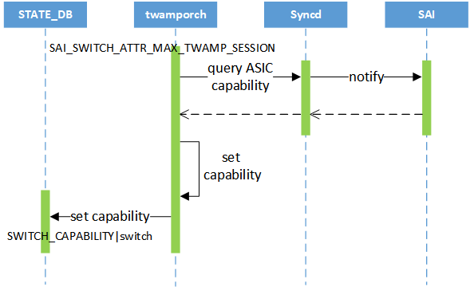

# SONiC TWAMP Light #

# High Level Design Document #

### Rev 0.1

# Table of Contents

[TOC]

# List of Tables

###### Table1: Revision ######

| Rev  |    Date    |                Author                 | Change Description |
| :--: | :--------: | :-----------------------------------: | ------------------ |
| 0.1  | 04/03/2023 | Xiaodong Hu, Shuhua You, Xianghong Gu | Initial version    |

# About this Manual

This document provides general information about the TWAMP Light feature implementation in SONiC.

# Scope

This document describes the high level design of TWAMP Light feature. 

# Definition/Abbreviation

###### Table 2: Abbreviations

| **Definitions/Abbreviation** | Description                         |
| ---------------------------- | ----------------------------------- |
| TWAMP                        | Two-way Active Measurement Protocol |
| TWAMP Light                  | A light version of TWAMP            |

# 1. Requirements Overview

## 1.1 Functional requirements

At a high level the following should be supported:

- TWAMP Light sender offload to HW
- TWAMP Light reflector offload to HW
- TWAMP Light  sender and reflector for SW is not planned for first phase
- Support sender collect statistics

## 1.2 Configuration and Management Requirements

- Support CLI configuration commands as mentioned in section 3.5.2
- Support show commands as mentioned in section 3.5.3

## 1.3 Scalability and Default Values

As a phase #1 scalability requirement, the proposed support is up to hardware capability

| Attribute                              | Value |
| -------------------------------------- | ----- |
| TWAMP_SESSION_DEFAULT_TC               | 0     |
| TWAMP_SESSION_DEFAULT_TTL              | 255   |
| TWAMP_SESSION_DEFAULT_TIMESTAMP_FORMAT | NTP   |

## 1.4 Warm Restart requirements

No special handling for Warm restart support.

# 2. Functionality

## 2.1 Functional Description

Described in RFC5357.

Two-Way Active Measurement Protocol (TWAMP) Light is a light version of TWAMP. TWAMP Light measures the round-trip performance of an IP network by using simplified control protocol to establish test sessions.

TWAMP Light allows a router to send detection packets to itself and the control modules in the TWAMP Light structure can be deployed in a centralized manner. This reduces requirements on the reflector and facilitates reflector deployment.

TWAMP Light is an IP link detection technology. It can monitor network quality, including delay, jitter, and packet loss, and is easy to deploy and use.

# 3. Modules Design

## 3.1 Overview


## 3.2 DB Changes

This section describes the changes made to different DBs for supporting the TWAMP-Light.

### 3.2.1 CONFIG DB

Following config DB schemas are defined for supporting this feature.

#### TWAMP_SESSION_TABLE

```
;Stores TWAMP-Light sender or reflector session configuration
;Status: work in progress
key                     = TWAMP_SESSION|session_name ; session_name is
                                                     ; unique session identifier

; field                 = value
mode                    = "LIGHT"          ; TWAMP-Light mode
role                    = SENDER/REFLECTOR ; TWAMP-Light role is sender or reflector
src_ip                  = <ip_addr>        ; sender ip address
dst_ip                  = <ip_addr>        ; reflector ip address
udp_src_port            = <uint8_t>        ; sender udp port
udp_dst_port            = <uint8_t>        ; reflector udp port
receive_ports           = ifName           ; reveive TEST-Response packet port name
packet_count            = <uint8_t>        ; TEST-Request packet count (10 to 30000, DEF:100)
duration                = <uint8_t>        ; duration in secs (60 to 300 sec, DEF:60)
regular                 = <uint8_t>        ; regular in mins (10 to 30 mins, DEF:30)
period                  = <uint8_t>        ; period in msecs ([10,100,1000] ms, DEF:100)
timeout                 = <uint8_t>        ; timeout in secs (1 to 10 sec, DEF:5 sec)
test_session_enable     = ENABLE/DISABLE   ; session is enabled or disabled
dscp                    = <uint8_t>        ; TEST-Request packet DSCP (0 to 63, DEF:0)
packet_padding_size     = <uint8_t>        ; TEST-Request packet padding length (32 to 1454, DEF:108)
```

### 3.2.2 APP DB

NA

### 3.2.3 STATE DB

#### TWAMP_SESSION_TABLE

```
;Stores TWAMP-Light state table
;Status: work in progress
key                     = TWAMP_SESSION_TABLE|session_name ; mirror_session_name is
                                                           ; unique session
                                                           ; identifier

; field                 = value
status                  = ACTIVE/INACTIVE  ; session test status
route_prefix            = <ip_addr/mask>   ; route to reflector ip address prefix
test_ports              = ifname           ; transmits test packet port
encap_type              = "IP"             ; test packet forward in IP network
```

### 3.3.4 COUNTERS DB

The following new counters are applicable per session based on the support in the hardware.

```
COUNTERS_TWAMP_SESSION_NAME_MAP
    session_name         :    <session_name_oid>

COUNTERS:oid:session_name_oid
    SAI_TWAMP_SESSION_STAT_RX_PACKETS      :    <packets_counter_value>
    SAI_TWAMP_SESSION_STAT_RX_BYTE         :    <bytes_counter_value>
    SAI_TWAMP_SESSION_STAT_TX_PACKETS      :    <packets_counter_value>
    SAI_TWAMP_SESSION_STAT_TX_BYTE         :    <bytes_counter_value>
    SAI_TWAMP_SESSION_STAT_DROP_PACKETS    :    <packets_counter_value>
    SAI_TWAMP_SESSION_STAT_MAX_LATENCY     :    <performance_value>
    SAI_TWAMP_SESSION_STAT_MIN_LATENCY     :    <performance_value>
    SAI_TWAMP_SESSION_STAT_AVG_LATENCY     :    <performance_value>
    SAI_TWAMP_SESSION_STAT_MAX_JITTER      :    <performance_value>
    SAI_TWAMP_SESSION_STAT_MIN_JITTER      :    <performance_value>
    SAI_TWAMP_SESSION_STAT_AVG_JITTER      :    <performance_value>
    SAI_TWAMP_SESSION_STAT_FIRST_TS        :    <timestamp_value>
    SAI_TWAMP_SESSION_STAT_LAST_TS         :    <timestamp_value>
    SAI_TWAMP_SESSION_STAT_DURATION_TS     :    <timestamp_value>
```

## 3.3 Switch State Service Design

## 3.4 SAI

TWAMP Light SAI interface APIs are already defined and is available at below location -

https://github.com/opencomputeproject/SAI/blob/master/inc/saitwamp.h (#1786)

Max number of TWAMP Light sessions(SAI_SWITCH_ATTR_MAX_TWAMP_SESSION) are defined in below SAI spec -

https://github.com/opencomputeproject/SAI/blob/master/inc/saiswitch.h (#1786)

## 3.5 CLI

### 3.5.1 Data Models

NA               

### 3.5.2 Configuration Commands

#### 3.5.2.1 Sender performs one-off packet-count measurement

This command allow to create sender session performs one-off packet-count measurement.

```
Format:
  config twamp-light sender add packet-count <session_name> <sender_ip_port> <reflector_ip_port> <receive_ports> <packet_count> <period_msecs> <timeout_secs> <state>

Arguments:
  session_name: sender session name. e.g: s1, test_ip1_ip2
  sender_ip_port: sender ip and udp port. e.g: 10.1.1.2:20000
  reflector_ip_port: reflector ip and udp port. e.g: 10.1.1.2:20001
  receive_ports: name of the interface to be configured. e.g: Ethernet0
  period_msecs: sender transmits Test-request packet interval in millisecond. e.g: 10
  timeout_secs: sender receives Test-response packet timeout in second. e.g. 5
  state: test start, can be either "enabled" or "disabled"

Example:
  config twamp-light sender add packet-count s1 10.1.1.2 20.2.2.2 Ethernet28 100 10 10 enabled
```

#### 3.5.2.2 Sender performs one-off duration measurement

This command allow to create sender session performs one-off duration measurement.

```
Format:
  config twamp-light sender add duration <session_name> <sender_ip_port> <reflector_ip_port> <receive_ports> <duration_secs> <period_msecs> <timeout_secs> <state>

Arguments:
  session_name: sender session name. e.g: s1, test_ip1_ip2
  sender_ip_port: sender ip and udp port. e.g: 10.1.1.2:20000
  reflector_ip_port: reflector ip and udp port. e.g: 10.1.1.2:20001
  receive_ports: name of the interface to be configured. e.g: Ethernet0
  duration_secs: sender transmits Test-request packet in second. e.g: 10
  period_msecs: sender transmits Test-request packet interval in millisecond. e.g: 10
  timeout_secs: sender receives Test-response packet timeout in second. e.g. 5
  state: test start, can be either "enabled" or "disabled"

Example:
  config twamp-light sender add duration s1 10.1.1.2 20.2.2.2 Ethernet28 60 100 10 enabled
```

#### 3.5.2.3 Sender performs continuous measurement periodically

This command allow to create sender session performs continuous measurement periodically.

```
Format:
  config twamp-light sender add regular <session_name> <sender_ip_port> <reflector_ip_port> <receive_ports> <regular_mins> <packet_count> <period_msecs> <timeout_secs> <state>

Arguments:
  session_name: sender session name. e.g: s1, test_ip1_ip2
  sender_ip_port: sender ip and udp port. e.g: 10.1.1.2:20000
  reflector_ip_port: reflector ip and udp port. e.g: 10.1.1.2:20001
  receive_ports: name of the interface to be configured. e.g: Ethernet0
  regular_mins: sender transmits Test-request packet in minute. e.g: 10
  packet_count: sender transmits Test-request packet in one round in second. e.g: 10
  period_msecs: sender transmits Test-request packet interval in millisecond. e.g: 10
  timeout_secs: sender receives Test-response packet timeout in second. e.g. 5
  state: test start, can be either "enabled" or "disabled"

Example:
  config twamp-light sender add regular s1 10.1.1.2 192.168.3.2 Ethernet28 10 10 100 10 enabled
```

#### 3.5.2.4 Start TWAMP Light sender session

This command allow to start the sender session.

```
Format:
  config twamp-light sender start <session_name|all>

Arguments:
  session_name: session name. e.g: s1
  all: all session

Example:
  config twamp-light sender start s1
  config twamp-light sender start all
```

#### 3.5.2.5 Stop TWAMP Light sender session

This command allow to stop the sender session.

```
Format:
  config twamp-light sender stop <session_name|all>

Arguments:
  session_name: session name. e.g: s1
  all: all session

Example:
  config twamp-light sender stop s1
  config twamp-light sender stop all
```

#### 3.5.2.6 Reflector replies TWAMP-test packet

This command allow to create the reflector session.

```
Format:
  config twamp-light reflector add <session_name> <sender_ip_port> <reflector_ip_port> <receive_ports>

Arguments:
  session_name: sender session name. e.g: r1, test_ip1_ip2
  sender_ip_port: sender ip and udp port. e.g: 10.1.1.2:20000
  reflector_ip_port: reflector ip and udp port. e.g: 10.1.1.2:20001
  receive_ports: name of the interface to be configured. e.g: Ethernet0

Example:
  config twamp-light reflector add r1 10.1.1.2 20.2.2.2 Ethernet4
```

#### 3.5.2.7 Remove TWAMP Light session

This command allow to remove the session.

```
Format:
  config twamp-light remove <session_name|all>

Arguments:
  session_name: session name. e.g: s1
  all: all session

Example:
  config twamp-light remove s1
  config twamp-light remove all
```

### 3.5.3 Show Commands

#### 3.5.3.1 Show TWAMP Light session status

This command allow to show the sender and reflector session status.

```
show twamp-light session
Time unit: Regular in minute; Duration in second; Period in millisecond; Timeout in second
TWAMP-Light Sender Sessions
Name    Status    Sender IP:PORT    Reflector IP:PORT    Receive Ports    Test Ports    Type          Regular      Packet Count  Duration      Period    Timeout  Last Start Time      Last Stop Time
------  --------  ----------------  -------------------  ---------------  ------------  ------------  ---------  --------------  ----------  --------  ---------  -------------------  -------------------
sdp34   inactive  30.3.3.2:20000    40.4.4.2:20001       Ethernet12       Ethernet12    Packet-count  -                      10  -                 10         10  2023-02-23 15:23:09  2023-02-23 15:23:10

TWAMP-Light Reflector Sessions
Name    Status    Sender IP:PORT    Reflector IP:PORT    Receive Ports    Test Ports
------  --------  ----------------  -------------------  ---------------  ------------

```

#### 3.5.3.2 show TWAMP Ligth session delay statistics

This command allow to show the sender session delay statistics information.

```
show twamp-light statistics twoway-delay
Latest two-way delay statistics(nsec):
Name      Index    Delay(AVG)    Jitter(AVG)
------  -------  ------------  -------------
sdp34         1         20906         134217

Total two-way delay statistics(nsec):
Name      Delay(AVG)    Delay(MIN)    Delay(MAX)    Jitter(AVG)    Jitter(MIN)    Jitter(MAX)
------  ------------  ------------  ------------  -------------  -------------  -------------
sdp34          20906             5             6         134217        3489660        3489660
```

#### 3.5.3.3 show TWAMP Ligth session loss statistics

This command allow to show the sender session loss statistics information.

```
Latest two-way loss statistics:
  Index    Loss Count    Loss Ratio

-------  ------------  ------------

      1             0             0

Total two-way loss statistics:
Name      Loss Count(AVG)    Loss Count(MIN)    Loss Count(MAX)    Loss Ratio(AVG)    Loss Ratio(MIN)    Loss Ratio(MAX)

------  -----------------  -----------------  -----------------  -----------------  -----------------  -----------------

sdp34                   0                  0                  0                  0                  0                  0
```


# 4 Flow Diagrams

## 4.1 Sender session create


## 4.2 Reflector session create


## 4.3 Sender session collect statistics flow


## 4.4 Session remove


## 4.5 Query HW capability



## 4.6 Sender session restart


## 4.7 Sender session stop


# 5 Unit Test

CLI
1) Verify CLI to create TWAMP light sender session for one-off packet-count measurement
2) Verify CLI to create TWAMP light sender session for one-off duration measurement
3) Verify CLI to create TWAMP light sender session for continuous measurement periodically
4) Verify CLI to create TWAMP light reflector session
5) Verify CLI to start TWAMP light sender session
6) Verify CLI to stop TWAMP light sender session
7) Verify CLI to display TWAMP light session status
8) Verify CLI to display TWAMP light sender session statistics

Functionality
1) Verify TWAMP-test format of the packets are correct
2) Verify TWAMP light sender performs one-off packet-count measurement
3) Verify TWAMP light sender performs one-off duration measurement
4) Verify TWAMP light sender performs continuous measurement periodically
5) Verify TWAMP light sender collects measurement statistics
6) Verify TWAMP light reflector receives and replies test packets to sender

Scaling
1) Verify running MAX num TWAMP light sessions

SAI
1) Verify creating TWAMP light session in SAI
2) Verify updating TWAMP light session state in SAI
3) Verify deleting TWAMP light session in SAI
4) Verify geting TWAMP light session in SAI
5) Verify geting TWAMP light max num session in SAI


