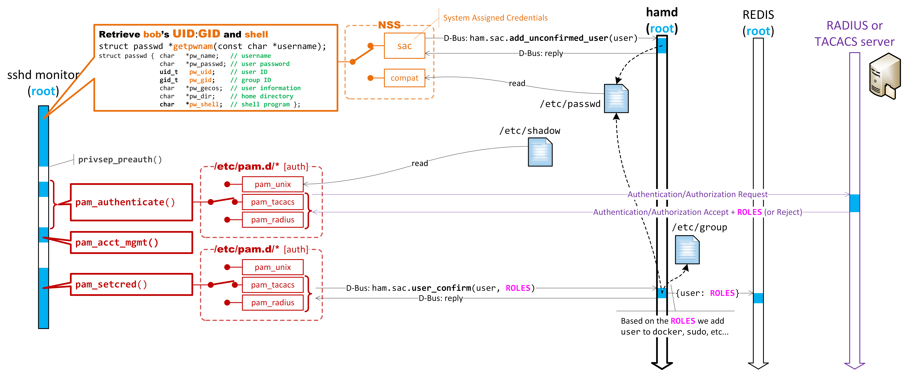

# AAA Improvements

**Rev. 0.4**

## Introduction

This document identifies a few gaps in the current implementation of Authentication, Authorization, and Accounting (AAA) in SONiC and proposes a way to remedy them. But before we get into the crux of the matter, we will first take the time to understand when and where AAA plays a role in SONiC by examining how a typical SSH login session behaves. Understanding how a login session works is crucial to understanding why the current AAA implementation requires some changes. 

### Revision history

| Revision | Date      | Author          | Change description                                           |
| -------- | --------- | --------------- | ------------------------------------------------------------ |
| 0.1      | 2/24/2020 | Martin Bélanger | Draft                                                        |
| 0.2      | 4/2/2020  | Martin Bélanger | Internal reviews                                             |
| 0.3      | 5/28/2020 | Martin Bélanger | External reviews                                             |
| 0.4      | 6/18/2020 | Martin Bélanger | Add mention that the Aruba ClearPass TACACS+ server does not allow Authorization requests w/o first being Authenticated. Add a note about Linux group naming restrictions. |

### Document conventions and limitations

This is a technical paper with some elements of a High-Level Design document. The goal is to spark a discussion with the SONiC community regarding AAA. The main focus is on the interactions between AAA and Linux. More precisely, how PAM and NSS work together to support Authentication, Authorization, and Accounting. Advanced AAA topics such as "*command accounting*" or "*how applications can enforce authorization*" are not discussed here.

In this document, the ***Management Framework*** project refers to the code located in the ***sonic-mgmt-framework*** repository.

Also, note that we have intentionality omitted implementation details from the pictures to reduce clutter and improve clarity. For example, the **dbus-daemon** process (a.k.a. the D-Bus Broker) was left out of all D-Bus transactions.

### Assumptions

The reader should have some knowledge of Linux, UNIX credentials such as the User ID (UID) and Group ID (GID), ssh, AAA, RADIUS, and TACACS+. Knowledge of PAM, NSS, and D-Bus can also help the reader with some of the more advanced concepts.

## The standard SSH session

The following picture depicts the standard SSH login session. It is a highly simplified representation of what takes place within the SSH Daemon (`sshd`). The reader should consult [the OpenSSH source code](https://github.com/openssh/openssh-portable) for details. Note that all applications that authenticate users, whether it's sshd, login, sudo, or su, follow a similar design.


In a regular ssh session, a remote user, in this example, **bob**, uses a program called `ssh` to contact the SSH daemon, or **sshd**, that runs on a remote Linux instance. The sshd process listens on TCP port 22 and forks a child process referred to as the **sshd monitor** when a remote user connects to that port. Security is vital to ssh, and one security principle that sshd follows to the letter is "[privilege separation](https://en.wikipedia.org/wiki/Privilege_separation)." That is to say that sshd never allows a remote user to interact directly with a process running with `root` privileges. To this end, sshd forks copies of itself. After a child process is forked, it drops its privileges before it interacts with the remote user. These children with limited privileges are labeled "**sshd priv**" in the picture. They are the only processes that accept inputs from remote users.

**STEP 1)** One of the very first things that the **sshd monitor** does is to check the user's credentials. That's the orange box at the top of the picture where sshd monitor invokes **`getpwnam()`**.  This POSIX API uses the underlying Name Service Switch ([**NSS**](https://en.wikipedia.org/wiki/Name_Service_Switch)) infrastructure to retrieve the User ID (`UID`), Primary Group ID (`GID`), and the `shell` associated with that user. A successful call to `getpwnam()` indicates that the user is *legit*. Interestingly enough, whether `getpwnam()` succeeds or fails, the sshd monitor always proceeds with authentication, identified by the red box containing **`pam_authenticate()`**. By running the authentication process, sshd misleads hackers in thinking that they have found a valid user name, which is an important security feature. Incidentally, the current RADIUS NSS/PAM modules use this to their advantage to work around a limitation with the RADIUS protocol. We will get back to this later.

**STEP 2)** Authentication is handled by **`pam_authenticate()`**, which uses PAM modules specified in configuration files located in `/etc/pam.d/` to invoke the desired authentication methods. These configuration files specify whether PAM should authenticate users with the Local (traditional UNIX) authentication module, **`pam_unix.so`**, or other PAM modules for **RADIUS**,  **TACACS+**, or even **LDAP** (future) authentication.

**STEP 3)** The sshd monitor invokes **`pam_acct_mgmt()`** after `pam_authenticate()` successfully authenticates the user. This API can implement account expiration and access hour restrictions. For example, one could inform a user that their password is about to expire and whether they want to change it immediately or later.

**STEP 4)** Next, the sshd monitor calls **`pam_setcred()`**. According to the *PAM Application Developers' Guide*, this API "*establishes, maintains, and/or deletes the credentials of a user*." The sshd monitor can thus set additional user credentials after successful authentication and before a session is opened with `pam_open_session()`. The Developers' Guide defines a credential as "*something that the user possesses, such as **supplementary group** membership*." The Guide clarifies that "*on a Linux system, the user's **UID** and **GID** are credentials too, but these properties are credentials that should be set directly by the application and not by PAM. Such credentials should be established, by the application, before a call to this function*", which is precisely what the sshd monitor does by invoking `getpwnam()` to retrieve the user's **UID** and **GID** before calling any PAM APIs.

**STEP 5)** The API **`pam_open_session()`** marks the beginning of the user session. This API and its counterpart, **`pam_close_session()`**, are typically used for accounting purposes. For example, they can be used to record the start, end, and duration of a session in a logging system such as the syslog.

**STEP 6)** After all PAM operations complete successfully, the sshd monitor forks itself one last time. The forked child drops its privileges to the user's UID and GID, and the supplementary groups are retrieved from `/etc/group` and applied to the child with the help of the POSIX API [**`initgroups()`**](http://man7.org/linux/man-pages/man3/initgroups.3.html). This API initializes the group access list by reading the group database `/etc/group` and using all groups of which the user is a member. Supplementary groups that the user was added to earlier by `pam_setcred()` are thus applied to the current process.

**STEP 7)** Finally, the child process forks one last time to execute the `shell` program associated with the user. The shell program runs with the same UID, Primary GID, and supplementary GIDs of the process that forked it.

## Current SONiC AAA implementation and limitations

- **Lack of support for Multiple Roles**. The current RADIUS/TACACS+ PAM/NSS modules save the user's role, received from the RADIUS/TACACS+ server to the Primary GID associated with that user, in `/etc/passwd`. The current design assumes that the RADIUS/TACACS+ server only assigns a single role to users. That is not the case, especially in the context of [Role-Based Access Control (RBAC)](https://en.wikipedia.org/wiki/Role-based_access_control). RBAC is a way to configure Authorization policies for users. With RBAC, we assign one or more roles to users (e.g., system admin, security admin, network admin, network operator, ...). Using the Primary GID does not work since a single GID cannot represent multiple roles. 

  Furthermore, retrieving the roles from a RADIUS server is only possible during authentication (`pam_authenticate`), which takes place after the sshd monitor invokes `getpwnam()` to retrieve the UID and Primary GID (role). Therefore, tying the role to the Primary GID when using RADIUS creates a chicken-and-egg situation.

- **RADIUS users need to log in twice for their role to take effect**. When we looked at the standard ssh login session earlier, we said we'd come back to discuss a workaround used by the NSS/PAM modules for RADIUS authentication (see **STEP 1** above).  The problem comes from the fact that we map the role, which is retrieved from the RADIUS server during authentication, to the Primary GID. And the sshd monitor needs to know the Primary GID, that is the role, before authenticating the user.  

  The workaround takes advantage of the fact that the sshd monitor performs authentication even when `getpwnam()` fails. During this authentication, the PAM RADIUS module can retrieve the role and create a local account for that user in `/etc/passwd` using the role received from the RADIUS server as the Primary GID. When the user logs in a second time, `getpwnam()` succeeds because there is now a valid local account for that user. 

  However, every time the role is changed at the RADIUS server, the change only takes effect after the second successful login. During the first login, `getpwnam()` retrieves the old role from the local account, which the current session uses, but the new role only gets updated to the local account after the sshd monitor invokes `pam_authenticate()`. Therefore, it's only at the second login that the new role takes effect when `getpwnam()` can finally retrieve it from the local account.

- **SONiC cannot distinguish between console and non-console sessions**. The current PAM configuration assumes that if the program used to authenticate the user is "**login**" (`/bin/login`), then the session must be associated with the "**console**." And if another program than "**login**" is used, for example, "**sshd**" (`/usr/sbin/sshd`), then it must be a **non-console** session. Although the "login" program often correlates with console sessions, *[correlation does not imply causation](https://en.wikipedia.org/wiki/Correlation_does_not_imply_causation)*. For example, the **telnet** daemon also uses the login program to authenticate users, and one would certainly not want to provide telnet users with the same advantages as "console users." Although we don't install telnet on SONiC by default, we should not assume that customers will never install it manually. If telnet uses the "login" program to authenticate users, and we believe that "login means the console," then we allow remote telnet users to operate like local console users.

  Furthermore, any user can invoke the login program at the shell. A remote user that logs in with ssh and then invokes login from the shell would then be granted access as a "console user," which is not what customers want.

- **Sudo and su can only authenticate locally, and not with remote protocols**. Currently, only the "**login**" and "**sshd**" applications can authenticate with **RADIUS** or **TACACS+**. That's because **SONiC** only configures **PAM** for the "login" and "sshd" applications in `/etc/pam.d/sshd` and `/etc/pam.d/login`. Therefore, users cannot be authenticated by RADIUS/TACACS+ when running programs such as "`sudo`" and "`su`," which use separate configuration files: `/etc/pam.d/sudo` and `/etc/pam.d/su`. 

  By the way, SONiC modifies the standard `/etc/sudoers` configuration to allow members of the `sudo` group to run `sudo` without providing their password. This is non-standard and a security risk. We should restore the standard `/etc/sudoers` configuration that requires users to enter their password when running `sudo`.  

- **Changes to `/etc/nsswitch.conf` may not take effect immediately**. For RADIUS/TACACS+ support, we add new NSS modules to `/etc/nsswitch.conf`. The RADIUS/TACACS+ NSS modules are added-to or removed-from `/etc/nsswitch.conf` at run-time when enabling or disabling RADIUS/TACACS+. Programs such as **sshd** and **login** need these NSS modules so that when they invoke `getpwnam()`, local Linux credentials (UID, GID) get automatically assigned to RADIUS/TACACS+ users.  

  According to the [nsswitch.conf man pages](http://man7.org/linux/man-pages/man5/nsswitch.conf.5.html#NOTES), "*within each process that uses `nsswitch.conf`, the entire file is read only once.  If the file is later changed, the process will continue using the old configuration.*" In other words, when a process such as sshd invokes `getpwnam()` for the first time, the underlying NSS library reads and caches the entire contents of `/etc/nsswitch.conf` so that subsequent calls to `getpwnam()`, or any other functions that use NSS, don't have to reread the file. 

  In light of that, we cannot change `/etc/nsswitch.conf` on a running system, unless we restart all the processes that have already cached the contents of `/etc/nsswitch.conf`. And since it's impossible to know which processes have already cached it, it is usually recommended to simply restart the system to ensure that the changes take effect for all running processes.

  The next chapter proposes another way to configure NSS modules without making changes to `/etc/nsswitch.conf`. And this allows us to configure NSS to support RADIUS/TACACS+ without having to restart any processes.

- **Mapping RADIUS/TACACS+ users to "remote_user" or "remote_user_su" has side effects**. Using `remote_user` or `remote_user_su` is another approach that SONiC uses for RADIUS/TACACS+ users. In this case, if the standard "**compat**" NSS module invoked by `getpwnam()` fails to find the user in the local database (`/etc/passwd`), a second NSS module is used to return a default local user account, **remote_user** or **remote_user_su**, which serves as a surrogate account. We use the user's role to select between the two local accounts (e.g., if the role is **sysadmin**, then we use the **remote_user_su** account).

  - **Side effect #1 - Everybody looks the same**.
    Linux cannot differentiate between users. They all look the same to Linux, i.e., "**remote_user**." And this is not good for several reasons.

    - **AAA users have no private resources (i.e., files).**
      If an AAA user creates a file (e.g., REST certificate), then this file is owned by **remote_user**. And that file can be accessed by anybody that shares the **remote_user** credentials.

    - **Hard to tell "who" the users are.**
      Standard Linux programs will not work correctly when multiple users are all mapped to the same **remote_user** account. For example, the "**who**" and "**w**" programs, which list the users currently logged into the system, will report all AAA users as **remote_user** instead of their real RADIUS/TACACS+ user names. 

    - **There is no way to track AAA user activity.**
  Applications lose the ability to track individual user activity when we map all AAA users to the same local **remote_user** account. For example, bash uses the file `~/.bash_history` to track every command typed by a user at a bash terminal. Similarly, clish uses the file `~/.clish_history` to track clish commands. Since all AAA users share the same **remote_user** credentials, they also share the same `/home` directory. Thus, `~/.bash_history` and `~/.clish_history` are really `/home/remote_user/.bash_history` and `/home/remote_user/.clish_history`.
    
      And it doesn't end with tracking shell activity. Standard Linux tools that collect metrics about users will not work correctly. For example, **[auditd](http://man7.org/linux/man-pages/man8/auditd.8.html)** is a popular tool that can collect just about anything about users, but it cannot function correctly unless all users have their own Linux credentials.
  
  - **Side effect #2 - Users assigned to remote_user_su cannot run sudo.**
    The sudo program requires users to authenticate themselves before it runs a command. Unfortunately, when we map a RADIUS/TACACS+ user to **remote_user_su**, that user ceases to be the user defined by the RADIUS/TACACS+ server, and it takes on the identity of **remote_user_su**. And since **remote_user_su** does not have login privileges and thus the ability to authenticate, users mapped to **remote_user_su** cannot run commands with sudo.
  
- **Authentication for containers is not supported.** Applications running in containers have no visibility of the PAM/NSS configuration that resides on the host. They are entirely unaware of any RADIUS/TACACS+ configuration. The way we make this work today is by establishing an ssh connection from the container to the host. If the connection is successful, then we conclude that the authentication was successful. Using ssh may work for applications that we design ourselves (e.g., REST server), but that won't work with standard Linux applications. For example, when running a bash shell inside a container, one would not be able to be authenticated by sudo or su.

- **Some TACACS+ servers may not allow requesting Authorization before Authentication.** This is the case for Aruba ClearPass TACACS+ server. In this case, when we invoke getpwnam() and the underlying tacacs NSS module performs an Authorization request with the ClearPass TACACS+ server, the server will simply deny the request. This prevents users from logging in using an Aruba ClearPass TACACS+ server.

- **Using Linux groups for the roles forces restrictions on the role names.** Linux imposes [restrictions on group names. If we save the roles to Linux groups, these restrictions will need to be applied to role names. RBAC allows customers to define their own roles. This means that the naming restrictions that apply to Linux group names must be applied to roles and customers must be made aware of these restrictions. Here are the two major restrictions that will need to apply to role names.

  - Group names must start with a lower case letter or an underscore, followed by lower case letters, digits, underscores, or dashes. They can end with a dollar sign. In regular expression terms: `[a-z_][a-z0-9_-]*[$]?`
  - Group names may only be up to 16 characters long.

## Proposal for hardening and securing SONiC AAA

This proposal applies to all login methods: Local, RADIUS, and TACACS+  (or even LDAP in the future). It relies on a new NSS module to automatically create user accounts and assign Linux credentials (UID, GID) to users that are missing from `/etc/passwd`. We refer to this as *System-Assigned Credentials* or **sac** for short. 

With **sac**, the Primary GID is no longer used as the **role** and is simply assigned by **sac** as a private GID for that user (refer to the `--user-group` option of the [useradd](http://man7.org/linux/man-pages/man8/useradd.8.html) command). As mentioned before, using the primary GID simply does not work when multiple roles are needed. Instead, the roles are saved to the **REDIS** database when the `pam_setcred()` API is invoked, which is in line with this API's primary purpose (i.e., to set additional credentials). 

One could also wish to add the roles to the supplementary groups, but since Linux does not need to know about roles, there is no point in doing so. That being said, we should add users with elevated roles, e.g., `sysadmin`, to the **sudo** group so that they can invoke commands from the Linux shell using `sudo`. Assigning Linux groups (e.g., sudo) to users based on their roles is configurable. We will get back to this later. In addition to the role, other attributes such as the user's **privilege level** (à la Cisco) are also retrieved from the RADIUS/TACACS+ server and stored in the **REDIS** database.

A new daemon, the Host Account Management Daemon, or **hamd** for short, is needed to support **sac** and other user account operations. Hamd already exists in the ***sonic-mgmt-framework*** repository. We suggest moving hamd to a different repo, maybe **sonic-buildimage**, to be part of the standard SONiC image. The next paragraphs examine hamd in detail and explain why it is a good idea to have a standalone daemon to manage user accounts. 

The following picture shows the interactions between the different components.


Now let's have a closer look at each component.

## The sac NSS module

This picture shows where the **sac** NSS module comes into play. It is invoked by `getpwnam()` to retrieve the user's Linux credentials.


In `/etc/nsswitch.conf`, under the "`passwd:`" map, we add **sac** to the end of the list of already configured NSS modules (refer to the [nsswitch.conf(5)](http://man7.org/linux/man-pages/man5/nsswitch.conf.5.html) man pages for details). The example below shows "**sac**" added after "**compat**.". The compat module is the traditional UNIX NSS module that looks up users in the local `/etc/passwd` database.  

```bash
# /etc/nsswitch.conf
passwd:  compat sac
group:   compat
...
```

We permanently add **sac** to `/etc/nsswitch.conf`, eliminating the need to modify it based on    RADIUS/TACACS+ configuration. And because `/etc/nsswitch.conf` never changes, we need not worry about restarting programs (e.g., sshd) that may have cached its content. Instead, when RADIUS/TACACS+ is enabled, we enable the **sac** module by creating the file `/etc/sonic/hamd/libnss_sac.enable`. And we simply delete this file to disable the **sac** module. The existence of the file enables the **sac** module. When disabled, the **sac** module  ignores all NSS requests it receives.

With `/etc/nsswitch.conf` configured as shown above, and with the **sac** module enabled, if the standard **compat** NSS module fails to find credentials for a given user in `/etc/passwd`, then the **sac** module asks hamd to create a new "unconfirmed" user account. This is done by invoking hamd's D-Bus method: **`ham.sac.add_unconfirmed_user(username)`**. When hamd creates the account, it does not give it any local login abilities (i.e., it is a locally locked account). The purpose of this account is simply to reserve a unique UID and GID in `/etc/passwd`. 

The hamd process marks the user as unconfirmed by setting the [GECOS](https://en.wikipedia.org/wiki/Gecos_field) field to "***Unconfirmed SAC user [PID]***," where PID is the Process ID of the process (e.g., sshd monitor) that invokes **`ham.sac.add_unconfirmed_user(username)`**. We use this to identify accounts that are not yet "authenticated" or "confirmed." This string in the GECOS field allows us to audit and remove any accounts that were not successfully authenticated by the AAA protocol. By doing so, we prevent attackers from creating multiple unconfirmed accounts. 

After PAM successfully authenticates a user, the login application (e.g., sshd, login) invokes **`pam_setcred()`** where we call hamd's D-Bus method: **`ham.sac.user_confirm(username, attrs)`**, as shown here. 



The **`ham.sac.user_confirm()`** API triggers the following operations by hamd:

1. Replace the GECOS field by the string "***SAC user***," which "confirms" the account and persists it to  `/etc/passwd`. 
2. Write the user attributes (roles, privilege-level) to the **REDIS** database.
3. Add user to supplementary Linux groups (e.g., sudo, docker, redis), if any, based on the user attributes (i.e., roles, privilege level). We'll get back to this later.
4. Generate additional credentials (e.g., REST certificates, SSH keys, etc.), if any, that the user requires. This will be discussed later.

The hamd process can audit the file `/etc/passwd` to detect users that have failed authentication by looking for unconfirmed users that have gone out of scope. An out of scope unconfirmed user is one identified by the GECOS string "***Unconfirmed SAC user [PID]***" and for which the PID no longer exists. Such user accounts are simply deleted by hamd when detected.

## Host Account Management Daemon (hamd)

Hamd is the "[single source of truth](https://en.wikipedia.org/wiki/Single_source_of_truth)" for SONiC user accounts. Hamd does only one thing – *manage user accounts*. As such, hamd follows the [UNIX philosophy](https://en.wikipedia.org/wiki/Unix_philosophy), which stipulates "*programs should do one thing and do it well*." The UNIX philosophy provides several benefits, such as modularity and reusability, to name a few.  

### Advantages of a central account management daemon

Hamd provides a D-Bus interface used by programs (NSS, PAM, click, clish, etc.) to create, modify, delete user accounts on the Host. The D-Bus interface is required to ensure synchronous operations, which is to say that hamd replies immediately to requests.

The advantages of having a central process to handle user accounts on the Host include:

1. **Consistent user account operations for all applications**. Leaving it to applications to call [**useradd**](http://man7.org/linux/man-pages/man8/useradd.8.html) directly is not the right approach because various developers working on different applications may invoke `useradd` with inconsistent options and may not be aware of additional user account requirements. For example, users may need additional credentials such as certificates (TLS, REST, gRPC) or keys (SSH). Trusting that every developer will always create user accounts in a consistent way is simply not realistic.
2. **Synchronous user account operations**. Because hamd provides a synchronous D-Bus interface, it sends a confirmation after creating, modifying, or deleting user accounts. Synchronous account creation is required for system-assigned credentials (**sac**) because login sessions (sshd monitor) need to know that the account exists (in `/etc/passwd`) before proceeding with the login process. In this particular case, using **REDIS** as a middleman to configure Linux does not work. The sshd monitor requires immediate user credentials to proceed. It cannot wait for another process (e.g., **hostcfgd**) to react to REDIS DB changes to create the account at a later time.
3. **Background account audits**. There are cases when we need to delete user accounts that are no longer valid. For example, hamd automatically detects and eliminates unconfirmed **sac** accounts that have gone out of scope (due to failed authentication) during background audits. 
4. **Automatic removal of old sac accounts**. One could configure hamd to automatically remove confirmed **sac** accounts that have been left unused for a configurable amount of time (e.g., 1 month, 6 months, 1 year, etc.). Note, however, that this is often considered a bad idea. This is due to one relevant property of the user concept (you might even call this a design flaw) – user IDs are sticky to files (and other objects such as IPC objects). 

   Imagine a user creating a file at some location. Later the user is terminated, and its user name and ID removed from `/etc/passwd`. The created file still belongs to the numeric UID the user initially got assigned. When adding a new user and – due to ID recycling – it happens to get assigned the same numeric UID, then it also gains access to the file. 

   That's generally considered a problem from both privacy and security point of view. Hence applications tend to avoid UID recycling, which means user accounts remain registered forever (or until the next clean Linux install) on a system after allocating them once.  This describes the current status quo ante, and no one has proposed a better way to preserve user privacy than keeping accounts forever in `/etc/passwd`. It's not like we can run out of IDs. After all, it's a 32-bit number.
5. **Allow user account operations from containers**. The Management Framework project currently uses hamd to allow code running in containers to create user accounts on the host. For example, hamd allows the REST server, which runs in a container, to create user accounts on the host.

### Hamd for containers

When applications running in containers, such as a REST or gRPC server, need to create user accounts on the host, they can invoke hamd methods to do so. For this use case, hamd provides a set of APIs separate from the **sac** APIs we saw earlier. The **sac** APIs create "unconfirmed" user accounts that later get confirmed during authentication. In the case of REST or gRPC, however, the server has already authenticated the user that wants to create new host accounts. And it has made sure that the user has the authority to create the new accounts. Therefore, there is no need to create "unconfirmed" accounts as we did for **sac**.

For the Management Framework project, the REST server runs in the ***mgmt-framework*** container, and it uses hamd's method `ham.accounts.useradd()` to create user accounts on the host, as shown here. 


This picture further shows how programs running in containers can also use hamd to fetch user account information from the host. Installed in the container's `/etc/nsswitch.conf`, an NSS module named `ham`, allows container programs to invoke standard POSIX APIs such as `getpwnam()` or `getgrnam()` and retrieve user account information from the host using hamd's "name_service" APIs (e.g., `ham.name_service.getpwnam()`.) This is important because many standard Linux tools, for instance, `ls`, `id`, or `who`, use functions such as `getpwnam()`, and for these tools to work correctly inside containers, we need the proper NSS support.

Note that we configure NSS in the container to use the `compat` NSS module first, which looks in the container's `/etc/passwd`. It's only when a user cannot be found locally (in the container) by the `compat` module that NSS  invokes the `ham` module to check on the host.

### Mapping roles to Linux groups

With the help of the configuration file `/etc/sonic/hamd/group-mapping`, hamd allows mapping role(s) or privilege-level(s) to Linux groups. This is particularly important for users that require access to the **sudo** command. This file contains a list of pairs, `role:groups` or `priv-lvl:groups`, telling hamd how to map particular roles or privilege-levels to Linux groups.

The sudo command allows running programs with the privileges of another user (by default, root). By default, one needs to enter the root password to execute a command with sudo. However, with the help of `/etc/sudoers`, one can configure sudo to allow specific users or members of specific groups to enter their own password instead of the root password. On Debian, by default, members of the `sudo` group can use their own password instead of the root password when executing commands with sudo.

### Generating additional user credentials

Earlier, we said that hamd could generate additional credentials for users such as certificates (REST, gRPC, TLS) or keys (SSH). This is configurable through scripts located in `/etc/sonic/hamd/scritps/post-create/`. After hamd adds a user to `/etc/passwd` with the `useradd` command, hamd invokes, in [ASCIIbetical](https://en.wiktionary.org/wiki/ASCIIbetical) order, all the scripts found in this directory. We supply the scripts with the following arguments: 

1. User name,
5. Roles,
6. Privilege-level.

Scripts should return 0 on success, and non-0 on failure. On failure, the scripts should print the cause of the failure to the standard error (`stderr`).

Similarly, to allow additional actions to be carried out by hamd when deleting users, we invoke scripts located in `/etc/sonic/hamd/scritps/pre-delete/` before the `userdel` command is invoked. The `pre-delete` scripts are supplied with the same arguments as the `post-create` scripts and should return the same values on success or failure. 

Note that when deleting users with `userdel`, the whole home directory gets deleted as well (see [userdel](http://man7.org/linux/man-pages/man8/userdel.8.html) `--remove` option). Therefore, any additional credential added to the user's home directory is deleted automatically, eliminating the need for a `pre-delete` script. Pre-delete scripts are only required when resources outside of the user's home directory need to be deleted or modified.

Following the UNIX philosophy of "doing one thing," we should provide several small scripts capable of creating/deleting one credential rather than a single large script that creates/deletes multiple credentials. 

### D-Bus and security

**D-Bus** is a well-known interface and is [well documented on the Internet](https://en.wikipedia.org/wiki/D-Bus). Therefore, we are only going to highlight some of the D-Bus features and provide links to relevant information. Readers unfamiliar with D-Bus should spend some time learning about this essential component of Linux systems.

D-Bus, which stands for Desktop Bus, is an interprocess communication ([IPC](https://en.wikipedia.org/wiki/Inter-process_communication)) mechanism that allows programs to talk to each other. Although it is called the "Desktop Bus," D-Bus is not aimed explicitly at Desktop environments. It may have started as a way for desktop applications to talk to each other, but it eventually became a generic IPC for Linux systems. Many non-desktop applications use D-Bus. For example, `systemd` uses D-Bus for all of its inter-process communication. 

#### Highlights

- Started in 2003 and officially released in 2006 under the [freedesktop.org](https://en.wikipedia.org/wiki/Freedesktop.org) project
- The **`dbus-daemon`** is the central message broker that applications (servers, clients) connect to 
- D-Bus provides Secure, Intra-system communication over UNIX domain sockets. The three main elements are:
  - **Methods** – servers provide methods that clients can invoke (à la [RPC](https://en.wikipedia.org/wiki/Remote_procedure_call))
  - **Signals** – servers can broadcast signals (i.e., events) to subscribers
  - **Properties** – attributes available through set/get methods
- The D-Bus Interface Description Language ([IDL](https://en.wikipedia.org/wiki/Interface_description_language)), in XML form, defines the methods, signals, and properties available on a bus.
- A reserved method, the **`introspect()`** method, returns the XML IDL of a particular bus. This method makes it possible to discover which methods, signals, and properties a D-Bus instance has to offer.
- [Many projects](https://www.freedesktop.org/wiki/Software/DbusProjects/) use D-Bus: **`systemd`**, [Avahi](http://avahi.org/), [CUPS](http://www.cups.org/), Nautilus (now [Files](https://wiki.gnome.org/Apps/Files)), [Skype](http://www.skype.com/en/), udev, …
- [Many language bindings](http://www.freedesktop.org/wiki/Software/DBusBindings/) are available: C/C++, Go, Python (and twisted), Java, PHP, .NET, Ruby, …
- Many debug tools are available: [dbus-monitor](https://dbus.freedesktop.org/doc/dbus-monitor.1.html), [qdbus](https://www.commandlinux.com/man-page/man1/qdbus.1.html), [busctl](https://www.freedesktop.org/software/systemd/man/busctl.html), and much more.

#### Security

The [**`dbus-daemon`**](https://dbus.freedesktop.org/doc/dbus-daemon.1.html) broker enforces security on the bus, and just like many other components in UNIX-like systems, security is based on users (UID) and groups (GID). That is, the `dbus-daemon` looks at a program's UID and GIDs (primary + supplementary), compares those to a set of configurable security rules, and  determines whether that program has the right privileges to access a D-Bus method, signal, or property.

The dbus-daemon relies on configuration files located under `/etc/dbus-1` to establish resource limits, security parameters, and so on. Methods, signals, and properties are not available to users or groups unless explicitly enabled through these configuration files. The [dbus-daemon manual pages](https://dbus.freedesktop.org/doc/dbus-daemon.1.html) describe the configuration file syntax. 

Using groups (GIDs) instead of users (UIDs) to enforce D-Bus security helps to ensure modularity. Hamd should not have an awareness of every user (UIDs) that may use its D-Bus interfaces. That's too cumbersome to configure, and it tightly couples clients to hamd by having specific client user information in hamd's D-Bus configuration file. 

Instead, we can define a `hamd` group and add client processes to that group through the supplementary groups. Then, in the hamd D-Bus configuration, we add rules that allow members of the `hamd` group to access the hamd D-Bus resources. We can also define more than one group if we need additional control. For example, we could define the group `hamd_accounts` to allow only members of that group to access the methods used to create, modify, and delete user accounts. 

#### dbus-daemon configuration example

Here is hamd's D-Bus configuration, in XML format, used in the Management Framework project.

```xml
<!DOCTYPE busconfig PUBLIC
 "-//freedesktop//DTD D-BUS Bus Configuration 1.0//EN"
 "http://www.freedesktop.org/standards/dbus/1.0/busconfig.dtd">
<busconfig>

  <!-- Only allow root to own the HAM bus. -->
  <policy user="root">
    <allow own_prefix="org.SONiC.HostAccountManagement"/>
  </policy>
  
  <!-- Allow everybody ("default") to invoke methods from
       the ham.name_service interface except for "ham.name_service.getspnam" 
       which should only be invoked by members of the hamd group -->
  <policy context="default">
    <allow receive_sender="org.SONiC.HostAccountManagement"
           receive_interface="ham.name_service"/>
    <allow send_destination="org.SONiC.HostAccountManagement"
           send_interface="ham.name_service"/>  
    <deny send_destination="org.SONiC.HostAccountManagement"
          send_interface="ham.name_service" send_member="getspnam"/>
  </policy> 
    
  <!-- Only allow members of the group "hamd_accounts" to invoke 
       methods from the ham.accounts interface -->  
  <policy group="hamd_accounts">
    <allow receive_sender="org.SONiC.HostAccountManagement"
           receive_interface="ham.accounts"/>      
    <allow send_destination="org.SONiC.HostAccountManagement"
           send_interface="ham.accounts"/>
  </policy>   
    
  <!-- Allow members of the group "hamd" to invoke everything on the bus. -->
  <policy group="hamd">    
    <allow receive_sender="org.SONiC.HostAccountManagement"/>      
    <allow send_destination="org.SONiC.HostAccountManagement"/>
  </policy>   
    
  <!-- Allow root to invoke everything on the bus. -->
  <policy user="root">    
    <allow receive_sender="org.SONiC.HostAccountManagement"/>      
    <allow send_destination="org.SONiC.HostAccountManagement"/>
  </policy>     

</busconfig>
```

### The hamd D-Bus Interface

The following comes from the Management Framework project. It represents hamd's D-Bus Interface in XML format.

``` XML
<!DOCTYPE node PUBLIC 
"-//freedesktop//DTD D-BUS Object Introspection 1.0//EN"
"http://www.freedesktop.org/standards/dbus/1.0/introspect.dtd">
<node name="/org/SONiC/HostAccountManagement">
  <interface name="org.freedesktop.DBus.Introspectable">
    <method name="Introspect">
      <arg direction="out" type="s" />
    </method>
  </interface>

  <!--
  HAM Accounts Interface
  This can be invoked by applications running 
  on the host (e.g. hamctl, click) or in containers (e.g. translib)
  to create/modify/delete user accounts on the host.
  -->
  <interface name="ham.accounts">
      <method name="useradd">
          <arg direction="in"  type="s"  name="login"/>                 <!-- User's login Name -->
          <arg direction="in"  type="as" name="roles"/>                 <!-- For RBAC users -->
          <arg direction="in"  type="s"  name="hashed_pw"/>             <!-- This must follow the password syntax used for /etc/shadow -->
          <arg direction="out" type="(bs)" name="(success, errmsg)" />
      </method>
      <method name="userdel">
          <arg direction="in"  type="s"  name="login"/>                 <!-- User's login Name -->
          <arg direction="out" type="(bs)" name="(success, errmsg)" />
      </method>
      <method name="passwd">
          <arg direction="in"  type="s"  name="login"/>                 <!-- User's login Name -->
          <arg direction="in"  type="s"  name="hashed_pw"/>             <!-- This must follow the password syntax used for /etc/shadow -->
          <arg direction="out" type="(bs)" name="(success, errmsg)" />
      </method>
      <method name="set_roles">
          <arg direction="in"  type="s"  name="login"/>
          <arg direction="in"  type="as" name="roles"/>                 <!-- For RABC users -->
          <arg direction="out" type="(bs)" name="(success, errmsg)" />
      </method>

      <method name="groupadd">
          <arg direction="in"  type="s" name="group"/>                  <!-- Group Name -->
          <arg direction="out" type="(bs)" name="(success, errmsg)" />
      </method>
      <method name="groupdel">
          <arg direction="in"  type="s" name="group"/>                  <!-- Group Name -->
          <arg direction="out" type="(bs)" name="(success, errmsg)" />
      </method>
  </interface>

  <!--
  HAM Name Service Interface (for NSS support) 
  Invoked from containers by libnss_ham module
  -->
  <interface name="ham.name_service">
      <method name="getpwnam">
          <arg direction="in"  type="s" name="name"/>
          <arg direction="out" type="(bssuusss)" name="success,pw_name,pw_passwd,pw_uid,pw_gid,pw_gecos,pw_dir,pw_shell" />
      </method>
      <method name="getpwuid">
          <arg direction="in"  type="u" name="uid"/>
          <arg direction="out" type="(bssuusss)" name="success,pw_name,pw_passwd,pw_uid,pw_gid,pw_gecos,pw_dir,pw_shell" />
      </method>
      <method name="getpwcontents">                                         <!-- Get the whole /etc/passwd  -->
          <arg direction="out" type="s" name="file_contents" />
      </method>
      <method name="getgrnam">
          <arg direction="in"  type="s" name="name"/>
          <arg direction="out" type="(bssuas)" name="success,gr_name,gr_passwd,gr_gid,gr_mem" />
      </method>
      <method name="getgrgid">
          <arg direction="in"  type="u" name="gid"/>
          <arg direction="out" type="(bssuas)" name="success,gr_name,gr_passwd,gr_gid,gr_mem" />
      </method>
      <method name="getgrcontents">                                         <!-- Get the whole /etc/group  -->
          <arg direction="out" type="s" name="file_contents" />
      </method>
      <method name="getspnam">
          <arg direction="in"  type="s" name="name"/>
          <arg direction="out" type="(bssiiiiiiu)" name="success,sp_namp,sp_pwd,sp_lstchg,sp_min,sp_max,sp_warn,sp_inact,sp_expire,sp_flag" />
      </method>
  </interface>

  <!--
  HAM Sytem-Assigned Credentials (SAC) Interface
  To be used by the libnss_sac module.
  -->
  <interface name="ham.sac">
      <method name="add_unconfirmed_user">
          <arg direction="in"  type="s" name="login"/>                  <!-- User's login Name -->
          <arg direction="in"  type="u" name="pid"/>
          <arg direction="out" type="s" name="errmsg" />                <!-- empty errmsg means success -->
      </method>
      <method name="user_confirm">
          <arg direction="in"  type="s"  name="login"/>                 <!-- User's login Name -->
          <arg direction="in"  type="as" name="roles"/>                 <!-- For RBAC users -->
          <arg direction="out" type="s"  name="errmsg" />               <!-- empty errmsg means success -->
      </method>
  </interface>

  <!--
  The debug interface is meant to 
  be invoked by the hamctl utility
  -->
  <interface name="ham.debug">
      <method name="troff">
          <arg direction="out" type="s" />
      </method>
      <method name="tron">
          <arg direction="out" type="s" />
      </method>
      <method name="show">
          <arg direction="out" type="s" />
      </method>
  </interface>
</node>
```

### The hamctl utility

A common Linux design pattern is to provide a companion utility program to daemons. For example, `systemd` has `systemctl`. Likewise, `hamd` has `hamctl`.

Users invoke `hamctl` from the Linux shell. `hamctl` is intended to be used by people and not by other programs. Programs should use the D-Bus interface directly when talking to hamd instead of executing `hamctl`.  

`hamctl` is self-documented. Simply use the `--help` option to get help. Some of the use cases for `hamctl` include:

- Creating/Deleting user accounts
- Changing a user's password or role
- Print hamd's current status (debug tool)

## Authenticating from containers

Local authentication inside containers is easy. Containers already come equipped with the standard Linux PAM module (`pam_unix.so`), and because of the `ham` NSS module, containers also have access to the user account information on the host. In other words, local authentication is seamless inside containers, and applications such as `sudo` or `su` running inside containers can authenticate local users.

It's another story when one wants to authenticate RADIUS/TACACS+ users from containers. The configuration about the RADIUS/TACACS+ servers resides on the host, just like the PAM modules and the PAM configuration files located in the host's `/etc/pam.d` directory. The **sac** NSS module, which automatically allocates Linux credentials to RADIUS/TACACS+ users, is also only available to applications running on the host. So what can we do inside containers?

We need a separate authentication service for containers, which we call the ***container authenticator daemon*** or **`cad`**. The service runs on the host but is invoked by applications running in containers. Containers configure PAM (`/etc/pam.d`) with a new PAM module, `pam_cad.so`. This PAM module contacts **`cad`** running on the host over D-Bus. All authentication from containers is entrusted to **`cad`** on the host. 

How is authentication from containers currently done today? For example, how does the REST server, which runs in the *mgmt-framework* container, authenticate RADIUS/TACACS+ users? We simply use ssh to trick the system into performing authentication on the host. In other words, the REST server uses ssh to log into the host using the user name and password supplied to the REST server. And, as we saw earlier, this causes sshd on the host to automatically assign Linux credentials to RADIUS/TACACS+ users with the help of the **sac** NSS module and hamd. If the ssh session succeeds, then the REST server considers the user to be legal. Using ssh, however, puts a significant overhead on the REST server. It would be better to go through the standard PAM APIs to authenticated users rather than using ssh.

## Pluggable Authentication Modules

Pluggable Authentication Modules (PAM) are used not just for authentication, but also for account, session, and password management. And you'd be wrong to assume that "account management" has anything to do with AAA "Accounting." AAA and PAM are quite different. So how does one reconcile AAA with PAM?

First, `pam_authenticate()` handles AAA Authentication. Whether it's UNIX, RADIUS, or TACACS+, Authentication is handled by a PAM module that is selected by the type "`auth`" in PAM configuration files located in `/etc/pam.d/`.

Second, since there is no PAM Authorization module per se, the retrieval of Authorization attributes from RADIUS/TACACS+ servers is also performed by `pam_authenticate()` and applied to user accounts with `pam_setcred()`. That's the only possible option for RADIUS since this protocol does not separate Authentication and Authorization. TACACS+, on the other hand, defines two different messages for Authentication and Authorization, but PAM can exchange both messages with the server while performing the `pam_authenticate()` operation. This approach allows us to manage RADIUS and TACACS+ identically.

Finally, Accounting can be handled through PAM session management, identified by the type "`session`" in PAM configuration files. The APIs `pam_open_session()` and `pam_close_seesions()` are used for Accounting. To be precise, we are talking about shell accounting (also known as EXEC shell). In other words, recording when a shell session starts and ends. "Shell accounting" is different from "Commands accounting." Commands accounting records every command entered by a user, and this is simply outside PAM's scope.

There is a one-to-one association between the PAM operations (APIs) and the different configuration types. The following table shows this association.

| Configuration type | Operation                                           |
| ------------------ | --------------------------------------------------- |
| **`auth`**         | **`pam_authenticate()`**, **`pam_setcred()`**       |
| **`account`**      | **`pam_acct_mgmt()`**                               |
| **`session`**      | **`pam_open_session()`**, **`pam_close_session()`** |
| **`password`**     | **`pam_chauthtok()`**                               |

The operations that play a role in AAA are: **`pam_authenticate()`**, **`pam_setcred()`**, **`pam_open_session()`**, and **`pam_close_session()`**.

### PAM authentication

Authentication is performed by the **`pam_authenticate()`** function. The configuration files used when invoking `pam_authenticate()` depend on the program invoking it. For example, if the program invoking `pam_authenticate()` is **sshd**, then PAM uses the configuration file `/etc/pam.d/sshd`. For the **login** program, PAM uses `/etc/pam.d/login`, and so on.

PAM configuration files contain "stacks" of PAM modules that `pam_authenticate()` invokes in the order they appear in the stack until authentication succeeds or fails. To understand the concept of stacking, please refer to [this document](https://docs.oracle.com/cd/E19253-01/816-4557/pam-15/index.html).

As an example, the following stack could be used to tell `pam_authenticate()` to first try TACACS+ authentication (`pam_tacplus.so`), and if the TACACS+ server cannot be reached (i.e. `authinfo_unavail`) , then proceed with Local (`pam_unix.so`) authentication. Please refer to [this document](https://docs.oracle.com/cd/E19253-01/816-4557/6maosrjr9/index.html) for a detailed explanation of how this works. 

```bash
auth  [success=2 authinfo_unavail=ignore default=1] pam_tacplus.so
auth  [success=1 default=ignore]                    pam_unix.so nullok_secure
auth  requisite                                     pam_deny.so
auth  required                                      pam_permit.so
```

In a sense, PAM acts an "intelligent switch" selecting one authentication method at a time, starting at the top of the stack, and moving to the next until authentication succeeds or fails, as shown in this picture.


### Console vs. non-console logins

What is the "console"? Wikipedia [defines the console](https://en.wikipedia.org/wiki/Linux_console) as *the device which receives all kernel messages and warnings and which allows logins in single-user mode*. The Linux boot line, which one can print with "`cat /proc/cmdline`," defines the console interface(s). There can be more than one console interface configured. Use "`cat /proc/consoles`" to print the list of consoles available on your Linux system.

Typically, the console is mapped to a serial port (e.g., `/dev/ttyS0`). Users require physical access to the equipment to use its serial port interface(s). In other words, remote users can't access serial ports and, therefore, the console. Only users located on the same premises as the equipment can access the console. These are usually secured facilities that only allow people with the right security clearance (e.g., a badge) to gain access to the premises. 

It is often desirable to have different login configurations for local connections (i.e., **console**) as opposed to remote connections (e.g., **ssh**), which may be accessed by any users, including hackers. Having a different configuration for the console is, in fact, a mandatory requirement of Federal Government customers. One may configure the console connection to allow additional AAA methods that remote connections should not have access to. In that regard, the console often provides the ability to log a "*user of last resort*" to be used when all other attempts to log in have failed.

### How can PAM determine whether it is dealing with the console?

When invoking PAM, several environment variables are defined. One of them is `PAM_TTY`, which identifies the login terminal. So by testing the value of `PAM_TTY`, PAM can determine whether it is dealing with a `console` login or not. Below is a Python one-liner command that does just that. This script returns an error code of `0` on success (`console`) or non-`0` on failure (non-`console`). PAM can invoke this command by using the module `pam_exec` (already part of the Linux root file system along with many other PAM modules).

```python
/usr/bin/python3 -c "import sys, os;sys.exit(0 if os.environ.get('PAM_TTY','').startswith('/dev/tty') else 1)"
```

Now let's see how we can use this to configure PAM to support different authentication for `console` and non-`console` logins. Let's say that we want to configure the system to only use Local (standard UNIX) authentication for `console` logins. And let's say that we want to authenticate non-`console` logins with RADIUS first, and by Local if the RADIUS server is unreachable. The following is one way to configure this:

```bash
# Check whether we have a console connection.
auth  [success=5 default=ignore] pam_exec.so  /usr/bin/python3 -c "import sys, os;sys.exit(0 if os.environ.get('PAM_TTY','').startswith('/dev/tty') else 1)"
 
# Non-console logins             
auth  [success=2 authinfo_unavail=ignore default=1] pam_radius.so
auth  [success=1 default=ignore]                    pam_unix.so try_first_pass nullok
auth  requisite                                     pam_deny.so
auth  required                                      pam_permit.so
auth  [default=3]     pam_exec.so quiet /bin/true # Jump over console logins
 
# Console logins
auth  [success=1 default=ignore]                    pam_unix.so  nullok
auth  requisite                                     pam_deny.so
auth  required                                      pam_permit.so
```

In effect, this is equivalent to this:


### PAM Config Framework

Linux systems try to maintain PAM consistency between applications. Whether the application is login, sshd, sudo, su, etc. one would expect to be authenticated the same way. For that reason, **common** files define PAM configuration used by all applications. These files are located under `/etc/pam.d/`. And the application-specific files (e.g. `/etc/pam.d/sshd`) simply include these common files.

When you look in `/etc/pam.d/`, you find several files named `common-*`. The next table lists these files and which applications use them (by including them).

| File (in `/etc/pam.d/`)       | What is it for?                                              | Included by                                                  |
| ----------------------------- | ------------------------------------------------------------ | ------------------------------------------------------------ |
| common-auth                   | Authentication                                               | `/etc/pam.d/chfn`<br/> `/etc/pam.d/chsh`<br/> `/etc/pam.d/cron`<br/> `/etc/pam.d/login`<br/> `/etc/pam.d/other`<br/> `/etc/pam.d/sshd`<br/> `/etc/pam.d/su`<br/> `/etc/pam.d/sudo` |
| common-account                | Account management                                           | `/etc/pam.d/chfn`<br/> `/etc/pam.d/chsh`<br/> `/etc/pam.d/cron`<br/> `/etc/pam.d/login`<br/> `/etc/pam.d/other`<br/> `/etc/pam.d/sshd`<br/> `/etc/pam.d/su`<br/> `/etc/pam.d/sudo`<br/> `/etc/pam.d/systemd-user` |
| common-session                | Session management                                           | `/etc/pam.d/chfn`<br/> `/etc/pam.d/chsh`<br/> `/etc/pam.d/login`<br/> `/etc/pam.d/other`<br/> `/etc/pam.d/sshd`<br/> `/etc/pam.d/su` |
| common-session-noninteractive | Same as common-session,<br/> but invoked by non-interactive programs | `/etc/pam.d/cron`<br/> `/etc/pam.d/sudo`<br/> `/etc/pam.d/systemd-user` |
| common-password               | Password management.<br/> e.g. **passwd** command            | `/etc/pam.d/chpasswd`<br/> `/etc/pam.d/login`<br/> `/etc/pam.d/newusers`<br/> `/etc/pam.d/other`<br/> `/etc/pam.d/passwd`<br/> `/etc/pam.d/sshd` |

The problem with these common files is that they are auto-generated by the Perl script **`pam-auth-update`** as indicated by this comment from `/etc/pam.d/common-auth`.

```
# As of pam 1.0.1-6, this file is managed by pam-auth-update by default.
# To take advantage of this, it is recommended that you configure any
# local modules either before or after the default block, and use
# pam-auth-update to manage selection of other modules.  See
# pam-auth-update(8) for details.
```

And because of that, we can't make manual changes to these common files. Any manual change made to the common files will most likely be lost simply by installing or updating Debian packages (`apt-get install`). That's because packages such as `openssh-server.deb` may invoke `pam-auth-update` to update the common PAM configuration files, and that results in overwriting manual changes.

Another thing that we can't do with `pam-auth-update` is to generate complex stacks like the one described earlier where we used `pam_exec.so` to invoke a Python script to detect the console. So how can we define complex stacks?

There are two possible solutions: 

- Modify `pam-auth-update` so that it can handle console vs. non-console logins. 
- Create a separate set of common SONiC PAM configuration files and include those instead of the standard common files in application-specific configuration files such as `/etc/pam.d/sshd`. SONiC uses this approach today. Note that we only need to provide two files – `common-auth-sonic` to replace `common-auth` and `common-session-sonic` to replace `common-session`. The important thing is to include these files in all application-specific PAM configuration files that require AAA support. That would be `/etc/pam.d/sshd`, `/etc/pam.d/login`, `/etc/pam.d/sudo`, and `/etc/pam.d/su`. 

Which solution is best? The first one blends better with Debian. It allows installing or updating Debian packages with the customary `apt-get` command. However, having implemented this in the past, I can tell you that this is very complicated. 

Using a separate set of *common* files is more straightforward, but may not integrate with Debian as well. Imagine customers installing a new Debian package that comes with its own `/etc/pam.d` configuration file. That configuration file includes the standard PAM common files that come with Debian. It won't know that  it is supposed to include a different set of custom SONiC *common* configuration files.

My recommendation is to keep what we have today. We create SONiC *common* files, and we modify application-specific files under `/etc/pam.d` to include the SONiC files. In the future, if we see a need for it, we may implement the more complex solution of redesigning the `pam-auth-update` script.

## SONiC releases

The features presented in this document will be staged over several releases as shown here. 

| Feature                                                      | Target SONiC releas             |
| ------------------------------------------------------------ | ------------------------------- |
| ham daemon (hamd), <br />hamctl, <br />ham nss module for containers, <br />Support for multiple roles,<br />Roles saved to REDIS DB, <br />User add/modify/delete from containers | The release that follows 202006 |
| sac (system-assigned credentials)                            | TBD                             |
| cad (container authentication daemon)                        | TBD                             |
| Console vs. non-console support                              | TBD                             |

## Addendum

### Is there any way to simplify all this?

As we saw, configuring PAM to support multiple authentication methods can be complicated. The need to support different PAM configuration for console and non-console compounds the problem even more. This complexity stretches the limits of what is possible with PAM. But is there an easier way? Indeed, there is. One need only look at projects like [FreeIPA](https://www.freeipa.org/page/Main_Page) and [sssd (System Security Services Daemon)](https://docs.pagure.org/SSSD.sssd/). Rather than trying to come up with a script to configure PAM as Debian did with `pam-auth-update`, one can configure PAM with a single authentication service, for example, `pam_sss.so`, where complex authentication rules are more comfortable to configure.

A service such as sssd makes it possible to support multiple authentication technologies concurrently. For example, sssd provides support for LDAP, Microsoft Active Directory, Kerberos, and much more. And sssd allows complex configurations that would be impossible to support with PAM.

The way sssd integrates with Linux is simple. [When configuring NSS and PAM](https://access.redhat.com/documentation/en-us/red_hat_enterprise_linux/5/html/deployment_guide/configuring_services), one need only specify the `sss` NSS module in `/etc/nsswitch.conf` and the `pam_sss.so` module in the PAM configurations files. This effectively delegates all NSS and PAM requests to sssd. The NSS and PAM modules simply contact sssd over D-Bus.

There are additional benefits to using a standalone authentication service. Such a service can maintain open connections with the remote servers, which saves the overhead of establishing a connection every time we need to authenticate a user. In the case of RADIUS, a standalone authentication service that maintains an open connection with the RADIUS server can receive unsolicited messages from that server, such as a *Disconnect* or a *Change-of-Authorization* message, as described in [RFC-3576](https://tools.ietf.org/html/rfc3576).

Then why not use sssd in SONiC? Unfortunately, sssd does not support RADIUS or TACACS+. That's probably because these protocols are not Linux authentication protocols. The *Remote Authentication Dial-In Service* (RADIUS), was created 30 years ago, and as its name suggests, allows users to "*Dial-In*" to their Internet Service Provider and be granted access to the Internet. TACACS+ is a Cisco protocol designed for [Cisco's IOS](https://en.wikipedia.org/wiki/Cisco_IOS) operating system. Both protocols were created before Linux was "a thing" and therefore don't provide a natural fit for Linux. The reason we're still using RADIUS/TACACS+ today is for legacy reasons. Customers are familiar with these protocols and own lots of non-Linux equipment that uses RADIUS/TACACS+ for authentication.

So what should we do then? One thing we could do is define a SONiC authentication service similar to sssd. As a matter of fact, the container authentication daemon (**`cad`**) we discussed earlier could be the starting point for such a service. This service could be configured to provide Local, RADIUS, TACACS+, and LDAP support, and also support different configurations for console and non-console sessions.

Another approach would be to contribute directly to the sssd project to add RADIUS/TACACS+ support. The main problem with this, however, is that managing Linux users with RADIUS and TACACS+ is not straightforward. Sssd expects protocols to provide some sort of a "[name service](https://en.wikipedia.org/wiki/Directory_service)," which is missing from RADIUS/TACACS+. In other words, protocols must provide a way to assign Linux credentials (UIDs and GIDs) to users. UID/GID mapping with RADIUS/TACACS+ is typically handled in a non-standard way using Vendor-Specific attributes, and this may not fly with the sssd community, which prefers to follow "standards."

### Diameter is twice the RADIUS

[Diameter](https://en.wikipedia.org/wiki/Diameter_(protocol)) is another AAA protocol designed to mitigate some of the shortcomings of RADIUS. [RFC-6733](https://tools.ietf.org/html/rfc6733) defines it. Like TACACS+, Diameter provides separate messages for Authentication and Authorization. Unlike TACACS+, Diameter is a standard IETF protocol for Authentication, Authorization, and Accounting. TACACS+, on the other hand, is a Cisco creation targeted for the Cisco IOS operating system. Cisco has submitted TACACS+ to the IETF as [draft-ietf-opsawg-tacacs-17](https://tools.ietf.org/html/draft-ietf-opsawg-tacacs-17). Currently, this document has the label "Internet-Draft" with the status "Informational."

SONiC does not require Diameter at this time, but it is good to know that this protocol exists in the case that it does become a requirement in the future.

### SSH key-based authentication should only be used for local users

The sshd monitor does not invoke `pam_authenticate()` when configured for key-based authentication. Therefore, it is not possible to retrieve user attributes such as the roles or the privilege level from a RADIUS server when enabling key-based authentication. It is possible, however, to retrieve just these attributes from a  TACACS+ server because TACACS+ provides a separate Authorization message, but this would need to be retrieved through a separate, custom, API, and not through a standard API such as `getpwnam()`. And by doing so, we would create inconsistencies between the way we handle RADIUS and TACACS+.

## References

| Category    | Links                                                        |
| ----------- | ------------------------------------------------------------ |
| **AAA**     | [RFC-3539](https://tools.ietf.org/html/rfc3539)              |
|             | [Wiki AAA](https://en.wikipedia.org/wiki/AAA_(computer_security)) |
|             |                                                              |
| **D-Bus**   | [Wiki D-Bus](https://en.wikipedia.org/wiki/D-Bus)            |
|             | [D-Bus Documents](https://dbus.freedesktop.org/doc/)         |
|             | [An interesting discussion on designing better D-Bus interfaces](https://dbus.freedesktop.org/doc/dbus-api-design.html) |
|             |                                                              |
| **PAM**     | [The Linux-PAM Module Writer's Guide](https://www.google.com/url?sa=t&rct=j&q=&esrc=s&source=web&cd=1&cad=rja&uact=8&ved=0ahUKEwjNxNywwd3OAhVBLmMKHUfzCSEQFggcMAA&url=http%3A%2F%2Ffossies.org%2Flinux%2FLinux-PAM%2Fdoc%2Fmwg%2FLinux-PAM_MWG.pdf&usg=AFQjCNEQXiT8iviQDU5H-Ga7CbBg52zNkQ&sig2=drdku1foGd_GPtbY57v1Kw&bvm=bv.130731782,d.cGc) |
|             | [The Linux-PAM Application Developers' Guide](fossies.org/linux/Linux-PAM/doc/adg/Linux-PAM_ADG.pdf) |
|             | [PAM Configuration Framework](https://wiki.ubuntu.com/PAMConfigFrameworkSpec) |
|             | [PAM configuration guide for Debian](http://www.rjsystems.nl/en/2100-pam-debian.php) |
|             | [pam.conf, pam.d](http://man7.org/linux/man-pages/man5/pam.conf.5.html) |
|             | [pam-auth-update](http://manpages.ubuntu.com/manpages/artful/man8/pam-auth-update.8.html) |
|             | [RFC-86](http://www.opengroup.org/rfc/mirror-rfc/rfc86.0.txt) |
|             | [pam_exec.so](http://man7.org/linux/man-pages/man8/pam_exec.8.html) |
|             | [pam_unix.so](http://man7.org/linux/man-pages/man8/pam_unix.8.html) |
|             | [pam_deny.so](	http://man7.org/linux/man-pages/man8/pam_deny.8.html) |
|             | [pam_permit.so](http://man7.org/linux/man-pages/man8/pam_permit.8.html) |
|             | [Using PAM](https://docs.oracle.com/cd/E19253-01/816-4557/6maosrjr9/index.html) |
|             |                                                              |
| **NSS**     | [NSS GNU library](https://www.gnu.org/software/libc/manual/html_node/Name-Service-Switch.html) |
|             | [Wiki NSS](https://en.wikipedia.org/wiki/Name_Service_Switch) |
|             |                                                              |
| **RADIUS**  | [Wiki RADIUS](https://en.wikipedia.org/wiki/RADIUS)          |
|             | [RFCs](https://www.rfc-editor.org/search/rfc_search_detail.php?title=radius&pubstatus%5B%5D=Any&pub_date_type=any) |
|             |                                                              |
| **TACACS+** | [Wiki TACACS](https://en.wikipedia.org/wiki/TACACS)          |
|             | Cisco: [draft-ietf-opsawg-tacacs-17](https://tools.ietf.org/html/draft-ietf-opsawg-tacacs-17) |
|             |                                                              |
| **Other**   | [Privilege separation](https://en.wikipedia.org/wiki/Privilege_separation) |
|             | [OpenSSH project](https://www.openssh.com/)                  |
|             | [the OpenSSH source code](https://github.com/openssh/openssh-portable) |
|             | [**`initgroups()`**](http://man7.org/linux/man-pages/man3/initgroups.3.html) |
|             | Diameter: [RFC-6733](https://tools.ietf.org/html/rfc6733)    |
|             | Cisco [Privilege Levels](https://www.cisco.com/c/en/us/support/docs/security-vpn/remote-authentication-dial-user-service-radius/13860-PRIV.html?referring_site=RE&pos=2&page=https://www.cisco.com/c/en/us/support/docs/security-vpn/terminal-access-controller-access-control-system-tacacs-/23383-showrun.html) |
|             | SSSD: [Wiki](https://en.wikipedia.org/wiki/System_Security_Services_Daemon),  [White Paper](http://www.lawrencekearney.com/files/OpenHorizons_Issue_27_Intro_to_SSSD_Polyscheme_PAM.pdf),  [SSSD - System Security Services Daemon](https://docs.pagure.org/SSSD.sssd/) |
|             | [FreeIPA](https://www.freeipa.org/page/Main_Page)            |

##  Acronyms

| Acronym     | Definition                                          |
| ----------- | --------------------------------------------------- |
| **AAA**     | Authentication, Authorization, Accounting           |
| **CAD**     | Container Authentication Daemon                     |
| **D-Bus**   | Desktop Bus                                         |
| **FreeIPA** | Free Identity, Policy, and Audit                    |
| **GECOS**   | General Electric Comprehensive Operating Supervisor |
| **GID**     | Group ID                                            |
| **gRPC**    | gRPC Remote Procedure Calls                         |
| **HAM**     | Host Account Management                             |
| **HAMD**    | HAM Daemon                                          |
| **NSS**     | Name Service Switch                                 |
| **LDAP**    | Lightweight Directory Access Protocol               |
| **PAM**     | Pluggable Authentication Module                     |
| **POSIX**   | Portable Operating System Interface                 |
| **RADIUS**  | Remote Authentication Dial-In User Service          |
| **REST**    | REpresentional State Transfer                       |
| **RPC**     | Remote Procedure Call                               |
| **SAC**     | System-Assigned Credentials                         |
| **SSH**     | Secured SHell                                       |
| **SSHD**    | SSH Daemon                                          |
| **SSSD**    | System Security Services Daemon                     |
| **TACACS**  | Terminal Access Controller Access-Control System    |
| **TLS**     | Transport Layer Security                            |
| **TTY**     | TeleTYpewriter                                      |
| **UID**     | User ID                                             |

