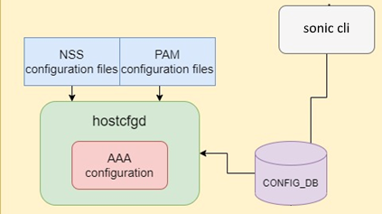

# HLD AAA Restrictions #

## Table of Content 

### Revision  
|  Rev  |  Date   |      Author      | Change Description |
| :---: | :-----: | :--------------: | ------------------ |
|  0.1  | 04/2024 | Vladi Tarnavsky  |       Draft        |

### Scope  
The scope includes the design and implementation details for AAA restrictions, focusing on authentication sequences, session management, and user activity accounting in SONIC switches.

### Definitions/Abbreviations 
- **API**: Application Programmable Interface
- **AAA**: Authentication, Authorization, and Accounting
- **PAM**: Pluggable Authentication Module


### Reference
|  Ref link                                                                                            |  Description                                              |  
| :--------------------------------------------------------------------------------------------------: | :-------------------------------------------------------: |
|  https://github.com/sonic-net/SONiC/blob/master/doc/aaa/AAA%20Improvements/AAA%20Improvements.md     | Sonic AAA improvements                                    |
|  https://man7.org/linux/man-pages/man3/pam.3.html                                                    | Linux PAM                                                 |
|  https://confluence.nvidia.com/pages/viewpage.action?pageId=1347495920                               | Pluggable Authentication Modules Library                  |
|  http://pubs.opengroup.org/onlinepubs/8329799/chap5.htm                                              | Implementation details of ldap pam & nss                  |
|  http://wpollock.com/AUnix2/PAM-Help.htm                                                             | PAM options                                               |
|  https://packages.debian.org/sid/libpam-ldapd                                                        | PAM options                                               | 

### Overview 
AAA (Authentication, Authorization, and Accounting) in Sonic establishes a robust framework for access control, policy enforcement, usage auditing, and service billing, supporting standard protocols such as RADIUS, TACACS+, and LDAP for user authentication.

This HLD aims to boost aaa security by limiting the number and frequency of login attempts. The goal is to strengthen the system's defenses against brute-force attacks and enhance overall security.

### Requirements

-      Limit Login Attempts: Specify the maximum number of unsuccessful login attempts allowed before a user account is temporarily locked. This prevents continuous guessing of credentials.
-      Control Login Speed: Introduce delays between consecutive login attempts to slow down any automated login attempts, significantly reducing the risk of brute force attacks.
-      Define Unlock Time: Establish a configurable unlock time that specifies how long a user account remains locked before allowing another login attempt. This control helps manage the access of users who have shown suspicious login behaviors.

### Architecture Design 

Arc design diagram\


### High-Level Design 

#### Sonic-cli
The CLI will update the CONFIG_DB aaa tables with the commands mentioned above & will show the current configuration.

#### PAM, NSLCD, NSS
The file list below will be modified according to the flows of the feature, more description in flow chapter to support login session limitations and aaa.
/etc/common-auth-sonic or /etc/common-auth
/etc/pam_talley2 , /etc/pam_faillock , /etc/pam_faildelay.so
/etc/nsswitch.conf

#### Hostcfgd
Hostcfgd – listen to changes in CONFIG_DB in the aaa table, and when the table have a new modification/or init happens it will trigger a callback in hostcfgd handle in AAA class to modify the PAM & NSS configuration files in Linux.

#### Database
will update the Redis CONFIG_DB to have the necessary fields.
AAA: {
  Authentication: {
    restrictions: {
      lockout-state: (True/False)
      lockout-reattempt: (duration_sec)*
      lockout-attempts: (number>2)
      fail-delay: (duration_sec)
    }
  }
}
*      lockout-reattempt: 0 is considered without a limit. will not allow reattempt without resetting the counter.

### Init Flow
#### Compilation
No new pkg are added in the build time.

#### Feature Default
Restrictions are disabled by default.
In addition, this affects the common-auth-sonic file switching to a duplicative branch to use pam_faildelay.so and pam_faillock.so
      lockout-state: "False"
      lockout-reattempt: (15 sec)
      lockout-attempts: (5 attempts)
      fail-delay: (0 sec)

#### Dependencies

not relevant

### SAI API 

not relevant

#### Manifest (if the feature is an Application Extension)

not relevant

#### CLI/YANG model Enhancements 
```yang
//filename: sonic-system-aaa.yang
module sonic-system-aaa {
...
    container sonic-system-aaa {
        container AAA {
            list AAA_LIST {
                key "type";

                leaf type {
                    type enumeration {
                        enum authentication;
			**enum restrictions;**
**
                leaf lockout_state {
                    type stypes:boolean_type;
                    description "Enable or disable lockout of a user in case of failed authentication attempts. A user with restricted access remains so until successful login or admin clearance";
                    default True;

                leaf fail-delay {
                    default 0;
                    type uint32 {
                        range "1..999" {
                            error-message "Error: Valid range is 0 - 999";
                        }
                    }
                    description "Configure the added delay (seconds) for each failed authentication attempt";
                }

                leaf lockout-attempts {
                    default 5;
                    type uint32 {
                        range "3..999" {
                            error-message "Error: Valid range is 3 - 999";
                        }
                    }
                    description "Configure the maximum permitted consecutive auth failures before user lockout";
                }

                leaf lockout-reattempt {
                    default 15;
                    type uint32 {
                        range "0..99999" {
                            error-message "Error: Valid range is 0 - 99999";
                        }
                    }
                    description "Configure wait time (seconds) for a locked user's retry. '0' is blacklisted, but not blocked";
                }
**
```

#### Config DB Enhancements
```
AAA:{
    	Authentication:{
			...
			}
	Restrictions:{
			    lockout-state: {{“True”}}
			    lockout-reattempt: {{ (5 (duration_sec)) }}
			    lockout-attempts: {{  (5 (num>2))  }}
			    fail-delay: {{ (0 (duration_sec)) }}
			    }

	}
```

### Warmboot and Fastboot Design Impact  
not relevant

### Memory Consumption
not relevant

### Pluggable Authentication Modules
compared to AAA Improvements we changed the authentication flow

#### PAM authentication

PAM configuration files contain "stacks" of PAM modules that `pam_authenticate()` invokes in the order they appear in the stack until authentication succeeds or fails. To understand the concept of stacking, please refer to [this document](https://docs.oracle.com/cd/E19253-01/816-4557/pam-15/index.html).
We introduce and use more complex deny and permit to allow restrictions on the attempts 
```bash
auth    required        pam_faillock.so preauth audit silent deny={{ attempts }} unlock_time={{ unlock_time }}
auth    [default=die]                       pam_faillock.so authfail audit deny={{ attempts }} unlock_time={{ unlock_time }}
auth    sufficient                       pam_faillock.so authsucc audit deny={{ attempts }} unlock_time={{ unlock_time }}
```
### Flows
The flows are aaa sonic-based flows.

### AAA Authentication successful
The Pluggable Authentication Module (PAM) can be used to authenticate a CLI (SSH, or console) user to a Linux device. If a user provides correct credential based on a login attempt (ssh or local) and logins to the system gaining his privilege level.
More details:
PAM - A module-based system for allowing service-based authentication and accounting. Unlike NSS, you are not extending existing databases; PAM modules can use whatever logic they like, though shell logins still depend on the passwd and group databases of NSS. (you always need UID/GID lookups)
Successful authentication is in case aaa configuration is configured for a remote connection and a remote connection is established, authenticated, and authorized for a valid user from the correct source (by order).
for successful flow, this feature is tested to not interrupt the correct flow.

### AAA Authentication unsuccessful
Positive unsuccessful login is when a user for a variety of reasons should not be given access or specific permission and is not allowed to get them. The reasons are – to many login attempts, a blocked user, wrong credentials, server authentication error or incorrect user for a login order (ldap user trying to connect while only local is allowed) in those cases the right expected behavior is authentication unsuccessful.
for those flows, we have a new type of unsuccessful attempt the user is blocked because of too many tries, or too quick a retry.

#### Error Flow
same as aaa Error flows

### Restrictions/Limitations  

### Testing Requirements/Design  
Test all the new SONiC following commands about aaa configuration below by using `show aaa authentication restrictions` command and see that the expected configuration applied.
In addition, review all the configurations below in this file /etc/pam.d/common-auth-sonic.

Test all the new SONiC following commands about AAA restrictions configurations below by using `show aaa` command and see that the expected configuration applied.

AAA restrictions configuration:

-	Configure AAA authentication restrictions fail-delay
-	Configure AAA authentication restrictions lockout-attempts
-	Configure AAA authentication restrictions lockout-reattempt
-	Configure AAA authentication restrictions lockout-state

#### Unit Test cases
Test changes in the database affect the end-point configuration.
Check config files after all configs are set

#### System Test cases

repeat aaa system Test cases. 
new cases:
configure restrictions lockout-state enabled, lockout-reattempt 300, lockout-attempts 3.
fail 3 times, try to log in within lockout-reattempt seconds with the correct password, and fail.
configure restrictions fail-delay 60.
try to log in with an incorrect password and see you may not retry again. try with a different ssh with the correct password in the fail-delay time.

#### Debug
same as aaa flows

### CLI
The AAA commands are existing and will be extended for the restrictions feature support
restrictions commands are as defined as follows:

```
config aaa authentication restrictions fail-delay
config aaa authentication restrictions lockout-attempts
config aaa authentication restrictions lockout-reattempt
config aaa authentication restrictions lockout-state

show aaa
show aaa authentication
show aaa authentication restrictions

```

### Open/Action items - if any 

	
NOTE: All the sections and sub-sections given above are mandatory in the design document. Users can add additional sections/sub-sections if required.

