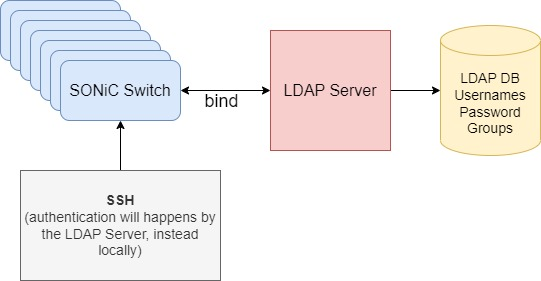
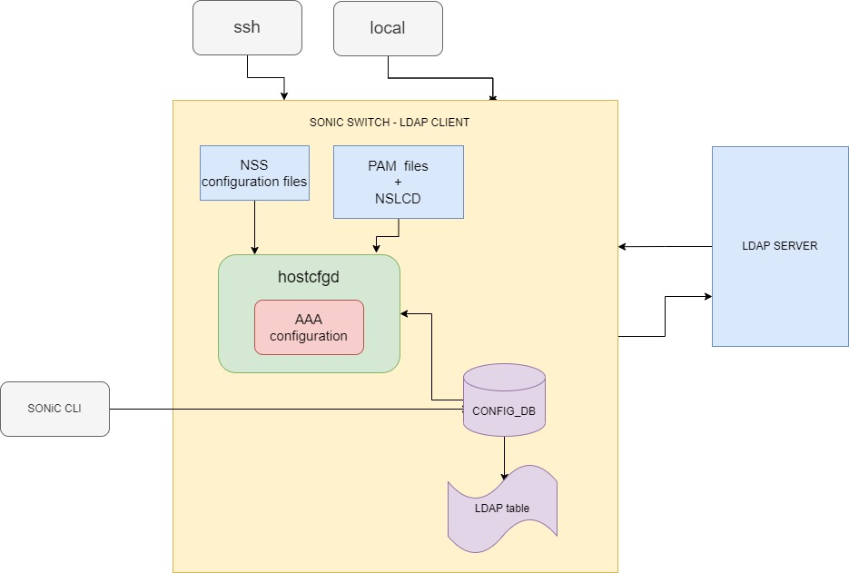
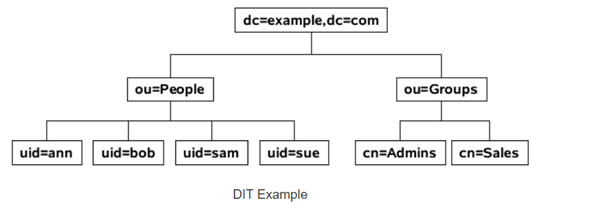
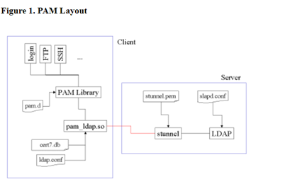
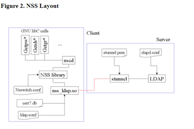

# HLD LDAP #

## Table of Content 

### Revision  
|  Rev  |  Date   |      Author      | Change Description |
| :---: | :-----: | :--------------: | ------------------ |
|  0.1  | 09/2023 |   David Pilnik   | Phase 1 Design     |
### Scope  

This ldap hld doc described the requirements, architecture and configuration details of ldap feature in switches SONIC OS based.

### Definitions/Abbreviations 

LDAP	Lightweight Directory Access Protocol
DIT	Directory Information Tree
DN	Distinguished Names is a Distinguished Name (often referred to as a DN or FDN) is a string that uniquely identifies an entry in the DIT.
CN 	Common name https://ldapwiki.com/wiki/CommonName 
DC	Domain Component

### Reference
|  Ref link                                                                         |  Description                                              |  
| :-------------------------------------------------------------------------------: | :-------------------------------------------------------: |
|  https://wiki.debian.org/LDAP/NSS                                                 | Debian LDAP WIKI                                          |
|  https://www.linuxbabe.com/debian/set-up-openldap-server-debian                   | Configure Ldap client in Debian 11                        |
|  https://packages.debian.org/sid/libnss-ldapd                                     | libnss-ldapd                                              |
|  https://tldp.org/HOWTO/archived/LDAP-Implementation-HOWTO/pamnss.html            | Implementation details of ldap pam & nss                  |
|  https://wiki.archlinux.org/title/OpenLDAP                                        | slap & ldap-utils packages                                |
|  https://packages.debian.org/sid/libpam-ldapd                                     | libpam-ldapd                                              |
|  https://stackoverflow.com/questions/18756688/what-are-cn-ou-dc-in-an-ldap-search | DN, DC, OU, CN descriptions                               |
|  https://manpages.debian.org/stretch/nslcd/nslcd.conf.5                           | NSLCD service configuration                               |


### Overview 

LDAP, the Lightweight Directory Access Protocol, is a mature, flexible, and well supported standards-based mechanism for interacting with directory servers. It’s often used for authentication and storing information about users, groups, and applications, but an LDAP directory server is a general-purpose data store and can be used in a wide variety of applications.
In simple words, instead to config hundreds of same usernames and passwords in different switch devices, you can configure it one time and the validate in every case will be derive to the LDAP server instead locally in every device.
https://en.wikipedia.org/wiki/Lightweight_Directory_Access_Protocol 

LDAP motivation\


### Requirements

-	Support LDAP login authentication for ssh/serial connection from an external LDAP server.
-	Support to search for user/groups/etc in LDAP server from the switch LDAP client.
-	Support a fallback mechanism for authentication. If an LDAP server authentication fails, the next server authentication will be performed or local authentication.
-	TODO: SONIC rest API/nginx?

### Architecture Design 

Arc design diagram\


### High-Level Design 

#### hostcfgd
Hostcfgd – listen to changes in CONFIG_DB in the LDAP table, and when the table has a new modification/or init happens it will trigger a callback in hostcfgd handle in AAA class to modify the PAM & NSS configuration files in Linux.

#### SSH/Local login
After enabling the LDAP configuration the ssh/local login to the switch will be authenticated by the LDAP server.

#### PAM, NSLCD, NSS
The file list below will be modified according to the flows of the feature, and more description in the flow chapter to support Ldap.
/etc/ldap/ldap.conf
/etc/common-auth-sonic or /etc/common-auth
/etc/nsswitch.conf
/etc/nslcd.conf

#### LDAP SERVER
LDAP Server – should have the DB of the LDAP users and do the user validation/authentication.
Not required to do any implementation, each vendor should be able to create his own LDAP server.
DIT of LDAP server diagram: (https://ldapwiki.com/wiki/Distinguished%20Names )
A DN is comprised of zero or more Relative Distinguished Name components that identify the location of the entry in the DIT.

An LDAP Entry's Distinguished Names can be thought of as a kind of an analog to an absolute path in a File System in that it specifies both the name and hierarchical location.

Distinguished Names are composed of Naming Attributes (Relative Distinguished Names or RDNs) and should therefore follow Best Practices For LDAP Naming Attributes


### Init Flow

#### Compilation
The following pkg will be added in build time:
- libnss-ldapd
- libpam-ldapd
- ldap-utils

##### libnss-ldapd
NSS module for using LDAP as a naming service
This package provides a Name Service Switch module that allows using an LDAP server to provide user account, group, host name, alias, netgroup, and basically any other information that would normally be retrieved from /etc flat files or NIS.

#### nslcd (service that included to ma of libnss-ldapd)
daemon for NSS and PAM lookups using LDAP

##### libpam-ldapd
This package provides a Pluggable Authentication Module that provides user authentication, authorization and password management based on credentials stored in an LDAP server.
https://packages.debian.org/sid/libpam-ldapd 

##### ldap-utils
The ldap-utils package includes a number of utilities that can be used to perform queries on a LDAP server.
i.e:
ldapsearch : search for and display entries
ldapwhoami: display with which entry I am bound to the server


#### Feature Default
The LDAP authentication its disabled by default, the AAA its set to local authentication only by default.
In addition, the LDAP pkgs mentioned in the Compilation chapter are installed, but the service NSLCD is disabled by default and enabled only when LDAP is enabled and vice-versa.

```
LDAP_TABLE:{
	global:{
		"bind_dn": {{ (emtpy) }}
		"bind_password": {{ empty with starts **** }}
		"bind_timeout": {{ (5 (duration_sec)) }}
		"version": {{3}}
		"base_dn": {{ou=users,dc=example,dc=com (string)}}
		"port": {{389}}
		"timeout": {{5 (duration_sec)}}
		}
	}
}

LDAP_SERVER:{
		<Sever-ip>:{
			priority: {{1}}
			}
		}
AAA:{
	Authentication:{
			failthought: {{“True”}}
			login :{{“local}}
	}
}
```
#### Dependencies
LDAP Server should be configured according to the permission and users that the customer requires.
i.e: if requires admin permission, the Redis server should have a user with groups id similar to the local groups id of admin build-in user in order to support the same permissions.
uid=6000(test_admin), groups=1000(admin),4(adm),27(sudo),999(docker),1001(redis)
### SAI API 

not relevant

#### Manifest (if the feature is an Application Extension)

not relevant

#### CLI/YANG model Enhancements 

```yang
//filename: sonic-system-ldap.yang
module sonic-system-ldap {
    yang-version 1.1;
    namespace "http://github.com/Azure/sonic-system-ldap";
    prefix ssys-ldap;

    import ietf-inet-types {
        prefix inet;
    }

    description "LDAP YANG Module for SONiC OS";

    revision 2023-10-01 {
        description "First Revision";
    }

    container sonic-system-ldap {

        container LDAP_SERVER {
            list LDAP_SERVER_LIST {
                max-elements 8;
                key "hostname";

                leaf hostname {
                    type inet:host;
                    description
                        "LDAP server's Domain name or IP address (IPv4 or IPv6)";
                }

                leaf priority {
                    default 1;
                    type uint8 {
                        range "1..8" {
                            error-message "LDAP server priority must be 1..8";
                        }
                    }
                    description "Server priority";
                }
            }
        }

        container LDAP {

            container global {


                leaf bind_dn {
                    type string {
                        length "1..65";
                    }
                    description
                            'LDAP global bind dn';
                }

                leaf bind_password {
                    type string {
                        length "1..65";
                        pattern "[^ #,]*" {
                            error-message 'LDAP shared secret (Valid chars are ASCII printable except SPACE, "#", and ",")';
                        }
                    }
                    description "Shared secret used for encrypting the communication";
                }

                leaf bind_timeout {
                    default 5;
                    type uint16 {
                        range "1..120" {
                            error-message "Ldap bind timeout must be 1..120";
                        }
                    }
                    description "Ldap bind timeout";
                }

                leaf version {
                    default 3;
                    type uint16 {
                        range "1..3" {
                            error-message "Ldap version must be 1..3";
                        }
                    }
                    description "Ldap version";
                }

                leaf base_dn {
                    type string {
                        length "1..65";
                    }
                    description "Ldap user base dn";
                }

                leaf port {
                    type inet:port-number;
                    default 389;
                    description "TCP port to communicate with LDAP server";
                }

                leaf timeout {
                    description "Ldap timeout duration in sec";
                    type uint16 {
                        range "1..60" {
                            error-message "LDAP timeout must be 1..60";
                        }
                    }
                }
            } /* container global */
        } /* container LDAP  */
    }/* container sonic-system-ldap */
}/* end of module sonic-system-ldap */

``` 

#### Config DB Enhancements

```
LDAP_TABLE:{
	global:{
		"bind_dn": {{ (string) }}
		"bind_password": {{ ******** (string)}}
		"bind_timeout": {{ (5 (duration_sec)) }}
		"version": {{num}}
		"base_dn": {{ou=users,dc=example,dc=com (string)}}
		"port": {{num}}
		"timeout": {{5 (duration_sec)}}
	}
}

LDAP_SERVER:{
	     <Sever-ip>:{
			prio: {{prio-num}}
	    }
}
AAA:{
	Authentication:{
			Failthought: {{“True”}}
			Login :{{“local, ldap”}}
	}
}
```
		
### Warmboot and Fastboot Design Impact  
not relevant

### Memory Consumption
not relevant

### Flows
#### LDAP Authentication 
The LDAP Pluggable Authentication Module (PAM) can be used to authenticate a CLI (SSH, or console) user to a Linux device like SONiC.
More details:
PAM - A module-based system for allowing service based authentication and accounting. Unlike NSS, you are not extending existing databases; PAM modules can use whatever logic they like, though shell logins still depend on the passwd and group databases of NSS. (you always need UID/GID lookups)

#### LDAP BIND
In order to use LDAP protocol is required to bind our switch to a LDAP server.
That means, that after binding each client LDAP search to the Switch or SSH to the switch will be routed to the LDAP server.

Flow of SSH login connection:
Entry point  Command: ssh user_test@switch-133
The user user_test will be searched in the LDAP server bound to the switch instead to the switch itself.
The user authentication will be done by the LDAP server instead of the UNIX local authentication in the switch.

How to do the binding configuration:
The file that will contain all the info about binding is /etc/nslcd.conf.

Those are the attributes required to set in order to bind client to server:

binddn DN
Specifies the distinguished name with which to bind to the directory server for lookups. The default is to bind anonymously.
bindpw PASSWORD
Specifies the credentials with which to bind. This option is only applicable when used with binddn above. If you set this option you should consider changing the permissions of the nslcd.conf file to only grant access to the root user.

So, this file will contain all the LDAP configurations besides the login configuration that was described in the functional section above.
Note: no restart is required when modifying PAM configuration. Only required to restart the NSLCD service after any modification in nslcd.conf file

#### LDAP NSS
LDAP can be used as an option in the Name Services Switch(NSS) configuration. The NSS configuration enables various programming APIs to use other sources than the default files (e.g., Use LDAP directory information instead of /etc/passwd for user and group information). User information includes uid, gid, and home directory.
More details:
NSS - A module-based system for controlling how various OS-level databases are assembled in memory. This includes (but is not limited to) passwd, group, shadow (this is important to note), and hosts. UID lookups use the passwd database, and GID lookups use the group database.

#### Functional Flow
LDAP Main flow – As mentioned in the LDAP authentication desc, the LDAP supports authentication by authenticating users via a remote server instead of locally (in the switch device).
In high level the connection flow is the following:
User will connect to a switch using ssh/login, the switch is an LDAP client (configured with LDAP feature - description of the configuration flow below), the client switch will “referred” the authentication of the user to the LDAP server binded, then the LDAP server will approve the authentication if the user & password match the LDAP server DB.
And finally, the user will get approved and will be connected to the Switch.
(more description in the bind flow chapter)
More description of the internal modules to support the flow: 




#### Error Flow
Describe the error flows in the system in scenarios where external or internal errors may cause an error in the system. Describe the recovery mechanism and error indications (log, user interface)
Example of error flows:
•	Corrupted packet
•	HW failure
•	Timeout
•	Loss of network connectivity

When LDAP login failed as result of authentication timeout the login flow will do the next following authentication method detected. If configured fallback enabled.
Authentication failed – user will not be able to connect like regular authentication fail.

### Restrictions/Limitations  

### Testing Requirements/Design  
Test all the new SONiC following commands about LDAP configuration  below by using `show ldap` command and see that the expected configuration applied.
In addition, review all the configurations below in this file /etc/nslcd.conf.

LDAP configuration:

-	Configure base-dn 
-	Configure bind-dn
-	Configure bind-password
-	Configure ldap server-ip (not necessary a real IP)
-	Configure ldap port (other than default)
-	Configure scope
-	Configure timeout
-	Configure version

Test all the new SONiC following commands about AAA LDAP configuration  below by using `show aaa` command and see that the expected configuration applied.
In addition, review all the configurations below in those files /etc/pam.d/common-auth-sonic or /etc/pam.d/common-auth, /etc/nsswitch.conf.

AAA LDAP login configuration:

-	Configure AAA authentication login ldap
-	Configure AAA authentication login ldap, local
-	Configure AAA authentication login local, ldap

#### Unit Test cases  
#### Unit Test cases
Test changes in database affect end-point configuration.
Check config files after all config are set
-	Configure base-dn
-	Configure bind-dn
-	Configure bind-password
-	Configure ldap server-ip
-	Configure ldap port
-	Configure scope
-	Configure timeout
-	Configure version

#### System Test cases

Server side:
- Configure an Ldap server with a new user that exist only in the LDAP server and not locally in the device.

Client side: 
- Do the same configurations as in the white box test, but with the real IP server.
- Check that the show command is correct and assert the set configuration.
- Do the command `getent passwd`, and should be able to see the new users that were added to the server exists, means that the binding LDAP flow works.
- Connect to the device via SSH with the new user configured in the LDAP server.
- test priority when first server doesn't answer
	- Configure 2 servers, one with prio 1 and the second with prio 2.
		The server IP with prio 1 should be down, and you should be able to login to the switch because the LDAP protocol should be able to pass the authentication by using the server with prio 2.

	- Review also that the timeout waiting for the connection to the first server is according to the timeout time configured.
	- Review the prio was checking that the request to connect to the server order is according to the prio configured.

Fallback mechanism 
- Configure AAA authentication login ldap
	- Test that local user cannot be connected.
-	Configure AAA authentication login ldap, local
	- Test that if the LDAP server is not answering, local user (i.e. admin) can be connected.
-	Configure AAA authentication login local, ldap
	- Test that when connecting with SSH, first the authetication flow will search the user locally, and only if not exist will search in LDAP server

#### Debug
Use Linux tool ldapsearch 
ldapsearch opens a connection to an LDAP server, binds, and performs a search using specified parameters.

	ldapsearch -LLLQ -Y EXTERNAL -H ldapi:/// -b cn=config dn

ldapsearch(1) — ldap-utils — Debian bullseye-backports — Debian Manpages

logs:
LDAP configuration can be debug in syslog.
In addition, this feature show more debug msg in the following file:
/var/log/auth.log

### CLI
The AAA commands are existing and will be extended for the LDAP feature support
Ldap commands are as defined as follows:

```
config aaa authentication login {local | ldap}
config aaa authentication failthrough enable/disable

show aaa

config ldap host <ADDRESS> --prio <1 - 8>
config ldap bind_dn <TEXT>
config ldap bind_password <TEXT>
config ldap bind_timeout <0 – 120>
config ldap version <1 - 3>
config ldap base_dn <TEXT>
config ldap port <1-65535>
config ldap timeout <1-60>
```

### Open/Action items - if any 

	
NOTE: All the sections and sub-sections given above are mandatory in the design document. Users can add additional sections/sub-sections if required.
