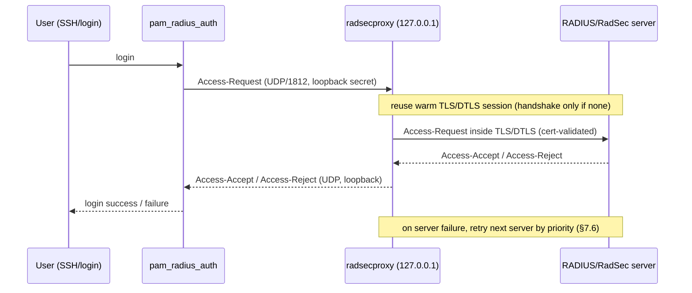

# RadSec: RADIUS over TLS and DTLS for SONiC

## Table of Content

- [RadSec: RADIUS over TLS and DTLS for SONiC](#radsec-radius-over-tls-and-dtls-for-sonic)
  - [Table of Content](#table-of-content)
  - [1. Revision](#1-revision)
  - [2. Scope](#2-scope)
  - [3. Definitions/Abbreviations](#3-definitionsabbreviations)
  - [4. Overview](#4-overview)
  - [5. Requirements](#5-requirements)
    - [5.1 Functional Requirements](#51-functional-requirements)
    - [5.2 Security Requirements](#52-security-requirements)
    - [5.3 Configuration and Management Requirements](#53-configuration-and-management-requirements)
    - [5.4 Scalability and Performance Requirements](#54-scalability-and-performance-requirements)
    - [5.5 Backward Compatibility Requirements](#55-backward-compatibility-requirements)
    - [5.6 Serviceability Requirements](#56-serviceability-requirements)
    - [5.7 Exemptions and Not Supported Items](#57-exemptions-and-not-supported-items)
  - [6. Architecture Design](#6-architecture-design)
    - [6.1 Existing SONiC RADIUS Architecture](#61-existing-sonic-radius-architecture)
    - [6.2 Proposed Architecture](#62-proposed-architecture)
    - [6.3 Component Responsibilities](#63-component-responsibilities)
    - [6.4 Repositories and Modules](#64-repositories-and-modules)
  - [7. High-Level Design](#7-high-level-design)
    - [7.1 Feature Type](#71-feature-type)
    - [7.2 RADIUS over TLS Transport (RFC 6614)](#72-radius-over-tls-transport-rfc-6614)
    - [7.3 RADIUS over DTLS Transport (RFC 7360)](#73-radius-over-dtls-transport-rfc-7360)
    - [7.4 TLS Credential Choices](#74-tls-credential-choices)
    - [7.5 radsecproxy Sidecar Design](#75-radsecproxy-sidecar-design)
    - [7.6 Ordered Failover and Recovery](#76-ordered-failover-and-recovery)
    - [7.7 SONiC ConfigDB Integration](#77-sonic-configdb-integration)
    - [7.8 Secret and Certificate Material](#78-secret-and-certificate-material)
    - [7.9 Error Handling](#79-error-handling)
    - [7.10 Serviceability and Debug](#710-serviceability-and-debug)
    - [7.11 Linux Packaging and Runtime Dependencies](#711-linux-packaging-and-runtime-dependencies)
    - [7.12 Alternatives Considered](#712-alternatives-considered)
  - [8. SAI API](#8-sai-api)
  - [9. Configuration and Management](#9-configuration-and-management)
    - [9.1 Manifest](#91-manifest)
    - [9.2 CLI/YANG Model Enhancements](#92-cliyang-model-enhancements)
    - [9.3 Config DB Enhancements](#93-config-db-enhancements)
    - [9.4 Logs, Counters, and Show Commands](#94-logs-counters-and-show-commands)
  - [10. Warmboot and Fastboot Design Impact](#10-warmboot-and-fastboot-design-impact)
  - [11. Memory Consumption](#11-memory-consumption)
  - [12. Restrictions/Limitations](#12-restrictionslimitations)
  - [13. Testing Requirements/Design](#13-testing-requirementsdesign)
    - [13.1 Unit Test Cases](#131-unit-test-cases)
    - [13.2 System Test Cases](#132-system-test-cases)
    - [13.3 Security Test Cases](#133-security-test-cases)
    - [13.4 sonic-mgmt Test Plan](#134-sonic-mgmt-test-plan)
    - [13.5 Backward Compatibility and Regression Tests](#135-backward-compatibility-and-regression-tests)
  - [14. Relationship to Issue #2035 and PR #2352](#14-relationship-to-issue-2035-and-pr-2352)
  - [15. Open/Action Items](#15-openaction-items)
  - [16. References](#16-references)

## 1. Revision

| Rev | Date       | Author              | Change Description                          |
| --- | ---------- | ------------------- | ------------------------------------------- |
| 0.1 | 2026-06-21 | Anant Kishor Sharma (HPE) | Initial draft for RADIUS over TLS (RadSec) and RADIUS over DTLS in SONiC. |

## 2. Scope

This document describes the high-level design for adding **RadSec (RADIUS over TLS, RFC 6614)** and **RADIUS over DTLS (RFC 7360)** to SONiC. The goal is to secure the management-plane RADIUS transport used for device administration (login authentication, authorization, and accounting) while preserving the existing SONiC RADIUS configuration model and operational behavior.

The scope includes the following items:

- Support RADIUS over UDP (existing, RFC 2865/2866), RADIUS over TLS (RFC 6614), and RADIUS over DTLS (RFC 7360).
- Support TLS/DTLS server certificate validation and mutual TLS (mTLS) using configured trust anchors and client identity material.
- Introduce a host-local RadSec proxy (`radsecproxy`) per SONiC compute device that terminates the local plain-RADIUS request from existing host consumers and forwards it to upstream RADIUS servers over a TLS or DTLS tunnel.
- Reuse existing SONiC `RADIUS|global` and `RADIUS_SERVER|*` CONFIG_DB rows and add optional, backward-compatible parameters for transport selection and TLS credential material.
- Cover authentication and accounting over the secured transport. Change-of-Authorization (RFC 5176) is out of scope for the first phase.
- Define configuration, management, serviceability, testing, and approval requirements for an Alpha-stage feature.
- Align credential provisioning and TLS configuration field naming with the TACACS+ over TLS design in PR #2352 so that SONiC has one consistent "AAA over TLS" operational model.

This document does not change the RADIUS attribute set, the SONiC AAA login flow, or `pam_radius_auth`/`libnss-radius` semantics other than redirecting their upstream transport to the local proxy when RadSec is enabled.

## 3. Definitions/Abbreviations

| Term | Meaning |
| --- | --- |
| AAA | Authentication, Authorization, and Accounting. |
| BlastRADIUS | CVE-2024-3596, a protocol vulnerability in RADIUS/UDP that allows an on-path attacker to forge `Access-Accept` responses by exploiting the MD5-based Response Authenticator. |
| CoA | Change of Authorization (RFC 5176), a server-initiated RADIUS flow. |
| CONFIG_DB | SONiC Redis-backed configuration database, database index 4. |
| DTLS | Datagram Transport Layer Security (RFC 9147), TLS adapted for datagram transports such as UDP. |
| mTLS | Mutual TLS, where both client and server present certificates. |
| NAS | Network Access Server. Here, the SONiC device acting as a RADIUS client. |
| RadSec | RADIUS over TLS, as specified by RFC 6614 (TCP/2083). |
| `radsecproxy` | An open-source RADIUS proxy that translates between RADIUS/UDP, RADIUS/TLS, and RADIUS/DTLS. |
| SAI | Switch Abstraction Interface. |
| TLS | Transport Layer Security. |
| Transport-security mode | The selected RADIUS server transport: plain UDP/shared-secret, TLS, or DTLS. |

## 4. Overview

SONiC already supports RADIUS for device administration. The existing implementation uses RADIUS over UDP with the RFC 2865 shared-secret model, integrated through `pam_radius_auth` (login authentication/authorization) and `libnss-radius` (name service).

RADIUS/UDP has well-known transport security weaknesses. The Request/Response Authenticator and the `User-Password` hiding mechanism are based on MD5, which is no longer considered secure. **CVE-2024-3596 ("BlastRADIUS")** demonstrated that an on-path attacker can forge a successful authentication response when only the legacy MD5 construction is used. SONiC's current mitigation is the `require_message_authenticator` attribute (RFC 5080 / `Message-Authenticator` enforcement), which is a useful hardening step but does not encrypt or authenticate the full datagram and does not protect accounting or attribute confidentiality.

The long-term, standards-based remedy is to move RADIUS onto a secure transport:

- **RadSec / RADIUS over TLS (RFC 6614)** runs RADIUS inside a TLS session on TCP port 2083, with the server authenticated by certificate and the client (NAS) also authenticated by certificate (mutual TLS, which RFC 6614 §2.3 requires).
- **RADIUS over DTLS (RFC 7360)** provides the same protection for UDP-oriented deployments on datagram transport.

This HLD proposes a host-local RadSec proxy that owns the upstream TLS/DTLS connection and exposes a loopback plain-RADIUS endpoint to the existing host consumers. Host consumers continue to use the SONiC RADIUS configuration and PAM/NSS integration unchanged; only the upstream transport is secured. The feature is proposed as an Alpha-stage SONiC feature, disabled by default, preserving existing RADIUS/UDP operation when disabled.

## 5. Requirements

### 5.1 Functional Requirements

- The implementation shall preserve existing RADIUS/UDP shared-secret operation for compatibility with current deployments.
- The implementation shall support RADIUS over TLS (RFC 6614) for upstream authentication and accounting.
- The implementation shall support RADIUS over DTLS (RFC 7360) for upstream authentication and accounting.
- The implementation shall support TLS/DTLS server certificate validation using configured trust anchors and mTLS using configured client certificate material.
- The implementation shall validate the configured credential choice and reject incomplete TLS/DTLS identity or trust material.
- The implementation shall support multiple RADIUS servers using the priority order configured through existing SONiC RADIUS CLI and CONFIG_DB semantics.
- The implementation shall prefer the highest-priority healthy server and fail over to lower-priority servers when the preferred server is not reachable.
- The implementation shall preserve the existing SONiC RADIUS source-interface behavior so that outgoing TLS/DTLS connections originate from the configured source interface/VRF.
- The implementation shall read existing SONiC RADIUS configuration from CONFIG_DB and hot-reload on change.

### 5.2 Security Requirements

- TLS/DTLS connections shall authenticate the upstream RADIUS server using the configured trust anchors.
- Certificate verification shall be disabled only when an explicitly unsafe diagnostic option is selected, and that state shall be visible in logs and show output.
- The design shall not store raw TLS private keys in plaintext CONFIG_DB fields.
- The feature shall define how certificates, trust anchors, and private keys are referenced and protected on the device.
- The loopback RADIUS endpoint exposed to host consumers shall bind to the host loopback only and shall not be reachable off-box.
- Sensitive values such as shared secrets, private keys, and user passwords shall not be logged or displayed.
- When RadSec is enabled for a server, the on-the-wire plaintext/MD5 attack surface (BlastRADIUS) shall be eliminated for that server's upstream exchanges because they are carried inside TLS/DTLS. This guarantee holds only when no RADIUS/UDP downgrade can occur for that server (see the strict-mode requirement below).
- The implementation shall support a strict no-downgrade mode in which a server configured for `tls` or `dtls` is never contacted over RADIUS/UDP, including on failover. RFC 7360 §4 requires that a DTLS-configured client MUST NOT fall back to RADIUS/UDP, and RFC 6614 §6 warns that mixing a RADIUS/UDP failover option with RADIUS/TLS enables a bidding-down attack; server pools SHOULD NOT mix UDP and TLS/DTLS for the same logical server. When strict mode is enabled and all secure servers are unreachable, the proxy shall fail the request (allowing existing SONiC AAA fallback such as local accounts) rather than silently downgrade to RADIUS/UDP.
- The proxy shall negotiate a minimum of TLS 1.2 for `tls` servers and DTLS 1.2 for `dtls` servers, and shall reject SSLv3, TLS 1.0, and TLS 1.1. The default cipher policy shall require certificate-authenticated, forward-secret cipher suites; NULL, export, and otherwise weak cipher suites shall be disabled.

### 5.3 Configuration and Management Requirements

- The feature shall be controlled by CONFIG_DB and disabled by default during Alpha maturity.
- Existing `RADIUS|global` and `RADIUS_SERVER|*` configuration shall remain valid.
- New transport and TLS-related fields shall be backward compatible and optional.
- The management model shall allow operators to select `udp`, `tls`, or `dtls` per server, and for TLS/DTLS to configure server-certificate validation or mTLS.
- CLI changes shall preserve save and restore compatibility with configurations from previous releases.
- A server row shall map to exactly one valid transport-security mode; redundant fields from another mode shall be rejected rather than silently ignored.
- New CONFIG_DB fields should align in naming with the TACACS+ over TLS design (PR #2352) where the concept is shared (for example `transport`, `domain_name`, `trust_anchor_ref`).

### 5.4 Scalability and Performance Requirements

- The proxy shall reuse upstream TLS/DTLS sessions across requests rather than performing a full handshake per request.
- The proxy shall serialize reconnect attempts per server so concurrent local requests do not create a connection storm.
- The proxy shall debounce CONFIG_DB updates, re-read RADIUS configuration, validate the complete effective configuration, and hot-reload affected upstream server state without requiring a host reboot.
- TLS/DTLS and failover behavior shall not be in the switching data plane path and shall add no SAI dependencies.
- The design shall support the existing SONiC maximum of 8 configured RADIUS servers.

### 5.5 Backward Compatibility Requirements

- Existing RADIUS authentication, authorization, accounting, and local fallback configuration shall continue to operate when RadSec is disabled.
- Existing `RADIUS|global` and `RADIUS_SERVER|*` rows shall map to RADIUS/UDP shared-secret behavior when no transport/TLS fields are present.
- Existing SONiC CLI commands shall continue to work unless explicitly changed and documented.
- Operators shall be able to disable RadSec per server or globally and return to the existing RADIUS/UDP path.
- Configuration save and restore across upgrade and downgrade paths shall be documented and tested.

### 5.6 Serviceability Requirements

- The proxy shall log upstream connection state changes, failover decisions, TLS/DTLS validation failures, configuration parse errors, and local endpoint errors.
- The feature shall provide show commands for proxy health, configured server transport mode, active failover target, and counters.
- The feature shall expose enough information for sonic-mgmt tests to determine whether UDP, TLS, or DTLS, certificate validation, mTLS, and failover paths are active.

### 5.7 Exemptions and Not Supported Items

- This HLD does not propose any SAI API change.
- This HLD does not require switch ASIC or platform vendor API changes.
- This HLD does not remove the existing SONiC RADIUS/UDP implementation.
- Change-of-Authorization (RFC 5176) and dynamic authorization extensions are out of scope for the first phase.
- TLS 1.3 PSK for RADIUS is not supported in the first phase; RadSec deployments are certificate-based per common RFC 6614 practice.

## 6. Architecture Design

### 6.1 Existing SONiC RADIUS Architecture

In the current design, host-side RADIUS consumers read SONiC RADIUS settings derived from CONFIG_DB and communicate directly with configured RADIUS servers over UDP. `hostcfgd` renders the consumer configuration (for example `pam_radius_auth` and `libnss-radius` config) from the `RADIUS` and `RADIUS_SERVER` tables.

```text
+----------------+        +----------------------+      UDP/1812,1813      +--------------+
| PAM / NSS      | -----> | SONiC RADIUS         | ----------------------> | RADIUS       |
| (login, NSS)   |        | configuration        |   shared-secret/MD5     | server       |
+----------------+        +----------------------+                         +--------------+
```

This architecture continues to work for existing UDP shared-secret deployments and remains the compatibility baseline.

### 6.2 Proposed Architecture

The proposed architecture inserts a host-local RadSec proxy between the existing host consumers and the upstream RADIUS servers. Host consumers send plain RADIUS to a loopback endpoint; the proxy wraps the exchange in TLS (RFC 6614) or DTLS (RFC 7360) to the upstream server.

```text
+----------------+  RADIUS/UDP  +----------------------+  TLS or DTLS / 2083  +--------------+
| PAM / NSS      | -----------> |  radsecproxy         | ===================> | RADIUS /     |
| (login, NSS)   | <----------- |  (host-local sidecar)| <=================== | RadSec server|
+----------------+  127.0.0.1   +----------+-----------+                      +--------------+
                                           |
                                           | CONFIG_DB read/subscribe (via hostcfgd)
                                           v
                                +-------------------------+
                                | RADIUS / RADIUS_SERVER  |
                                | tables in CONFIG_DB     |
                                +-------------------------+
```

When RadSec is disabled for a server, host consumers talk directly to that server over UDP exactly as today. When RadSec is enabled, `hostcfgd` points the consumer's upstream for that server at the loopback proxy, and the proxy owns the TLS/DTLS session, certificate validation, and failover.

### 6.3 Component Responsibilities

| Component | Responsibility | Lifetime |
| --- | --- | --- |
| RadSec proxy (`radsecproxy`) | Terminates loopback plain-RADIUS, opens upstream TLS/DTLS, validates certificates, performs ordered failover and session reuse. | Long-running systemd service (host). |
| `hostcfgd` RADIUS renderer | Maps `RADIUS`/`RADIUS_SERVER` rows into both consumer config and the proxy config, points consumers at loopback when RadSec is enabled, triggers hot-reload. | Existing host service (sonic-host-services). |
| Host RADIUS consumers | `pam_radius_auth`, `libnss-radius` and other consumers continue to issue RADIUS requests, now to the loopback endpoint when RadSec is enabled. | Existing components. |
| RadSec status monitor | A lightweight poller (a `hostcfgd` helper thread or a small companion script) that reads `radsecproxy` runtime status — via its `statusServer` reachability data and parsed structured logs — and publishes per-server transport, connection, failover, and counter state into STATE_DB for `show` commands and telemetry. | Host service. |
| Credential provisioning | ACMS / gNSI Certz or equivalent places trust anchors, client certs, and keys as protected files on disk. | Out-of-band provisioning flow. |

### 6.4 Repositories and Modules

| Repository or area | Expected change |
| --- | --- |
| SONiC doc repository | This HLD and the related sonic-mgmt test plan. |
| sonic-buildimage | Integrate the `radsecproxy` Debian package, systemd unit, `FEATURE` table entry, and config-template wiring. |
| sonic-host-services | Extend the `hostcfgd` RADIUS handler to render `radsecproxy.conf`, redirect consumers to loopback, and hot-reload on CONFIG_DB change. |
| sonic-utilities | `config radius` / `show radius` CLI additions for transport mode, TLS credential references, and proxy status/counters. |
| sonic-yang-models | YANG additions to `sonic-system-radius` for transport selection and TLS credential references. |
| sonic-mgmt | Test plan and automated tests for UDP/TLS/DTLS, certificate validation, mTLS, failover, and rollback. |

## 7. High-Level Design

### 7.1 Feature Type

The proposed first phase is a built-in optional SONiC host service controlled by the SONiC `FEATURE` table and RADIUS CONFIG_DB state. It is packaged as a Debian package and runs on the SONiC host. It is not a SAI feature and does not require changes to switch ASIC programming. The service scope is one proxy instance per SONiC compute device / SONiC OS instance.

### 7.2 RADIUS over TLS Transport (RFC 6614)

When a server's transport is `tls`, the proxy opens a TLS connection to the server's RadSec port (default TCP 2083) and carries standard RADIUS packets inside the TLS record layer. The proxy validates the server certificate using the configured trust anchor and, when configured, the server domain name. The legacy RADIUS shared secret inside the TLS channel is fixed to the RFC 6614 well-known value `radsec` unless the server requires otherwise, because confidentiality and integrity are provided by TLS rather than the RADIUS MD5 construction.

### 7.3 RADIUS over DTLS Transport (RFC 7360)

When a server's transport is `dtls`, the proxy opens a DTLS session (default UDP 2083) and carries RADIUS packets as datagrams protected by DTLS. DTLS suits deployments that prefer connectionless transport or have middleboxes optimized for UDP RADIUS. Certificate validation and credential choices are identical to the TLS case; only the record/datagram layer differs. Retransmission is handled at the DTLS/RADIUS layer rather than by TCP. Note that the fixed legacy shared secret used inside the tunnel differs by transport: it is `radsec` for TLS (RFC 6614, §2.3 (4)) but MUST be `radius/dtls` for DTLS (RFC 7360, §2.1); the proxy configuration uses the correct value per `transport`.

### 7.4 TLS Credential Choices

The proxy derives the credential choice from the populated server fields:

| Mode | Required material |
| --- | --- |
| mTLS (baseline) | Trust anchor reference plus client certificate reference and client private key reference; optional server domain name. |
| Server certificate validation only | Trust anchor reference; optional server domain name. Relaxed/diagnostic mode — see note below. |

RFC 6614 §2.3 requires support for, and negotiation of, certificate-based **mutual** authentication, and RFC 7360 §4 / §10.4 require the client (NAS) to authenticate itself to the server with credentials unique to each client. Because this design also does not use TLS-PSK (see §5.7), mTLS with a client certificate is the only standards-compliant client-authentication mechanism and is therefore the baseline. Server-certificate-validation-only leaves the NAS unauthenticated to the server; it is provided only as a relaxed/diagnostic option and is not for production use.

The implementation shall reject incomplete or ambiguous configurations (for example a client certificate without a private key, or TLS fields present while `transport` is `udp`). Certificate verification disablement is a diagnostic-only mode that must be explicit and visible.

### 7.5 radsecproxy Sidecar Design

`radsecproxy` is a mature, packaged RADIUS proxy that natively translates between RADIUS/UDP, RADIUS/TLS, and RADIUS/DTLS, which makes it a direct fit for both transport choices in this HLD with no protocol code written from scratch.

`hostcfgd` renders `/etc/radsecproxy.conf` from CONFIG_DB. For each RadSec-enabled `RADIUS_SERVER` row it emits:

- Loopback listeners for both RADIUS authentication (`127.0.0.1:1812`) and RADIUS accounting (`127.0.0.1:1813`), so that both the auth and accounting flows are wrapped in the secured transport.
- A `client` block bound to the host loopback (e.g. `127.0.0.1`) that accepts plain RADIUS from local consumers, with the well-known loopback secret.
- A `server` block for the upstream server with `type tls` or `type dtls`, the upstream host/port, and a `tls` profile that references the CA bundle (`CACertificateFile`/`CACertificatePath`), and for mTLS the `certificateFile` and `certificateKeyFile`. IPv6 server addresses are emitted in bracketed `[address]:port` form.
- A `realm`/routing block that maps the local request to the upstream server while preserving priority order for failover.

The proxy keeps the upstream TLS/DTLS session warm and reuses it for subsequent requests. Source-IP binding for the upstream socket is derived from the existing SONiC `src_intf`/`vrf` fields (see §7.7) and maps to the `radsecproxy` per-server `source*` option. VRF binding is an implementation risk to validate: `radsecproxy` has no native Linux-VRF (`SO_BINDTODEVICE`) support, so a management/data-VRF deployment is expected to run the proxy under a VRF context (for example via `ip vrf exec` or a dedicated network namespace in the systemd unit). This is captured as an open item in §15.

```text
local consumer            radsecproxy (127.0.0.1)              upstream
  pam_radius  --UDP/1812-->  client{loopback}  --TLS/2083-->  server{type tls}
  libnss      --UDP/1812-->                     (session reuse, cert-validated)
```

The loopback shared secret is a RADIUS protocol requirement on the local hop only; it never leaves the host. Confidentiality and integrity for traffic on the wire are provided by TLS/DTLS, not by this secret. Because the loopback listener binds to `127.0.0.1` and is unreachable off-box (see §5.2), the loopback secret is not a meaningful attack surface; `hostcfgd` may use a fixed or generated value and is not required to expose it as operator configuration.

The end-to-end login authentication flow is:



### 7.6 Ordered Failover and Recovery

The proxy maintains upstream server state. The preferred server is the highest-priority reachable server per the existing SONiC `priority` semantics (higher value tried first). On failure, the proxy tries the next server in priority order. While failed over, it periodically re-probes the preferred server and returns traffic to it on recovery. Reconnect attempts are serialized per server.

### 7.7 SONiC ConfigDB Integration

The proxy configuration is derived entirely from the existing `RADIUS` and `RADIUS_SERVER` tables plus the new optional fields. The current per-server schema (from `sonic-system-radius.yang`) includes `ipaddress` (key), `auth_port` (default 1812), `passkey`, `auth_type`, `priority` (1..64), `timeout`, `retransmit`, `vrf` (`mgmt`/`default`), and `src_intf`; the global `RADIUS|global` row includes `passkey`, `auth_type`, `src_ip`, `nas_ip`, `statistics`, `timeout`, and `retransmit`. The maximum is 8 servers.

This HLD adds the following optional per-server fields:

| Field | Purpose |
| --- | --- |
| `transport` | `udp` (default, existing behavior), `tls` (RFC 6614), or `dtls` (RFC 7360). |
| `tls_port` | Upstream RadSec/DTLS port. Default 2083 when `transport` is `tls` or `dtls`. |
| `domain_name` | Server name for certificate verification and SNI when TLS is used. |
| `server_cert_verify` | Enable (default) or disable (diagnostic only) server certificate verification. |
| `trust_anchor_ref` | Reference/path to the CA bundle or pinned server certificate. |
| `client_certificate_ref` | Reference/path to the client certificate for mTLS. |
| `client_private_key_ref` | Reference/path to the protected client private key for mTLS. |
| `acct_port` | Accounting port (default 1813 for UDP; carried inside the same tunnel for TLS/DTLS). |

`src_intf` and `vrf` continue to control the source interface/VRF; when RadSec is enabled they apply to the proxy's upstream socket. Field naming intentionally mirrors PR #2352 (`transport`, `domain_name`, `trust_anchor_ref`, `client_certificate_ref`, `client_private_key_ref`) so SONiC presents one consistent AAA-over-TLS schema vocabulary.

### 7.8 Secret and Certificate Material

The design follows the existing SONiC credential pattern used by gNMI/gRPC: CONFIG_DB stores references or paths, while private material is provisioned as protected files on disk by ACMS, gNSI Certz/Credentialz, or an equivalent SONiC-approved flow (for example under `/etc/sonic/credentials/`). CONFIG_DB shall not contain raw private keys. Referenced files shall be root-owned with least-privilege read access, validated for existence and permissions before use, and support atomic rotation through the same hot-reload path used for CONFIG_DB changes.

### 7.9 Error Handling

| Condition | Behavior |
| --- | --- |
| Preferred server unreachable | Try next server in priority order. |
| All `tls`/`dtls` servers unreachable (strict no-downgrade) | Do not fall back to any RADIUS/UDP server for that request (RFC 7360 §4); the local consumer receives a normal RADIUS timeout and existing SONiC AAA fallback (e.g. local) applies. |
| All servers unreachable | Local consumer receives a normal RADIUS timeout; SONiC AAA fallback (e.g. local) applies as today. |
| TLS/DTLS certificate validation failure | Reject the connection and log the failure without exposing secrets. |
| Incomplete TLS credential configuration | Reject the new configuration; keep previous valid state when available. |
| CONFIG_DB parse failure | Keep previous valid runtime state when available; otherwise keep the feature inactive. |

### 7.10 Serviceability and Debug

`radsecproxy` does not natively write to SONiC databases. To surface status to operators and telemetry, the RadSec status monitor (see §6.3) polls the proxy's runtime state — its `statusServer` reachability data and structured log output — and publishes it into STATE_DB. The `show radius proxy` commands read STATE_DB; they never query the proxy process directly.

Proposed STATE_DB schema:

```text
RADSEC_PROXY|global
    state                : running | stopped | failed
    active_server        : <ip>          ; current preferred/active upstream
    config_source        : <path>

RADSEC_SERVER_TABLE|<ip>
    transport            : tls | dtls
    connection_state     : up | down | connecting
    failover_state       : preferred-active | failed-over | unreachable
    server_cert_sha256   : <thumbprint>  ; TLS/DTLS only
    server_cert_expiry   : <RFC3339 UTC>
    client_cert_sha256   : <thumbprint>  ; mTLS only
    requests             : <counter>
    accepts              : <counter>
    rejects              : <counter>
    timeouts             : <counter>
    last_error           : <non-sensitive string>
```

The monitored data shall include: proxy startup and active configuration source; current preferred server and failover state; active transport (udp/tls/dtls) and credential mode per server; validated server certificate SHA-256 thumbprint and expiry (RFC 3339 UTC) for TLS/DTLS; TLS/DTLS handshake and certificate validation failures; per-server request/accept/reject/timeout counts; and CONFIG_DB parse/validation failures. Sensitive values (private keys, secrets, passwords) shall be masked or omitted from STATE_DB, logs, and all show output.

### 7.11 Linux Packaging and Runtime Dependencies

`radsecproxy` is installed as a Debian package; the owning package installs and registers the systemd unit with appropriate ordering and restart policy, gated by the SONiC `FEATURE` table. The package declares its TLS library dependency (OpenSSL) through standard package metadata. The feature adds no data-plane or SAI dependency.

### 7.12 Alternatives Considered

| Approach | Summary | Pros | Cons | Verdict |
| --- | --- | --- | --- | --- |
| **`radsecproxy` sidecar** (proposed) | Off-the-shelf proxy terminates loopback RADIUS, wraps TLS/DTLS upstream. | Mature, RFC 6614 + 7360 in one package; no changes to `pam_radius`/`libnss-radius`; smallest blast radius; DTLS supported natively. | Adds a host process; loopback hop. | **Selected.** |
| Native TLS in `pam_radius_auth` / `libnss-radius` | Patch the existing clients to speak TLS directly. | No extra process. | Invasive changes to nexthop-owned modules; `libnss-radius` has no DTLS; duplicated TLS logic across two clients; higher review risk. | Rejected for v1. |
| FreeRADIUS local agent | Run a full FreeRADIUS instance on the host as a proxying agent. | Very capable; supports CoA. | Heavyweight footprint; larger attack surface; more than the feature needs. | Rejected for v1. |

## 8. SAI API

No SAI API changes are required. This is a control-plane AAA host-service feature. It does not add or modify ASIC_DB objects and does not require switch ASIC vendor implementation.

## 9. Configuration and Management

### 9.1 Manifest

This design proposes a built-in optional SONiC host service. No application-extension manifest is required.

### 9.2 CLI/YANG Model Enhancements

CLI changes shall be reviewed with sonic-utilities maintainers. Required capabilities:

- Enable or disable the RadSec feature.
- Select `udp`, `tls`, or `dtls` per RADIUS server, set the corresponding port, and write the corresponding valid credential fields.
- Configure server domain name, trust anchor reference, and (for mTLS) client certificate/key references.
- Display proxy health, per-server transport and connection state, failover state, and counters.

Candidate CLI examples:

```bash
config feature state radsec enabled

# Existing UDP server (unchanged behavior)
config radius add 10.0.0.10 --auth-port 1812 --key shared-secret --pri 1

# Move a server to RADIUS over TLS with CA-based server validation
config radius server transport 10.0.0.10 tls \
    --tls-port 2083 \
    --domain-name radius.example.com \
    --trust-anchor-ref /etc/sonic/credentials/radius-ca.pem

# RADIUS over DTLS with mTLS
config radius server transport 10.0.0.10 dtls \
    --tls-port 2083 \
    --domain-name radius.example.com \
    --trust-anchor-ref /etc/sonic/credentials/radius-ca.pem \
    --client-certificate-ref /etc/sonic/credentials/radius-client.pem \
    --client-private-key-ref /etc/sonic/credentials/radius-client.key

show radius
show radius proxy status
show radius proxy counters
```

The `transport` argument tells the CLI which fields are no longer applicable; the CLI clears non-target transport/credential fields and validates the final row before commit, so a server row always maps to exactly one valid transport-security mode.

YANG changes extend `sonic-system-radius` `RADIUS_SERVER_LIST` with the optional leaves described in §7.7 (`transport`, `tls_port`, `domain_name`, `server_cert_verify`, `trust_anchor_ref`, `client_certificate_ref`, `client_private_key_ref`, `acct_port`), with `must`/`when` constraints enforcing that TLS/DTLS credential leaves are present only when `transport` is `tls` or `dtls`.

### 9.3 Config DB Enhancements

Existing RADIUS CONFIG_DB entries remain valid. The proposal adds optional, backward-compatible fields. Example `config_db.json`:

```json
{
    "FEATURE": {
        "radsec": {
            "state": "disabled",
            "auto_restart": "enabled",
            "has_global_scope": "True",
            "has_per_asic_scope": "False"
        }
    },
    "RADIUS": {
        "global": {
            "auth_type": "pap",
            "timeout": "5",
            "passkey": "shared-secret",
            "src_ip": "10.1.0.32"
        }
    },
    "RADIUS_SERVER": {
        "10.0.0.10": {
            "priority": "1",
            "auth_port": "1812",
            "transport": "tls",
            "tls_port": "2083",
            "domain_name": "radius.example.com",
            "server_cert_verify": "true",
            "trust_anchor_ref": "/etc/sonic/credentials/radius-ca.pem",
            "src_intf": "eth0",
            "vrf": "mgmt"
        }
    }
}
```

Rules:

- If `transport` is absent and no TLS fields are present, existing RADIUS/UDP behavior is used.
- If any TLS-only field is present, the row must select `tls` or `dtls` and include a target port.
- When `transport` is `tls` or `dtls`, `tls_port` (default 2083) is used for the upstream connection and `auth_port` is ignored; for `udp`, `auth_port` (default 1812) applies as today.
- Raw private keys shall not be stored; only references/paths to provisioned material.
- Stored rows are mapped into the validated proxy configuration before runtime use, and re-validated on hot-reload.

### 9.4 Logs, Counters, and Show Commands

`show radius` is extended to display the per-server transport mode and certificate status. `show radius proxy status` and `show radius proxy counters` read the STATE_DB tables published by the RadSec status monitor (see §7.10) and expose proxy health, active failover target, transport/credential mode, certificate thumbprint/expiry, and per-server request/accept/reject/timeout counters. Sensitive fields are masked.

## 10. Warmboot and Fastboot Design Impact

This feature does not program the ASIC and does not require SAI state restore, so it does not affect data-plane warmboot or fastboot. When disabled, there is no proxy process. When enabled, the proxy starts after CONFIG_DB and management-network availability and shall not block database startup, platform init, or data-plane restoration. Warmboot/fastboot regression tests shall confirm no data-plane downtime is introduced.

## 11. Memory Consumption

When disabled, there is no running proxy process. When enabled, memory comes from one `radsecproxy` process, one upstream session state machine per configured server (only active servers normally hold an established session), and bounded per-request buffers plus loaded TLS material. The implementation shall verify, through long-running tests, that repeated configuration changes, failover, and request load do not cause unbounded memory growth.

## 12. Restrictions/Limitations

- The initial proposal is Alpha maturity and disabled by default.
- The first phase is additive and does not replace existing RADIUS/UDP behavior.
- TLS 1.3 PSK and Change-of-Authorization (RFC 5176) are out of scope for the first phase.
- Raw private keys shall not be placed in CONFIG_DB.
- The exact ACMS integration, directory paths, permissions, and rotation lifecycle for TLS material require SONiC security/platform review.

## 13. Testing Requirements/Design

### 13.1 Unit Test Cases

- Parsing existing `RADIUS|global` and `RADIUS_SERVER|*` rows (no regression).
- Rendering `radsecproxy.conf` for `udp`, `tls`, and `dtls` rows.
- Validation: reject TLS fields when `transport` is `udp`; reject mTLS client cert without key; reject missing trust anchor for `tls`/`dtls`.
- Mapping `src_intf`/`vrf` to the proxy upstream socket binding.
- Masking of sensitive fields in rendered config and show helpers.
- Preferred-server selection and ordered failover logic.
- Status monitor publishes the expected STATE_DB keys and values from sample proxy status/log input.

### 13.2 System Test Cases

- Existing RADIUS/UDP authentication continues to work with RadSec disabled.
- Feature can be enabled/disabled via the SONiC `FEATURE` mechanism.
- Login authentication succeeds over RADIUS/TLS with CA-validated server certificate.
- Login authentication succeeds over RADIUS/DTLS.
- mTLS authentication succeeds using configured client certificate material.
- Invalid certificate, wrong server name, or missing trust anchor causes connection failure and AAA fallback as configured.
- Accounting records are delivered over the secured transport.
- Multiple servers fail over in priority order; preferred server re-probe returns traffic on recovery.
- CONFIG_DB changes are observed, debounced, validated, and hot-reloaded without host reboot.

### 13.3 Security Test Cases

- Private keys, shared secrets, and passwords are not printed by show commands or logs.
- CONFIG_DB contains only credential references/paths, not raw keys.
- The loopback RADIUS endpoint is not reachable off-box.
- TLS/DTLS certificate verification rejects expired, untrusted, and wrong-name certificates.
- Unsafe certificate-verification disablement is visible in configuration and logs.
- Validation that, with RadSec enabled, no plaintext RADIUS leaves the device for the secured server (BlastRADIUS surface eliminated on the wire).

### 13.4 sonic-mgmt Test Plan

A sonic-mgmt test plan shall be prepared covering configuration load/save, feature enable/disable, UDP/TLS/DTLS connectivity, certificate and mTLS validation, failover/recovery, accounting, hot-reload, and warmboot/fastboot regression. Testbed topology shall include a RadSec-capable RADIUS server (for example FreeRADIUS with RadSec, or `radsecproxy` as a server-side terminator).

### 13.5 Backward Compatibility and Regression Tests

- Existing RADIUS CONFIG_DB without new fields loads successfully.
- Existing CLI-generated configuration can be saved and restored.
- Disabling RadSec restores existing RADIUS/UDP behavior.
- Upgrading from a release without RadSec does not enable the feature unexpectedly.
- Downgrading with unknown TLS fields does not break the old RADIUS path.
- Existing AAA sonic-mgmt tests continue to pass.

## 14. Relationship to Issue #2035 and PR #2352

This HLD is the RADIUS counterpart of the SONiC "AAA over TLS" effort tracked by issue [#2035, "Support for RadSec and TACACS over TLS in SONiC"](https://github.com/sonic-net/SONiC/issues/2035). Issue #2035 explicitly covers **both** RadSec (RADIUS) and TACACS+ over TLS.

PR [#2352, "TACACS+ TLS and Central Client Agent"](https://github.com/sonic-net/SONiC/pull/2352) addresses the **TACACS+** half of #2035 and states that it does not change RADIUS. This HLD addresses the still-open **RADIUS** half and is intentionally complementary, not overlapping:

| Dimension | PR #2352 (TACACS+) | This HLD (RADIUS / RadSec) |
| --- | --- | --- |
| Protocol | TACACS+ | RADIUS |
| RFCs | 8907, 9887, 9950 (Standards Track) | 6614 (TLS), 7360 (DTLS) — Experimental; 9765 (RADIUS/1.1) optional |
| Transport | TLS 1.3 over TCP | TLS over TCP **and** DTLS over UDP |
| Implementation | Bespoke central client agent + gRPC-over-UDS IPC | Off-the-shelf `radsecproxy` sidecar |
| Client integration | TACACS+ libpam/libnss | `pam_radius_auth` / `libnss-radius` |
| CONFIG_DB tables | `TACPLUS` / `TACPLUS_SERVER` | `RADIUS` / `RADIUS_SERVER` |
| Accounting | Out of scope | In scope (v1) |

Deliberate points of alignment so the two designs present one consistent operational model:

- **Credential provisioning:** both reference ACMS / gNSI Certz-provisioned files and store references in CONFIG_DB rather than raw keys.
- **Field naming:** this HLD reuses the `transport`, `domain_name`, `trust_anchor_ref`, `client_certificate_ref`, and `client_private_key_ref` vocabulary from #2352.
- **Feature model:** both are Alpha-stage, disabled-by-default, `FEATURE`-table-gated host services with no SAI impact.

A note on the difference in implementation strategy: TACACS+ has no widely packaged TLS proxy, which is why #2352 introduces a custom agent. RADIUS does have a mature, RFC 6614/7360-compliant proxy (`radsecproxy`), so a sidecar is the lower-risk path for the RADIUS half and additionally provides DTLS, which has no TACACS+ equivalent.

A note on RFC status and RADIUS/1.1: RFC 6614 and RFC 7360 are Experimental-status RFCs (though widely deployed, e.g. eduroam and OpenRoaming), whereas the TACACS+ side builds on Standards-Track RFCs 9887/9950. RFC 9765 (RADIUS/1.1) is the IETF's ALPN-negotiated profile that removes the residual MD5/shared-secret usage *inside* the (D)TLS tunnel and requires TLS 1.3; it is backward compatible with historic RADIUS/TLS and falls back automatically when ALPN is not negotiated. This HLD implements historic RADIUS/TLS and RADIUS/DTLS, which already eliminate the on-the-wire MD5/BlastRADIUS exposure; native RADIUS/1.1 negotiation is complementary and deferred to a later phase (it depends on `radsecproxy` gaining `radius/1.1` ALPN support). The design keeps TLS 1.3 available so a future RADIUS/1.1 upgrade does not require re-architecting.

## 15. Open/Action Items

| Item | Owner | Status |
| --- | --- | --- |
| Confirm `radsecproxy` packaging path (sonic-buildimage source import vs approved apt source). | SONiC community | Open |
| Agree CONFIG_DB field names for RADIUS transport and TLS credential references, aligned with #2352. | AAA and YANG reviewers | Open |
| Confirm ACMS / gNSI Certz credential provisioning, paths, permissions, and rotation for RADIUS TLS material. | Security and platform reviewers | Open |
| Define `hostcfgd` interaction with `src_intf`/`vrf` for the proxy upstream socket, including running `radsecproxy` under a VRF context (`ip vrf exec` / netns) given it has no native `SO_BINDTODEVICE` support. | sonic-host-services reviewers | Open |
| Confirm the RadSec status monitor mechanism (poll source, interval) and the STATE_DB schema for `show radius proxy`. | AAA reviewers | Open |
| Define exact CLI syntax and show commands. | sonic-utilities reviewers | Open |
| Prepare sonic-mgmt test plan and identify RadSec-capable testbed topology. | Test subgroup | Open |
| Decide whether RADIUS and TACACS+ over TLS should share a common credential/provisioning sub-HLD. | AAA reviewers (with #2352 author) | Open |
| Evaluate native RADIUS/1.1 (RFC 9765 — ALPN-based MD5 removal, TLS 1.3) once `radsecproxy` supports the `radius/1.1` ALPN profile; historic RADIUS/TLS/DTLS is used until then. | AAA reviewers | Open |

## 16. References

- RFC 2865, Remote Authentication Dial In User Service (RADIUS).
- RFC 2866, RADIUS Accounting.
- [RFC 6614, Transport Layer Security (TLS) Encryption for RADIUS](https://datatracker.ietf.org/doc/rfc6614/) (Experimental; updated by RFC 8996 and RFC 9765).
- [RFC 7360, Datagram Transport Layer Security (DTLS) as a Transport Layer for RADIUS](https://datatracker.ietf.org/doc/rfc7360/) (Experimental; updated by RFC 9765).
- [RFC 8996, Deprecating TLS 1.0 and TLS 1.1](https://datatracker.ietf.org/doc/rfc8996/).
- [RFC 9765, RADIUS/1.1: Leveraging ALPN to Remove MD5](https://datatracker.ietf.org/doc/rfc9765/).
- RFC 6347, Datagram Transport Layer Security Version 1.2.
- RFC 9147, The Datagram Transport Layer Security (DTLS) Protocol Version 1.3.
- RFC 5080, Common RADIUS Implementation Issues and Suggested Fixes (Message-Authenticator).
- [CVE-2024-3596, RADIUS Protocol (BlastRADIUS)](https://github.com/advisories/GHSA-3g8x-wqfp-q876).
- SONiC issue #2035, Support for RadSec and TACACS over TLS in SONiC.
- SONiC PR #2352, TACACS+ TLS and Central Client Agent.
- `radsecproxy` project documentation.
- SONiC HLD template: `doc/guidelines/hld_template.md`.
