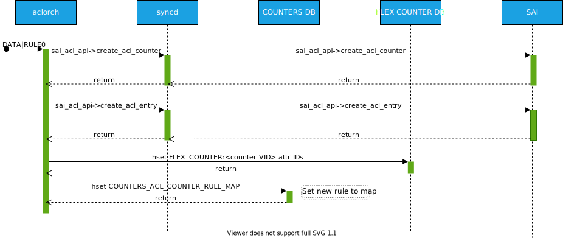
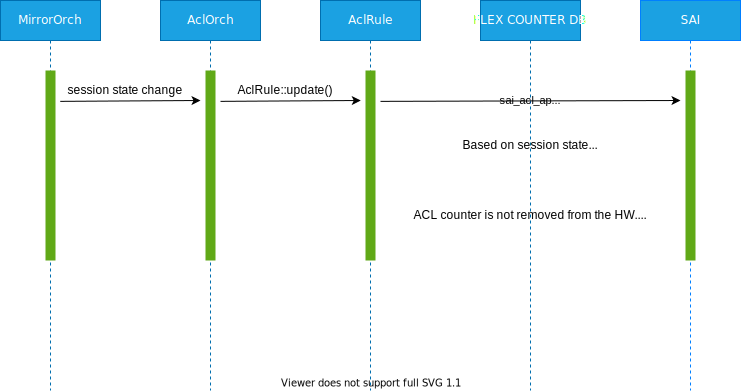

<!-- omit in toc -->
# ACL Flex Counters Support #

<!-- omit in toc -->
## Table of Content
- Revision
- Scope
- Definitions/Abbreviations
- Overview
- Requirements
- Architecture Design
- High-Level Design
- SAI
- Orchagent
- Syncd
- COUNTERS DB
- CLI
- Flows
- Create ACL rule
- Delete ACL rule
- ACL counter registration in FC
- ACL counter de-registration in FC
- Mirror flow enhancement
- SAI API
- Configuration and management
  - CLI/YANG model Enhancements
  - Config DB Enhancements
- Warmboot and Fastboot Design Impact
- Restrictions/Limitations
- Testing Requirements/Design
  - Unit Test cases
  - System Test cases
- Open/Action items

### Revision

| Rev |     Date    |       Author       | Change Description                |
|:---:|:-----------:|:------------------:|-----------------------------------|
| 0.1 |             | Stepan Blyshchak   | Initial version                   |

### Scope

The scope of this document covers ACL rule counters support and enhancements in that area.
This document does not cover a reasonable option to create ACL rules without counters as
it may be that ACL rule counters consume additional ASIC resources that might or might not be
required for the end user. This feature is beyond the scope of this document. This design does
not change the existing user experience for ACL functionality.

### Definitions/Abbreviations 

| Definitions/Abbreviation | Description                                |
|--------------------------|--------------------------------------------|
| ACL                      | Access Control List                        |
| API                      | Application Programmable Interface         |
| Everflow                 | ERSPAN (Encapsulated Remote Switched Port Analysis) mirroring |
| FC                       | Flex Counter                               | 
| VID                      | SAIRedis Virtual object identifier |
| RID                      | SAI Real object identifier |
| SAI                      | Switch Abstraction Interface               |

### Overview 

The current design of ACL rule counters implements polling at orchagent side at a constant hardcoded interval of 10 seconds.
While it is a simpler approach comparing to Flex Counters infrastructure it comes at a cost of scalability and performance issues.
Considering that orchagent is single threaded a pretty small amount of ACL rules in comparison to ASIC capabilities may take a while
to poll counters for lot more than 10 seconds and blocking orchagent from performing other tasks. This leads to a problem that orchagent
is always busy collecting counters for ACLs and slow responses to other tasks.

Flex counters infrastructure on another hand already used for port, PG, queue, watermark counters solves this issue by delegating counter
polling to a separate thread in syncd and allowing to configure polling interval as well.

### Requirements

- Free up orchagent queue when lots of ACL rules are configured by delegating counters polling to Flex Counters thread in syncd.
- Support enabling and disabling polling based on user configuration and ```counterpoll``` CLI for it.
- Support changing polling interval in range [1-1000] sec and ```counterpoll``` CLI for it.

### Architecture Design 

No SONiC architecture changes are required as an existing flex counter infrastructure is being used.

<p align=center>

</p>

### High-Level Design

### SAI

Unlike port, PG, queue, etc. ACL counters are separate SAI objects of type SAI_OBJECT_TYPE_ACL_COUNTER that are bound to an ACL rule object of type
SAI_OBJECT_TYPE_ACL_ENTRY that orchagent creates with two attributes that are being queried:

| SAI Attribute                | Description 
|------------------------------|----------------------|
| SAI_ACL_COUNTER_ATTR_PACKETS | Get/set packet count | 
| SAI_ACL_COUNTER_ATTR_BYTES   | Get/set byte count   |

These objects as well as ACL rule are dynamic, thus at runtime they might be added or removed so the flex counter manager has to take it into consideration.

### Orchagent

A new type of FC is added to flex_counter/flex_counter_manager.h against its SAI object and a new FC group named "ACL" is added:

Counter Type:
```c++
CounterType::ACL_COUNTER
```

An ACL orchagent holds a new object of type FlexCounterManager and initialized with ```StatsMode::READ```
and a default polling interval of 10 sec enabled by default:
```c++
FlexCounterManager m_acl_fc_mgr;
```

Although these changes are enough to configure FC in syncd for polling at a certain interval its barely usable for CLI to consume
because of two reasons:
1. ACL counter is separate SAI object and needs to be mapped to ACL table name and ACL rule name.
2. ACL rule may be created and removed in the hardware depending on the rule type and state in the network.
   One such example is a mirroring rule. A mirror rule can only exists if a mirror session is created/active.
   Orchagent internally removes ACL mirror rule on session deactivation and creates it when the corresponding
   session is activated. That means an ACL counter will be recreated as well and the counter will reset, however
   it is not intended that ACL rule counter will reset upon session state change. A cache is required to hold an
   old counter values and sum them with the newly created one. The solution to this problem is to not remove the
   ACL rule counter but detach it from the ACL rule.

### Syncd

ACL FC group support in syncd/FlexCounter.cpp.

### COUNTERS DB

Counters table in COUNTERS DB:

- "COUNTERS:oid:<acl_counter_vid>"
  - key: SAI_ACL_COUNTER_ATTR_PACKETS
  - value: Number of packets passed through this rule
  - key: SAI_ACL_COUNTER_ATTR_BYTES
  - value: Number of bytes passed through this rule

```
127.0.0.1:6379[2]> hgetall COUNTERS:oid:0x100000000037a
 1) "SAI_ACL_COUNTER_ATTR_PACKETS"
 2) "100"
 3) "SAI_ACL_COUNTER_ATTR_BYTES"
 4) "102400"
```

Mapping hash table in COUNTERS_DB:

- "COUNTERS_ACL_COUNTER_RULE_MAP"
  - key: ACL table name and ACL rule name separated COUNTERS DB separator (e.g: "L3_TABLE:RULE0")
  - value: VID of the ACL counter

E.g:

```
127.0.0.1:6379[2]> hgetall COUNTERS_ACL_COUNTER_RULE_MAP
 1) "L3_TABLE:RULE0"
 2) "oid:0x100000000037a"
```

### CLI

*aclshow* utility is modified to read counters from COUNTERS DB using ACL_RULE table in CONFIG DB and COUNTERS_ACL_COUNTER_RULE_MAP in COUNTERS DB.
Utility reads all ACLs from ACL_RULE table, uses the map to get the VID of the ACL counter object and gets the counter values
from COUNTERS DB. If the map is missing an entry for the rule it either means that ACL rule was created without counter (which
is not supported right now, but might be possible in the future) or we hit a condition when orchagent hasn't yet created the rule or the entry in the
map. In both cases utility displays N/A. In case the COUNTERS DB is missing a VID that exists in the rule the utilitity displays N/A. That means that either polling is disabled for ACL group or syncd haven't yet put any value in COUNTERS DB.

```
admin@sonic:~$ aclshow -a
RULE NAME     TABLE NAME      PRIO    PACKETS COUNT    BYTES COUNT
------------  ------------  ------  ---------------  -------------
RULE_1        DATAACL         9999              101            100
RULE_2        DATAACL         9998              201            200
RULE_3        DATAACL         9997              301            300
RULE_4        DATAACL         9996              401            400
RULE_7        DATAACL         9993              701            700
RULE_9        DATAACL         9991              901            900
RULE_10       DATAACL         9989             1001           1000
DEFAULT_RULE  DATAACL            1                2              1
RULE_6        EVERFLOW        9994              601            600
```

*sonic-clear* utility is extended with the ACL group to clear ACL counters. Counters are dumped into a file under /home/admin and the next time *aclshow* is invoked
it shows the difference between dumped counters and actual from database. This approach makes each user have it's own view on the counters and aligned to other
counter groups.

```
admin@sonic:~$ sonic-clear acl
```

### Flows

### Create ACL rule

<p align=center>

</p>

In case an *error* happened, we roll back, deleting objects with best effort and removing the ACL rule tasks from m_toSync map. An error is printed in the syslog.

### Delete ACL rule

<p align=center>

</p>

In case an *error* happened, we roll back, deleting objects with best effort. An error is printed in the syslog.

### ACL counter registration in FC

<p align=center>

</p>

### ACL counter de-registration in FC

<p align=center>

</p>

### Mirror flow enhancement

ACL counter should not be removed when mirror rule is removed on mirror session deactivation and upon mirror recreation attached back to the rule object.

<p align=center>

</p>

### SAI API

No new SAI API is used.

### Configuration and management 
#### CLI/YANG model Enhancements 
#### Config DB Enhancements  

Enable ACL counter polling:
```
admin@sonic:~$ counterpoll acl enable
```

Disable ACL counter polling (NOTE: ACL counter objects are still configured in HW):
```
admin@sonic:~$ counterpoll acl disable
```

Set ACL counter polling interval:
```
admin@sonic:~$ counterpoll acl interval [INTERVAL IN MS]
```

Config DB schema with ACL key in FLEX COUNTER table:

```json
{
    "FLEX_COUNTER_TABLE": {
        "ACL": {
            "FLEX_COUNTER_STATUS": "enable",
            "POLL_INTERVAL": "10000"
        }
    }
}
```

YANG model with ACL group:

```yang
  container ACL {
      /* ACL_FLEX_COUNTER_GROUP */
      leaf FLEX_COUNTER_STATUS {
          type flex_status;
      }
  }
```

NOTE: YANG is currently not having POLL_INTERVAL field defined.
		
### Warmboot and Fastboot Design Impact  

Counter polling is delayed at system startup.

### Restrictions/Limitations  
N/A

### Testing Requirements/Design  

#### Unit Test cases  

1. Enhance test_flex_counters.py with ACL group
2. Enhance test_acl.py with check for ACL rule mapping and ACL counter OID inserted in FLEX COUNTER DB.
3. Enhance test_mirror.py with the check for ACL rule mapping and ACL counter OID inserted in FLEX COUNTER DB. Cover the flow of deactivation/activating mirror session.
4. Modify aclshow_test.py in sonic-utilities to work with new data source.

#### System Test cases

- ACL/Everflow tests suite in sonic-mgmt covers the ACL counter functionality.
- Warm/Fast reboot tests to check the changes do not break these features.

### Open/Action items

- Can a default FC ACL counter state be disabled in init_cfg.json? Only enabled when generating configuration from minigraph.xml or when performing S2S upgrade in DB migrator?
- In case mirror session goes down, ACL rule is deleted but counters is not to save the counters values. This counter could be deleted from FLEX COUNTER DB to avoid polling it but it will trigger removal of the VID in the COUNTERS DB which we would like to keep.
	- In the current desing it will work just like for PORT, QUEUE, PG counters for port in down state - meaning polling is happening although there is no real point for it.
	- It is more like an optimization for a bad scenario rather then a real optimization. A rule is created to be active and counter to be polled in the first place and there must be enough resources and free CPU time to do that.
	- Current FC infrastructure does not allow to enable/disable polling on per-counter OID basis but keeping the counter value in COUNTERS DB.
