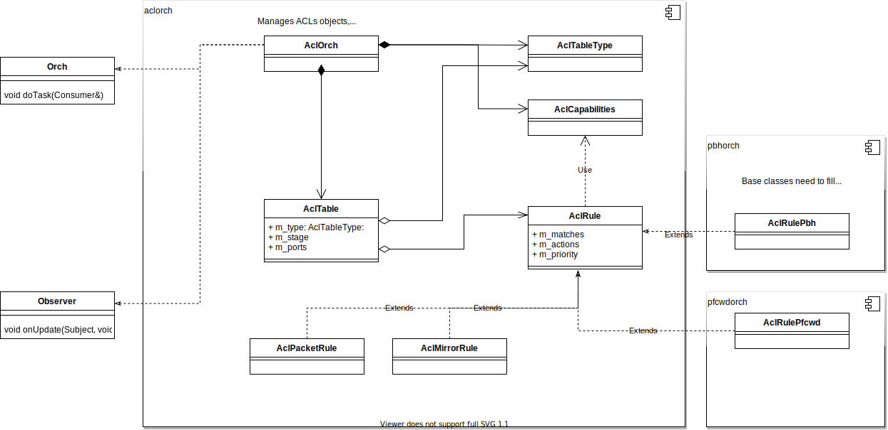

<!-- omit in toc -->
# ACL User Defined Table Type Support #

<!-- omit in toc -->
## Table of Content
- Revision
- Scope
- Definitions/Abbreviations
- Overview
- Requirements
- Architecture Design
- High-Level Design
- SAI
- Orchagent
  - Mirror table type: combined/separated table
  - ACL rule object model
- Syncd
- CONFIG DB
  - Control plane tables
- Initial CONFIG DB
- Flows
  - ACL table type create flow
  - ACL table type update flow
  - ACL table type remove flow
  - ACL rule update flow
- Open questions

### Revision

| Rev |     Date    |       Author       | Change Description                |
|:---:|:-----------:|:------------------:|-----------------------------------|
| 0.1 |             | Stepan Blyshchak   | Initial version                   |

### Definitions/Abbreviations 

| Definitions/Abbreviation | Description                                |
|--------------------------|--------------------------------------------|
| ACL                      | Access Control List                        |
| API                      | Application Programmable Interface         |
| Everflow                 | ERSPAN (Encapsulated Remote Switched Port Analysis) mirroring |
| FC                       | Flex Counter                               | 
| VID                      | SAIRedis Virtual object identifier |
| RID                      | SAI Real object identifier |
| SAI                      | Switch Abstraction Interface               |

### Overview 

The current design of ACL list a predefined set of table types - L3, L3V6, MIRROR, PFC_WD etc.
On every new feature added or on every new use case it is required to update ACL orchagent component with
new table type or modify existing table type. The predefined set of ACL match fields allocated for a particular
table type might also consume more HW resources then a use case requires.

This document addresses this limitation by introducing a new concept of user defined ACL table types in SONiC.

### Requirements

- Introduce a concept of ACL table types to the ACL orch
  - ACLOrch partially implements but current support is limited for predefined ACL table types only
  - ACLOrch's public API to leverage custom table types and use in different orchs (pfcwdorch, pbhorch, macsecorch, etc.)
  - CONFIG DB user interface for defining custom ACL table types

### Scope

The scope of this document covers ACL feature enhancements, in particular the way user creates customized ACL tables
with user defined set of matches, actions if required and bind point types. The way developers use aclorch public API
is also improved to be more flexible for different use cases, such as PFC watchdog, PBH, MACSec, etc. The ACL rule
classes defined in aclorch is also a subject to be changed due to the new concept of custom ACL table types.
CLI nor other user interface is not covered by this document.

### Architecture Design

No SONiC architecture changes are required.

### High-Level Design

### CONFIG DB

ACL table create-only SAI attributes include a list of match fields, bind point types and action list in case it is mandatory
to pass on table creation, which is defined by SAI_SWITCH_ATTR_ACL_STAGE_INGRESS, SAI_SWITCH_ATTR_ACL_STAGE_EGRESS in sai_acl_capability_t structure, field is_action_list_mandatory.

```abnf
key: ACL_TABLE_TYPE:name           ; key of the ACL table type entry. The name is arbitary name user chooses.
; field         = value
matches         = match-list       ; list of matches for this table, matches are same as in ACL_RULE table.
actions         = action-list      ; list of actions for this table, actions are same as in ACL_RULE table.
bind_points     = bind-points-list ; list of bind point types for this table.

; values annotation
match            = 1*64VCHAR
match-list       = [1-max-matches]*match
action           = 1*64VCHAR
action-list      = [1-max-actions]*action
bind-point       = port/lag
bind-points-list = [1-max-bind-points]*bind-point
```

Example:
```json
{
    "ACL_TABLE_TYPE": {
        "L3": {
            "MATCHES": [
                "IN_PORTS",
                "OUT_PORTS",
                "SRC_IP"
            ],
            "ACTIONS": [
                "PACKET_ACTION",
                "MIRROR_INGRESS_ACTION"
            ],
            "BIND_POINTS": [
                "PORT",
                "LAG"
            ]
        }
    },
    "ACL_TABLE": {
        "DATAACL": {
            "STAGE": "INGRESS",
            "TYPE": "L3",
            "PORTS": [
                "Ethernet0",
                "PortChannel1"
            ]
        }
    },
    "ACL_RULE": {
        "DATAACL|RULE0": {
            "PRIORITY": "999",
            "PACKET_ACTION": "DROP",
            "SRC_IP": "1.1.1.1/32",
        }
    }
}
```

Yang container for ACL_TABLE_TYPE table:

```yang
container ACL_TABLE_TYPE {
    list ACL_TABLE_TYPE_LIST {
        key "ACL_TABLE_TYPE_NAME";

        leaf-list MATCHES {
            type string;
        }

        leaf-list ACTIONS {
            type string;
        }

        leaf-list BIND_POINTS {
            type enumeration {
                enum PORT;
                enum LAG;
            }
        }
    }
}
```

#### Control plane tables

Control plane table are moved to its own table in CONFIG DB to not overlap with HW ACL tables.

```json
{
    "CTRL_PLANE_ACL_TABLE": {
        "SSH_ONLY": {
            "policy_desc": "SSH only",
            "services": [
                "SSH"
            ],
            "stage": "ingress"
        }
    }
}
```

### Initial CONFIG DB

The following existing table types defined in init_cfg.json:

- L3
- L3V6
- MIRROR
- MIRRORV6
- MIRRORV4V6
- MIRROR_DSCP
- DTEL_FLOW_WATCHLIST
- DTEL_DROP_WATCHLIST
- MCLAG

The init_cfg.json.j2 creates some table types only for platforms that support a particular feature (like in band telemetry).

### STATE DB

ACL stage capabilities are queried by reading SAI_SWITCH_ATTR_ACL_STAGE_INGRESS and SAI_SWITCH_ATTR_ACL_STAGE_EGRESS
which are published in STATE DB at orchagent initialization.

```abnf
key: ACL_STAGE_CAPABILITY|stage                       ; key of the ACL switch capability.
; field         = value
is_action_list_mandatory = true/false       ; Boolean 
action_list              = action-list      ; list of actions for this table, actions are same as in ACL_RULE table.

; values annotation
stage                    = ingress/egress
action                   = 1*64VCHAR
action-list              = [1-max-actions]*action
```

Example:

```json
127.0.0.1:6379[6]> hgetall ACL_STAGE_CAPABILITY|INGRESS
1) is_action_list_mandatory
2) false
3) action_list
4) PACKET_ACTION,MIRROR_INGRESS_ACTION,REDIRECT_ACTION
```

### Orchagent

The AclOrch is subscribed to a table ```ACL_TABLE_TYPE``` in CFG DB. This table holds a definition for a table with the matches, actions and bind points.

*AclTableType* Data structure:

```c++
struct AclTableType
{
    std::string m_name;
    std::set<sai_acl_bind_point_type_t> m_bpoint_types;
    std::set<sai_attribute_id_t> m_matches;
    std::set<sai_acl_action_type_t> m_acl_actions;
}
```

*AclTable*:

```c++
class AclTable
{
public:
    // ...
    bool validateAddType(const AclTableType& type);
private:
    // ...
    AclTableType m_type;
}
```

Orchagent's AclRule::make_shared makes decision which AclRule child instance to create based on table type.
Since orchagent does not know all the table types there should be single AclRule handling all the matches
and actions and perform validation against the table type configuration.

#### Mirror table type: combined/separated table

Orchagent has a special treatment for tables of type MIRROR and MIRRORV6
based on the ASIC platform it is running on. There is either a "combined" or
"seperated" mode for MIRROR tables.

```
+-------------------+------------------------------+
|                   |   CONFIG DB  |   ASIC DB     |
+-------------------+--------------+---------------+
|  combined         |   MIRROR     | Single mirror |
|                   +--------------+ table in HW   |
|                   |   MIRRORV6   | V4 + V6 keys  |
+-------------------+--------------+---------------+
|  seperated        |   MIRROR     | Mirror V4     |
|                   +--------------+---------------+
|                   |   MIRRORV6   | Mirror V6     |
+-------------------+--------------+---------------+
```

This does not play well with the new concept of user defined table types.
To solve this we have few options:

1. Non backward compatible change: let the CONFIG DB table maps 1:1 in ASIC DB table.
User is able to configure either two tables types, one for IPv4, one for IPv6 or single
with IPv4 and IPv6 keys.

2. Maintaing the current behaviour. Orchagent should have the knowledge to act in either
*combined* or *separeted* mode if the table type is named "MIRROR" or "MIRRORV6". 

3. Put this as a configuration in CONFIG DB. E.g, for certain two table types define "combined_v4_v6_mode". This configuration can come from init_cfg.json at start as well
as default table types.

In this design option 1 is chosen due to transparency and simplicity. The mode is exposed by orchagent in STATE DB by orchagent.

```

127.0.0.1:6379[6]> hgetall SWITCH_CAPABILITY|switch
1) mirror_mode
2) combined
```

The user or controller needs to read this value and decide whether to create two ACL tables for IPv4 and IPv6 (separated) or single ACL table for both IPv4 and IPv6 (combined). 

#### ACL rule object model

Since the ACL rule is now not bound to a table type (e.g could be table type which supports mirror action, packet action and redirect action at the same time)
a single AclRule implementation should account for all. The AclRuleBase holds common implementation to validate, create and remove the rule allowing
other orchs to override the behavior.

<p align=center>

</p>

### Syncd

N/A

### SAI

N/A

### Flows

#### ACL table type create flow

<p align=center>

</p>

#### ACL table type update flow

ACL table type update would mean recreation of ACL table and ACL rules in that table.
Currently orchagent does not support changing ACL table type nor changing a set of matches, actions
and bind points.

#### ACL table type remove flow

ACL table type removal can happen if non of the ACL tables reference it. This validation could be done by YANG
infrastructure. On the orchagent level, orchagent does not remove it from internal cache unless there are no more
tables referencing it.

<p align=center>

</p>

#### ACL rule update flow

Single AclRule implementation handles updates for mirror, in-band telemetry session state changes.

<p align=center>

</p>

### Open questions

- SAI does not allow to disable mirror action as it is not @allowempty
- ACL counters issue: since a rule may have several actions (counter is one of them)
  the counter counts matched packets and not the packets that are mirrored
  and this is behavior change.