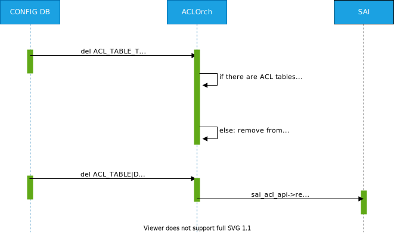

<!-- omit in toc -->
# ACL User Defined Table Type Support #

<!-- omit in toc -->
## Table of Content
- Revision
- Definitions/Abbreviations
- Overview
- Requirements
- Scope
- Architecture Design
- High-Level Design
- CONFIG DB
  - Control plane tables
- Initial CONFIG DB
- STATE DB
- Orchagent
  - Mirror table type: combined/separated table
  - DB migration
  - ACL rule object model
  - ACLOrch public API
- Syncd
- SAI
- Flows
  - ACL table type create flow
  - ACL table type update flow
  - ACL table type remove flow
- Testing
- VS tests
- System tests
- Open questions

### Revision

| Rev |     Date    |       Author       | Change Description                |
|:---:|:-----------:|:------------------:|-----------------------------------|
| 0.1 |             | Stepan Blyshchak   | Initial version                   |

### Definitions/Abbreviations 

| Definitions/Abbreviation | Description                                |
|--------------------------|--------------------------------------------|
| ACL                      | Access Control List                        |
| API                      | Application Programmable Interface         |
| Everflow                 | ERSPAN (Encapsulated Remote Switched Port Analysis) mirroring |
| FC                       | Flex Counter                               | 
| VID                      | SAIRedis Virtual object identifier |
| RID                      | SAI Real object identifier |
| SAI                      | Switch Abstraction Interface               |

### Overview 

The current design of ACL list a predefined set of table types - L3, L3V6, MIRROR, PFC_WD etc.
On every new feature added or on every new use case it is required to update ACL orchagent component with
new table type or modify existing table type. The predefined set of ACL match fields allocated for a particular
table type might also consume more HW resources then a use case requires.

This document addresses this limitation by introducing a new concept of user defined ACL table types in SONiC.

### Requirements

- Introduce a concept of ACL table types to the ACL orch
  - ACLOrch partially implements but current support is limited for predefined ACL table types only
  - ACLOrch's public API to leverage custom table types and use in different orchs (pfcwdorch, pbhorch, macsecorch, etc.)
  - CONFIG DB user interface for defining custom ACL table types

### Scope

The scope of this document covers ACL feature enhancements, in particular the way user creates customized ACL tables
with user defined set of matches, actions if required and bind point types. The way developers use ACLOrch public API
is also improved to be more flexible for different use cases, such as PFC watchdog, PBH, MACSec, etc. The ACL rule
classes defined in ACLOrch is also a subject to be changed due to the new concept of custom ACL table types.

No new CLI nor other user interface for creating custom ACL table types is covered by this document.

Currently supported table types (L3, L3V6, MIRROR, etc.) are still built-in in orchagent as they require special handling,
specifically tables of type MIRROR/MIRRORV6.

### Architecture Design

No SONiC architecture changes are required.

### High-Level Design

### CONFIG DB

ACL table create-only SAI attributes include a list of match fields, bind point types and action list in case it is mandatory
to pass on table creation, which is defined by SAI_SWITCH_ATTR_ACL_STAGE_INGRESS, SAI_SWITCH_ATTR_ACL_STAGE_EGRESS in sai_acl_capability_t structure, field is_action_list_mandatory.

```abnf
key: ACL_TABLE_TYPE:name           ; key of the ACL table type entry. The name is arbitary name user chooses.
; field         = value
matches         = match-list       ; list of matches for this table, matches are same as in ACL_RULE table.
actions         = action-list      ; list of actions for this table, actions are same as in ACL_RULE table.
bind_points     = bind-points-list ; list of bind point types for this table.

; values annotation
match            = 1*64VCHAR
match-list       = [1-max-matches]*match
action           = 1*64VCHAR
action-list      = [1-max-actions]*action
bind-point       = port/lag
bind-points-list = [1-max-bind-points]*bind-point
```

Example:
```json
{
    "ACL_TABLE_TYPE": {
        "CUSTOM_L3": {
            "MATCHES": [
                "IN_PORTS",
                "OUT_PORTS",
                "SRC_IP"
            ],
            "ACTIONS": [
                "PACKET_ACTION",
                "MIRROR_INGRESS_ACTION"
            ],
            "BIND_POINTS": [
                "PORT",
                "LAG"
            ]
        }
    },
    "ACL_TABLE": {
        "DATAACL": {
            "STAGE": "INGRESS",
            "TYPE": "CUSTOM_L3",
            "PORTS": [
                "Ethernet0",
                "PortChannel1"
            ]
        }
    },
    "ACL_RULE": {
        "DATAACL|RULE0": {
            "PRIORITY": "999",
            "PACKET_ACTION": "DROP",
            "SRC_IP": "1.1.1.1/32",
        }
    }
}
```

Yang container for ACL_TABLE_TYPE table:

```yang
container ACL_TABLE_TYPE {
    list ACL_TABLE_TYPE_LIST {
        key "ACL_TABLE_TYPE_NAME";

        leaf ACL_TABLE_TYPE_NAME {
            type string;
        }

        leaf-list MATCHES {
            mandatory true;
            type string;
        }

        leaf-list ACTIONS {
            type string;
            default "";
        }

        leaf-list BIND_POINTS {
            mandatory true;
            type enumeration {
                enum PORT;
                enum LAG;
            }
        }
    }
}
```

ACL_TABLE container change:

```yang
container ACL_TABLE {
    list ACL_TABLE_LIST {
        key "ACL_TABLE_NAME";

        leaf ACL_TABLE_NAME {
            type string;
        }

        leaf type {
            mandatory true;
            type union {
                type leafref {
                    path "/acl:sonic-acl/acl:ACL_TABLE_TYPE/acl:ACL_TABLE_TYPE_LIST/acl:ACL_TABLE_TYPE_NAME";
                }
                type stypes:acl_table_type;
            }
        }
    }
}

```

#### Control plane tables

Control plane table are moved to its own table in CONFIG DB to not overlap with HW ACL tables.

```json
{
    "CTRL_PLANE_ACL_TABLE": {
        "SSH_ONLY": {
            "policy_desc": "SSH only",
            "services": [
                "SSH"
            ],
            "stage": "ingress"
        }
    }
}
```

### Initial CONFIG

Table types that need to be available by default can be defined in the init_cfg.json. Later on some of the pre-defined tables types (L3, L3V6, etc.) in CONFIG DB can be put in init_cfg.json.

### STATE DB

ACL stage capabilities are queried by reading SAI_SWITCH_ATTR_ACL_STAGE_INGRESS and SAI_SWITCH_ATTR_ACL_STAGE_EGRESS
which are published in STATE DB at orchagent initialization.

```abnf
key: ACL_STAGE_CAPABILITY|stage                       ; key of the ACL switch capability.
; field         = value
is_action_list_mandatory = true/false       ; Boolean 
action_list              = action-list      ; list of actions for this table, actions are same as in ACL_RULE table.

; values annotation
stage                    = ingress/egress
action                   = 1*64VCHAR
action-list              = [1-max-actions]*action
```

Example:

```json
127.0.0.1:6379[6]> hgetall ACL_STAGE_CAPABILITY|INGRESS
1) is_action_list_mandatory
2) false
3) action_list
4) PACKET_ACTION,MIRROR_INGRESS_ACTION,REDIRECT_ACTION
```

On table creation, a check is performed by the orchagent to check against the action list and action_list capability as well as is_action_list_mandatory flag.

### Orchagent

The AclOrch is subscribed to a table ```ACL_TABLE_TYPE``` in CFG DB. This table holds a definition for a table with the matches, actions and bind points.

*AclTableType* Data structure:

```c++
struct AclTableType
{
    std::string m_name;
    std::set<sai_acl_bind_point_type_t> m_bpoint_types;
    std::set<sai_attribute_id_t> m_matches;
    std::set<sai_acl_action_type_t> m_acl_actions;
}
```

*AclTable*:

```c++
class AclTable
{
public:
    AclTable(AclOrch *pAclOrch, string id, const AclTableType& type);

    // ...
    bool validateAddType(const AclTableType& type);
    // ...

private:
    // ...
    AclTableType m_type;
    // ...
}
```

Orchagent's AclRule::make_shared makes decision which AclRule child instance to create based on table type.
Since orchagent does not know all the table types there should be single AclRule handling all the matches
and actions and perform validation against the table type configuration.

#### ACL rule object model

Since the ACL rule is not bound to a table type anymore (e.g could be table type which supports mirror action, packet action and redirect action at the same time)
a single AclRule implementation should account for all. The AclRuleBase holds common implementation to validate, create and remove the rule allowing
other orchs to override the behavior.

<p align=center>

</p>

The polymorphism of existing AclRule derivatives AclRuleL3, AclRuleL3V6, etc is in the validation methods.
E.g. AclRuleL3's validateAddMatch() method checks wether the match is one of the L3 table type matches.
This can be consolidated into single generic validate() method that validations ACL Rule configuration
by checking AclRule SAI matches and SAI actions against AclTable SAI attributes.

#### ACLOrch public API

ACL rule base class declaration:

```c++
class AclRule
{
public:
    virtual bool create();
    virtual bool remove();
    virtual bool update(const AclRule& updatedRule);
    virtual bool validate(const AclCapabilities& capabilities);
protected:
    uint32_t m_priority;
    AclEntryAttrMap m_matches;
    AclEntryAttrMap m_actions;
private:
    std::string m_name;
    sai_object_id_t m_oid {SAI_NULL_OBJECT_ID};
    const AclTable& m_table;
};
```

The create/update/remove methods are protected allowing the child classes to be overwritten for custom behavior (like, AclRuleMirror),
but the AclOrch's public API is the only way to create the actual rule, so that the AclOrch will manage AclRule CRM, FC, etc.


ACL Table methods declarations:

```c++
bool addAclTable(shared_ptr<AclTable> aclTable);
bool removeAclTable(string aclTableName);
bool updateAclTable(shared_ptr<AclTable> aclTable);
```

NOTE: Updating ACL table allows only for updating ports bound to it.

ACL Rule methods declaration:
```c++
bool addAclRule(shared_ptr<AclRule> aclRule, string aclTableName);
bool removeAclRule(string aclTableName, string aclRuleName);
bool updateAclRule(shared_ptr<AclRule> updatedAclRule);
```

##### ACL rule update

While add and remove are known and already implemented today in orchagent, update for ACLRule iterates over the diff between old and new
member fields m_matches, m_actions and sets the corresponding attribute of an ACL Rule.

Besides attributes of ACL rule itself, ACL rule owns an ACL counter object and ACL range objects.
By comparing the m_createCounter boolean flag and ranges defined for old and new ACL rule these objects
are removed/created based on the difference calculation.


NOTE: ACL rules coming from CONFIG DB are updated by removal and re-creation, an updateAclRule is mostly used for other orch's use cases.

### CLI

ACL CLI implementation is updated to perform validation of a table type. In this validation, a table type name passed to CLI
is validated against ACL_TABLE_TYPE CONFIG DB table. In addition, a list of actions is validated against STATE DB information.

```
admin@sonic:~$ sudo config acl add table DATAACL L3 --ports Ethernet0,Ethernet4 --stage ingress
```

### Syncd

N/A

### SAI

N/A

### Flows

#### ACL table type create flow

<p align=center>

</p>

#### ACL table type update flow

ACL table type update would mean recreation of ACL table and ACL rules in that table.
Currently orchagent does not support changing ACL table type nor changing a set of matches, actions
and bind points.

#### ACL table type remove flow

ACL table type removal can happen if non of the ACL tables reference it. This validation could be done by YANG
infrastructure. On the orchagent level, orchagent does not remove it from internal cache unless there are no more
tables referencing it.

<p align=center>

</p>

### Testing

### VS tests

- Enhance test_acl.py with a test configuration including table types needed for the rest of the tests (L3, L3V6, etc.).
- Add a new test case to check creating custom table types:
    - Create a ACL table referencing not yet created table type "TEST"
    - Verify no ACL table is created in ASIC DB
    - Create a custom ACL table type "TEST" with the predefined list of matches, actions, bind points
    - Verify ACL table is created in ASIC DB with correct attributes
    - Delete ACL table type "TEST" from CONFIG DB
    - Verify ACL table still exists in ASIC DB
    - Delete ACL table from CONFIG DB
    - Verify no ACL table exists in ASIC DB

### System tests

- Existing ACL/Everflow tests cover default table types coming from init_cfg.json, which means it is covering the flow of creating table types.
- Extend existing ACL/Everflow tests with a fixture to create custom table types that will be a copy of a default onces and run the same test cases.
- Warm/Fast reboot tests to verify the functionality with new changes.

### Open questions

- What kind of level of YANG validation is required?
  - Have matches and actions need to be of enumeration type (needs to be updated every time new match/action is introduced in SONiC) or could it be just of a type of string?
  - Does YANG infrastructure in SONiC supports validation against STATE DB information (e.g. is_action_list_mandatory)?
- Does this feature needs a similar capability table for match fields? What is the SAI API to query it?
  - Currently SAI object API allows to query for an ACL table attributes CREATE, SET, GET operations implementation availability (sai_query_attribute_capability, sai_attr_capability_t),
    but does not tell wether it is supported or not. Can we assume if it is not implemented it is not supported?
