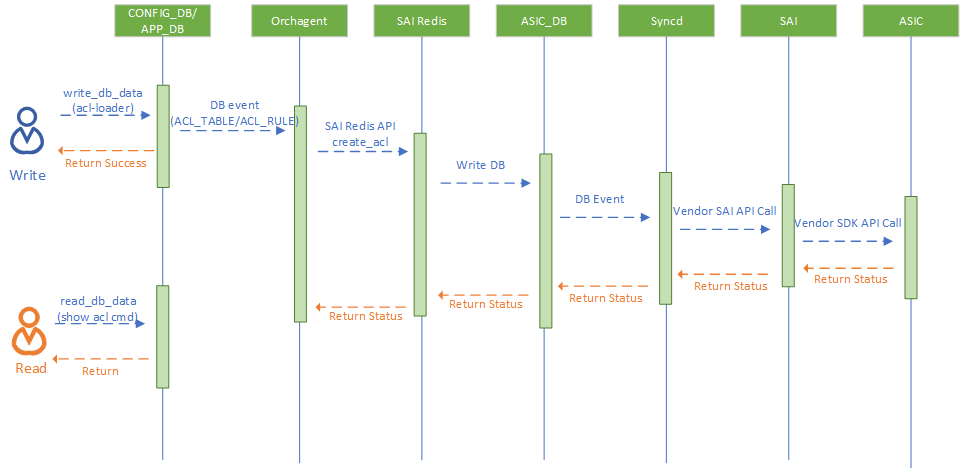
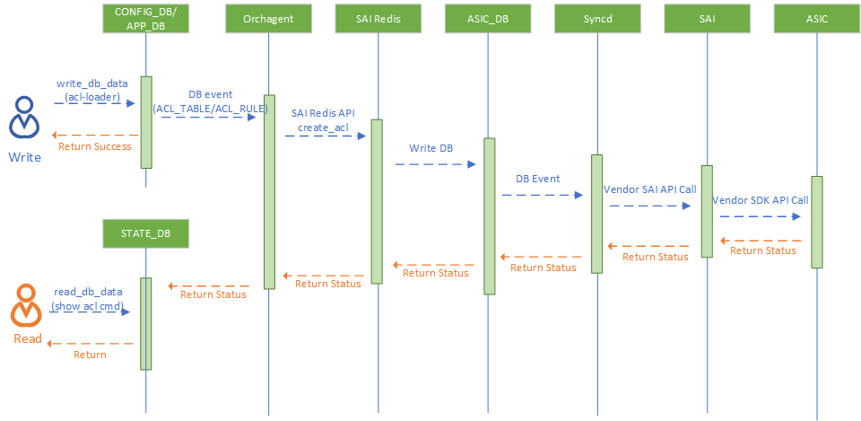

# Enhancements on show acl commands #


### Revision

| Rev |     Date    |       Author       | Change Description                |
|:---:|:-----------:|:------------------:|-----------------------------------|
| 0.1 |  2/6/2023           | Bing Wang   | Initial version                   |
| 0.2 | 3/23/2023   | Bing Wang | Address review comments |

### Scope

The scope of this document covers enhancements on show acl commands, including `show acl table` and `show acl rule`.
Only dataplane ACL is covered in this design. The enhancement of control plane ACL will be covered in another document.

### Definitions/Abbreviations 

| Definitions/Abbreviation | Description                                |
|--------------------------|--------------------------------------------|
| ACL                      | Access Control List                        |

### Overview 

Currently, user puts ACL table and ACL rule configuration into `CONFIG_DB` (or `APP_DB`) by loading a json file with acl-loader, and then acl-loader returns success even if there is no sufficient resource to create the ACL objects. 
<p align=center>

</p>
Moreover, the show commands, including `show acl table` and `show acl rule`, also read the table from `CONFIG_DB` or `APP_DB` directly, even if the ACL table/rule is not configured to ASIC successfully. 
In other word, there is no way to tell whether the creation of ACL table or ACL rule is successful or not.
This design is to improve the show acl commands to add the status of ACL table or ACL rule into the output. In this way, we can tell whether the ACL object is successfully created by checking the output.

### Requirements

- Include the ACL object status in the output of show commands

### Architecture Design 

In current implementation, `orchagent` checks return value from SAI, and writes a log to syslog. 
In the proposed design, we introduce a new table to `STATE_DB`, and `orchagent` will write the return status to the `STATE_DB` table. The user can check the status of ACL table or ACL rule creation with CLI `show acl table` or `show acl rule`.  The `show` command reads the status from `STATE_DB`, and reads configuration from `CONFIG_DB`, and finally combine the status and configuration in the output.

The proposed change doesn't cover the internally added ACL table or ACL rule, such as the ACL table/rule added by PFC handler or Mux handler in dualtor setup. That is because the table/rule is not added by `CONFIG_DB` entries. Hence the show command can't find the corresponding configuration in `CONFIG_DB`. 
<p align=center>

</p>
The workflow of configuring (including add, update and delete) ACL is not changed.
### High-Level Design

### Required change

#### STATE_DB schema
ACL table status
- "ACL_TABLE_TABLE|acl_table_name"
  - key: status
  - value: The status of this ACL table (Active or Inactive)

```
$ redis-cli -n 6 hgetall 'ACL_TABLE_TABLE|DATA_ACL'    
1) "status"
2) "Active"
```
ACL rule status
- "ACL_RULE_TABLE|acl_table_name|acl_rule_name"
  - key: status
  - value: The status of this ACL rule (Active or Inactive)

```
$ redis-cli -n 6 hgetall "ACL_RULE|DATAACL|RULE_1"   
1) "status"
2) "Inactive"
```
#### Orchagent
Add logic in `aclorch` to support writing return status into `STATE_DB`. When ACL table or ACL rule is being deleted, the corresponding entry in `STATE_DB` is also cleared.

#### show command
Update code for `show acl table` and `show acl rule` command.
1. Read status of ACL table or ACL rule from `STATE_DB`
2. Append the status to the current output.

```
$ show acl table DATAACL
Name     Type    Binding      Description    Stage      Status
-------  ------  -----------  -------------  -------    -------
DATAACL  L3      Ethernet0    DATAACL        ingress    Active
                 Ethernet4
                 Ethernet8
                 Ethernet12
```
```
show acl rule
Table    Rule          Priority    Action    Match                Status
-------  ------------  ----------  --------  -------------------  --------
DATAACL  RULE_1        9999        DROP      DST_IP: 9.5.9.3/32   Inactive
                                             ETHER_TYPE: 2048
DATAACL  RULE_2        9998        FORWARD   DST_IP: 10.2.1.2/32  Inactive
                                             ETHER_TYPE: 2048
                                             IP_PROTOCOL: 6
                                             L4_DST_PORT: 22
```
#### Existing test script
The existing test script for ACL in sonic-mgmt is parsing syslog to find a keyword to tell whether the ACL table or ACL rule is created successfully. This logic can be replaced by the new show command. 

		
### Warmboot and Fastboot Design Impact  

The new table in `STATE_DB` doesn't persist during warmboot or fastboot. So there is no impact to warmboot or fastboot.

### Restrictions/Limitations  
N/A

### Testing Requirements/Design  

#### Unit Test cases  

1. Enhance `test_acl.py` to verify the output of show commands.

#### System Test cases

1. Update `test_acl.py`, `test_acl_outer_vlan.py` and `test_custom_acl_table.py` to integrate the new show command

